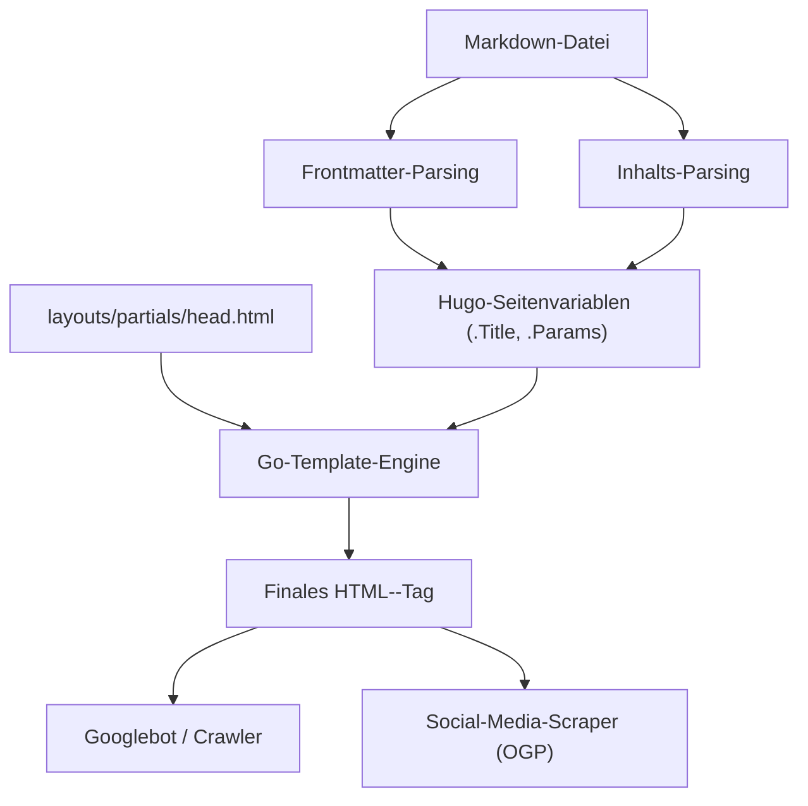
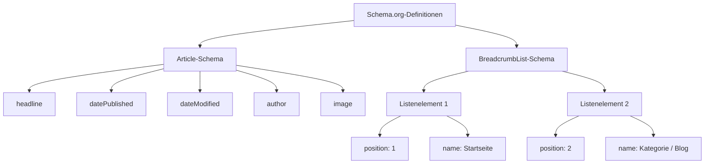

Hugo ist einer der schnellsten statischen Website-Generatoren (SSG) der Welt, geschrieben in Go. Aufgrund seiner überwältigenden Build-Geschwindigkeit und seines flexiblen Vorlagensystems wird es von vielen Entwicklern und Bloggern sehr geschätzt. Die Tatsache allein, dass eine Website schnell generiert und angezeigt wird, reicht jedoch nicht aus, um von Suchmaschinen (wie Google oder Bing) hoch bewertet zu werden und die Artikel den Nutzern zugänglich zu machen.

Um das Suchranking zu verbessern, die Verbreitung in den sozialen Medien zu erhöhen und dadurch die Zugriffe auf den Blog drastisch zu steigern, sind sorgfältige SEO-Maßnahmen (Suchmaschinenoptimierung) unerlässlich. Das Herzstück der SEO in Hugo ist das Zusammenspiel zwischen dem **Frontmatter**, das am Anfang jedes Markdown-Artikels geschrieben wird, und den **Templates (Layouts)**, die es interpretieren und als Metadaten in das `<head>`-Tag des HTML-Dokuments einfügen.

In diesem Artikel erklären wir detailliert in einem überwältigenden Umfang von mehr als 10.000 Zeichen, wie Sie die Funktionen von Hugo maximieren und fortschrittliche SEO-Maßnahmen implementieren können – von den Frontmatter-Einstellungen über verschiedene Meta-Tags, OGP (Open Graph Protocol) und Twitter Cards bis hin zur Ausgabe strukturierter Daten mit JSON-LD.

---

## 1. Der mathematische Hintergrund von SEO und Traffic

Bevor wir auf die konkrete Implementierung eingehen, lassen Sie uns mathematisch verstehen, warum detaillierte SEO-Metadaten so wichtig sind. Der Suchtraffic $T$, den eine Website erhalten kann, wird durch das Suchvolumen des Ziel-Keywords und die auf dem Suchranking basierende Klickrate (CTR) bestimmt.

Mathematisch ausgedrückt sieht dies wie folgt aus:

$$ T = \sum_{i=1}^{n} V_i \times CTR(R_i) $$

- $V_i$ : Monatliches Suchvolumen für Keyword $i$
- $R_i$ : Suchranking für Keyword $i$
- $CTR(R_i)$ : Klickrate beim Ranking $R_i$

Dabei hängt das Suchranking $R_i$ von vielen Faktoren wie der Qualität des Inhalts und Backlinks (PageRank) ab. Der frühe PageRank-Algorithmus von Google wird jedoch wie folgt modelliert:

$$ PR(u) = \frac{1-d}{N} + d \sum_{v \in B(u)} \frac{PR(v)}{L(v)} $$

- $PR(u)$ : PageRank von Seite $u$
- $d$ : Dämpfungsfaktor (normalerweise 0,85)
- $B(u)$ : Menge der Seiten, die auf Seite $u$ verlinken
- $L(v)$ : Anzahl der ausgehenden Links von Seite $v$

Wichtig ist hierbei, dass **zusätzlich zu den Bemühungen, das Suchranking $R_i$ zu erhöhen, die Klickrate $CTR(R_i)$ maximiert werden muss**. Durch die Optimierung des Titels und des Snippets (Description), die in den Suchergebnissen (SERPs) angezeigt werden, sowie des Eyecatcher-Bildes (OGP), wenn der Beitrag in sozialen Medien geteilt wird, kann die $CTR(R_i)$ gezielt gesteigert werden. Die SEO-Einstellungen im Frontmatter sind direkt mit dieser Maximierung der $CTR$ verbunden.

---

## 2. Der Build-Prozess von Hugo und die Rolle des Frontmatters

Hugo liest das Frontmatter (YAML/TOML/JSON) in den Markdown-Dateien und übergibt es als Seitenvariablen an die Template-Engine. Lassen Sie uns zunächst diesen Informationsfluss visuell nachvollziehen.



Auf diese Weise werden die im Frontmatter festgelegten Werte als Variablen wie `.Title` und `.Params.description` an `head.html` übergeben und als endgültige HTML-Metadaten ausgegeben. Daher besteht der SEO-Erfolg aus zwei Schritten: "Definition der richtigen Informationen im Frontmatter" und "Korrekte Konvertierung in HTML durch das Template".

---

## 3. Grundlegende Metadaten-Einstellungen: Title, Description, Canonical URL

Die grundlegendsten Tags für Suchmaschinen zum Verständnis des Seiteninhalts sind `<title>` und `<meta name="description">`. Darüber hinaus ist auch `<link rel="canonical">` unerlässlich, um Abstrafungen für doppelten Content (Duplicate Content) zu vermeiden.

### 3.1. Beispiel für Frontmatter-Einstellungen

Im Frontmatter des Artikels bereiten wir spezielle Felder für SEO vor.

```yaml
---
title: 'Hugo Blog SEO: Frontmatter-Einstellungen, die Ihre Besucherzahlen drastisch erhöhen'
seo_title: 'Hugo SEO-Leitfaden: Traffic-Steigerung durch Frontmatter' # Option: Für Suchmaschinen
description: 'Fortgeschrittene SEO-Techniken mit Hugo-Frontmatter. Detaillierte Anleitung zu OGP, JSON-LD und Metadaten-Einstellungen.'
slug: "hugo-seo-frontmatter-tips"
canonicalUrl: "https://example.com/post/hugo-seo-frontmatter-tips/" # Explizite kanonische URL
---
```

### 3.2. Implementierung von `layouts/partials/head.html`

Wir erstellen ein HTML-Template, um diese Variablen korrekt auszugeben.

```html
<!-- Titel-Optimierung -->
{{ $title := .Title }}
{{ if .Params.seo_title }}
  {{ $title = .Params.seo_title }}
{{ end }}
<title>{{ $title }} | {{ .Site.Title }}</title>

<!-- Description-Optimierung -->
{{ $description := .Summary | plainify | truncate 120 }}
{{ if .Params.description }}
  {{ $description = .Params.description }}
{{ end }}
<meta name="description" content="{{ $description }}">

<!-- Canonical URL (Normalisierung) -->
{{ $canonical := .Permalink }}
{{ if .Params.canonicalUrl }}
  {{ $canonical = .Params.canonicalUrl }}
{{ end }}
<link rel="canonical" href="{{ $canonical }}">

<!-- Roboter-Steuerung (z.B. Indexierungsverbot) -->
{{ if .Params.noindex }}
<meta name="robots" content="noindex, nofollow">
{{ else }}
<meta name="robots" content="index, follow">
{{ end }}
```

Durch die Verwendung von Hugos `.Summary` als Fallback kann automatisch der Einleitungstext des Artikels extrahiert werden, auch wenn die `description` nicht festgelegt ist.

---

## 4. OGP und Twitter Cards: Maximierung der CTR in sozialen Medien

Damit ein Artikel beim Teilen in sozialen Netzwerken wie Twitter (X) oder Facebook in einem ansprechenden Kartenformat angezeigt wird, sind Einstellungen für das Open Graph Protocol (OGP) und Twitter Cards unerlässlich. Auch diese werden dynamisch aus dem Frontmatter generiert.

### 4.1. Herausforderungen mit den integrierten Templates

Hugo verfügt über ein praktisches integriertes Template namens `{{ template "_internal/opengraph.html" . }}`, das jedoch wenig anpassbar ist und in einigen Fällen bestimmten Anforderungen oder Sprachumgebungen nicht gerecht wird. Daher wird dringend empfohlen, eigene OGP-Tags innerhalb von `head.html` zu implementieren.

### 4.2. Bildspezifikation im Frontmatter

```yaml
---
image: "img/eyecatch.jpg"
images:
  - "img/eyecatch-large.jpg" # Für die Angabe mehrerer Bilder oder absolute Pfade
---
```

### 4.3. Code für die eigene Implementierung von OGP und Twitter Cards

```html
<!-- Open Graph Protocol -->
<meta property="og:title" content="{{ $title }}">
<meta property="og:description" content="{{ $description }}">
<meta property="og:type" content="{{ if .IsPage }}article{{ else }}website{{ end }}">
<meta property="og:url" content="{{ .Permalink }}">
<meta property="og:site_name" content="{{ .Site.Title }}">

<!-- OGP-Image-Auflösung -->
{{ $ogImage := "" }}
{{ if .Params.image }}
  {{ $ogImage = .Params.image | absURL }}
{{ else if .Params.images }}
  {{ $ogImage = index .Params.images 0 | absURL }}
{{ else if .Site.Params.defaultImage }}
  {{ $ogImage = .Site.Params.defaultImage | absURL }}
{{ end }}

{{ if $ogImage }}
<meta property="og:image" content="{{ $ogImage }}">
<meta name="twitter:image" content="{{ $ogImage }}">
<meta name="twitter:card" content="summary_large_image">
{{ else }}
<meta name="twitter:card" content="summary">
{{ end }}

<!-- Twitter Cards -->
<meta name="twitter:title" content="{{ $title }}">
<meta name="twitter:description" content="{{ $description }}">
{{ if .Site.Params.twitterAccount }}
<meta name="twitter:site" content="@{{ .Site.Params.twitterAccount }}">
{{ end }}
```

Durch das Zwischenschalten der `absURL`-Funktion werden relativ angegebene Bild-URLs in absolute Pfade konvertiert. Da für OGP absolute Pfade erforderlich sind, ist dieser Vorgang äußerst wichtig.

---

## 5. Implementierung strukturierter Daten (JSON-LD)

In der heutigen SEO ist **JSON-LD (JavaScript Object Notation for Linked Data)** die Mainstream-Technologie, um Suchmaschinen die semantische Struktur einer Seite genau zu vermitteln. Die Konfiguration hiervon erhöht die Wahrscheinlichkeit, dass Rich Snippets (Sternebewertungen, Autorennamen, Veröffentlichungsdatum usw.) in den Suchergebnissen angezeigt werden.

### 5.1. Struktur von JSON-LD

Bei Blogartikeln implementieren wir hauptsächlich zwei Schemata: das `Article` (Artikel)-Schema und das `BreadcrumbList` (Brotkrümelnavigation)-Schema.



### 5.2. JSON-LD-Generierung im Hugo-Template

Unter Verwendung von Variablen aus dem Frontmatter wie `.Date` und `.Lastmod` wird JSON-LD dynamisch ausgegeben. Dies wird mit dem `<script type="application/ld+json">`-Tag in der `head.html` notiert.

```html
{{ if .IsPage }}
<script type="application/ld+json">
{
  "@context": "https://schema.org",
  "@type": "Article",
  "mainEntityOfPage": {
    "@type": "WebPage",
    "@id": "{{ .Permalink }}"
  },
  "headline": "{{ .Title | htmlEscape }}",
  "description": "{{ $description | htmlEscape }}",
  "image": "{{ $ogImage }}",
  "datePublished": "{{ .Date.Format "2006-01-02T15:04:05-07:00" }}",
  "dateModified": "{{ .Lastmod.Format "2006-01-02T15:04:05-07:00" }}",
  "author": {
    "@type": "Person",
    "name": "{{ if .Params.author }}{{ .Params.author }}{{ else }}{{ .Site.Params.author }}{{ end }}"
  },
  "publisher": {
    "@type": "Organization",
    "name": "{{ .Site.Title }}",
    "logo": {
      "@type": "ImageObject",
      "url": "{{ .Site.Params.logo | absURL }}"
    }
  }
}
</script>

<!-- BreadcrumbList Schema -->
<script type="application/ld+json">
{
  "@context": "https://schema.org",
  "@type": "BreadcrumbList",
  "itemListElement": [
    {
      "@type": "ListItem",
      "position": 1,
      "name": "Home",
      "item": "{{ .Site.BaseURL }}"
    }
    {{ $position := 2 }}
    {{ range .Params.categories }}
    ,{
      "@type": "ListItem",
      "position": {{ $position }},
      "name": "{{ . }}",
      "item": "{{ "categories/" | relLangURL }}{{ . | urlize | lower }}/"
    }
    {{ $position = add $position 1 }}
    {{ end }}
    ,{
      "@type": "ListItem",
      "position": {{ $position }},
      "name": "{{ .Title | htmlEscape }}",
      "item": "{{ .Permalink }}"
    }
  ]
}
</script>
{{ end }}
```

Beim Ersetzen von Zeichenfolgen innerhalb von JSON-LD ist es wichtig, `htmlEscape` (oder `jsonify`) zu verwenden, um zu verhindern, dass doppelte Anführungszeichen beschädigt werden. Dadurch werden JSON-Syntaxfehler vermieden, unabhängig davon, welche Symbole im Frontmatter verwendet werden.

---

## 6. Fortgeschrittene Techniken zur Nutzung des Frontmatters

Zusätzlich zu den grundlegenden SEO-Metadaten bietet das Frontmatter von Hugo Funktionen zur Umsetzung noch fortschrittlicherer SEO-Strategien.

### 6.1. Weiterleitungsverarbeitung über Aliase (Aliases)

Wenn Sie von einem alten Blogdienst zu Hugo migrieren oder die Permalink-Struktur ändern, müssen Zugriffe auf bestehende URLs zu den neuen URLs weitergeleitet werden. Mithilfe des `aliases`-Feldes in Hugo können HTTP-Equiv-Refresh-Seiten (Meta-Redirects) für alte URLs automatisch generiert werden.

```yaml
---
title: 'Neuer Artikeltitel'
slug: "new-seo-post"
aliases:
  - "/old-category/old-seo-post/"
  - "/2020/05/12/seo-tips/"
---
```

### 6.2. Artikel-Ablaufdatum und Zeitplanung (Scheduling)

Bei zeitlich begrenzten Kampagnenartikeln oder Informationen, die mit der Zeit an Wert verlieren, können Sie durch Festlegen eines `expiryDate` sicherstellen, dass sie nach einem bestimmten Datum und einer bestimmten Uhrzeit aus den Build-Ergebnissen ausgeschlossen und nicht mehr auf der Website angezeigt werden (sodass ein 404-Fehler zurückgegeben wird). Dies verhindert, dass alte Inhalte von geringer Qualität im Index verbleiben und die Gesamtbewertung der Website herabsetzen.

```yaml
---
title: 'Exklusive SEO-Techniken für 2026'
publishDate: "2026-01-01T00:00:00Z"
expiryDate: "2026-12-31T23:59:59Z"
---
```

---

## 7. Website-Leistung und Core Web Vitals

In der SEO ist die **Seitenladezeit** genauso wichtig wie die Optimierung von Tags. Google bezieht die Core Web Vitals (LCP, FID/INP, CLS) als Ranking-Faktoren mit ein.

Da Hugo eine statische Website ist, ist die TTFB (Time to First Byte) von Natur aus hervorragend, aber bei Blogs, die viele Bilder verwenden, ist eine Bildoptimierung unerlässlich. Durch die Kombination von Hugos leistungsstarken Bildverarbeitungsfunktionen (Image Processing) mit dem Frontmatter können Konvertierungen in Next-Gen-Formate (wie WebP) und Größenänderungen während des Builds automatisiert werden.

Beispielsweise können Sie einen Shortcode erstellen, der auf der Vorlagenseite automatisch ein WebP-Bild aus dem im Frontmatter angegebenen Bildpfad generiert. Dadurch kann die SEO-Bewertung dramatisch gesteigert werden.

---

## 8. Zusammenfassung

Beim Betrieb eines Blogs mit Hugo ist das Frontmatter nicht nur eine "Aufzählung von Einstellungswerten", sondern ein "Bedienfeld" für die Interaktion mit Suchmaschinen und sozialen Netzwerken.

Durch die vollständige Umsetzung der in diesem Artikel erläuterten Punkte wird das SEO-Fundament Ihres Blogs stark.

1. **Dynamische Generierung grundlegender Metadaten**: Zuverlässige Ausgabe von Title, Description und Canonical-URL.
2. **Optimierung für das Teilen in sozialen Medien**: CTR-Steigerung durch benutzerdefinierte Implementierung von OGP und Twitter Cards.
3. **Vollständige Unterstützung für strukturierte Daten**: Unterstützung von Rich Results durch JSON-LD (Article, Breadcrumb).
4. **Erweitertes Traffic-Management**: Weiterleitungen über Aliase und Roboter-Steuerung mithilfe von Meta-Tags.

Obwohl sich die Suchmaschinenalgorithmen täglich weiterentwickeln, bleibt das grundlegende Prinzip von SEO unverändert: Signale bereitzustellen, die Suchmaschinen helfen, "den Inhalt der Seite richtig zu verstehen". Durch das Meistern von Hugos flexibler Template-Engine und dem Frontmatter können Sie diese Signale weiterhin in höchster Qualität aussenden und die Zugriffe auf Ihren Blog drastisch steigern.
