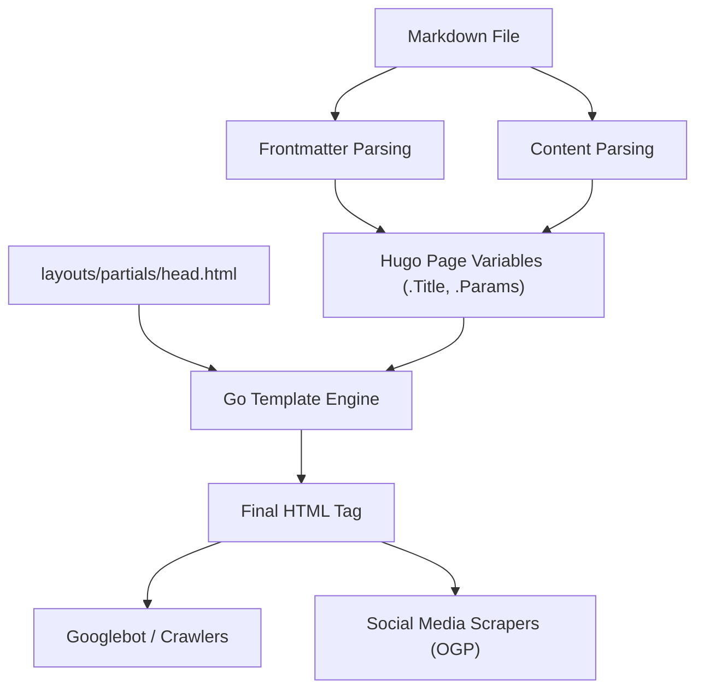
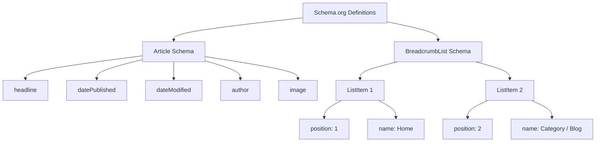

Hugo is one of the world's fastest static site generators (SSG) written in Go. Its overwhelming build speed and flexible template system have garnered high support from many engineers and bloggers. However, simply generating and displaying a site quickly is not enough to be highly evaluated by search engines (like Google or Bing) and deliver articles to users.

To improve search rankings, increase diffusion power on social media, and consequently dramatically increase blog traffic, meticulous SEO (Search Engine Optimization) measures are essential. The heart of SEO in Hugo is the integration of the **Frontmatter**, which is written at the beginning of each markdown article, and the **Layouts** (templates), which interpret it and expand metadata into the `<head>` tag of the HTML.

In this article, we will thoroughly explain in an overwhelming volume of over 10,000 characters how to maximize Hugo's functions and implement advanced SEO measures, ranging from frontmatter settings to various meta tags, OGP (Open Graph Protocol), Twitter Cards, and outputting structured data using JSON-LD.

---

## 1. Mathematical Background of SEO and Traffic

Before diving into specific implementations, let's mathematically understand why detailed SEO metadata is important. The search traffic $T$ that a website can acquire is determined by the search volume of the target keyword and the Click-Through Rate (CTR) based on the search ranking.

This can be expressed by the following formula:

$$ T = \sum_{i=1}^{n} V_i \times CTR(R_i) $$

- $V_i$ : Monthly search volume for keyword $i$
- $R_i$ : Search ranking for keyword $i$
- $CTR(R_i)$ : Click-Through Rate at ranking $R_i$

Among these, the search ranking $R_i$ depends on many factors such as content quality and backlinks (PageRank), but Google's early PageRank algorithm is modeled as follows:

$$ PR(u) = \frac{1-d}{N} + d \sum_{v \in B(u)} \frac{PR(v)}{L(v)} $$

- $PR(u)$ : PageRank of page $u$
- $d$ : Damping factor (usually 0.85)
- $B(u)$ : Set of pages linking to page $u$
- $L(v)$ : Number of outbound links from page $v$

What's important here is **how to maximize the click-through rate $CTR(R_i)$ in addition to the effort to raise the search ranking $R_i$**. By optimizing titles and snippets (description) displayed on search results (SERPs) and eyecatch images (OGP) when shared on social media, it is possible to intentionally raise $CTR(R_i)$. SEO settings in frontmatter are directly linked to maximizing this $CTR$.

---

## 2. Hugo's Build Process and the Role of Frontmatter

Hugo reads the frontmatter (YAML/TOML/JSON) in the markdown file and passes it to the template engine as page variables. Let's first understand this flow of information visually.



In this way, the values set in the frontmatter are passed to `head.html` as variables like `.Title` and `.Params.description`, and output as the final HTML metadata. Therefore, SEO success consists of two steps: "defining appropriate information in the frontmatter" and "correctly converting it to HTML with templates".

---

## 3. Basic Metadata Settings: Title, Description, Canonical URL

The most basic tags for search engines to understand page content are `<title>` and `<meta name="description">`. Also, `<link rel="canonical">` is essential to avoid penalties for duplicate content.

### 3.1. Frontmatter Setting Example

We prepare fields specialized for SEO in the article's frontmatter.

```yaml
---
title: "Hugo Blog SEO: Frontmatter Settings to Dramatically Increase Traffic"
seo_title: "Complete Guide to Hugo SEO: Boost Traffic with Frontmatter" # Optional: For search engines
description: 'Advanced SEO techniques utilizing Hugo frontmatter. A detailed explanation of OGP, JSON-LD, and metadata settings.'
slug: "hugo-seo-frontmatter-tips"
canonicalUrl: "https://example.com/post/hugo-seo-frontmatter-tips/" # Explicit canonical URL
---
```

### 3.2. Implementation of `layouts/partials/head.html`

We create an HTML template to correctly output these variables.

```html
<!-- Title optimization -->
{{ $title := .Title }}
{{ if .Params.seo_title }}
  {{ $title = .Params.seo_title }}
{{ end }}
<title>{{ $title }} | {{ .Site.Title }}</title>

<!-- Description optimization -->
{{ $description := .Summary | plainify | truncate 120 }}
{{ if .Params.description }}
  {{ $description = .Params.description }}
{{ end }}
<meta name="description" content="{{ $description }}">

<!-- Canonical URL (Normalization) -->
{{ $canonical := .Permalink }}
{{ if .Params.canonicalUrl }}
  {{ $canonical = .Params.canonicalUrl }}
{{ end }}
<link rel="canonical" href="{{ $canonical }}">

<!-- Robot control (e.g., noindex settings) -->
{{ if .Params.noindex }}
<meta name="robots" content="noindex, nofollow">
{{ else }}
<meta name="robots" content="index, follow">
{{ end }}
```

By using Hugo's `.Summary` as a fallback, even if `description` is not set, the introductory text of the article can be automatically extracted.

---

## 4. OGP and Twitter Cards: Maximizing CTR on Social Media

To display articles in an attractive card format when shared on SNS like Twitter (X) and Facebook, Open Graph Protocol (OGP) and Twitter Cards settings are indispensable. This is also dynamically generated from the frontmatter.

### 4.1. Issues with Built-in Templates

Hugo has a convenient built-in template `{{ template "_internal/opengraph.html" . }}`, but it lacks customizability and may not fit specific requirements or Japanese environments. Therefore, we strongly recommend implementing your own OGP tags within `head.html`.

### 4.2. Specifying Images in Frontmatter

```yaml
---
image: "img/eyecatch.jpg"
images:
  - "img/eyecatch-large.jpg" # For multiple images or absolute paths
---
```

### 4.3. Custom Implementation Code for OGP and Twitter Cards

```html
<!-- Open Graph Protocol -->
<meta property="og:title" content="{{ $title }}">
<meta property="og:description" content="{{ $description }}">
<meta property="og:type" content="{{ if .IsPage }}article{{ else }}website{{ end }}">
<meta property="og:url" content="{{ .Permalink }}">
<meta property="og:site_name" content="{{ .Site.Title }}">

<!-- Resolving OGP Image -->
{{ $ogImage := "" }}
{{ if .Params.image }}
  {{ $ogImage = .Params.image | absURL }}
{{ else if .Params.images }}
  {{ $ogImage = index .Params.images 0 | absURL }}
{{ else if .Site.Params.defaultImage }}
  {{ $ogImage = .Site.Params.defaultImage | absURL }}
{{ end }}

{{ if $ogImage }}
<meta property="og:image" content="{{ $ogImage }}">
<meta name="twitter:image" content="{{ $ogImage }}">
<meta name="twitter:card" content="summary_large_image">
{{ else }}
<meta name="twitter:card" content="summary">
{{ end }}

<!-- Twitter Cards -->
<meta name="twitter:title" content="{{ $title }}">
<meta name="twitter:description" content="{{ $description }}">
{{ if .Site.Params.twitterAccount }}
<meta name="twitter:site" content="@{{ .Site.Params.twitterAccount }}">
{{ end }}
```

By interposing the `absURL` function, an image URL specified by a relative path is converted to an absolute path. Since absolute paths are mandatory in OGP, this process is extremely important.

---

## 5. Implementation of Structured Data (JSON-LD)

In current SEO, **JSON-LD (JavaScript Object Notation for Linked Data)** has become mainstream as a technology to accurately convey the semantic structure of a page to search engines. By setting this up, rich snippets (star ratings, author name, publication date, etc.) are more likely to be displayed in search results.

### 5.1. Structure of JSON-LD

For blog articles, two main schemas are implemented: the `Article` schema and the `BreadcrumbList` schema.



### 5.2. JSON-LD Generation in Hugo Templates

Leverage frontmatter variables like `.Date` and `.Lastmod` to dynamically output JSON-LD. Describe it in `head.html` using the `<script type="application/ld+json">` tag.

```html
{{ if .IsPage }}
<script type="application/ld+json">
{
  "@context": "https://schema.org",
  "@type": "Article",
  "mainEntityOfPage": {
    "@type": "WebPage",
    "@id": "{{ .Permalink }}"
  },
  "headline": "{{ .Title | htmlEscape }}",
  "description": "{{ $description | htmlEscape }}",
  "image": "{{ $ogImage }}",
  "datePublished": "{{ .Date.Format "2006-01-02T15:04:05-07:00" }}",
  "dateModified": "{{ .Lastmod.Format "2006-01-02T15:04:05-07:00" }}",
  "author": {
    "@type": "Person",
    "name": "{{ if .Params.author }}{{ .Params.author }}{{ else }}{{ .Site.Params.author }}{{ end }}"
  },
  "publisher": {
    "@type": "Organization",
    "name": "{{ .Site.Title }}",
    "logo": {
      "@type": "ImageObject",
      "url": "{{ .Site.Params.logo | absURL }}"
    }
  }
}
</script>

<!-- BreadcrumbList Schema -->
<script type="application/ld+json">
{
  "@context": "https://schema.org",
  "@type": "BreadcrumbList",
  "itemListElement": [
    {
      "@type": "ListItem",
      "position": 1,
      "name": "Home",
      "item": "{{ .Site.BaseURL }}"
    }
    {{ $position := 2 }}
    {{ range .Params.categories }}
    ,{
      "@type": "ListItem",
      "position": {{ $position }},
      "name": "{{ . }}",
      "item": "{{ "categories/" | relLangURL }}{{ . | urlize | lower }}/"
    }
    {{ $position = add $position 1 }}
    {{ end }}
    ,{
      "@type": "ListItem",
      "position": {{ $position }},
      "name": "{{ .Title | htmlEscape }}",
      "item": "{{ .Permalink }}"
    }
  ]
}
</script>
{{ end }}
```

When expanding strings within JSON-LD, the key is to use `htmlEscape` (or `jsonify`) to prevent breaking the double quotes. This prevents JSON syntax errors regardless of what symbols are used in the frontmatter.

---

## 6. Advanced Techniques for Utilizing Frontmatter

In addition to basic SEO metadata, Hugo's frontmatter has features to realize more advanced SEO strategies.

### 6.1. Redirect Processing via Aliases

If you have migrated to Hugo from a past blog service or changed the structure of permalinks, you need to redirect access from the old URLs to the new URLs. By using the `aliases` field in Hugo, you can automatically generate HTTP-Equiv refresh (meta redirect) pages for the old URLs.

```yaml
---
title: "New Article Title"
slug: "new-seo-post"
aliases:
  - "/old-category/old-seo-post/"
  - "/2020/05/12/seo-tips/"
---
```

### 6.2. Article Expiration Dates and Scheduling

For limited-time campaign articles or information that loses value as it gets older, setting an `expiryDate` makes it possible to exclude them from the build results and not display them on the site (to return a 404) after a specific date and time. This prevents low-quality, outdated content from remaining in the index and lowering the overall evaluation of the site.

```yaml
---
title: "Exclusive SEO Techniques for 2026"
publishDate: "2026-01-01T00:00:00Z"
expiryDate: "2026-12-31T23:59:59Z"
---
```

---

## 7. Site Performance and Core Web Vitals

In SEO, **page loading speed** is just as important as tag optimization. Google incorporates Core Web Vitals (LCP, FID/INP, CLS) as ranking factors.

Hugo, which is a static site, originally has excellent TTFB (Time to First Byte), but image optimization is mandatory for blogs that use a lot of images. By combining Hugo's powerful Image Processing feature with frontmatter, conversion to Next-gen formats (such as WebP) and resizing can be automated at build time.

For example, you can create a shortcode that automatically generates WebP images on the template side from the image path specified in the frontmatter. This can dramatically increase your SEO evaluation.

---

## 8. Conclusion

In blog operations using Hugo, the frontmatter is not just an "enumeration of configuration values" but a "control panel" for interacting with search engines and SNS.

By completely implementing the following points explained in this article, the SEO foundation of your blog will become solid.

1. **Dynamic Generation of Basic Metadata**: Reliable output of Title, Description, and Canonical.
2. **Optimization of Social Sharing**: CTR improvement through custom implementation of OGP and Twitter Cards.
3. **Full Support for Structured Data**: Rich result support through JSON-LD (Article, Breadcrumb).
4. **Advanced Traffic Management**: Robot control with meta tags and redirects using Aliases.

Search engine algorithms are evolving daily, but the fundamental principle of SEO, which is to provide signals for search engines to "correctly understand the content of the page", remains unchanged. By mastering Hugo's flexible template engine and frontmatter, continue to broadcast those signals with the highest quality, and dramatically increase your blog's traffic.
