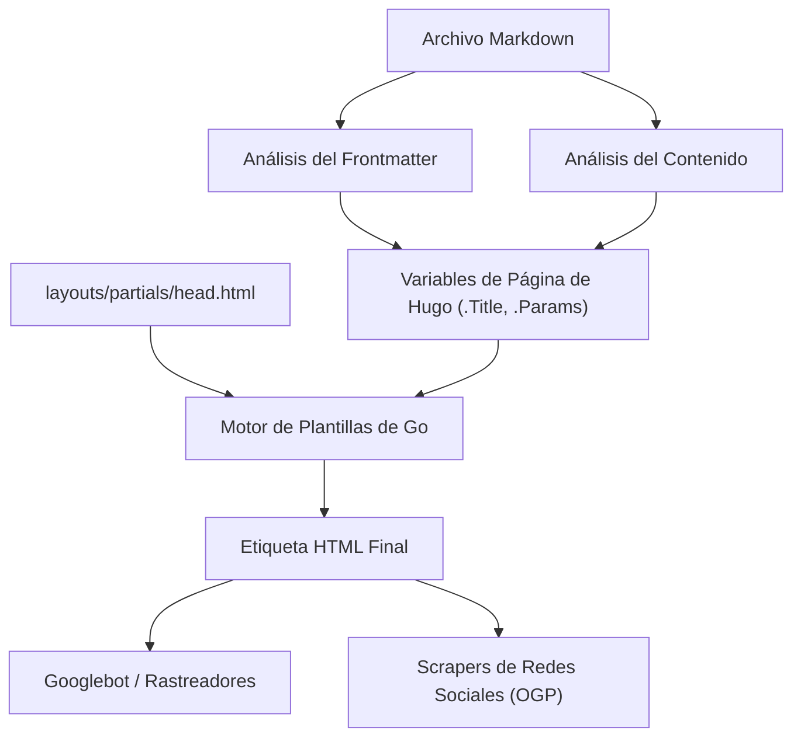
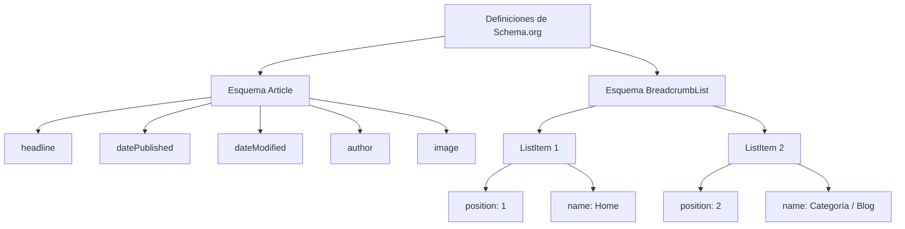

Hugo es uno de los generadores de sitios estáticos (SSG) más rápidos del mundo, escrito en el lenguaje Go. Su abrumadora velocidad de construcción y flexible sistema de plantillas han ganado un inmenso apoyo de muchos ingenieros y blogueros. Sin embargo, el simple hecho de que un sitio se genere y muestre rápidamente no significa que sea altamente valorado por los motores de búsqueda (como Google o Bing) y que los artículos lleguen a los usuarios.

Para mejorar el posicionamiento en búsquedas, aumentar el poder de difusión en redes sociales y, como resultado, aumentar drásticamente el tráfico al blog, es esencial contar con estrategias detalladas de SEO (Optimización para Motores de Búsqueda). El núcleo del SEO en Hugo es la colaboración entre el **frontmatter**, que se escribe al principio de cada artículo en markdown, y las **plantillas (Layouts)**, que lo interpretan para desplegar los metadatos dentro de la etiqueta `<head>` del HTML.

En este artículo, explicaremos exhaustivamente en un volumen abrumador de más de 10,000 caracteres, cómo aprovechar al máximo las características de Hugo e implementar estrategias avanzadas de SEO, desde la configuración del frontmatter, pasando por diversas metaetiquetas, OGP (Open Graph Protocol), Twitter Cards, hasta la salida de datos estructurados utilizando JSON-LD.

---

## 1. Contexto matemático del SEO y el tráfico

Antes de entrar en la implementación específica, comprendamos matemáticamente por qué los metadatos detallados de SEO son importantes. El tráfico de búsqueda $T$ que puede obtener un sitio web está determinado por el volumen de búsqueda de las palabras clave objetivo y el porcentaje de clics (CTR) basado en el ranking de búsqueda.

Esto se puede expresar mediante la siguiente fórmula matemática:

$$ T = \sum_{i=1}^{n} V_i \times CTR(R_i) $$

- $V_i$ : Volumen de búsqueda mensual de la palabra clave $i$
- $R_i$ : Posición en el ranking de búsqueda para la palabra clave $i$
- $CTR(R_i)$ : Porcentaje de clics en la posición $R_i$

De estos, el ranking de búsqueda $R_i$ depende de muchos factores como la calidad del contenido y los enlaces entrantes (PageRank), pero el algoritmo inicial de PageRank de Google se modela de la siguiente manera:

$$ PR(u) = \frac{1-d}{N} + d \sum_{v \in B(u)} \frac{PR(v)}{L(v)} $$

- $PR(u)$ : PageRank de la página $u$
- $d$ : Factor de amortiguación (normalmente 0.85)
- $B(u)$ : Conjunto de páginas que enlazan a la página $u$
- $L(v)$ : Número de enlaces salientes de la página $v$

Lo importante aquí es, **además de los esfuerzos para mejorar el ranking de búsqueda $R_i$, cómo maximizar el porcentaje de clics $CTR(R_i)$**. Al optimizar el título y el fragmento (description) que se muestran en los resultados de búsqueda (SERPs), y la imagen destacada (OGP) cuando se comparte en redes sociales, es posible aumentar intencionalmente el $CTR(R_i)$. La configuración de SEO del frontmatter está directamente relacionada con la maximización de este $CTR$.

---

## 2. Proceso de construcción de Hugo y el papel del Frontmatter

Hugo lee el frontmatter (YAML/TOML/JSON) en los archivos markdown y lo pasa al motor de plantillas como variables de página. Primero entendamos este flujo de información de forma visual.



De esta manera, los valores configurados en el frontmatter se pasan a `head.html` como variables como `.Title` o `.Params.description`, y se emiten como metadatos HTML finales. Por lo tanto, el éxito del SEO consta de dos pasos: "definir la información adecuada en el frontmatter" y "convertirla correctamente a HTML en la plantilla".

---

## 3. Configuración básica de metadatos: Title, Description, Canonical URL

Las etiquetas más básicas para que los motores de búsqueda entiendan el contenido de la página son `<title>` y `<meta name="description">`. Además, `<link rel="canonical">` es esencial para evitar penalizaciones por contenido duplicado.

### 3.1. Ejemplo de configuración del frontmatter

En el frontmatter del artículo, preparamos campos especializados para SEO.

```yaml
---
title: 'Estrategias de SEO para blogs de Hugo: Configuración del Frontmatter para aumentar drásticamente el tráfico'
seo_title: 'Guía Completa de SEO en Hugo: Aumenta tu tráfico con el Frontmatter' # Opcional: Para motores de búsqueda
description: 'Técnicas avanzadas de SEO utilizando el frontmatter de Hugo. Explicamos detalladamente cómo configurar OGP, JSON-LD y metadatos.'
slug: "hugo-seo-frontmatter-tips"
canonicalUrl: "https://example.com/post/hugo-seo-frontmatter-tips/" # URL canónica explícita
---
```

### 3.2. Implementación de `layouts/partials/head.html`

Creamos una plantilla HTML para emitir estas variables correctamente.

```html
<!-- Optimización del título -->
{{ $title := .Title }}
{{ if .Params.seo_title }}
  {{ $title = .Params.seo_title }}
{{ end }}
<title>{{ $title }} | {{ .Site.Title }}</title>

<!-- Optimización de la descripción -->
{{ $description := .Summary | plainify | truncate 120 }}
{{ if .Params.description }}
  {{ $description = .Params.description }}
{{ end }}
<meta name="description" content="{{ $description }}">

<!-- URL Canónica (Normalización) -->
{{ $canonical := .Permalink }}
{{ if .Params.canonicalUrl }}
  {{ $canonical = .Params.canonicalUrl }}
{{ end }}
<link rel="canonical" href="{{ $canonical }}">

<!-- Control de robots (como la configuración noindex) -->
{{ if .Params.noindex }}
<meta name="robots" content="noindex, nofollow">
{{ else }}
<meta name="robots" content="index, follow">
{{ end }}
```

Al usar `.Summary` de Hugo como respaldo (fallback), se puede extraer automáticamente la oración inicial del artículo incluso si `description` no está configurado.

---

## 4. OGP y Twitter Cards: Maximizando el CTR en redes sociales

Para que tu artículo se muestre en un formato de tarjeta atractivo cuando se comparta en redes sociales como Twitter (X) o Facebook, la configuración del protocolo Open Graph (OGP) y Twitter Cards es esencial. Esto también se genera dinámicamente desde el frontmatter.

### 4.1. El problema de las plantillas integradas

Hugo tiene una plantilla incorporada útil llamada `{{ template "_internal/opengraph.html" . }}`, pero carece de personalización y en algunos casos no se adapta al entorno japonés o requisitos específicos. Por lo tanto, se recomienda encarecidamente implementar etiquetas OGP propias dentro de `head.html`.

### 4.2. Especificando imágenes en el frontmatter

```yaml
---
image: "img/eyecatch.jpg"
images:
  - "img/eyecatch-large.jpg" # Para especificar múltiples imágenes o rutas absolutas
---
```

### 4.3. Código de implementación personalizada para OGP y Twitter Cards

```html
<!-- Open Graph Protocol -->
<meta property="og:title" content="{{ $title }}">
<meta property="og:description" content="{{ $description }}">
<meta property="og:type" content="{{ if .IsPage }}article{{ else }}website{{ end }}">
<meta property="og:url" content="{{ .Permalink }}">
<meta property="og:site_name" content="{{ .Site.Title }}">

<!-- Resolución de la imagen OGP -->
{{ $ogImage := "" }}
{{ if .Params.image }}
  {{ $ogImage = .Params.image | absURL }}
{{ else if .Params.images }}
  {{ $ogImage = index .Params.images 0 | absURL }}
{{ else if .Site.Params.defaultImage }}
  {{ $ogImage = .Site.Params.defaultImage | absURL }}
{{ end }}

{{ if $ogImage }}
<meta property="og:image" content="{{ $ogImage }}">
<meta name="twitter:image" content="{{ $ogImage }}">
<meta name="twitter:card" content="summary_large_image">
{{ else }}
<meta name="twitter:card" content="summary">
{{ end }}

<!-- Twitter Cards -->
<meta name="twitter:title" content="{{ $title }}">
<meta name="twitter:description" content="{{ $description }}">
{{ if .Site.Params.twitterAccount }}
<meta name="twitter:site" content="@{{ .Site.Params.twitterAccount }}">
{{ end }}
```

Al pasar por la función `absURL`, las URL de las imágenes especificadas como rutas relativas se convierten en rutas absolutas. Dado que las rutas absolutas son obligatorias en OGP, este proceso es extremadamente importante.

---

## 5. Implementación de datos estructurados (JSON-LD)

En el SEO actual, **JSON-LD (JavaScript Object Notation for Linked Data)** se ha convertido en la tecnología principal para transmitir con precisión la estructura semántica de una página a los motores de búsqueda. Al configurar esto, es más probable que se muestren fragmentos enriquecidos (rich snippets como valoraciones con estrellas, nombre del autor, fecha de publicación, etc.) en los resultados de búsqueda.

### 5.1. Estructura de JSON-LD

Para artículos de blog, se implementan principalmente dos esquemas: el esquema `Article` (Artículo) y el esquema `BreadcrumbList` (Ruta de exploración o Migas de pan).



### 5.2. Generación de JSON-LD en plantillas de Hugo

Utilizamos variables del frontmatter como `.Date` y `.Lastmod` para generar JSON-LD dinámicamente. Lo escribimos en `head.html` usando la etiqueta `<script type="application/ld+json">`.

```html
{{ if .IsPage }}
<script type="application/ld+json">
{
  "@context": "https://schema.org",
  "@type": "Article",
  "mainEntityOfPage": {
    "@type": "WebPage",
    "@id": "{{ .Permalink }}"
  },
  "headline": "{{ .Title | htmlEscape }}",
  "description": "{{ $description | htmlEscape }}",
  "image": "{{ $ogImage }}",
  "datePublished": "{{ .Date.Format "2006-01-02T15:04:05-07:00" }}",
  "dateModified": "{{ .Lastmod.Format "2006-01-02T15:04:05-07:00" }}",
  "author": {
    "@type": "Person",
    "name": "{{ if .Params.author }}{{ .Params.author }}{{ else }}{{ .Site.Params.author }}{{ end }}"
  },
  "publisher": {
    "@type": "Organization",
    "name": "{{ .Site.Title }}",
    "logo": {
      "@type": "ImageObject",
      "url": "{{ .Site.Params.logo | absURL }}"
    }
  }
}
</script>

<!-- Esquema BreadcrumbList -->
<script type="application/ld+json">
{
  "@context": "https://schema.org",
  "@type": "BreadcrumbList",
  "itemListElement": [
    {
      "@type": "ListItem",
      "position": 1,
      "name": "Home",
      "item": "{{ .Site.BaseURL }}"
    }
    {{ $position := 2 }}
    {{ range .Params.categories }}
    ,{
      "@type": "ListItem",
      "position": {{ $position }},
      "name": "{{ . }}",
      "item": "{{ "categories/" | relLangURL }}{{ . | urlize | lower }}/"
    }
    {{ $position = add $position 1 }}
    {{ end }}
    ,{
      "@type": "ListItem",
      "position": {{ $position }},
      "name": "{{ .Title | htmlEscape }}",
      "item": "{{ .Permalink }}"
    }
  ]
}
</script>
{{ end }}
```

El punto clave al expandir cadenas dentro de JSON-LD es usar `htmlEscape` (o `jsonify`) para evitar que se rompan las comillas dobles. Esto previene errores de sintaxis JSON sin importar qué símbolos se usen en el frontmatter.

---

## 6. Técnicas avanzadas de uso del Frontmatter

Además de los metadatos básicos de SEO, el frontmatter de Hugo cuenta con características para lograr estrategias de SEO aún más avanzadas.

### 6.1. Redireccionamiento mediante Alias (Aliases)

Si migras a Hugo desde un servicio de blog anterior, o si cambias la estructura de los enlaces permanentes (permalinks), necesitas redirigir el tráfico de las URL antiguas a las nuevas. Con el campo `aliases` de Hugo, puedes generar automáticamente páginas de actualización HTTP-Equiv (meta redirecciones) para URL antiguas.

```yaml
---
title: 'Nuevo título del artículo'
slug: "new-seo-post"
aliases:
  - "/old-category/old-seo-post/"
  - "/2020/05/12/seo-tips/"
---
```

### 6.2. Fecha de caducidad y programación de artículos

Para artículos de campañas por tiempo limitado o información que pierde valor al envejecer, puedes configurar la `expiryDate` para excluirlos de los resultados de construcción después de una fecha y hora específicas, evitando que se muestren en el sitio (devolviendo un error 404). Esto evita que el contenido antiguo y de baja calidad permanezca en el índice y reduzca la calificación general del sitio.

```yaml
---
title: 'Técnicas de SEO exclusivas para 2026'
publishDate: "2026-01-01T00:00:00Z"
expiryDate: "2026-12-31T23:59:59Z"
---
```

---

## 7. Rendimiento del sitio y Core Web Vitals

En SEO, **la velocidad de carga de la página** es tan importante como la optimización de las etiquetas. Google ha incorporado los Core Web Vitals (LCP, FID/INP, CLS) como factores de clasificación.

Hugo, al ser un sitio estático, tiene un excelente TTFB (Time to First Byte) por defecto, pero la optimización de imágenes es esencial en blogs que hacen un uso intensivo de ellas. Al combinar las potentes funciones de procesamiento de imágenes de Hugo (Image Processing) con el frontmatter, puedes automatizar el redimensionamiento y la conversión a formatos de próxima generación (como WebP) durante la construcción (build).

Por ejemplo, puedes crear un shortcode que genere automáticamente imágenes WebP en el lado de la plantilla a partir de la ruta de la imagen especificada en el frontmatter. Esto puede mejorar drásticamente el rendimiento SEO.

---

## 8. Resumen

En la gestión de blogs con Hugo, el frontmatter no es solo "una lista de valores de configuración", sino un "panel de control" para comunicarse con los motores de búsqueda y las redes sociales.

Al implementar completamente los siguientes puntos explicados en este artículo, la base SEO de tu blog será sólida:

1. **Generación dinámica de metadatos básicos**: Salida confiable de Title, Description y Canonical.
2. **Optimización para compartir en redes sociales**: Mejora del CTR mediante la implementación personalizada de OGP y Twitter Cards.
3. **Soporte completo de datos estructurados**: Soporte para resultados enriquecidos (Rich Results) con JSON-LD (Article, Breadcrumb).
4. **Gestión avanzada de tráfico**: Control de robots con metaetiquetas y redirecciones usando Aliases.

Aunque los algoritmos de los motores de búsqueda evolucionan diariamente, el principio fundamental del SEO de proporcionar señales para que los motores de búsqueda "comprendan correctamente el contenido de la página" permanece inalterable. Al dominar el flexible motor de plantillas y el frontmatter de Hugo, continúa enviando esas señales con la más alta calidad y aumenta drásticamente el tráfico de tu blog.
