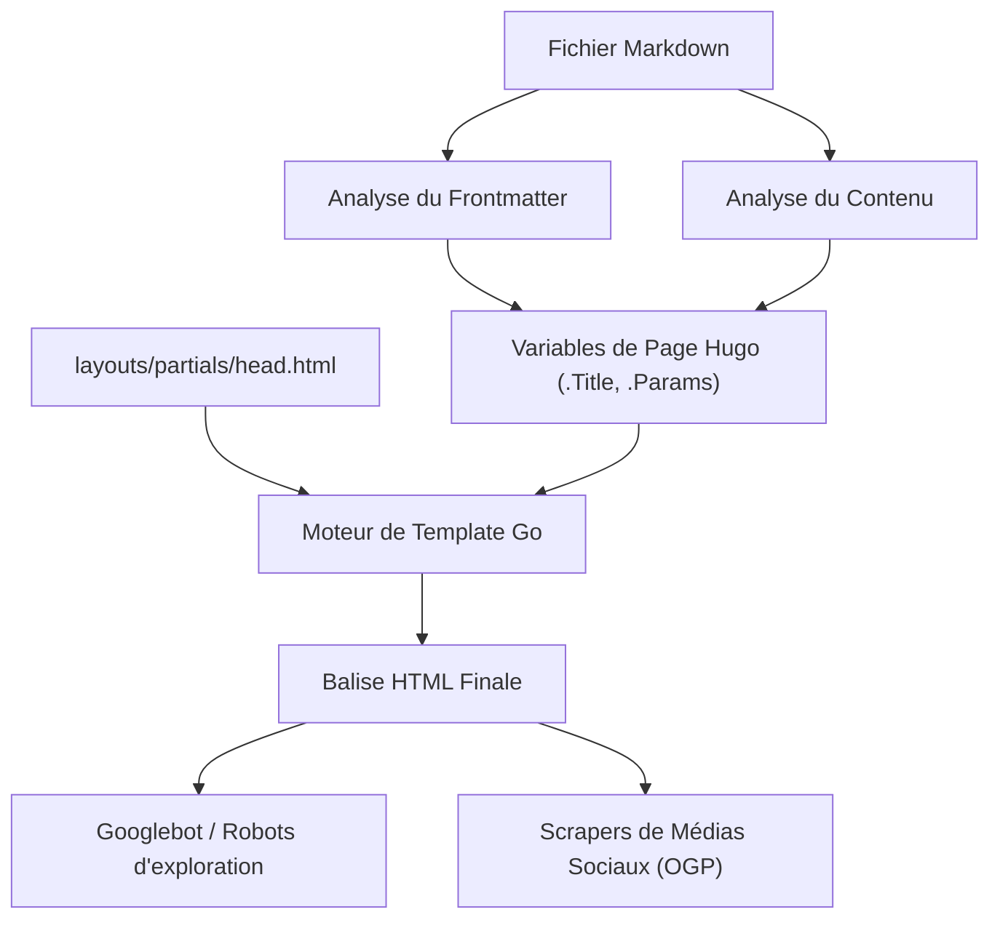
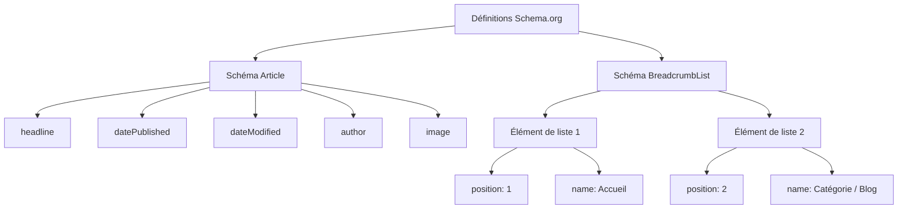

Hugo est l'un des générateurs de sites statiques (SSG) les plus rapides au monde, écrit en langage Go. Grâce à sa vitesse de compilation impressionnante et à son système de templates flexible, il bénéficie d'un grand soutien de la part de nombreux ingénieurs et blogueurs. Cependant, le simple fait qu'un site soit généré et affiché rapidement ne suffit pas pour qu'il soit bien évalué par les moteurs de recherche (comme Google ou Bing) et pour que les articles atteignent les utilisateurs.

Pour améliorer le classement dans les résultats de recherche, augmenter la viralité sur les réseaux sociaux et, par conséquent, accroître considérablement le trafic vers votre blog, des mesures SEO (Optimisation pour les Moteurs de Recherche) rigoureuses sont indispensables. Le cœur du SEO dans Hugo réside dans la coordination entre le **frontmatter**, écrit au début de chaque article Markdown, et les **templates (Layouts)** qui l'interprètent pour déployer les métadonnées dans la balise `<head>` du HTML.

Dans cet article, nous expliquerons en détail, avec un volume impressionnant de plus de 10 000 caractères, comment tirer pleinement parti des fonctionnalités de Hugo et mettre en œuvre des mesures SEO avancées : de la configuration du frontmatter aux différentes balises meta, en passant par l'OGP (Open Graph Protocol), les Twitter Cards, jusqu'à la génération de données structurées à l'aide de JSON-LD.

---

## 1. Contexte mathématique du SEO et du trafic

Avant d'entrer dans les détails de l'implémentation, comprenons mathématiquement pourquoi les métadonnées SEO précises sont si importantes. Le trafic de recherche $T$ qu'un site Web peut acquérir est déterminé par le volume de recherche des mots-clés ciblés et le taux de clics (CTR) basé sur le classement dans les résultats de recherche.

Ceci peut être exprimé par la formule suivante :

$$ T = \sum_{i=1}^{n} V_i \times CTR(R_i) $$

- $V_i$ : Volume de recherche mensuel pour le mot-clé $i$
- $R_i$ : Classement de recherche pour le mot-clé $i$
- $CTR(R_i)$ : Taux de clics au classement $R_i$

Parmi ces éléments, le classement de recherche $R_i$ dépend de nombreux facteurs tels que la qualité du contenu et les backlinks (PageRank), mais l'algorithme initial de PageRank de Google est modélisé comme suit :

$$ PR(u) = \frac{1-d}{N} + d \sum_{v \in B(u)} \frac{PR(v)}{L(v)} $$

- $PR(u)$ : PageRank de la page $u$
- $d$ : Facteur d'amortissement (généralement 0,85)
- $B(u)$ : Ensemble des pages contenant un lien vers la page $u$
- $L(v)$ : Nombre de liens sortants de la page $v$

Ce qui est important ici, c'est **en plus des efforts pour améliorer le classement de recherche $R_i$, comment maximiser le taux de clics $CTR(R_i)$**. En optimisant le titre et l'extrait (description) affichés dans les pages de résultats des moteurs de recherche (SERP), ainsi que l'image d'accroche (OGP) lors du partage sur les réseaux sociaux, il est possible d'augmenter intentionnellement le $CTR(R_i)$. Les paramètres SEO du frontmatter sont directement liés à cette maximisation du $CTR$.

---

## 2. Le processus de compilation de Hugo et le rôle du frontmatter

Hugo lit le frontmatter (YAML/TOML/JSON) dans les fichiers Markdown et le transmet au moteur de template en tant que variables de page. Tout d'abord, comprenons visuellement ce flux d'informations.



Ainsi, les valeurs définies dans le frontmatter sont transmises à `head.html` en tant que variables telles que `.Title` ou `.Params.description`, et sont finalement affichées sous forme de métadonnées HTML. Par conséquent, le succès du SEO repose sur deux étapes : "définir les informations appropriées dans le frontmatter" et "les convertir correctement en HTML à l'aide de templates".

---

## 3. Configuration des métadonnées de base : Titre, Description, URL canonique

Les balises les plus fondamentales pour que les moteurs de recherche comprennent le contenu de la page sont `<title>` et `<meta name="description">`. De plus, `<link rel="canonical">` est essentiel pour éviter les pénalités de contenu dupliqué.

### 3.1. Exemple de configuration du frontmatter

Nous préparons des champs dédiés au SEO dans le frontmatter de l'article.

```yaml
---
title: "SEO pour les blogs Hugo : Paramètres du frontmatter pour augmenter considérablement le trafic"
seo_title: "Guide complet du SEO pour Hugo : Augmentez votre trafic avec le frontmatter" # Optionnel : pour les moteurs de recherche
description: "Méthodes avancées de SEO utilisant le frontmatter de Hugo. Explications détaillées sur la configuration de l'OGP, JSON-LD et des métadonnées."
slug: "hugo-seo-frontmatter-tips"
canonicalUrl: "https://example.com/post/hugo-seo-frontmatter-tips/" # URL canonique explicite
---
```

### 3.2. Implémentation de `layouts/partials/head.html`

Nous créons un template HTML pour afficher correctement ces variables.

```html
<!-- Optimisation du titre -->
{{ $title := .Title }}
{{ if .Params.seo_title }}
  {{ $title = .Params.seo_title }}
{{ end }}
<title>{{ $title }} | {{ .Site.Title }}</title>

<!-- Optimisation de la description -->
{{ $description := .Summary | plainify | truncate 120 }}
{{ if .Params.description }}
  {{ $description = .Params.description }}
{{ end }}
<meta name="description" content="{{ $description }}">

<!-- URL canonique (Normalisation) -->
{{ $canonical := .Permalink }}
{{ if .Params.canonicalUrl }}
  {{ $canonical = .Params.canonicalUrl }}
{{ end }}
<link rel="canonical" href="{{ $canonical }}">

<!-- Contrôle des robots (ex. désactivation de l'indexation) -->
{{ if .Params.noindex }}
<meta name="robots" content="noindex, nofollow">
{{ else }}
<meta name="robots" content="index, follow">
{{ end }}
```

En utilisant `.Summary` de Hugo comme solution de repli, le texte d'introduction de l'article peut être extrait automatiquement même si `description` n'est pas définie.

---

## 4. OGP et Twitter Cards : Maximiser le CTR sur les réseaux sociaux

Lorsque des articles sont partagés sur des réseaux sociaux comme Twitter (X) ou Facebook, la configuration de l'Open Graph Protocol (OGP) et des Twitter Cards est indispensable pour les afficher sous la forme de cartes attrayantes. Celles-ci sont également générées dynamiquement à partir du frontmatter.

### 4.1. Limites du template intégré

Hugo dispose d'un template intégré pratique `{{ template "_internal/opengraph.html" . }}`, mais il manque de personnalisation et peut ne pas convenir à des environnements en japonais ou à des exigences spécifiques. Il est donc fortement recommandé d'implémenter vos propres balises OGP dans `head.html`.

### 4.2. Spécification de l'image dans le frontmatter

```yaml
---
image: "img/eyecatch.jpg"
images:
  - "img/eyecatch-large.jpg" # Pour spécifier plusieurs images ou des chemins absolus
---
```

### 4.3. Code d'implémentation personnalisé pour OGP et Twitter Cards

```html
<!-- Open Graph Protocol -->
<meta property="og:title" content="{{ $title }}">
<meta property="og:description" content="{{ $description }}">
<meta property="og:type" content="{{ if .IsPage }}article{{ else }}website{{ end }}">
<meta property="og:url" content="{{ .Permalink }}">
<meta property="og:site_name" content="{{ .Site.Title }}">

<!-- Résolution de l'image OGP -->
{{ $ogImage := "" }}
{{ if .Params.image }}
  {{ $ogImage = .Params.image | absURL }}
{{ else if .Params.images }}
  {{ $ogImage = index .Params.images 0 | absURL }}
{{ else if .Site.Params.defaultImage }}
  {{ $ogImage = .Site.Params.defaultImage | absURL }}
{{ end }}

{{ if $ogImage }}
<meta property="og:image" content="{{ $ogImage }}">
<meta name="twitter:image" content="{{ $ogImage }}">
<meta name="twitter:card" content="summary_large_image">
{{ else }}
<meta name="twitter:card" content="summary">
{{ end }}

<!-- Twitter Cards -->
<meta name="twitter:title" content="{{ $title }}">
<meta name="twitter:description" content="{{ $description }}">
{{ if .Site.Params.twitterAccount }}
<meta name="twitter:site" content="@{{ .Site.Params.twitterAccount }}">
{{ end }}
```

En appliquant la fonction `absURL`, l'URL de l'image spécifiée avec un chemin relatif est convertie en un chemin absolu. Ce traitement est extrêmement important car les chemins absolus sont obligatoires dans l'OGP.

---

## 5. Implémentation des données structurées (JSON-LD)

Dans le SEO actuel, **JSON-LD (JavaScript Object Notation for Linked Data)** est devenu la norme pour communiquer avec précision la structure sémantique d'une page aux moteurs de recherche. Sa configuration facilite l'apparition d'extraits enrichis (rich snippets : évaluations par étoiles, nom de l'auteur, date de publication, etc.) dans les résultats de recherche.

### 5.1. Structure du JSON-LD

Pour les articles de blog, nous implémentons principalement deux schémas : le schéma `Article` (Article) et le schéma `BreadcrumbList` (Fil d'Ariane).



### 5.2. Génération de JSON-LD avec les templates Hugo

Nous utilisons des variables telles que `.Date` et `.Lastmod` du frontmatter pour afficher dynamiquement le JSON-LD. Il s'écrit dans `head.html` en utilisant la balise `<script type="application/ld+json">`.

```html
{{ if .IsPage }}
<script type="application/ld+json">
{
  "@context": "https://schema.org",
  "@type": "Article",
  "mainEntityOfPage": {
    "@type": "WebPage",
    "@id": "{{ .Permalink }}"
  },
  "headline": "{{ .Title | htmlEscape }}",
  "description": "{{ $description | htmlEscape }}",
  "image": "{{ $ogImage }}",
  "datePublished": "{{ .Date.Format "2006-01-02T15:04:05-07:00" }}",
  "dateModified": "{{ .Lastmod.Format "2006-01-02T15:04:05-07:00" }}",
  "author": {
    "@type": "Person",
    "name": "{{ if .Params.author }}{{ .Params.author }}{{ else }}{{ .Site.Params.author }}{{ end }}"
  },
  "publisher": {
    "@type": "Organization",
    "name": "{{ .Site.Title }}",
    "logo": {
      "@type": "ImageObject",
      "url": "{{ .Site.Params.logo | absURL }}"
    }
  }
}
</script>

<!-- Schéma BreadcrumbList -->
<script type="application/ld+json">
{
  "@context": "https://schema.org",
  "@type": "BreadcrumbList",
  "itemListElement": [
    {
      "@type": "ListItem",
      "position": 1,
      "name": "Home",
      "item": "{{ .Site.BaseURL }}"
    }
    {{ $position := 2 }}
    {{ range .Params.categories }}
    ,{
      "@type": "ListItem",
      "position": {{ $position }},
      "name": "{{ . }}",
      "item": "{{ "categories/" | relLangURL }}{{ . | urlize | lower }}/"
    }
    {{ $position = add $position 1 }}
    {{ end }}
    ,{
      "@type": "ListItem",
      "position": {{ $position }},
      "name": "{{ .Title | htmlEscape }}",
      "item": "{{ .Permalink }}"
    }
  ]
}
</script>
{{ end }}
```

Lors du déploiement de chaînes de caractères dans JSON-LD, il est important d'utiliser `htmlEscape` (ou `jsonify`) pour éviter la destruction par des guillemets doubles. Cela permet d'éviter les erreurs de syntaxe JSON, quels que soient les symboles utilisés dans le frontmatter.

---

## 6. Techniques d'utilisation avancées du frontmatter

En plus des métadonnées SEO de base, le frontmatter de Hugo propose des fonctionnalités permettant de mettre en œuvre des stratégies SEO encore plus avancées.

### 6.1. Traitement des redirections via les alias (Aliases)

Lorsque vous migrez vers Hugo à partir d'un ancien service de blog ou que vous modifiez la structure des permaliens, vous devez rediriger le trafic des anciennes URL vers les nouvelles. En utilisant le champ `aliases` de Hugo, vous pouvez générer automatiquement des pages d'actualisation HTTP-Equiv (redirection meta) pour les anciennes URL.

```yaml
---
title: "Nouveau titre de l'article"
slug: "new-seo-post"
aliases:
  - "/old-category/old-seo-post/"
  - "/2020/05/12/seo-tips/"
---
```

### 6.2. Date d'expiration et planification des articles

Pour les articles de campagnes à durée limitée ou les informations qui perdent de leur valeur en vieillissant, la définition d'une date d'expiration `expiryDate` permet de les exclure des résultats de compilation après une date et une heure spécifiques, afin qu'elles ne s'affichent plus sur le site (en renvoyant une erreur 404). Cela évite que du contenu ancien de mauvaise qualité ne reste dans l'indexation et ne diminue l'évaluation globale du site.

```yaml
---
title: "Techniques SEO exclusives à 2026"
publishDate: "2026-01-01T00:00:00Z"
expiryDate: "2026-12-31T23:59:59Z"
---
```

---

## 7. Performances du site et Core Web Vitals

En SEO, la **vitesse de chargement de la page** est tout aussi importante que l'optimisation des balises. Google a intégré les Core Web Vitals (LCP, FID/INP, CLS) en tant que facteurs de classement.

Hugo, en tant que site statique, a naturellement un excellent TTFB (Time to First Byte), mais pour les blogs utilisant beaucoup d'images, l'optimisation de ces dernières est indispensable. En combinant les puissantes fonctionnalités de traitement d'images de Hugo (Image Processing) avec le frontmatter, vous pouvez automatiser la conversion vers des formats de nouvelle génération (comme WebP) et le redimensionnement lors de la compilation.

Par exemple, il est possible de créer un shortcode qui génère automatiquement des images WebP du côté du template à partir du chemin de l'image spécifié dans le frontmatter. Cela peut améliorer considérablement l'évaluation SEO.

---

## 8. Conclusion

Lors de la gestion d'un blog avec Hugo, le frontmatter n'est pas seulement une "liste de paramètres", mais un "panneau de contrôle" pour dialoguer avec les moteurs de recherche et les réseaux sociaux.

En mettant parfaitement en œuvre les points expliqués dans cet article, les bases SEO de votre blog deviendront solides.

1. **Génération dynamique des métadonnées de base** : Affichage fiable du Titre, de la Description et du Canonical.
2. **Optimisation du partage social** : Amélioration du CTR grâce à l'implémentation personnalisée de l'OGP et des Twitter Cards.
3. **Prise en charge complète des données structurées** : Compatibilité avec les résultats enrichis grâce à JSON-LD (Article, Breadcrumb).
4. **Gestion avancée du trafic** : Redirections avec Aliases et contrôle des robots avec des balises meta.

Bien que les algorithmes des moteurs de recherche évoluent de jour en jour, le principe fondamental du SEO, qui est de fournir des signaux pour que les moteurs de recherche "comprennent correctement le contenu de la page", reste inchangé. En maîtrisant le moteur de templates flexible et le frontmatter de Hugo, continuez d'émettre ces signaux avec la plus haute qualité et augmentez considérablement le trafic vers votre blog.
