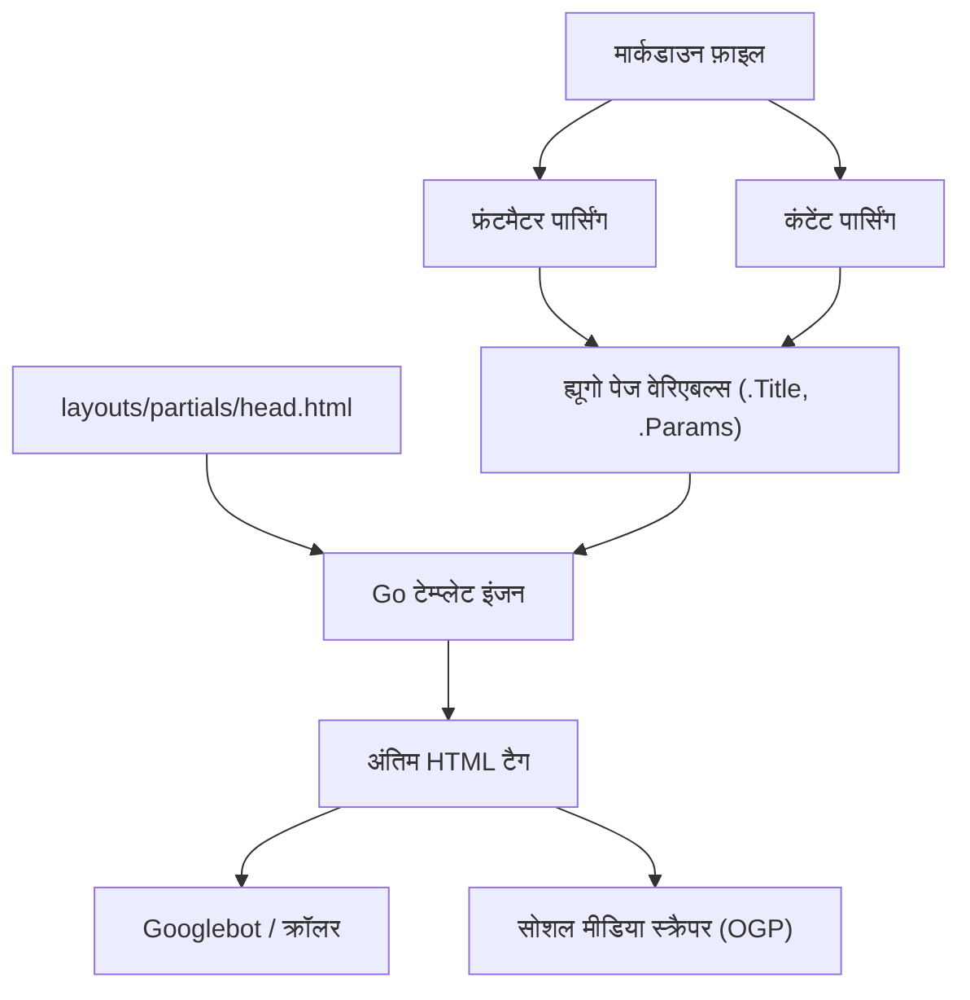
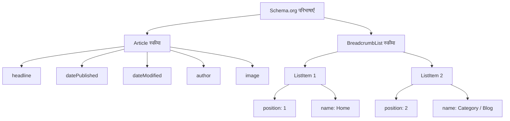

ह्यूगो (Hugo) Go भाषा में लिखा गया दुनिया के सबसे तेज़ स्थिर साइट जनरेटर (SSG) में से एक है। अपनी जबरदस्त निर्माण गति और लचीले टेम्प्लेट सिस्टम के कारण, इसे कई इंजीनियरों और ब्लॉगर्स का भारी समर्थन प्राप्त है। हालाँकि, केवल एक साइट के तेज़ी से निर्माण और प्रदर्शित होने से सर्च इंजनों (जैसे Google या Bing) द्वारा उच्च मूल्यांकन नहीं मिलेगा और लेख उपयोगकर्ताओं तक नहीं पहुंचेंगे।

सर्च रैंकिंग में सुधार करने, सोशल मीडिया पर प्रसार क्षमता बढ़ाने और परिणामस्वरूप ब्लॉग पर ट्रैफ़िक को नाटकीय रूप से बढ़ाने के लिए, विस्तृत एसईओ (सर्च इंजन ऑप्टिमाइजेशन) उपाय अपरिहार्य हैं। ह्यूगो में एसईओ का मूल भाग **फ्रंटमैटर (Frontmatter)** है, जो प्रत्येक मार्कडाउन लेख की शुरुआत में लिखा जाता है, और **टेम्प्लेट (Layouts)** का समन्वय है जो इसे व्याख्या करता है और HTML के `<head>` टैग के अंदर मेटाडेटा का विस्तार करता है।

इस लेख में, हम ह्यूगो की कार्यक्षमता को अधिकतम करने और उन्नत एसईओ उपायों को लागू करने के लिए फ्रंटमैटर सेटिंग्स से लेकर विभिन्न मेटा टैग, ओजीपी (Open Graph Protocol), ट्विटर कार्ड्स (Twitter Cards) और JSON-LD का उपयोग करके संरचित डेटा आउटपुट तक लगभग 10,000 से अधिक वर्णों की भारी मात्रा में विस्तार से चर्चा करेंगे।

---

## 1. एसईओ और ट्रैफ़िक की गणितीय पृष्ठभूमि

विशिष्ट कार्यान्वयन में जाने से पहले, आइए गणितीय रूप से समझें कि विस्तृत एसईओ मेटाडेटा क्यों महत्वपूर्ण है। किसी वेबसाइट द्वारा प्राप्त किया जा सकने वाला सर्च ट्रैफ़िक $T$, लक्षित कीवर्ड की सर्च वॉल्यूम और सर्च रैंकिंग के आधार पर क्लिक-थ्रू दर (CTR) द्वारा निर्धारित किया जाता है।

इसे गणितीय सूत्र के रूप में इस प्रकार व्यक्त किया जा सकता है:

$$ T = \sum_{i=1}^{n} V_i \times CTR(R_i) $$

- $V_i$ : कीवर्ड $i$ का मासिक सर्च वॉल्यूम
- $R_i$ : कीवर्ड $i$ के लिए सर्च रैंकिंग
- $CTR(R_i)$ : रैंकिंग $R_i$ पर क्लिक-थ्रू दर

इनमें से, सर्च रैंकिंग $R_i$ सामग्री की गुणवत्ता और बैकलिंक्स (PageRank) जैसे कई कारकों पर निर्भर करती है, लेकिन Google के प्रारंभिक पेजरैंक एल्गोरिदम को निम्नानुसार मॉडल किया गया है।

$$ PR(u) = \frac{1-d}{N} + d \sum_{v \in B(u)} \frac{PR(v)}{L(v)} $$

- $PR(u)$ : पेज $u$ का पेजरैंक
- $d$ : डंपिंग फैक्टर (आमतौर पर 0.85)
- $B(u)$ : पेज $u$ से लिंक करने वाले पेजों का सेट
- $L(v)$ : पेज $v$ से आउटबाउंड लिंक की संख्या

यहाँ महत्वपूर्ण बात यह है कि **सर्च रैंकिंग $R_i$ बढ़ाने के प्रयासों के अलावा, क्लिक-थ्रू दर $CTR(R_i)$ को कैसे अधिकतम किया जाए**। सर्च परिणामों (SERPs) में प्रदर्शित होने वाले शीर्षक और स्निपेट (description), या सोशल मीडिया पर साझा किए जाने पर आकर्षक चित्र (OGP) को अनुकूलित करके, जानबूझकर $CTR(R_i)$ को बढ़ाना संभव है। फ्रंटमैटर की एसईओ सेटिंग्स सीधे इस $CTR$ के अधिकतमकरण से जुड़ी हैं।

---

## 2. ह्यूगो की निर्माण प्रक्रिया और फ्रंटमैटर की भूमिका

ह्यूगो मार्कडाउन फ़ाइलों के भीतर फ्रंटमैटर (YAML/TOML/JSON) को पढ़ता है और उन्हें पेज वेरिएबल्स के रूप में टेम्प्लेट इंजन को पास करता है। सबसे पहले, आइए इस सूचना प्रवाह को विज़ुअल रूप से समझें।



इस तरह, फ्रंटमैटर में सेट किए गए मान `.Title` और `.Params.description` जैसे वेरिएबल्स के रूप में `head.html` में पास किए जाते हैं, और अंतिम HTML मेटाडेटा के रूप में आउटपुट होते हैं। इसलिए, एसईओ की सफलता में दो चरण होते हैं: "फ्रंटमैटर में उचित जानकारी परिभाषित करना" और "इसे टेम्प्लेट में सही ढंग से HTML में बदलना"।

---

## 3. बुनियादी मेटाडेटा सेटिंग्स: Title, Description, Canonical URL

सर्च इंजन के लिए पेज की सामग्री को समझने के लिए सबसे बुनियादी टैग `<title>` और `<meta name="description">` हैं। इसके अतिरिक्त, डुप्लिकेट सामग्री के जुर्माने से बचने के लिए `<link rel="canonical">` भी आवश्यक है।

### 3.1. फ्रंटमैटर सेटिंग का उदाहरण

लेख के फ्रंटमैटर में एसईओ के लिए विशिष्ट फ़ील्ड तैयार करें।

```yaml
---
title: 'ह्यूगो ब्लॉग एसईओ: ट्रैफ़िक को नाटकीय रूप से बढ़ाने के लिए फ्रंटमैटर सेटिंग्स'
seo_title: 'ह्यूगो एसईओ संपूर्ण गाइड: फ्रंटमैटर के साथ ट्रैफ़िक बढ़ाएँ' # विकल्प: सर्च इंजन के लिए
description: 'ह्यूगो के फ्रंटमैटर का उपयोग करके उन्नत एसईओ तकनीकें। ओजीपी, JSON-LD और मेटाडेटा सेटअप करने का विस्तृत स्पष्टीकरण।'
slug: "hugo-seo-frontmatter-tips"
canonicalUrl: "https://example.com/post/hugo-seo-frontmatter-tips/" # स्पष्ट कैननिकल URL
---
```

### 3.2. `layouts/partials/head.html` का कार्यान्वयन

इन वेरिएबल्स को सही ढंग से आउटपुट करने के लिए एक HTML टेम्प्लेट बनाएँ।

```html
<!-- शीर्षक का अनुकूलन -->
{{ $title := .Title }}
{{ if .Params.seo_title }}
  {{ $title = .Params.seo_title }}
{{ end }}
<title>{{ $title }} | {{ .Site.Title }}</title>

<!-- Description का अनुकूलन -->
{{ $description := .Summary | plainify | truncate 120 }}
{{ if .Params.description }}
  {{ $description = .Params.description }}
{{ end }}
<meta name="description" content="{{ $description }}">

<!-- Canonical URL (कैननिकल URL) -->
{{ $canonical := .Permalink }}
{{ if .Params.canonicalUrl }}
  {{ $canonical = .Params.canonicalUrl }}
{{ end }}
<link rel="canonical" href="{{ $canonical }}">

<!-- रोबोट नियंत्रण (जैसे इंडेक्स अस्वीकार सेटिंग) -->
{{ if .Params.noindex }}
<meta name="robots" content="noindex, nofollow">
{{ else }}
<meta name="robots" content="index, follow">
{{ end }}
```

ह्यूगो के `.Summary` को फ़ॉलबैक के रूप में उपयोग करके, आप स्वचालित रूप से लेख के शुरुआती वाक्य निकाल सकते हैं, भले ही `description` सेट न हो।

---

## 4. ओजीपी (OGP) और ट्विटर कार्ड्स (Twitter Cards): सोशल मीडिया पर CTR को अधिकतम करना

जब कोई लेख ट्विटर (X) या फेसबुक जैसे एसएनएस पर साझा किया जाता है, तो उसे आकर्षक कार्ड प्रारूप में प्रदर्शित करने के लिए ओपन ग्राफ प्रोटोकॉल (OGP) और ट्विटर कार्ड्स सेट करना आवश्यक है। यह भी फ्रंटमैटर से गतिशील रूप से उत्पन्न होता है।

### 4.1. अंतर्निहित टेम्प्लेट की चुनौतियाँ

ह्यूगो में `{{ template "_internal/opengraph.html" . }}` नामक एक सुविधाजनक अंतर्निहित टेम्प्लेट है, लेकिन इसमें अनुकूलन क्षमता का अभाव है और यह जापानी परिवेश या विशिष्ट आवश्यकताओं के अनुकूल नहीं हो सकता है। इसलिए, `head.html` के अंदर अपने स्वयं के ओजीपी टैग लागू करने की दृढ़ता से अनुशंसा की जाती है।

### 4.2. फ्रंटमैटर में छवि निर्दिष्ट करना

```yaml
---
image: "img/eyecatch.jpg"
images:
  - "img/eyecatch-large.jpg" # एकाधिक छवियों या निरपेक्ष पथ के लिए
---
```

### 4.3. ओजीपी और ट्विटर कार्ड्स का कस्टम कार्यान्वयन कोड

```html
<!-- Open Graph Protocol -->
<meta property="og:title" content="{{ $title }}">
<meta property="og:description" content="{{ $description }}">
<meta property="og:type" content="{{ if .IsPage }}article{{ else }}website{{ end }}">
<meta property="og:url" content="{{ .Permalink }}">
<meta property="og:site_name" content="{{ .Site.Title }}">

<!-- OGP Image का समाधान -->
{{ $ogImage := "" }}
{{ if .Params.image }}
  {{ $ogImage = .Params.image | absURL }}
{{ else if .Params.images }}
  {{ $ogImage = index .Params.images 0 | absURL }}
{{ else if .Site.Params.defaultImage }}
  {{ $ogImage = .Site.Params.defaultImage | absURL }}
{{ end }}

{{ if $ogImage }}
<meta property="og:image" content="{{ $ogImage }}">
<meta name="twitter:image" content="{{ $ogImage }}">
<meta name="twitter:card" content="summary_large_image">
{{ else }}
<meta name="twitter:card" content="summary">
{{ end }}

<!-- Twitter Cards -->
<meta name="twitter:title" content="{{ $title }}">
<meta name="twitter:description" content="{{ $description }}">
{{ if .Site.Params.twitterAccount }}
<meta name="twitter:site" content="@{{ .Site.Params.twitterAccount }}">
{{ end }}
```

`absURL` फ़ंक्शन का उपयोग करके, सापेक्ष पथ के रूप में निर्दिष्ट छवि URL को निरपेक्ष पथ में परिवर्तित किया जाता है। ओजीपी के लिए निरपेक्ष पथ अनिवार्य हैं, इसलिए यह प्रक्रिया अत्यंत महत्वपूर्ण है।

---

## 5. संरचित डेटा (JSON-LD) का कार्यान्वयन

वर्तमान एसईओ में, सर्च इंजन को पेज की अर्थपूर्ण संरचना को सटीक रूप से बताने के लिए **JSON-LD (JavaScript Object Notation for Linked Data)** एक मुख्यधारा तकनीक बन गया है। इसे सेट करके, सर्च परिणामों में रिच स्निपेट (स्टार रेटिंग, लेखक का नाम, प्रकाशन तिथि आदि) प्रदर्शित होने की अधिक संभावना होती है।

### 5.1. JSON-LD की संरचना

ब्लॉग लेखों में, मुख्य रूप से दो स्कीमा लागू किए जाते हैं: `Article` (लेख) स्कीमा और `BreadcrumbList` (ब्रेडक्रंब सूची) स्कीमा।



### 5.2. ह्यूगो टेम्प्लेट में JSON-LD जनरेशन

फ्रंटमैटर के `.Date` और `.Lastmod` जैसे वेरिएबल्स का उपयोग करके, JSON-LD को गतिशील रूप से आउटपुट करें। `<script type="application/ld+json">` टैग का उपयोग करके इसे `head.html` में लिखें।

```html
{{ if .IsPage }}
<script type="application/ld+json">
{
  "@context": "https://schema.org",
  "@type": "Article",
  "mainEntityOfPage": {
    "@type": "WebPage",
    "@id": "{{ .Permalink }}"
  },
  "headline": "{{ .Title | htmlEscape }}",
  "description": "{{ $description | htmlEscape }}",
  "image": "{{ $ogImage }}",
  "datePublished": "{{ .Date.Format "2006-01-02T15:04:05-07:00" }}",
  "dateModified": "{{ .Lastmod.Format "2006-01-02T15:04:05-07:00" }}",
  "author": {
    "@type": "Person",
    "name": "{{ if .Params.author }}{{ .Params.author }}{{ else }}{{ .Site.Params.author }}{{ end }}"
  },
  "publisher": {
    "@type": "Organization",
    "name": "{{ .Site.Title }}",
    "logo": {
      "@type": "ImageObject",
      "url": "{{ .Site.Params.logo | absURL }}"
    }
  }
}
</script>

<!-- BreadcrumbList Schema -->
<script type="application/ld+json">
{
  "@context": "https://schema.org",
  "@type": "BreadcrumbList",
  "itemListElement": [
    {
      "@type": "ListItem",
      "position": 1,
      "name": "Home",
      "item": "{{ .Site.BaseURL }}"
    }
    {{ $position := 2 }}
    {{ range .Params.categories }}
    ,{
      "@type": "ListItem",
      "position": {{ $position }},
      "name": "{{ . }}",
      "item": "{{ "categories/" | relLangURL }}{{ . | urlize | lower }}/"
    }
    {{ $position = add $position 1 }}
    {{ end }}
    ,{
      "@type": "ListItem",
      "position": {{ $position }},
      "name": "{{ .Title | htmlEscape }}",
      "item": "{{ .Permalink }}"
    }
  ]
}
</script>
{{ end }}
```

JSON-LD के भीतर स्ट्रिंग्स का विस्तार करते समय, डबल कोट्स को टूटने से रोकने के लिए `htmlEscape` (या `jsonify`) का उपयोग करना महत्वपूर्ण है। यह JSON सिंटैक्स त्रुटियों को रोकता है, भले ही फ्रंटमैटर में किसी भी प्रतीक का उपयोग किया गया हो।

---

## 6. फ्रंटमैटर की उन्नत उपयोग तकनीकें

बुनियादी एसईओ मेटाडेटा के अलावा, ह्यूगो के फ्रंटमैटर में और भी अधिक उन्नत एसईओ रणनीतियों को साकार करने की क्षमताएं हैं।

### 6.1. उपनामों (Aliases) का उपयोग करके रीडायरेक्ट प्रक्रिया

जब आप किसी पिछली ब्लॉग सेवा से ह्यूगो में माइग्रेट करते हैं, या जब आप अपनी पर्मलिंक संरचना बदलते हैं, तो आपको पुराने URL से ट्रैफ़िक को नए URL पर रीडायरेक्ट करने की आवश्यकता होती है। ह्यूगो के `aliases` फ़ील्ड का उपयोग करके, आप स्वचालित रूप से पुराने URL के लिए HTTP-Equiv रिफ्रेश (मेटा-रीडायरेक्ट) पेज जेनरेट कर सकते हैं।

```yaml
---
title: 'नया लेख शीर्षक'
slug: "new-seo-post"
aliases:
  - "/old-category/old-seo-post/"
  - "/2020/05/12/seo-tips/"
---
```

### 6.2. लेख की समाप्ति तिथि और शेड्यूलिंग

सीमित समय के अभियान लेखों या ऐसी जानकारी के लिए जो पुरानी होने पर अपना मूल्य खो देती है, आप `expiryDate` सेट कर सकते हैं ताकि इसे बिल्ड परिणामों से बाहर रखा जा सके और एक विशिष्ट तिथि और समय के बाद इसे साइट पर प्रदर्शित होने से रोका जा सके (404 लौटाने के लिए)। यह कम गुणवत्ता वाली पुरानी सामग्री को इंडेक्स में रहने से रोकता है और पूरी साइट की रैंकिंग को कम होने से बचाता है।

```yaml
---
title: '2026 विशेष एसईओ तकनीकें'
publishDate: "2026-01-01T00:00:00Z"
expiryDate: "2026-12-31T23:59:59Z"
---
```

---

## 7. साइट प्रदर्शन और कोर वेब वाइटल्स (Core Web Vitals)

एसईओ में, **पेज लोड गति (Page load speed)** टैग अनुकूलन जितनी ही महत्वपूर्ण है। Google ने कोर वेब वाइटल्स (LCP, FID/INP, CLS) को रैंकिंग कारक के रूप में शामिल किया है।

एक स्थिर साइट होने के नाते, ह्यूगो में स्वाभाविक रूप से उत्कृष्ट TTFB (Time to First Byte) है, लेकिन छवियों का भारी उपयोग करने वाले ब्लॉग के लिए छवि अनुकूलन आवश्यक है। फ्रंटमैटर के साथ ह्यूगो के शक्तिशाली इमेज प्रोसेसिंग कार्यों (Image Processing) को मिलाकर, आप स्वचालित रूप से नेक्स्ट-जेन प्रारूपों (जैसे WebP) में परिवर्तित कर सकते हैं और बिल्ड समय पर आकार बदल सकते हैं।

उदाहरण के लिए, आप एक शार्टकोड बना सकते हैं जो स्वचालित रूप से फ्रंटमैटर में निर्दिष्ट छवि पथ से टेम्प्लेट साइड पर WebP छवियां उत्पन्न करता है। इससे एसईओ मूल्यांकन में नाटकीय रूप से सुधार करना संभव है।

---

## 8. निष्कर्ष

ह्यूगो का उपयोग करके ब्लॉग चलाने में, फ्रंटमैटर केवल "सेटिंग मानों की एक सूची" नहीं है, बल्कि सर्च इंजन और एसएनएस के साथ संवाद करने के लिए एक "नियंत्रण कक्ष" है।

इस लेख में बताए गए निम्नलिखित बिंदुओं को पूरी तरह से लागू करके, आपके ब्लॉग की एसईओ नींव मजबूत हो जाएगी।

1. **बुनियादी मेटाडेटा का गतिशील निर्माण**: Title, Description, और Canonical का विश्वसनीय आउटपुट
2. **सोशल शेयर का अनुकूलन**: ओजीपी और ट्विटर कार्ड्स के कस्टम कार्यान्वयन के माध्यम से CTR में सुधार
3. **संरचित डेटा का पूर्ण समर्थन**: JSON-LD (Article, Breadcrumb) का उपयोग करके रिच रिज़ल्ट समर्थन
4. **उन्नत ट्रैफ़िक प्रबंधन**: Aliases के माध्यम से रीडायरेक्ट और मेटा टैग का उपयोग करके रोबोट नियंत्रण

हालाँकि सर्च इंजन एल्गोरिदम हर दिन विकसित हो रहे हैं, एसईओ का मूल सिद्धांत सर्च इंजनों को "पेज की सामग्री को सही ढंग से समझने" के लिए संकेत प्रदान करना अपरिवर्तित रहता है। ह्यूगो के लचीले टेम्प्लेट इंजन और फ्रंटमैटर में महारत हासिल करके, आप उच्चतम गुणवत्ता पर इन संकेतों को प्रसारित करना जारी रख सकते हैं और अपने ब्लॉग ट्रैफ़िक को नाटकीय रूप से बढ़ा सकते हैं।
