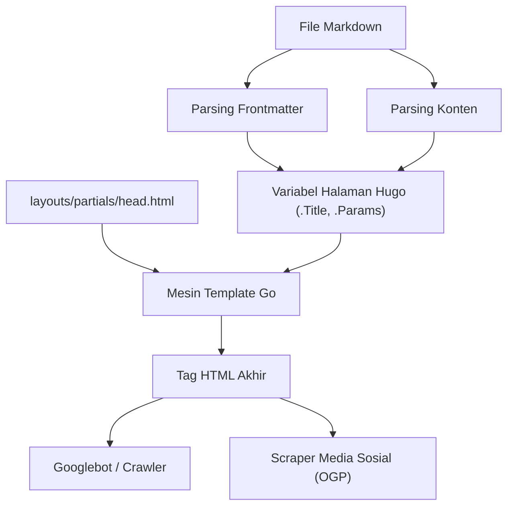
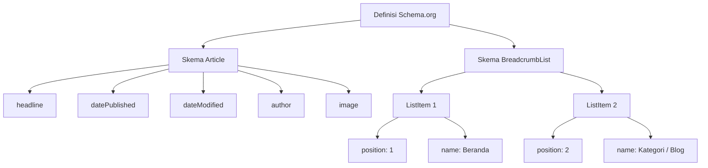

Hugo adalah salah satu generator situs statis (SSG) tercepat di dunia, ditulis dalam bahasa Go. Karena kecepatan build yang luar biasa dan sistem template yang fleksibel, Hugo sangat didukung oleh banyak insinyur dan blogger. Namun, hanya karena sebuah situs dibangun dan ditampilkan dengan cepat bukan berarti situs tersebut akan dinilai tinggi oleh mesin pencari (seperti Google atau Bing) dan menjangkau pengguna.

Untuk meningkatkan peringkat pencarian, meningkatkan penyebaran di media sosial, dan pada akhirnya secara dramatis meningkatkan lalu lintas ke blog Anda, optimasi mesin pencari (SEO) yang cermat sangatlah penting. Inti dari strategi SEO di Hugo adalah kolaborasi antara **frontmatter** (yang ditulis di awal setiap artikel markdown) dan **template** (Layouts) yang menafsirkannya dan menyebarkan metadata di dalam tag `<head>` HTML.

Dalam artikel ini, kami akan menjelaskan secara menyeluruh cara memaksimalkan fitur Hugo untuk mengimplementasikan strategi SEO tingkat lanjut, dengan volume yang melebihi 10.000 karakter, mulai dari pengaturan frontmatter hingga berbagai meta tag, OGP (Open Graph Protocol), Twitter Cards, dan output data terstruktur menggunakan JSON-LD.

---

## 1. Latar Belakang Matematis SEO dan Lalu Lintas

Sebelum masuk ke implementasi spesifik, mari kita pahami secara matematis mengapa metadata SEO yang detail itu penting. Lalu lintas pencarian $T$ yang dapat diperoleh sebuah situs web ditentukan oleh volume pencarian kata kunci yang ditargetkan dan rasio klik-tayang (CTR) berdasarkan peringkat pencarian.

Ini dapat dinyatakan dalam rumus berikut:

$$ T = \sum_{i=1}^{n} V_i \times CTR(R_i) $$

- $V_i$ : Volume pencarian bulanan untuk kata kunci $i$
- $R_i$ : Peringkat pencarian untuk kata kunci $i$
- $CTR(R_i)$ : Rasio klik-tayang (CTR) pada peringkat $R_i$

Dari faktor-faktor ini, peringkat pencarian $R_i$ bergantung pada banyak faktor seperti kualitas konten dan backlink (PageRank), tetapi algoritma PageRank awal Google dimodelkan sebagai berikut:

$$ PR(u) = \frac{1-d}{N} + d \sum_{v \in B(u)} \frac{PR(v)}{L(v)} $$

- $PR(u)$ : PageRank dari halaman $u$
- $d$ : Faktor redaman (Damping factor, biasanya 0.85)
- $B(u)$ : Kumpulan halaman yang menautkan ke halaman $u$
- $L(v)$ : Jumlah tautan keluar dari halaman $v$

Hal penting di sini adalah, **selain upaya untuk meningkatkan peringkat pencarian $R_i$, bagaimana memaksimalkan rasio klik-tayang $CTR(R_i)$**. Dengan mengoptimalkan judul dan cuplikan (description) yang ditampilkan di hasil pencarian (SERP), dan gambar utama (OGP) saat dibagikan di media sosial, Anda dapat secara sengaja meningkatkan $CTR(R_i)$. Pengaturan SEO pada frontmatter secara langsung terhubung dengan pemaksimalan $CTR$ ini.

---

## 2. Proses Build Hugo dan Peran Frontmatter

Hugo membaca frontmatter (YAML/TOML/JSON) di dalam file markdown dan meneruskannya sebagai variabel halaman ke mesin template. Pertama, mari kita pahami aliran informasi ini secara visual.



Dengan cara ini, nilai yang ditetapkan di frontmatter diteruskan ke `head.html` sebagai variabel seperti `.Title` dan `.Params.description`, dan ditampilkan sebagai metadata HTML akhir. Oleh karena itu, keberhasilan SEO terdiri dari dua langkah: "mendefinisikan informasi yang tepat di frontmatter" dan "mengubahnya dengan benar menjadi HTML dalam template".

---

## 3. Pengaturan Metadata Dasar: Title, Description, Canonical URL

Tag paling dasar agar mesin pencari memahami konten halaman Anda adalah `<title>` dan `<meta name="description">`. Selain itu, `<link rel="canonical">` juga wajib ada untuk menghindari hukuman karena konten duplikat.

### 3.1. Contoh Pengaturan Frontmatter

Kami menyiapkan kolom khusus untuk SEO di frontmatter artikel.

```yaml
---
title: 'SEO untuk Blog Hugo: Pengaturan Frontmatter yang Secara Dramatis Meningkatkan Jumlah Pengunjung'
seo_title: 'Panduan Lengkap SEO Hugo: Meningkatkan Lalu Lintas dengan Frontmatter' # Opsional: Untuk mesin pencari
description: 'Metode strategi SEO lanjutan menggunakan frontmatter Hugo. Penjelasan terperinci tentang cara mengatur OGP, JSON-LD, dan metadata.'
slug: "hugo-seo-frontmatter-tips"
canonicalUrl: "https://example.com/post/hugo-seo-frontmatter-tips/" # URL kanonis eksplisit
---
```

### 3.2. Implementasi `layouts/partials/head.html`

Kami akan membuat template HTML untuk mengeluarkan variabel-variabel ini dengan benar.

```html
<!-- Optimasi Judul -->
{{ $title := .Title }}
{{ if .Params.seo_title }}
  {{ $title = .Params.seo_title }}
{{ end }}
<title>{{ $title }} | {{ .Site.Title }}</title>

<!-- Optimasi Description -->
{{ $description := .Summary | plainify | truncate 120 }}
{{ if .Params.description }}
  {{ $description = .Params.description }}
{{ end }}
<meta name="description" content="{{ $description }}">

<!-- Canonical URL (Kanonisasi) -->
{{ $canonical := .Permalink }}
{{ if .Params.canonicalUrl }}
  {{ $canonical = .Params.canonicalUrl }}
{{ end }}
<link rel="canonical" href="{{ $canonical }}">

<!-- Kontrol Robot (mis. pengaturan tolak indeks) -->
{{ if .Params.noindex }}
<meta name="robots" content="noindex, nofollow">
{{ else }}
<meta name="robots" content="index, follow">
{{ end }}
```

Dengan menggunakan `.Summary` Hugo sebagai fallback, Anda dapat secara otomatis mengekstrak kalimat awal artikel bahkan jika `description` belum diatur.

---

## 4. OGP dan Twitter Cards: Memaksimalkan CTR di Media Sosial

Untuk membuat artikel Anda muncul dalam format kartu yang menarik saat dibagikan di SNS seperti Twitter (X) atau Facebook, pengaturan Open Graph Protocol (OGP) dan Twitter Cards sangatlah penting. Ini juga dibuat secara dinamis dari frontmatter.

### 4.1. Masalah dengan Template Bawaan

Hugo memiliki template bawaan yang mudah digunakan yaitu `{{ template "_internal/opengraph.html" . }}`, namun kurang dapat disesuaikan dan mungkin tidak sesuai dengan lingkungan bahasa tertentu atau persyaratan khusus. Karena itu, kami sangat menyarankan untuk mengimplementasikan tag OGP kustom Anda sendiri di dalam `head.html`.

### 4.2. Menentukan Gambar di Frontmatter

```yaml
---
image: "img/eyecatch.jpg"
images:
  - "img/eyecatch-large.jpg" # Untuk beberapa gambar atau jalur absolut
---
```

### 4.3. Kode Implementasi Kustom OGP dan Twitter Cards

```html
<!-- Open Graph Protocol -->
<meta property="og:title" content="{{ $title }}">
<meta property="og:description" content="{{ $description }}">
<meta property="og:type" content="{{ if .IsPage }}article{{ else }}website{{ end }}">
<meta property="og:url" content="{{ .Permalink }}">
<meta property="og:site_name" content="{{ .Site.Title }}">

<!-- Resolusi OGP Image -->
{{ $ogImage := "" }}
{{ if .Params.image }}
  {{ $ogImage = .Params.image | absURL }}
{{ else if .Params.images }}
  {{ $ogImage = index .Params.images 0 | absURL }}
{{ else if .Site.Params.defaultImage }}
  {{ $ogImage = .Site.Params.defaultImage | absURL }}
{{ end }}

{{ if $ogImage }}
<meta property="og:image" content="{{ $ogImage }}">
<meta name="twitter:image" content="{{ $ogImage }}">
<meta name="twitter:card" content="summary_large_image">
{{ else }}
<meta name="twitter:card" content="summary">
{{ end }}

<!-- Twitter Cards -->
<meta name="twitter:title" content="{{ $title }}">
<meta name="twitter:description" content="{{ $description }}">
{{ if .Site.Params.twitterAccount }}
<meta name="twitter:site" content="@{{ .Site.Params.twitterAccount }}">
{{ end }}
```

Dengan memasukkan fungsi `absURL`, Anda dapat mengonversi URL gambar relatif menjadi URL absolut. Karena jalur absolut diperlukan untuk OGP, proses ini sangatlah penting.

---

## 5. Implementasi Data Terstruktur (JSON-LD)

Dalam SEO modern, **JSON-LD (JavaScript Object Notation for Linked Data)** telah menjadi metode utama untuk secara akurat menyampaikan struktur semantik halaman ke mesin pencari. Dengan mengatur ini, rich snippet (peringkat bintang, nama penulis, tanggal publikasi, dll.) lebih mungkin muncul di hasil pencarian.

### 5.1. Struktur JSON-LD

Untuk artikel blog, kita akan mengimplementasikan dua skema utama: skema `Article` (Artikel) dan skema `BreadcrumbList` (Daftar Breadcrumb).



### 5.2. Pembuatan JSON-LD di Template Hugo

Memanfaatkan variabel frontmatter seperti `.Date` dan `.Lastmod`, JSON-LD dihasilkan secara dinamis. Ditulis di `head.html` menggunakan tag `<script type="application/ld+json">`.

```html
{{ if .IsPage }}
<script type="application/ld+json">
{
  "@context": "https://schema.org",
  "@type": "Article",
  "mainEntityOfPage": {
    "@type": "WebPage",
    "@id": "{{ .Permalink }}"
  },
  "headline": "{{ .Title | htmlEscape }}",
  "description": "{{ $description | htmlEscape }}",
  "image": "{{ $ogImage }}",
  "datePublished": "{{ .Date.Format "2006-01-02T15:04:05-07:00" }}",
  "dateModified": "{{ .Lastmod.Format "2006-01-02T15:04:05-07:00" }}",
  "author": {
    "@type": "Person",
    "name": "{{ if .Params.author }}{{ .Params.author }}{{ else }}{{ .Site.Params.author }}{{ end }}"
  },
  "publisher": {
    "@type": "Organization",
    "name": "{{ .Site.Title }}",
    "logo": {
      "@type": "ImageObject",
      "url": "{{ .Site.Params.logo | absURL }}"
    }
  }
}
</script>

<!-- Skema BreadcrumbList -->
<script type="application/ld+json">
{
  "@context": "https://schema.org",
  "@type": "BreadcrumbList",
  "itemListElement": [
    {
      "@type": "ListItem",
      "position": 1,
      "name": "Beranda",
      "item": "{{ .Site.BaseURL }}"
    }
    {{ $position := 2 }}
    {{ range .Params.categories }}
    ,{
      "@type": "ListItem",
      "position": {{ $position }},
      "name": "{{ . }}",
      "item": "{{ "categories/" | relLangURL }}{{ . | urlize | lower }}/"
    }
    {{ $position = add $position 1 }}
    {{ end }}
    ,{
      "@type": "ListItem",
      "position": {{ $position }},
      "name": "{{ .Title | htmlEscape }}",
      "item": "{{ .Permalink }}"
    }
  ]
}
</script>
{{ end }}
```

Saat memperluas string di dalam JSON-LD, poin pentingnya adalah menggunakan `htmlEscape` (atau `jsonify`) untuk mencegah rusaknya tanda kutip ganda. Dengan demikian, simbol apa pun yang digunakan dalam frontmatter, Anda dapat mencegah kesalahan sintaks JSON.

---

## 6. Teknik Pemanfaatan Lanjutan Frontmatter

Selain metadata SEO dasar, frontmatter Hugo memiliki fitur untuk mewujudkan strategi SEO yang lebih canggih.

### 6.1. Penanganan Pengalihan menggunakan Alias (Aliases)

Saat Anda bermigrasi ke Hugo dari layanan blog sebelumnya, atau saat Anda mengubah struktur permalink, Anda perlu mengalihkan lalu lintas dari URL lama ke URL baru. Dengan menggunakan kolom `aliases` Hugo, Anda dapat secara otomatis membuat halaman penyegaran HTTP-Equiv (meta redirect) untuk URL lama.

```yaml
---
title: 'Judul Artikel Baru'
slug: "new-seo-post"
aliases:
  - "/old-category/old-seo-post/"
  - "/2020/05/12/seo-tips/"
---
```

### 6.2. Waktu Kedaluwarsa Artikel dan Penjadwalan

Untuk artikel kampanye dalam waktu terbatas, atau informasi yang kehilangan nilainya saat sudah usang, Anda dapat mengatur `expiryDate` agar mengecualikannya dari hasil build setelah tanggal dan waktu tertentu, sehingga tidak ditampilkan di situs (akan mengembalikan 404). Ini mencegah konten lama berkualitas rendah tetap berada di indeks dan menurunkan peringkat situs secara keseluruhan.

```yaml
---
title: 'Teknik SEO Terbatas Tahun 2026'
publishDate: "2026-01-01T00:00:00Z"
expiryDate: "2026-12-31T23:59:59Z"
---
```

---

## 7. Kinerja Situs dan Core Web Vitals

Dalam SEO, **kecepatan memuat halaman** sama pentingnya dengan optimasi tag. Google memasukkan Core Web Vitals (LCP, FID/INP, CLS) sebagai faktor peringkat.

Sebagai situs statis, Hugo pada dasarnya memiliki TTFB (Time to First Byte) yang sangat baik, tetapi untuk blog yang menggunakan banyak gambar, optimasi gambar adalah suatu keharusan. Dengan menggabungkan fitur pemrosesan gambar Hugo yang kuat (Image Processing) dengan frontmatter, Anda dapat mengotomatiskan konversi ke format generasi berikutnya (seperti WebP) dan mengubah ukuran saat proses build.

Misalnya, Anda dapat membuat shortcode yang secara otomatis menghasilkan gambar WebP di sisi template dari jalur gambar yang ditentukan di frontmatter. Ini dapat secara dramatis meningkatkan penilaian SEO Anda.

---

## 8. Kesimpulan

Dalam pengoperasian blog menggunakan Hugo, frontmatter bukanlah sekadar "daftar pengaturan", melainkan "panel kontrol" untuk berinteraksi dengan mesin pencari dan media sosial.

Dengan menerapkan poin-poin yang dijelaskan dalam artikel ini secara menyeluruh, fondasi SEO blog Anda akan menjadi sangat kuat.

1. **Pembuatan metadata dasar yang dinamis**: Menghasilkan Title, Description, dan Canonical dengan andal
2. **Optimasi berbagi di media sosial**: Meningkatkan CTR melalui implementasi kustom OGP dan Twitter Cards
3. **Dukungan penuh untuk data terstruktur**: Mendukung Rich Results menggunakan JSON-LD (Article, Breadcrumb)
4. **Manajemen lalu lintas tingkat lanjut**: Pengalihan menggunakan Aliases dan kontrol robot menggunakan meta tag

Meskipun algoritma mesin pencari terus berkembang dari hari ke hari, prinsip dasar SEO—menyediakan sinyal agar mesin pencari dapat "memahami konten halaman dengan benar"—tetap tidak berubah. Dengan menguasai mesin template yang fleksibel dan frontmatter Hugo, Anda dapat terus mengirimkan sinyal berkualitas tinggi tersebut dan meningkatkan jumlah pengunjung blog Anda secara dramatis.
