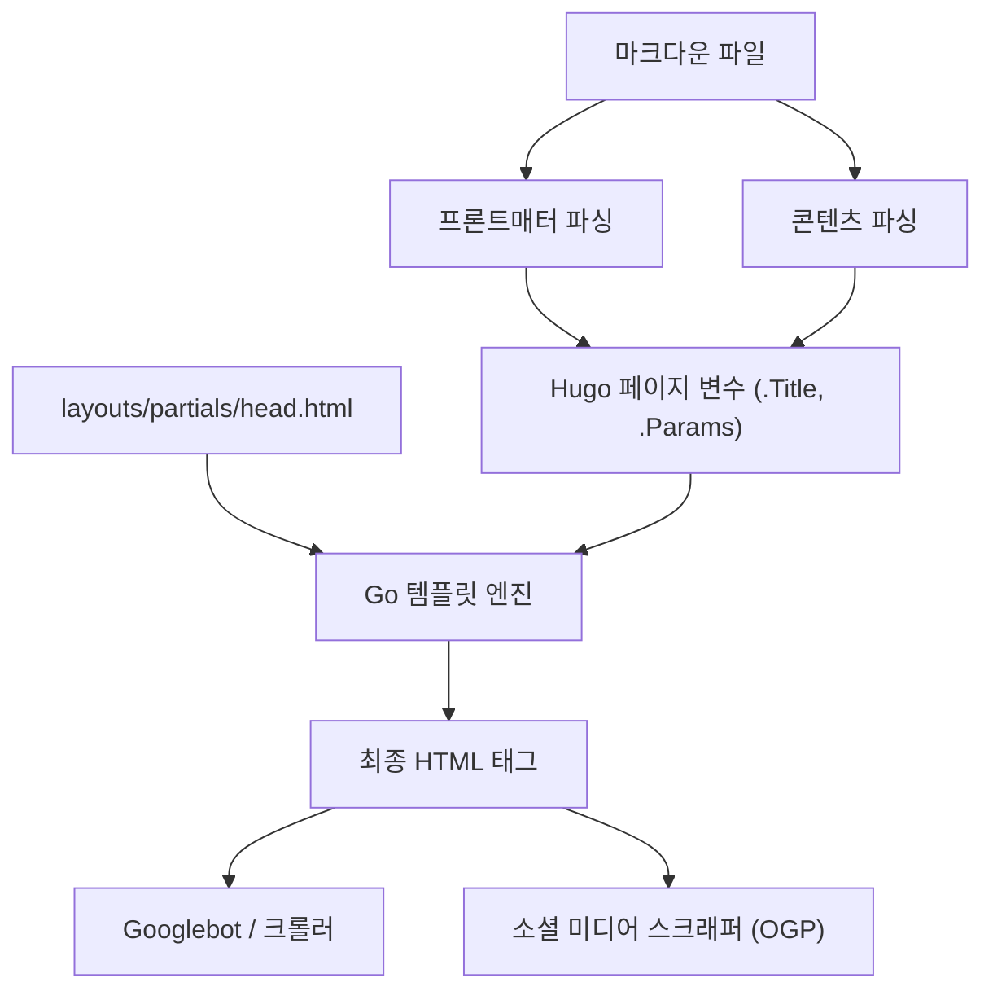
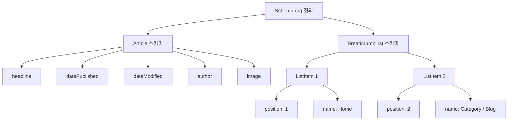

Hugo는 Go 언어로 작성된 세계에서 가장 빠른 클래스의 정적 사이트 생성기(SSG)입니다. 압도적인 빌드 속도와 유연한 템플릿 시스템으로 많은 엔지니어와 블로거로부터 높은 지지를 받고 있습니다. 하지만 사이트가 빠르게 생성되고 표시되는 것만으로는 검색 엔진(Google이나 Bing 등)에서 높게 평가받아 사용자에게 글을 전달할 수 없습니다.

검색 순위를 향상시키고, 소셜 미디어에서의 확산력을 높이며, 결과적으로 블로그의 방문자 수를 극적으로 늘리기 위해서는 치밀한 SEO(검색 엔진 최적화) 대책이 필수적입니다. Hugo에서 SEO 대책의 심장부가 되는 것은 각 마크다운 기사의 서두에 작성하는 **프론트매터(Frontmatter)**와 이를 해석하여 HTML의 `<head>` 태그 내에 메타데이터를 전개하는 **템플릿(Layouts)**의 연계입니다.

본 기사에서는 Hugo의 기능을 최대한으로 끌어내고, 고도의 SEO 대책을 구현하기 위한 프론트매터 설정부터 각종 메타 태그, OGP(Open Graph Protocol), Twitter Cards, 그리고 JSON-LD를 활용한 구조화 데이터 출력에 이르기까지 약 1만 글자가 넘는 압도적인 분량으로 철저히 해설합니다.

---

## 1. SEO와 트래픽의 수리적 배경

구체적인 구현에 들어가기 전에 왜 세밀한 SEO 메타데이터가 중요한지 수리적으로 이해해 둡시다. 웹사이트가 획득할 수 있는 검색 트래픽 $T$ 는 타겟팅하는 키워드의 검색 볼륨과 검색 순위에 기반한 클릭률(CTR)에 의해 결정됩니다.

이를 수식으로 나타내면 다음과 같습니다.

$$ T = \sum_{i=1}^{n} V_i \times CTR(R_i) $$

- $V_i$ : 키워드 $i$ 의 월간 검색 볼륨
- $R_i$ : 키워드 $i$ 의 검색 순위
- $CTR(R_i)$ : 순위 $R_i$ 에서의 클릭률

이 중 검색 순위 $R_i$ 는 콘텐츠의 질이나 백링크(PageRank) 등 많은 요인에 의존하지만, Google의 초기 페이지랭크 알고리즘은 다음과 같이 모델화되어 있습니다.

$$ PR(u) = \frac{1-d}{N} + d \sum_{v \in B(u)} \frac{PR(v)}{L(v)} $$

- $PR(u)$ : 페이지 $u$ 의 페이지랭크
- $d$ : 댐핑 팩터(보통 0.85)
- $B(u)$ : 페이지 $u$ 로 링크를 걸고 있는 페이지의 집합
- $L(v)$ : 페이지 $v$ 에서의 아웃바운드 링크 수

여기서 중요한 것은 **검색 순위 $R_i$ 를 올리는 노력에 더하여 클릭률 $CTR(R_i)$ 을 어떻게 극대화할 것인가** 하는 점입니다. 검색 결과(SERPs)에 표시되는 제목이나 스니펫(description), 소셜 미디어 상에서 공유되었을 때의 썸네일 이미지(OGP)를 최적화함으로써 $CTR(R_i)$ 을 의도적으로 끌어올리는 것이 가능합니다. 프론트매터의 SEO 설정은 바로 이 $CTR$ 의 극대화와 직결됩니다.

---

## 2. Hugo의 빌드 프로세스와 프론트매터의 역할

Hugo는 마크다운 파일 내의 프론트매터(YAML/TOML/JSON)를 읽어 들여 페이지 변수로서 템플릿 엔진에 전달합니다. 우선 이 정보의 흐름을 시각적으로 이해해 봅시다.



이와 같이 프론트매터에서 설정한 값은 `.Title`이나 `.Params.description` 등의 변수로서 `head.html`에 전달되어 최종적인 HTML 메타데이터로 출력됩니다. 따라서 SEO의 성공은 "프론트매터에 적절한 정보를 정의하는 것"과 "템플릿에서 이를 올바르게 HTML로 변환하는 것"이라는 두 가지 단계로 이루어집니다.

---

## 3. 기본적인 메타데이터의 설정: Title, Description, Canonical URL

검색 엔진이 페이지의 내용을 이해하기 위한 가장 기본적인 태그가 `<title>`과 `<meta name="description">`입니다. 또한, 중복 콘텐츠의 페널티를 피하기 위해 `<link rel="canonical">`도 필수입니다.

### 3.1. 프론트매터의 설정 예시

기사의 프론트매터에는 SEO에 특화된 필드를 준비합니다.

```yaml
---
title: 'Hugo 블로그의 SEO 대책: 방문자 수를 극적으로 늘리는 프론트매터 설정'
seo_title: 'Hugo SEO 대책 완전 가이드: 프론트매터로 트래픽 상승' # 옵션: 검색 엔진용
description: 'Hugo의 프론트매터를 활용한 고도의 SEO 대책 기법. OGP, JSON-LD, 메타데이터 설정 방법을 상세히 해설.'
slug: "hugo-seo-frontmatter-tips"
canonicalUrl: "https://example.com/post/hugo-seo-frontmatter-tips/" # 명시적인 표준 URL
---
```

### 3.2. `layouts/partials/head.html`의 구현

이러한 변수들을 올바르게 출력하기 위한 HTML 템플릿을 작성합니다.

```html
<!-- 제목 최적화 -->
{{ $title := .Title }}
{{ if .Params.seo_title }}
  {{ $title = .Params.seo_title }}
{{ end }}
<title>{{ $title }} | {{ .Site.Title }}</title>

<!-- Description 최적화 -->
{{ $description := .Summary | plainify | truncate 120 }}
{{ if .Params.description }}
  {{ $description = .Params.description }}
{{ end }}
<meta name="description" content="{{ $description }}">

<!-- Canonical URL (정규화) -->
{{ $canonical := .Permalink }}
{{ if .Params.canonicalUrl }}
  {{ $canonical = .Params.canonicalUrl }}
{{ end }}
<link rel="canonical" href="{{ $canonical }}">

<!-- 로봇 제어 (인덱스 거부 설정 등) -->
{{ if .Params.noindex }}
<meta name="robots" content="noindex, nofollow">
{{ else }}
<meta name="robots" content="index, follow">
{{ end }}
```

Hugo의 `.Summary`를 폴백으로 사용함으로써 `description`이 설정되지 않은 경우에도 자동으로 기사의 서두 부분을 추출할 수 있습니다.

---

## 4. OGP와 Twitter Cards: 소셜 미디어에서의 CTR을 극대화

Twitter(X)나 Facebook 등 SNS에서 기사가 공유되었을 때 매력적인 카드 형식으로 표시되게 하려면 Open Graph Protocol (OGP)과 Twitter Cards의 설정이 빠질 수 없습니다. 이것 역시 프론트매터에서 동적으로 생성합니다.

### 4.1. 내장 템플릿의 문제점

Hugo에는 `{{ template "_internal/opengraph.html" . }}`라는 편리한 내장 템플릿이 존재하지만, 커스터마이즈가 제한적이고 특정 요건이나 다국어 환경에 맞지 않는 경우가 있습니다. 따라서 독자적인 OGP 태그를 `head.html` 내에 구현하는 것을 강력히 권장합니다.

### 4.2. 프론트매터에서의 이미지 지정

```yaml
---
image: "img/eyecatch.jpg"
images:
  - "img/eyecatch-large.jpg" # 여러 이미지 지정이나 절대 경로용
---
```

### 4.3. OGP와 Twitter Cards의 독자적 구현 코드

```html
<!-- Open Graph Protocol -->
<meta property="og:title" content="{{ $title }}">
<meta property="og:description" content="{{ $description }}">
<meta property="og:type" content="{{ if .IsPage }}article{{ else }}website{{ end }}">
<meta property="og:url" content="{{ .Permalink }}">
<meta property="og:site_name" content="{{ .Site.Title }}">

<!-- OGP Image 해결 -->
{{ $ogImage := "" }}
{{ if .Params.image }}
  {{ $ogImage = .Params.image | absURL }}
{{ else if .Params.images }}
  {{ $ogImage = index .Params.images 0 | absURL }}
{{ else if .Site.Params.defaultImage }}
  {{ $ogImage = .Site.Params.defaultImage | absURL }}
{{ end }}

{{ if $ogImage }}
<meta property="og:image" content="{{ $ogImage }}">
<meta name="twitter:image" content="{{ $ogImage }}">
<meta name="twitter:card" content="summary_large_image">
{{ else }}
<meta name="twitter:card" content="summary">
{{ end }}

<!-- Twitter Cards -->
<meta name="twitter:title" content="{{ $title }}">
<meta name="twitter:description" content="{{ $description }}">
{{ if .Site.Params.twitterAccount }}
<meta name="twitter:site" content="@{{ .Site.Params.twitterAccount }}">
{{ end }}
```

`absURL` 함수를 거치게 함으로써 상대 경로로 지정된 이미지 URL을 절대 경로로 변환합니다. OGP에서는 절대 경로가 필수이므로 이 처리는 매우 중요합니다.

---

## 5. 구조화 데이터(JSON-LD)의 구현

현재의 SEO에서 검색 엔진에 페이지의 의미론적인 구조를 정확하게 전달하는 기술로서 **JSON-LD(JavaScript Object Notation for Linked Data)**가 주류를 이루고 있습니다. 이를 설정함으로써 검색 결과에 리치 스니펫(별점, 작성자명, 게시일 등)이 표시되기 쉬워집니다.

### 5.1. JSON-LD의 구조

블로그 기사에서는 주로 `Article`(기사) 스키마와 `BreadcrumbList`(브레드크럼 리스트) 스키마의 두 가지를 구현합니다.



### 5.2. Hugo 템플릿에서의 JSON-LD 생성

프론트매터의 `.Date`나 `.Lastmod` 등의 변수를 활용하여 JSON-LD를 동적으로 출력합니다. `<script type="application/ld+json">` 태그를 사용하여 `head.html`에 작성합니다.

```html
{{ if .IsPage }}
<script type="application/ld+json">
{
  "@context": "https://schema.org",
  "@type": "Article",
  "mainEntityOfPage": {
    "@type": "WebPage",
    "@id": "{{ .Permalink }}"
  },
  "headline": "{{ .Title | htmlEscape }}",
  "description": "{{ $description | htmlEscape }}",
  "image": "{{ $ogImage }}",
  "datePublished": "{{ .Date.Format "2006-01-02T15:04:05-07:00" }}",
  "dateModified": "{{ .Lastmod.Format "2006-01-02T15:04:05-07:00" }}",
  "author": {
    "@type": "Person",
    "name": "{{ if .Params.author }}{{ .Params.author }}{{ else }}{{ .Site.Params.author }}{{ end }}"
  },
  "publisher": {
    "@type": "Organization",
    "name": "{{ .Site.Title }}",
    "logo": {
      "@type": "ImageObject",
      "url": "{{ .Site.Params.logo | absURL }}"
    }
  }
}
</script>

<!-- BreadcrumbList Schema -->
<script type="application/ld+json">
{
  "@context": "https://schema.org",
  "@type": "BreadcrumbList",
  "itemListElement": [
    {
      "@type": "ListItem",
      "position": 1,
      "name": "Home",
      "item": "{{ .Site.BaseURL }}"
    }
    {{ $position := 2 }}
    {{ range .Params.categories }}
    ,{
      "@type": "ListItem",
      "position": {{ $position }},
      "name": "{{ . }}",
      "item": "{{ "categories/" | relLangURL }}{{ . | urlize | lower }}/"
    }
    {{ $position = add $position 1 }}
    {{ end }}
    ,{
      "@type": "ListItem",
      "position": {{ $position }},
      "name": "{{ .Title | htmlEscape }}",
      "item": "{{ .Permalink }}"
    }
  ]
}
</script>
{{ end }}
```

JSON-LD 내에서 문자열을 전개할 때는 큰따옴표의 파손을 방지하기 위해 `htmlEscape`(또는 `jsonify`)를 사용하는 것이 포인트입니다. 이를 통해 프론트매터에서 어떤 기호가 사용되더라도 JSON의 구문 오류를 방지할 수 있습니다.

---

## 6. 프론트매터의 고급 활용 테크닉

기본적인 SEO 메타데이터에 더해, Hugo의 프론트매터에는 더욱 고도의 SEO 전략을 실현하기 위한 기능이 있습니다.

### 6.1. 별칭(Aliases)을 통한 리다이렉트 처리

과거의 블로그 서비스에서 Hugo로 이전한 경우나 퍼머링크의 구조를 변경한 경우, 기존 URL의 접근을 새로운 URL로 리다이렉트할 필요가 있습니다. Hugo의 `aliases` 필드를 사용하면 이전 URL에 대한 HTTP-Equiv 리프레시(메타 리다이렉트) 페이지를 자동으로 생성할 수 있습니다.

```yaml
---
title: '새로운 기사 제목'
slug: "new-seo-post"
aliases:
  - "/old-category/old-seo-post/"
  - "/2020/05/12/seo-tips/"
---
```

### 6.2. 기사의 유효기간과 스케줄링

기간 한정 캠페인 기사나 시간이 지나면 가치를 잃는 정보의 경우, `expiryDate`를 설정함으로써 특정 일시 이후에는 빌드 결과에서 제외하고 사이트 상에 표시되지 않게(404를 반환하도록) 하는 것이 가능합니다. 이를 통해 품질이 낮은 오래된 콘텐츠가 인덱스에 계속 남아 사이트 전체의 평가를 낮추는 것을 방지합니다.

```yaml
---
title: '2026년 한정 SEO 테크닉'
publishDate: "2026-01-01T00:00:00Z"
expiryDate: "2026-12-31T23:59:59Z"
---
```

---

## 7. 사이트 성능과 Core Web Vitals

SEO에 있어 태그의 최적화만큼이나 중요한 것이 **페이지의 로딩 속도**입니다. Google은 Core Web Vitals(LCP, FID/INP, CLS)를 랭킹 요인으로 포함시키고 있습니다.

정적 사이트인 Hugo는 원래 TTFB(Time to First Byte)가 뛰어나지만, 이미지를 많이 사용하는 블로그에서는 이미지의 최적화가 필수적입니다. Hugo의 강력한 이미지 처리 기능(Image Processing)을 프론트매터와 조합하여 사용함으로써, Next-gen 포맷(WebP 등)으로의 변환이나 리사이징을 빌드 시에 자동화할 수 있습니다.

예를 들어, 프론트매터에서 지정한 이미지 경로로부터 템플릿 측에서 자동으로 WebP 이미지를 생성하는 쇼트코드를 작성할 수 있습니다. 이를 통해 SEO의 평가를 극적으로 높이는 것이 가능합니다.

---

## 8. 요약

Hugo를 이용한 블로그 운영에 있어서 프론트매터는 단순한 '설정값의 나열'이 아니라 검색 엔진이나 SNS와 대화하기 위한 '컨트롤 패널'입니다.

본 기사에서 해설한 이하의 포인트들을 완전히 구현함으로써 여러분의 블로그 SEO 기반은 견고해질 것입니다.

1. **기본 메타데이터의 동적 생성**: Title, Description, Canonical의 확실한 출력
2. **소셜 공유의 최적화**: OGP와 Twitter Cards의 커스텀 구현을 통한 CTR 향상
3. **구조화 데이터의 완전 대응**: JSON-LD(Article, Breadcrumb)에 의한 리치 리절트 대응
4. **고도의 트래픽 관리**: Aliases에 의한 리다이렉트나 메타 태그를 통한 로봇 제어

검색 엔진의 알고리즘은 날마다 진화하고 있지만, 검색 엔진이 '페이지의 내용을 올바르게 이해한다'는 것을 돕기 위해 시그널을 제공한다는 SEO의 근본 원칙은 변하지 않습니다. Hugo의 유연한 템플릿 엔진과 프론트매터를 마스터함으로써 그 시그널을 최고 품질로 계속해서 발신하여 블로그의 방문자 수를 극적으로 증가시킵시다.
