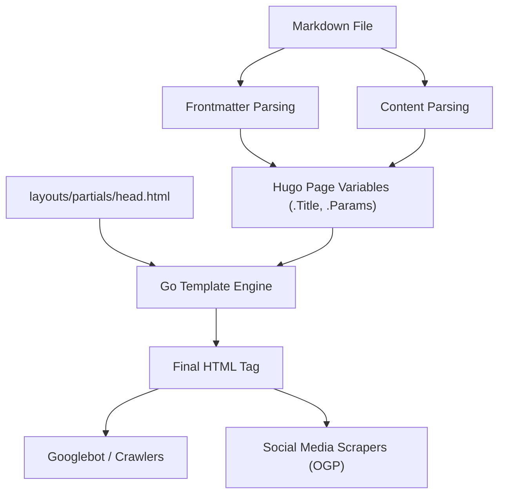
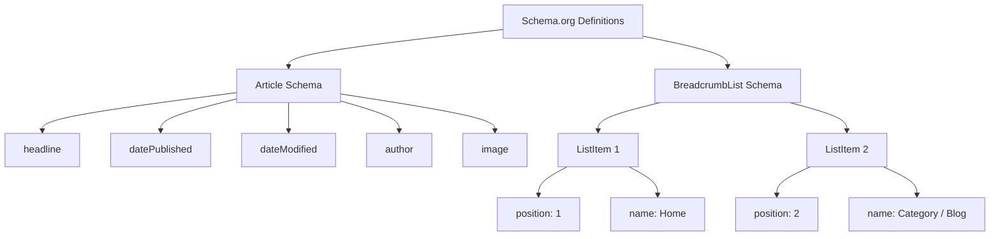

Hugoは、Go言語で記述された世界最速クラスの静的サイトジェネレーター（SSG）です。その圧倒的なビルド速度と柔軟なテンプレートシステムにより、多くのエンジニアやブロガーから高い支持を得ています。しかし、サイトが高速に生成・表示されるだけでは、検索エンジン（GoogleやBingなど）から高く評価され、ユーザーに記事を届けることはできません。

検索順位を向上させ、ソーシャルメディアでの拡散力を高め、結果としてブログへのアクセス数を劇的に増やすためには、緻密なSEO（検索エンジン最適化）対策が不可欠です。HugoにおけるSEO対策の心臓部となるのが、各マークダウン記事の冒頭に記述する**フロントマター（Frontmatter）**と、それを解釈してHTMLの `<head>` タグ内にメタデータを展開する**テンプレート（Layouts）**の連携です。

本記事では、Hugoの機能を最大限に引き出し、高度なSEO対策を実装するためのフロントマター設定から、各種メタタグ、OGP（Open Graph Protocol）、Twitter Cards、そしてJSON-LDを用いた構造化データの出力に至るまで、約1万文字を超える圧倒的なボリュームで徹底的に解説します。

---

## 1. SEOとトラフィックの数理的背景

具体的な実装に入る前に、なぜ細かなSEOメタデータが重要なのかを数理的に理解しておきましょう。ウェブサイトが獲得できる検索トラフィック $T$ は、ターゲットとするキーワードの検索ボリュームと、検索順位に基づくクリック率（CTR）によって決定されます。

これを数式で表すと以下のようになります。

$$ T = \sum_{i=1}^{n} V_i \times CTR(R_i) $$

- $V_i$ : キーワード $i$ の月間検索ボリューム
- $R_i$ : キーワード $i$ における検索順位
- $CTR(R_i)$ : 順位 $R_i$ におけるクリック率

このうち、検索順位 $R_i$ はコンテンツの質や被リンク（PageRank）など多くの要因に依存しますが、Googleの初期のページランクアルゴリズムは以下のようにモデル化されています。

$$ PR(u) = \frac{1-d}{N} + d \sum_{v \in B(u)} \frac{PR(v)}{L(v)} $$

- $PR(u)$ : ページ $u$ のページランク
- $d$ : ダンピングファクター（通常0.85）
- $B(u)$ : ページ $u$ にリンクしているページの集合
- $L(v)$ : ページ $v$ からの出リンク数

ここで重要なのは、**検索順位 $R_i$ を上げる努力に加えて、クリック率 $CTR(R_i)$ をいかに最大化するか**という点です。検索結果（SERPs）に表示されるタイトルやスニペット（description）、ソーシャルメディア上でシェアされた際のアイキャッチ画像（OGP）を最適化することで、$CTR(R_i)$ を意図的に引き上げることが可能です。フロントマターのSEO設定は、まさにこの $CTR$ の最大化に直結します。

---

## 2. Hugoのビルドプロセスとフロントマターの役割

Hugoは、マークダウンファイル内のフロントマター（YAML/TOML/JSON）を読み込み、ページ変数としてテンプレートエンジンに渡します。まずはこの情報の流れを視覚的に理解しましょう。



このように、フロントマターで設定した値は `.Title` や `.Params.description` などの変数として `head.html` に渡され、最終的なHTMLメタデータとして出力されます。したがって、SEOの成功は「フロントマターに適切な情報を定義すること」と「テンプレートでそれを正しくHTMLに変換すること」の2つのステップから成り立ちます。

---

## 3. 基本的なメタデータの設定：Title, Description, Canonical URL

検索エンジンがページの内容を理解するための最も基本的なタグが、`<title>` と `<meta name="description">` です。また、重複コンテンツのペナルティを避けるために `<link rel="canonical">` も必須です。

### 3.1. フロントマターの設定例

記事のフロントマターには、SEOに特化したフィールドを用意します。

```yaml
---
title: "HugoブログのSEO対策：アクセス数を劇的に増やすフロントマター設定"
seo_title: "Hugo SEO対策完全ガイド：フロントマターでアクセスアップ" # オプション: 検索エンジン用
description: 'Hugoのフロントマターを活用した高度なSEO対策の手法。OGP、JSON-LD、メタデータの設定方法を詳細に解説。'
slug: "hugo-seo-frontmatter-tips"
canonicalUrl: "https://example.com/post/hugo-seo-frontmatter-tips/" # 明示的な正規URL
---
```

### 3.2. `layouts/partials/head.html` の実装

これらの変数を正しく出力するためのHTMLテンプレートを作成します。

```html
<!-- タイトルの最適化 -->
{{ $title := .Title }}
{{ if .Params.seo_title }}
  {{ $title = .Params.seo_title }}
{{ end }}
<title>{{ $title }} | {{ .Site.Title }}</title>

<!-- Descriptionの最適化 -->
{{ $description := .Summary | plainify | truncate 120 }}
{{ if .Params.description }}
  {{ $description = .Params.description }}
{{ end }}
<meta name="description" content="{{ $description }}">

<!-- Canonical URL（正規化） -->
{{ $canonical := .Permalink }}
{{ if .Params.canonicalUrl }}
  {{ $canonical = .Params.canonicalUrl }}
{{ end }}
<link rel="canonical" href="{{ $canonical }}">

<!-- ロボット制御（インデックス拒否設定など） -->
{{ if .Params.noindex }}
<meta name="robots" content="noindex, nofollow">
{{ else }}
<meta name="robots" content="index, follow">
{{ end }}
```

Hugoの `.Summary` をフォールバックとして使用することで、`description`が未設定の場合でも自動的に記事の冒頭文を抽出できます。

---

## 4. OGPとTwitter Cards：ソーシャルメディアでのCTRを最大化

Twitter（X）やFacebookなどのSNSで記事がシェアされた際、魅力的なカード形式で表示させるためには、Open Graph Protocol (OGP) と Twitter Cards の設定が欠かせません。これもフロントマターから動的に生成します。

### 4.1. 組み込みテンプレートの課題

Hugoには `{{ template "_internal/opengraph.html" . }}` という便利な組み込みテンプレートが存在しますが、カスタマイズ性に乏しく、日本語環境や特定の要件に合わないケースがあります。そのため、独自のOGPタグを `head.html` 内に実装することを強くお勧めします。

### 4.2. フロントマターでの画像指定

```yaml
---
image: "img/eyecatch.jpg"
images:
  - "img/eyecatch-large.jpg" # 複数画像の指定や絶対パス用
---
```

### 4.3. OGPとTwitter Cardsの独自実装コード

```html
<!-- Open Graph Protocol -->
<meta property="og:title" content="{{ $title }}">
<meta property="og:description" content="{{ $description }}">
<meta property="og:type" content="{{ if .IsPage }}article{{ else }}website{{ end }}">
<meta property="og:url" content="{{ .Permalink }}">
<meta property="og:site_name" content="{{ .Site.Title }}">

<!-- OGP Imageの解決 -->
{{ $ogImage := "" }}
{{ if .Params.image }}
  {{ $ogImage = .Params.image | absURL }}
{{ else if .Params.images }}
  {{ $ogImage = index .Params.images 0 | absURL }}
{{ else if .Site.Params.defaultImage }}
  {{ $ogImage = .Site.Params.defaultImage | absURL }}
{{ end }}

{{ if $ogImage }}
<meta property="og:image" content="{{ $ogImage }}">
<meta name="twitter:image" content="{{ $ogImage }}">
<meta name="twitter:card" content="summary_large_image">
{{ else }}
<meta name="twitter:card" content="summary">
{{ end }}

<!-- Twitter Cards -->
<meta name="twitter:title" content="{{ $title }}">
<meta name="twitter:description" content="{{ $description }}">
{{ if .Site.Params.twitterAccount }}
<meta name="twitter:site" content="@{{ .Site.Params.twitterAccount }}">
{{ end }}
```

`absURL` 関数をかませることで、相対パスで指定された画像URLを絶対パスに変換します。OGPでは絶対パスが必須であるため、この処理は極めて重要です。

---

## 5. 構造化データ（JSON-LD）の実装

現在のSEOにおいて、検索エンジンにページの意味論的な構造を正確に伝える技術として **JSON-LD（JavaScript Object Notation for Linked Data）** が主流となっています。これを設定することで、検索結果にリッチスニペット（星評価、著者名、公開日など）が表示されやすくなります。

### 5.1. JSON-LDの構造

ブログ記事においては、主に `Article`（記事）スキーマと `BreadcrumbList`（パンくずリスト）スキーマの2つを実装します。



### 5.2. HugoテンプレートでのJSON-LD生成

フロントマターの `.Date` や `.Lastmod` などの変数を活用し、JSON-LDを動的に出力します。`<script type="application/ld+json">` タグを使用して `head.html` に記述します。

```html
{{ if .IsPage }}
<script type="application/ld+json">
{
  "@context": "https://schema.org",
  "@type": "Article",
  "mainEntityOfPage": {
    "@type": "WebPage",
    "@id": "{{ .Permalink }}"
  },
  "headline": "{{ .Title | htmlEscape }}",
  "description": "{{ $description | htmlEscape }}",
  "image": "{{ $ogImage }}",
  "datePublished": "{{ .Date.Format "2006-01-02T15:04:05-07:00" }}",
  "dateModified": "{{ .Lastmod.Format "2006-01-02T15:04:05-07:00" }}",
  "author": {
    "@type": "Person",
    "name": "{{ if .Params.author }}{{ .Params.author }}{{ else }}{{ .Site.Params.author }}{{ end }}"
  },
  "publisher": {
    "@type": "Organization",
    "name": "{{ .Site.Title }}",
    "logo": {
      "@type": "ImageObject",
      "url": "{{ .Site.Params.logo | absURL }}"
    }
  }
}
</script>

<!-- BreadcrumbList Schema -->
<script type="application/ld+json">
{
  "@context": "https://schema.org",
  "@type": "BreadcrumbList",
  "itemListElement": [
    {
      "@type": "ListItem",
      "position": 1,
      "name": "Home",
      "item": "{{ .Site.BaseURL }}"
    }
    {{ $position := 2 }}
    {{ range .Params.categories }}
    ,{
      "@type": "ListItem",
      "position": {{ $position }},
      "name": "{{ . }}",
      "item": "{{ "categories/" | relLangURL }}{{ . | urlize | lower }}/"
    }
    {{ $position = add $position 1 }}
    {{ end }}
    ,{
      "@type": "ListItem",
      "position": {{ $position }},
      "name": "{{ .Title | htmlEscape }}",
      "item": "{{ .Permalink }}"
    }
  ]
}
</script>
{{ end }}
```

JSON-LD内で文字列を展開する際は、ダブルクォーテーションの破壊を防ぐために `htmlEscape`（または `jsonify`）を使用することがポイントです。これにより、フロントマターでどのような記号が使われていても、JSONの構文エラーを防ぐことができます。

---

## 6. フロントマターの高度な活用テクニック

基本的なSEOメタデータに加え、Hugoのフロントマターにはさらに高度なSEO戦略を実現するための機能があります。

### 6.1. エイリアス (Aliases) によるリダイレクト処理

過去のブログサービスからHugoに移行した場合や、パーマリンクの構造を変更した場合、既存のURLからのアクセスを新しいURLへリダイレクトする必要があります。Hugoの `aliases` フィールドを使えば、古いURLに対するHTTP-Equivリフレッシュ（メタ・リダイレクト）ページを自動生成できます。

```yaml
---
title: "新しい記事タイトル"
slug: "new-seo-post"
aliases:
  - "/old-category/old-seo-post/"
  - "/2020/05/12/seo-tips/"
---
```

### 6.2. 記事の有効期限とスケジューリング

期間限定のキャンペーン記事や、古くなると価値を失う情報の場合、`expiryDate` を設定することで、特定の日時以降はビルド結果から除外し、サイト上に表示させないように（404を返すように）することが可能です。これにより、品質の低い古いコンテンツがインデックスに残り続け、サイト全体の評価を下げることを防ぎます。

```yaml
---
title: "2026年限定のSEOテクニック"
publishDate: "2026-01-01T00:00:00Z"
expiryDate: "2026-12-31T23:59:59Z"
---
```

---

## 7. サイトパフォーマンスとCore Web Vitals

SEOにおいて、タグの最適化と同じくらい重要なのが **ページの読み込み速度** です。GoogleはCore Web Vitals（LCP, FID/INP, CLS）をランキング要因として組み込んでいます。

静的サイトであるHugoはもともとTTFB (Time to First Byte) が優れていますが、画像を多用するブログでは画像の最適化が必須です。Hugoの強力な画像処理機能（Image Processing）をフロントマターと組み合わせて使用することで、Next-genフォーマット（WebPなど）への変換やリサイズをビルド時に自動化できます。

例えば、フロントマターで指定した画像パスから、テンプレート側で自動的にWebP画像を生成するショートコードを作成することができます。これにより、SEOの評価を劇的に高めることが可能です。

---

## 8. まとめ

Hugoを用いたブログ運用において、フロントマターは単なる「設定値の羅列」ではなく、検索エンジンやSNSと対話するための「コントロールパネル」です。

本記事で解説した以下のポイントを完全に実装することで、あなたのブログのSEO基盤は強固なものになります。

1. **基本メタデータの動的生成**: Title, Description, Canonicalの確実な出力
2. **ソーシャルシェアの最適化**: OGPとTwitter Cardsのカスタム実装によるCTR向上
3. **構造化データの完全対応**: JSON-LD（Article, Breadcrumb）によるリッチリザルト対応
4. **高度なトラフィック管理**: Aliasesによるリダイレクトやメタタグでのロボット制御

検索エンジンのアルゴリズムは日々進化していますが、検索エンジンが「ページの内容を正しく理解する」ためのシグナルを提供するというSEOの根本原則は変わりません。Hugoの柔軟なテンプレートエンジンとフロントマターを極めることで、そのシグナルを最高品質で発信し続け、ブログへのアクセス数を劇的に増加させましょう。
