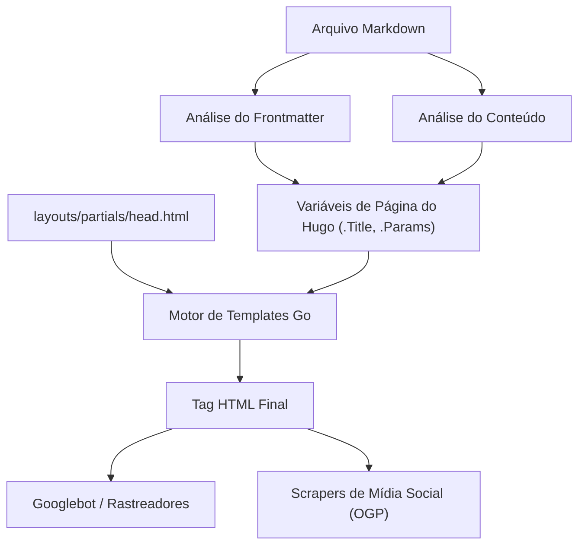
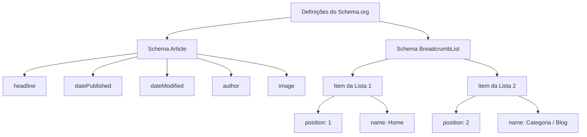

O Hugo é um dos geradores de sites estáticos (SSG) mais rápidos do mundo, escrito na linguagem Go. Devido à sua velocidade de construção avassaladora e sistema de templates flexível, recebe grande apoio de muitos engenheiros e blogueiros. No entanto, apenas gerar e exibir um site rapidamente não é suficiente para ser bem avaliado pelos motores de busca (como Google e Bing) e entregar seus artigos aos usuários.

Para melhorar as classificações de pesquisa, aumentar o poder de difusão nas mídias sociais e, consequentemente, aumentar dramaticamente o número de acessos ao blog, medidas meticulosas de SEO (Otimização para Motores de Busca) são essenciais. O coração do SEO no Hugo é a integração do **Frontmatter**, escrito no início de cada artigo em markdown, e os **Templates (Layouts)**, que o interpretam para expandir metadados dentro da tag HTML `<head>`.

Neste artigo, explicaremos de forma minuciosa, com um volume esmagador de mais de 10.000 caracteres, desde as configurações de frontmatter para extrair o máximo das funcionalidades do Hugo e implementar medidas avançadas de SEO, até várias meta tags, OGP (Open Graph Protocol), Twitter Cards, e a saída de dados estruturados usando JSON-LD.

---

## 1. Contexto Matemático do SEO e Tráfego

Antes de entrar na implementação específica, vamos entender matematicamente por que metadados detalhados de SEO são importantes. O tráfego de pesquisa $T$ que um site pode adquirir é determinado pelo volume de pesquisa da palavra-chave alvo e pela taxa de cliques (CTR) baseada na classificação da pesquisa.

Isso pode ser expresso pela seguinte fórmula:

$$ T = \sum_{i=1}^{n} V_i \times CTR(R_i) $$

- $V_i$ : Volume de pesquisa mensal da palavra-chave $i$
- $R_i$ : Classificação de pesquisa da palavra-chave $i$
- $CTR(R_i)$ : Taxa de cliques na classificação $R_i$

Dentre estes, a classificação de pesquisa $R_i$ depende de muitos fatores, como a qualidade do conteúdo e backlinks (PageRank), mas o algoritmo inicial de PageRank do Google é modelado da seguinte forma:

$$ PR(u) = \frac{1-d}{N} + d \sum_{v \in B(u)} \frac{PR(v)}{L(v)} $$

- $PR(u)$ : PageRank da página $u$
- $d$ : Fator de amortecimento (geralmente 0.85)
- $B(u)$ : Conjunto de páginas que possuem links para a página $u$
- $L(v)$ : Número de links de saída da página $v$

O ponto importante aqui é: **além do esforço para aumentar a classificação de pesquisa $R_i$, como maximizar a taxa de cliques $CTR(R_i)$**. Ao otimizar o título e o snippet (description) exibidos nos resultados de pesquisa (SERPs), e a imagem de destaque (OGP) quando compartilhada nas redes sociais, é possível aumentar intencionalmente o $CTR(R_i)$. A configuração de SEO no frontmatter está diretamente ligada à maximização desse $CTR$.

---

## 2. O Processo de Build do Hugo e o Papel do Frontmatter

O Hugo lê o frontmatter (YAML/TOML/JSON) dentro do arquivo markdown e o passa para o motor de templates como variáveis de página. Primeiro, vamos entender visualmente esse fluxo de informações.



Desta forma, os valores definidos no frontmatter são passados para o `head.html` como variáveis, como `.Title` e `.Params.description`, e finalmente renderizados como metadados HTML. Portanto, o sucesso do SEO consiste em dois passos: "definir informações apropriadas no frontmatter" e "convertê-las corretamente para HTML usando templates".

---

## 3. Configurações Básicas de Metadados: Title, Description, Canonical URL

As tags mais básicas para que os motores de busca compreendam o conteúdo de uma página são `<title>` e `<meta name="description">`. Além disso, `<link rel="canonical">` é essencial para evitar penalidades por conteúdo duplicado.

### 3.1. Exemplo de Configuração no Frontmatter

No frontmatter do artigo, prepare campos específicos para SEO.

```yaml
---
title: 'Otimização de SEO para Blogs Hugo: Configurações de Frontmatter para Aumentar Dramaticamente o Tráfego'
seo_title: 'Guia Completo de SEO no Hugo: Aumente o Tráfego com Frontmatter' # Opcional: Para motores de busca
description: 'Técnicas avançadas de SEO utilizando o frontmatter do Hugo. Explicação detalhada de como configurar OGP, JSON-LD e metadados.'
slug: "hugo-seo-frontmatter-tips"
canonicalUrl: "https://example.com/post/hugo-seo-frontmatter-tips/" # URL canônica explícita
---
```

### 3.2. Implementação do `layouts/partials/head.html`

Crie um template HTML para exibir corretamente essas variáveis.

```html
<!-- Otimização do Título -->
{{ $title := .Title }}
{{ if .Params.seo_title }}
  {{ $title = .Params.seo_title }}
{{ end }}
<title>{{ $title }} | {{ .Site.Title }}</title>

<!-- Otimização da Description -->
{{ $description := .Summary | plainify | truncate 120 }}
{{ if .Params.description }}
  {{ $description = .Params.description }}
{{ end }}
<meta name="description" content="{{ $description }}">

<!-- Canonical URL (Normalização) -->
{{ $canonical := .Permalink }}
{{ if .Params.canonicalUrl }}
  {{ $canonical = .Params.canonicalUrl }}
{{ end }}
<link rel="canonical" href="{{ $canonical }}">

<!-- Controle de Robôs (Configuração de noindex, etc.) -->
{{ if .Params.noindex }}
<meta name="robots" content="noindex, nofollow">
{{ else }}
<meta name="robots" content="index, follow">
{{ end }}
```

Ao usar o `.Summary` do Hugo como fallback, a frase inicial do artigo pode ser extraída automaticamente, mesmo se `description` não estiver definida.

---

## 4. OGP e Twitter Cards: Maximizando o CTR nas Mídias Sociais

Para que os artigos sejam exibidos em um formato de cartão atraente quando compartilhados em redes sociais como Twitter (X) e Facebook, a configuração do Open Graph Protocol (OGP) e do Twitter Cards é indispensável. Eles também são gerados dinamicamente a partir do frontmatter.

### 4.1. Desafios com Templates Integrados

O Hugo possui um template integrado útil `{{ template "_internal/opengraph.html" . }}`, mas ele carece de personalização e pode não ser adequado para ambientes em japonês ou requisitos específicos. Portanto, é altamente recomendável implementar tags OGP personalizadas no seu `head.html`.

### 4.2. Especificando Imagens no Frontmatter

```yaml
---
image: "img/eyecatch.jpg"
images:
  - "img/eyecatch-large.jpg" # Para caminhos absolutos ou múltiplas imagens
---
```

### 4.3. Código de Implementação Personalizada de OGP e Twitter Cards

```html
<!-- Open Graph Protocol -->
<meta property="og:title" content="{{ $title }}">
<meta property="og:description" content="{{ $description }}">
<meta property="og:type" content="{{ if .IsPage }}article{{ else }}website{{ end }}">
<meta property="og:url" content="{{ .Permalink }}">
<meta property="og:site_name" content="{{ .Site.Title }}">

<!-- Resolução da Imagem OGP -->
{{ $ogImage := "" }}
{{ if .Params.image }}
  {{ $ogImage = .Params.image | absURL }}
{{ else if .Params.images }}
  {{ $ogImage = index .Params.images 0 | absURL }}
{{ else if .Site.Params.defaultImage }}
  {{ $ogImage = .Site.Params.defaultImage | absURL }}
{{ end }}

{{ if $ogImage }}
<meta property="og:image" content="{{ $ogImage }}">
<meta name="twitter:image" content="{{ $ogImage }}">
<meta name="twitter:card" content="summary_large_image">
{{ else }}
<meta name="twitter:card" content="summary">
{{ end }}

<!-- Twitter Cards -->
<meta name="twitter:title" content="{{ $title }}">
<meta name="twitter:description" content="{{ $description }}">
{{ if .Site.Params.twitterAccount }}
<meta name="twitter:site" content="@{{ .Site.Params.twitterAccount }}">
{{ end }}
```

Ao usar a função `absURL`, os URLs de imagem especificados como caminhos relativos são convertidos em caminhos absolutos. Como o OGP exige caminhos absolutos, esse processo é extremamente importante.

---

## 5. Implementação de Dados Estruturados (JSON-LD)

No SEO atual, o **JSON-LD (JavaScript Object Notation for Linked Data)** se tornou a tecnologia dominante para transmitir com precisão a estrutura semântica de uma página aos motores de busca. Ao configurar isso, é mais provável que rich snippets (avaliação com estrelas, nome do autor, data de publicação, etc.) sejam exibidos nos resultados de pesquisa.

### 5.1. Estrutura do JSON-LD

Em artigos de blog, implementamos principalmente dois schemas: o schema `Article` (Artigo) e o schema `BreadcrumbList` (Lista de Trilhas de Navegação).



### 5.2. Gerando JSON-LD nos Templates do Hugo

Utilizando variáveis do frontmatter como `.Date` e `.Lastmod`, o JSON-LD é gerado dinamicamente. Ele é escrito no `head.html` usando a tag `<script type="application/ld+json">`.

```html
{{ if .IsPage }}
<script type="application/ld+json">
{
  "@context": "https://schema.org",
  "@type": "Article",
  "mainEntityOfPage": {
    "@type": "WebPage",
    "@id": "{{ .Permalink }}"
  },
  "headline": "{{ .Title | htmlEscape }}",
  "description": "{{ $description | htmlEscape }}",
  "image": "{{ $ogImage }}",
  "datePublished": "{{ .Date.Format "2006-01-02T15:04:05-07:00" }}",
  "dateModified": "{{ .Lastmod.Format "2006-01-02T15:04:05-07:00" }}",
  "author": {
    "@type": "Person",
    "name": "{{ if .Params.author }}{{ .Params.author }}{{ else }}{{ .Site.Params.author }}{{ end }}"
  },
  "publisher": {
    "@type": "Organization",
    "name": "{{ .Site.Title }}",
    "logo": {
      "@type": "ImageObject",
      "url": "{{ .Site.Params.logo | absURL }}"
    }
  }
}
</script>

<!-- BreadcrumbList Schema -->
<script type="application/ld+json">
{
  "@context": "https://schema.org",
  "@type": "BreadcrumbList",
  "itemListElement": [
    {
      "@type": "ListItem",
      "position": 1,
      "name": "Home",
      "item": "{{ .Site.BaseURL }}"
    }
    {{ $position := 2 }}
    {{ range .Params.categories }}
    ,{
      "@type": "ListItem",
      "position": {{ $position }},
      "name": "{{ . }}",
      "item": "{{ "categories/" | relLangURL }}{{ . | urlize | lower }}/"
    }
    {{ $position = add $position 1 }}
    {{ end }}
    ,{
      "@type": "ListItem",
      "position": {{ $position }},
      "name": "{{ .Title | htmlEscape }}",
      "item": "{{ .Permalink }}"
    }
  ]
}
</script>
{{ end }}
```

Ao expandir strings dentro do JSON-LD, o principal ponto é usar `htmlEscape` (ou `jsonify`) para evitar a quebra das aspas duplas. Isso evita erros de sintaxe no JSON, independentemente de quais símbolos sejam usados no frontmatter.

---

## 6. Técnicas Avançadas para Aproveitar o Frontmatter

Além dos metadados básicos de SEO, o frontmatter do Hugo possui recursos para implementar estratégias de SEO ainda mais avançadas.

### 6.1. Processamento de Redirecionamento por Aliases

Ao migrar para o Hugo de um serviço de blog anterior ou alterar a estrutura do permalink, você precisa redirecionar o acesso de URLs antigos para os novos. Ao usar o campo `aliases` do Hugo, você pode gerar automaticamente páginas de atualização HTTP-Equiv (meta redirecionamento) para URLs antigos.

```yaml
---
title: 'Novo Título do Artigo'
slug: "new-seo-post"
aliases:
  - "/old-category/old-seo-post/"
  - "/2020/05/12/seo-tips/"
---
```

### 6.2. Expiração de Artigos e Agendamento

No caso de artigos de campanhas por tempo limitado ou informações que perdem seu valor ao envelhecer, definindo `expiryDate`, você pode excluí-los do resultado do build após a data e hora especificadas e impedi-los de aparecer no site (retornando um 404). Isso evita que conteúdos antigos de baixa qualidade permaneçam no índice e reduzam a classificação geral do site.

```yaml
---
title: 'Técnicas de SEO Exclusivas de 2026'
publishDate: "2026-01-01T00:00:00Z"
expiryDate: "2026-12-31T23:59:59Z"
---
```

---

## 7. Desempenho do Site e Core Web Vitals

No SEO, tão importante quanto a otimização de tags é a **velocidade de carregamento da página**. O Google incorpora os Core Web Vitals (LCP, FID/INP, CLS) como fatores de classificação.

Sendo um site estático, o Hugo possui um excelente TTFB (Tempo até o Primeiro Byte), mas em blogs com uso intenso de imagens, a otimização de imagens é obrigatória. Combinando o poderoso processamento de imagem do Hugo (Image Processing) com o frontmatter, você pode automatizar o redimensionamento e a conversão para formatos de próxima geração (como WebP) no momento do build.

Por exemplo, você pode criar um shortcode que gera automaticamente uma imagem WebP no template a partir do caminho da imagem especificado no frontmatter. Isso pode melhorar dramaticamente a avaliação do seu SEO.

---

## 8. Conclusão

Ao gerenciar um blog usando Hugo, o frontmatter não é apenas uma "lista de configurações", mas sim um "painel de controle" para interagir com motores de busca e redes sociais.

Implementar completamente os pontos explicados neste artigo fortalecerá de forma robusta a base de SEO do seu blog.

1. **Geração dinâmica de metadados básicos**: Saída confiável de Title, Description e Canonical
2. **Otimização de compartilhamento social**: Melhoria de CTR com implementação customizada de OGP e Twitter Cards
3. **Suporte completo para dados estruturados**: Suporte a rich results por JSON-LD (Article, Breadcrumb)
4. **Gerenciamento avançado de tráfego**: Controle de robôs através de meta tags e redirecionamentos via Aliases

Embora os algoritmos dos motores de busca evoluam todos os dias, o princípio fundamental do SEO de fornecer sinais para que os motores de busca "entendam corretamente o conteúdo da página" permanece o mesmo. Ao dominar o frontmatter e o motor de templates flexível do Hugo, você pode continuar enviando esse sinal com a mais alta qualidade e aumentar drasticamente o tráfego do seu blog.
