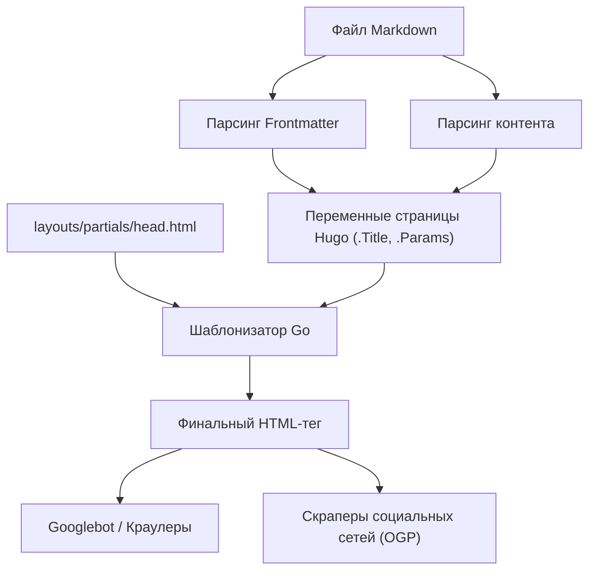
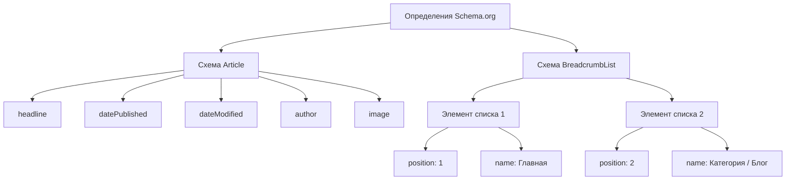

Hugo — это один из самых быстрых в мире генераторов статических сайтов (SSG), написанный на языке Go. Благодаря потрясающей скорости сборки и гибкой системе шаблонов он получил высокую оценку многих инженеров и блогеров. Однако того, что сайт генерируется и отображается быстро, недостаточно для того, чтобы поисковые системы (такие как Google или Bing) высоко его оценили и доставили статьи пользователям.

Для повышения позиций в поиске, увеличения виральности в социальных сетях и, как следствие, резкого роста посещаемости блога необходима тщательная SEO-оптимизация (поисковая оптимизация). Сердцем SEO в Hugo является взаимодействие между **Frontmatter**, который описывается в начале каждой статьи в формате Markdown, и **шаблонами (Layouts)**, которые интерпретируют его и разворачивают метаданные внутри тега HTML `<head>`.

В этой статье мы подробно, в объеме более 10 000 символов, рассмотрим, как максимально использовать возможности Hugo и реализовать продвинутое SEO: от настройки Frontmatter до различных метатегов, OGP (Open Graph Protocol), Twitter Cards и вывода структурированных данных с использованием JSON-LD.

---

## 1. Математические основы SEO и трафика

Перед тем как перейти к конкретной реализации, давайте математически поймем, почему важны подробные SEO-метаданные. Поисковый трафик $T$, который может получить веб-сайт, определяется объемом поиска целевых ключевых слов и показателем кликабельности (CTR), основанным на позиции в поиске.

В виде формулы это можно выразить следующим образом:

$$ T = \sum_{i=1}^{n} V_i \times CTR(R_i) $$

- $V_i$ : Ежемесячный объем поиска для ключевого слова $i$
- $R_i$ : Позиция в поиске для ключевого слова $i$
- $CTR(R_i)$ : Показатель кликабельности на позиции $R_i$

Среди них позиция в поиске $R_i$ зависит от многих факторов, таких как качество контента и обратные ссылки (PageRank), но первоначальный алгоритм PageRank от Google моделируется следующим образом:

$$ PR(u) = \frac{1-d}{N} + d \sum_{v \in B(u)} \frac{PR(v)}{L(v)} $$

- $PR(u)$ : PageRank страницы $u$
- $d$ : Коэффициент затухания (обычно 0.85)
- $B(u)$ : Множество страниц, ссылающихся на страницу $u$
- $L(v)$ : Количество исходящих ссылок со страницы $v$

Здесь важно отметить, что **помимо усилий по повышению позиции $R_i$, необходимо максимально увеличить кликабельность $CTR(R_i)$**. Оптимизируя заголовки и сниппеты (description), отображаемые в результатах поиска (SERP), а также привлекательные изображения (OGP) при публикации в социальных сетях, можно намеренно повысить $CTR(R_i)$. SEO-настройки во Frontmatter напрямую связаны с максимизацией этого $CTR$.

---

## 2. Процесс сборки Hugo и роль Frontmatter

Hugo считывает Frontmatter (YAML/TOML/JSON) в файлах Markdown и передает его в шаблонизатор в качестве переменных страницы. Давайте сначала визуально поймем этот поток информации.



Таким образом, значения, установленные во Frontmatter, передаются в `head.html` как переменные, такие как `.Title` или `.Params.description`, и выводятся как финальные HTML-метаданные. Следовательно, успех SEO состоит из двух этапов: «определение правильной информации во Frontmatter» и «ее правильное преобразование в HTML в шаблоне».

---

## 3. Настройка базовых метаданных: Title, Description, Canonical URL

Самыми основными тегами, помогающими поисковым системам понять содержимое страницы, являются `<title>` и `<meta name="description">`. Кроме того, во избежание штрафов за дублирование контента обязателен тег `<link rel="canonical">`.

### 3.1. Пример настройки Frontmatter

Во Frontmatter статьи мы подготовим специальные поля для SEO.

```yaml
---
title: 'SEO-оптимизация блога на Hugo: Настройки Frontmatter для резкого увеличения трафика'
seo_title: 'Полное руководство по SEO в Hugo: Увеличение трафика с помощью Frontmatter' # Опционально: для поисковых систем
description: 'Методы продвинутой SEO-оптимизации с использованием Frontmatter в Hugo. Подробное руководство по настройке OGP, JSON-LD и метаданных.'
slug: "hugo-seo-frontmatter-tips"
canonicalUrl: "https://example.com/post/hugo-seo-frontmatter-tips/" # Явный канонический URL
---
```

### 3.2. Реализация `layouts/partials/head.html`

Мы создадим HTML-шаблон для правильного вывода этих переменных.

```html
<!-- Оптимизация заголовка (Title) -->
{{ $title := .Title }}
{{ if .Params.seo_title }}
  {{ $title = .Params.seo_title }}
{{ end }}
<title>{{ $title }} | {{ .Site.Title }}</title>

<!-- Оптимизация описания (Description) -->
{{ $description := .Summary | plainify | truncate 120 }}
{{ if .Params.description }}
  {{ $description = .Params.description }}
{{ end }}
<meta name="description" content="{{ $description }}">

<!-- Canonical URL (Канонизация) -->
{{ $canonical := .Permalink }}
{{ if .Params.canonicalUrl }}
  {{ $canonical = .Params.canonicalUrl }}
{{ end }}
<link rel="canonical" href="{{ $canonical }}">

<!-- Управление роботами (например, запрет индексации) -->
{{ if .Params.noindex }}
<meta name="robots" content="noindex, nofollow">
{{ else }}
<meta name="robots" content="index, follow">
{{ end }}
```

Используя `.Summary` из Hugo в качестве запасного варианта, вы можете автоматически извлекать начало статьи, даже если `description` не задан.

---

## 4. OGP и Twitter Cards: Максимизация CTR в социальных сетях

Для того чтобы статья при публикации в социальных сетях, таких как Twitter (X) и Facebook, отображалась в привлекательном карточном формате, необходимы настройки Open Graph Protocol (OGP) и Twitter Cards. Они также генерируются динамически из Frontmatter.

### 4.1. Проблемы встроенных шаблонов

В Hugo есть удобный встроенный шаблон `{{ template "_internal/opengraph.html" . }}`, но ему не хватает возможностей кастомизации, и бывают случаи, когда он не подходит для конкретных требований (например, для определенных языковых сред). Поэтому настоятельно рекомендуется реализовать собственные OGP-теги в `head.html`.

### 4.2. Указание изображений во Frontmatter

```yaml
---
image: "img/eyecatch.jpg"
images:
  - "img/eyecatch-large.jpg" # Для указания нескольких изображений или абсолютных путей
---
```

### 4.3. Код пользовательской реализации OGP и Twitter Cards

```html
<!-- Open Graph Protocol -->
<meta property="og:title" content="{{ $title }}">
<meta property="og:description" content="{{ $description }}">
<meta property="og:type" content="{{ if .IsPage }}article{{ else }}website{{ end }}">
<meta property="og:url" content="{{ .Permalink }}">
<meta property="og:site_name" content="{{ .Site.Title }}">

<!-- Разрешение OGP Image -->
{{ $ogImage := "" }}
{{ if .Params.image }}
  {{ $ogImage = .Params.image | absURL }}
{{ else if .Params.images }}
  {{ $ogImage = index .Params.images 0 | absURL }}
{{ else if .Site.Params.defaultImage }}
  {{ $ogImage = .Site.Params.defaultImage | absURL }}
{{ end }}

{{ if $ogImage }}
<meta property="og:image" content="{{ $ogImage }}">
<meta name="twitter:image" content="{{ $ogImage }}">
<meta name="twitter:card" content="summary_large_image">
{{ else }}
<meta name="twitter:card" content="summary">
{{ end }}

<!-- Twitter Cards -->
<meta name="twitter:title" content="{{ $title }}">
<meta name="twitter:description" content="{{ $description }}">
{{ if .Site.Params.twitterAccount }}
<meta name="twitter:site" content="@{{ .Site.Params.twitterAccount }}">
{{ end }}
```

Используя функцию `absURL`, мы преобразуем URL изображения, указанный как относительный путь, в абсолютный. Поскольку для OGP обязательны абсолютные пути, этот процесс крайне важен.

---

## 5. Реализация структурированных данных (JSON-LD)

В современном SEO **JSON-LD (JavaScript Object Notation for Linked Data)** стал основной технологией для точной передачи семантической структуры страницы поисковым системам. Его настройка увеличивает вероятность отображения расширенных сниппетов (звездный рейтинг, имя автора, дата публикации и т.д.) в результатах поиска.

### 5.1. Структура JSON-LD

В статьях блога мы в основном реализуем две схемы: `Article` (Статья) и `BreadcrumbList` (Хлебные крошки).



### 5.2. Генерация JSON-LD в шаблонах Hugo

Используя переменные Frontmatter, такие как `.Date` и `.Lastmod`, мы динамически выводим JSON-LD. Мы описываем это в `head.html` с помощью тега `<script type="application/ld+json">`.

```html
{{ if .IsPage }}
<script type="application/ld+json">
{
  "@context": "https://schema.org",
  "@type": "Article",
  "mainEntityOfPage": {
    "@type": "WebPage",
    "@id": "{{ .Permalink }}"
  },
  "headline": "{{ .Title | htmlEscape }}",
  "description": "{{ $description | htmlEscape }}",
  "image": "{{ $ogImage }}",
  "datePublished": "{{ .Date.Format "2006-01-02T15:04:05-07:00" }}",
  "dateModified": "{{ .Lastmod.Format "2006-01-02T15:04:05-07:00" }}",
  "author": {
    "@type": "Person",
    "name": "{{ if .Params.author }}{{ .Params.author }}{{ else }}{{ .Site.Params.author }}{{ end }}"
  },
  "publisher": {
    "@type": "Organization",
    "name": "{{ .Site.Title }}",
    "logo": {
      "@type": "ImageObject",
      "url": "{{ .Site.Params.logo | absURL }}"
    }
  }
}
</script>

<!-- Схема BreadcrumbList -->
<script type="application/ld+json">
{
  "@context": "https://schema.org",
  "@type": "BreadcrumbList",
  "itemListElement": [
    {
      "@type": "ListItem",
      "position": 1,
      "name": "Home",
      "item": "{{ .Site.BaseURL }}"
    }
    {{ $position := 2 }}
    {{ range .Params.categories }}
    ,{
      "@type": "ListItem",
      "position": {{ $position }},
      "name": "{{ . }}",
      "item": "{{ "categories/" | relLangURL }}{{ . | urlize | lower }}/"
    }
    {{ $position = add $position 1 }}
    {{ end }}
    ,{
      "@type": "ListItem",
      "position": {{ $position }},
      "name": "{{ .Title | htmlEscape }}",
      "item": "{{ .Permalink }}"
    }
  ]
}
</script>
{{ end }}
```

При развертывании строк в JSON-LD важно использовать `htmlEscape` (или `jsonify`), чтобы предотвратить поломку двойных кавычек. Это позволяет избежать синтаксических ошибок JSON независимо от того, какие символы используются во Frontmatter.

---

## 6. Продвинутые методы использования Frontmatter

Помимо базовых SEO-метаданных, Frontmatter в Hugo обладает функциями для реализации еще более продвинутых SEO-стратегий.

### 6.1. Обработка редиректов с помощью псевдонимов (Aliases)

При переходе со старого блогового сервиса на Hugo или изменении структуры постоянных ссылок (permalinks) необходимо перенаправлять трафик с существующих URL-адресов на новые. С помощью поля `aliases` в Hugo можно автоматически генерировать страницы HTTP-Equiv refresh (мета-редирект) для старых URL.

```yaml
---
title: 'Новый заголовок статьи'
slug: "new-seo-post"
aliases:
  - "/old-category/old-seo-post/"
  - "/2020/05/12/seo-tips/"
---
```

### 6.2. Срок действия статьи и планирование

Для статей о кампаниях с ограниченным сроком действия или информации, теряющей ценность со временем, можно установить `expiryDate`. Это позволит исключить их из результатов сборки и скрыть с сайта (возвращая ошибку 404) после определенной даты и времени. Это предотвращает сохранение в индексе старого контента низкого качества и снижение общего рейтинга сайта.

```yaml
---
title: 'SEO-методы эксклюзивно для 2026 года'
publishDate: "2026-01-01T00:00:00Z"
expiryDate: "2026-12-31T23:59:59Z"
---
```

---

## 7. Производительность сайта и Core Web Vitals

В SEO **скорость загрузки страницы** так же важна, как и оптимизация тегов. Google учитывает показатели Core Web Vitals (LCP, FID/INP, CLS) в качестве факторов ранжирования.

Хотя Hugo, будучи статическим сайтом, изначально обладает отличным показателем TTFB (Time to First Byte), для блогов с большим количеством изображений их оптимизация обязательна. Используя мощные функции обработки изображений (Image Processing) Hugo в сочетании с Frontmatter, вы можете автоматизировать изменение размера и конвертацию в форматы нового поколения (например, WebP) во время сборки.

Например, можно создать шорткод, который автоматически генерирует изображение в формате WebP на стороне шаблона из пути к изображению, указанного во Frontmatter. Это может значительно повысить SEO-оценку.

---

## 8. Заключение

При ведении блога на Hugo Frontmatter — это не просто «список настроек», а «панель управления» для взаимодействия с поисковыми системами и социальными сетями.

Полностью реализовав следующие пункты, описанные в этой статье, вы сделаете SEO-фундамент вашего блога прочным:

1. **Динамическая генерация базовых метаданных**: Надежный вывод Title, Description и Canonical.
2. **Оптимизация для шеринга в соцсетях**: Повышение CTR за счет пользовательской реализации OGP и Twitter Cards.
3. **Полная поддержка структурированных данных**: Поддержка расширенных результатов поиска (Rich Results) с помощью JSON-LD (Article, Breadcrumb).
4. **Продвинутое управление трафиком**: Перенаправления через Aliases и управление роботами с помощью метатегов.

Алгоритмы поисковых систем развиваются с каждым днем, но фундаментальный принцип SEO — предоставление сигналов, помогающих поисковикам «правильно понять содержание страницы» — остается неизменным. В совершенстве овладев гибким шаблонизатором Hugo и Frontmatter, вы сможете продолжать подавать эти сигналы в высочайшем качестве и добиться резкого увеличения трафика в вашем блоге.
