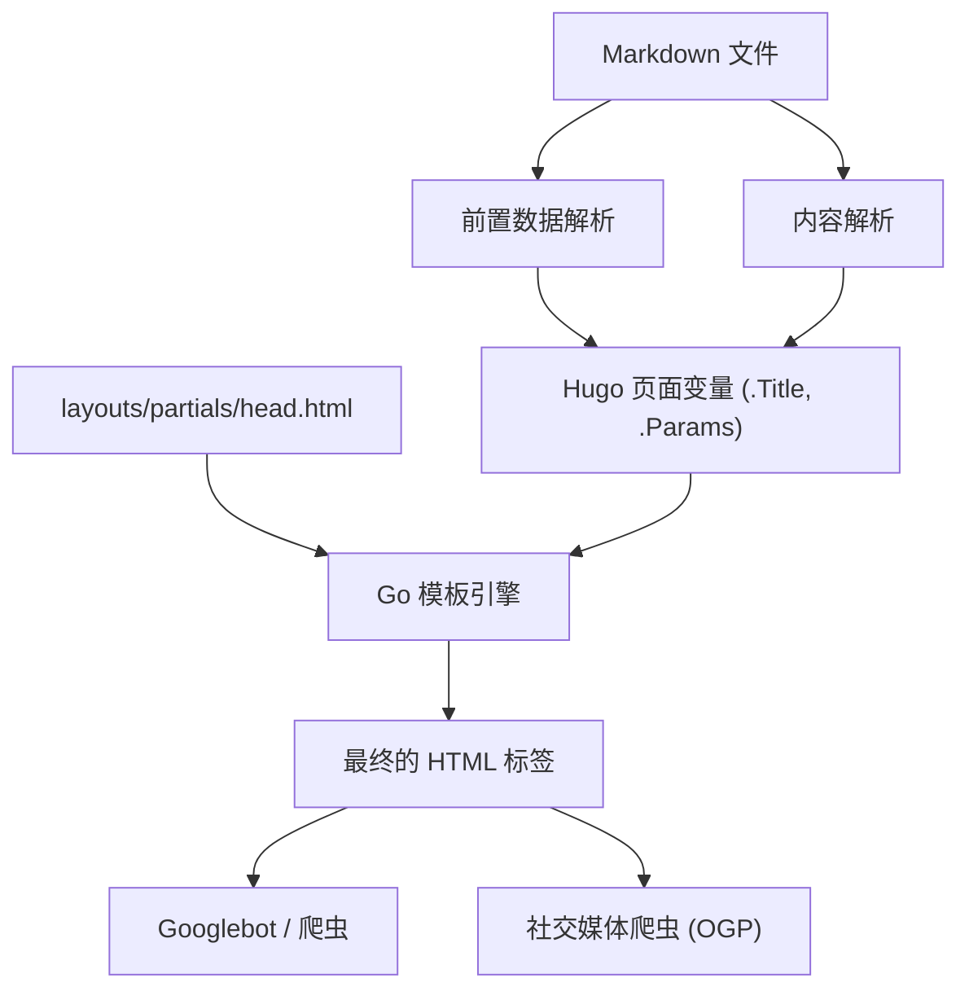
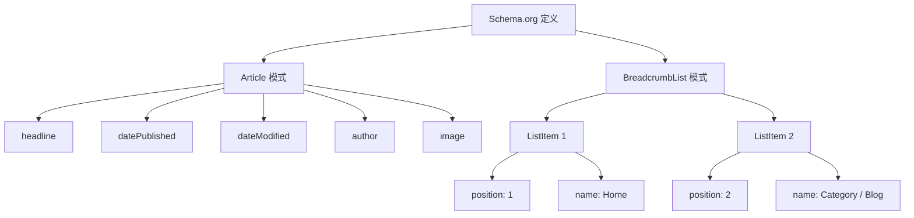

Hugo是一个使用Go语言编写的世界最快级别的静态网站生成器（SSG）。凭借其压倒性的构建速度和灵活的模板系统，它获得了许多工程师和博主的高度支持。然而，仅仅让网站被快速生成和显示，并不能让它在搜索引擎（如Google或Bing）中获得高评价，也无法将文章传递给用户。

为了提高搜索排名、增强在社交媒体上的传播力，从而大幅增加博客的访问量，细致的SEO（搜索引擎优化）措施是不可或缺的。在Hugo中，SEO优化的核心在于两者的协同：写在每篇Markdown文章开头的**前置数据（Frontmatter）**，以及解析这些数据并在HTML的 `<head>` 标签中展开元数据的**模板（Layouts）**。

本文将通过超过1万字的超大篇幅，彻底讲解如何最大限度地发挥Hugo的功能以实现高级SEO优化，内容涵盖从前置数据设置，到各种元标签、OGP（Open Graph Protocol）、Twitter Cards，以及使用JSON-LD输出结构化数据的全过程。

---

## 1. SEO与流量的数学背景

在进入具体实现之前，让我们先从数学的角度理解为什么细致的SEO元数据如此重要。一个网站能获取的搜索流量 $T$，是由目标关键词的搜索量和基于搜索排名的点击率（CTR）共同决定的。

用数学公式表示如下：

$$ T = \sum_{i=1}^{n} V_i \times CTR(R_i) $$

- $V_i$ : 关键词 $i$ 的月搜索量
- $R_i$ : 关键词 $i$ 的搜索排名
- $CTR(R_i)$ : 排名在 $R_i$ 时的点击率

其中，搜索排名 $R_i$ 依赖于内容质量和外部链接（PageRank）等诸多因素，而Google早期的PageRank算法模型如下：

$$ PR(u) = \frac{1-d}{N} + d \sum_{v \in B(u)} \frac{PR(v)}{L(v)} $$

- $PR(u)$ : 页面 $u$ 的PageRank值
- $d$ : 阻尼系数（通常为0.85）
- $B(u)$ : 链接到页面 $u$ 的页面集合
- $L(v)$ : 页面 $v$ 的出站链接数

这里最重要的一点是，**除了努力提高搜索排名 $R_i$ 之外，如何将点击率 $CTR(R_i)$ 最大化**。通过优化显示在搜索结果（SERPs）中的标题和摘要（description），以及在社交媒体上分享时吸引眼球的图片（OGP），我们可以人为地提升 $CTR(R_i)$。前置数据的SEO设置，正是直接关系到这个 $CTR$ 的最大化。

---

## 2. Hugo的构建过程与前置数据的作用

Hugo会读取Markdown文件中的前置数据（YAML/TOML/JSON），并将其作为页面变量传递给模板引擎。首先让我们直观地理解这个信息的流动过程。



如上所示，在前置数据中设置的值会作为 `.Title` 和 `.Params.description` 等变量传递给 `head.html`，并最终作为HTML元数据输出。因此，SEO的成功包含两个步骤：“在前置数据中定义正确的信息”和“通过模板将其正确转换为HTML”。

---

## 3. 基本元数据的设置：Title, Description, Canonical URL

搜索引擎用来理解页面内容的最基本标签是 `<title>` 和 `<meta name="description">`。此外，为了避免重复内容的惩罚，`<link rel="canonical">` 也是必不可少的。

### 3.1. 前置数据设置示例

在文章的前置数据中，准备专门用于SEO的字段。

```yaml
---
title: 'Hugo博客的SEO优化：大幅增加访问量的前置数据设置'
seo_title: 'Hugo SEO优化完全指南：通过前置数据提升访问量' # 可选：用于搜索引擎
description: '利用Hugo前置数据进行高级SEO优化的方法。详细讲解OGP、JSON-LD及元数据的设置。'
slug: "hugo-seo-frontmatter-tips"
canonicalUrl: "https://example.com/post/hugo-seo-frontmatter-tips/" # 明确的规范URL
---
```

### 3.2. `layouts/partials/head.html` 的实现

创建一个HTML模板，以正确输出这些变量。

```html
<!-- 标题的优化 -->
{{ $title := .Title }}
{{ if .Params.seo_title }}
  {{ $title = .Params.seo_title }}
{{ end }}
<title>{{ $title }} | {{ .Site.Title }}</title>

<!-- Description的优化 -->
{{ $description := .Summary | plainify | truncate 120 }}
{{ if .Params.description }}
  {{ $description = .Params.description }}
{{ end }}
<meta name="description" content="{{ $description }}">

<!-- Canonical URL（规范化） -->
{{ $canonical := .Permalink }}
{{ if .Params.canonicalUrl }}
  {{ $canonical = .Params.canonicalUrl }}
{{ end }}
<link rel="canonical" href="{{ $canonical }}">

<!-- 机器人控制（如禁止索引设置等） -->
{{ if .Params.noindex }}
<meta name="robots" content="noindex, nofollow">
{{ else }}
<meta name="robots" content="index, follow">
{{ end }}
```

通过使用Hugo的 `.Summary` 作为备选方案，即使未设置 `description`，也能自动提取文章的开头段落。

---

## 4. OGP与Twitter Cards：最大化社交媒体的CTR

当文章在Twitter（X）或Facebook等社交网络上被分享时，为了能以极具吸引力的卡片形式显示，Open Graph Protocol (OGP) 和 Twitter Cards 的设置是必不可少的。这也是从前置数据动态生成的。

### 4.1. 内置模板的问题

Hugo虽然提供了一个方便的内置模板 `{{ template "_internal/opengraph.html" . }}`，但它的可定制性较差，有时无法满足日语环境或特定需求。因此，强烈建议在 `head.html` 中自己实现独立的OGP标签。

### 4.2. 在前置数据中指定图片

```yaml
---
image: "img/eyecatch.jpg"
images:
  - "img/eyecatch-large.jpg" # 用于指定多张图片或绝对路径
---
```

### 4.3. OGP与Twitter Cards的独立实现代码

```html
<!-- Open Graph Protocol -->
<meta property="og:title" content="{{ $title }}">
<meta property="og:description" content="{{ $description }}">
<meta property="og:type" content="{{ if .IsPage }}article{{ else }}website{{ end }}">
<meta property="og:url" content="{{ .Permalink }}">
<meta property="og:site_name" content="{{ .Site.Title }}">

<!-- OGP Image的解析 -->
{{ $ogImage := "" }}
{{ if .Params.image }}
  {{ $ogImage = .Params.image | absURL }}
{{ else if .Params.images }}
  {{ $ogImage = index .Params.images 0 | absURL }}
{{ else if .Site.Params.defaultImage }}
  {{ $ogImage = .Site.Params.defaultImage | absURL }}
{{ end }}

{{ if $ogImage }}
<meta property="og:image" content="{{ $ogImage }}">
<meta name="twitter:image" content="{{ $ogImage }}">
<meta name="twitter:card" content="summary_large_image">
{{ else }}
<meta name="twitter:card" content="summary">
{{ end }}

<!-- Twitter Cards -->
<meta name="twitter:title" content="{{ $title }}">
<meta name="twitter:description" content="{{ $description }}">
{{ if .Site.Params.twitterAccount }}
<meta name="twitter:site" content="@{{ .Site.Params.twitterAccount }}">
{{ end }}
```

通过引入 `absURL` 函数，可以将相对路径指定的图片URL转换为绝对路径。由于OGP中必须使用绝对路径，这个处理极其重要。

---

## 5. 结构化数据（JSON-LD）的实现

在当前的SEO中，向搜索引擎准确传达页面语义结构的 **JSON-LD（JavaScript Object Notation for Linked Data）** 技术已成为主流。配置该技术后，搜索结果中更容易显示富媒体摘要（如星级评价、作者名、发布日期等）。

### 5.1. JSON-LD的结构

在博客文章中，主要实现 `Article`（文章）模式和 `BreadcrumbList`（面包屑导航）模式。



### 5.2. 在Hugo模板中生成JSON-LD

利用前置数据中的 `.Date` 和 `.Lastmod` 等变量，动态输出JSON-LD。使用 `<script type="application/ld+json">` 标签并将其写入 `head.html`。

```html
{{ if .IsPage }}
<script type="application/ld+json">
{
  "@context": "https://schema.org",
  "@type": "Article",
  "mainEntityOfPage": {
    "@type": "WebPage",
    "@id": "{{ .Permalink }}"
  },
  "headline": "{{ .Title | htmlEscape }}",
  "description": "{{ $description | htmlEscape }}",
  "image": "{{ $ogImage }}",
  "datePublished": "{{ .Date.Format "2006-01-02T15:04:05-07:00" }}",
  "dateModified": "{{ .Lastmod.Format "2006-01-02T15:04:05-07:00" }}",
  "author": {
    "@type": "Person",
    "name": "{{ if .Params.author }}{{ .Params.author }}{{ else }}{{ .Site.Params.author }}{{ end }}"
  },
  "publisher": {
    "@type": "Organization",
    "name": "{{ .Site.Title }}",
    "logo": {
      "@type": "ImageObject",
      "url": "{{ .Site.Params.logo | absURL }}"
    }
  }
}
</script>

<!-- BreadcrumbList Schema -->
<script type="application/ld+json">
{
  "@context": "https://schema.org",
  "@type": "BreadcrumbList",
  "itemListElement": [
    {
      "@type": "ListItem",
      "position": 1,
      "name": "Home",
      "item": "{{ .Site.BaseURL }}"
    }
    {{ $position := 2 }}
    {{ range .Params.categories }}
    ,{
      "@type": "ListItem",
      "position": {{ $position }},
      "name": "{{ . }}",
      "item": "{{ "categories/" | relLangURL }}{{ . | urlize | lower }}/"
    }
    {{ $position = add $position 1 }}
    {{ end }}
    ,{
      "@type": "ListItem",
      "position": {{ $position }},
      "name": "{{ .Title | htmlEscape }}",
      "item": "{{ .Permalink }}"
    }
  ]
}
</script>
{{ end }}
```

在JSON-LD中展开字符串时，关键是要使用 `htmlEscape`（或 `jsonify`）以防止破坏双引号。这样一来，无论前置数据中使用了什么符号，都可以防止JSON的语法错误。

---

## 6. 前置数据的高级应用技巧

除了基本SEO元数据外，Hugo的前置数据还具备实现更高级SEO策略的功能。

### 6.1. 通过别名 (Aliases) 处理重定向

当从过去的博客服务迁移到Hugo，或者更改了永久链接结构时，需要将来自旧URL的访问重定向到新URL。使用Hugo的 `aliases` 字段，可以自动生成针对旧URL的HTTP-Equiv刷新（Meta重定向）页面。

```yaml
---
title: '新文章标题'
slug: "new-seo-post"
aliases:
  - "/old-category/old-seo-post/"
  - "/2020/05/12/seo-tips/"
---
```

### 6.2. 文章的有效期与定时发布

对于限时活动文章或过时即失去价值的信息，通过设置 `expiryDate`，可以在特定日期之后将其从构建结果中排除，使其不在网站上显示（返回404）。这可以防止低质量的旧内容残留在索引中，进而降低整个网站的评价。

```yaml
---
title: '2026年限定的SEO技巧'
publishDate: "2026-01-01T00:00:00Z"
expiryDate: "2026-12-31T23:59:59Z"
---
```

---

## 7. 网站性能与核心网页指标 (Core Web Vitals)

在SEO中，**页面加载速度** 与标签优化同样重要。Google已将核心网页指标（LCP, FID/INP, CLS）作为排名因素纳入算法。

作为一个静态网站生成器，Hugo在TTFB (Time to First Byte) 方面本就非常出色，但对于大量使用图片的博客来说，图片优化是必不可少的。通过将Hugo强大的图片处理功能（Image Processing）与前置数据结合使用，可以在构建时自动实现图片缩放或转换为下一代格式（如WebP等）。

例如，可以编写一个短代码，从前置数据中指定的图片路径，在模板端自动生成WebP图片。这样可以极大地提升SEO的评价。

---

## 8. 总结

在使用Hugo运营博客时，前置数据不仅仅是“设置值的罗列”，更是用来与搜索引擎和社交网络对话的“控制面板”。

只要完全落实本文中讲解的以下要点，您的博客的SEO基础将会变得非常稳固。

1. **基本元数据的动态生成**: 确保正确输出 Title、Description、Canonical
2. **社交分享的优化**: 通过自定义实现 OGP 和 Twitter Cards 来提升 CTR
3. **完全支持结构化数据**: 通过 JSON-LD（Article, Breadcrumb）支持富媒体搜索结果
4. **高级流量管理**: 利用 Aliases 进行重定向，并通过 Meta 标签控制机器人行为

搜索引擎的算法每天都在进化，但向搜索引擎提供让其“正确理解页面内容”信号的这一SEO根本原则却从未改变。通过精通Hugo灵活的模板引擎和前置数据，持续发出最高质量的信号，从而让博客的访问量实现飞跃式的增长吧。
