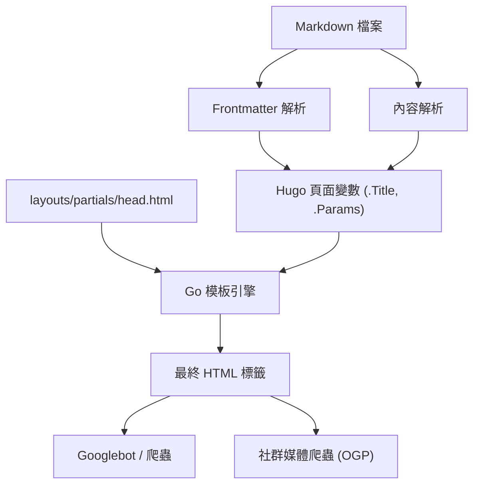
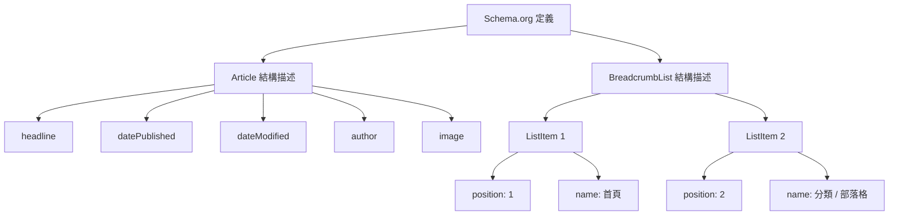

Hugo 是一款以 Go 語言編寫、世界最快等級的靜態網站產生器 (SSG)。憑藉其壓倒性的建置速度與靈活的模板系統，獲得了許多工程師與部落客的高度支持。然而，僅僅是網站能高速生成與顯示，並無法獲得搜尋引擎 (如 Google 或 Bing) 的高評價，也就無法將文章傳遞給使用者。

為了提升搜尋排名、增強在社群媒體上的擴散力，進而大幅增加部落格的流量，縝密的 SEO (搜尋引擎最佳化) 策略是不可或缺的。Hugo 中 SEO 策略的核心，在於每篇 Markdown 文章開頭所撰寫的 **Frontmatter**，與解析它並將中繼資料展開至 HTML `<head>` 標籤內的**模板 (Layouts)** 之間的協作。

本文將徹底解說如何將 Hugo 的功能發揮到極致，以實作進階 SEO 策略的 Frontmatter 設定，涵蓋各種 Meta 標籤、OGP (Open Graph Protocol)、Twitter Cards，以及使用 JSON-LD 輸出結構化資料。內容將以壓倒性的豐富度詳細說明。

---

## 1. SEO 與流量的數學背景

在進入具體的實作之前，讓我們先從數學的角度來理解為何細微的 SEO 中繼資料如此重要。網站能獲得的搜尋流量 $T$，是由目標關鍵字的搜尋量，以及基於搜尋排名的點擊率 (CTR) 所決定的。

用數學公式表示如下：

$$ T = \sum_{i=1}^{n} V_i \times CTR(R_i) $$

- $V_i$ : 關鍵字 $i$ 的每月搜尋量
- $R_i$ : 關鍵字 $i$ 的搜尋排名
- $CTR(R_i)$ : 排名 $R_i$ 的點擊率

其中，搜尋排名 $R_i$ 取決於內容品質與反向連結 (PageRank) 等許多因素，但 Google 早期的 PageRank 演算法被模型化如下：

$$ PR(u) = \frac{1-d}{N} + d \sum_{v \in B(u)} \frac{PR(v)}{L(v)} $$

- $PR(u)$ : 頁面 $u$ 的 PageRank
- $d$ : 阻尼係數 (通常為 0.85)
- $B(u)$ : 連結到頁面 $u$ 的頁面集合
- $L(v)$ : 頁面 $v$ 的對外連結數

這裡最重要的是，**除了努力提升搜尋排名 $R_i$ 之外，還要注意如何將點擊率 $CTR(R_i)$ 最大化**。透過最佳化顯示在搜尋結果 (SERPs) 中的標題與摘要 (description)，以及在社群媒體上分享時的吸睛圖片 (OGP)，可以有意識地提高 $CTR(R_i)$。Frontmatter 的 SEO 設定，正是直接關乎這項 $CTR$ 的最大化。

---

## 2. Hugo 的建置流程與 Frontmatter 的作用

Hugo 會讀取 Markdown 檔案內的 Frontmatter (YAML/TOML/JSON)，並將其作為頁面變數傳遞給模板引擎。首先，讓我們視覺化地了解這個資訊的流向。



如此一來，在 Frontmatter 中設定的值會作為 `.Title` 或 `.Params.description` 等變數傳遞給 `head.html`，並輸出為最終的 HTML 中繼資料。因此，SEO 的成功取決於兩個步驟：「在 Frontmatter 中定義適當的資訊」與「在模板中將其正確地轉換為 HTML」。

---

## 3. 基本中繼資料設定：Title, Description, Canonical URL

為了讓搜尋引擎理解頁面內容，最基本的標籤就是 `<title>` 和 `<meta name="description">`。此外，為了避免重複內容的懲罰，`<link rel="canonical">` 也是必須的。

### 3.1. Frontmatter 的設定範例

在文章的 Frontmatter 中，我們會準備專為 SEO 設計的欄位。

```yaml
---
title: 'Hugo 部落格的 SEO 策略：大幅增加流量的 Frontmatter 設定'
seo_title: 'Hugo SEO 策略完全指南：用 Frontmatter 提升流量' # 選用：提供給搜尋引擎
description: '運用 Hugo 的 Frontmatter 進行進階 SEO 策略的手法。詳細解說 OGP、JSON-LD 以及中繼資料的設定方式。'
slug: "hugo-seo-frontmatter-tips"
canonicalUrl: "https://example.com/post/hugo-seo-frontmatter-tips/" # 明確的標準 URL
---
```

### 3.2. `layouts/partials/head.html` 的實作

為了正確輸出這些變數，我們將建立 HTML 模板。

```html
<!-- 標題最佳化 -->
{{ $title := .Title }}
{{ if .Params.seo_title }}
  {{ $title = .Params.seo_title }}
{{ end }}
<title>{{ $title }} | {{ .Site.Title }}</title>

<!-- Description 最佳化 -->
{{ $description := .Summary | plainify | truncate 120 }}
{{ if .Params.description }}
  {{ $description = .Params.description }}
{{ end }}
<meta name="description" content="{{ $description }}">

<!-- Canonical URL (標準化) -->
{{ $canonical := .Permalink }}
{{ if .Params.canonicalUrl }}
  {{ $canonical = .Params.canonicalUrl }}
{{ end }}
<link rel="canonical" href="{{ $canonical }}">

<!-- 機器人控制 (例如拒絕索引設定) -->
{{ if .Params.noindex }}
<meta name="robots" content="noindex, nofollow">
{{ else }}
<meta name="robots" content="index, follow">
{{ end }}
```

透過使用 Hugo 的 `.Summary` 作為後備方案，即使尚未設定 `description`，也能自動擷取文章的開頭文字。

---

## 4. OGP 與 Twitter Cards：將社群媒體的 CTR 最大化

當文章在 Twitter (X) 或 Facebook 等社群網路服務 (SNS) 上被分享時，為了讓它以具吸引力的卡片格式顯示，Open Graph Protocol (OGP) 與 Twitter Cards 的設定是不可或缺的。這同樣可由 Frontmatter 動態產生。

### 4.1. 內建模板的挑戰

雖然 Hugo 有個方便的內建模板 `{{ template "_internal/opengraph.html" . }}`，但它的客製化程度不足，有時無法符合中文環境或特定需求。因此，強烈建議您在 `head.html` 內實作自訂的 OGP 標籤。

### 4.2. 在 Frontmatter 中指定圖片

```yaml
---
image: "img/eyecatch.jpg"
images:
  - "img/eyecatch-large.jpg" # 用於指定多張圖片或絕對路徑
---
```

### 4.3. OGP 與 Twitter Cards 的自訂實作程式碼

```html
<!-- Open Graph Protocol -->
<meta property="og:title" content="{{ $title }}">
<meta property="og:description" content="{{ $description }}">
<meta property="og:type" content="{{ if .IsPage }}article{{ else }}website{{ end }}">
<meta property="og:url" content="{{ .Permalink }}">
<meta property="og:site_name" content="{{ .Site.Title }}">

<!-- OGP Image 的解析 -->
{{ $ogImage := "" }}
{{ if .Params.image }}
  {{ $ogImage = .Params.image | absURL }}
{{ else if .Params.images }}
  {{ $ogImage = index .Params.images 0 | absURL }}
{{ else if .Site.Params.defaultImage }}
  {{ $ogImage = .Site.Params.defaultImage | absURL }}
{{ end }}

{{ if $ogImage }}
<meta property="og:image" content="{{ $ogImage }}">
<meta name="twitter:image" content="{{ $ogImage }}">
<meta name="twitter:card" content="summary_large_image">
{{ else }}
<meta name="twitter:card" content="summary">
{{ end }}

<!-- Twitter Cards -->
<meta name="twitter:title" content="{{ $title }}">
<meta name="twitter:description" content="{{ $description }}">
{{ if .Site.Params.twitterAccount }}
<meta name="twitter:site" content="@{{ .Site.Params.twitterAccount }}">
{{ end }}
```

透過套用 `absURL` 函式，可以將以相對路徑指定的圖片 URL 轉換為絕對路徑。由於 OGP 強制要求必須使用絕對路徑，因此這個處理非常重要。

---

## 5. 實作結構化資料 (JSON-LD)

在現今的 SEO 中，**JSON-LD (JavaScript Object Notation for Linked Data)** 已成為向搜尋引擎精確傳達頁面語意結構的主流技術。透過這項設定，能更容易在搜尋結果中顯示複合式摘要 (如星級評分、作者名稱、發布日期等)。

### 5.1. JSON-LD 的結構

在部落格文章中，我們主要會實作 `Article` (文章) 結構描述與 `BreadcrumbList` (導覽標記) 結構描述這兩種。



### 5.2. 在 Hugo 模板中產生 JSON-LD

活用 Frontmatter 的 `.Date` 或 `.Lastmod` 等變數，來動態輸出 JSON-LD。這會使用 `<script type="application/ld+json">` 標籤撰寫在 `head.html` 內。

```html
{{ if .IsPage }}
<script type="application/ld+json">
{
  "@context": "https://schema.org",
  "@type": "Article",
  "mainEntityOfPage": {
    "@type": "WebPage",
    "@id": "{{ .Permalink }}"
  },
  "headline": "{{ .Title | htmlEscape }}",
  "description": "{{ $description | htmlEscape }}",
  "image": "{{ $ogImage }}",
  "datePublished": "{{ .Date.Format "2006-01-02T15:04:05-07:00" }}",
  "dateModified": "{{ .Lastmod.Format "2006-01-02T15:04:05-07:00" }}",
  "author": {
    "@type": "Person",
    "name": "{{ if .Params.author }}{{ .Params.author }}{{ else }}{{ .Site.Params.author }}{{ end }}"
  },
  "publisher": {
    "@type": "Organization",
    "name": "{{ .Site.Title }}",
    "logo": {
      "@type": "ImageObject",
      "url": "{{ .Site.Params.logo | absURL }}"
    }
  }
}
</script>

<!-- BreadcrumbList Schema -->
<script type="application/ld+json">
{
  "@context": "https://schema.org",
  "@type": "BreadcrumbList",
  "itemListElement": [
    {
      "@type": "ListItem",
      "position": 1,
      "name": "Home",
      "item": "{{ .Site.BaseURL }}"
    }
    {{ $position := 2 }}
    {{ range .Params.categories }}
    ,{
      "@type": "ListItem",
      "position": {{ $position }},
      "name": "{{ . }}",
      "item": "{{ "categories/" | relLangURL }}{{ . | urlize | lower }}/"
    }
    {{ $position = add $position 1 }}
    {{ end }}
    ,{
      "@type": "ListItem",
      "position": {{ $position }},
      "name": "{{ .Title | htmlEscape }}",
      "item": "{{ .Permalink }}"
    }
  ]
}
</script>
{{ end }}
```

在 JSON-LD 內展開字串時，關鍵在於使用 `htmlEscape` (或 `jsonify`)，以防止雙引號遭到破壞。這麼一來，無論 Frontmatter 中使用了什麼符號，都能避免 JSON 的語法錯誤。

---

## 6. Frontmatter 的進階應用技巧

除了基本的 SEO 中繼資料之外，Hugo 的 Frontmatter 還具備了能實現更進階 SEO 策略的功能。

### 6.1. 透過別名 (Aliases) 進行的重新導向處理

當您從過去的部落格服務轉移至 Hugo，或是變更了永久連結 (Permalink) 結構時，您必須將來自現有 URL 的流量重新導向至新的 URL。只要使用 Hugo 的 `aliases` 欄位，就能自動為舊 URL 產生 HTTP-Equiv 重新整理 (Meta 重新導向) 頁面。

```yaml
---
title: '新的文章標題'
slug: "new-seo-post"
aliases:
  - "/old-category/old-seo-post/"
  - "/2020/05/12/seo-tips/"
---
```

### 6.2. 文章的有效期限與排程

對於期間限定的活動文章，或是過時後就會失去價值的資訊，透過設定 `expiryDate`，您可以在特定日期時間之後將其從建置結果中排除，讓它不再顯示於網站上 (傳回 404)。這麼做可以防止品質低落的舊內容持續留在索引中，進而降低網站整體的評價。

```yaml
---
title: '2026 年限定的 SEO 技巧'
publishDate: "2026-01-01T00:00:00Z"
expiryDate: "2026-12-31T23:59:59Z"
---
```

---

## 7. 網站效能與 Core Web Vitals

在 SEO 領域，與標籤最佳化同等重要的，就是**頁面的載入速度**。Google 已將 Core Web Vitals (LCP, FID/INP, CLS) 納入排名因素之中。

作為靜態網站的 Hugo 本身在 TTFB (Time to First Byte) 上就表現優異，但在大量使用圖片的部落格中，圖片最佳化是不可或缺的。透過將 Hugo 強大的圖片處理功能 (Image Processing) 結合 Frontmatter 一同使用，可以在建置時自動進行調整大小或轉換為次世代格式 (如 WebP 等)。

舉例來說，您可以建立一個 Shortcode，讓它根據 Frontmatter 中指定的圖片路徑，在模板端自動產生 WebP 圖片。如此一來，就有可能大幅提升 SEO 的評價。

---

## 8. 總結

在使用 Hugo 經營部落格的過程中，Frontmatter 並不單純只是「一堆設定值」，而是用來與搜尋引擎及 SNS 進行對話的「控制面板」。

只要確實實作本文所解說的以下重點，您的部落格 SEO 基礎將會變得十分堅固。

1. **動態產生基本中繼資料**: 確實輸出 Title, Description, Canonical
2. **社群分享最佳化**: 透過自訂實作 OGP 與 Twitter Cards 來提升 CTR
3. **完整支援結構化資料**: 透過 JSON-LD (Article, Breadcrumb) 支援複合式搜尋結果
4. **進階流量管理**: 透過 Aliases 進行重新導向，以及使用 Meta 標籤進行機器人控制

儘管搜尋引擎的演算法日新月異，但提供能讓搜尋引擎「正確理解頁面內容」的訊號，這項 SEO 根本原則是不會改變的。透過鑽研 Hugo 靈活的模板引擎與 Frontmatter，持續發送出最高品質的訊號，讓部落格的流量獲得戲劇性的增長吧！
