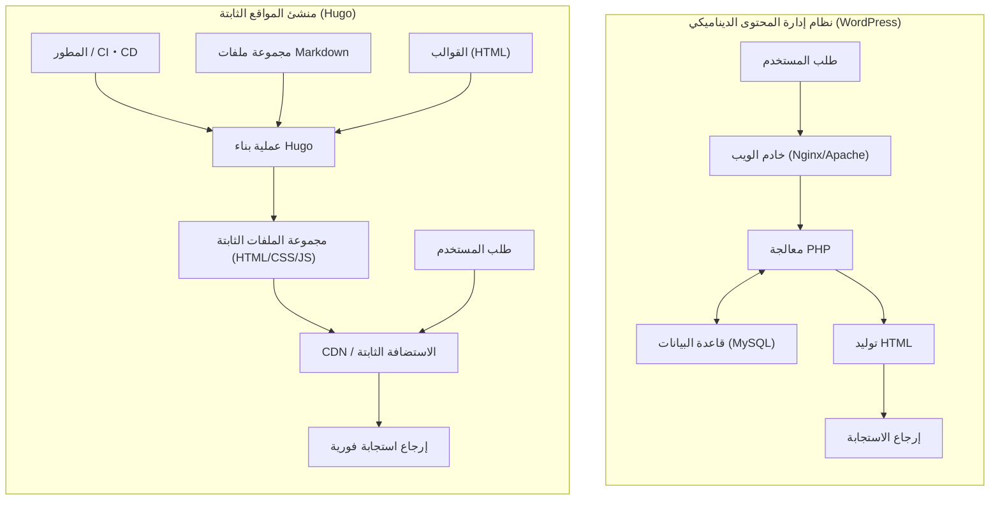
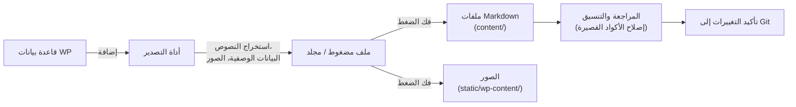

في تطوير الويب وإدارة المدونات الحديثة، أصبحت سرعة عرض الموقع والأمان وقابلية الصيانة عوامل في غاية الأهمية. لطالما حظي "WordPress"، الذي استحوذ على حصة ساحقة كأساس للمدونات ومواقع الشركات لفترة طويلة، بشعبية لدى العديد من المستخدمين بفضل نظام الإضافات المرن وواجهة الإدارة البديهية. ومع ذلك، نظراً لأنه يتضمن الاتصال بقاعدة البيانات وتوليد الصفحات ديناميكياً على جانب الخادم (المعالجة بواسطة PHP)، فإنه يواجه تحديات مثل الضعف أمام الزيادات المفاجئة في حركة المرور وتأخير العرض (زمن الانتقال).

لذلك، وفي السنوات الأخيرة، انتشر "منشئ المواقع الثابتة (SSG: Static Site Generator)" بسرعة. في هذه المقالة، سنتعمق في "**Hugo**"، والذي تم تطويره بلغة Go ويُعرف بسرعة بنائه الهائلة من بين العديد من منشئات المواقع الثابتة. سنشرح بالتفصيل مقارنة البنية التقنية مع أنظمة إدارة المحتوى الديناميكية (CMS) مثل WordPress، وخطوات الانتقال المحددة، وتقييم الأداء باستخدام النماذج الرياضية، وحتى هيكل الدليل الفريد لـ Hugo وترتيب البحث عن القوالب.

---

## 1. الاختلافات التقنية بين نظام إدارة المحتوى الديناميكي (WordPress) ومنشئ المواقع الثابتة (Hugo)

تتخذ WordPress و Hugo مناهج مختلفة جذرياً في آلية تقديم المواقع الإلكترونية.

### 1.1 بنية WordPress (التوليد الديناميكي)
WordPress هو ممثل نموذجي لأنظمة إدارة المحتوى الديناميكية التي تقوم بتجميع الصفحات على جانب الخادم مع كل طلب. عندما يصل المستخدم (المتصفح) إلى صفحة، يقوم خادم الويب (مثل Apache أو Nginx) بتنفيذ برامج PHP النصية ويرسل استعلامات إلى قاعدة بيانات علائقية مثل MySQL (أو MariaDB). يقوم بدمج المحتوى المسترجع من قاعدة البيانات (بيانات المقالات، الفئات، العلامات، إعدادات الموقع، إلخ) مع ملفات القوالب، وينشئ ملف HTML النهائي ويعيده إلى العميل.

تتميز هذه الآلية بميزة القدرة على توليد محتوى مختلف في الوقت الفعلي لكل زائر (مثل: عربة التسوق في مواقع التجارة الإلكترونية، صفحات خاصة بالمستخدمين المسجلين للدخول)، ولكن ما لم يتم تصميم آلية التخزين المؤقت (مثل البروكسي العكسي أو الإضافات) بشكل مناسب، فإنها تستهلك موارد الخادم بشكل كبير.

### 1.2 بنية Hugo (التوليد المسبق وقت البناء)
من ناحية أخرى، وكما يوحي الاسم "منشئ المواقع الثابتة"، يقوم Hugo بتوليد المحتوى في "وقت البناء" وليس في "وقت الطلب". يتم الاحتفاظ بالمحتوى ليس في قاعدة بيانات، بل كملفات "Markdown" محلية يتم التحكم في إصداراتها بواسطة أنظمة مثل Git.
عندما ينفذ المطور الأمر (`hugo`)، يقوم Hugo بقراءة ملفات Markdown، ويصب البيانات في قوالب HTML المحددة (ملفات التخطيط)، لإنشاء مجموعة مكتملة من ملفات HTML/CSS/JS النقية.

يمكن تسليم مجموعة الملفات التي تم إنشاؤها (الأصول الثابتة) ببساطة عن طريق وضعها في "بيئة استضافة ثابتة" مثل Amazon S3 أو Cloudflare Pages أو Netlify أو Vercel أو حتى خادم Nginx بسيط. نظراً لعدم الحاجة إلى قاعدة بيانات أو لغة جانب الخادم (مثل PHP)، تنخفض المخاطر الأمنية (مثل حقن SQL ونقاط الضعف في PHP) بشكل كبير، وتزيد سرعة التوصيل إلى أقصى حد من خلال التخزين المؤقت على العقد الطرفية لشبكة توصيل المحتوى (CDN).

فيما يلي توضيح للاختلافات بين البنيتين باستخدام مخطط Mermaid.



---

## 2. تقييم الأداء باستخدام النماذج الرياضية

أحد أكبر فوائد الانتقال من WordPress إلى Hugo هو تحسين الأداء (سرعة العرض). لفهم ذلك بشكل كمي، دعونا نمثله بنموذج رياضي بسيط.

ينقسم الوقت المستغرق لاكتمال تحميل الصفحة (Load Time: $T_{load}$) بشكل أساسي إلى وقت استجابة الخادم (TTFB: Time To First Byte) ووقت عرض المتصفح واسترداد الموارد ($T_{render}$).

$$ T_{load} = T_{ttfb} + T_{render} $$

في حالة نظام إدارة المحتوى الديناميكي (WordPress)، فإن $T_{ttfb}$ هو مجموع العناصر التالية: تأخير الشبكة ($T_{network}$)، وقت تنفيذ البرنامج النصي من جانب الخادم ($T_{php}$)، ووقت معالجة استعلام قاعدة البيانات ($T_{db}$).

$$ T_{ttfb\_wp} = T_{network} + T_{php} + T_{db} $$

في ظل ظروف الوصول الكثيف (الحمل العالي)، يزداد كل من $T_{php}$ و $T_{db}$ بشكل غير خطي، مما قد يؤدي إلى اختناق النظام بأكمله. عند التعبير عنها رياضياً، يمكن ملاحظة التدهور التالي في وقت الاستجابة نسبة إلى عدد الطلبات ($N$) (حيث $k$ هو معامل عبء المعالجة الإضافي).

$$ T_{php}(N) \approx O(N^k), \quad T_{db}(N) \approx O(N^k) \quad \text{where } k > 1 $$

من ناحية أخرى، في بنية تجمع بين منشئ المواقع الثابتة (Hugo) و CDN، لا توجد معالجة ديناميكية على جانب الخادم (PHP أو استعلامات DB). نظراً لأنه يتم تخزين المحتوى مؤقتاً على خوادم طرفية موزعة حول العالم، فإن $T_{ttfb}$ يعتمد فقط على تأخير الشبكة من العميل إلى أقرب خادم طرفي ($T_{edge}$).

$$ T_{ttfb\_hugo} = T_{edge} $$

ونتيجة لذلك، يتحقق $T_{edge} \ll (T_{network} + T_{php} + T_{db})$، ويتم تقليل TTFB بشكل كبير إلى بضعة ميلي ثانية إلى عشرات الميلي ثانية. كما أنه حتى مع زيادة عدد الطلبات $N$، يظل وقت الاستجابة ثابتاً تقريباً ($O(1)$) بفضل وظيفة موازنة الحمل في الخوادم الطرفية.

$$ \lim_{N \to \infty} T_{ttfb\_hugo}(N) \approx \text{Constant} $$

هذا هو الأساس الرياضي لسبب كون Hugo (الموقع الثابت) قوياً للغاية ضد الارتفاعات المفاجئة في حركة المرور (على سبيل المثال، عند انتشار المحتوى بشكل فيروسي).

---

## 3. الهيكل الأساسي ومبدأ عمل Hugo

لإتقان استخدام Hugo، من الضروري فهم هيكل الدليل الفريد الخاص به، بالإضافة إلى مفاهيم "Front Matter" و "Template Lookup Order" (ترتيب البحث عن القوالب).

### 3.1 شرح مفصل لهيكل الدليل

عند إنشاء مشروع Hugo جديد (`hugo new site mysite`)، يتم إنشاء هيكل الدليل التالي.

```text
mysite/
├── archetypes/   # قوالب عند إنشاء محتوى جديد (نماذج لـ Front Matter)
├── assets/       # مجموعة الملفات التي ستتم معالجتها بواسطة Hugo Pipes (مثل SCSS/Sass و JavaScript)
├── content/      # محتوى الموقع الفعلي (مجموعة ملفات Markdown). هذا هو بديل قاعدة البيانات.
├── data/         # البيانات والإعدادات الخارجية المستخدمة في جميع أنحاء الموقع (مثل JSON و TOML و YAML و CSV)
├── layouts/      # مجموعة قوالب HTML التي تحدد مظهر الموقع (باستخدام Go html/template)
├── public/       # المكان الذي يتم فيه إخراج الملفات الثابتة الناتجة بعد تشغيل أمر البناء
├── static/       # الملفات الثابتة التي يتم نشرها كما هي (الصور، favicon، ملفات نصية للروبوتات، إلخ)
├── themes/       # أدلة القوالب (الثيمات) من طرف ثالث أو التي تم إنشاؤها ذاتياً
└── hugo.toml     # ملف الإعدادات للموقع بأكمله (سابقاً كان config.toml هو السائد)
```

في WordPress، يتم تخزين المحتوى في جدول `wp_posts` في MySQL، بينما في Hugo يتم إدارة كل شيء كملفات نصية (بشكل رئيسي Markdown) داخل دليل `content/`. هذا يسهل التحكم في إصدارات المحتوى (Git).

### 3.2 إدارة المحتوى: Markdown و Front Matter

يتكون كل ملف مقالة في Hugo من كتلة بيانات وصفية في الأعلى تسمى "Front Matter" (المقدمة)، يليها النص الأساسي (Markdown). يمكن كتابة Front Matter باستخدام TOML أو YAML أو JSON، ولكن YAML هو الأكثر استخداماً.

```yaml
---
title: "فهم التصنيف (Taxonomy) في Hugo"
date: 2026-09-13T10:00:00+09:00
draft: false
categories:
  - "شروحات تقنية"
tags:
  - "Hugo"
  - "Go"
aliases:
  - "/old-category/hugo-taxonomy/"
---
من هنا يبدأ النص الأساسي. سيتم كتابته باستخدام **Markdown**.
سنشرح الميزات القوية لـ Hugo...
```

ما يجب ملاحظته هنا هو مفتاح `aliases`. عند الانتقال من WordPress، إذا تغيرت الروابط الدائمة (URL)، فسيكون لذلك تأثير سلبي كبير على تحسين محركات البحث (SEO). باستخدام ميزة الأسماء المستعارة (aliases) في Hugo، يمكنك ببساطة تحديد عنوان URL القديم، وسيقوم Hugo تلقائياً بإنشاء HTML لإعادة التوجيه (التحويل باستخدام meta refresh). هذا مريح للغاية لأنه يلغي الحاجة إلى إعدادات إعادة التوجيه على جانب الخادم (مثل .htaccess).

### 3.3 ترتيب البحث عن القوالب (Template Lookup Order)

إحدى ميزات Hugo القوية هي آلية البحث المرنة عن القوالب (Template Lookup Order). عند عرض صفحة معينة، يبحث Hugo في الأدلة وأسماء الملفات بترتيب معين للعثور على القالب الأمثل.

على سبيل المثال، عند عرض مقالة مفردة (Single Page) مثل `content/post/hello-world.md`، يبحث Hugo عموماً عن ملفات التخطيط بالترتيب التالي:

1. `layouts/post/single.html`
2. `layouts/post/list.html` (هذا ليس خطأً، ولكنه عادةً ما يكون للقوائم)
3. `layouts/_default/single.html`
4. `themes/<THEME_NAME>/layouts/post/single.html`
5. `themes/<THEME_NAME>/layouts/_default/single.html`

يمكن للمطورين **تجاوز (override)** قوالب السمة (الثيم) بمجرد إنشاء ملف بنفس الاسم في دليل `layouts/` الخاص بمشروعهم، دون الحاجة إلى تعديل الكود المصدري للسمة مباشرة. يتيح ذلك إجراء تخصيصات فريدة دون إعاقة تحديثات السمة الأساسية.

### 3.4 التصنيف (Taxonomy)

يُطلق على نظام التصنيف المعادل لـ "الفئات (categories)" و "العلامات (tags)" في WordPress اسم "التصنيف (Taxonomy)" في Hugo.
يدعم Hugo التصنيفين `categories` و `tags` افتراضياً، ولكن من خلال تعديل `hugo.toml`، يمكنك إضافة تصنيفات مخصصة بحرية (مثل: `series`, `authors`، إلخ).

```toml
# مثال على hugo.toml
[taxonomies]
  category = "categories"
  tag = "tags"
  series = "series"
  author = "authors"
```

يتيح ذلك تنظيم المحتوى وإدراجه بناءً على محاور متنوعة.

---

## 4. عملية الانتقال (الترحيل) من WordPress إلى Hugo

مفتاح النجاح في الانتقال من WordPress إلى Hugo هو كيفية تحويل المحتوى الديناميكي في قاعدة البيانات إلى ملفات ثابتة نظيفة (Markdown + Front Matter) مع الحفاظ على هيكل URL الحالي.

فيما يلي، نعرض سير عمل خط أنابيب الانتقال العام.



### 4.1 استخراج البيانات وتحويلها إلى Markdown

لتصدير بيانات WordPress لاستخدامها في Hugo، فإن استخدام إضافات مخصصة هو الطريقة الأسهل والأكثر موثوقية. إليك بعض المناهج النموذجية:

1. **استخدام إضافة Jekyll Exporter**
   نظراً لأن بنية البيانات في Hugo تشبه إلى حد كبير Jekyll، وهو أيضاً منشئ مواقع ثابتة، فإن استخدام إضافة "Jekyll Exporter" لـ WordPress يعد نهجاً شائعاً. عند تثبيت هذه الإضافة وتشغيلها، يتم تحويل جميع المقالات والصفحات الثابتة إلى ملفات Markdown مع Front Matter، ويمكن تنزيلها كملف ZIP جنباً إلى جنب مع ملفات الصور.
2. **برامج نصية مخصصة باستخدام واجهة برمجة تطبيقات WordPress (WordPress API)**
   هذه طريقة لإنشاء برنامج نصي باستخدام Python أو Node.js وما إلى ذلك لاستدعاء واجهة برمجة تطبيقات REST الخاصة بـ WordPress (`/wp-json/wp/v2/posts`)، وتحليل بيانات JSON، وإنشاء ملفات Markdown الخاصة بك. هذا مفيد للمواقع التي تستخدم بكثافة حقولاً مخصصة معقدة (مثل ACF) والتي لا يمكن التعامل معها بواسطة الإضافات.
3. **الاستفادة من أداة wp2hugo**
   هناك أيضاً نهج يستخدم أداة سطر أوامر (CLI) مكتوبة بلغة Go وما شابهها للتحويل المباشر من ملف تصدير XML الخاص بـ WordPress (WXR) إلى تنسيق Hugo.

### 4.2 الحفاظ على هيكل الروابط الدائمة (URL)

للحفاظ على تقييم تحسين محركات البحث (SEO)، من المهم للغاية الحفاظ على عناوين URL الخاصة بفترة استخدام WordPress كما هي. إذا كانت إعدادات الروابط الدائمة في WordPress مثل `https://example.com/2026/09/13/my-post/`، حدد هيكل الروابط الدائمة في ملف `hugo.toml` الخاص بـ Hugo.

```toml
[permalinks]
  post = "/:year/:month/:day/:slug/"
```

بدلاً من ذلك، من الممكن أيضاً تثبيت عنوان URL إجبارياً عن طريق تحديد المعلمة `url` مباشرة في الـ Front Matter لكل مقالة.
بالإضافة إلى ذلك، بالنسبة للصفحات التي تتغير عناوين URL الخاصة بها، قم بإعداد عمليات إعادة التوجيه باستخدام `aliases` المذكورة سابقاً.

### 4.3 تحويل الأكواد القصيرة (Shortcodes)

غالباً ما تبقى الأكواد القصيرة الخاصة بـ WordPress (مثل `[gallery]`, `[caption]` والأكواد الفريدة للإضافات المختلفة) كسلاسل نصية كما هي عند التصدير، لذلك يجب التعامل معها.
يتم نقلها إما بحذفها دفعة واحدة باستخدام برامج نصية للاستبدال (مثل sed أو Python)، أو بالاستفادة من **ميزة الأكواد القصيرة المخصصة** القوية في Hugo (من خلال إنشاء تخطيطات مخصصة داخل `layouts/shortcodes/`) بحيث يتم عرضها بشكل صحيح على جانب Hugo.

---

## 5. أدوات سطر الأوامر (CLI) الخاصة بـ Hugo والبناء والنشر

بمجرد اكتمال عملية الانتقال، حان الوقت أخيراً لبناء الموقع باستخدام Hugo ونشره للعالم. يتميز Hugo، الذي يتوفر كملف ثنائي للغة Go، بسرعة مذهلة حيث يكمل بناء المواقع التي تتكون من آلاف أو عشرات الآلاف من الصفحات في بضع ثوانٍ فقط.

### 5.1 بدء تشغيل خادم التطوير المحلي

عند كتابة المقالات أو تعديل التصميم، قم بتشغيل الخادم المحلي.

```bash
# أمر تشغيل خادم التطوير (استخدم -D لتضمين مسودات المقالات Draft)
hugo server -D
```

عند تشغيل هذا الأمر، يصبح من الممكن معاينة الموقع على `http://localhost:1313/`. يحتوي Hugo على ميزة "LiveReload" مدمجة قوية، حيث يتم تحديث شاشة المتصفح تلقائياً وبسرعة فائقة في اللحظة التي تقوم فيها بتحرير وحفظ ملفات Markdown أو القوالب أو CSS. وهذا يجعل تجربة الكتابة والتطوير أكثر راحة بكثير من شاشة إدارة WordPress.

### 5.2 البناء للإنتاج وتحسين الأداء

لإنشاء الملفات الثابتة لنشرها في بيئة الإنتاج، ما عليك سوى كتابة `hugo`.

```bash
# تنفيذ البناء للإنتاج. استخدم خيار --minify لتصغير HTML/CSS/JS
hugo --minify
```

يُخرج هذا الأمر ملفات الموقع بأكمله إلى دليل `public/`. تؤدي إضافة خيار `--minify` إلى إزالة الأسطر الجديدة والمسافات غير الضرورية، مما يقلل من حجم الملفات بشكل أكبر. ويساهم هذا بشكل مباشر في تقليل تأخير الشبكة ($T_{network}$) في النموذج الرياضي المذكور سابقاً.

### 5.3 أتمتة النشر (CI/CD)

ليس من الفعال إنشاء الملفات الثابتة على جهاز كمبيوتر محلي في كل مرة وتحميلها عبر FTP أو ما شابه. في تشغيل SSG الحديث، من أفضل الممارسات بناء بيئة CI/CD تقوم تلقائياً بعمليات البناء والنشر باستخدام عملية الدفع (push) إلى مستودع Git (مثل GitHub) كمحفز (trigger).

على سبيل المثال، يكون الشكل الأساسي للإعدادات (ملف YAML) للنشر على Cloudflare Pages أو GitHub Pages باستخدام GitHub Actions على النحو التالي.

```yaml
# مثال على .github/workflows/hugo.yml
name: Deploy Hugo site to GitHub Pages

on:
  push:
    branches: ["main"]
  workflow_dispatch:

permissions:
  contents: read
  pages: write
  id-token: write

jobs:
  build:
    runs-on: ubuntu-latest
    steps:
      - name: Checkout
        uses: actions/checkout@v3
        with:
          submodules: recursive # في حالة إدارة السمة كنموذج فرعي (submodule)
          fetch-depth: 0

      - name: Setup Hugo
        uses: peaceiris/actions-hugo@v2
        with:
          hugo-version: 'latest'
          extended: true

      - name: Build
        run: hugo --minify

      - name: Upload artifact
        uses: actions/upload-pages-artifact@v2
        with:
          path: ./public

  deploy:
    environment:
      name: github-pages
      url: ${{ steps.deployment.outputs.page_url }}
    runs-on: ubuntu-latest
    needs: build
    steps:
      - name: Deploy to GitHub Pages
        id: deployment
        uses: actions/deploy-pages@v2
```

من خلال إعداد هذا، بمجرد القيام بإجراء "كتابة مقالة باستخدام Markdown ودفعها إلى GitHub"، يكتمل خط الأنابيب الآلي الذي ينشر أحدث إصدار من الموقع في بيئة الإنتاج في غضون بضع دقائق.

---

## 6. تحسين محركات البحث (SEO) والمزايا التشغيلية بعد الانتقال

غالباً ما يلاحظ مديرو المواقع الذين أكملوا عملية الانتقال من WordPress إلى Hugo المزايا الثلاث البارزة التالية.

### 6.1 تحسن جذري في سرعة الموقع ومؤشرات حيوية الويب الأساسية (Core Web Vitals)

نتيجة لإلغاء استعلامات قاعدة البيانات والعرض على جانب الخادم، يتم تقليل أوقات تحميل الصفحة إلى أجزاء من الألف من الثانية. يرتبط هذا بشكل مباشر بتحسن كبير في درجات "مؤشرات حيوية الويب الأساسية" (Core Web Vitals) (مثل LCP و FID/INP و CLS)، والتي تعد من عوامل التصنيف في Google. يمكن توقع انخفاض في معدل الارتداد للمستخدمين وتحسين في تقييمات تحسين محركات البحث (SEO).

### 6.2 التحرر من التهديدات الأمنية

نظراً لأن WordPress يُستخدم على نطاق واسع في جميع أنحاء العالم، فإنه يمثل دائماً هدفاً للهجمات. هناك مخاطر مستمرة مثل اختراق الموقع وتشويهه من خلال استغلال نقاط الضعف في الإضافات، أو اختراق تسجيل الدخول من خلال هجمات القوة الغاشمة (Brute-force attacks).
ومع ذلك، فإن الموقع الثابت الذي يتم إنشاؤه بواسطة Hugo لا يحتوي على قاعدة بيانات أو بيئة PHP أو حتى شاشة إدارة (نموذج تسجيل دخول). لا يوجد مجال للقراصنة لاختراق الخادم وتعديل قاعدة البيانات، وتقترب المخاطر الأمنية من الصفر.

### 6.3 تشغيل خالٍ من الصيانة

يتطلب تشغيل WordPress أعمال صيانة مستمرة، مثل ترقية إصدار النظام الأساسي، وتحديث الإضافات، ومواكبة إصدارات PHP. عليك دائماً أن تقلق من خطر تعطل الموقع بسبب مشاكل التوافق.
في حالة Hugo، لا يلزم تحديث الأداة نفسها إلا عند الضرورة، ونظراً لأن كود الموقع بحد ذاته عبارة عن مجموعة من الملفات النصية المستقلة، فهناك شعور غامر براحة البال لأنه "لن يتعطل حتى لو تُرك دون تدخل".

---

## 7. الخلاصة

في هذه المقالة، قمنا بشرح مفصل للانتقال من نظام إدارة محتوى ديناميكي مثل WordPress إلى "Hugo"، وهو منشئ مواقع ثابتة قوي مبني على لغة Go. غطينا الاختلافات في البنية التقنية، وإثبات الأداء من خلال النماذج الرياضية، وصولاً إلى خطوات الانتقال المحددة.

يتطلب الانتقال إلى منشئ مواقع ثابتة تكلفة تعليمية أولية (مثل تشغيل Git، وصياغة Markdown، وتنفيذ أوامر CLI من الطرفية (Terminal)، وفهم مواصفات محرك القوالب)، ولكنه يوفر عائداً يفوق ذلك بكثير يتمثل في "سرعة عرض هائلة"، "أمان قوي"، و"تشغيل خالٍ من الصيانة".

إذا كان موقعك الإلكتروني لا يتطلب تغييرات متكررة في التصميم أو معالجة ديناميكية معقدة (مثل الميزات الخاصة بالأعضاء أو وظائف التجارة الإلكترونية المتقدمة)، وكان هدفه الأساسي هو نشر المعلومات (مدونة، وسائط إعلامية، موقع شركة)، فإن الانتقال إلى Hugo سيكون أحد أكثر الاستثمارات التقنية فعالية. نأمل أن تستخدم هذه المقالة كمرجع لاتخاذ خطوتك الأولى نحو إدارة مواقع الويب من الجيل التالي باستخدام Hugo.
