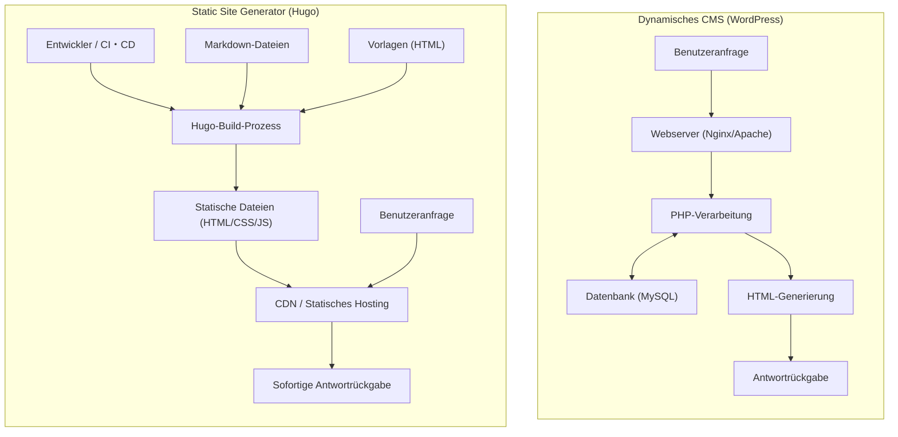
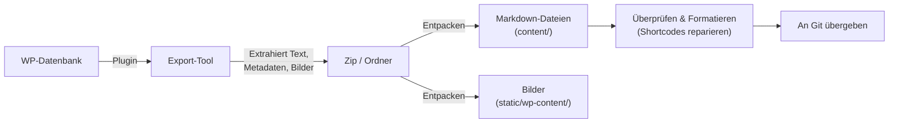

In der modernen Webentwicklung und beim Betrieb von Blogs sind Ladegeschwindigkeit, Sicherheit und Wartbarkeit von entscheidender Bedeutung. "WordPress", das lange Zeit einen überwältigenden Marktanteil als Basis für Blogs und Unternehmenswebsites hatte, wird von vielen Nutzern wegen seines flexiblen Plugin-Ökosystems und seiner intuitiven Verwaltungsoberfläche geschätzt. Da es jedoch die Kommunikation mit einer Datenbank und die dynamische Seitengenerierung auf der Serverseite (Verarbeitung durch PHP) erfordert, weist es Schwachstellen wie Anfälligkeit bei plötzlichen Traffic-Spitzen und Anzeigeverzögerungen (Latenz) auf.

Aus diesem Grund erfreuen sich "Static Site Generators (SSG)" in den letzten Jahren rasant wachsender Beliebtheit. In diesem Artikel werden wir uns eingehend mit "**Hugo**" befassen, einem der vielen SSGs, der auf der Programmiersprache Go basiert und für seine unglaubliche Build-Geschwindigkeit bekannt ist. Wir werden alles im Detail erklären, angefangen bei einem Vergleich der technischen Architektur mit dynamischen CMS (Content Management Systemen) wie WordPress, über konkrete Migrationsschritte und Leistungsbewertungen mithilfe mathematischer Modelle, bis hin zu Hugos spezifischer Verzeichnisstruktur und der Suchreihenfolge von Vorlagen (Template Lookup Order).

---

## 1. Technische Unterschiede zwischen dynamischem CMS (WordPress) und Static Site Generator (Hugo)

Wenn es um die Bereitstellung einer Website geht, verfolgen WordPress und Hugo grundlegend unterschiedliche Ansätze.

### 1.1 Die Architektur von WordPress (Dynamische Generierung)
WordPress ist ein typisches dynamisches CMS, das Seiten bei jeder Anfrage (Request) serverseitig zusammenstellt. Wenn ein Benutzer (Browser) auf eine Seite zugreift, führt der Webserver (z. B. Apache, Nginx) ein PHP-Skript aus und sendet eine Anfrage (Query) an eine relationale Datenbank wie MySQL (oder MariaDB). Der aus der Datenbank abgerufene Inhalt (Artikeldaten, Kategorien, Tags, Website-Einstellungen usw.) wird mit Vorlagendateien (Templates) kombiniert, um den endgültigen HTML-Code zu generieren und an den Client zurückzugeben.

Dieser Mechanismus hat den Vorteil, dass für jeden Besucher individuelle Inhalte in Echtzeit generiert werden können (z. B. Warenkörbe auf E-Commerce-Websites, exklusive Seiten für eingeloggte Benutzer). Ohne eine angemessen gestaltete Caching-Infrastruktur (wie Reverse-Proxys oder Plugins) verbraucht er jedoch massiv Serverressourcen.

### 1.2 Die Architektur von Hugo (Vorab-Generierung zur Build-Zeit)
Andererseits generiert Hugo, wie der Name "Static Site Generator" schon sagt, Inhalte nicht zur "Anfragezeit", sondern zur "Build-Zeit". Die Inhalte werden nicht in einer Datenbank, sondern als lokale "Markdown-Dateien" verwaltet, die mit Versionskontrollsystemen wie Git versioniert werden.
Wenn der Entwickler den Befehl (`hugo`) ausführt, liest Hugo die Markdown-Dateien ein, fügt die Daten in die angegebenen HTML-Vorlagen (Layout-Dateien) ein und generiert eine Sammlung vollständiger, reiner HTML/CSS/JS-Dateien.

Die generierten Dateien (statische Assets) können einfach durch Platzieren in einer "statischen Hosting-Umgebung" wie Amazon S3, Cloudflare Pages, Netlify, Vercel oder einem einfachen Nginx-Server bereitgestellt werden. Da weder eine Datenbank noch eine serverseitige Sprache (wie PHP) erforderlich sind, werden Sicherheitsrisiken (wie SQL-Injection oder PHP-Schwachstellen) drastisch reduziert, und die Auslieferungsgeschwindigkeit wird extrem maximiert, da die Daten auf Edge-Nodes eines CDN (Content Delivery Network) zwischengespeichert (gecacht) werden.

Nachfolgend veranschaulicht ein Mermaid-Diagramm die Unterschiede zwischen den beiden Architekturen.



---

## 2. Leistungsbewertung anhand eines mathematischen Modells

Einer der größten Vorteile der Migration von WordPress zu Hugo ist die Verbesserung der Leistung (Ladegeschwindigkeit). Um dies quantitativ zu verstehen, wollen wir es mit einem einfachen mathematischen Modell ausdrücken.

Die Zeit bis zum Abschluss des Ladens einer Seite (Load Time: $T_{load}$) lässt sich grob in die Antwortzeit des Servers (TTFB: Time To First Byte) und die Zeit für Rendering und Ressourcenbeschaffung durch den Browser ($T_{render}$) unterteilen.

$$ T_{load} = T_{ttfb} + T_{render} $$

Bei einem dynamischen CMS (WordPress) ist $T_{ttfb}$ die Summe der folgenden Faktoren: Netzwerkverzögerung ($T_{network}$), Skriptausführungszeit auf der Serverseite ($T_{php}$) und Abfrageverarbeitungszeit der Datenbank ($T_{db}$).

$$ T_{ttfb\_wp} = T_{network} + T_{php} + T_{db} $$

Bei hoher Zugriffsrate (hoher Last) steigen $T_{php}$ und $T_{db}$ nichtlinear an, und das gesamte System kann zum Engpass werden. Mathematisch ausgedrückt zeigt sich bei einer Anzahl von Anfragen ($N$) die folgende Verschlechterung der Antwortzeit ($k$ ist der Overhead-Koeffizient der Verarbeitung).

$$ T_{php}(N) \approx O(N^k), \quad T_{db}(N) \approx O(N^k) \quad \text{where } k > 1 $$

Andererseits gibt es bei einer Architektur, die einen Static Site Generator (Hugo) mit einem CDN kombiniert, keine serverseitige dynamische Verarbeitung (PHP oder DB-Abfragen). Da die Inhalte auf weltweit verteilten Edge-Servern zwischengespeichert werden, hängt $T_{ttfb}$ rein von der Netzwerkverzögerung zum nächstgelegenen Edge-Server des Clients ab ($T_{edge}$).

$$ T_{ttfb\_hugo} = T_{edge} $$

Dadurch gilt $T_{edge} \ll (T_{network} + T_{php} + T_{db})$, und die TTFB wird drastisch auf wenige bis einige Dutzend Millisekunden verkürzt. Darüber hinaus bleibt die Antwortzeit aufgrund der Lastausgleichsfunktion der Edge-Server nahezu konstant ($O(1)$), selbst wenn die Anzahl der Anfragen $N$ steigt.

$$ \lim_{N \to \infty} T_{ttfb\_hugo}(N) \approx \text{Konstant} $$

Dies ist die mathematische Grundlage dafür, warum Hugo (eine statische Website) extrem robust gegenüber Traffic-Spitzen (z. B. wenn ein Beitrag viral geht) ist.

---

## 3. Grundstruktur und Funktionsprinzip von Hugo

Um Hugo zu beherrschen, ist es unerlässlich, seine einzigartige Verzeichnisstruktur und die Konzepte von "Front Matter" und "Template Lookup Order" zu verstehen.

### 3.1 Detaillierte Erklärung der Verzeichnisstruktur

Wenn Sie ein neues Hugo-Projekt erstellen (`hugo new site mysite`), wird die folgende Verzeichnisstruktur generiert:

```text
mysite/
├── archetypes/   # Vorlagen beim Erstellen neuer Inhalte (Front Matter-Vorlagen)
├── assets/       # Dateien, die von Hugo Pipes verarbeitet werden (SCSS/Sass, JavaScript usw.)
├── content/      # Der tatsächliche Website-Inhalt (Markdown-Dateien). Dies ersetzt die DB.
├── data/         # Externe Daten und Einstellungen, die site-weit verwendet werden (JSON, TOML, YAML, CSV usw.)
├── layouts/      # HTML-Vorlagen, die das Aussehen der Site bestimmen (verwendet Go html/template)
├── public/       # Der Ort, an dem die generierten statischen Dateien nach der Build-Ausführung ausgegeben werden
├── static/       # Statische Dateien, die unverändert veröffentlicht werden (Bilder, Favicons, robots.txt usw.)
├── themes/       # Verzeichnis für Themes von Drittanbietern oder selbst erstellte Themes
└── hugo.toml     # Die site-weite Konfigurationsdatei (früher war config.toml üblich)
```

In WordPress werden Inhalte in der `wp_posts`-Tabelle von MySQL gespeichert, aber in Hugo werden alle als Textdateien (hauptsächlich Markdown) im `content/`-Verzeichnis verwaltet. Dies macht die Versionskontrolle von Inhalten (Git) einfach.

### 3.2 Inhaltsverwaltung: Markdown und Front Matter

Jede Artikeldatei in Hugo besteht aus einem Metadatenblock namens "Front Matter" ganz oben, gefolgt vom Haupttext (Markdown) darunter. Front Matter kann in TOML, YAML oder JSON geschrieben werden, aber YAML ist am weitesten verbreitet.

```yaml
---
title: "Die Taxonomie von Hugo verstehen"
date: 2026-09-13T10:00:00+09:00
draft: false
categories:
  - "Technische Erklärung"
tags:
  - "Hugo"
  - "Go"
aliases:
  - "/old-category/hugo-taxonomy/"
---
Hier beginnt der Haupttext. Er ist in **Markdown** geschrieben.
Wir werden die leistungsstarken Funktionen von Hugo erklären...
```

Bemerkenswert ist hier der `aliases`-Schlüssel. Bei der Migration von WordPress ist es für SEO-Zwecke ein großer Nachteil, wenn sich Permalinks (URLs) ändern. Durch die Verwendung der Alias-Funktion von Hugo generiert Hugo automatisch HTML für Weiterleitungen (Transfer durch Meta-Refresh), indem Sie einfach die alte URL angeben. Dies ist äußerst praktisch, da serverseitige Weiterleitungseinstellungen (wie .htaccess) nicht mehr erforderlich sind.

### 3.3 Vorlagen-Suchreihenfolge (Template Lookup Order)

Eine der leistungsstärksten Funktionen von Hugo ist sein flexibler Vorlagen-Suchmechanismus (Template Lookup Order). Beim Rendern einer bestimmten Seite durchsucht Hugo Verzeichnisse und Dateinamen in einer bestimmten Reihenfolge, um die optimale Vorlage zu finden.

Wenn beispielsweise ein einzelner Artikel (Single Page) namens `content/post/hello-world.md` gerendert wird, sucht Hugo im Allgemeinen in der folgenden Reihenfolge nach Layoutdateien:

1. `layouts/post/single.html`
2. `layouts/post/list.html` (Nicht falsch, aber normalerweise für Listen)
3. `layouts/_default/single.html`
4. `themes/<THEME_NAME>/layouts/post/single.html`
5. `themes/<THEME_NAME>/layouts/_default/single.html`

Entwickler können die Vorlagen eines Themes **überschreiben (overriden)**, indem sie einfach eine gleichnamige Datei im `layouts/`-Verzeichnis ihres eigenen Projekts erstellen, ohne den Quellcode des Themes direkt zu ändern. Auf diese Weise können Sie eigene Anpassungen vornehmen, ohne zukünftige Updates des zugrunde liegenden Themes zu behindern.

### 3.4 Taxonomie (Taxonomy)

Das Klassifizierungssystem, das in WordPress den "Kategorien" und "Tags" entspricht, wird in Hugo als "Taxonomie (Taxonomy)" bezeichnet.
Hugo unterstützt standardmäßig die Taxonomien `categories` und `tags`, aber durch Bearbeiten der `hugo.toml` können Sie nach Belieben benutzerdefinierte Taxonomien (z. B. `series`, `authors` usw.) hinzufügen.

```toml
# Beispiel für hugo.toml
[taxonomies]
  category = "categories"
  tag = "tags"
  series = "series"
  author = "authors"
```

Dies ermöglicht es, Inhalte auf vielfältige Weise zu organisieren und aufzulisten.

---

## 4. Migrationsprozess von WordPress zu Hugo (Migration)

Der Schlüssel zu einer erfolgreichen Migration von WordPress zu Hugo liegt darin, wie man die dynamischen Inhalte in der Datenbank sauber in statische Dateien (Markdown + Front Matter) konvertiert und dabei die vorhandene URL-Struktur beibehält.

Im Folgenden ist der Ablauf einer typischen Migrations-Pipeline dargestellt.



### 4.1 Datenextraktion und Markdown-Konvertierung

Um WordPress-Daten für Hugo auszugeben, ist die Verwendung eines dedizierten Plugins der einfachste und zuverlässigste Weg. Hier sind einige typische Ansätze.

1. **Verwendung des Jekyll Exporter-Plugins**
   Da Hugo eine sehr ähnliche Datenstruktur wie Jekyll, ein anderer SSG, aufweist, ist die Verwendung des "Jekyll Exporter"-Plugins für WordPress eine gängige Methode. Wenn Sie dieses Plugin installieren und ausführen, werden alle Beiträge und statischen Seiten in Markdown-Dateien mit Front Matter konvertiert und können zusammen mit den Bilddateien als ZIP-Datei heruntergeladen werden.
2. **Eigenes Skript mit der WordPress API**
   Dies ist eine Methode, bei der Sie mit Python, Node.js usw. auf die WordPress REST API (`/wp-json/wp/v2/posts`) zugreifen, die JSON-Daten parsen und Ihr eigenes Skript erstellen, um die Markdown-Dateien selbst zu generieren. Dies ist effektiv für Websites, die intensiv komplexe benutzerdefinierte Felder (wie ACF) verwenden, die nicht vollständig von Plugins verarbeitet werden können.
3. **Nutzung des wp2hugo-Tools**
   Es gibt auch einen Ansatz, ein in Go geschriebenes CLI-Tool zu verwenden, um direkt von einer WordPress-Export-XML-Datei (WXR) in das Hugo-Format zu konvertieren.

### 4.2 Beibehaltung der Permalink-(URL)-Struktur

Um die SEO-Bewertung aufrechtzuerhalten, ist es extrem wichtig, die URL aus der WordPress-Ära unverändert zu übernehmen. Wenn Ihre Permalink-Einstellung in WordPress `https://example.com/2026/09/13/my-post/` war, geben Sie diese Permalink-Struktur in der `hugo.toml` von Hugo an.

```toml
[permalinks]
  post = "/:year/:month/:day/:slug/"
```

Alternativ ist es auch möglich, die URL zwangsweise zu fixieren, indem Sie den `url`-Parameter direkt im Front Matter jedes Artikels angeben.
Zusätzlich richten Sie für Seiten, deren URL sich ändert, Weiterleitungen mithilfe der zuvor erwähnten `aliases` ein.

### 4.3 Konvertierung von Shortcodes

WordPress-spezifische Shortcodes (z. B. `[gallery]`, `[caption]`, benutzerdefinierte Codes verschiedener Plugins) bleiben beim Export oft als bloße Zeichenfolgen erhalten, daher muss dies behoben werden.
Diese werden entweder in großen Mengen mithilfe von Ersetzungsskripten (sed oder Python) gelöscht oder Sie verwenden Hugos leistungsstarke **Custom Shortcode-Funktion** (erstellen Sie benutzerdefinierte Layouts in `layouts/shortcodes/`), um sie so zu migrieren, dass sie auf der Hugo-Seite korrekt gerendert werden.

---

## 5. Hugos CLI-Tool und Build/Deploy

Sobald die Migrationsarbeit abgeschlossen ist, ist es endlich Zeit, die Website mit Hugo zu erstellen und sie der Welt zu präsentieren. Hugo, bereitgestellt als Go-Binärdatei, rühmt sich einer unglaublichen Geschwindigkeit, mit der Builds selbst für Websites mit Tausenden oder Zehntausenden von Seiten in nur wenigen Sekunden abgeschlossen werden.

### 5.1 Starten des lokalen Entwicklungsservers

Wenn Sie Artikel schreiben oder das Design anpassen, starten Sie den lokalen Server.

```bash
# Befehl zum Starten des Entwicklungsservers (verwenden Sie -D, um Entwürfe einzuschließen)
hugo server -D
```

Wenn Sie diesen Befehl ausführen, kann die Website unter `http://localhost:1313/` in der Vorschau angezeigt werden. Hugo verfügt über eine integrierte, leistungsstarke "LiveReload"-Funktion. In dem Moment, in dem Sie eine Markdown-Datei, eine Vorlage oder CSS bearbeiten und speichern, wird der Browserbildschirm automatisch in hoher Geschwindigkeit aktualisiert. Dadurch wird das Schreib- und Entwicklungserlebnis weitaus komfortabler als die Verwaltungsoberfläche von WordPress.

### 5.2 Produktions-Build und Leistungsoptimierung

Um die statischen Dateien für die Bereitstellung in der Produktionsumgebung zu generieren, geben Sie einfach `hugo` ein.

```bash
# Produktions-Build ausführen. Die Option --minify minimiert HTML/CSS/JS
hugo --minify
```

Mit diesem Befehl werden alle Dateien der gesamten Website im `public/`-Verzeichnis ausgegeben. Durch Hinzufügen der Option `--minify` werden unnötige Zeilenumbrüche und Leerzeichen entfernt, was die Dateigröße weiter reduziert. Dies trägt direkt zur Reduzierung der Netzwerkverzögerung ($T_{network}$) im zuvor erwähnten mathematischen Modell bei.

### 5.3 Bereitstellungsautomatisierung (CI/CD)

Es ist ineffizient, jedes Mal statische Dateien auf einem lokalen PC zu generieren und per FTP oder Ähnlichem hochzuladen. Im modernen SSG-Betrieb ist es die beste Vorgehensweise (Best Practice), eine CI/CD-Umgebung aufzubauen, die automatisch Builds und Bereitstellungen (Deployments) durchführt, ausgelöst durch einen Push in ein Git-Repository (wie GitHub).

Die Grundform einer Konfiguration (YAML-Datei) für die Bereitstellung auf Cloudflare Pages oder GitHub Pages mithilfe von GitHub Actions sieht beispielsweise wie folgt aus.

```yaml
# Beispiel für .github/workflows/hugo.yml
name: Deploy Hugo site to GitHub Pages

on:
  push:
    branches: ["main"]
  workflow_dispatch:

permissions:
  contents: read
  pages: write
  id-token: write

jobs:
  build:
    runs-on: ubuntu-latest
    steps:
      - name: Checkout
        uses: actions/checkout@v3
        with:
          submodules: recursive # Wenn Themes als Submodule verwaltet werden
          fetch-depth: 0

      - name: Setup Hugo
        uses: peaceiris/actions-hugo@v2
        with:
          hugo-version: 'latest'
          extended: true

      - name: Build
        run: hugo --minify

      - name: Upload artifact
        uses: actions/upload-pages-artifact@v2
        with:
          path: ./public

  deploy:
    environment:
      name: github-pages
      url: ${{ steps.deployment.outputs.page_url }}
    runs-on: ubuntu-latest
    needs: build
    steps:
      - name: Deploy to GitHub Pages
        id: deployment
        uses: actions/deploy-pages@v2
```

Durch diese Einrichtung wird eine automatisierte Pipeline erstellt, bei der allein die Aktion "Einen Artikel in Markdown schreiben und zu GitHub pushen" ausreicht, um die neueste Website in wenigen Minuten in der Produktionsumgebung zu veröffentlichen.

---

## 6. SEO und betriebliche Vorteile nach der Migration

Website-Betreiber, die die Migration von WordPress zu Hugo abgeschlossen haben, erleben in den meisten Fällen die folgenden drei signifikanten Vorteile.

### 6.1 Drastische Verbesserung der Website-Geschwindigkeit und Core Web Vitals
Durch den Wegfall von Datenbankabfragen und serverseitigem Rendering wird die Ladezeit von Seiten auf Millisekunden reduziert. Dies führt direkt zu einer deutlichen Verbesserung der "Core Web Vitals"-Werte (LCP, FID/INP, CLS), die Google als Ranking-Faktoren verwendet. Ein Rückgang der Absprungrate der Nutzer und eine Verbesserung der SEO-Bewertung sind zu erwarten.

### 6.2 Befreiung von Sicherheitsbedrohungen
Da WordPress weltweit weit verbreitet ist, ist es ein ständiges Ziel von Angriffen. Es bestehen immer Risiken wie Verfälschungen durch das Ausnutzen von Plugin-Schwachstellen oder das Knacken von Logins durch Brute-Force-Angriffe.
Auf einer mit Hugo generierten statischen Website gibt es jedoch weder eine Datenbank noch eine PHP-Umgebung oder gar einen Verwaltungsbildschirm (Login-Formular). Hacker haben keine Möglichkeit, in den Server einzudringen und die Datenbank umzuschreiben, sodass das Sicherheitsrisiko extrem nahe an Null herankommt.

### 6.3 Wartungsfreier Betrieb
Der Betrieb von WordPress erfordert ständige Wartungsarbeiten, einschließlich Updates des Core-Systems, Plugin-Aktualisierungen und das Nachverfolgen von PHP-Versionen. Sie müssen immer die Angst haben, dass die Website aufgrund von Kompatibilitätsproblemen zusammenbricht.
Bei Hugo müssen Updates des Tools selbst nur bei Bedarf durchgeführt werden, und da der Code der Website selbst aus einer Reihe unabhängiger Textdateien besteht, herrscht das überwältigende Gefühl der Sicherheit, dass "es nicht kaputt geht, selbst wenn man es in Ruhe lässt".

---

## 7. Zusammenfassung

In diesem Artikel haben wir die Migration von einem dynamischen CMS wie WordPress zu "Hugo", einem leistungsstarken, auf der Programmiersprache Go basierenden Static Site Generator, im Detail erläutert – von den Unterschieden in der technischen Architektur über den mathematischen Leistungsnachweis bis hin zu konkreten Migrationsschritten.

Der Umstieg auf einen Static Site Generator erfordert zunächst eine gewisse Lernkurve (Git-Operationen, Markdown-Syntax, Ausführen von CLI-Befehlen über das Terminal, Verständnis der Spezifikationen der Template-Engine usw.), bringt aber im Gegenzug "überwältigende Anzeigegeschwindigkeit", "robuste Sicherheit" und "wartungsfreien" Betrieb, was diese Mühe mehr als aufwiegt.

Wenn Ihre Website keine häufigen Designänderungen oder komplexe dynamische Verarbeitung (wie Funktionen nur für Mitglieder oder erweiterte E-Commerce-Funktionen) erfordert und der Hauptzweck die Informationsverbreitung ist (Blogs, Medien, Unternehmenswebsites), dann ist die Migration zu Hugo eine der effektivsten technischen Investitionen. Wir hoffen, dass Sie diesen Artikel als Referenz nutzen, um den ersten Schritt in Richtung der nächsten Generation des Website-Managements mit Hugo zu machen.
