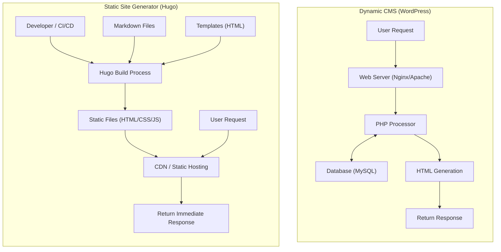
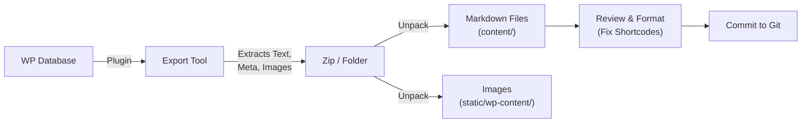

In modern web development and blog management, site loading speed, security, and maintainability have become extremely crucial factors. For a long time, "WordPress" has boasted an overwhelming market share as the foundation for blogs and corporate sites, and is loved by many users for its flexible plugin ecosystem and intuitive admin interface. However, because it involves communication with a database and dynamic page generation on the server side (processed by PHP), it also faces challenges such as vulnerability to sudden traffic spikes and display delays (latency).

Therefore, "Static Site Generators (SSG)" have been rapidly gaining popularity in recent years. In this article, among the many SSGs, we will delve deeply into "**Hugo**", which is developed in Go and known for its overwhelming build speed. We will thoroughly explain everything from the technical architecture comparison with dynamic CMS (Content Management System) like WordPress, to specific migration procedures, performance evaluation using mathematical models, and Hugo's unique directory structure and template lookup order.

---

## 1. Technical Differences between Dynamic CMS (WordPress) and Static Site Generator (Hugo)

In the mechanism of delivering websites, WordPress and Hugo take fundamentally different approaches.

### 1.1 WordPress Architecture (Dynamic Generation)
WordPress is a prime example of a dynamic CMS that assembles pages on the server side every time a request is made. When a user (browser) accesses a page, the web server (Apache, Nginx, etc.) executes PHP scripts and issues queries to a relational database like MySQL (or MariaDB). It combines the content fetched from the database (article data, categories, tags, site settings, etc.) with template files, generates the final HTML, and returns it to the client.

This mechanism has the advantage of being able to generate different content in real-time for each visitor (e.g., e-commerce carts, pages exclusive to logged-in users), but unless caching mechanisms (reverse proxies, plugins, etc.) are properly designed, it aggressively consumes server resources.

### 1.2 Hugo Architecture (Pre-generation at Build Time)
On the other hand, Hugo, as the name "Static Site Generator" suggests, generates content not at "request time" but at "build time". Content is maintained not in a database, but as local "Markdown files" version-controlled by Git, etc.
When a developer executes the command (`hugo`), Hugo reads the Markdown files, pours the data into specified HTML templates (layout files), and generates a collection of completed, pure HTML/CSS/JS files.

The generated files (static assets) can be delivered simply by placing them in a "static hosting environment" such as Amazon S3, Cloudflare Pages, Netlify, Vercel, or a simple Nginx server. Since neither a database nor a server-side language (like PHP) is required, security risks (like SQL injections and PHP vulnerabilities) are dramatically reduced, and delivery speed is maximized by being cached on edge nodes of a CDN (Content Delivery Network).

Below, we show the differences in each architecture using a Mermaid diagram.



---

## 2. Performance Evaluation using Mathematical Models

One of the greatest benefits of migrating from WordPress to Hugo is the improvement in performance (load speed). To understand this quantitatively, let's express it with a simple mathematical model.

The time until page loading is complete (Load Time: $T_{load}$) is broadly divided into the server response time (TTFB: Time To First Byte) and the rendering/resource fetching time by the browser ($T_{render}$).

$$ T_{load} = T_{ttfb} + T_{render} $$

In the case of a dynamic CMS (WordPress), $T_{ttfb}$ is the sum of the following factors: network latency ($T_{network}$), server-side script execution time ($T_{php}$), and database query processing time ($T_{db}$).

$$ T_{ttfb\_wp} = T_{network} + T_{php} + T_{db} $$

Under heavy access conditions (high load), $T_{php}$ and $T_{db}$ increase non-linearly, and the entire system can become a bottleneck. Expressed as a formula, we see the following deterioration in response time relative to the number of requests ($N$) ($k$ is the processing overhead coefficient).

$$ T_{php}(N) \approx O(N^k), \quad T_{db}(N) \approx O(N^k) \quad \text{where } k > 1 $$

On the other hand, in an architecture combining a static site generator (Hugo) and a CDN, there are no server-side dynamic processes (PHP or DB queries). Because the content is cached on edge servers distributed globally, $T_{ttfb}$ purely depends on the network latency ($T_{edge}$) from the client to the nearest edge server.

$$ T_{ttfb\_hugo} = T_{edge} $$

As a result, $T_{edge} \ll (T_{network} + T_{php} + T_{db})$ holds true, and TTFB is dramatically reduced to just a few milliseconds to tens of milliseconds. Moreover, even if the number of requests $N$ increases, the response time remains almost constant ($O(1)$) due to the load-balancing capabilities of edge servers.

$$ \lim_{N \to \infty} T_{ttfb\_hugo}(N) \approx \text{Constant} $$

This is the mathematical basis for why Hugo (static sites) is extremely robust against traffic spikes (e.g., when content goes viral).

---

## 3. Basic Structure and Operating Principles of Hugo

To master Hugo, it is essential to understand its unique directory structure and the concepts of "Front Matter" and "Template Lookup Order".

### 3.1 Detailed Explanation of Directory Structure

When you create a new Hugo project (`hugo new site mysite`), the following directory structure is generated.

```text
mysite/
├── archetypes/   # Templates when creating new content (Front Matter blueprints)
├── assets/       # Files to be processed by Hugo Pipes (SCSS/Sass, JavaScript, etc.)
├── content/      # Actual site content (Markdown files). This acts as a DB replacement.
├── data/         # External data and settings used across the site (JSON, TOML, YAML, CSV, etc.)
├── layouts/      # HTML templates that determine the site's appearance (using Go html/template)
├── public/       # Where generated static files are output after running the build command
├── static/       # Static files published as-is (images, favicons, robots.txt, etc.)
├── themes/       # Third-party or custom theme directories
└── hugo.toml     # Site-wide configuration file (config.toml was mainstream previously)
```

In WordPress, content is stored in the `wp_posts` table of MySQL, but in Hugo, everything is managed as text files (mainly Markdown) in the `content/` directory. This makes version control (Git) of content easy.

### 3.2 Content Management: Markdown and Front Matter

Each article file in Hugo has a metadata block at the very top called "Front Matter", followed by the body text (Markdown) below it. Front Matter can be written in TOML, YAML, or JSON, but YAML is widely used.

```yaml
---
title: "Understanding Hugo Taxonomy"
date: 2026-09-13T10:00:00+09:00
draft: false
categories:
  - "Technical Guide"
tags:
  - "Hugo"
  - "Go"
aliases:
  - "/old-category/hugo-taxonomy/"
---
The body text starts here. Written in **Markdown**.
We will explain the powerful features of Hugo...
```

What's noteworthy here is the `aliases` key. When migrating from WordPress, if permalinks (URLs) change, it causes a significant negative impact on SEO. By using Hugo's alias feature, you just specify the old URL, and Hugo will automatically generate an HTML file for redirection (forwarding via meta refresh). This is very convenient as it eliminates the need for server-side redirection settings (like .htaccess).

### 3.3 Template Lookup Order

One of Hugo's powerful features is its flexible template discovery mechanism (Template Lookup Order). When rendering a specific page, Hugo searches directories and filenames in a specific order to find the most appropriate template.

For example, when rendering a single article (Single Page) like `content/post/hello-world.md`, Hugo looks for the layout file in roughly the following order:

1. `layouts/post/single.html`
2. `layouts/post/list.html` (Not an error, but usually for lists)
3. `layouts/_default/single.html`
4. `themes/<THEME_NAME>/layouts/post/single.html`
5. `themes/<THEME_NAME>/layouts/_default/single.html`

Developers can **override** theme templates simply by creating a file with the same name in their project's `layouts/` directory, without directly modifying the theme's source code. This allows you to apply your own customizations without hindering updates to the base theme.

### 3.4 Taxonomy

The classification system corresponding to "Categories" and "Tags" in WordPress is called "Taxonomy" in Hugo.
Hugo supports `categories` and `tags` taxonomies by default, but you can freely add custom taxonomies (e.g., `series`, `authors`, etc.) by editing `hugo.toml`.

```toml
# hugo.toml example
[taxonomies]
  category = "categories"
  tag = "tags"
  series = "series"
  author = "authors"
```

This makes it possible to organize and list content along diverse axes.

---

## 4. Migration Process from WordPress to Hugo (Migration)

The key to a successful migration from WordPress to Hugo is how to cleanly convert dynamic content in the database into static files (Markdown + Front Matter) while maintaining the existing URL structure.

Below is the flow of a typical migration pipeline.



### 4.1 Data Extraction and Markdown Conversion

To output WordPress data for Hugo, using a dedicated plugin is the easiest and most reliable method. Here are a few typical approaches.

1. **Using the Jekyll Exporter Plugin**
   Since Hugo has a very similar data structure to Jekyll, another SSG, it is a common practice to use the "Jekyll Exporter" plugin for WordPress. When you install and run this plugin, all posts and static pages are converted into Markdown files with Front Matter, and can be downloaded as a ZIP file along with image files.
2. **Custom Script utilizing the WordPress API**
   This is a method of writing a script in Python, Node.js, etc., that calls the WordPress REST API (`/wp-json/wp/v2/posts`), parses the JSON data, and generates Markdown files yourself. It is effective for sites that heavily use complex custom fields (like ACF) that plugins cannot fully handle.
3. **Utilizing the wp2hugo Tool**
   There is also an approach using CLI tools written in Go, etc., to convert directly from WordPress export XML files (WXR) to Hugo format.

### 4.2 Maintaining Permalink (URL) Structure

To carry over your SEO evaluation, it is extremely important to maintain the URLs from your WordPress era. If you had permalink settings like `https://example.com/2026/09/13/my-post/` in WordPress, you specify the permalink structure in Hugo's `hugo.toml`.

```toml
[permalinks]
  post = "/:year/:month/:day/:slug/"
```

Alternatively, you can forcibly fix the URL by specifying the `url` parameter directly in the Front Matter for each article.
Furthermore, for pages where the URL changes, set up redirects using the aforementioned `aliases`.

### 4.3 Converting Shortcodes

WordPress-specific shortcodes (e.g., `[gallery]`, `[caption]`, proprietary codes of various plugins) often remain as raw strings when exported, so they need to be addressed.
These can be bulk-deleted using a replacement script (sed or Python), or migrated so they are rendered properly on the Hugo side by utilizing Hugo's powerful **custom shortcode feature** (creating custom layouts in `layouts/shortcodes/`).

---

## 5. Hugo CLI Tools and Build/Deployment

Once the migration work is complete, it's finally time to build the site using Hugo and publish it to the world. Hugo, provided as a Go binary, boasts astonishing speed, completing builds in just seconds even for sites with thousands or tens of thousands of pages.

### 5.1 Starting the Local Development Server

When writing articles or adjusting designs, you start a local server.

```bash
# Command to start the development server (-D to include draft articles)
hugo server -D
```

Running this command allows you to preview the site at `http://localhost:1313/`. Hugo has a powerful built-in "LiveReload" feature; the moment you edit and save a Markdown file, template, or CSS, the browser screen is automatically and rapidly updated. This makes the writing and development experience far more comfortable than the WordPress admin interface.

### 5.2 Production Build and Performance Optimization

To generate static files for deploying to a production environment, simply type `hugo`.

```bash
# Execute production build. --minify option minifies HTML/CSS/JS
hugo --minify
```

This command outputs the entire site's files to the `public/` directory. By adding the `--minify` option, unnecessary line breaks and spaces are removed, further reducing file sizes. This directly contributes to reducing the network latency ($T_{network}$) in the mathematical model mentioned earlier.

### 5.3 Automating Deployment (CI/CD)

Generating static files locally on your PC every time and uploading them via FTP, etc., is inefficient. In modern SSG operations, the best practice is to build a CI/CD environment that automatically builds and deploys triggered by pushes to a Git repository (like GitHub).

For example, the basic structure of a configuration (YAML file) for deploying to Cloudflare Pages or GitHub Pages using GitHub Actions looks like this.

```yaml
# Example of .github/workflows/hugo.yml
name: Deploy Hugo site to GitHub Pages

on:
  push:
    branches: ["main"]
  workflow_dispatch:

permissions:
  contents: read
  pages: write
  id-token: write

jobs:
  build:
    runs-on: ubuntu-latest
    steps:
      - name: Checkout
        uses: actions/checkout@v3
        with:
          submodules: recursive # If themes are managed as submodules
          fetch-depth: 0

      - name: Setup Hugo
        uses: peaceiris/actions-hugo@v2
        with:
          hugo-version: 'latest'
          extended: true

      - name: Build
        run: hugo --minify

      - name: Upload artifact
        uses: actions/upload-pages-artifact@v2
        with:
          path: ./public

  deploy:
    environment:
      name: github-pages
      url: ${{ steps.deployment.outputs.page_url }}
    runs-on: ubuntu-latest
    needs: build
    steps:
      - name: Deploy to GitHub Pages
        id: deployment
        uses: actions/deploy-pages@v2
```

By configuring this, just the action of "writing an article in Markdown and pushing it to GitHub" completes an automated pipeline where the latest site is published to the production environment in a few minutes.

---

## 6. Post-Migration SEO and Operational Benefits

Site operators who have completed the migration from WordPress to Hugo often experience the following three prominent benefits.

### 6.1 Dramatic Improvement in Site Speed and Core Web Vitals
As a result of eliminating database queries and server-side rendering, page load times are reduced to milliseconds. This directly leads to a significant improvement in "Core Web Vitals" (LCP, FID/INP, CLS) scores, which are Google ranking factors. A decrease in user bounce rate and an improvement in SEO evaluation can be expected.

### 6.2 Freedom from Security Threats
Because WordPress is widely used worldwide, it is constantly a target for attacks. It is always accompanied by risks such as defacement exploiting plugin vulnerabilities and login breaches via brute-force attacks.
However, static sites generated by Hugo do not have a database, PHP environment, or even an admin screen (login form). There is no room for hackers to invade the server and rewrite the database, and security risks approach absolute zero.

### 6.3 Maintenance-Free Operation
Operating WordPress requires constant maintenance work, such as updating the core, updating plugins, and keeping up with PHP versions. You must constantly fear the risk of your site breaking due to compatibility issues.
With Hugo, you only need to update the tool itself as necessary, and since the site's code itself is an independent set of text files, there is an overwhelming sense of security that "it won't break even if left alone".

---

## 7. Conclusion

In this article, we thoroughly explained the migration from a dynamic CMS like WordPress to the powerful Go-based static site generator "Hugo", covering everything from technical architecture differences and performance proofs using mathematical models, to specific migration procedures.

While migrating to a static site generator requires an initial learning cost (Git operations, Markdown syntax, executing CLI commands from a terminal, understanding template engine specifications, etc.), it brings returns that more than compensate for it: "overwhelming display speed", "robust security", and "maintenance-free" operation.

If your website does not require frequent design changes or complex dynamic processing (such as member-only features or advanced e-commerce functions) and is mainly intended for information dissemination (blogs, media, corporate sites), migrating to Hugo will be one of the most effective technical investments you can make. By all means, use this article as a reference to take your first step towards next-generation website management with Hugo.
