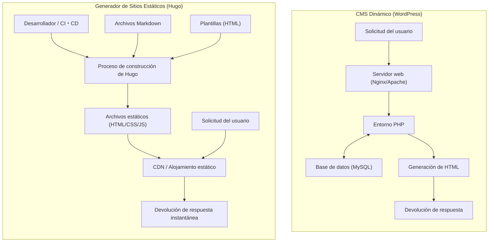
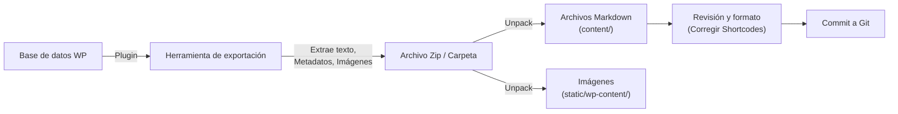

En el desarrollo web moderno y la gestión de blogs, la velocidad de carga de un sitio, su seguridad y su mantenibilidad son factores extremadamente importantes. Durante mucho tiempo, "WordPress", que ha tenido una cuota de mercado abrumadora como base para blogs y sitios web corporativos, ha sido utilizado por muchos usuarios debido a su flexible ecosistema de plugins y su panel de administración intuitivo. Sin embargo, debido a que implica la comunicación con bases de datos y la generación dinámica de páginas en el lado del servidor (procesamiento con PHP), también enfrenta desafíos como la vulnerabilidad ante aumentos repentinos de tráfico y retrasos en la visualización (latencia).

Por lo tanto, en los últimos años, los "Generadores de Sitios Estáticos" (SSG: Static Site Generator) se han popularizado rápidamente. En este artículo, profundizaremos en "**Hugo**", desarrollado en el lenguaje Go y conocido por su abrumadora velocidad de construcción entre los muchos SSG disponibles. Explicaremos exhaustivamente desde la comparación técnica de arquitectura con CMS (Sistemas de Gestión de Contenidos) dinámicos como WordPress, hasta los pasos concretos de migración, evaluación de rendimiento mediante modelos matemáticos, la estructura de directorios propia de Hugo y el orden de búsqueda de plantillas.

---

## 1. Diferencias técnicas entre un CMS dinámico (WordPress) y un generador de sitios estáticos (Hugo)

En el mecanismo de entrega de sitios web, WordPress y Hugo adoptan enfoques fundamentalmente diferentes.

### 1.1 Arquitectura de WordPress (Generación dinámica)
WordPress es un claro ejemplo de CMS dinámico que ensambla páginas en el lado del servidor con cada solicitud. Cuando hay un acceso a una página por parte de un usuario (navegador), el servidor web (Apache, Nginx, etc.) ejecuta un script PHP y realiza consultas a una base de datos relacional como MySQL (o MariaDB). Combina el contenido obtenido de la base de datos (datos de artículos, categorías, etiquetas, configuración del sitio, etc.) con archivos de plantillas para generar el HTML final y devolverlo al cliente.

Este mecanismo tiene la ventaja de poder generar contenido diferente para cada visitante en tiempo real (por ejemplo: carrito de compras de comercio electrónico, página exclusiva para usuarios que han iniciado sesión), pero consume intensamente los recursos del servidor a menos que se diseñe adecuadamente un mecanismo de caché (como proxy inverso o plugins).

### 1.2 Arquitectura de Hugo (Generación previa en tiempo de construcción)
Por otro lado, como su nombre indica, Hugo, un "generador de sitios estáticos", genera contenido en el "tiempo de construcción" y no en el "tiempo de solicitud". El contenido no se mantiene en una base de datos, sino como archivos locales "Markdown" controlados por versiones con herramientas como Git.
Cuando un desarrollador ejecuta el comando (`hugo`), Hugo lee los archivos Markdown, inyecta los datos en plantillas HTML especificadas (archivos de diseño) y genera un conjunto completo de archivos HTML/CSS/JS puros.

Los archivos generados (activos estáticos) se pueden entregar simplemente colocándolos en "entornos de alojamiento estático" como Amazon S3, Cloudflare Pages, Netlify, Vercel o un simple servidor Nginx. Como no se requiere una base de datos ni un lenguaje de lado del servidor (como PHP), los riesgos de seguridad (inyección SQL, vulnerabilidades de PHP, etc.) disminuyen drásticamente, y la velocidad de entrega se acelera al máximo al ser almacenada en caché en nodos de borde de una CDN (Content Delivery Network).

A continuación, ilustramos la diferencia entre las dos arquitecturas con un diagrama Mermaid.



---

## 2. Evaluación del rendimiento mediante modelos matemáticos

Uno de los mayores beneficios de migrar de WordPress a Hugo es la mejora en el rendimiento (velocidad de carga). Para entender esto cuantitativamente, expresémoslo con un modelo matemático simple.

El tiempo hasta que se completa la carga de una página (Load Time: $T_{load}$) se divide principalmente en el tiempo de respuesta del servidor (TTFB: Time To First Byte) y el tiempo de renderizado y obtención de recursos por parte del navegador ($T_{render}$).

$$ T_{load} = T_{ttfb} + T_{render} $$

En el caso de un CMS dinámico (WordPress), $T_{ttfb}$ es la suma de los siguientes elementos: latencia de la red ($T_{network}$), tiempo de ejecución del script del lado del servidor ($T_{php}$) y tiempo de procesamiento de consultas a la base de datos ($T_{db}$).

$$ T_{ttfb\_wp} = T_{network} + T_{php} + T_{db} $$

En un estado de accesos concentrados (alta carga), $T_{php}$ y $T_{db}$ aumentan de manera no lineal, y el sistema en su conjunto puede convertirse en un cuello de botella. Expresado en una fórmula, con respecto al número de solicitudes ($N$), se observa el siguiente deterioro en el tiempo de respuesta ($k$ es el coeficiente de sobrecarga de procesamiento).

$$ T_{php}(N) \approx O(N^k), \quad T_{db}(N) \approx O(N^k) \quad \text{where } k > 1 $$

Por otro lado, en una arquitectura que combina un generador de sitios estáticos (Hugo) y una CDN, no existe un procesamiento dinámico del lado del servidor (PHP o consultas DB). Dado que el contenido se almacena en caché en servidores de borde distribuidos por todo el mundo, $T_{ttfb}$ depende puramente de la latencia de la red desde el cliente hasta el servidor de borde más cercano ($T_{edge}$).

$$ T_{ttfb\_hugo} = T_{edge} $$

Con esto, se cumple $T_{edge} \ll (T_{network} + T_{php} + T_{db})$, y el TTFB se reduce drásticamente desde varios cientos de milisegundos a unas pocas decenas de milisegundos. Además, incluso si aumenta el número de solicitudes $N$, el tiempo de respuesta se mantiene casi constante ($O(1)$) debido a la función de equilibrio de carga de los servidores de borde.

$$ \lim_{N \to \infty} T_{ttfb\_hugo}(N) \approx \text{Constant} $$

Esta es la base matemática por la cual Hugo (un sitio estático) es extremadamente robusto contra picos de tráfico (como cuando el contenido se vuelve viral).

---

## 3. Estructura básica y principios de funcionamiento de Hugo

Para dominar Hugo, es esencial comprender su estructura de directorios única y los conceptos de "Front Matter" y "Template Lookup Order" (Orden de búsqueda de plantillas).

### 3.1 Explicación detallada de la estructura de directorios

Cuando creas un nuevo proyecto de Hugo (`hugo new site mysite`), se genera la siguiente estructura de directorios.

```text
mysite/
├── archetypes/   # Plantillas al crear nuevo contenido (esqueleto de Front Matter)
├── assets/       # Archivos procesados por Hugo Pipes (SCSS/Sass, JavaScript, etc.)
├── content/      # Contenido real del sitio (archivos Markdown). Esto reemplaza a la DB.
├── data/         # Datos externos y configuración usados en todo el sitio (JSON, TOML, YAML, CSV, etc.)
├── layouts/      # Plantillas HTML que determinan la apariencia del sitio (utiliza Go html/template)
├── public/       # Lugar donde se generan los archivos estáticos después de ejecutar el comando build
├── static/       # Archivos estáticos publicados tal cual (imágenes, favicon, txt para robots, etc.)
├── themes/       # Directorio de temas de terceros o creados por uno mismo
└── hugo.toml     # Archivo de configuración global del sitio (anteriormente config.toml era la norma)
```

En WordPress, el contenido se almacena en la tabla `wp_posts` de MySQL, pero en Hugo todo se gestiona como archivos de texto (principalmente Markdown) dentro del directorio `content/`. Esto facilita el control de versiones (Git) del contenido.

### 3.2 Gestión de contenido: Markdown y Front Matter

Cada archivo de artículo de Hugo tiene un bloque de metadatos llamado "Front Matter" en la parte superior, seguido del texto principal (Markdown). Front Matter se puede escribir en TOML, YAML o JSON, pero YAML es ampliamente utilizado.

```yaml
---
title: "Comprendiendo la taxonomía de Hugo"
date: 2026-09-13T10:00:00+09:00
draft: false
categories:
  - "Explicación técnica"
tags:
  - "Hugo"
  - "Go"
aliases:
  - "/old-category/hugo-taxonomy/"
---
A partir de aquí comienza el texto. Se escribe en **Markdown**.
Explicaremos las potentes funciones de Hugo...
```

Aquí, un punto a destacar es la clave `aliases`. Al migrar desde WordPress, si cambian los enlaces permanentes (URL), será una gran desventaja para el SEO. Si usas la función de alias de Hugo, con solo especificar la URL antigua, Hugo generará automáticamente el HTML de redireccionamiento (redirección mediante meta refresh). Es extremadamente útil, ya que no se requiere configuración de redirección en el lado del servidor (como .htaccess).

### 3.3 Orden de búsqueda de plantillas (Template Lookup Order)

Una de las potentes características de Hugo es su mecanismo flexible de búsqueda de plantillas (Template Lookup Order). Cuando Hugo renderiza una página específica, busca directorios y nombres de archivos en un orden particular para encontrar la mejor plantilla.

Por ejemplo, al renderizar un artículo individual (Single Page) como `content/post/hello-world.md`, Hugo busca el archivo de diseño aproximadamente en el siguiente orden:

1. `layouts/post/single.html`
2. `layouts/post/list.html` (no es un error, pero normalmente es para listas)
3. `layouts/_default/single.html`
4. `themes/<THEME_NAME>/layouts/post/single.html`
5. `themes/<THEME_NAME>/layouts/_default/single.html`

Los desarrolladores pueden **sobrescribir (override)** las plantillas de un tema simplemente creando un archivo con el mismo nombre en el directorio `layouts/` de su propio proyecto, sin tener que reescribir directamente el código fuente del tema. Esto permite aplicar personalizaciones propias sin obstaculizar la actualización del tema base.

### 3.4 Taxonomía (Taxonomy)

En Hugo, el sistema de clasificación equivalente a "Categorías" y "Etiquetas" de WordPress se llama "Taxonomía" (Taxonomy).
Hugo admite de forma predeterminada las taxonomías `categories` y `tags`, pero editando `hugo.toml`, puedes agregar libremente taxonomías personalizadas (por ejemplo: `series`, `authors`, etc.).

```toml
# Ejemplo de hugo.toml
[taxonomies]
  category = "categories"
  tag = "tags"
  series = "series"
  author = "authors"
```

Esto permite organizar y listar el contenido bajo diversas perspectivas.

---

## 4. Proceso de migración de WordPress a Hugo

La clave del éxito al migrar de WordPress a Hugo es cómo convertir el contenido dinámico de la base de datos en archivos estáticos limpios (Markdown + Front Matter) y mantener la estructura de URL existente.

A continuación se muestra el flujo general de la canalización de migración.



### 4.1 Extracción de datos y conversión a Markdown

Para exportar datos de WordPress a Hugo, usar un plugin dedicado es el método más sencillo y seguro. Presentamos algunos enfoques representativos:

1. **Uso del plugin Jekyll Exporter**
   Como Hugo tiene una estructura de datos muy similar a Jekyll, otro SSG, utilizar el plugin "Jekyll Exporter" para WordPress es una práctica común. Al instalar y ejecutar este plugin, todas las entradas y páginas estáticas se convierten a archivos Markdown con Front Matter y se pueden descargar como un archivo ZIP junto con los archivos de imagen.
2. **Script propio usando la API de WordPress**
   Este método consiste en usar Python, Node.js, etc., para hacer llamadas a la API REST de WordPress (`/wp-json/wp/v2/posts`), analizar los datos JSON y crear un script para generar archivos Markdown. Es eficaz para sitios que utilizan en gran medida campos personalizados complejos (como ACF) que los plugins no pueden manejar completamente.
3. **Aprovechamiento de la herramienta wp2hugo**
   También hay un enfoque para usar herramientas CLI escritas en lenguajes como Go para convertir directamente desde el archivo XML de exportación de WordPress (WXR) al formato de Hugo.

### 4.2 Mantenimiento de la estructura de enlaces permanentes (URL)

Para heredar la evaluación de SEO, es extremadamente importante mantener la estructura de URL de la era de WordPress tal como está. Si habías configurado enlaces permanentes en WordPress como `https://example.com/2026/09/13/my-post/`, debes especificar la estructura de enlaces permanentes en el archivo `hugo.toml` de Hugo.

```toml
[permalinks]
  post = "/:year/:month/:day/:slug/"
```

Alternativamente, es posible fijar la URL de forma forzada especificando directamente el parámetro `url` en el Front Matter de cada artículo.
Además, para las páginas cuyas URL cambiarán, configuras redirecciones usando los `aliases` mencionados anteriormente.

### 4.3 Conversión de Shortcodes (códigos cortos)

Los shortcodes específicos de WordPress (por ejemplo: `[gallery]`, `[caption]`, códigos únicos de varios plugins) a menudo permanecen como cadenas de texto tras la exportación, por lo que es necesario abordarlos.
Estos se pueden eliminar por completo mediante scripts de reemplazo (sed o Python) o se pueden migrar utilizando la poderosa **función de shortcodes personalizados** de Hugo (creando diseños propios en `layouts/shortcodes/`) para que se rendericen adecuadamente en el lado de Hugo.

---

## 5. Herramienta CLI de Hugo y construcción / despliegue

Una vez que se completan las tareas de migración, es hora de usar Hugo para construir el sitio y publicarlo para el mundo. Hugo, que se proporciona como un binario de Go, presume de una velocidad asombrosa, completando la construcción en unos pocos segundos incluso para sitios de miles a decenas de miles de páginas.

### 5.1 Inicio del servidor de desarrollo local

Cuando escribas artículos o ajustes el diseño, inicia el servidor local.

```bash
# Comando de inicio del servidor de desarrollo (usa -D para incluir borradores)
hugo server -D
```

Al ejecutar este comando, podrás previsualizar el sitio en `http://localhost:1313/`. Hugo tiene una poderosa función integrada llamada "LiveReload"; en el momento en que edites y guardes un archivo Markdown, plantilla o CSS, la pantalla del navegador se actualizará automáticamente a alta velocidad. Como resultado, la experiencia de escritura y desarrollo se vuelve mucho más cómoda que el panel de administración de WordPress.

### 5.2 Construcción para producción y optimización de rendimiento

Para generar archivos estáticos que se desplegarán en un entorno de producción, simplemente escribe `hugo`.

```bash
# Ejecución de la compilación para producción. Minimiza HTML/CSS/JS con la opción --minify
hugo --minify
```

Con este comando, los archivos de todo el sitio se generarán en el directorio `public/`. Al agregar la opción `--minify`, se eliminan los saltos de línea y espacios innecesarios, lo que reduce aún más el tamaño de los archivos. Esto contribuye directamente a reducir la latencia de la red ($T_{network}$) en el modelo matemático mencionado anteriormente.

### 5.3 Automatización del despliegue (CI/CD)

Generar archivos estáticos localmente cada vez y subirlos por FTP, etc., es ineficiente. En las operaciones modernas de SSG, la mejor práctica es construir un entorno de CI/CD que realice automáticamente la construcción y el despliegue cuando se desencadena por un push a un repositorio Git (como GitHub).

Por ejemplo, la forma básica de una configuración (archivo YAML) para implementar en Cloudflare Pages o GitHub Pages usando GitHub Actions es la siguiente:

```yaml
# Ejemplo de .github/workflows/hugo.yml
name: Deploy Hugo site to GitHub Pages

on:
  push:
    branches: ["main"]
  workflow_dispatch:

permissions:
  contents: read
  pages: write
  id-token: write

jobs:
  build:
    runs-on: ubuntu-latest
    steps:
      - name: Checkout
        uses: actions/checkout@v3
        with:
          submodules: recursive # Si los temas se administran como submódulos
          fetch-depth: 0

      - name: Setup Hugo
        uses: peaceiris/actions-hugo@v2
        with:
          hugo-version: 'latest'
          extended: true

      - name: Build
        run: hugo --minify

      - name: Upload artifact
        uses: actions/upload-pages-artifact@v2
        with:
          path: ./public

  deploy:
    environment:
      name: github-pages
      url: ${{ steps.deployment.outputs.page_url }}
    runs-on: ubuntu-latest
    needs: build
    steps:
      - name: Deploy to GitHub Pages
        id: deployment
        uses: actions/deploy-pages@v2
```

Configurándolo de esta manera, se completará un canal de automatización en el que solo con "escribir un artículo en Markdown y hacer Push a GitHub", el sitio más reciente se publicará en el entorno de producción en unos pocos minutos.

---

## 6. Beneficios de SEO y operativos tras la migración

Los administradores de sitios que han completado la migración de WordPress a Hugo a menudo notan los tres siguientes beneficios significativos.

### 6.1 Mejora drástica de la velocidad del sitio y los Core Web Vitals
Como resultado de eliminar las consultas a la base de datos y la renderización en el servidor, el tiempo de carga de la página se reduce a milisegundos. Esto se traduce directamente en una mejora masiva de las puntuaciones de "Core Web Vitals" (LCP, FID/INP, CLS), que son factores de clasificación de Google. Se puede esperar una reducción en la tasa de rebote de los usuarios y una mejora en la evaluación del SEO.

### 6.2 Liberación de amenazas de seguridad
Dado que WordPress se usa ampliamente en todo el mundo, siempre es objeto de ataques. Siempre existe el riesgo de manipulación de vulnerabilidades de plugins e intentos de inicio de sesión por ataques de fuerza bruta.
Sin embargo, un sitio estático generado por Hugo no tiene base de datos, entorno PHP ni pantalla de administración (formulario de inicio de sesión). No hay espacio para que un hacker ingrese al servidor y reescriba la base de datos, con lo que los riesgos de seguridad se acercan a cero al máximo.

### 6.3 Operación libre de mantenimiento
La operación de WordPress requiere tareas de mantenimiento continuas, como la actualización del propio núcleo, la actualización de plugins y el seguimiento de las versiones de PHP. Siempre hay que temer el riesgo de que el sitio se rompa debido a problemas de compatibilidad.
En el caso de Hugo, solo necesitas actualizar la herramienta en sí cuando sea necesario, y dado que el código del sitio está compuesto de archivos de texto independientes, ofrece la abrumadora tranquilidad de saber que "no se romperá aunque lo dejes desatendido".

---

## 7. Resumen

En este artículo, hemos explicado en detalle la migración de un CMS dinámico como WordPress al poderoso generador de sitios estáticos basado en Go, "Hugo", abordando desde las diferencias de arquitectura técnica y la demostración matemática del rendimiento hasta los pasos de migración específicos.

Migrar a un generador de sitios estáticos conlleva un costo inicial de aprendizaje (manejo de Git, sintaxis de Markdown, ejecución de comandos CLI en terminales, comprensión del funcionamiento del motor de plantillas), pero los beneficios compensan con creces mediante su "abrumadora velocidad de visualización", "seguridad sólida" y la característica de ser "libre de mantenimiento".

Si tu sitio web no requiere cambios de diseño frecuentes ni procesos dinámicos complejos (como funciones exclusivas para miembros o características avanzadas de comercio electrónico) y su propósito es principalmente transmitir información (blogs, medios, sitios corporativos), migrar a Hugo será una de las inversiones técnicas más efectivas. Te animamos a usar este artículo como guía para dar tu primer paso en la operación de un sitio web de próxima generación con Hugo.
