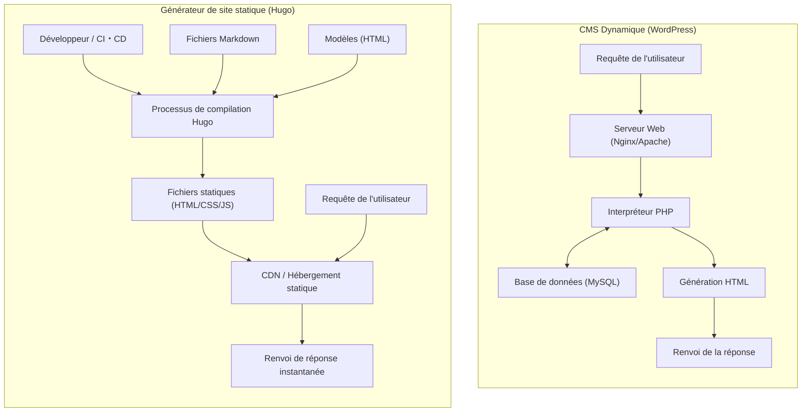
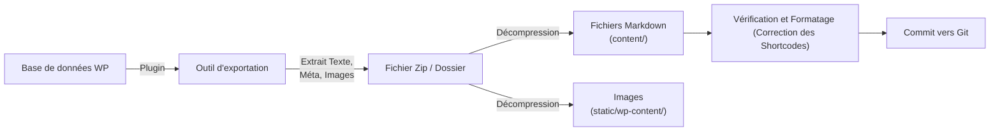

Dans le développement web moderne et la gestion de blogs, la vitesse d'affichage, la sécurité et la maintenabilité d'un site sont des éléments cruciaux. Longtemps leader incontesté en tant que fondation pour les blogs et les sites d'entreprise, "WordPress" est utilisé par de nombreux utilisateurs grâce à son écosystème de plugins flexible et son interface d'administration intuitive. Cependant, parce qu'il implique une communication avec une base de données et la génération dynamique de pages côté serveur (traitement via PHP), il présente également des vulnérabilités face aux pics de trafic et des problèmes de latence (retards d'affichage).

C'est pourquoi les "Générateurs de Sites Statiques (SSG: Static Site Generator)" connaissent une diffusion rapide ces dernières années. Dans cet article, nous allons nous pencher sur "**Hugo**", un SSG développé en langage Go et connu pour sa vitesse de compilation (build) impressionnante, parmi de nombreux autres SSG. Nous l'expliquerons en détail, de la comparaison de son architecture technique avec les CMS dynamiques (Content Management System) tels que WordPress, aux procédures de migration concrètes, en passant par une évaluation des performances à l'aide de modèles mathématiques, ainsi que la structure des répertoires et l'ordre de recherche des modèles (templates) spécifiques à Hugo.

---

## 1. Différences techniques entre un CMS dynamique (WordPress) et un générateur de site statique (Hugo)

Dans la façon dont ils distribuent un site web, WordPress et Hugo adoptent des approches fondamentalement différentes.

### 1.1 Architecture de WordPress (Génération dynamique)
WordPress est un représentant typique des CMS dynamiques qui construisent la page côté serveur à chaque requête. Lorsqu'un utilisateur (navigateur) accède à une page, le serveur web (Apache, Nginx, etc.) exécute des scripts PHP et envoie une requête à une base de données relationnelle telle que MySQL (ou MariaDB). Il combine le contenu récupéré de la base de données (données d'articles, catégories, tags, paramètres du site, etc.) avec des fichiers de modèles (templates) pour générer le code HTML final et le renvoyer au client.

Bien que ce système ait l'avantage de pouvoir générer en temps réel un contenu différent pour chaque visiteur (ex : panier d'un site e-commerce, page dédiée aux utilisateurs connectés), il consomme énormément de ressources serveur, à moins qu'un mécanisme de cache (reverse proxy, plugins, etc.) ne soit correctement configuré.

### 1.2 Architecture de Hugo (Génération préalable à la compilation)
D'autre part, comme son nom de "générateur de site statique" l'indique, Hugo effectue la génération du contenu au moment de la "compilation (build)" et non au moment de la "requête". Le contenu n'est pas conservé dans une base de données, mais sous forme de "fichiers Markdown" locaux dont les versions sont gérées via Git, etc.
Lorsque le développeur exécute la commande (`hugo`), Hugo lit les fichiers Markdown, injecte les données dans les modèles HTML spécifiés (fichiers de layout) et génère un ensemble de fichiers HTML/CSS/JS purs et complets.

L'ensemble des fichiers générés (assets statiques) peut être distribué simplement en le plaçant sur un "environnement d'hébergement statique" tel qu'Amazon S3, Cloudflare Pages, Netlify, Vercel, ou un simple serveur Nginx. Puisqu'il ne nécessite ni base de données ni langage côté serveur (comme PHP), les risques de sécurité (injections SQL, vulnérabilités PHP, etc.) sont drastiquement réduits, et la vitesse de distribution est maximisée en étant mise en cache sur les nœuds périphériques (edge nodes) d'un CDN (Content Delivery Network).

Les schémas Mermaid ci-dessous illustrent les différences entre chaque architecture.



---

## 2. Évaluation des performances par des modèles mathématiques

L'un des plus grands avantages de la migration de WordPress vers Hugo est l'amélioration des performances (vitesse d'affichage). Pour comprendre cela quantitativement, exprimons-le avec un modèle mathématique simple.

Le temps jusqu'à ce que le chargement de la page soit terminé (Load Time : $T_{load}$) est principalement divisé en temps de réponse du serveur (TTFB : Time To First Byte) et en temps de rendu/récupération des ressources par le navigateur ($T_{render}$).

$$ T_{load} = T_{ttfb} + T_{render} $$

Dans le cas d'un CMS dynamique (WordPress), le $T_{ttfb}$ est la somme des éléments suivants : latence du réseau ($T_{network}$), temps d'exécution des scripts côté serveur ($T_{php}$) et temps de traitement des requêtes de la base de données ($T_{db}$).

$$ T_{ttfb\_wp} = T_{network} + T_{php} + T_{db} $$

Dans un état où les accès sont concentrés (forte charge), $T_{php}$ et $T_{db}$ augmentent de manière non linéaire, et le système dans son ensemble peut devenir un goulot d'étranglement. Exprimé sous forme de formule, par rapport au nombre de requêtes ($N$), on observe la détérioration du temps de réponse suivante ($k$ est le coefficient de surcharge de traitement).

$$ T_{php}(N) \approx O(N^k), \quad T_{db}(N) \approx O(N^k) \quad \text{where } k > 1 $$

D'autre part, dans une architecture combinant un générateur de site statique (Hugo) et un CDN, il n'y a pas de traitement dynamique côté serveur (PHP ou requêtes DB). Comme le contenu est mis en cache sur des serveurs périphériques (edge servers) répartis dans le monde entier, le $T_{ttfb}$ dépend purement et uniquement de la latence du réseau du client jusqu'au serveur périphérique le plus proche ($T_{edge}$).

$$ T_{ttfb\_hugo} = T_{edge} $$

Par conséquent, $T_{edge} \ll (T_{network} + T_{php} + T_{db})$ se vérifie, et le TTFB est drastiquement réduit à quelques millisecondes à quelques dizaines de millisecondes. De plus, même si le nombre de requêtes $N$ augmente, le temps de réponse reste presque constant ($O(1)$) grâce à la fonction de répartition de charge (load balancing) des serveurs périphériques.

$$ \lim_{N \to \infty} T_{ttfb\_hugo}(N) \approx \text{Constant} $$

Ceci est la justification mathématique expliquant pourquoi Hugo (site statique) est extrêmement robuste face aux pics de trafic (par exemple, lors d'un buzz).

---

## 3. Structure de base et principes de fonctionnement de Hugo

Pour maîtriser Hugo, il est essentiel de comprendre sa structure de répertoires unique et les concepts de "Front Matter" et de "Template Lookup Order" (Ordre de recherche des modèles).

### 3.1 Explication détaillée de la structure des répertoires

Lorsque vous créez un nouveau projet Hugo (`hugo new site mysite`), la structure de répertoires suivante est générée.

```text
mysite/
├── archetypes/   # Modèles (templates) lors de la création de nouveau contenu (modèles pour Front Matter)
├── assets/       # Fichiers traités par Hugo Pipes (SCSS/Sass, JavaScript, etc.)
├── content/      # Contenu réel du site (fichiers Markdown). Remplace la DB.
├── data/         # Données externes et paramètres utilisés sur l'ensemble du site (JSON, TOML, YAML, CSV, etc.)
├── layouts/      # Modèles HTML déterminant l'apparence du site (utilise Go html/template)
├── public/       # Emplacement où les fichiers statiques générés sont placés après l'exécution de la commande de compilation
├── static/       # Fichiers statiques publiés tels quels (images, favicon, fichiers texte pour robots, etc.)
├── themes/       # Répertoire pour les thèmes tiers ou créés par soi-même
└── hugo.toml     # Fichier de configuration de l'ensemble du site (auparavant config.toml était courant)
```

Dans WordPress, le contenu est stocké dans la table `wp_posts` de MySQL, mais dans Hugo, il est entièrement géré en tant que fichiers texte (principalement Markdown) dans le répertoire `content/`. Cela facilite la gestion des versions de contenu (Git).

### 3.2 Gestion de contenu : Markdown et Front Matter

Chaque fichier d'article de Hugo possède un bloc de métadonnées appelé "Front Matter" tout en haut, suivi du corps du texte (Markdown) en dessous. Le Front Matter peut être écrit en TOML, YAML ou JSON, mais le YAML est largement utilisé.

```yaml
---
title: "Comprendre la taxonomie de Hugo"
date: 2026-09-13T10:00:00+09:00
draft: false
categories:
  - "Explication technique"
tags:
  - "Hugo"
  - "Go"
aliases:
  - "/old-category/hugo-taxonomy/"
---
Le texte commence ici. Il est écrit en **Markdown**.
Nous allons expliquer les fonctionnalités puissantes de Hugo...
```

Ce qu'il faut noter ici, c'est la clé `aliases`. Lors d'une migration depuis WordPress, si le permalien (URL) change, cela a un impact négatif important sur le SEO. En utilisant la fonction d'alias de Hugo, il suffit de spécifier l'ancienne URL, et Hugo générera automatiquement un HTML de redirection (transfert via meta refresh). C'est très pratique car cela élimine le besoin de configurer des redirections côté serveur (comme .htaccess).

### 3.3 Ordre de recherche des modèles (Template Lookup Order)

L'une des fonctionnalités puissantes de Hugo est son mécanisme de recherche de modèles flexible (Template Lookup Order). Lors du rendu d'une page spécifique, Hugo recherche les répertoires et les noms de fichiers dans un ordre spécifique pour trouver le meilleur modèle.

Par exemple, pour afficher un article unique (Single Page) appelé `content/post/hello-world.md`, Hugo cherchera généralement un fichier de layout dans l'ordre suivant :

1. `layouts/post/single.html`
2. `layouts/post/list.html` (Ce n'est pas une erreur, mais généralement utilisé pour les listes)
3. `layouts/_default/single.html`
4. `themes/<THEME_NAME>/layouts/post/single.html`
5. `themes/<THEME_NAME>/layouts/_default/single.html`

Les développeurs peuvent **écraser (overrider)** les modèles du thème en créant simplement un fichier du même nom dans le répertoire `layouts/` de leur propre projet, sans modifier directement le code source du thème. Cela permet d'appliquer ses propres personnalisations sans bloquer les mises à jour du thème de base.

### 3.4 Taxonomie (Taxonomy)

Dans Hugo, le système de classification équivalent aux "catégories" et "tags" de WordPress est appelé "Taxonomie (Taxonomy)".
Hugo prend en charge par défaut les taxonomies `categories` et `tags`, mais en éditant `hugo.toml`, vous pouvez ajouter librement des taxonomies personnalisées (ex : `series`, `authors`, etc.).

```toml
# Exemple de hugo.toml
[taxonomies]
  category = "categories"
  tag = "tags"
  series = "series"
  author = "authors"
```

Cela permet d'organiser et de lister le contenu selon divers axes.

---

## 4. Processus de migration de WordPress vers Hugo

La clé du succès d'une migration de WordPress vers Hugo est la manière de convertir proprement le contenu dynamique de la base de données en fichiers statiques (Markdown + Front Matter) tout en maintenant la structure des URL existantes.

Voici le flux de travail d'un pipeline de migration typique.



### 4.1 Extraction des données et conversion en Markdown

Pour exporter les données WordPress pour Hugo, l'utilisation d'un plugin dédié est la méthode la plus simple et la plus fiable. Voici quelques approches représentatives.

1. **Utilisation du plugin Jekyll Exporter**
   Comme Hugo a une structure de données très similaire à celle de Jekyll, un autre SSG, l'utilisation du plugin "Jekyll Exporter" pour WordPress est une méthode courante. En installant et en exécutant ce plugin, toutes vos publications et pages statiques seront converties en fichiers Markdown avec Front Matter et pourront être téléchargées sous forme de fichier ZIP avec vos fichiers d'images.
2. **Scripts personnalisés utilisant l'API WordPress**
   Il s'agit de la méthode consistant à créer un script (par exemple en Python ou Node.js) qui interroge l'API REST de WordPress (`/wp-json/wp/v2/posts`), analyse les données JSON et génère des fichiers Markdown par vous-même. Ceci est efficace pour les sites qui utilisent intensivement des champs personnalisés complexes (comme ACF) qui ne peuvent pas être entièrement gérés par des plugins.
3. **Utilisation de l'outil wp2hugo**
   Il existe également une approche qui consiste à utiliser un outil CLI écrit en langage Go, par exemple, pour convertir directement le fichier XML d'exportation de WordPress (WXR) au format Hugo.

### 4.2 Maintien de la structure des permaliens (URL)

Pour conserver les acquis SEO, il est extrêmement important de conserver l'URL de l'époque WordPress telle quelle. Si vous aviez configuré des permaliens tels que `https://example.com/2026/09/13/my-post/` dans WordPress, vous devez spécifier la structure du permalien dans le `hugo.toml` de Hugo.

```toml
[permalinks]
  post = "/:year/:month/:day/:slug/"
```

Alternativement, il est également possible de force une URL fixe pour chaque article en spécifiant directement le paramètre `url` dans le Front Matter.
De plus, pour les pages dont les URL changent, utilisez `aliases` comme mentionné précédemment pour configurer des redirections.

### 4.3 Conversion des shortcodes

Les shortcodes spécifiques à WordPress (ex : `[gallery]`, `[caption]`, et codes propres à divers plugins) restent souvent sous forme de chaînes de caractères brutes lors de l'exportation et nécessitent donc une attention particulière.
Celles-ci peuvent être soit supprimées en masse à l'aide de scripts de remplacement (sed ou Python), soit migrées pour être correctement rendues du côté de Hugo en utilisant la puissante **fonctionnalité de shortcodes personnalisés** de Hugo (en créant un layout personnalisé dans `layouts/shortcodes/`).

---

## 5. Outil CLI de Hugo, Compilation et Déploiement

Une fois la migration terminée, il est temps de compiler (build) le site avec Hugo et de le publier dans le monde entier. Hugo, fourni sous forme de binaire du langage Go, offre une vitesse incroyable, compilant un site de plusieurs milliers ou dizaines de milliers de pages en seulement quelques secondes.

### 5.1 Démarrage du serveur de développement local

Lors de la rédaction d'articles ou de l'ajustement du design, démarrez le serveur local.

```bash
# Commande pour démarrer le serveur de développement (utilisez -D pour inclure les articles brouillons)
hugo server -D
```

En exécutant cette commande, vous pouvez prévisualiser le site sur `http://localhost:1313/`. Hugo possède une puissante fonctionnalité intégrée de "LiveReload". Dès l'instant où vous modifiez et enregistrez un fichier Markdown, un modèle ou un fichier CSS, l'écran de votre navigateur est automatiquement et très rapidement mis à jour. Ainsi, l'expérience de rédaction et de développement est bien plus confortable que sur l'écran d'administration de WordPress.

### 5.2 Compilation pour la production et optimisation des performances

Pour générer des fichiers statiques à déployer en environnement de production, tapez simplement `hugo`.

```bash
# Exécution de la compilation pour la production. L'option --minify minimise HTML/CSS/JS
hugo --minify
```

Grâce à cette commande, les fichiers de l'ensemble du site sont exportés vers le répertoire `public/`. En ajoutant l'option `--minify`, les sauts de ligne et espaces inutiles sont supprimés, réduisant encore davantage la taille des fichiers. Cela contribue directement à la réduction de la latence du réseau ($T_{network}$) dans le modèle mathématique mentionné précédemment.

### 5.3 Automatisation du déploiement (CI/CD)

Générer des fichiers statiques sur votre PC local à chaque fois et les télécharger via FTP, etc., est inefficace. Dans l'exploitation moderne des SSG, la meilleure pratique consiste à créer un environnement CI/CD qui compile et déploie automatiquement en utilisant un push vers un dépôt Git (GitHub, etc.) comme déclencheur.

Par exemple, la forme de base d'une configuration (fichier YAML) pour déployer sur Cloudflare Pages ou GitHub Pages en utilisant GitHub Actions est la suivante :

```yaml
# Exemple de .github/workflows/hugo.yml
name: Déployer le site Hugo vers GitHub Pages

on:
  push:
    branches: ["main"]
  workflow_dispatch:

permissions:
  contents: read
  pages: write
  id-token: write

jobs:
  build:
    runs-on: ubuntu-latest
    steps:
      - name: Checkout
        uses: actions/checkout@v3
        with:
          submodules: recursive # Si vous gérez les thèmes avec des sous-modules
          fetch-depth: 0

      - name: Setup Hugo
        uses: peaceiris/actions-hugo@v2
        with:
          hugo-version: 'latest'
          extended: true

      - name: Build
        run: hugo --minify

      - name: Upload artifact
        uses: actions/upload-pages-artifact@v2
        with:
          path: ./public

  deploy:
    environment:
      name: github-pages
      url: ${{ steps.deployment.outputs.page_url }}
    runs-on: ubuntu-latest
    needs: build
    steps:
      - name: Deploy to GitHub Pages
        id: deployment
        uses: actions/deploy-pages@v2
```

En configurant ainsi, la simple action de "rédiger un article en Markdown et de le pousser (Push) vers GitHub" complète un pipeline automatisé où le site mis à jour est publié en environnement de production en quelques minutes.

---

## 6. Le SEO après la migration et les avantages opérationnels

Les administrateurs de site qui ont achevé la migration de WordPress vers Hugo ressentent souvent les 3 avantages notables suivants.

### 6.1 Amélioration spectaculaire de la vitesse du site et des Core Web Vitals
Les requêtes de base de données et le rendu côté serveur étant éliminés, le temps de chargement de la page est réduit à l'ordre des millisecondes. Cela conduit directement à une amélioration significative des scores "Core Web Vitals" (LCP, FID/INP, CLS) qui sont des facteurs de classement pour Google. On peut s'attendre à une baisse du taux de rebond (bounce rate) des utilisateurs et à une amélioration du classement SEO.

### 6.2 Libération face aux menaces de sécurité
Étant largement utilisé à travers le monde, WordPress est une cible constante d'attaques. Des risques persistent, tels que la falsification exploitant les vulnérabilités de plugins, ou la violation de l'écran de connexion par des attaques par force brute (brute-force).
Cependant, dans un site statique généré par Hugo, il n'y a pas de base de données, pas d'environnement PHP, et même pas d'interface d'administration (formulaire de connexion). Il n'y a aucune place pour qu'un pirate informatique s'introduise dans le serveur et réécrive la base de données, les risques de sécurité s'approchant au plus près de zéro.

### 6.3 Une exploitation sans maintenance
L'utilisation de WordPress requiert des tâches de maintenance constantes : mise à jour du cœur du système, mise à jour des plugins, suivi des versions de PHP, etc. Vous devez constamment redouter le risque que votre site soit cassé en raison de problèmes de compatibilité.
Dans le cas de Hugo, il suffit de mettre à jour l'outil lui-même si nécessaire. Le code du site étant constitué d'ensembles de fichiers texte indépendants, cela offre un sentiment de tranquillité absolue : "même s'il est laissé tel quel, il ne se cassera pas".

---

## 7. Conclusion

Dans cet article, nous avons détaillé la migration d'un CMS dynamique tel que WordPress vers "Hugo", un puissant générateur de site statique basé sur le langage Go, en couvrant les différences d'architecture technique, la preuve de performance via des modèles mathématiques, ainsi que les étapes concrètes de la migration.

Bien que la migration vers un générateur de site statique nécessite un coût d'apprentissage initial (utilisation de Git, syntaxe Markdown, exécution de commandes CLI depuis un terminal, compréhension des spécifications du moteur de templates, etc.), elle offre en retour une "vitesse d'affichage écrasante", une "sécurité robuste" et un état "sans maintenance" qui compensent largement cet effort.

Si votre site web ne nécessite pas de changements fréquents de design ou de traitements dynamiques complexes (tels que des fonctionnalités réservées aux membres ou des fonctions e-commerce avancées) et que son objectif principal est la diffusion d'informations (blog, média, site d'entreprise), la migration vers Hugo constituera l'un des investissements techniques les plus efficaces. N'hésitez pas à faire de cet article votre point de départ vers la gestion de site web de nouvelle génération utilisant Hugo.
