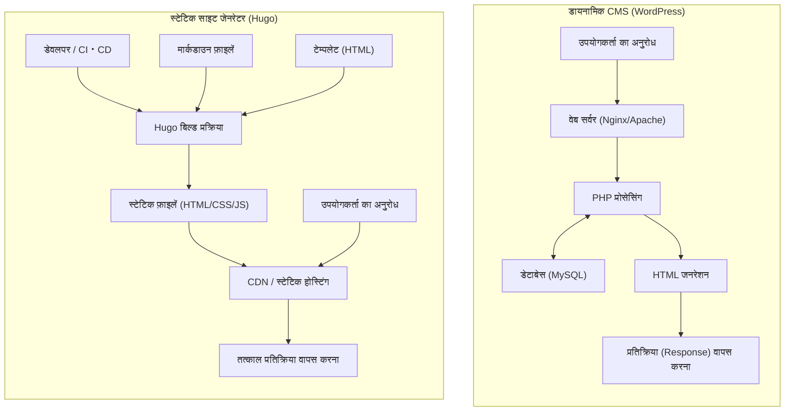
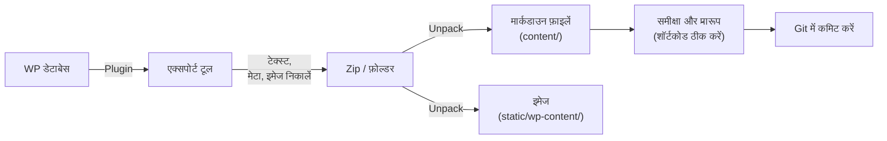

आधुनिक वेब विकास और ब्लॉगिंग में, साइट की लोडिंग गति, सुरक्षा और मेंटेनेबिलिटी बहुत महत्वपूर्ण कारक बन गए हैं। लंबे समय से, "वर्डप्रेस (WordPress)" ने अपने लचीले प्लगइन इकोसिस्टम और सहज प्रबंधन इंटरफ़ेस के कारण ब्लॉग और कॉर्पोरेट साइटों के आधार के रूप में अत्यधिक लोकप्रियता हासिल की है, और इसे कई उपयोगकर्ताओं द्वारा पसंद किया जाता है। हालाँकि, चूंकि इसमें डेटाबेस संचार और सर्वर-साइड डायनामिक पेज जनरेशन (PHP प्रोसेसिंग) शामिल है, इसलिए इसमें अचानक ट्रैफ़िक वृद्धि और डिस्प्ले विलंब (लेटेंसी) की भेद्यता जैसी चुनौतियां भी हैं।

इसलिए, हाल के वर्षों में "स्टेटिक साइट जेनरेटर (SSG)" तेजी से लोकप्रिय हो रहे हैं। इस लेख में, हम "ह्यूगो (Hugo)" के बारे में गहराई से जानेंगे, जो कई SSG में से गो (Go) भाषा पर आधारित है और अपनी शानदार बिल्ड गति के लिए जाना जाता है। वर्डप्रेस जैसे डायनामिक CMS (कंटेंट मैनेजमेंट सिस्टम) के साथ तकनीकी आर्किटेक्चर की तुलना से लेकर विशिष्ट माइग्रेशन चरणों, गणितीय मॉडल का उपयोग करके प्रदर्शन मूल्यांकन, और ह्यूगो की विशिष्ट निर्देशिका संरचना और टेम्पलेट लुकअप ऑर्डर तक, हम सब कुछ विस्तार से समझाएंगे।

---

## 1. डायनामिक CMS (WordPress) और स्टेटिक साइट जेनरेटर (Hugo) के बीच तकनीकी अंतर

वेबसाइटों को डिलीवर करने के तंत्र में, वर्डप्रेस और ह्यूगो मौलिक रूप से अलग-अलग दृष्टिकोण अपनाते हैं।

### 1.1 वर्डप्रेस आर्किटेक्चर (डायनामिक जनरेशन)
वर्डप्रेस एक विशिष्ट डायनामिक CMS है जो हर अनुरोध (रिक्वेस्ट) पर सर्वर-साइड पर पेज बनाता है। जब कोई उपयोगकर्ता (ब्राउज़र) किसी पेज को एक्सेस करता है, तो वेब सर्वर (Apache, Nginx, आदि) एक PHP स्क्रिप्ट निष्पादित करता है और MySQL (या MariaDB) जैसे रिलेशनल डेटाबेस को क्वेरी भेजता है। डेटाबेस से प्राप्त सामग्री (लेख डेटा, श्रेणियां, टैग, साइट सेटिंग्स, आदि) को टेम्पलेट फ़ाइलों के साथ जोड़ा जाता है, और अंतिम HTML उत्पन्न करके क्लाइंट को वापस कर दिया जाता है।

इस तंत्र का लाभ यह है कि यह प्रत्येक आगंतुक के लिए वास्तविक समय (रियल-टाइम) में विभिन्न सामग्री उत्पन्न कर सकता है (उदाहरण के लिए: ई-कॉमर्स साइट कार्ट, लॉग इन उपयोगकर्ताओं के लिए समर्पित पृष्ठ), लेकिन जब तक कैशिंग तंत्र (रिवर्स प्रॉक्सी, प्लगइन्स, आदि) को ठीक से डिज़ाइन नहीं किया जाता है, यह भारी मात्रा में सर्वर संसाधनों की खपत करता है।

### 1.2 ह्यूगो आर्किटेक्चर (बिल्ड-टाइम प्री-जनरेशन)
दूसरी ओर, ह्यूगो, जैसा कि नाम "स्टेटिक साइट जेनरेटर" से पता चलता है, सामग्री को "रिक्वेस्ट-टाइम" के बजाय "बिल्ड-टाइम" पर उत्पन्न करता है। सामग्री को डेटाबेस में नहीं, बल्कि स्थानीय "मार्कडाउन (Markdown) फ़ाइलों" के रूप में रखा जाता है, जिन्हें Git आदि के साथ वर्ज़न कंट्रोल किया जाता है।
जब कोई डेवलपर (`hugo`) कमांड चलाता है, तो ह्यूगो मार्कडाउन फ़ाइलों को पढ़ता है, निर्दिष्ट HTML टेम्पलेट्स (लेआउट फ़ाइलों) में डेटा डालता है, और पूर्ण, शुद्ध HTML/CSS/JS फ़ाइलों का एक संग्रह उत्पन्न करता है।

उत्पन्न फ़ाइलें (स्टेटिक एसेट्स) अमेज़न S3 (Amazon S3), क्लाउडफ्लेयर पेजेस (Cloudflare Pages), नेटलिफ़ाई (Netlify), वर्सेल (Vercel), या साधारण Nginx सर्वर जैसे "स्टेटिक होस्टिंग वातावरण" पर रख कर वितरित की जा सकती हैं। चूंकि न तो डेटाबेस और न ही सर्वर-साइड भाषा (जैसे PHP) की आवश्यकता होती है, सुरक्षा जोखिम (जैसे SQL इंजेक्शन और PHP भेद्यता) नाटकीय रूप से कम हो जाते हैं, और डिलीवरी गति को CDN (कंटेंट डिलीवरी नेटवर्क) के एज नोड्स पर कैश करके अधिकतम किया जाता है।

नीचे दिया गया Mermaid आरेख प्रत्येक आर्किटेक्चर के बीच का अंतर दिखाता है।



---

## 2. गणितीय मॉडल का उपयोग करके प्रदर्शन मूल्यांकन

वर्डप्रेस से ह्यूगो में माइग्रेट करने के सबसे बड़े फायदों में से एक प्रदर्शन (लोडिंग गति) में सुधार है। इसे मात्रात्मक रूप से समझने के लिए, आइए इसे एक सरल गणितीय मॉडल के साथ व्यक्त करें।

पृष्ठ लोडिंग पूरी होने तक का समय (लोड टाइम: $T_{load}$) मुख्य रूप से सर्वर के प्रतिक्रिया समय (TTFB: Time To First Byte) और ब्राउज़र के रेंडरिंग/संसाधन पुनर्प्राप्ति समय ($T_{render}$) में विभाजित होता है।

$$ T_{load} = T_{ttfb} + T_{render} $$

डायनामिक CMS (वर्डप्रेस) के मामले में, $T_{ttfb}$ निम्नलिखित तत्वों का योग है: नेटवर्क विलंब ($T_{network}$), सर्वर-साइड स्क्रिप्ट निष्पादन समय ($T_{php}$), और डेटाबेस क्वेरी प्रोसेसिंग समय ($T_{db}$)।

$$ T_{ttfb\_wp} = T_{network} + T_{php} + T_{db} $$

जब पहुँच (access) केंद्रित होती है (उच्च भार के दौरान), $T_{php}$ और $T_{db}$ अरेखीय रूप से (non-linearly) बढ़ते हैं, और संपूर्ण प्रणाली एक बाधा (bottleneck) बन सकती है। गणितीय रूप से, अनुरोधों की संख्या ($N$) के संबंध में प्रतिक्रिया समय में निम्नलिखित गिरावट देखी जाती है ($k$ प्रोसेसिंग ओवरहेड गुणांक है)।

$$ T_{php}(N) \approx O(N^k), \quad T_{db}(N) \approx O(N^k) \quad \text{where } k > 1 $$

दूसरी ओर, स्टेटिक साइट जेनरेटर (ह्यूगो) और CDN को मिलाने वाले आर्किटेक्चर में, सर्वर-साइड डायनामिक प्रोसेसिंग (PHP या DB क्वेरीज़) मौजूद नहीं है। चूंकि सामग्री दुनिया भर में वितरित एज सर्वर पर कैश की जाती है, $T_{ttfb}$ विशुद्ध रूप से क्लाइंट से निकटतम एज सर्वर तक नेटवर्क विलंब ($T_{edge}$) पर निर्भर करता है।

$$ T_{ttfb\_hugo} = T_{edge} $$

परिणामस्वरूप, $T_{edge} \ll (T_{network} + T_{php} + T_{db})$ लागू होता है, और TTFB नाटकीय रूप से कुछ मिलीसेकंड से लेकर दसियों मिलीसेकंड तक कम हो जाता है। साथ ही, भले ही अनुरोधों की संख्या $N$ बढ़ जाती है, एज सर्वर के लोड बैलेंसिंग फ़ंक्शन के कारण प्रतिक्रिया समय लगभग स्थिर ($O(1)$) रहता है।

$$ \lim_{N \to \infty} T_{ttfb\_hugo}(N) \approx \text{Constant} $$

यह गणितीय प्रमाण है कि ट्रैफ़िक स्पाइक्स (जैसे कि जब कोई पोस्ट वायरल हो जाती है) के खिलाफ ह्यूगो (स्टेटिक साइट) अत्यधिक मजबूत है।

---

## 3. ह्यूगो की मूल संरचना और कार्य सिद्धांत

ह्यूगो में महारत हासिल करने के लिए, इसकी अनूठी निर्देशिका संरचना और "Front Matter" तथा "Template Lookup Order" (टेम्पलेट लुकअप ऑर्डर) की अवधारणाओं को समझना आवश्यक है।

### 3.1 निर्देशिका संरचना की विस्तृत व्याख्या

जब आप एक नया ह्यूगो प्रोजेक्ट (`hugo new site mysite`) बनाते हैं, तो निम्नलिखित निर्देशिका संरचना उत्पन्न होती है।

```text
mysite/
├── archetypes/   # नई सामग्री बनाते समय टेम्पलेट (Front Matter का ब्लूप्रिंट)
├── assets/       # फ़ाइलें जिन्हें Hugo Pipes द्वारा प्रोसेस किया जाना है (SCSS/Sass, JavaScript, आदि)
├── content/      # वास्तविक साइट सामग्री (मार्कडाउन फ़ाइलें)। यह DB की जगह लेता है।
├── data/         # बाहरी डेटा और साइट-व्यापी उपयोग के लिए सेटिंग्स (JSON, TOML, YAML, CSV, आदि)
├── layouts/      # HTML टेम्पलेट जो साइट का स्वरूप निर्धारित करते हैं (Go html/template का उपयोग करके)
├── public/       # वह स्थान जहाँ बिल्ड कमांड चलाने के बाद जेनरेट की गई स्टेटिक फ़ाइलें आउटपुट होती हैं
├── static/       # स्टेटिक फ़ाइलें जो जैसी हैं वैसी ही पब्लिश की जाती हैं (चित्र, favicon, रोबोट टेक्स्ट, आदि)
├── themes/       # थर्ड-पार्टी या कस्टम थीम निर्देशिका
└── hugo.toml     # साइट-व्यापी कॉन्फ़िगरेशन फ़ाइल (पहले config.toml मुख्यधारा थी)
```

वर्डप्रेस में, सामग्री MySQL में `wp_posts` तालिका में संग्रहीत की जाती है, लेकिन ह्यूगो में, सब कुछ `content/` निर्देशिका में टेक्स्ट फ़ाइलों (मुख्य रूप से मार्कडाउन) के रूप में प्रबंधित किया जाता है। यह सामग्री का वर्ज़न कंट्रोल (Git) आसान बनाता है।

### 3.2 सामग्री प्रबंधन: मार्कडाउन और फ्रंट मैटर (Front Matter)

प्रत्येक ह्यूगो लेख फ़ाइल के शीर्ष पर "फ्रंट मैटर (Front Matter)" नामक मेटाडेटा का एक ब्लॉक होता है, जिसके बाद मुख्य भाग (मार्कडाउन) होता है। फ्रंट मैटर को TOML, YAML, या JSON में लिखा जा सकता है, लेकिन YAML का व्यापक रूप से उपयोग किया जाता है।

```yaml
---
title: "ह्यूगो टैक्सोनॉमी (Taxonomy) को समझना"
date: 2026-09-13T10:00:00+09:00
draft: false
categories:
  - "तकनीकी व्याख्या"
tags:
  - "Hugo"
  - "Go"
aliases:
  - "/old-category/hugo-taxonomy/"
---
यहाँ से मुख्य भाग शुरू होता है। हम **मार्कडाउन (Markdown)** में लिखते हैं।
मैं ह्यूगो की शक्तिशाली विशेषताओं की व्याख्या करूँगा...
```

यहां ध्यान देने योग्य बात `aliases` कुंजी है। वर्डप्रेस से माइग्रेट करते समय, यदि परमालिंक (URL) बदलता है, तो यह SEO के लिए एक बड़ा नकारात्मक बिंदु होगा। ह्यूगो की उपनाम (alias) सुविधा का उपयोग करके, आपको केवल पुराने URL को निर्दिष्ट करना होगा, और ह्यूगो स्वचालित रूप से रीडायरेक्ट (meta refresh का उपयोग करके अग्रेषण) के लिए HTML उत्पन्न करेगा। यह बहुत सुविधाजनक है क्योंकि यह सर्वर-साइड रीडायरेक्ट सेटिंग्स (जैसे .htaccess) की आवश्यकता को समाप्त करता है।

### 3.3 टेम्पलेट लुकअप ऑर्डर (Template Lookup Order)

ह्यूगो की शक्तिशाली विशेषताओं में से ক্যাম लचीला टेम्पलेट खोज तंत्र (Template Lookup Order) है। किसी विशिष्ट पृष्ठ को रेंडर करते समय, ह्यूगो इष्टतम टेम्पलेट को खोजने के लिए एक विशिष्ट क्रम में निर्देशिकाओं और फ़ाइल नामों को खोजता है।

उदाहरण के लिए, `content/post/hello-world.md` जैसे एकल लेख (Single Page) को रेंडर करते समय, ह्यूगो आम तौर पर निम्नलिखित क्रम में लेआउट फ़ाइलों की खोज करता है:

1. `layouts/post/single.html`
2. `layouts/post/list.html` (हालाँकि यह गलत नहीं है, यह आमतौर पर सूचियों के लिए उपयोग किया जाता है)
3. `layouts/_default/single.html`
4. `themes/<THEME_NAME>/layouts/post/single.html`
5. `themes/<THEME_NAME>/layouts/_default/single.html`

डेवलपर्स थीम के स्रोत कोड को सीधे फिर से लिखे बिना, अपने प्रोजेक्ट की `layouts/` निर्देशिका में उसी नाम की फ़ाइल बनाकर थीम टेम्पलेट को **ओवरराइड (override)** कर सकते हैं। यह आपको मूल थीम के अपडेट में बाधा डाले बिना अपना स्वयं का अनुकूलन (customization) लागू करने की अनुमति देता है।

### 3.4 टैक्सोनॉमी (Taxonomy)

वर्गीकरण प्रणाली जो वर्डप्रेस में "श्रेणियों" (categories) और "टैग" (tags) के बराबर है, उसे ह्यूगो में "टैक्सोनॉमी (Taxonomy)" कहा जाता है।
ह्यूगो डिफ़ॉल्ट रूप से `categories` और `tags` टैक्सोनॉमी का समर्थन करता है, लेकिन `hugo.toml` को संपादित करके, आप स्वतंत्र रूप से कस्टम टैक्सोनॉमी (उदाहरण के लिए: `series`, `authors`, आदि) जोड़ सकते हैं।

```toml
# hugo.toml का उदाहरण
[taxonomies]
  category = "categories"
  tag = "tags"
  series = "series"
  author = "authors"
```

यह आपको विभिन्न अक्षों (axes) पर सामग्री को व्यवस्थित और सूचीबद्ध करने की अनुमति देता है।

---

## 4. वर्डप्रेस से ह्यूगो में माइग्रेशन प्रक्रिया

वर्डप्रेस से ह्यूगो में माइग्रेशन की सफलता इस बात पर निर्भर करती है कि आप डेटाबेस में डायनामिक सामग्री को स्वच्छ स्टेटिक फ़ाइलों (मार्कडाउन + फ्रंट मैटर) में कैसे परिवर्तित करते हैं, और मौजूदा URL संरचना को कैसे बनाए रखते हैं।

नीचे एक विशिष्ट माइग्रेशन पाइपलाइन का प्रवाह दिया गया है।



### 4.1 डेटा निष्कर्षण और मार्कडाउन रूपांतरण

वर्डप्रेस डेटा को ह्यूगो के लिए आउटपुट करने का सबसे आसान और सबसे विश्वसनीय तरीका एक समर्पित प्लगइन का उपयोग करना है। यहाँ कुछ विशिष्ट दृष्टिकोण दिए गए हैं:

1. **Jekyll Exporter प्लगइन का उपयोग**
   चूंकि ह्यूगो की डेटा संरचना Jekyll (एक अन्य SSG) के समान है, इसलिए वर्डप्रेस के लिए "Jekyll Exporter" प्लगइन का उपयोग करना आम बात है। जब आप इस प्लगइन को स्थापित और निष्पादित करते हैं, तो सभी पोस्ट और पेज फ्रंट मैटर के साथ मार्कडाउन फ़ाइलों में परिवर्तित हो जाते हैं और छवि फ़ाइलों के साथ ज़िप (ZIP) फ़ाइल के रूप में डाउनलोड किए जा सकते हैं।
2. **WordPress API का उपयोग करके कस्टम स्क्रिप्ट**
   यह एक ऐसी विधि है जहाँ आप वर्डप्रेस REST API (`/wp-json/wp/v2/posts`) को कॉल करने के लिए Python, Node.js आदि का उपयोग करते हैं, JSON डेटा को पार्स करते हैं और अपनी खुद की मार्कडाउन फ़ाइलें उत्पन्न करने के लिए एक स्क्रिप्ट बनाते हैं। यह उन साइटों के लिए उपयोगी है जो जटिल कस्टम फ़ील्ड (जैसे ACF) का भारी उपयोग करते हैं जिन्हें प्लगइन्स द्वारा नियंत्रित नहीं किया जा सकता है।
3. **wp2hugo टूल का लाभ उठाना**
   Go भाषा आदि में लिखे गए CLI टूल का उपयोग करके वर्डप्रेस एक्सपोर्ट XML फ़ाइल (WXR) से सीधे ह्यूगो प्रारूप में परिवर्तित करने का भी एक दृष्टिकोण है।

### 4.2 परमालिंक (URL) संरचना को बनाए रखना

SEO रैंकिंग को बनाए रखने के लिए, वर्डप्रेस युग के URL को उसी तरह बनाए रखना बेहद जरूरी है। यदि आपके पास वर्डप्रेस में `https://example.com/2026/09/13/my-post/` जैसी परमालिंक सेटिंग थी, तो ह्यूगो के `hugo.toml` में परमालिंक संरचना निर्दिष्ट करें।

```toml
[permalinks]
  post = "/:year/:month/:day/:slug/"
```

वैकल्पिक रूप से, आप प्रत्येक लेख के फ्रंट मैटर में सीधे `url` पैरामीटर निर्दिष्ट करके URL को बलपूर्वक फिक्स कर सकते हैं।
इसके अतिरिक्त, उन पृष्ठों के लिए जिनका URL बदलता है, ऊपर बताए गए `aliases` का उपयोग करके रीडायरेक्ट सेट करें।

### 4.3 शॉर्टकोड (Shortcodes) रूपांतरण

वर्डप्रेस-विशिष्ट शॉर्टकोड (उदा. `[gallery]`, `[caption]`, विभिन्न प्लगइन्स के कस्टम कोड) अक्सर एक्सपोर्ट के दौरान उनके मूल स्ट्रिंग रूप में छोड़ दिए जाते हैं, इसलिए उन्हें संभालने की आवश्यकता होती है।
इन्हें प्रतिस्थापन स्क्रिप्ट (जैसे sed या Python) का उपयोग करके एक साथ हटाया जा सकता है, या आप ह्यूगो की शक्तिशाली **कस्टम शॉर्टकोड सुविधा** (जहां आप `layouts/shortcodes/` में अपने स्वयं के लेआउट बनाते हैं) का उपयोग करके उन्हें इस तरह माइग्रेट कर सकते हैं कि वे ह्यूगो की तरफ ठीक से रेंडर हों।

---

## 5. ह्यूगो CLI टूल और बिल्ड/डिप्लॉयमेंट

एक बार माइग्रेशन का काम पूरा हो जाने के बाद, अंततः आप ह्यूगो का उपयोग करके अपनी साइट का निर्माण (build) करेंगे और इसे दुनिया के सामने प्रकाशित करेंगे। गो (Go) भाषा बाइनरी के रूप में प्रदान किया गया, ह्यूगो अविश्वसनीय गति समेटे हुए है जो हजारों या दसियों हजार पृष्ठों वाली साइटों के लिए भी कुछ ही सेकंड में बिल्ड पूरा करता है।

### 5.1 स्थानीय विकास (Local Development) सर्वर शुरू करना

लेख लिखते समय या डिज़ाइन को समायोजित करते समय, आप स्थानीय सर्वर शुरू करते हैं।

```bash
# विकास सर्वर शुरू करने का कमांड (ड्राफ़्ट लेखों को शामिल करने के लिए -D)
hugo server -D
```

इस कमांड को निष्पादित करने से, आपकी साइट `http://localhost:1313/` पर पूर्वावलोकन (preview) के लिए उपलब्ध हो जाएगी। ह्यूगो में एक शक्तिशाली "LiveReload" (लाइवरिलोड) सुविधा अंतर्निहित है, जिसका अर्थ है कि जिस क्षण आप किसी मार्कडाउन फ़ाइल, टेम्पलेट, या CSS को संपादित और सहेजते हैं, ब्राउज़र स्क्रीन स्वचालित रूप से और तेजी से अपडेट हो जाती है। यह वर्डप्रेस प्रबंधन स्क्रीन की तुलना में लेखन और विकास के अनुभव को कहीं अधिक आरामदायक बनाता है।

### 5.2 प्रोडक्शन बिल्ड और प्रदर्शन अनुकूलन

उत्पादन (production) वातावरण में डिप्लॉय करने के लिए स्टेटिक फ़ाइलें उत्पन्न करने के लिए, बस `hugo` टाइप करें।

```bash
# प्रोडक्शन के लिए बिल्ड चलाएं। HTML/CSS/JS को छोटा करने के लिए --minify विकल्प
hugo --minify
```

यह कमांड संपूर्ण साइट फ़ाइलों को `public/` निर्देशिका में आउटपुट करता है। `--minify` विकल्प जोड़ने से, अनावश्यक लाइन ब्रेक और स्पेस हटा दिए जाते हैं, जिससे फ़ाइल का आकार और कम हो जाता है। यह सीधे ऊपर वर्णित गणितीय मॉडल में नेटवर्क विलंब ($T_{network}$) को कम करने में योगदान देता है।

### 5.3 डिप्लॉयमेंट स्वचालन (CI/CD)

हर बार स्थानीय पीसी (PC) पर स्टेटिक फ़ाइलें जेनरेट करना और उन्हें एफ़टीपी (FTP) आदि के माध्यम से अपलोड करना अक्षम है। आधुनिक SSG संचालन में, सर्वोत्तम अभ्यास एक CI/CD वातावरण बनाना है जो Git रिपॉजिटरी (जैसे GitHub) में पुश किए जाने पर स्वचालित रूप से बनाता और तैनात (deploy) करता है।

उदाहरण के लिए, GitHub Actions का उपयोग करके Cloudflare Pages या GitHub Pages पर डिप्लॉय करने के लिए कॉन्फ़िगरेशन (YAML फ़ाइल) का मूल रूप इस प्रकार दिखता है:

```yaml
# .github/workflows/hugo.yml का उदाहरण
name: Deploy Hugo site to GitHub Pages

on:
  push:
    branches: ["main"]
  workflow_dispatch:

permissions:
  contents: read
  pages: write
  id-token: write

jobs:
  build:
    runs-on: ubuntu-latest
    steps:
      - name: Checkout
        uses: actions/checkout@v3
        with:
          submodules: recursive # यदि आप सबमॉड्यूल (submodules) के साथ थीम प्रबंधित करते हैं
          fetch-depth: 0

      - name: Setup Hugo
        uses: peaceiris/actions-hugo@v2
        with:
          hugo-version: 'latest'
          extended: true

      - name: Build
        run: hugo --minify

      - name: Upload artifact
        uses: actions/upload-pages-artifact@v2
        with:
          path: ./public

  deploy:
    environment:
      name: github-pages
      url: ${{ steps.deployment.outputs.page_url }}
    runs-on: ubuntu-latest
    needs: build
    steps:
      - name: Deploy to GitHub Pages
        id: deployment
        uses: actions/deploy-pages@v2
```

इसे इस तरह कॉन्फ़िगर करने से, एक स्वचालित पाइपलाइन पूरी हो जाती है जहां केवल "मार्कडाउन में एक लेख लिखना और उसे GitHub पर पुश करना" नवीनतम साइट को कुछ ही मिनटों में उत्पादन (production) वातावरण में प्रकाशित कर देगा।

---

## 6. माइग्रेशन के बाद SEO और परिचालन संबंधी लाभ

जिन साइट संचालकों ने वर्डप्रेस से ह्यूगो में माइग्रेशन पूरा कर लिया है, वे अक्सर निम्नलिखित तीन उल्लेखनीय लाभों का अनुभव करते हैं।

### 6.1 साइट की गति और कोर वेब वाइटल्स (Core Web Vitals) में नाटकीय सुधार
डेटाबेस क्वेरीज़ और सर्वर-साइड रेंडरिंग को खत्म करने के परिणामस्वरूप, पेज लोड का समय मिलीसेकंड तक कम हो जाता है। यह सीधे Google के रैंकिंग कारकों, "Core Web Vitals" (LCP, FID/INP, CLS) स्कोर में महत्वपूर्ण सुधार की ओर ले जाता है। आप उपयोगकर्ता बाउंस दर में कमी और SEO मूल्यांकन में सुधार की उम्मीद कर सकते हैं।

### 6.2 सुरक्षा खतरों से मुक्ति
चूंकि वर्डप्रेस दुनिया भर में व्यापक रूप से उपयोग किया जाता है, इसलिए यह हमेशा हमलों का लक्ष्य बना रहता है। प्लगइन कमजोरियों और ब्रूट-फोर्स हमलों के माध्यम से अनधिकृत लॉगिन के माध्यम से छेड़छाड़ का हमेशा जोखिम रहता है।
हालाँकि, ह्यूगो द्वारा निर्मित स्टेटिक साइट में कोई डेटाबेस, कोई PHP वातावरण और यहां तक कि कोई व्यवस्थापन स्क्रीन (लॉगिन फॉर्म) नहीं है। हैकर्स के लिए सर्वर में सेंध लगाने और डेटाबेस को फिर से लिखने की कोई गुंजाइश नहीं है, इसलिए सुरक्षा जोखिम शून्य के करीब पहुँच जाता है।

### 6.3 मेंटेनेंस-मुक्त संचालन
वर्डप्रेस के संचालन में मुख्य सिस्टम को अपग्रेड करना, प्लगइन्स को अपडेट करना और PHP वर्ज़न के साथ तालमेल बिठाना जैसे निरंतर रखरखाव कार्य की आवश्यकता होती है। अनुकूलता के मुद्दों के कारण आपको हमेशा साइट टूटने के जोखिम से डरना पड़ता है।
ह्यूगो के मामले में, आपको केवल आवश्यक होने पर ही टूल को अपडेट करने की आवश्यकता है, और चूंकि साइट कोड अपने आप में स्वतंत्र टेक्स्ट फ़ाइलों का सामूहिक रूप है, इसलिए सुरक्षा की एक जबरदस्त भावना है कि "यदि आप इसे अकेला छोड़ देते हैं तो भी यह नहीं टूटेगा।"

---

## 7. निष्कर्ष

इस लेख में, हमने वर्डप्रेस जैसे डायनामिक CMS से गो (Go) भाषा-आधारित शक्तिशाली स्टेटिक साइट जेनरेटर "ह्यूगो" में माइग्रेशन को विस्तार से समझाया है, जिसमें तकनीकी वास्तुकला में अंतर से लेकर गणितीय मॉडल का उपयोग करके प्रदर्शन के प्रमाण और विशिष्ट माइग्रेशन चरण शामिल हैं।

स्टेटिक साइट जेनरेटर में माइग्रेट करने के लिए कुछ शुरुआती सीखने की लागत (Git संचालन, मार्कडाउन सिंटैक्स, टर्मिनल से CLI कमांड निष्पादित करना, टेम्पलेट इंजन विनिर्देशों को समझना, आदि) की आवश्यकता होती है, लेकिन यह "अत्यधिक लोडिंग गति", "मज़बूत सुरक्षा", और "रखरखाव-मुक्त" संचालन का भारी प्रतिफल (रिटर्न) लाता है जो इस लागत से कहीं अधिक है।

यदि आपकी वेबसाइट को बार-बार डिज़ाइन परिवर्तन या जटिल डायनामिक प्रोसेसिंग (जैसे सदस्य-केवल सुविधाएँ या उन्नत ई-कॉमर्स सुविधाएँ) की आवश्यकता नहीं है, और इसका मुख्य उद्देश्य जानकारी प्रसारित करना (ब्लॉग, मीडिया, कॉर्पोरेट साइटें) है, तो ह्यूगो में माइग्रेट करना सबसे प्रभावी तकनीकी निवेशों में से एक होगा। कृपया इस लेख को एक संदर्भ के रूप में उपयोग करें और ह्यूगो के साथ अगली पीढ़ी की वेबसाइट संचालन की दिशा में अपना पहला कदम उठाएं।
