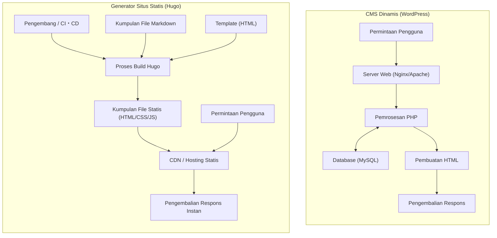
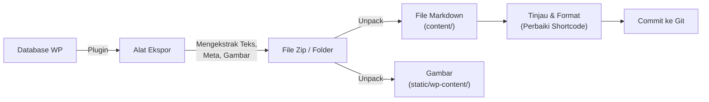

Dalam pengembangan web modern dan manajemen blog, kecepatan memuat situs, keamanan, dan pemeliharaan merupakan faktor yang sangat penting. "WordPress", yang telah lama mendominasi sebagai fondasi untuk blog dan situs perusahaan, banyak digunakan oleh pengguna karena ekosistem plugin yang fleksibel dan dasbor manajemen yang intuitif. Namun, karena ini melibatkan komunikasi dengan database dan pembuatan halaman dinamis di sisi server (pemrosesan oleh PHP), ia juga memiliki masalah seperti kerentanan terhadap lonjakan lalu lintas yang tiba-tiba dan penundaan tampilan (latensi).

Oleh karena itu, dalam beberapa tahun terakhir, "Generator Situs Statis (SSG: Static Site Generator)" dengan cepat menjadi populer. Dalam artikel ini, di antara sekian banyak SSG, kita akan menggali lebih dalam tentang "**Hugo**", yang dikembangkan dengan bahasa Go dan dikenal dengan kecepatan build-nya yang luar biasa. Kita akan membahas semuanya secara menyeluruh, mulai dari perbandingan arsitektur teknis dengan CMS dinamis (Content Management System) seperti WordPress, prosedur migrasi yang konkret, evaluasi kinerja menggunakan model matematis, hingga struktur direktori spesifik Hugo dan urutan pencarian template (lookup order).

---

## 1. Perbedaan Teknis antara CMS Dinamis (WordPress) dan Generator Situs Statis (Hugo)

Dalam mekanisme penyampaian situs web, WordPress dan Hugo mengambil pendekatan yang pada dasarnya berbeda.

### 1.1 Arsitektur WordPress (Pembuatan Dinamis)
WordPress adalah contoh utama dari CMS dinamis yang menyusun halaman di sisi server setiap kali ada permintaan. Ketika seorang pengguna (browser) mengakses sebuah halaman, server web (Apache, Nginx, dll.) mengeksekusi skrip PHP dan menerbitkan kueri ke database relasional seperti MySQL (atau MariaDB). Konten yang diambil dari database (data artikel, kategori, tag, pengaturan situs, dll.) digabungkan dengan file template, dan HTML akhir dihasilkan lalu dikembalikan ke klien.

Mekanisme ini memiliki keuntungan mampu menghasilkan konten yang berbeda untuk setiap pengunjung secara real-time (misalnya: keranjang belanja di situs e-commerce, halaman khusus pengguna yang masuk), tetapi kecuali jika mekanisme caching (reverse proxy, plugin, dll.) dirancang dengan tepat, ini akan menghabiskan sumber daya server secara drastis.

### 1.2 Arsitektur Hugo (Pra-pembuatan saat Build)
Di sisi lain, seperti namanya "generator situs statis", Hugo menghasilkan konten saat "build", bukan saat "permintaan (request)". Konten tidak disimpan dalam database, melainkan dikelola sebagai "file Markdown" lokal yang dikontrol versinya dengan Git atau sejenisnya.
Saat pengembang menjalankan perintah (`hugo`), Hugo membaca file Markdown, menuangkan data ke dalam template HTML (file layout) yang ditentukan, dan menghasilkan sekumpulan file HTML/CSS/JS murni yang telah selesai.

Kumpulan file yang dihasilkan (aset statis) dapat didistribusikan hanya dengan menempatkannya di "lingkungan hosting statis" seperti Amazon S3, Cloudflare Pages, Netlify, Vercel, atau server Nginx sederhana. Karena tidak ada database atau bahasa sisi server (seperti PHP) yang diperlukan, risiko keamanan (injeksi SQL, kerentanan PHP, dll.) berkurang secara drastis, dan kecepatan distribusi dimaksimalkan hingga batasnya karena di-cache pada node edge CDN (Content Delivery Network).

Perbedaan arsitektur masing-masing ditunjukkan pada diagram Mermaid di bawah ini.



---

## 2. Evaluasi Kinerja Menggunakan Model Matematis

Salah satu keuntungan terbesar bermigrasi dari WordPress ke Hugo adalah peningkatan kinerja (kecepatan tampilan). Untuk memahami ini secara kuantitatif, mari kita nyatakan dengan model matematika sederhana.

Waktu hingga pemuatan halaman selesai (Load Time: $T_{load}$) pada dasarnya dibagi menjadi waktu respons server (TTFB: Time To First Byte) dan waktu rendering serta pengambilan sumber daya oleh browser ($T_{render}$).

$$ T_{load} = T_{ttfb} + T_{render} $$

Dalam kasus CMS dinamis (WordPress), $T_{ttfb}$ adalah jumlah dari elemen-elemen berikut: Penundaan jaringan ($T_{network}$), waktu eksekusi skrip di sisi server ($T_{php}$), dan waktu pemrosesan kueri database ($T_{db}$).

$$ T_{ttfb\_wp} = T_{network} + T_{php} + T_{db} $$

Dalam kondisi di mana akses terkonsentrasi (beban tinggi), $T_{php}$ dan $T_{db}$ meningkat secara non-linier, dan seluruh sistem dapat menjadi leher botol (bottleneck). Dinyatakan dalam rumus, penurunan waktu respons berikut terjadi sehubungan dengan jumlah permintaan ($N$) (dengan $k$ adalah koefisien overhead pemrosesan).

$$ T_{php}(N) \approx O(N^k), \quad T_{db}(N) \approx O(N^k) \quad \text{where } k > 1 $$

Di sisi lain, dalam arsitektur yang menggabungkan generator situs statis (Hugo) dan CDN, tidak ada pemrosesan dinamis di sisi server (PHP atau kueri DB). Karena konten di-cache di server edge yang didistribusikan di seluruh dunia, $T_{ttfb}$ murni hanya bergantung pada latensi jaringan ($T_{edge}$) dari klien ke server edge terdekat.

$$ T_{ttfb\_hugo} = T_{edge} $$

Sebagai hasilnya, $T_{edge} \ll (T_{network} + T_{php} + T_{db})$ berlaku, dan TTFB dipersingkat secara dramatis dari beberapa milidetik hingga sekitar puluhan milidetik. Selain itu, bahkan jika jumlah permintaan $N$ meningkat, fungsi penyeimbangan beban dari server edge menjaga waktu respons tetap konstan ($O(1)$).

$$ \lim_{N \to \infty} T_{ttfb\_hugo}(N) \approx \text{Constant} $$

Inilah dasar matematis mengapa Hugo (situs statis) sangat kuat terhadap lonjakan lalu lintas (misalnya, ketika menjadi viral).

---

## 3. Struktur Dasar dan Prinsip Kerja Hugo

Untuk menguasai Hugo, penting untuk memahami struktur direktorinya yang unik dan konsep "Front Matter" serta "Template Lookup Order".

### 3.1 Penjelasan Rinci tentang Struktur Direktori

Ketika Anda membuat proyek Hugo baru (`hugo new site mysite`), struktur direktori berikut akan dihasilkan.

```text
mysite/
├── archetypes/   # Template untuk pembuatan konten baru (kerangka Front Matter)
├── assets/       # File yang akan diproses oleh Hugo Pipes (SCSS/Sass, JavaScript, dll.)
├── content/      # Konten situs sebenarnya (kumpulan file Markdown). Ini menggantikan DB.
├── data/         # Data eksternal dan pengaturan yang digunakan di seluruh situs (JSON, TOML, YAML, CSV, dll.)
├── layouts/      # Kumpulan template HTML yang menentukan tampilan situs (menggunakan Go html/template)
├── public/       # Tempat output file statis yang dihasilkan setelah menjalankan perintah build
├── static/       # File statis yang dipublikasikan apa adanya (gambar, favicon, teks untuk robot, dll.)
├── themes/       # Direktori tema pihak ketiga atau buatan sendiri
└── hugo.toml     # File konfigurasi seluruh situs (sebelumnya config.toml yang utama)
```

Dalam WordPress, konten disimpan dalam tabel `wp_posts` MySQL, tetapi di Hugo, semuanya dikelola sebagai file teks (terutama Markdown) di dalam direktori `content/`. Hal ini memudahkan pengelolaan versi konten (Git).

### 3.2 Manajemen Konten: Markdown dan Front Matter

Setiap file artikel di Hugo memiliki blok metadata yang disebut "Front Matter" di bagian paling atas, diikuti oleh teks utama (Markdown) di bawahnya. Front Matter dapat ditulis dalam format TOML, YAML, atau JSON, tetapi YAML adalah yang paling banyak digunakan.

```yaml
---
title: "Memahami Taksonomi Hugo"
date: 2026-09-13T10:00:00+09:00
draft: false
categories:
  - "Penjelasan Teknis"
tags:
  - "Hugo"
  - "Go"
aliases:
  - "/old-category/hugo-taxonomy/"
---
Dari sini adalah teks utamanya. Ditulis dalam **Markdown**.
Saya akan menjelaskan fitur-fitur canggih dari Hugo...
```

Yang patut diperhatikan di sini adalah kunci `aliases`. Saat bermigrasi dari WordPress, jika permalink (URL) berubah, itu akan menjadi kerugian besar untuk SEO. Dengan menggunakan fungsi alias Hugo, hanya dengan menentukan URL lama, Hugo secara otomatis akan menghasilkan HTML untuk pengalihan (transfer oleh meta refresh). Sangat mudah karena pengaturan pengalihan sisi server (seperti .htaccess) tidak lagi diperlukan.

### 3.3 Urutan Pencarian Template (Template Lookup Order)

Salah satu fitur paling kuat dari Hugo adalah mekanisme pencarian template yang fleksibel (Template Lookup Order). Saat me-render halaman tertentu, Hugo mencari direktori dan nama file dalam urutan tertentu untuk menemukan template yang paling cocok.

Sebagai contoh, ketika menggambar artikel tunggal (Single Page) seperti `content/post/hello-world.md`, Hugo umumnya mencari file layout dengan urutan sebagai berikut.

1. `layouts/post/single.html`
2. `layouts/post/list.html` (Tidak salah, tetapi biasanya untuk daftar)
3. `layouts/_default/single.html`
4. `themes/<NAMA_TEMA>/layouts/post/single.html`
5. `themes/<NAMA_TEMA>/layouts/_default/single.html`

Pengembang dapat **menimpa (override)** template tema hanya dengan membuat file dengan nama yang sama di direktori `layouts/` milik proyek mereka sendiri tanpa mengubah kode sumber tema secara langsung. Hal ini memungkinkan penyesuaian (kustomisasi) unik tanpa menghalangi pembaruan tema dasar.

### 3.4 Taksonomi (Taxonomy)

Sistem klasifikasi yang setara dengan "Kategori" dan "Tag" di WordPress disebut "Taksonomi (Taxonomy)" di Hugo.
Secara default, Hugo mendukung taksonomi `categories` dan `tags`, tetapi dengan mengedit `hugo.toml`, Anda dapat dengan bebas menambahkan taksonomi kustom (misalnya: `series`, `authors`, dll.).

```toml
# Contoh hugo.toml
[taxonomies]
  category = "categories"
  tag = "tags"
  series = "series"
  author = "authors"
```

Ini memungkinkan Anda untuk mengatur dan membuat daftar konten dari berbagai sudut pandang.

---

## 4. Proses Migrasi dari WordPress ke Hugo (Migration)

Dalam migrasi dari WordPress ke Hugo, kunci suksesnya adalah bagaimana mengubah konten dinamis dalam database menjadi file statis yang bersih (Markdown + Front Matter) serta mempertahankan struktur URL yang ada.

Berikut adalah alur pipeline migrasi secara umum.



### 4.1 Ekstraksi Data dan Konversi ke Markdown

Untuk mengeluarkan data WordPress untuk Hugo, cara termudah dan paling dapat diandalkan adalah dengan menggunakan plugin khusus. Berikut ini beberapa pendekatan yang umum digunakan.

1. **Menggunakan plugin Jekyll Exporter**
   Karena Hugo memiliki struktur data yang sangat mirip dengan Jekyll (yang juga merupakan SSG), merupakan metode umum untuk menggunakan plugin "Jekyll Exporter" untuk WordPress. Saat Anda menginstal dan menjalankan plugin ini, semua postingan dan halaman statis akan diubah menjadi file Markdown dengan Front Matter, dan dapat diunduh sebagai file ZIP bersama dengan kumpulan file gambar.
2. **Skrip buatan sendiri menggunakan API WordPress**
   Ini adalah metode untuk membuat skrip sendiri menggunakan Python atau Node.js dll. untuk memanggil REST API WordPress (`/wp-json/wp/v2/posts`), mengurai data JSON, dan membuat file Markdown sendiri. Ini efektif untuk situs yang banyak menggunakan bidang khusus kompleks (seperti ACF) yang tidak dapat ditangani oleh plugin.
3. **Memanfaatkan alat wp2hugo**
   Ada juga pendekatan yang menggunakan alat CLI yang ditulis dalam bahasa Go dll. untuk mengubah secara langsung dari file XML ekspor WordPress (WXR) ke format Hugo.

### 4.2 Mempertahankan Struktur Permalink (URL)

Sangat penting untuk mempertahankan URL dari era WordPress apa adanya demi melanjutkan evaluasi SEO. Jika Anda menggunakan pengaturan permalink seperti `https://example.com/2026/09/13/my-post/` di WordPress, tentukan struktur permalink di `hugo.toml` Hugo.

```toml
[permalinks]
  post = "/:year/:month/:day/:slug/"
```

Atau, dimungkinkan juga untuk menetapkan URL secara paksa dengan menentukan parameter `url` secara langsung di dalam Front Matter untuk setiap artikel.
Lebih lanjut, untuk halaman yang URL-nya berubah, siapkan pengalihan (redirect) menggunakan `aliases` yang disebutkan sebelumnya.

### 4.3 Konversi Shortcode

Shortcode khusus WordPress (contoh: `[gallery]`, `[caption]`, kode unik dari berbagai plugin) sering kali tertinggal dalam bentuk string aslinya saat diekspor, sehingga perlu ditangani.
Ini dapat dihapus sekaligus menggunakan skrip pengganti (sed atau Python), atau dipindahkan sehingga dirender dengan benar di sisi Hugo dengan memanfaatkan **fitur shortcode kustom** Hugo yang kuat (membuat tata letak (layout) sendiri di dalam `layouts/shortcodes/`).

---

## 5. Alat CLI Hugo serta Proses Build dan Deploy

Setelah proses migrasi selesai, saatnya menggunakan Hugo untuk mem-build situs dan mempublikasikannya ke dunia. Tersedia sebagai biner bahasa Go, Hugo menawarkan kecepatan yang luar biasa, mampu menyelesaikan build hanya dalam beberapa detik bahkan untuk situs dengan ribuan hingga puluhan ribu halaman.

### 5.1 Memulai Server untuk Pengembangan Lokal

Saat menulis artikel atau menyesuaikan desain, mulai server lokal.

```bash
# Perintah untuk memulai server pengembangan (gunakan -D untuk menyertakan artikel Draft)
hugo server -D
```

Saat Anda menjalankan perintah ini, situs akan dapat dipratinjau di `http://localhost:1313/`. Hugo memiliki fitur "LiveReload" bawaan yang kuat; begitu Anda mengedit dan menyimpan file Markdown, template, atau CSS, layar browser akan secara otomatis diperbarui dengan sangat cepat. Oleh karena itu, pengalaman menulis dan mengembangkan jauh lebih nyaman daripada dasbor manajemen WordPress.

### 5.2 Build untuk Produksi dan Optimasi Kinerja

Untuk menghasilkan file statis untuk di-deploy ke lingkungan produksi, cukup ketik `hugo`.

```bash
# Menjalankan build produksi. Perkecil HTML/CSS/JS dengan opsi --minify
hugo --minify
```

Perintah ini menampilkan file seluruh situs ke dalam direktori `public/`. Dengan menambahkan opsi `--minify`, baris baru dan spasi yang tidak perlu akan dihapus, sehingga ukuran file akan semakin dikurangi. Ini berkontribusi langsung pada pengurangan latensi jaringan ($T_{network}$) dalam model matematika yang disebutkan sebelumnya.

### 5.3 Otomatisasi Deploy (CI/CD)

Menghasilkan file statis setiap kali di PC lokal dan mengunggahnya melalui FTP dll. tidaklah efisien. Dalam operasi SSG modern, praktik terbaik adalah membangun lingkungan CI/CD yang secara otomatis melakukan build dan deploy dengan memanfaatkan push ke repositori Git (seperti GitHub) sebagai pemicu (trigger).

Sebagai contoh, bentuk dasar pengaturan (file YAML) untuk men-deploy ke Cloudflare Pages atau GitHub Pages menggunakan GitHub Actions adalah sebagai berikut.

```yaml
# Contoh .github/workflows/hugo.yml
name: Deploy Hugo site to GitHub Pages

on:
  push:
    branches: ["main"]
  workflow_dispatch:

permissions:
  contents: read
  pages: write
  id-token: write

jobs:
  build:
    runs-on: ubuntu-latest
    steps:
      - name: Checkout
        uses: actions/checkout@v3
        with:
          submodules: recursive # Jika tema dikelola sebagai submodul
          fetch-depth: 0

      - name: Setup Hugo
        uses: peaceiris/actions-hugo@v2
        with:
          hugo-version: 'latest'
          extended: true

      - name: Build
        run: hugo --minify

      - name: Upload artifact
        uses: actions/upload-pages-artifact@v2
        with:
          path: ./public

  deploy:
    environment:
      name: github-pages
      url: ${{ steps.deployment.outputs.page_url }}
    runs-on: ubuntu-latest
    needs: build
    steps:
      - name: Deploy to GitHub Pages
        id: deployment
        uses: actions/deploy-pages@v2
```

Dengan mengatur seperti ini, pipeline otomatisasi telah selesai di mana situs terbaru dipublikasikan ke lingkungan produksi hanya dalam beberapa menit hanya dengan tindakan "menulis artikel di Markdown dan Push ke GitHub".

---

## 6. Keuntungan SEO dan Operasional setelah Migrasi

Operator situs yang telah menyelesaikan migrasi dari WordPress ke Hugo sering menyadari tiga keuntungan signifikan berikut:

### 6.1 Peningkatan Drastis pada Kecepatan Situs dan Core Web Vitals
Sebagai hasil dari penghapusan kueri database dan rendering sisi server, waktu pemuatan halaman berkurang hingga hitungan milidetik. Ini secara langsung mengarah pada peningkatan skor "Core Web Vitals" (LCP, FID/INP, CLS) yang substansial yang merupakan faktor peringkat Google. Anda dapat mengharapkan penurunan rasio pentalan (bounce rate) pengguna dan peningkatan penilaian SEO.

### 6.2 Bebas dari Ancaman Keamanan
Karena WordPress digunakan secara luas di seluruh dunia, ia sering menjadi target serangan. Selalu ada risiko kerusakan dengan memanfaatkan kerentanan plugin, maupun pembobolan login melalui serangan brute force.
Namun, situs statis yang dihasilkan oleh Hugo tidak memiliki database, tidak ada lingkungan PHP, bahkan tidak memiliki dasbor manajemen (formulir login). Tidak ada ruang bagi peretas (hacker) untuk menyusup ke server dan memodifikasi database, sehingga risiko keamanan diturunkan mendekati nol hingga batas maksimal.

### 6.3 Operasi Bebas Pemeliharaan (Maintenance-free)
Dalam menjalankan WordPress, pekerjaan pemeliharaan yang konstan sangat diperlukan, seperti memutakhirkan inti WordPress, memperbarui plugin, dan mengikuti versi PHP. Anda harus selalu khawatir akan risiko situs menjadi rusak karena masalah kompatibilitas.
Dalam kasus Hugo, alat itu sendiri hanya perlu diperbarui jika perlu, dan kode situs itu sendiri adalah kumpulan file teks independen, yang memberikan rasa aman yang luar biasa bahwa situs "tidak akan rusak bahkan jika dibiarkan".

---

## 7. Kesimpulan

Dalam artikel ini, kami telah menjelaskan secara terperinci tentang migrasi dari CMS dinamis seperti WordPress ke "Hugo", generator situs statis yang kuat berbasis bahasa Go, mulai dari perbedaan arsitektur teknis, pembuktian kinerja dengan model matematika, hingga prosedur migrasi yang spesifik.

Migrasi ke generator situs statis memang memerlukan biaya pembelajaran awal (seperti operasi Git, sintaks Markdown, menjalankan perintah CLI dari terminal, memahami spesifikasi mesin template, dll.), tetapi akan memberikan imbal hasil (return) yang lebih dari sekadar menggantikannya, seperti "kecepatan tampilan yang luar biasa", "keamanan yang tangguh", dan "bebas dari pemeliharaan".

Jika situs web Anda tidak memerlukan perubahan desain yang sering atau proses dinamis yang kompleks (seperti fungsi khusus anggota atau fitur e-commerce lanjutan) dan utamanya bertujuan untuk mendistribusikan informasi (seperti blog, media, atau situs web perusahaan), maka migrasi ke Hugo akan menjadi salah satu investasi teknis yang paling efektif. Silakan gunakan artikel ini sebagai referensi dan ambil langkah pertama menuju operasi situs web generasi berikutnya menggunakan Hugo.
