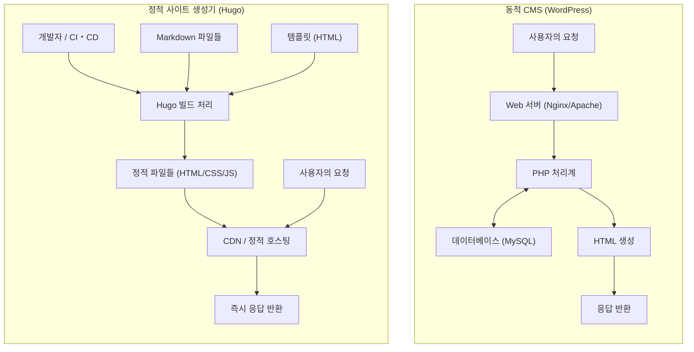
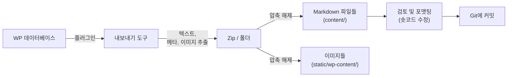

현대 웹 개발이나 블로그 운영에 있어서 사이트의 표시 속도와 보안, 그리고 유지보수성은 매우 중요한 요소가 되었습니다. 오랫동안 블로그나 기업 사이트의 기반으로서 압도적인 점유율을 자랑해 온 'WordPress'는 유연한 플러그인 생태계와 직관적인 관리 화면으로 많은 사용자에게 사랑받고 있습니다. 하지만 데이터베이스와의 통신이나 서버 사이드에서의 동적인 페이지 생성(PHP에 의한 처리)을 동반하기 때문에, 트래픽 급증에 대한 취약성이나 표시 지연(레이턴시)과 같은 과제도 안고 있습니다.

그래서 최근 급속히 보급되고 있는 것이 '정적 사이트 생성기(SSG: Static Site Generator)'입니다. 본 기사에서는 수많은 SSG 중에서도 Go 언어 기반으로 개발되어 그 압도적인 빌드 속도로 알려진 '**Hugo**'에 대해 깊이 파헤쳐 보겠습니다. WordPress 등의 동적 CMS(Content Management System)와의 기술적 아키텍처 비교부터, 구체적인 마이그레이션 절차, 수리 모델을 이용한 성능 평가, 그리고 Hugo 고유의 디렉토리 구조와 템플릿의 룩업 순서까지 철저하게 해설합니다.

---

## 1. 동적 CMS(WordPress)와 정적 사이트 생성기(Hugo)의 기술적 차이

웹사이트를 전송하는 메커니즘에 있어서, WordPress와 Hugo는 근본적으로 다른 접근 방식을 취하고 있습니다.

### 1.1 WordPress의 아키텍처 (동적 생성)
WordPress는 요청마다 서버 사이드에서 페이지를 조립하는 동적 CMS의 대표주자입니다. 사용자(브라우저)가 페이지에 접근하면 웹 서버(Apache, Nginx 등)가 PHP 스크립트를 실행하고, MySQL(또는 MariaDB) 등 관계형 데이터베이스에 쿼리를 발행합니다. 데이터베이스에서 가져온 콘텐츠(기사 데이터, 카테고리, 태그, 사이트 설정 등)를 템플릿 파일과 결합하여 최종 HTML을 생성하고 클라이언트에게 반환합니다.

이 메커니즘은 방문자마다 다른 콘텐츠를 실시간으로 생성할 수 있다는(예: EC 사이트의 장바구니, 로그인 사용자 전용 페이지) 장점이 있지만, 캐시 메커니즘(리버스 프록시나 플러그인 등)을 적절히 설계하지 않는 한 서버 리소스를 격렬하게 소비합니다.

### 1.2 Hugo의 아키텍처 (빌드 시 사전 생성)
반면, Hugo는 '정적 사이트 생성기'라는 이름 그대로 콘텐츠의 생성을 '요청 시'가 아닌 '빌드 시'에 수행합니다. 콘텐츠는 데이터베이스가 아니라 Git 등으로 버전 관리되는 로컬 'Markdown 파일'로 유지됩니다.
개발자가 명령어(`hugo`)를 실행하면, Hugo는 Markdown 파일을 읽어 들여 지정된 HTML 템플릿(레이아웃 파일)에 데이터를 흘려넣고, 완성된 순수 HTML/CSS/JS 파일의 집합체를 생성합니다.

생성된 파일들(정적 에셋)은 Amazon S3, Cloudflare Pages, Netlify, Vercel, 혹은 단순한 Nginx 서버 등의 '정적 호스팅 환경'에 배치하는 것만으로 배포 가능해집니다. 데이터베이스도 서버 사이드 언어(PHP 등)도 필요 없기 때문에, 보안 위험(SQL 인젝션이나 PHP의 취약점 등)이 극적으로 감소하고, 배포 속도는 CDN(Content Delivery Network)의 에지 노드에 캐시됨으로써 극한까지 고속화됩니다.

아래에 각각의 아키텍처 차이를 Mermaid 다이어그램으로 나타냅니다.



---

## 2. 수리 모델을 통한 성능 평가

WordPress에서 Hugo로의 마이그레이션에 있어서 가장 큰 이점 중 하나는 성능(표시 속도)의 향상입니다. 이를 정량적으로 이해하기 위해, 간단한 수식 모델로 표현해 봅시다.

페이지 로딩이 완료될 때까지의 시간(Load Time: $T_{load}$)은 크게 서버의 응답 시간(TTFB: Time To First Byte)과 브라우저에 의한 렌더링 및 리소스 취득 시간($T_{render}$)으로 나눌 수 있습니다.

$$ T_{load} = T_{ttfb} + T_{render} $$

동적 CMS(WordPress)의 경우, $T_{ttfb}$ 는 다음 요소들의 합이 됩니다. 네트워크 지연($T_{network}$), 서버 측의 스크립트 실행 시간($T_{php}$), 데이터베이스의 쿼리 처리 시간($T_{db}$)입니다.

$$ T_{ttfb\_wp} = T_{network} + T_{php} + T_{db} $$

접속이 집중된 상태(고부하 시)에서는 $T_{php}$ 와 $T_{db}$ 가 비선형적으로 증가하여 시스템 전체의 병목 현상이 발생할 수 있습니다. 수식으로 나타내면, 요청 수($N$)에 대해 다음과 같은 응답 시간의 악화가 나타납니다($k$ 는 처리의 오버헤드 계수).

$$ T_{php}(N) \approx O(N^k), \quad T_{db}(N) \approx O(N^k) \quad \text{where } k > 1 $$

반면, 정적 사이트 생성기(Hugo)와 CDN을 결합한 아키텍처에서는 서버 사이드의 동적 처리(PHP나 DB 쿼리)가 존재하지 않습니다. 콘텐츠는 전 세계에 분산 배치된 에지 서버에 캐시되어 있기 때문에, $T_{ttfb}$ 는 순수하게 클라이언트에서 가장 가까운 에지 서버까지의 네트워크 지연($T_{edge}$)에만 의존합니다.

$$ T_{ttfb\_hugo} = T_{edge} $$

이로 인해, $T_{edge} \ll (T_{network} + T_{php} + T_{db})$ 가 성립하며, TTFB는 수 밀리초에서 수십 밀리초 정도로 극적으로 단축됩니다. 또한, 요청 수 $N$ 이 증가하더라도 에지 서버의 부하 분산 기능에 의해 응답 시간은 거의 일정($O(1)$)하게 유지됩니다.

$$ \lim_{N \to \infty} T_{ttfb\_hugo}(N) \approx \text{Constant} $$

이것이 Hugo(정적 사이트)가 트래픽 급증(입소문을 탔을 때 등)에 대해 매우 견고한 수리적인 근거가 됩니다.

---

## 3. Hugo의 기본 구조와 동작 원리

Hugo를 마스터하기 위해서는 그 독특한 디렉토리 구조와 'Front Matter', 'Template Lookup Order'의 개념을 이해하는 것이 필수적입니다.

### 3.1 디렉토리 구조의 상세 해설

Hugo 프로젝트를 새로 생성(`hugo new site mysite`)하면 다음과 같은 디렉토리 구조가 생성됩니다.

```text
mysite/
├── archetypes/   # 신규 콘텐츠 생성 시의 템플릿 (Front Matter의 기본 틀)
├── assets/       # Hugo Pipes로 처리할 파일들 (SCSS/Sass, JavaScript 등)
├── content/      # 실제 사이트 콘텐츠 (Markdown 파일들). 이곳이 DB를 대신한다.
├── data/         # 사이트 전체에서 사용할 외부 데이터나 설정 (JSON, TOML, YAML, CSV 등)
├── layouts/      # 사이트의 외형을 결정하는 HTML 템플릿들 (Go html/template 사용)
├── public/       # 빌드 명령어 실행 후 생성된 정적 파일이 출력되는 장소
├── static/       # 있는 그대로 공개되는 정적 파일 (이미지, favicon, 로봇용 텍스트 등)
├── themes/       # 서드파티 제공, 또는 직접 만든 테마 디렉토리
└── hugo.toml     # 사이트 전체 설정 파일 (이전에는 config.toml이 주류였습니다)
```

WordPress에서는 콘텐츠가 MySQL의 `wp_posts` 테이블에 저장되지만, Hugo에서는 모두 `content/` 디렉토리 내의 텍스트 파일(주로 Markdown)로 관리됩니다. 이로 인해 콘텐츠의 버전 관리(Git)가 쉬워집니다.

### 3.2 콘텐츠 관리: Markdown과 Front Matter

Hugo의 각 기사 파일은 최상단에 'Front Matter(프런트매터)'라고 불리는 메타데이터 블록을 가지며, 그 아래에 본문(Markdown)이 이어지는 구조가 됩니다. Front Matter는 TOML, YAML, JSON 중 하나로 작성할 수 있지만, YAML이 널리 사용됩니다.

```yaml
---
title: "Hugo의 택소노미를 이해하기"
date: 2026-09-13T10:00:00+09:00
draft: false
categories:
  - "기술 해설"
tags:
  - "Hugo"
  - "Go"
aliases:
  - "/old-category/hugo-taxonomy/"
---
여기서부터가 본문입니다. **Markdown**으로 작성합니다.
Hugo의 강력한 기능에 대해 해설합니다...
```

여기서 주목해야 할 것은 `aliases` 키입니다. WordPress에서 마이그레이션할 때 퍼머링크(URL)가 바뀌어 버리면 SEO 측면에서 큰 마이너스가 됩니다. Hugo의 별칭(alias) 기능을 사용하면 이전 URL을 지정하는 것만으로 Hugo가 자동으로 리다이렉트용 HTML(meta refresh에 의한 전송)을 생성해 줍니다. 서버 측의 리다이렉트 설정(.htaccess 등)이 필요 없어지므로 매우 편리합니다.

### 3.3 템플릿 룩업 순서 (Template Lookup Order)

Hugo의 강력한 기능 중 하나가 유연한 템플릿 탐색 메커니즘(Template Lookup Order)입니다. Hugo는 특정 페이지를 렌더링할 때 최적의 템플릿을 찾기 위해 특정 순서로 디렉토리와 파일명을 검색합니다.

예를 들어, `content/post/hello-world.md` 라는 단일 기사(Single Page)를 그릴 경우, Hugo는 대략 다음의 순서로 레이아웃 파일을 찾습니다.

1. `layouts/post/single.html`
2. `layouts/post/list.html` (틀린 것은 아니지만 보통은 리스트용)
3. `layouts/_default/single.html`
4. `themes/<THEME_NAME>/layouts/post/single.html`
5. `themes/<THEME_NAME>/layouts/_default/single.html`

개발자는 테마의 소스 코드를 직접 수정하지 않고도, 자신의 프로젝트의 `layouts/` 디렉토리에 같은 이름의 파일을 만드는 것만으로 테마의 템플릿을 **덮어쓰기(오버라이드)** 할 수 있습니다. 이를 통해 기본 테마의 업데이트를 방해하지 않고 독자적인 커스터마이즈를 적용하는 것이 가능합니다.

### 3.4 택소노미 (Taxonomy)

WordPress의 '카테고리'나 '태그'에 해당하는 분류 시스템을 Hugo에서는 '택소노미(Taxonomy)'라고 부릅니다.
Hugo는 기본적으로 `categories` 와 `tags` 라는 택소노미를 지원하지만, `hugo.toml` 을 편집하여 자유롭게 커스텀 택소노미(예: `series`, `authors` 등)를 추가할 수 있습니다.

```toml
# hugo.toml의 예
[taxonomies]
  category = "categories"
  tag = "tags"
  series = "series"
  author = "authors"
```

이를 통해 다양한 축으로 콘텐츠를 정리하고 목록화하는 것이 가능해집니다.

---

## 4. WordPress에서 Hugo로의 마이그레이션 프로세스

WordPress에서 Hugo로의 마이그레이션은 데이터베이스 내의 동적 콘텐츠를 얼마나 깔끔한 정적 파일(Markdown + Front Matter)로 변환하고 기존의 URL 구조를 유지하느냐가 성공의 열쇠가 됩니다.

아래에 일반적인 마이그레이션 파이프라인의 흐름을 나타냅니다.



### 4.1 데이터의 추출과 Markdown화

WordPress의 데이터를 Hugo용으로 출력하기 위해서는 전용 플러그인을 사용하는 것이 가장 쉽고 확실합니다. 대표적인 접근 방식을 몇 가지 소개합니다.

1. **Jekyll Exporter 플러그인의 사용**
   Hugo는 같은 SSG인 Jekyll과 데이터 구조가 매우 비슷하기 때문에, WordPress용 'Jekyll Exporter' 플러그인을 사용하는 것이 일반적인 방법입니다. 이 플러그인을 설치하고 실행하면, 모든 포스트 및 고정 페이지가 Front Matter가 포함된 Markdown 파일로 변환되며, 이미지 파일들과 함께 ZIP 파일로 다운로드할 수 있습니다.
2. **WordPress API를 이용한 자체 제작 스크립트**
   Python이나 Node.js 등으로 WordPress의 REST API (`/wp-json/wp/v2/posts`) 를 호출하고 JSON 데이터를 분석하여 자체적으로 Markdown 파일을 생성하는 스크립트를 작성하는 방법입니다. 플러그인으로는 다 대응할 수 없는 복잡한 커스텀 필드(ACF 등)를 많이 사용하는 사이트에서 유효합니다.
3. **wp2hugo 도구의 활용**
   Go 언어 등으로 작성된 CLI 도구를 이용하여 WordPress의 내보내기 XML 파일(WXR)에서 직접 Hugo 형식으로 변환하는 접근법도 있습니다.

### 4.2 퍼머링크 (URL) 구조의 유지

SEO 평가를 이어받기 위해 WordPress 시절의 URL을 그대로 유지하는 것이 매우 중요합니다. WordPress에서 `https://example.com/2026/09/13/my-post/` 와 같은 퍼머링크 설정으로 되어 있었다면, Hugo의 `hugo.toml` 에서 퍼머링크 구조를 지정합니다.

```toml
[permalinks]
  post = "/:year/:month/:day/:slug/"
```

혹은 각 기사마다 Front Matter 내에서 `url` 매개변수를 직접 지정하여 URL을 강제적으로 고정하는 것도 가능합니다.
또한, URL이 변경되는 페이지에 대해서는 앞서 언급한 `aliases` 를 사용하여 리다이렉트를 설정합니다.

### 4.3 숏코드의 변환

WordPress 고유의 숏코드(예: `[gallery]`, `[caption]`, 각종 플러그인의 고유 코드)는 내보낼 때 문자열 그대로 남는 경우가 많으므로 대응이 필요합니다.
이들은 치환 스크립트(sed나 Python)를 이용하여 일괄 삭제하거나, 아니면 Hugo의 강력한 **커스텀 숏코드 기능**(`layouts/shortcodes/` 내에 독자적인 레이아웃을 생성)을 이용하여 Hugo 측에서 적절히 렌더링되도록 마이그레이션합니다.

---

## 5. Hugo의 CLI 도구와 빌드 및 배포

마이그레이션 작업이 완료되면, 드디어 Hugo를 사용하여 사이트를 빌드하고 전 세계에 공개합니다. Go 언어의 바이너리로 제공되는 Hugo는 수천에서 수만 페이지의 사이트라도 불과 몇 초 만에 빌드를 완료하는 경이로운 속도를 자랑합니다.

### 5.1 로컬 개발용 서버의 기동

기사 작성이나 디자인 조정을 할 때는 로컬 서버를 기동합니다.

```bash
# 개발 서버 기동 명령어 (Draft 기사를 포함할 경우 -D)
hugo server -D
```

이 명령어를 실행하면 `http://localhost:1313/` 에서 사이트를 미리 볼 수 있습니다. Hugo에는 강력한 'LiveReload' 기능이 내장되어 있어, Markdown 파일이나 템플릿, CSS를 편집하고 저장하는 순간 브라우저 화면이 자동으로 빠르게 갱신됩니다. 이로 인해 집필 및 개발 경험은 WordPress의 관리 화면보다 훨씬 더 쾌적해집니다.

### 5.2 운영용 빌드와 성능 최적화

운영 환경(프로덕션)에 배포하기 위한 정적 파일을 생성하려면 단순히 `hugo` 라고 입력합니다.

```bash
# 운영용 빌드 실행. --minify 옵션으로 HTML/CSS/JS를 최소화
hugo --minify
```

이 명령어에 의해 사이트 전체의 파일이 `public/` 디렉토리에 출력됩니다. `--minify` 옵션을 추가함으로써 불필요한 줄바꿈이나 공백이 삭제되어 파일 크기가 더욱 줄어듭니다. 앞서 언급한 수학적 모델에서의 네트워크 지연($T_{network}$) 감소에 직접적으로 기여합니다.

### 5.3 배포의 자동화 (CI/CD)

정적 파일의 생성을 매번 로컬 PC에서 수행하고 FTP 등으로 업로드하는 것은 비효율적입니다. 현대의 SSG 운영에서는 Git 레포지토리(GitHub 등)에 대한 푸시를 트리거로 하여, 자동으로 빌드와 배포를 수행하는 CI/CD 환경을 구축하는 것이 모범 사례(Best Practice)입니다.

예를 들어, GitHub Actions를 이용하여 Cloudflare Pages나 GitHub Pages에 배포하는 설정(YAML 파일)의 기본 형태는 다음과 같습니다.

```yaml
# .github/workflows/hugo.yml 의 예
name: Deploy Hugo site to GitHub Pages

on:
  push:
    branches: ["main"]
  workflow_dispatch:

permissions:
  contents: read
  pages: write
  id-token: write

jobs:
  build:
    runs-on: ubuntu-latest
    steps:
      - name: Checkout
        uses: actions/checkout@v3
        with:
          submodules: recursive # 테마를 서브모듈로 관리하는 경우
          fetch-depth: 0

      - name: Setup Hugo
        uses: peaceiris/actions-hugo@v2
        with:
          hugo-version: 'latest'
          extended: true

      - name: Build
        run: hugo --minify

      - name: Upload artifact
        uses: actions/upload-pages-artifact@v2
        with:
          path: ./public

  deploy:
    environment:
      name: github-pages
      url: ${{ steps.deployment.outputs.page_url }}
    runs-on: ubuntu-latest
    needs: build
    steps:
      - name: Deploy to GitHub Pages
        id: deployment
        uses: actions/deploy-pages@v2
```

이와 같이 설정함으로써, 'Markdown으로 기사를 작성하고 GitHub에 Push한다'는 동작만으로 몇 분 후에는 최신 사이트가 운영 환경에 공개되는 자동화 파이프라인이 완성됩니다.

---

## 6. 마이그레이션 후의 SEO와 운영 측면의 이점

WordPress에서 Hugo로의 마이그레이션을 완료한 사이트 운영자는 대부분 다음과 같은 3가지 현저한 이점을 체감합니다.

### 6.1 사이트 속도와 Core Web Vitals의 극적인 향상
데이터베이스 쿼리나 서버 사이드 렌더링이 배제된 결과, 페이지 로드 시간은 밀리초 단위까지 단축됩니다. 이는 Google의 랭킹 요소인 'Core Web Vitals'(LCP, FID/INP, CLS) 점수의 대폭적인 향상으로 직결됩니다. 사용자의 이탈률 감소와 SEO 평가의 향상을 기대할 수 있습니다.

### 6.2 보안 위협으로부터의 해방
WordPress는 전 세계에서 널리 사용되기 때문에 항상 공격 대상이 됩니다. 플러그인의 취약점을 악용한 변조나 무차별 대입 공격(Brute-force attack)에 의한 로그인 돌파 등의 위험이 따라다닙니다.
하지만 Hugo로 생성된 정적 사이트에는 데이터베이스도 PHP 환경도, 관리 화면(로그인 폼)조차 존재하지 않습니다. 해커가 서버에 침입해 데이터베이스를 변조할 여지가 없어, 보안 위험은 극한까지 0에 가까워집니다.

### 6.3 유지보수가 필요 없는 운영
WordPress의 운영에서는 본체의 버전 업, 플러그인 업데이트, PHP 버전 추적 등 끊임없는 유지보수 작업이 필요합니다. 호환성 문제로 사이트가 망가질 위험에 항상 불안해해야 합니다.
Hugo의 경우, 도구 자체의 업데이트는 필요에 따라 수행하면 될 뿐이며, 사이트의 코드 자체는 독립된 텍스트 파일들이기 때문에 '방치해 두어도 망가지지 않는다'는 압도적인 안심감이 있습니다.

---

## 7. 정리

본 기사에서는 WordPress와 같은 동적 CMS에서 Go 언어 기반의 강력한 정적 사이트 생성기 'Hugo'로의 마이그레이션에 대해, 기술적인 아키텍처의 차이부터 수학적 모델을 통한 성능 증명, 그리고 구체적인 마이그레이션 절차까지 자세히 해설했습니다.

정적 사이트 생성기로의 마이그레이션은 초기 학습 비용(Git 조작, Markdown 표기법, 터미널에서의 CLI 명령어 실행, 템플릿 엔진의 사양 이해 등)이 필요하지만, 그것을 보상하고도 남을 만큼의 '압도적인 표시 속도', '강력한 보안', 그리고 '유지보수 불필요'라는 이점을 가져다줍니다.

만약 당신의 웹사이트가 빈번한 디자인 변경이나 복잡한 동적 처리(회원 전용 기능이나 고도화된 EC 기능 등)를 필요로 하지 않고 주로 정보 발신(블로그, 미디어, 기업 사이트)을 목적으로 하고 있다면, Hugo로의 마이그레이션은 가장 효과적인 기술적 투자 중 하나가 될 것입니다. 부디 본 기사를 참고하여 Hugo를 활용한 차세대 웹사이트 운영으로의 첫걸음을 내디뎌 보시기 바랍니다.
