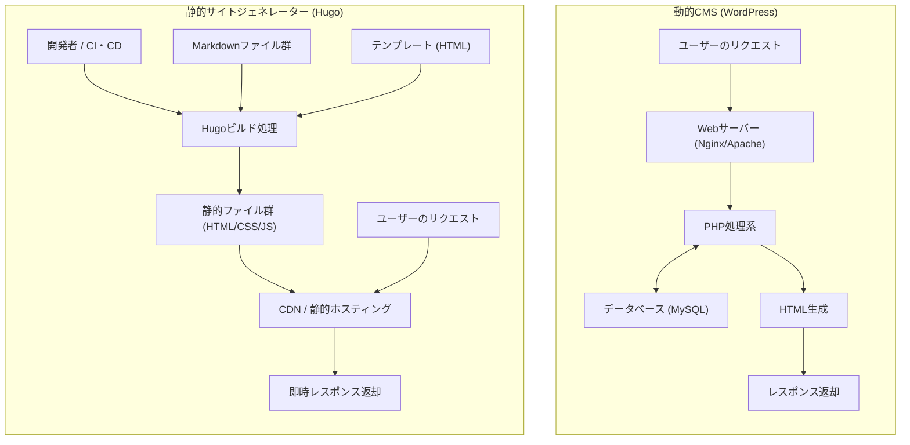
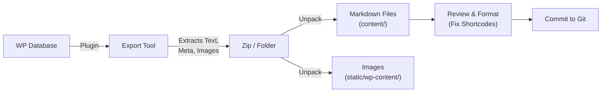

現代のウェブ開発やブログ運営において、サイトの表示速度とセキュリティ、そして保守性は極めて重要な要素となっています。長らくブログやコーポレートサイトの基盤として圧倒的なシェアを誇ってきた「WordPress」は、柔軟なプラグインエコシステムと直感的な管理画面により多くのユーザーに愛用されています。しかし、データベースとの通信やサーバーサイドでの動的なページ生成（PHPによる処理）を伴うため、トラフィックの急増に対する脆弱性や、表示遅延（レイテンシ）といった課題も抱えています。

そこで近年、急速に普及しているのが「静的サイトジェネレーター（SSG: Static Site Generator）」です。本記事では、数あるSSGの中でもGo言語ベースで開発され、その圧倒的なビルド速度で知られる「**Hugo**」について深く掘り下げます。WordPressなどの動的CMS（Content Management System）との技術的アーキテクチャの比較から、具体的な移行手順、数理モデルを用いたパフォーマンス評価、そしてHugo固有のディレクトリ構造やテンプレートのルックアップ順序まで、徹底的に解説します。

---

## 1. 動的CMS（WordPress）と静的サイトジェネレーター（Hugo）の技術的差異

ウェブサイトを配信する仕組みにおいて、WordPressとHugoは根本的に異なるアプローチをとっています。

### 1.1 WordPressのアーキテクチャ（動的生成）
WordPressは、リクエストのたびにサーバーサイドでページを組み立てる動的CMSの代表格です。ユーザー（ブラウザ）からページへのアクセスがあると、ウェブサーバー（Apache, Nginxなど）がPHPスクリプトを実行し、MySQL（またはMariaDB）などのリレーショナルデータベースへクエリを発行します。データベースから取得したコンテンツ（記事データ、カテゴリ、タグ、サイト設定など）をテンプレートファイルと結合し、最終的なHTMLを生成してクライアントに返却します。

この仕組みは、訪問者ごとに異なるコンテンツをリアルタイムで生成できる（例：ECサイトのカート、ログインユーザー専用ページ）という利点がありますが、キャッシュ機構（リバースプロキシやプラグイン等）を適切に設計しない限り、サーバーリソースを激しく消費します。

### 1.2 Hugoのアーキテクチャ（ビルド時事前生成）
一方、Hugoは「静的サイトジェネレーター」という名前の通り、コンテンツの生成を「リクエスト時」ではなく「ビルド時」に行います。コンテンツはデータベースではなく、Gitなどでバージョン管理されるローカルの「Markdownファイル」として保持されます。
開発者がコマンド（`hugo`）を実行すると、HugoはMarkdownファイルを読み込み、指定されたHTMLテンプレート（レイアウトファイル）にデータを流し込んで、完成された純粋なHTML/CSS/JSファイルの集合体を生成します。

生成されたファイル群（静的アセット）は、Amazon S3、Cloudflare Pages、Netlify、Vercel、あるいは単純なNginxサーバーなどの「静的ホスティング環境」に配置するだけで配信可能となります。データベースもサーバーサイド言語（PHP等）も不要なため、セキュリティリスク（SQLインジェクションやPHPの脆弱性など）が劇的に低下し、配信速度はCDN（Content Delivery Network）のエッジノードにキャッシュされることで極限まで高速化されます。

以下に、それぞれのアーキテクチャの違いをMermaid図で示します。



---

## 2. 数理モデルによるパフォーマンス評価

WordPressからHugoへの移行における最大のメリットの一つはパフォーマンス（表示速度）の向上です。これを定量的に理解するために、簡単な数式モデルで表現してみましょう。

ページの読み込みが完了するまでの時間（Load Time: $T_{load}$）は、主にサーバーの応答時間（TTFB: Time To First Byte）と、ブラウザによるレンダリング・リソース取得時間（$T_{render}$）に大別されます。

$$ T_{load} = T_{ttfb} + T_{render} $$

動的CMS（WordPress）の場合、$T_{ttfb}$ は以下の要素の和になります。ネットワーク遅延（$T_{network}$）、サーバー側のスクリプト実行時間（$T_{php}$）、データベースのクエリ処理時間（$T_{db}$）です。

$$ T_{ttfb\_wp} = T_{network} + T_{php} + T_{db} $$

アクセスが集中した状態（高負荷時）においては、$T_{php}$ と $T_{db}$ は非線形に増加し、システム全体がボトルネックとなる可能性があります。数式で表すと、リクエスト数（$N$）に対して以下のような応答時間の悪化が見られます（$k$ は処理のオーバーヘッド係数）。

$$ T_{php}(N) \approx O(N^k), \quad T_{db}(N) \approx O(N^k) \quad \text{where } k > 1 $$

一方、静的サイトジェネレーター（Hugo）とCDNを組み合わせたアーキテクチャでは、サーバーサイドの動的処理（PHPやDBクエリ）が存在しません。コンテンツは世界中に分散配置されたエッジサーバーにキャッシュされているため、$T_{ttfb}$ は純粋にクライアントから最も近いエッジサーバーまでのネットワーク遅延（$T_{edge}$）のみに依存します。

$$ T_{ttfb\_hugo} = T_{edge} $$

これにより、$T_{edge} \ll (T_{network} + T_{php} + T_{db})$ が成立し、TTFBは数ミリ秒から数十ミリ秒程度へと劇的に短縮されます。また、リクエスト数 $N$ が増加してもエッジサーバーの負荷分散機能により応答時間はほぼ一定（$O(1)$）を保ちます。

$$ \lim_{N \to \infty} T_{ttfb\_hugo}(N) \approx \text{Constant} $$

これが、Hugo（静的サイト）がトラフィックのスパイク（バズった時など）に対して極めて堅牢である数理的な根拠となります。

---

## 3. Hugoの基本構造と動作原理

Hugoをマスターするためには、その独特なディレクトリ構造と、「Front Matter」「Template Lookup Order」の概念を理解することが不可欠です。

### 3.1 ディレクトリ構造の詳細解説

Hugoプロジェクトを新規作成（`hugo new site mysite`）すると、以下のようなディレクトリ構造が生成されます。

```text
mysite/
├── archetypes/   # 新規コンテンツ作成時のテンプレート（Front Matterの雛形）
├── assets/       # Hugo Pipesで処理するファイル群（SCSS/Sass, JavaScriptなど）
├── content/      # 実際のサイトコンテンツ（Markdownファイル群）。ここがDBの代わりとなる。
├── data/         # サイト全体で利用する外部データや設定（JSON, TOML, YAML, CSVなど）
├── layouts/      # サイトの見た目を決定するHTMLテンプレート群（Go html/templateを利用）
├── public/       # ビルドコマンド実行後に生成された静的ファイルが出力される場所
├── static/       # そのままの形で公開される静的ファイル（画像、favicon、ロボット用テキストなど）
├── themes/       # サードパーティ製、または自作のテーマディレクトリ
└── hugo.toml     # サイト全体の設定ファイル（以前は config.toml が主流でした）
```

WordPressにおいては、コンテンツはMySQLの `wp_posts` テーブルに格納されますが、Hugoでは全て `content/` ディレクトリ内のテキストファイル（主にMarkdown）として管理されます。これにより、コンテンツのバージョン管理（Git）が容易になります。

### 3.2 コンテンツ管理：MarkdownとFront Matter

Hugoの各記事ファイルは、最上部に「Front Matter（フロントマター）」と呼ばれるメタデータのブロックを持ち、その下に本文（Markdown）が続く構成となります。Front MatterはTOML, YAML, JSONのいずれかで記述できますが、YAMLが広く使われています。

```yaml
---
title: "Hugoのタクソノミーを理解する"
date: 2026-09-13T10:00:00+09:00
draft: false
categories:
  - "技術解説"
tags:
  - "Hugo"
  - "Go"
aliases:
  - "/old-category/hugo-taxonomy/"
---
ここからが本文です。**Markdown**で記述します。
Hugoの強力な機能について解説します...
```

ここで注目すべきは `aliases` キーです。WordPressから移行する際、パーマリンク（URL）が変わってしまうとSEO的に大きなマイナスとなります。Hugoのエイリアス機能を使えば、旧URLを指定するだけで、Hugoが自動的にリダイレクト用のHTML（meta refreshによる転送）を生成してくれます。サーバー側のリダイレクト設定（.htaccessなど）が不要になるため、非常に便利です。

### 3.3 テンプレートのルックアップ順序（Template Lookup Order）

Hugoの強力な機能の一つが、柔軟なテンプレート探索機構（Template Lookup Order）です。Hugoは特定のページをレンダリングする際、最適なテンプレートを見つけるために特定の順序でディレクトリとファイル名を検索します。

例えば、`content/post/hello-world.md` という単一の記事（Single Page）を描画する場合、Hugoは概ね以下の順序でレイアウトファイルを探します。

1. `layouts/post/single.html`
2. `layouts/post/list.html` （誤りではありませんが、通常はリスト用）
3. `layouts/_default/single.html`
4. `themes/<THEME_NAME>/layouts/post/single.html`
5. `themes/<THEME_NAME>/layouts/_default/single.html`

開発者はテーマのソースコードを直接書き換えることなく、自身のプロジェクトの `layouts/` ディレクトリに同じ名前のファイルを作成するだけで、テーマのテンプレートを**上書き（オーバーライド）**することができます。これにより、ベースとなるテーマのアップデートを阻害することなく、独自のカスタマイズを施すことが可能です。

### 3.4 タクソノミー（Taxonomy）

WordPressの「カテゴリー」や「タグ」に相当する分類システムを、Hugoでは「タクソノミー（Taxonomy）」と呼びます。
Hugoはデフォルトで `categories` と `tags` というタクソノミーをサポートしていますが、`hugo.toml` を編集することで、自由にカスタムタクソノミー（例：`series`, `authors` など）を追加できます。

```toml
# hugo.tomlの例
[taxonomies]
  category = "categories"
  tag = "tags"
  series = "series"
  author = "authors"
```

これにより、多様な軸でコンテンツを整理・一覧化することが可能になります。

---

## 4. WordPressからHugoへの移行プロセス（マイグレーション）

WordPressからHugoへの移行は、データベース内の動的コンテンツをいかにクリーンな静的ファイル（Markdown + Front Matter）に変換し、既存のURL構造を維持するかが成功の鍵となります。

以下に、一般的な移行パイプラインのフローを示します。



### 4.1 データの抽出とMarkdown化

WordPressのデータをHugo用に出力するためには、専用のプラグインを使用するのが最も簡単で確実です。代表的なアプローチをいくつか紹介します。

1. **Jekyll Exporterプラグインの利用**
   Hugoは同じSSGであるJekyllとデータ構造が非常に似ているため、WordPress用の「Jekyll Exporter」プラグインを使用するのが一般的な手法です。このプラグインをインストールして実行すると、すべての投稿・固定ページがFront Matter付きのMarkdownファイルに変換され、画像ファイル群と共にZIPファイルとしてダウンロードできます。
2. **WordPress APIを利用した自作スクリプト**
   PythonやNode.js等でWordPressのREST API (`/wp-json/wp/v2/posts`) を叩き、JSONデータを解析して自前でMarkdownファイルを生成するスクリプトを作成する方法です。プラグインでは対応しきれない複雑なカスタムフィールド（ACF等）を多用しているサイトで有効です。
3. **wp2hugo ツールの活用**
   Go言語などで書かれたCLIツールを利用して、WordPressのエクスポートXMLファイル（WXR）から直接Hugo形式へ変換するアプローチもあります。

### 4.2 パーマリンク（URL）構造の維持

SEOの評価を引き継ぐため、WordPress時代のURLをそのまま維持することが極めて重要です。WordPressで `https://example.com/2026/09/13/my-post/` のようなパーマリンク設定にしていた場合、Hugoの `hugo.toml` でパーマリンクの構造を指定します。

```toml
[permalinks]
  post = "/:year/:month/:day/:slug/"
```

あるいは、記事ごとにFront Matter内で `url` パラメータを直接指定して、URLを強制的に固定することも可能です。
さらに、URLが変わるページについては、前述の `aliases` を使用してリダイレクトを設定します。

### 4.3 ショートコードの変換

WordPress固有のショートコード（例：`[gallery]`, `[caption]`, 各種プラグインの独自コード）は、エクスポート時にそのままの文字列で残ってしまうことが多いため、対応が必要です。
これらは、置換スクリプト（sedやPython）を用いて一括削除するか、あるいはHugoの強力な**カスタムショートコード機能**（`layouts/shortcodes/` 内に独自レイアウトを作成）を利用して、Hugo側で適切にレンダリングされるように移行します。

---

## 5. HugoのCLIツールとビルド・デプロイ

移行作業が完了したら、いよいよHugoを用いてサイトをビルドし、世界へ向けて公開します。Go言語のバイナリとして提供されるHugoは、数千から数万ページのサイトであってもわずか数秒でビルドを完了する驚異的な速度を誇ります。

### 5.1 ローカル開発用サーバーの起動

記事の執筆やデザインの調整を行う際は、ローカルサーバーを起動します。

```bash
# 開発サーバーの起動コマンド（Draft記事を含める場合は -D）
hugo server -D
```

このコマンドを実行すると、`http://localhost:1313/` でサイトがプレビュー可能になります。Hugoには強力な「LiveReload」機能が内蔵されており、Markdownファイルやテンプレート、CSSを編集して保存した瞬間に、ブラウザの画面が自動的に高速更新されます。これにより、執筆・開発体験はWordPressの管理画面よりも遥かに快適なものになります。

### 5.2 本番用ビルドとパフォーマンス最適化

本番環境にデプロイするための静的ファイルを生成するには、単に `hugo` と打ち込みます。

```bash
# 本番用ビルドの実行。--minifyオプションでHTML/CSS/JSを最小化
hugo --minify
```

このコマンドにより、サイト全体のファイルが `public/` ディレクトリに出力されます。`--minify` オプションを付与することで、不要な改行やスペースが削除され、ファイルサイズがさらに削減されます。前述した数学モデルにおけるネットワーク遅延（$T_{network}$）の削減に直接寄与します。

### 5.3 デプロイの自動化（CI/CD）

静的ファイルの生成を毎回ローカルのPCで行い、FTP等でアップロードするのは非効率的です。現代のSSG運用では、Gitリポジトリ（GitHub等）へのプッシュをトリガーとして、自動的にビルドとデプロイを行うCI/CD環境を構築するのがベストプラクティスです。

例えば、GitHub Actionsを利用してCloudflare PagesやGitHub Pagesへデプロイする設定（YAMLファイル）の基本形は以下のようになります。

```yaml
# .github/workflows/hugo.yml の例
name: Deploy Hugo site to GitHub Pages

on:
  push:
    branches: ["main"]
  workflow_dispatch:

permissions:
  contents: read
  pages: write
  id-token: write

jobs:
  build:
    runs-on: ubuntu-latest
    steps:
      - name: Checkout
        uses: actions/checkout@v3
        with:
          submodules: recursive # テーマをサブモジュールで管理している場合
          fetch-depth: 0

      - name: Setup Hugo
        uses: peaceiris/actions-hugo@v2
        with:
          hugo-version: 'latest'
          extended: true

      - name: Build
        run: hugo --minify

      - name: Upload artifact
        uses: actions/upload-pages-artifact@v2
        with:
          path: ./public

  deploy:
    environment:
      name: github-pages
      url: ${{ steps.deployment.outputs.page_url }}
    runs-on: ubuntu-latest
    needs: build
    steps:
      - name: Deploy to GitHub Pages
        id: deployment
        uses: actions/deploy-pages@v2
```

このように設定することで、「Markdownで記事を書いてGitHubへPushする」というアクションだけで、数分後には最新のサイトが本番環境へ公開される自動化パイプラインが完成します。

---

## 6. 移行後のSEOと運用面のメリット

WordPressからHugoへの移行を完了したサイト運営者は、多くの場合、以下の3つの顕著なメリットを実感します。

### 6.1 サイトスピードとCore Web Vitalsの劇的な向上
データベースクエリやサーバーサイドのレンダリングが排除された結果、ページのロード時間はミリ秒単位まで短縮されます。これはGoogleのランキング要因である「Core Web Vitals」（LCP, FID/INP, CLS）スコアの大幅な向上に直結します。ユーザーの直帰率の低下と、SEO評価の向上が期待できます。

### 6.2 セキュリティ脅威からの解放
WordPressは世界中で広く使われているため、常に攻撃対象となっています。プラグインの脆弱性を突かれた改ざんや、ブルートフォース攻撃によるログイン突破などのリスクがつきまといます。
しかし、Hugoによって生成された静的サイトにはデータベースもPHP環境も、管理画面（ログインフォーム）すら存在しません。ハッカーがサーバーに侵入してデータベースを書き換える余地がなく、セキュリティリスクは極限までゼロに近づきます。

### 6.3 メンテナンスフリーな運用
WordPressの運用では、本体のバージョンアップ、プラグインの更新、PHPバージョンの追従など、絶え間ないメンテナンス作業が必要です。互換性問題によりサイトが壊れるリスクに常に怯える必要があります。
Hugoの場合、ツール自体のアップデートは必要に応じて行うだけで良く、サイトのコード自体は独立したテキストファイル群であるため、「放置していても壊れない」という圧倒的な安心感があります。

---

## 7. まとめ

本記事では、WordPressのような動的CMSから、Go言語ベースの強力な静的サイトジェネレーター「Hugo」への移行について、技術的なアーキテクチャの差異から数理的モデルによるパフォーマンスの証明、そして具体的な移行手順までを詳細に解説しました。

静的サイトジェネレーターへの移行は、初期の学習コスト（Gitの操作、Markdownの記法、ターミナルからのCLIコマンドの実行、テンプレートエンジンの仕様理解など）こそ必要ですが、それを補って余りあるほどの「圧倒的な表示速度」「強固なセキュリティ」、そして「メンテナンスフリー」というリターンをもたらします。

もしあなたのウェブサイトが、頻繁なデザイン変更や複雑な動的処理（会員専用機能や高度なEC機能など）を必要とせず、主に情報発信（ブログ、メディア、コーポレートサイト）を目的としているのであれば、Hugoへの移行は最も効果的な技術的投資の一つとなるでしょう。ぜひ本記事を参考に、Hugoを用いた次世代のウェブサイト運営への第一歩を踏み出してみてください。
