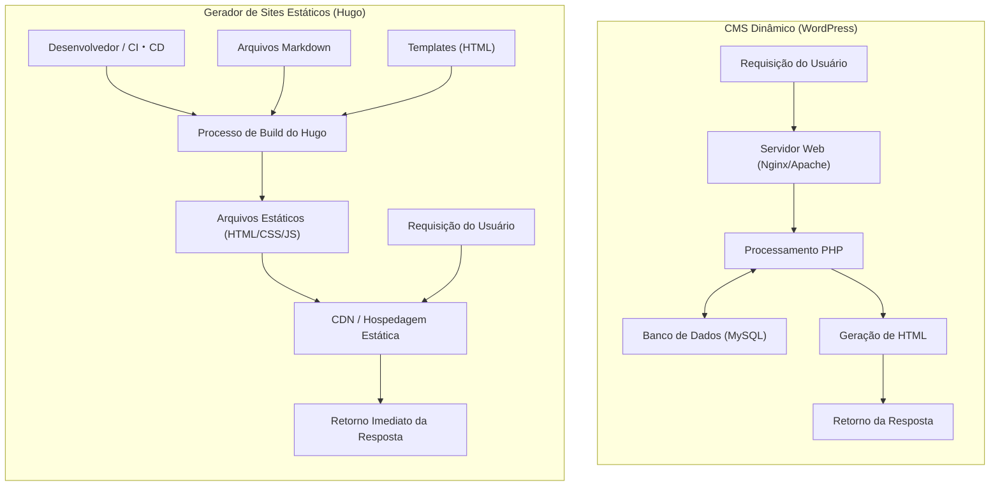
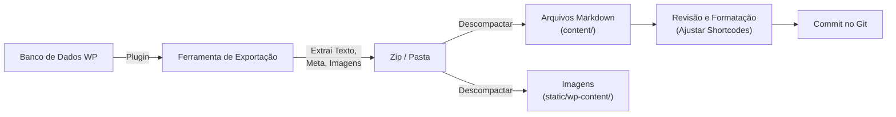

No desenvolvimento web moderno e no gerenciamento de blogs, a velocidade de carregamento, segurança e capacidade de manutenção de um site tornaram-se fatores cruciais. O "WordPress", que há muito ostenta uma participação de mercado esmagadora como base para blogs e sites corporativos, é apreciado por muitos usuários devido ao seu ecossistema flexível de plugins e painel de administração intuitivo. No entanto, por envolver comunicação com banco de dados e geração dinâmica de páginas no lado do servidor (processamento via PHP), ele também enfrenta desafios como vulnerabilidade a picos repentinos de tráfego e latência de exibição.

Por isso, nos últimos anos, os "Geradores de Sites Estáticos" (SSG: Static Site Generator) têm se popularizado rapidamente. Neste artigo, vamos nos aprofundar no "**Hugo**", que se destaca entre muitos SSGs por ser desenvolvido na linguagem Go e conhecido por sua velocidade de build impressionante. Vamos explicar detalhadamente desde a comparação da arquitetura técnica com CMS dinâmicos (Sistemas de Gerenciamento de Conteúdo) como o WordPress, até os procedimentos específicos de migração, avaliação de desempenho usando modelos matemáticos, e a estrutura de diretórios e ordem de busca de templates específicas do Hugo.

---

## 1. Diferenças técnicas entre CMS dinâmico (WordPress) e gerador de sites estáticos (Hugo)

Quando se trata do mecanismo de entrega de um site, o WordPress e o Hugo adotam abordagens fundamentalmente diferentes.

### 1.1 Arquitetura do WordPress (Geração Dinâmica)
O WordPress é um exemplo clássico de CMS dinâmico que monta páginas no lado do servidor a cada requisição. Quando um usuário (navegador) acessa uma página, o servidor web (Apache, Nginx, etc.) executa scripts PHP e emite consultas a um banco de dados relacional como MySQL (ou MariaDB). Ele combina o conteúdo recuperado do banco de dados (dados do artigo, categorias, tags, configurações do site, etc.) com arquivos de template, gera o HTML final e o retorna ao cliente.

Este mecanismo tem a vantagem de poder gerar conteúdo diferente em tempo real para cada visitante (ex: carrinhos de sites de e-commerce, páginas exclusivas para usuários logados), mas consome muitos recursos do servidor a menos que um mecanismo de cache (proxy reverso, plugins, etc.) seja projetado adequadamente.

### 1.2 Arquitetura do Hugo (Geração Prévia no Build)
Por outro lado, como o nome "Gerador de Sites Estáticos" sugere, o Hugo gera o conteúdo no momento do "build" e não no momento da "requisição". O conteúdo é mantido não em um banco de dados, mas como "arquivos Markdown" locais versionados pelo Git ou ferramentas similares.
Quando o desenvolvedor executa o comando (`hugo`), o Hugo lê os arquivos Markdown, injeta os dados nos templates HTML especificados (arquivos de layout) e gera uma coleção final e pura de arquivos HTML/CSS/JS.

O conjunto de arquivos gerados (ativos estáticos) pode ser entregue simplesmente colocando-os em um "ambiente de hospedagem estática" como Amazon S3, Cloudflare Pages, Netlify, Vercel ou até mesmo em um servidor Nginx simples. Como nem banco de dados nem linguagens do lado do servidor (como PHP) são necessários, os riscos de segurança (como injeção de SQL ou vulnerabilidades do PHP) caem drasticamente, e a velocidade de entrega é acelerada ao extremo através do cache nos nós de borda de uma CDN (Content Delivery Network).

Abaixo, a diferença entre as arquiteturas é mostrada em um diagrama Mermaid.



---

## 2. Avaliação de desempenho através de modelos matemáticos

Um dos maiores benefícios de migrar do WordPress para o Hugo é a melhoria do desempenho (velocidade de exibição). Para entender isso quantitativamente, vamos representá-lo usando um modelo matemático simples.

O tempo para concluir o carregamento da página (Load Time: $T_{load}$) é dividido principalmente no tempo de resposta do servidor (TTFB: Time To First Byte) e no tempo de renderização/aquisição de recursos pelo navegador ($T_{render}$).

$$ T_{load} = T_{ttfb} + T_{render} $$

No caso de um CMS dinâmico (WordPress), o $T_{ttfb}$ é a soma dos seguintes elementos: latência da rede ($T_{network}$), tempo de execução de scripts no lado do servidor ($T_{php}$) e tempo de processamento de consultas ao banco de dados ($T_{db}$).

$$ T_{ttfb\_wp} = T_{network} + T_{php} + T_{db} $$

Em situações de pico de acessos (alta carga), $T_{php}$ e $T_{db}$ aumentam de forma não linear, e o sistema inteiro pode se tornar um gargalo. Expresso em uma fórmula, pode-se observar a seguinte deterioração no tempo de resposta em relação ao número de requisições ($N$) (onde $k$ é o coeficiente de sobrecarga de processamento).

$$ T_{php}(N) \approx O(N^k), \quad T_{db}(N) \approx O(N^k) \quad \text{where } k > 1 $$

Por outro lado, na arquitetura que combina um gerador de sites estáticos (Hugo) e uma CDN, o processamento dinâmico no lado do servidor (PHP ou consultas ao banco de dados) não existe. Como o conteúdo fica em cache em servidores de borda distribuídos globalmente, o $T_{ttfb}$ depende puramente da latência de rede do cliente para o servidor de borda mais próximo ($T_{edge}$).

$$ T_{ttfb\_hugo} = T_{edge} $$

Devido a isso, a relação $T_{edge} \ll (T_{network} + T_{php} + T_{db})$ se estabelece, e o TTFB é drasticamente reduzido para apenas alguns a dezenas de milissegundos. Além disso, mesmo que o número de requisições $N$ aumente, o tempo de resposta permanece quase constante ($O(1)$) devido à capacidade de balanceamento de carga dos servidores de borda.

$$ \lim_{N \to \infty} T_{ttfb\_hugo}(N) \approx \text{Constant} $$

Esta é a base matemática que comprova que o Hugo (site estático) é extremamente robusto contra picos de tráfego (como quando um conteúdo viraliza).

---

## 3. Estrutura Básica e Princípios de Funcionamento do Hugo

Para dominar o Hugo, é essencial entender sua estrutura única de diretórios e os conceitos de "Front Matter" e "Template Lookup Order" (Ordem de Busca de Templates).

### 3.1 Explicação Detalhada da Estrutura de Diretórios

Ao criar um novo projeto Hugo (`hugo new site mysite`), a seguinte estrutura de diretórios é gerada:

```text
mysite/
├── archetypes/   # Templates para criação de novos conteúdos (modelos de Front Matter)
├── assets/       # Arquivos processados pelo Hugo Pipes (SCSS/Sass, JavaScript, etc.)
├── content/      # O conteúdo real do site (arquivos Markdown). Substitui o banco de dados.
├── data/         # Dados externos e configurações usados em todo o site (JSON, TOML, YAML, CSV, etc.)
├── layouts/      # Templates HTML que determinam o visual do site (usa Go html/template)
├── public/       # Local onde os arquivos estáticos gerados são colocados após a execução do comando de build
├── static/       # Arquivos estáticos publicados como estão (imagens, favicon, robots.txt, etc.)
├── themes/       # Diretório de temas (criados por você ou de terceiros)
└── hugo.toml     # Arquivo de configuração global do site (antigamente config.toml era o padrão)
```

No WordPress, o conteúdo é armazenado na tabela `wp_posts` do MySQL, mas no Hugo, tudo é gerenciado como arquivos de texto (principalmente Markdown) dentro do diretório `content/`. Isso facilita o controle de versão (Git) do conteúdo.

### 3.2 Gerenciamento de Conteúdo: Markdown e Front Matter

Cada arquivo de artigo do Hugo possui um bloco de metadados no topo chamado de "Front Matter", seguido pelo corpo do texto (Markdown). O Front Matter pode ser escrito em TOML, YAML ou JSON, mas o YAML é amplamente utilizado.

```yaml
---
title: "Entendendo as Taxonomias do Hugo"
date: 2026-09-13T10:00:00+09:00
draft: false
categories:
  - "Explicação Técnica"
tags:
  - "Hugo"
  - "Go"
aliases:
  - "/old-category/hugo-taxonomy/"
---
A partir daqui é o corpo do texto. Escrito em **Markdown**.
Vou explicar os recursos poderosos do Hugo...
```

O que merece atenção aqui é a chave `aliases`. Ao migrar do WordPress, a alteração dos permalinks (URLs) pode ser muito prejudicial para o SEO. Usando a funcionalidade de alias do Hugo, basta especificar a URL antiga, e o Hugo gera automaticamente o HTML para redirecionamento (redirecionamento via meta refresh). Isso é muito útil, pois elimina a necessidade de configurações de redirecionamento no lado do servidor (como .htaccess).

### 3.3 Ordem de Busca de Templates (Template Lookup Order)

Um dos recursos poderosos do Hugo é o seu mecanismo flexível de busca de templates (Template Lookup Order). Ao renderizar uma página específica, o Hugo procura por diretórios e nomes de arquivos em uma ordem particular para encontrar o template ideal.

Por exemplo, ao renderizar um único artigo (Single Page) como `content/post/hello-world.md`, o Hugo geralmente procura os arquivos de layout na seguinte ordem:

1. `layouts/post/single.html`
2. `layouts/post/list.html` (Não é um erro, mas normalmente é para listas)
3. `layouts/_default/single.html`
4. `themes/<NOME_DO_TEMA>/layouts/post/single.html`
5. `themes/<NOME_DO_TEMA>/layouts/_default/single.html`

Os desenvolvedores podem **sobrescrever (override)** os templates do tema simplesmente criando um arquivo com o mesmo nome no diretório `layouts/` do próprio projeto, sem precisar modificar diretamente o código-fonte do tema. Isso permite que você aplique personalizações únicas sem impedir atualizações do tema base.

### 3.4 Taxonomia (Taxonomy)

O sistema de classificação do Hugo, equivalente às "categorias" e "tags" do WordPress, é chamado de "Taxonomia" (Taxonomy).
Por padrão, o Hugo suporta as taxonomias `categories` e `tags`, mas ao editar o `hugo.toml`, você pode adicionar livremente taxonomias customizadas (por exemplo, `series`, `authors`, etc.).

```toml
# Exemplo de hugo.toml
[taxonomies]
  category = "categories"
  tag = "tags"
  series = "series"
  author = "authors"
```

Isso torna possível organizar e listar conteúdos com base em diversos eixos.

---

## 4. Processo de Migração do WordPress para o Hugo (Migração)

A chave para o sucesso na migração do WordPress para o Hugo é como converter o conteúdo dinâmico no banco de dados em arquivos estáticos limpos (Markdown + Front Matter), mantendo a estrutura de URL existente.

O fluxo geral do pipeline de migração é mostrado abaixo.



### 4.1 Extração de dados e conversão para Markdown

Para exportar dados do WordPress para uso no Hugo, a forma mais fácil e confiável é usar plugins dedicados. Apresentamos abaixo algumas das abordagens mais comuns.

1. **Uso do plugin Jekyll Exporter**
   Como o Hugo tem uma estrutura de dados muito semelhante ao Jekyll, que também é um SSG, usar o plugin "Jekyll Exporter" para WordPress é uma abordagem comum. Ao instalar e executar este plugin, todos os posts e páginas estáticas são convertidos em arquivos Markdown com Front Matter, e podem ser baixados como um arquivo ZIP junto com os arquivos de imagem.
2. **Criação de scripts próprios usando a API do WordPress**
   Consiste em bater na REST API do WordPress (`/wp-json/wp/v2/posts`) com Python, Node.js, etc., analisar os dados JSON e criar um script que gere arquivos Markdown por conta própria. É eficaz para sites que utilizam intensivamente campos personalizados complexos (como ACF) que não podem ser completamente suportados por plugins.
3. **Utilização da ferramenta wp2hugo**
   Também existe a abordagem de usar ferramentas CLI escritas em Go, entre outras linguagens, para converter diretamente o arquivo XML de exportação do WordPress (WXR) para o formato do Hugo.

### 4.2 Manutenção da estrutura de Permalinks (URL)

Para manter a autoridade de SEO, é extremamente importante preservar as URLs da era do WordPress exatamente como eram. Se você configurou seus permalinks no WordPress como `https://example.com/2026/09/13/meu-post/`, deverá especificar a estrutura dos permalinks no `hugo.toml` do Hugo.

```toml
[permalinks]
  post = "/:year/:month/:day/:slug/"
```

Alternativamente, você pode especificar o parâmetro `url` diretamente no Front Matter de cada artigo para forçar e fixar a URL.
Além disso, para as páginas cujas URLs mudarem, configure redirecionamentos usando os `aliases` mencionados anteriormente.

### 4.3 Conversão de Shortcodes

Os shortcodes específicos do WordPress (ex: `[gallery]`, `[caption]`, ou códigos próprios de diversos plugins) muitas vezes permanecem como strings não renderizadas durante a exportação, então é necessário lidar com eles.
Estes podem ser excluídos em lote usando scripts de substituição (sed ou Python), ou podem ser migrados usando a poderosa funcionalidade de **shortcodes personalizados** do Hugo (criando layouts próprios em `layouts/shortcodes/`) para que sejam renderizados corretamente no lado do Hugo.

---

## 5. Ferramentas CLI do Hugo, Build e Deploy

Uma vez concluído o trabalho de migração, finalmente usaremos o Hugo para buildar o site e publicá-lo para o mundo. Fornecido como um binário da linguagem Go, o Hugo tem uma velocidade impressionante que conclui o build em apenas alguns segundos, mesmo para sites com milhares ou dezenas de milhares de páginas.

### 5.1 Iniciando o servidor de desenvolvimento local

Ao escrever artigos ou ajustar o design, você deve iniciar o servidor local.

```bash
# Comando para iniciar o servidor de desenvolvimento (use -D para incluir rascunhos)
hugo server -D
```

Ao executar este comando, o site estará disponível para visualização em `http://localhost:1313/`. O Hugo possui uma poderosa funcionalidade "LiveReload" integrada, onde, no momento em que você edita e salva um arquivo Markdown, template ou CSS, a tela do navegador é atualizada automaticamente em alta velocidade. Graças a isso, a experiência de escrita e desenvolvimento se torna muito mais agradável do que o painel administrativo do WordPress.

### 5.2 Build de produção e otimização de desempenho

Para gerar os arquivos estáticos para deploy no ambiente de produção, basta digitar `hugo`.

```bash
# Execução do build de produção. A opção --minify minifica HTML/CSS/JS
hugo --minify
```

Com este comando, todos os arquivos do site serão exportados para o diretório `public/`. Ao adicionar a opção `--minify`, quebras de linha e espaços desnecessários são removidos, e o tamanho do arquivo é ainda mais reduzido. Isso contribui diretamente para a redução da latência da rede ($T_{network}$) no modelo matemático mencionado anteriormente.

### 5.3 Automação de deploy (CI/CD)

Gerar os arquivos estáticos em um PC local a cada vez e fazer upload via FTP é ineficiente. Na operação moderna de SSG, a melhor prática é construir um ambiente CI/CD que realize build e deploy automaticamente, usando um push para um repositório Git (como GitHub) como gatilho.

Por exemplo, a forma básica de uma configuração (arquivo YAML) para fazer o deploy para o Cloudflare Pages ou GitHub Pages usando o GitHub Actions é a seguinte:

```yaml
# Exemplo de .github/workflows/hugo.yml
name: Deploy Hugo site to GitHub Pages

on:
  push:
    branches: ["main"]
  workflow_dispatch:

permissions:
  contents: read
  pages: write
  id-token: write

jobs:
  build:
    runs-on: ubuntu-latest
    steps:
      - name: Checkout
        uses: actions/checkout@v3
        with:
          submodules: recursive # Se os temas forem gerenciados como submódulos
          fetch-depth: 0

      - name: Setup Hugo
        uses: peaceiris/actions-hugo@v2
        with:
          hugo-version: 'latest'
          extended: true

      - name: Build
        run: hugo --minify

      - name: Upload artifact
        uses: actions/upload-pages-artifact@v2
        with:
          path: ./public

  deploy:
    environment:
      name: github-pages
      url: ${{ steps.deployment.outputs.page_url }}
    runs-on: ubuntu-latest
    needs: build
    steps:
      - name: Deploy to GitHub Pages
        id: deployment
        uses: actions/deploy-pages@v2
```

Com essa configuração, a simples ação de "escrever um artigo em Markdown e fazer o Push para o GitHub" completa um pipeline automatizado que publica o site atualizado no ambiente de produção em apenas alguns minutos.

---

## 6. Vantagens operacionais e de SEO após a migração

Operadores de sites que concluem a migração do WordPress para o Hugo frequentemente sentem os seguintes três benefícios notáveis:

### 6.1 Melhoria drástica na velocidade do site e no Core Web Vitals

Como resultado da eliminação de consultas ao banco de dados e da renderização no lado do servidor, o tempo de carregamento da página é reduzido para milissegundos. Isso está diretamente ligado a uma melhora significativa nas pontuações do "Core Web Vitals" (LCP, FID/INP, CLS), que é um fator de ranqueamento do Google. É esperado que a taxa de rejeição dos usuários diminua e a avaliação de SEO melhore.

### 6.2 Libertação das ameaças de segurança

Por ser o WordPress tão amplamente usado em todo o mundo, ele é sempre um alvo de ataques. Os riscos de invasões tirando vantagem das vulnerabilidades dos plugins e logins invadidos por força bruta estão sempre presentes.
No entanto, os sites estáticos gerados pelo Hugo não possuem banco de dados, nem ambiente PHP, nem sequer uma tela de administração (formulário de login). Não há espaço para hackers invadirem o servidor e reescreverem o banco de dados, e o risco de segurança se aproxima do zero.

### 6.3 Operação livre de manutenção

Na operação do WordPress, são necessários constantes trabalhos de manutenção, como atualizações da plataforma principal, atualizações de plugins e acompanhamento da versão do PHP. É preciso ter sempre o temor de que o site possa quebrar devido a problemas de compatibilidade.
No caso do Hugo, as atualizações da própria ferramenta só precisam ser feitas quando necessário, e como o código do site é um conjunto de arquivos de texto independentes, há uma tremenda sensação de segurança de que ele "não quebra mesmo se deixado como está".

---

## 7. Conclusão

Neste artigo, explicamos em detalhes sobre a migração de um CMS dinâmico como o WordPress para o "Hugo", um poderoso gerador de sites estáticos baseado na linguagem Go, abrangendo desde as diferenças na arquitetura técnica, comprovação de desempenho por meio de modelos matemáticos, até os procedimentos de migração práticos.

Embora a migração para um gerador de sites estáticos requeira um custo de aprendizado inicial (operações no Git, sintaxe do Markdown, execução de comandos CLI pelo terminal, compreensão das especificações do motor de templates, etc.), ela traz retornos de "velocidade de exibição avassaladora", "segurança sólida" e ser "livre de manutenção", que mais do que compensam esse custo.

Se o seu site não necessita de mudanças de design frequentes ou processos dinâmicos complexos (funcionalidades exclusivas para membros, recursos avançados de e-commerce, etc.) e seu principal objetivo é a divulgação de informações (blogs, mídias, sites corporativos), a migração para o Hugo será, sem dúvida, um dos investimentos técnicos mais eficientes. Esperamos que você use este artigo como referência para dar o primeiro passo rumo à operação de sites de próxima geração com o Hugo.
