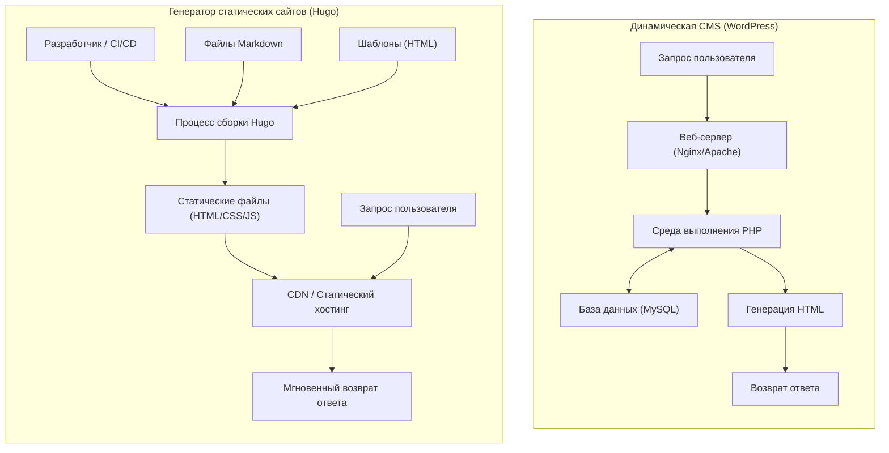
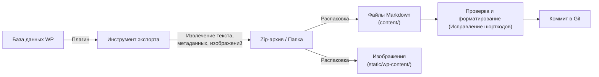

В современной веб-разработке и ведении блогов скорость загрузки сайта, его безопасность и простота обслуживания стали критически важными факторами. «WordPress», долгое время занимавший подавляющую долю рынка как основа для блогов и корпоративных сайтов, полюбился многим пользователям благодаря своей гибкой экосистеме плагинов и интуитивно понятной панели управления. Однако, поскольку он полагается на взаимодействие с базой данных и динамическую генерацию страниц на стороне сервера (обработка на PHP), он также подвержен уязвимостям при резком увеличении трафика и проблемам с задержками отображения (latency).

Поэтому в последние годы стремительную популярность набирают «генераторы статических сайтов» (SSG: Static Site Generator). В этой статье мы подробно рассмотрим «**Hugo**» — один из множества SSG, разработанный на языке Go и известный своей невероятной скоростью сборки. Мы досконально разберем всё: от сравнения технической архитектуры с динамическими CMS (Content Management System), такими как WordPress, до конкретных шагов по миграции, оценки производительности с использованием математических моделей, а также уникальной структуры каталогов Hugo и порядка поиска шаблонов.

---

## 1. Технические различия между динамическими CMS (WordPress) и генераторами статических сайтов (Hugo)

В механизмах доставки веб-сайтов WordPress и Hugo используют фундаментально разные подходы.

### 1.1 Архитектура WordPress (Динамическая генерация)

WordPress — это типичный пример динамической CMS, которая собирает страницу на стороне сервера при каждом запросе. Когда пользователь (браузер) обращается к странице, веб-сервер (Apache, Nginx и т.д.) выполняет скрипт PHP и отправляет запрос к реляционной базе данных, такой как MySQL (или MariaDB). Полученный из базы данных контент (данные статей, категории, теги, настройки сайта и т.д.) объединяется с файлами шаблонов для генерации итогового HTML, который затем возвращается клиенту.

Этот механизм имеет то преимущество, что позволяет генерировать различный контент для каждого посетителя в реальном времени (например, корзина в интернет-магазине или страницы только для авторизованных пользователей). Однако без правильно спроектированного механизма кэширования (обратный прокси-сервер, плагины и т.д.) он приводит к интенсивному потреблению ресурсов сервера.

### 1.2 Архитектура Hugo (Предварительная генерация во время сборки)

С другой стороны, Hugo, как следует из названия «генератор статических сайтов», генерирует контент не «во время запроса», а «во время сборки» (build time). Контент хранится не в базе данных, а в виде локальных файлов Markdown, которые версионируются с помощью Git или аналогичных систем.
Когда разработчик выполняет команду (`hugo`), Hugo считывает файлы Markdown, подставляет данные в указанные HTML-шаблоны (файлы макетов) и генерирует набор готовых чистых файлов HTML/CSS/JS.

Сгенерированный набор файлов (статические ресурсы) можно доставлять, просто разместив их в «средах статического хостинга», таких как Amazon S3, Cloudflare Pages, Netlify, Vercel или на простом сервере Nginx. Поскольку база данных и серверные языки (например, PHP) не требуются, риски безопасности (такие как SQL-инъекции или уязвимости PHP) резко снижаются, а скорость доставки максимизируется за счет кэширования на граничных узлах CDN (Content Delivery Network).

Ниже на диаграмме Mermaid показаны различия в каждой из архитектур.



---

## 2. Оценка производительности с использованием математических моделей

Одним из самых больших преимуществ перехода с WordPress на Hugo является улучшение производительности (скорости отображения). Чтобы понять это количественно, давайте выразим это с помощью простой математической модели.

Время до завершения загрузки страницы (Load Time: $T_{load}$) можно в целом разделить на время ответа сервера (TTFB: Time To First Byte) и время, затрачиваемое браузером на рендеринг и получение ресурсов ($T_{render}$).

$$ T_{load} = T_{ttfb} + T_{render} $$

В случае динамической CMS (WordPress) $T_{ttfb}$ представляет собой сумму следующих компонентов: сетевой задержки ($T_{network}$), времени выполнения серверного скрипта ($T_{php}$) и времени обработки запросов к базе данных ($T_{db}$).

$$ T_{ttfb\_wp} = T_{network} + T_{php} + T_{db} $$

В условиях высокой концентрации доступа (при высокой нагрузке) $T_{php}$ и $T_{db}$ увеличиваются нелинейно, и вся система может стать узким местом. В математическом выражении мы можем наблюдать следующее ухудшение времени отклика по отношению к количеству запросов ($N$) (где $k$ — коэффициент накладных расходов на обработку):

$$ T_{php}(N) \approx O(N^k), \quad T_{db}(N) \approx O(N^k) \quad \text{where } k > 1 $$

С другой стороны, в архитектуре, объединяющей генератор статических сайтов (Hugo) и CDN, отсутствует динамическая обработка на стороне сервера (PHP и запросы к БД). Поскольку контент кэшируется на граничных серверах, распределенных по всему миру, $T_{ttfb}$ зависит исключительно от сетевой задержки от клиента до ближайшего граничного сервера ($T_{edge}$).

$$ T_{ttfb\_hugo} = T_{edge} $$

В результате выполняется условие $T_{edge} \ll (T_{network} + T_{php} + T_{db})$, и показатель TTFB кардинально сокращается до нескольких миллисекунд или десятков миллисекунд. Кроме того, даже при увеличении количества запросов $N$ время отклика остается практически постоянным ($O(1)$) благодаря функциям балансировки нагрузки граничных серверов.

$$ \lim_{N \to \infty} T_{ttfb\_hugo}(N) \approx \text{Constant} $$

В этом и заключается математическое обоснование того, почему Hugo (статические сайты) обладает чрезвычайной устойчивостью к всплескам трафика (например, при вирусном эффекте).

---

## 3. Базовая структура и принципы работы Hugo

Чтобы освоить Hugo, необходимо понять его уникальную структуру каталогов, а также концепции «Front Matter» и «Порядок поиска шаблонов» (Template Lookup Order).

### 3.1 Подробное объяснение структуры каталогов

При создании нового проекта Hugo (с помощью `hugo new site mysite`) генерируется следующая структура каталогов:

```text
mysite/
├── archetypes/   # Шаблоны для создания нового контента (заготовки Front Matter)
├── assets/       # Файлы, обрабатываемые Hugo Pipes (SCSS/Sass, JavaScript и т.д.)
├── content/      # Фактический контент сайта (файлы Markdown). Служит заменой БД.
├── data/         # Внешние данные и настройки, используемые на всем сайте (JSON, TOML, YAML, CSV и т.д.)
├── layouts/      # HTML-шаблоны, определяющие внешний вид сайта (используют Go html/template)
├── public/       # Место вывода сгенерированных статических файлов после выполнения команды сборки
├── static/       # Статические файлы, публикуемые "как есть" (изображения, favicon, robots.txt и т.д.)
├── themes/       # Каталог для сторонних или собственных тем
└── hugo.toml     # Файл конфигурации всего сайта (ранее основным был config.toml)
```

В WordPress контент хранится в таблице `wp_posts` MySQL, в то время как в Hugo всё управляется в виде текстовых файлов (преимущественно Markdown) в каталоге `content/`. Это значительно упрощает версионирование контента с помощью Git.

### 3.2 Управление контентом: Markdown и Front Matter

Каждый файл статьи в Hugo имеет блок метаданных в самом верху, который называется «Front Matter», за которым следует основной текст (Markdown). Front Matter можно писать в форматах TOML, YAML или JSON, но чаще всего используется YAML.

```yaml
---
title: "Понимание таксономий в Hugo"
date: 2026-09-13T10:00:00+09:00
draft: false
categories:
  - "Технические руководства"
tags:
  - "Hugo"
  - "Go"
aliases:
  - "/old-category/hugo-taxonomy/"
---
Здесь начинается основной текст. Он пишется на **Markdown**.
Мы объясним мощные возможности Hugo...
```

Здесь стоит обратить внимание на ключ `aliases`. При переходе с WordPress изменение постоянных ссылок (URL) будет иметь серьезные негативные последствия для SEO. Используя функцию алиасов в Hugo, достаточно указать старый URL, и Hugo автоматически сгенерирует HTML для перенаправления (переадресация через meta refresh). Это чрезвычайно удобно, так как избавляет от необходимости настраивать редиректы на стороне сервера (например, в .htaccess).

### 3.3 Порядок поиска шаблонов (Template Lookup Order)

Одной из мощных возможностей Hugo является его гибкий механизм поиска шаблонов (Template Lookup Order). При рендеринге определенной страницы Hugo осуществляет поиск по каталогам и именам файлов в определенном порядке, чтобы найти наиболее подходящий шаблон.

Например, при рендеринге отдельной статьи (Single Page) `content/post/hello-world.md` Hugo ищет файлы макетов примерно в следующем порядке:

1. `layouts/post/single.html`
2. `layouts/post/list.html` (Не ошибка, но обычно используется для списков)
3. `layouts/_default/single.html`
4. `themes/<THEME_NAME>/layouts/post/single.html`
5. `themes/<THEME_NAME>/layouts/_default/single.html`

Разработчики могут **переопределять (override)** шаблоны темы, не изменяя исходный код темы напрямую, а просто создавая файл с тем же именем в каталоге `layouts/` своего проекта. Это позволяет вносить собственные настройки, не мешая будущим обновлениям базовой темы.

### 3.4 Таксономии (Taxonomy)

Система классификации, эквивалентная «Категориям» и «Тегам» в WordPress, в Hugo называется «Таксономией» (Taxonomy).
По умолчанию Hugo поддерживает таксономии `categories` и `tags`, но, отредактировав файл `hugo.toml`, вы можете свободно добавлять пользовательские таксономии (например, `series`, `authors` и т.д.).

```toml
# Пример hugo.toml
[taxonomies]
  category = "categories"
  tag = "tags"
  series = "series"
  author = "authors"
```

Это позволяет упорядочивать контент и составлять списки по различным осям.

---

## 4. Процесс миграции с WordPress на Hugo

Ключом к успешному переходу с WordPress на Hugo является то, насколько чисто вы сможете преобразовать динамический контент из базы данных в статические файлы (Markdown + Front Matter) с сохранением существующей структуры URL.

Ниже показана типичная схема пайплайна миграции:



### 4.1 Извлечение данных и преобразование в Markdown

Для экспорта данных WordPress для использования в Hugo проще и надежнее всего использовать специальные плагины. Вот несколько типичных подходов:

1. **Использование плагина Jekyll Exporter**
   Поскольку Hugo имеет очень схожую структуру данных с Jekyll (еще одним SSG), использование плагина «Jekyll Exporter» для WordPress является распространенной практикой. После установки и запуска этого плагина все записи и статические страницы конвертируются в файлы Markdown с Front Matter, которые можно загрузить в виде ZIP-архива вместе с изображениями.
2. **Собственные скрипты с использованием WordPress API**
   Метод, при котором с помощью Python, Node.js и т.д. выполняются запросы к REST API WordPress (`/wp-json/wp/v2/posts`), анализируются данные JSON и самостоятельно генерируются файлы Markdown. Этот метод эффективен для сайтов, интенсивно использующих сложные произвольные поля (например, ACF), с которыми плагины не могут справиться в полной мере.
3. **Использование инструмента wp2hugo**
   Также существует подход с использованием инструментов командной строки (CLI), написанных на Go и т.д., для прямой конвертации из файла экспорта XML WordPress (WXR) в формат Hugo.

### 4.2 Сохранение структуры постоянных ссылок (URL)

Чтобы сохранить SEO-рейтинг, критически важно сохранить URL-адреса такими, какими они были во времена WordPress. Если в WordPress были настроены постоянные ссылки вида `https://example.com/2026/09/13/my-post/`, необходимо указать аналогичную структуру постоянных ссылок в `hugo.toml` для Hugo.

```toml
[permalinks]
  post = "/:year/:month/:day/:slug/"
```

В качестве альтернативы можно принудительно зафиксировать URL-адреса, явно указав параметр `url` во Front Matter для каждой статьи.
Кроме того, для страниц, чьи URL-адреса изменятся, следует настроить редиректы с помощью ранее упомянутого параметра `aliases`.

### 4.3 Конвертация шорткодов

Специфичные для WordPress шорткоды (например, `[gallery]`, `[caption]` или собственные коды различных плагинов) часто остаются в виде исходных строк при экспорте, поэтому требуется их обработка.
Их можно либо удалить все сразу с помощью скриптов замены (sed или Python), либо использовать мощную **функцию пользовательских шорткодов** Hugo (путем создания собственных макетов в `layouts/shortcodes/`), чтобы они корректно рендерились на стороне Hugo после миграции.

---

## 5. Инструменты CLI, сборка и развертывание в Hugo

После завершения процесса миграции настало время собрать сайт с помощью Hugo и опубликовать его для всего мира. Поставляемый в виде бинарного файла на языке Go, Hugo может похвастаться удивительной скоростью, позволяющей собирать сайты из тысяч или даже десятков тысяч страниц всего за несколько секунд.

### 5.1 Запуск локального сервера разработки

При написании статей или настройке дизайна необходимо запускать локальный сервер.

```bash
# Команда запуска сервера разработки (используйте -D для включения черновиков)
hugo server -D
```

После выполнения этой команды сайт будет доступен для предварительного просмотра по адресу `http://localhost:1313/`. В Hugo встроена мощная функция «LiveReload»: как только вы отредактируете и сохраните файл Markdown, шаблон или CSS, экран браузера будет автоматически и мгновенно обновлен. Это делает процесс написания и разработки намного более комфортным, чем в панели администратора WordPress.

### 5.2 Сборка для продакшена и оптимизация производительности

Чтобы сгенерировать статические файлы для развертывания в рабочей (продакшен) среде, просто введите команду `hugo`.

```bash
# Выполнение сборки для продакшена. Опция --minify минимизирует HTML/CSS/JS
hugo --minify
```

Эта команда выведет файлы всего сайта в каталог `public/`. Добавление опции `--minify` удаляет ненужные переносы строк и пробелы, еще больше сокращая размер файлов. Это напрямую способствует уменьшению сетевой задержки ($T_{network}$), описанной в математической модели ранее.

### 5.3 Автоматизация развертывания (CI/CD)

Генерировать статические файлы каждый раз на локальном ПК и загружать их по FTP — неэффективно. В современной практике управления SSG лучшим подходом является создание среды CI/CD, в которой отправка (push) в репозиторий Git (например, на GitHub) служит триггером для автоматической сборки и развертывания.

Например, базовая конфигурация (файл YAML) для развертывания на Cloudflare Pages или GitHub Pages с использованием GitHub Actions выглядит следующим образом:

```yaml
# Пример .github/workflows/hugo.yml
name: Deploy Hugo site to GitHub Pages

on:
  push:
    branches: ["main"]
  workflow_dispatch:

permissions:
  contents: read
  pages: write
  id-token: write

jobs:
  build:
    runs-on: ubuntu-latest
    steps:
      - name: Checkout
        uses: actions/checkout@v3
        with:
          submodules: recursive # Если темы управляются как подмодули
          fetch-depth: 0

      - name: Setup Hugo
        uses: peaceiris/actions-hugo@v2
        with:
          hugo-version: 'latest'
          extended: true

      - name: Build
        run: hugo --minify

      - name: Upload artifact
        uses: actions/upload-pages-artifact@v2
        with:
          path: ./public

  deploy:
    environment:
      name: github-pages
      url: ${{ steps.deployment.outputs.page_url }}
    runs-on: ubuntu-latest
    needs: build
    steps:
      - name: Deploy to GitHub Pages
        id: deployment
        uses: actions/deploy-pages@v2
```

С такими настройками мы получаем автоматизированный пайплайн, в котором достаточно выполнить действие «написать статью в Markdown и отправить (push) на GitHub», и через несколько минут обновленный сайт будет опубликован в рабочей среде.

---

## 6. Преимущества SEO и управления после миграции

Владельцы сайтов, завершившие переход с WordPress на Hugo, чаще всего отмечают три следующих существенных преимущества:

### 6.1 Кардинальное улучшение скорости сайта и показателей Core Web Vitals
За счет устранения запросов к базе данных и рендеринга на стороне сервера время загрузки страницы сокращается до миллисекунд. Это напрямую приводит к значительному улучшению показателей «Core Web Vitals» (LCP, FID/INP, CLS), которые являются факторами ранжирования Google. Можно ожидать снижения показателя отказов пользователей и улучшения позиций в SEO.

### 6.2 Освобождение от угроз безопасности
Поскольку WordPress широко используется по всему миру, он постоянно является мишенью для атак. Всегда существуют риски взлома через уязвимости плагинов или обхода формы входа в систему с помощью атак методом перебора (brute force).
Однако статические сайты, сгенерированные с помощью Hugo, не имеют ни базы данных, ни среды PHP, ни даже панели управления (формы входа). У хакеров нет возможности проникнуть на сервер и изменить базу данных, поэтому риски безопасности сводятся практически к нулю.

### 6.3 Эксплуатация, не требующая обслуживания
Эксплуатация WordPress требует постоянного обслуживания: обновления ядра, обновления плагинов, перехода на новые версии PHP и т.д. Вам всегда приходится опасаться риска того, что сайт сломается из-за проблем с совместимостью.
В случае с Hugo достаточно обновлять сам инструмент по мере необходимости, а код сайта представляет собой набор независимых текстовых файлов. Это дает подавляющее чувство уверенности в том, что «сайт не сломается, даже если его оставить в покое».

---

## 7. Заключение

В этой статье мы подробно рассмотрели переход с динамических CMS, таких как WordPress, на мощный генератор статических сайтов «Hugo» на базе языка Go: от различий в технической архитектуре и математического доказательства производительности до конкретных шагов по миграции.

Хотя переход на генераторы статических сайтов требует начальных затрат на обучение (работа с Git, синтаксис Markdown, выполнение команд CLI из терминала, понимание спецификаций шаблонизатора и т.д.), он приносит отдачу в виде «подавляющей скорости загрузки», «надежной безопасности» и «отсутствия необходимости в обслуживании», которая с лихвой окупает эти затраты.

Если вашему веб-сайту не требуются частые изменения дизайна или сложная динамическая обработка (например, функции только для зарегистрированных пользователей или продвинутые функции интернет-магазина), и он предназначен в первую очередь для распространения информации (блог, медиа, корпоративный сайт), то переход на Hugo станет одной из самых эффективных технических инвестиций. Обязательно воспользуйтесь этой статьей как руководством и сделайте первый шаг к управлению веб-сайтами нового поколения с использованием Hugo.
