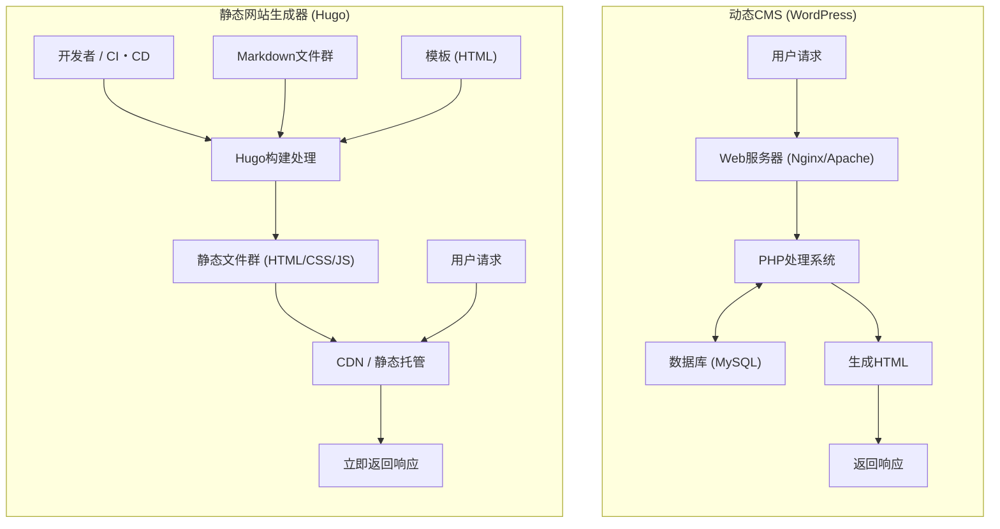
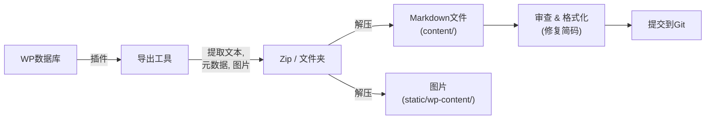

在现代Web开发和博客运营中，网站的加载速度、安全性以及可维护性已成为极其重要的因素。长期以来，作为博客和企业网站基础而占据压倒性市场份额的“WordPress”，凭借其灵活的插件生态系统和直观的管理界面，深受广大用户喜爱。然而，由于它需要与数据库进行通信以及在服务器端进行动态页面生成（通过PHP处理），因此也面临着应对流量激增时的脆弱性以及加载延迟（Latency）等问题。

因此，近年来“静态网站生成器（SSG: Static Site Generator）”正在迅速普及。在本文中，我们将深入探讨在众多SSG中基于Go语言开发、以其惊人的构建速度而闻名的“**Hugo**”。我们将从它与WordPress等动态CMS（Content Management System）的技术架构对比，到具体的迁移步骤、使用数理模型进行的性能评估，以及Hugo特有的目录结构和模板查找顺序，进行彻底的解析。

---

## 1. 动态CMS（WordPress）与静态网站生成器（Hugo）的技术差异

在网站分发机制方面，WordPress和Hugo采用了根本不同的方法。

### 1.1 WordPress架构（动态生成）

WordPress是每次收到请求时在服务器端构建页面的动态CMS代表。当用户（浏览器）访问页面时，Web服务器（如Apache、Nginx）会执行PHP脚本，并向MySQL（或MariaDB）等关系型数据库发出查询。将从数据库获取的内容（文章数据、分类、标签、网站设置等）与模板文件结合，生成最终的HTML并返回给客户端。

这种机制的优点是能够实时为每位访客生成不同的内容（例如：电商网站的购物车、登录用户的专属页面），但如果不恰当地设计缓存机制（如反向代理或插件等），将会剧烈消耗服务器资源。

### 1.2 Hugo架构（构建时预生成）

另一方面，正如“静态网站生成器”这个名称所示，Hugo不是在“请求时”而是在“构建时”生成内容。内容不保存在数据库中，而是作为受Git等版本控制管理的本地“Markdown文件”保留。
当开发者执行命令（`hugo`）时，Hugo会读取Markdown文件，将数据注入到指定的HTML模板（布局文件）中，并生成完整的、纯粹的HTML/CSS/JS文件集合。

生成的这些文件（静态资产）只需部署到Amazon S3、Cloudflare Pages、Netlify、Vercel或简单的Nginx服务器等“静态托管环境”中即可进行分发。由于既不需要数据库也不需要服务器端语言（如PHP），安全风险（如SQL注入和PHP漏洞等）会急剧降低，同时内容会被缓存到CDN（Content Delivery Network）的边缘节点上，使加载速度达到极限。

下面通过Mermaid图来展示各自架构的差异。



---

## 2. 基于数理模型的性能评估

从WordPress迁移到Hugo的最大优势之一就是性能（加载速度）的提升。为了定量地理解这一点，让我们用一个简单的数学模型来表达。

页面加载完成所需的时间（Load Time: $T_{load}$）主要分为服务器响应时间（TTFB: Time To First Byte）和浏览器渲染与资源获取时间（$T_{render}$）。

$$ T_{load} = T_{ttfb} + T_{render} $$

对于动态CMS（WordPress），$T_{ttfb}$ 是以下要素的总和：网络延迟（$T_{network}$）、服务器端脚本执行时间（$T_{php}$）以及数据库查询处理时间（$T_{db}$）。

$$ T_{ttfb\_wp} = T_{network} + T_{php} + T_{db} $$

在访问集中的状态（高负载时），$T_{php}$ 和 $T_{db}$ 会呈非线性增长，整个系统可能成为瓶颈。用数学公式表示，相对于请求数（$N$），可以观察到如下的响应时间恶化（$k$ 是处理的开销系数）。

$$ T_{php}(N) \approx O(N^k), \quad T_{db}(N) \approx O(N^k) \quad \text{where } k > 1 $$

另一方面，在结合了静态网站生成器（Hugo）和CDN的架构中，不存在服务器端的动态处理（如PHP或DB查询）。由于内容被缓存在分布于世界各地的边缘服务器上，因此 $T_{ttfb}$ 纯粹仅依赖于客户端到最近边缘服务器的网络延迟（$T_{edge}$）。

$$ T_{ttfb\_hugo} = T_{edge} $$

由此，$T_{edge} \ll (T_{network} + T_{php} + T_{db})$ 成立，TTFB被极大地缩短至几毫秒到几十毫秒左右。此外，即使请求数 $N$ 增加，得益于边缘服务器的负载均衡功能，响应时间也基本保持恒定（$O(1)$）。

$$ \lim_{N \to \infty} T_{ttfb\_hugo}(N) \approx \text{Constant} $$

这就是Hugo（静态网站）在应对流量高峰（如内容爆火时）表现得极其稳健的数理依据。

---

## 3. Hugo的基本结构与工作原理

为了掌握Hugo，理解其独特的目录结构以及“Front Matter”和“Template Lookup Order（模板查找顺序）”的概念是必不可少的。

### 3.1 目录结构详细解析

当新建一个Hugo项目（`hugo new site mysite`）时，会生成如下的目录结构：

```text
mysite/
├── archetypes/   # 新建内容时的模板（Front Matter的样板）
├── assets/       # 由Hugo Pipes处理的文件群（SCSS/Sass, JavaScript等）
├── content/      # 实际的网站内容（Markdown文件群）。这是数据库的替代品。
├── data/         # 网站全局使用的外部数据或设置（JSON, TOML, YAML, CSV等）
├── layouts/      # 决定网站外观的HTML模板群（使用Go html/template）
├── public/       # 执行构建命令后生成的静态文件的输出位置
├── static/       # 原样发布的静态文件（图片、favicon、robots.txt等）
├── themes/       # 第三方或自制的主题目录
└── hugo.toml     # 网站全局配置文件（以前 config.toml 较为主流）
```

在WordPress中，内容存储在MySQL的 `wp_posts` 表中，而在Hugo中，一切都作为 `content/` 目录下的文本文件（主要为Markdown）进行管理。这使得内容版本控制（Git）变得非常容易。

### 3.2 内容管理：Markdown与Front Matter

Hugo的每一篇文章文件在最顶部都有一个被称为“Front Matter（前置数据）”的元数据块，其下方则是正文（Markdown）。Front Matter可以使用TOML、YAML、JSON中的任何一种编写，但YAML被最广泛地使用。

```yaml
---
title: "理解Hugo的分类法（Taxonomy）"
date: 2026-09-13T10:00:00+09:00
draft: false
categories:
  - "技术解说"
tags:
  - "Hugo"
  - "Go"
aliases:
  - "/old-category/hugo-taxonomy/"
---
这里开始是正文。使用**Markdown**来编写。
我们将为您讲解Hugo的强大功能...
```

这里值得注意的是 `aliases` 键。从WordPress迁移时，如果固定链接（URL）发生改变，将对SEO造成很大的负面影响。利用Hugo的别名功能，只需指定旧URL，Hugo就会自动生成用于重定向的HTML（通过meta refresh跳转）。由于不再需要服务器端的重定向配置（如.htaccess等），因此非常方便。

### 3.3 模板查找顺序（Template Lookup Order）

Hugo强大的功能之一就是灵活的模板探索机制（Template Lookup Order）。在渲染特定页面时，Hugo会按照特定的顺序搜索目录和文件名，以找到最合适的模板。

例如，在渲染单篇文章（Single Page） `content/post/hello-world.md` 时，Hugo大致会按以下顺序查找布局文件：

1. `layouts/post/single.html`
2. `layouts/post/list.html` （虽然不是错误，但通常用于列表）
3. `layouts/_default/single.html`
4. `themes/<THEME_NAME>/layouts/post/single.html`
5. `themes/<THEME_NAME>/layouts/_default/single.html`

开发者无需直接修改主题的源代码，只需在自己项目的 `layouts/` 目录中创建同名文件，即可**覆盖（Override）**主题模板。这样，可以在不妨碍基础主题更新的情况下进行自定义。

### 3.4 分类法（Taxonomy）

在Hugo中，相当于WordPress中的“分类（Categories）”和“标签（Tags）”的分类系统被称为“分类法（Taxonomy）”。
Hugo默认支持 `categories` 和 `tags` 分类法，通过编辑 `hugo.toml`，您可以自由添加自定义分类法（例如：`series`, `authors` 等）。

```toml
# hugo.toml示例
[taxonomies]
  category = "categories"
  tag = "tags"
  series = "series"
  author = "authors"
```

这使得从多维度对内容进行整理和列表化成为可能。

---

## 4. 从WordPress到Hugo的迁移过程（Migration）

从WordPress迁移到Hugo的成功关键在于：如何将数据库中的动态内容干净地转换为静态文件（Markdown + Front Matter），并保持现有的URL结构。

下面展示了一般的迁移流水线流程。



### 4.1 数据的提取与Markdown化

要导出WordPress数据供Hugo使用，最简单、最可靠的方法是使用专用插件。下面介绍几种代表性的方法。

1. **使用Jekyll Exporter插件**
   由于Hugo与同样是SSG的Jekyll数据结构非常相似，所以常用的方法是使用WordPress的“Jekyll Exporter”插件。安装并运行此插件后，所有的文章和页面都将转换为带有Front Matter的Markdown文件，并连同图片文件一起打包为ZIP文件供下载。
2. **利用WordPress API自制脚本**
   这种方法是使用Python或Node.js等请求WordPress的REST API（`/wp-json/wp/v2/posts`），解析JSON数据并自己编写脚本来生成Markdown文件。对于大量使用了插件无法完全兼容的复杂自定义字段（如ACF等）的网站非常有效。
3. **活用wp2hugo工具**
   还有一种方法是利用Go语言等编写的CLI工具，将WordPress的导出XML文件（WXR）直接转换为Hugo格式。

### 4.2 固定链接（URL）结构的保持

为了继承SEO评分，原样保留WordPress时代的URL是极其重要的。如果WordPress中的固定链接设置为类似 `https://example.com/2026/09/13/my-post/` 的格式，可以在Hugo的 `hugo.toml` 中指定固定链接结构。

```toml
[permalinks]
  post = "/:year/:month/:day/:slug/"
```

或者，也可以在每篇文章的Front Matter中直接指定 `url` 参数，强制固定URL。
此外，对于URL会发生变更的页面，请使用前文提到的 `aliases` 来设置重定向。

### 4.3 简码（Shortcodes）的转换

WordPress特有的简码（如：`[gallery]`, `[caption]`，以及各种插件的专属代码）在导出时往往会作为原样字符串残留，因此需要处理。
可以使用替换脚本（sed或Python）批量删除它们，或者利用Hugo强大的**自定义简码功能**（在 `layouts/shortcodes/` 目录下创建独立的布局），将其迁移以便在Hugo端被正确渲染。

---

## 5. Hugo的CLI工具与构建・部署

迁移工作完成后，终于可以使用Hugo构建网站并向世界发布了。作为Go语言的二进制文件提供的Hugo，其令人惊叹的速度能在短短几秒内完成包含数千到数万个页面的网站构建。

### 5.1 启动本地开发服务器

在撰写文章或调整设计时，需要启动本地服务器。

```bash
# 启动开发服务器命令（若包含Draft草稿文章则加上 -D）
hugo server -D
```

执行此命令后，您就可以在 `http://localhost:1313/` 预览网站。Hugo内置了强大的“LiveReload”功能，当您编辑并保存Markdown文件、模板或CSS时，浏览器画面将自动高速刷新。得益于此，写作和开发体验将比WordPress的管理界面舒适得多。

### 5.2 生产环境构建与性能优化

要生成用于部署到生产环境的静态文件，只需输入 `hugo` 即可。

```bash
# 运行生产环境构建。使用 --minify 选项压缩HTML/CSS/JS
hugo --minify
```

该命令将整个站点的文件输出到 `public/` 目录。添加 `--minify` 选项后，不必要的换行和空格将被删除，从而进一步缩减文件大小。这直接有助于降低前文数学模型中所述的网络延迟（$T_{network}$）。

### 5.3 部署自动化（CI/CD）

每次都在本地PC生成静态文件然后通过FTP等方式上传是非常低效的。在现代SSG运营中，最佳实践是构建一个以推送到Git仓库（如GitHub等）为触发条件，自动进行构建和部署的CI/CD环境。

例如，使用GitHub Actions部署到Cloudflare Pages或GitHub Pages的配置（YAML文件）基本形式如下所示：

```yaml
# .github/workflows/hugo.yml 示例
name: Deploy Hugo site to GitHub Pages

on:
  push:
    branches: ["main"]
  workflow_dispatch:

permissions:
  contents: read
  pages: write
  id-token: write

jobs:
  build:
    runs-on: ubuntu-latest
    steps:
      - name: Checkout
        uses: actions/checkout@v3
        with:
          submodules: recursive # 如果使用子模块管理主题
          fetch-depth: 0

      - name: Setup Hugo
        uses: peaceiris/actions-hugo@v2
        with:
          hugo-version: 'latest'
          extended: true

      - name: Build
        run: hugo --minify

      - name: Upload artifact
        uses: actions/upload-pages-artifact@v2
        with:
          path: ./public

  deploy:
    environment:
      name: github-pages
      url: ${{ steps.deployment.outputs.page_url }}
    runs-on: ubuntu-latest
    needs: build
    steps:
      - name: Deploy to GitHub Pages
        id: deployment
        uses: actions/deploy-pages@v2
```

通过这样的配置，只需“用Markdown写文章并Push到GitHub”这一个操作，几分钟后最新的站点就会在生产环境上发布，从而完成自动化流水线的搭建。

---

## 6. 迁移后的SEO与运营层面的优势

完成从WordPress迁移到Hugo的网站运营者，大多能切实感受到以下三个显著的优势：

### 6.1 网站速度与Core Web Vitals的急剧提升

由于排除了数据库查询和服务器端的渲染，页面的加载时间被缩短到毫秒级。这直接关系到作为Google排名因素的“核心网页指标（Core Web Vitals）”（LCP、FID/INP、CLS）得分的大幅提升。可以期待用户跳出率的下降以及SEO排名的提升。

### 6.2 摆脱安全威胁

由于WordPress在世界各地被广泛使用，它经常成为攻击目标。始终伴随着利用插件漏洞进行的篡改、或通过暴力破解突破登录等风险。
但是，由Hugo生成的静态网站中，既不存在数据库，也不存在PHP环境，甚至连管理界面（登录表单）都没有。黑客没有空间入侵服务器并篡改数据库，安全风险无限接近于零。

### 6.3 免维护的运营

在WordPress的运营中，需要进行本体版本升级、插件更新、PHP版本跟进等不间断的维护工作。还必须时刻担忧因兼容性问题导致网站崩溃的风险。
而使用Hugo，只需根据需要对工具本身进行升级即可，网站的代码本身是独立的文本文件群，因此拥有“即使放任不管也不会坏”的巨大安全感。

---

## 7. 总结

在本文中，我们详细讲解了从类似WordPress的动态CMS迁移到基于Go语言的强大静态网站生成器“Hugo”的整个过程，包括技术架构的差异、利用数理模型进行的性能证明以及具体的迁移步骤。

向静态网站生成器迁移虽然需要前期的学习成本（如Git的操作、Markdown语法、从终端执行CLI命令、理解模板引擎的规范等），但它能带来“压倒性的加载速度”、“坚固的安全性”以及“免维护”的回报，这些足以弥补其学习成本且绰绰有余。

如果您的网站不需要频繁的设计变更或复杂的动态处理（如会员专属功能或高级电商功能等），而是主要用于信息发布（博客、媒体、企业网站），那么迁移到Hugo将是您最有效的技术投资之一。请务必参考本文，迈出使用Hugo运营新一代网站的第一步吧。
