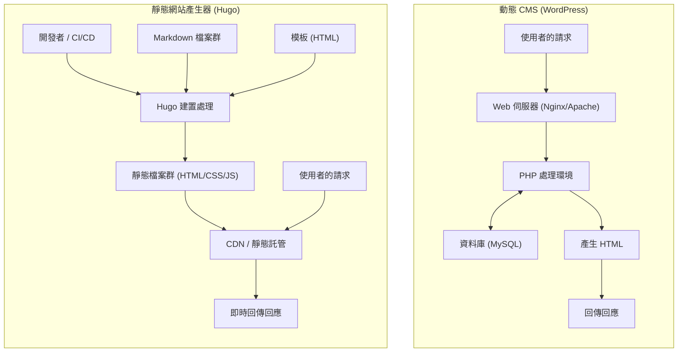
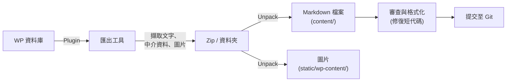

在現代的網頁開發與部落格營運中，網站的載入速度、安全性以及可維護性已成為極其重要的要素。長期以來在部落格與企業網站基底中佔據壓倒性市佔率的「WordPress」，憑藉其靈活的外掛生態系統與直覺的管理介面，受到廣大使用者的青睞。然而，由於其伴隨著與資料庫的通訊以及在伺服器端動態產生頁面（透過 PHP 處理），因此也存在著對流量突增的脆弱性以及顯示延遲（Latency）等課題。

因此，近年來「靜態網站產生器（SSG: Static Site Generator）」正迅速普及。本篇文章將深入探討在眾多 SSG 中，基於 Go 語言開發且以壓倒性建置速度聞名的「**Hugo**」。我們將從與 WordPress 等動態 CMS（Content Management System）的技術架構比較開始，徹底解說具體的移轉步驟、使用數理模型進行的效能評估，以及 Hugo 特有的目錄結構與模板的尋找順序（Lookup Order）。

---

## 1. 動態 CMS（WordPress）與靜態網站產生器（Hugo）的技術差異

在傳遞網站內容的機制上，WordPress 與 Hugo 採取了根本上不同的方法。

### 1.1 WordPress 的架構（動態產生）
WordPress 是動態 CMS 的代表，會在每次收到請求時於伺服器端組裝頁面。當使用者（瀏覽器）存取頁面時，網頁伺服器（Apache、Nginx 等）會執行 PHP 腳本，並向 MySQL（或 MariaDB）等關聯式資料庫發出查詢。接著將從資料庫取得的內容（文章資料、分類、標籤、網站設定等）與模板檔案結合，產生最終的 HTML 並回傳給客戶端。

這個機制的優點在於可以針對每位訪客即時產生不同的內容（例如：電商網站的購物車、登入使用者專屬頁面）。但是，除非妥善設計快取機制（如反向代理或外掛等），否則會劇烈消耗伺服器資源。

### 1.2 Hugo 的架構（建置時預先產生）
另一方面，Hugo 誠如「靜態網站產生器」其名，內容的產生並非在「請求時」，而是在「建置時」進行。內容不是儲存在資料庫中，而是作為由 Git 等版本控制系統管理的本機「Markdown 檔案」來保存。
當開發者執行指令（`hugo`）時，Hugo 會讀取 Markdown 檔案，將資料注入指定的 HTML 模板（佈局檔案）中，產生一組完整純粹的 HTML/CSS/JS 檔案集合。

產生出的檔案群（靜態資源）只需部署到 Amazon S3、Cloudflare Pages、Netlify、Vercel 或是簡單的 Nginx 伺服器等「靜態託管環境」即可進行發布。由於不需要資料庫與伺服器端語言（如 PHP），安全性風險（如 SQL 注入或 PHP 漏洞等）會急遽降低，且透過 CDN（Content Delivery Network）邊緣節點的快取，發布速度能達到極限的提升。

以下透過 Mermaid 圖表展示兩者架構的差異：



---

## 2. 透過數理模型進行效能評估

從 WordPress 移轉到 Hugo 的最大優勢之一就是效能（顯示速度）的提升。為了定量地理解這一點，我們試著用簡單的數學模型來表現。

頁面讀取完成所需的時間（Load Time: $T_{load}$），主要可分為伺服器的回應時間（TTFB: Time To First Byte）與瀏覽器的渲染及資源獲取時間（$T_{render}$）。

$$ T_{load} = T_{ttfb} + T_{render} $$

在動態 CMS（WordPress）的情況下，$T_{ttfb}$ 是以下要素的總和：網路延遲（$T_{network}$）、伺服器端腳本執行時間（$T_{php}$）、資料庫查詢處理時間（$T_{db}$）。

$$ T_{ttfb\_wp} = T_{network} + T_{php} + T_{db} $$

在存取集中的狀態（高負載時），$T_{php}$ 與 $T_{db}$ 會呈非線性增加，可能成為整個系統的瓶頸。以數學公式表示，相對於請求數（$N$），會出現如下的回應時間惡化（$k$ 為處理的負擔係數）。

$$ T_{php}(N) \approx O(N^k), \quad T_{db}(N) \approx O(N^k) \quad \text{where } k > 1 $$

另一方面，結合了靜態網站產生器（Hugo）與 CDN 的架構中，不存在伺服器端的動態處理（PHP 或 DB 查詢）。由於內容已被快取在分散於世界各地的邊緣伺服器中，$T_{ttfb}$ 純粹只取決於從客戶端到最近邊緣伺服器的網路延遲（$T_{edge}$）。

$$ T_{ttfb\_hugo} = T_{edge} $$

藉此，$T_{edge} \ll (T_{network} + T_{php} + T_{db})$ 成立，TTFB 將劇烈縮短至幾毫秒到幾十毫秒左右。此外，即使請求數 $N$ 增加，得益於邊緣伺服器的負載平衡功能，回應時間也能保持幾乎固定（$O(1)$）。

$$ \lim_{N \to \infty} T_{ttfb\_hugo}(N) \approx \text{Constant} $$

這就是 Hugo（靜態網站）對流量突增（如爆紅時）具有極高穩健性的數理依據。

---

## 3. Hugo 的基本結構與運作原理

要精通 Hugo，就必須理解其獨特的目錄結構以及「Front Matter」與「Template Lookup Order」的概念。

### 3.1 目錄結構詳細解說

建立新的 Hugo 專案（`hugo new site mysite`）時，會產生如下的目錄結構：

```text
mysite/
├── archetypes/   # 建立新內容時的模板（Front Matter 的雛形）
├── assets/       # 交由 Hugo Pipes 處理的檔案群（SCSS/Sass, JavaScript 等）
├── content/      # 實際的網站內容（Markdown 檔案群）。這裡將取代 DB。
├── data/         # 整個網站共用的外部資料與設定（JSON, TOML, YAML, CSV 等）
├── layouts/      # 決定網站外觀的 HTML 模板群（使用 Go html/template）
├── public/       # 執行建置指令後，產生的靜態檔案輸出的位置
├── static/       # 原封不動發布的靜態檔案（圖片、favicon、機器人用的文字檔等）
├── themes/       # 第三方或自製的主題目錄
└── hugo.toml     # 整個網站的設定檔（以前主要是 config.toml）
```

在 WordPress 中，內容會儲存在 MySQL 的 `wp_posts` 資料表中，但在 Hugo 則是全部作為 `content/` 目錄內的文字檔案（主要是 Markdown）來管理。這使得內容的版本控制（Git）變得容易。

### 3.2 內容管理：Markdown 與 Front Matter

Hugo 的每篇文章檔案最上方都會有一個被稱為「Front Matter（前置作業資料）」的中介資料區塊，其下方接著本文（Markdown）。Front Matter 可以使用 TOML、YAML、JSON 之一來撰寫，但最廣泛使用的是 YAML。

```yaml
---
title: "理解 Hugo 的分類系統"
date: 2026-09-13T10:00:00+09:00
draft: false
categories:
  - "技術解說"
tags:
  - "Hugo"
  - "Go"
aliases:
  - "/old-category/hugo-taxonomy/"
---
從這裡開始是本文。以 **Markdown** 進行撰寫。
將解說 Hugo 強大的功能...
```

這裡值得注意的是 `aliases` 鍵。從 WordPress 移轉時，如果永久連結（URL）改變，對 SEO 會帶來很大的負面影響。只要使用 Hugo 的別名功能指定舊 URL，Hugo 就會自動產生用於重新導向的 HTML（透過 meta refresh 進行轉址）。因為不需要設定伺服器端的重新導向（如 .htaccess 等），所以非常方便。

### 3.3 模板的尋找順序（Template Lookup Order）

Hugo 強大的功能之一就是靈活的模板尋找機制（Template Lookup Order）。Hugo 在渲染特定頁面時，為了找到最適合的模板，會以特定的順序搜尋目錄與檔案名稱。

例如，在繪製 `content/post/hello-world.md` 這篇單一文章（Single Page）時，Hugo 大致上會依照以下順序尋找佈局檔案：

1. `layouts/post/single.html`
2. `layouts/post/list.html` （雖然沒有錯，但通常是用於列表）
3. `layouts/_default/single.html`
4. `themes/<THEME_NAME>/layouts/post/single.html`
5. `themes/<THEME_NAME>/layouts/_default/single.html`

開發者無需直接修改主題的原始碼，只需在自己專案的 `layouts/` 目錄中建立相同名稱的檔案，就能**覆蓋（Override）**主題的模板。這樣一來，就能在不阻礙基礎主題更新的情況下，進行專屬的客製化。

### 3.4 分類系統（Taxonomy）

相當於 WordPress 的「分類」與「標籤」的分類系統，在 Hugo 中稱為「Taxonomy」。
Hugo 預設支援 `categories` 與 `tags` 兩種分類，但透過編輯 `hugo.toml`，可以自由加入自訂分類（例如：`series`、`authors` 等）。

```toml
# hugo.toml 的範例
[taxonomies]
  category = "categories"
  tag = "tags"
  series = "series"
  author = "authors"
```

如此一來，就能以多種維度對內容進行整理與條列化。

---

## 4. 從 WordPress 到 Hugo 的移轉流程（Migration）

從 WordPress 移轉到 Hugo 的成功關鍵，在於如何將資料庫內的動態內容乾淨地轉換成靜態檔案（Markdown + Front Matter），並維持既有的 URL 結構。

以下展示一般的移轉工作流程。



### 4.1 萃取資料並轉為 Markdown

為了將 WordPress 的資料輸出給 Hugo 使用，最簡單且確定的方法是使用專用的外掛。以下介紹幾種具代表性的方法。

1. **使用 Jekyll Exporter 外掛**
   由於 Hugo 與同為 SSG 的 Jekyll 在資料結構上非常相似，因此使用 WordPress 專用的「Jekyll Exporter」外掛是常見的做法。安裝並執行此外掛後，所有的文章與固定頁面都會被轉換成帶有 Front Matter 的 Markdown 檔案，並與圖片檔案群一起打包成 ZIP 檔供下載。
2. **利用 WordPress API 自製腳本**
   這是一種透過 Python 或 Node.js 等呼叫 WordPress 的 REST API (`/wp-json/wp/v2/posts`)，解析 JSON 資料並自行產生 Markdown 檔案的腳本方法。這對大量使用外掛無法完全支援的複雜自訂欄位（如 ACF 等）的網站非常有效。
3. **活用 wp2hugo 工具**
   也有利用 Go 語言等撰寫的 CLI 工具，直接從 WordPress 的匯出 XML 檔（WXR）轉換成 Hugo 格式的方法。

### 4.2 維持永久連結（URL）結構

為了繼承 SEO 的評價，維持 WordPress 時期的 URL 是非常重要的。如果 WordPress 中的永久連結設定為類似 `https://example.com/2026/09/13/my-post/` 的結構，請在 Hugo 的 `hugo.toml` 中指定永久連結的結構。

```toml
[permalinks]
  post = "/:year/:month/:day/:slug/"
```

或者，也可以在每篇文章的 Front Matter 內直接指定 `url` 參數，強制固定 URL。
此外，對於 URL 會變更的頁面，請使用前述的 `aliases` 來設定重新導向。

### 4.3 短代碼（Shortcode）的轉換

WordPress 特有的短代碼（例如：`[gallery]`、`[caption]`、各種外掛的專屬代碼），在匯出時通常會以原字串保留，因此需要進行處理。
可以使用取代腳本（sed 或 Python）將其一次性刪除，或者利用 Hugo 強大的**自訂短代碼功能**（在 `layouts/shortcodes/` 內建立專屬佈局），讓它們能在 Hugo 端正確地被渲染。

---

## 5. Hugo 的 CLI 工具與建置、部署

移轉作業完成後，終於要使用 Hugo 建置網站並向全世界發布了。作為 Go 語言二進位檔案提供的 Hugo，即使是擁有數千到數萬個頁面的網站，也擁有能在短短幾秒內完成建置的驚人速度。

### 5.1 啟動本機開發用伺服器

在撰寫文章或調整設計時，可以啟動本機伺服器。

```bash
# 開發伺服器的啟動指令（若要包含 Draft 文章則加上 -D）
hugo server -D
```

執行此指令後，即可在 `http://localhost:1313/` 預覽網站。Hugo 內建了強大的「LiveReload」功能，在您編輯並儲存 Markdown 檔案、模板或 CSS 的瞬間，瀏覽器畫面就會自動高速更新。這使得寫作與開發體驗遠比 WordPress 的管理介面舒適得多。

### 5.2 正式環境建置與效能最佳化

要產生用於部署到正式環境的靜態檔案，只需輸入 `hugo` 即可。

```bash
# 執行正式環境建置。透過 --minify 選項來最小化 HTML/CSS/JS
hugo --minify
```

透過此指令，整個網站的檔案會被輸出到 `public/` 目錄。加上 `--minify` 選項可以刪除不必要的換行與空白，進一步縮減檔案大小。這將直接貢獻於降低前述數學模型中的網路延遲（$T_{network}$）。

### 5.3 部署的自動化（CI/CD）

每次都在本機 PC 上產生靜態檔案，再用 FTP 等方式上傳是沒有效率的。在現代的 SSG 營運中，將 Push 至 Git 儲存庫（如 GitHub 等）作為觸發條件，自動進行建置與部署的 CI/CD 環境建構是最佳實踐。

例如，使用 GitHub Actions 部署至 Cloudflare Pages 或 GitHub Pages 的設定檔（YAML 檔案）基本形式如下：

```yaml
# .github/workflows/hugo.yml 的範例
name: Deploy Hugo site to GitHub Pages

on:
  push:
    branches: ["main"]
  workflow_dispatch:

permissions:
  contents: read
  pages: write
  id-token: write

jobs:
  build:
    runs-on: ubuntu-latest
    steps:
      - name: Checkout
        uses: actions/checkout@v3
        with:
          submodules: recursive # 若透過子模組管理主題時
          fetch-depth: 0

      - name: Setup Hugo
        uses: peaceiris/actions-hugo@v2
        with:
          hugo-version: 'latest'
          extended: true

      - name: Build
        run: hugo --minify

      - name: Upload artifact
        uses: actions/upload-pages-artifact@v2
        with:
          path: ./public

  deploy:
    environment:
      name: github-pages
      url: ${{ steps.deployment.outputs.page_url }}
    runs-on: ubuntu-latest
    needs: build
    steps:
      - name: Deploy to GitHub Pages
        id: deployment
        uses: actions/deploy-pages@v2
```

透過這樣的設定，只需執行「用 Markdown 寫文章並 Push 到 GitHub」的動作，幾分鐘後最新的網站就會公開到正式環境，完成了自動化管線。

---

## 6. 移轉後的 SEO 與營運面的優勢

完成從 WordPress 移轉至 Hugo 的網站營運者，大多能感受到以下三個顯著的優勢。

### 6.1 網站速度與 Core Web Vitals 的劇烈提升
排除了資料庫查詢與伺服器端渲染後，頁面載入時間縮短至毫秒等級。這將直接帶動 Google 排名因素「Core Web Vitals」（LCP、FID/INP、CLS）分數的大幅提升。可以期待使用者跳出率的降低以及 SEO 評價的提升。

### 6.2 擺脫安全威脅
因為 WordPress 在全世界被廣泛使用，所以總是成為攻擊目標。伴隨著被利用外掛漏洞進行竄改，或是遭到暴力破解突破登入等風險。
然而，由 Hugo 產生的靜態網站，既沒有資料庫也沒有 PHP 環境，甚至連管理介面（登入表單）都不存在。駭客根本沒有入侵伺服器篡改資料庫的餘地，安全風險幾乎降至極限的零。

### 6.3 免維護的營運
在 WordPress 的營運中，需要不斷進行核心程式升級、外掛更新、跟進 PHP 版本等永無止盡的維護作業。總是需要擔心因相容性問題導致網站崩壞的風險。
而在 Hugo 的情況，只需要視需求進行工具本身的更新即可，網站程式碼本身是獨立的文字檔案群，因此擁有「放著不管也不會壞」的壓倒性安心感。

---

## 7. 總結

本篇文章從技術架構的差異、透過數理模型的效能證明，到具體的移轉步驟，詳細解說了從 WordPress 這種動態 CMS 移轉到基於 Go 語言強大的靜態網站產生器「Hugo」的過程。

移轉至靜態網站產生器雖然需要初期的學習成本（Git 的操作、Markdown 的語法、從終端機執行 CLI 指令、理解模板引擎的規範等），但它所帶來的是「壓倒性的顯示速度」、「堅固的安全性」以及「免維護」等足以彌補這些成本的豐厚回報。

如果您的網站不需要頻繁更改設計或複雜的動態處理（如會員專屬功能或進階的電商功能），且主要目的是發布資訊（部落格、媒體、企業網站），那麼移轉到 Hugo 將會是最有效的技術投資之一。請務必參考本篇文章，邁出使用 Hugo 營運次世代網站的第一步。
