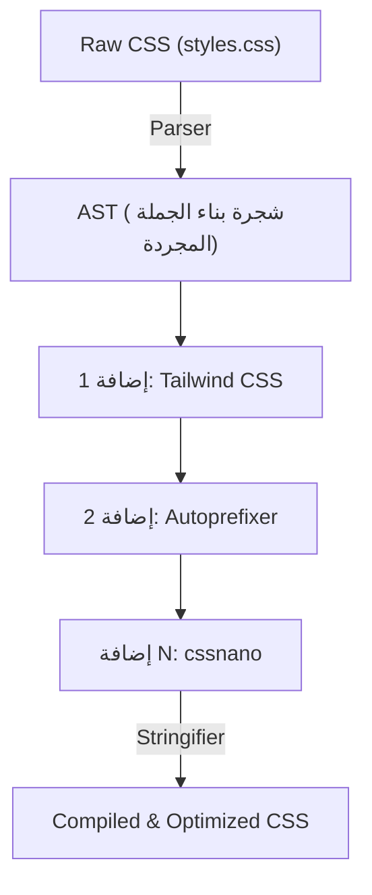
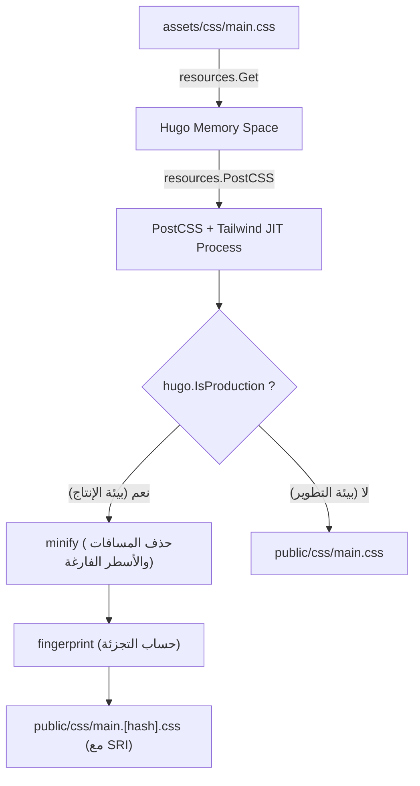

# مقدمة: التآزر القوي بين مولد المواقع الثابتة Hugo و Tailwind CSS

في تطوير الواجهات الأمامية للويب الحديث، يعد تحقيق التوازن بين الأداء وتجربة المطور (DX: Developer Experience) أحد أهم التحديات في كل مشروع. الجمع بين **Hugo**، الذي يتميز بسرعات بناء من بين الأسرع عالمياً في مولدات المواقع الثابتة (SSG)، و **Tailwind CSS**، الذي جلب نموذجاً مبتكراً يعطي الأولوية للخدمات (Utility-first)، يمكن اعتباره حلاً جذرياً لهذا التحدي.

تمت كتابة Hugo بلغة Go، ولديه أداء مذهل يتيح له إكمال بناء موقع يحتوي على آلاف الصفحات في ثوانٍ معدودة، أو حتى في أجزاء من الثانية. من ناحية أخرى، من خلال كتابة عدد لا يحصى من فئات الخدمات المعرفة مسبقًا (مثل `flex`, `text-center`, `mt-4`) مباشرة في HTML، يقضي Tailwind CSS على الحاجة للتبديل بين ملفات CSS و HTML، مما يسرع عملية تكرار التصميم.

في هذا المقال، سنشرح بالتفصيل الدقيق ومن وجهة نظر شاملة - بدءًا من أساسيات البنية المعمارية وصولاً إلى منظور التحسين الرياضي للأداء - خطوات إدراج Tailwind CSS في سمة Hugo، وبناء مسار موارد متقدم (Hugo Pipes) باستخدام PostCSS.

---

## 1. فئات الخدمات لـ CSS وتطور التوجه القائم على المكونات

قبل الدخول في خطوات إدراج Tailwind CSS، من المفيد جداً أن نفهم بعمق تاريخ وتطور فلسفة تصميم CSS التي تكمن وراء سبب وجوب استخدامنا لـ Tailwind CSS.

### حدود تصميم CSS التقليدي (BEM و OOCSS)
في تطوير الويب سابقاً، كان من أفضل الممارسات إعطاء أسماء فئات ذات دلالات (Semantic). على سبيل المثال، عند إنشاء مكون بطاقة (Card)، كنا نفصل بين HTML و CSS كالتالي:

```html
<div class="card">
  
  <div class="card__content">
    <h2 class="card__title">العنوان</h2>
    <p class="card__description">النص التوضيحي يكتب هنا.</p>
  </div>
</div>
```

```css
.card {
  border-radius: 8px;
  box-shadow: 0 4px 6px rgba(0,0,0,0.1);
  background-color: #ffffff;
  overflow: hidden;
}
.card__title {
  font-size: 1.5rem;
  font-weight: bold;
  color: #333333;
}
/* تستمر الأنماط التفصيلية لاحقاً */
```

مثل هذا التصميم القائم على BEM (Block Element Modifier) يعمل جيداً عندما يكون حجم المشروع صغيراً، ولكنه يميل إلى التسبب في المشاكل التالية:

1. **استنفاد وإرهاق في التسمية**: في كل مرة تنشئ فيها مكوناً مشابهاً، عليك التفكير في أسماء فئات جديدة (مثل: `card-news`، `card-featured`).
2. **تضخم CSS**: مع إضافة كل ميزة جديدة، يزداد عدد أسطر CSS. وبمجرد كتابة CSS، نادراً ما يتم حذفه بسبب الخوف من "عدم معرفة أين يتم استخدامه"، مما يؤدي إلى تراكم الأكواد الميتة.
3. **تبديل السياق**: نظرًا لأنه يتم إدارة بنية HTML وأنماط CSS في ملفات منفصلة، فإن عدد مرات التبديل بين علامات التبويب في المحرر يزداد بشكل كبير.

### التحول النموذجي بواسطة Tailwind CSS
يحل Tailwind CSS هذه المشاكل من خلال نهج "دمج فئات الخدمات". يبدو مكون البطاقة المذكور أعلاه كالتالي عند استخدام Tailwind CSS:

```html
<div class="rounded-lg shadow-md bg-white overflow-hidden">
  
  <div class="p-6">
    <h2 class="text-2xl font-bold text-gray-800">العنوان</h2>
    <p class="mt-2 text-gray-600">النص التوضيحي يكتب هنا.</p>
  </div>
</div>
```

نظراً لأن اسم الفئة نفسه يمثل القيمة الدقيقة للنمط (مثل `p-6` تعني `padding: 1.5rem;`)، يمكنك التنبؤ بنتيجة العرض النهائية بمجرد النظر إلى HTML. علاوة على ذلك، من خلال مترجم JIT (Just-In-Time) الخاص بـ Tailwind، يتم استخراج الفئات المستخدمة بالفعل فقط إلى ملف CSS المخصص للإنتاج، مما يقلل حجم ملف CSS إلى أدنى حد ممكن.

---

## 2. بنية Hugo Pipes و PostCSS

لدمج Tailwind CSS في Hugo، تحتاج إلى فهم مسار معالجة الموارد الذي يُسمى **Hugo Pipes**. تعد Hugo Pipes ميزة قوية تنجز جميع العمليات المتعلقة بالموارد داخلياً في Hugo، مثل تجميع Sass/SCSS، وحزم ودمج (Minify) JavaScript، وتنفيذ **PostCSS** الذي سنستخدمه في هذا المقال.

PostCSS هي أداة لتحويل CSS باستخدام إضافات JavaScript. في الواقع، يعمل Tailwind CSS نفسه كإضافة لـ PostCSS.

### آلية تحويل AST (شجرة بناء الجملة المجردة) عبر PostCSS

إن فهم كيفية معالجة PostCSS لملفات CSS مفيد للغاية عند استكشاف الأخطاء وإصلاحها. يوضح مخطط Mermaid التالي المسار من قراءة PostCSS لملف CSS، وتحويله عبر الإضافات، حتى إخراج ملف CSS النهائي.



1. **Parser (المحلل)**: يقوم بتحليل سلسلة CSS الخام المدخلة ويحولها إلى شجرة بناء الجملة المجردة (AST)، وهي بنية بيانات يمكن معالجتها برمجيًا.
2. **Plugins (مجموعة الإضافات)**:
   - **Tailwind CSS**: يمسح ملفات القالب (HTML أو Markdown) ويستخرج فئات الخدمات المستخدمة كعقد إضافية على شجرة AST. كما أنه يوسع التوجيهات مثل `@tailwind`.
   - **Autoprefixer**: يراجع قاعدة بيانات `Can I Use` ويضيف البادئات الخاصة بالمتصفحات (مثل `-webkit-`, `-moz-`) إلى خصائص AST عند الحاجة.
3. **Stringifier (محول السلاسل)**: بعد اكتمال التحويل، يقوم بتحويل شجرة AST مرة أخرى إلى سلاسل CSS يمكن للمتصفح فهمها لإخراجها.

---

## 3. إعداد البيئة والمتطلبات الأساسية

دعونا نبدأ بخطوات الإدراج الفعلية. أولاً، تحقق مما إذا كانت البرامج الضرورية مثبتة.

### المتطلبات الأساسية

1. **Hugo Extended Version (النسخة الموسعة من Hugo)**:
   بدلاً من الإصدار العادي من Hugo، تعد **النسخة الموسعة** التي تتضمن وظيفة معالجة Sass/SCSS وميزات دعم PostCSS مدمجة ضرورية. قم بتشغيل الأمر التالي في الطرفية (Terminal) وتأكد من أن السلسلة `extended` متضمنة في معلومات الإصدار.

   ```bash
   hugo version
   # مثال للإخراج المتوقع:
   # hugo v0.121.2-4146... windows/amd64 BuildDate=... VendorInfo=gohugoio +extended
   ```

2. **Node.js و npm**:
   تعمل حزم التبعيات مثل Tailwind CSS و PostCSS على بيئة Node.js. تأكد من تثبيت Node.js (يُفضل إصدار الدعم طويل الأمد LTS).

   ```bash
   node -v
   npm -v
   ```

### تثبيت حزم npm

قم بتهيئة npm في دليل الجذر للمشروع (الدليل الذي يحتوي على ملف إعداد Hugo `hugo.toml`)، وقم بتثبيت الحزم المطلوبة.

```bash
# إنشاء ملف package.json
npm init -y

# تثبيت Tailwind CSS، و PostCSS، و Autoprefixer كتبعيات تطوير
npm install -D tailwindcss postcss postcss-cli autoprefixer
```

> [!IMPORTANT]
> إذا لم يتم تثبيت `postcss-cli`، فقد تحدث أخطاء عند استدعاء PostCSS من داخل Hugo. تستخدم Hugo Pipes برنامج `postcss-cli` داخلياً، لذا تأكد من تثبيته.

---

## 4. بناء ملفات التكوين (PostCSS و Tailwind CSS)

بعد اكتمال تثبيت الحزم، سننشئ ملفي تكوين مهمين يتحكمان في سلوك المشروع. ضعهما في دليل الجذر للمشروع.

### إنشاء ملف tailwind.config.js

قم بتنفيذ الأمر التالي في الطرفية لإنشاء ملف التكوين الافتراضي.

```bash
npx tailwindcss init
```

افتح ملف `tailwind.config.js` الذي تم إنشاؤه في المحرر، وقم بإعداد خاصية `content`. هذا الجزء مهم جداً. بناءً على المسارات المحددة هنا، يقوم Tailwind بتحليل الملفات واستخراج الفئات المستخدمة. وفقاً لهيكلية مشروع Hugo، حدد ملفات التخطيط والمحتوى بدقة.

```javascript
/** @type {import('tailwindcss').Config} */
module.exports = {
  // تحديد الملفات المراد مسحها وفقًا لهيكل دليل Hugo
  content: [
    "./content/**/*.md",
    "./content/**/*.html",
    "./layouts/**/*.html",
    "./assets/**/*.js",
    // إذا كنت تستخدم سمة مخصصة، يجب تضمين دليل السمة أيضًا
    // "./themes/my-theme/layouts/**/*.html",
  ],
  theme: {
    extend: {
      // قم بإضافة الألوان والخطوط المخصصة هنا
      colors: {
        'brand-primary': '#3490dc',
        'brand-secondary': '#ffed4a',
      },
      fontFamily: {
        'sans': ['Helvetica Neue', 'Arial', 'Hiragino Kaku Gothic ProN', 'Meiryo', 'sans-serif'],
      }
    },
  },
  plugins: [
    // أضف الإضافات الرسمية حسب الحاجة (مثل: Typography plugin)
    // require('@tailwindcss/typography'),
  ],
}
```

### إنشاء ملف postcss.config.js

بعد ذلك، قم بإنشاء ملف `postcss.config.js` في جذر المشروع لتعريف أي الإضافات سينفذها PostCSS وبأي ترتيب.

```javascript
module.exports = {
  plugins: {
    tailwindcss: {},
    autoprefixer: {},
  }
}
```

باستخدام هذا الإعداد، عندما يقوم Hugo باستدعاء PostCSS، ستتم معالجة Tailwind CSS أولاً، تليها إضافة Autoprefixer للبادئات الخاصة بالمتصفحات.

---

## 5. بناء مسار موارد CSS في Hugo

بعد إتمام الإعدادات، سنقوم بدمج Tailwind CSS في جانب سمة Hugo.

### 5-1. إنشاء ملف CSS كنقطة إدخال

في الدليل `assets/css/` (قم بإنشائه إن لم يكن موجوداً)، قم بإنشاء ملف CSS ليكون نقطة الإدخال. هنا سنسميه `main.css`.

**مسار الملف: `assets/css/main.css`**

```css
/* استيراد الأنماط الأساسية لـ Tailwind (مثل إعادة تعيين CSS) */
@tailwind base;

/* استيراد فئات المكونات */
@tailwind components;

/* استيراد فئات الخدمات */
@tailwind utilities;

/* إذا كنت بحاجة إلى كتابة CSS مخصص، يمكنك إضافته هنا،
   ولكن يفضل استخدام extend في tailwind.config.js قدر الإمكان */
@layer components {
  .btn-primary {
    @apply bg-blue-500 hover:bg-blue-700 text-white font-bold py-2 px-4 rounded transition-colors duration-300;
  }
}
```

### 5-2. تعديل ملف التخطيط (head.html)

بعد ذلك، ستقوم بقراءة ملف CSS أعلاه من قوالب Hugo، وكتابة المسار لمعالجته بواسطة PostCSS. عادةً يتم تعديل القالب الجزئي الذي يُعرّف داخل الوسم `<head>` (مثل: `layouts/partials/head.html`).

**مسار الملف: `layouts/partials/head.html`**

```go-html-template
<head>
  <meta charset="utf-8">
  <meta name="viewport" content="width=device-width, initial-scale=1">
  <title>{{ .Title }} | {{ .Site.Title }}</title>

  <!-- جلب assets/css/main.css -->
  {{ $css := resources.Get "css/main.css" }}

  <!-- تعريف خيارات PostCSS -->
  {{ $options := dict "inlineImports" true }}
  {{ $css = $css | resources.PostCSS $options }}

  <!-- مسار تحسين الموارد لبيئة الإنتاج (Production) -->
  {{ if hugo.IsProduction }}
    <!-- 1. الضغط (Minify) -->
    {{ $css = $css | minify }}
    <!-- 2. البصمة (إضافة تجزئة لكسر ذاكرة التخزين المؤقت - Fingerprint) -->
    {{ $css = $css | fingerprint "sha512" }}
    <!-- 3. إخراج الوسم مع تكامل الموارد الفرعية (SRI) -->
    <link rel="stylesheet" href="{{ $css.RelPermalink }}" integrity="{{ $css.Data.Integrity }}" crossorigin="anonymous">
  {{ else }}
    <!-- في بيئة التطوير (Development)، أخرجه كما هو بدون ضغط (لأولوية سرعة البناء) -->
    <link rel="stylesheet" href="{{ $css.RelPermalink }}">
  {{ end }}
</head>
```

#### شرح المسار ورسمه التوضيحي باستخدام Mermaid

يوضح الرسم التالي كيف يقوم كود قوالب Go المذكور أعلاه بمعالجة ملف CSS في سلسلة من عمليات المسار.



1. **`resources.Get`**: يبحث عن الملف المحدد داخل دليل `assets`، ويقوم بتحميله ككائن موارد في الذاكرة.
2. **`resources.PostCSS`**: يشير إلى ملف `postcss.config.js` في جذر المشروع ويُطبق عمليات Tailwind CSS و Autoprefixer على الكود المصدري لـ CSS. في بيئة التطوير (`hugo server`)، يعمل وضع JIT، الذي يقوم بإنشاء الفئات الضرورية بسرعة فائقة فقط عند تعديل الملفات.
3. **`minify`**: عند بناء نسخة بيئة الإنتاج (مثلاً عبر `hugo --environment production`)، يتم حذف المسافات والتعليقات غير الضرورية، وتقليل حجم الملف إلى أدنى حد ممكن.
4. **`fingerprint`**: يقوم بحساب تجزئة SHA بناءً على محتوى الملف ويضيفها إلى اسم الملف (مثل: `main.ab12cd...css`). هذا يحقق "كسر ذاكرة التخزين المؤقت" حيث يتم التأكد من أن المتصفح يحمل ملفاً جديداً عند تحديث CSS، مع الاستفادة من ميزة التخزين المؤقت القوية للمتصفح.
5. **`integrity`**: يستخدم قيمة التجزئة المحسوبة عبر البصمة لإخراج خاصية SRI لمنع التلاعب من قبل شبكات توصيل المحتوى (CDN) وغيرها.

---

## 6. التحليل الرياضي للأداء في تحسين CSS

تعتبر إحدى أكبر ميزات إدراج Tailwind CSS هي تقليل حجم ملف CSS المرسل إلى أدنى حد. دعونا نحلل كمياً كيف يؤثر ذلك على أداء الويب (وخاصة على First Contentful Paint: FCP) باستخدام نماذج رياضية.

### نموذج تقليل حجم ملف CSS

في أطر عمل CSS التقليدية (مثل Bootstrap)، يميل حجم الملف $S_{original}$ إلى أن يكون كبيراً (حوالي 150 كيلوبايت - 200 كيلوبايت) لأنه يتم تحميل جميع الأنماط، بما في ذلك تلك غير المستخدمة.
إذا رمزنا لحجم الملف بعد إزالة الفئات غير المستخدمة بواسطة مترجم JIT الخاص بـ Tailwind كـ $S_{purged}$، وباستخدام نسبة التقليل $R_{purge}$، يمكن التعبير عنها كما يلي:

$$
S_{purged} = S_{original} \times (1 - R_{purge})
$$

في المشاريع النموذجية، تصل نسبة $R_{purge}$ إلى ما يقرب من $0.9$ (تخفيض بنسبة 90%)، وينحصر حجم $S_{purged}$ في حوالي 10 كيلوبايت - 20 كيلوبايت فقط.

بالإضافة إلى ذلك، يتم ضغط الملف عبر Brotli أو Gzip على جانب الخادم أثناء النقل. إذا كانت نسبة الضغط $R_{compress}$ (عادة ما تكون حوالي 0.7 إلى 0.8)، يتم حساب حجم الحمولة النهائية عبر الشبكة $S_{final}$ باستخدام المعادلة التالية:

$$
S_{final} = S_{purged} \times (1 - R_{compress})
$$

### مسار العرض الحرج وتأخير الشبكة

يمكن تقريب الوقت المستغرق حتى يرسم المتصفح المحتوى الأولي على الشاشة (FCP) عن طريق مجموع وقت تنزيل HTML، ووقت تنزيل CSS، ووقت العرض.

$$
T_{FCP} \approx RTT + \frac{S_{HTML}}{BW} + RTT + \frac{S_{final}}{BW} + T_{render}
$$

حيث أن:
- $RTT$: زمن الرحلة ذهاباً وإياباً (وقت تأخير الاتصال بالخادم)
- $BW$: عرض النطاق الترددي للشبكة (Bandwidth)

في بيئات مثل شبكات الهاتف المحمول حيث يكون $BW$ ضيقًا و $RTT$ كبيرًا (تأخير كبير)، فإن نهج Tailwind CSS في تقليل $S_{final}$ إلى بضعة كيلوبايتات يؤدي إلى دفع قيمة $\frac{S_{final}}{BW}$ قريباً من الصفر، مما يصبح محركاً أساسياً لتحقيق درجات مذهلة في أدوات الأداء (مثل Google PageSpeed Insights).

---

## 7. تشغيل خادم التطوير والتحقق من التحديث التلقائي (Hot Reload)

بعد اكتمال جميع الإعدادات، قم بتشغيل خادم التطوير الخاص بـ Hugo وتأكد من أن Tailwind CSS يعمل بشكل صحيح.

```bash
hugo server -D
```

انتقل إلى `http://localhost:1313/` عبر المتصفح وتحقق من عرض الموقع.
افتح ملف محتوى Markdown أو أحد قوالب Hugo (الملفات الموجودة تحت `layouts/`)، وحاول إضافة فئات جديدة.

```html
<!-- مثال تطبيقي لفئات Tailwind بغرض الاختبار -->
<div class="bg-gradient-to-r from-blue-500 to-purple-600 text-white p-8 rounded-xl shadow-2xl text-center transform transition duration-500 hover:scale-105">
  <h1 class="text-4xl font-extrabold tracking-tight">Tailwind CSS + Hugo is Awesome!</h1>
  <p class="mt-4 text-lg font-medium">يرجى التأكد من أن التحديث التلقائي ينعكس في لمح البصر.</p>
</div>
```

بمجرد حفظ الملف، ستختبر المتعة حيث يعمل متتبع الملفات القوي في Hugo بالتعاون مع مترجم JIT في Tailwind معاً لإعادة بناء CSS في أجزاء من الثانية، مما يؤدي إلى إعادة تحميل المتصفح تلقائياً (التحديث التلقائي - Hot Reload).

### استكشاف الأخطاء وإصلاحها: ماذا لو لم تنعكس الأنماط؟

إذا لم تنعكس التغييرات، فتحقق من النقاط التالية:

1. **إعداد مسار `content` في `tailwind.config.js`**
   إذا كانت مسارات الملفات المستهدفة خاطئة، فلن يتمكن Tailwind من اكتشاف الفئات المستخدمة داخلها ولن يضيفها إلى CSS. إذا كنت تستخدم سمة مخصصة خاصة، فتأكد من أن مسار دليل السمة لم يتم إسقاطه.
2. **أخطاء PostCSS**
   إذا رأيت خطأً في سجلات خادم Hugo في الطرفية مثل `Error: failed to transform resource: PostCSS not found`، فقد يعني ذلك أن الأمر `npm install` لم ينفذ بشكل صحيح، أو أن `postcss-cli` مفقود.
3. **مسح ذاكرة التخزين المؤقت لـ Hugo**
   في حالات نادرة، قد يتسبب التخزين المؤقت في Hugo في الإبقاء على كود CSS القديم. أوقف الخادم وابدأه باستخدام الأمر `hugo server --ignoreCache`، أو حاول حذف الدليل المؤقت في نظام التشغيل (مثل `/tmp/hugo_cache/`).

---

## 8. البناء لبيئة الإنتاج ومزيد من التحسينات

عند نشر موقعك على خادم الإنتاج (مثل Netlify، Vercel، GitHub Pages، Cloudflare Pages، إلخ)، يجب عليك تعيين متغيرات البيئة وتشغيل مسار التحسين الخاص ببيئة الإنتاج.

```bash
# مثال لأمر البناء للإنتاج
NODE_ENV=production hugo --minify --environment production
```

عن طريق إضافة علم `--environment production`، يتم تنفيذ كتلة `{{ if hugo.IsProduction }}` داخل ملف `head.html`، وتطبيق تصغير لحجم CSS (Minify) وإضافة البصمة (Fingerprint).

### تنسيق Markdown باستخدام إضافة Typography

في المواقع المبنية على المدونات أو الوثائق مثل Hugo، لا يمكنك إضافة فئات مباشرة إلى عناصر HTML النقية التي يتم إنشاؤها من Markdown (مثل `<h1>`، `<p>`، `<ul>` وما إلى ذلك). في مثل هذه الحالات، من المفيد جدًا استخدام إضافة **Typography** الرسمية من Tailwind.

1. تثبيت الإضافة
   ```bash
   npm install -D @tailwindcss/typography
   ```

2. إضافتها إلى `tailwind.config.js`
   ```javascript
   module.exports = {
     // ...
     plugins: [
       require('@tailwindcss/typography'),
     ],
   }
   ```

3. تطبيقها في القوالب
   من خلال إضافة فئة `prose` (ويمكنك إضافة تغيرات الحجم واللون حسب الرغبة) فقط إلى حاوية العنصر الذي يخرج محتوى المقالة، سيتم تطبيق أنماط افتراضية جميلة.

   ```go-html-template
   <article class="prose prose-lg prose-blue mx-auto mt-10">
     {{ .Content }}
   </article>
   ```

بفضل ذلك، لم تعد هناك أي حاجة لكتابة محددات CSS معقدة يدويًا (مثل `.article-content h2 { ... }`)، مما يضمن الحفاظ التام على نموذجية المكونات.

---

## 9. الخلاصة: اكتمال نظام واجهة أمامية عالي القابلية للصيانة

أحسنت العمل! مع هذا، اكتمل لديك مسار موارد الويب المثالي الذي يجمع بين محرك توليد المواقع الثابتة فائق السرعة لـ Hugo، وقدرات التنسيق الحديثة لـ Tailwind CSS، وقابلية التوسع لـ PostCSS.

الشيء الرائع في هذه البنية هو أنك **"تحتاج إلى ضبط الإعدادات مرة واحدة فقط في البداية"**. بمجرد بناء المسار، يمكن للمطورين البدء في تجميع واجهات المستخدم المعقدة بسرعة مذهلة وببساطة عبر كتابة فئات الخدمات البديهية في قوالب HTML أو Markdown، دون الحاجة لفتح ملف CSS.

علاوة على ذلك، نظراً لأن حجم CSS الناتج يكون دائماً في حده الأدنى، فإن ذلك ينعكس بشكل مباشر على تحسين درجات Core Web Vitals، مما يمنحك ميزة كبيرة من منظور تحسين محركات البحث (SEO).

يظل الجمع بين Hugo و Tailwind CSS أحد "أفضل الخيارات" لأي مشروع، من المدونات التقنية الشخصية إلى مواقع الشركات الضخمة. تأكد من الاستفادة من سلسلة الأدوات القوية هذه واستمتع بتجربة تطوير ويب مريحة!
