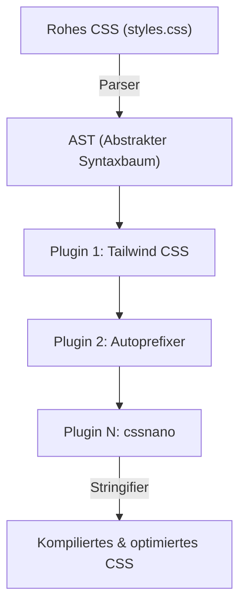
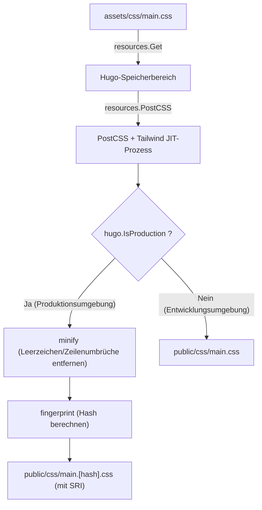

# Einführung: Die starke Synergie zwischen dem Static Site Generator Hugo und Tailwind CSS

In der modernen Web-Frontend-Entwicklung ist die Vereinbarkeit von Leistung und Entwicklererfahrung (DX: Developer Experience) eines der wichtigsten Anliegen in jedem Projekt. Die Kombination von **Hugo**, das unter den Static Site Generatoren (SSG) zu den schnellsten der Welt gehört, mit **Tailwind CSS**, das das innovative Paradigma "Utility-First" eingeführt hat, kann als ultimative Lösung für dieses Problem angesehen werden.

Hugo ist in Go geschrieben und bietet eine unglaubliche Leistung, mit der Builds selbst für Websites mit Tausenden von Seiten in nur wenigen Sekunden oder Millisekunden abgeschlossen werden. Andererseits ermöglicht Tailwind CSS das direkte Schreiben unzähliger vordefinierter Utility-Klassen (z. B. `flex`, `text-center`, `mt-4`) in HTML, wodurch der Kontextwechsel zwischen CSS- und HTML-Dateien entfällt und Design-Iterationen beschleunigt werden.

In diesem Artikel werden wir die Schritte zur Integration von Tailwind CSS in ein Hugo-Theme und zum Aufbau einer fortschrittlichen Asset-Pipeline (Hugo Pipes) mit PostCSS im Detail erläutern – von den Grundlagen der Architektur bis hin zu mathematischen Leistungsoptimierungen.

---

## 1. Die Entwicklung von Utility-First CSS und komponentenbasiertem Design

Bevor wir zu den Schritten für die Integration von Tailwind CSS übergehen, ist es sehr hilfreich, die Geschichte und Entwicklung der CSS-Design-Philosophie zu verstehen, um zu begreifen, warum wir Tailwind CSS verwenden sollten.

### Die Grenzen des traditionellen CSS-Designs (BEM und OOCSS)
In der Vergangenheit galt es in der Webentwicklung als Best Practice, semantische Klassennamen zu vergeben. Wenn man beispielsweise eine Kartenkomponente erstellte, trennte man HTML und CSS wie folgt:

```html
<div class="card">
  
  <div class="card__content">
    <h2 class="card__title">Titel</h2>
    <p class="card__description">Die Beschreibung wird hier eingefügt.</p>
  </div>
</div>
```

```css
.card {
  border-radius: 8px;
  box-shadow: 0 4px 6px rgba(0,0,0,0.1);
  background-color: #ffffff;
  overflow: hidden;
}
.card__title {
  font-size: 1.5rem;
  font-weight: bold;
  color: #333333;
}
/* Im Folgenden würden detailliertere Stile stehen */
```

Dieser auf BEM (Block Element Modifier) basierende Entwurf funktioniert bei kleinen Projekten gut, führt aber häufig zu den folgenden Problemen:

1. **Erschöpfung und Ermüdung bei der Namensgebung**: Jedes Mal, wenn eine ähnliche Komponente erstellt wird, muss man sich neue Klassennamen ausdenken (z. B. `card-news`, `card-featured`).
2. **Aufblähen von CSS**: Die Anzahl der CSS-Zeilen wächst mit jeder neuen Funktion, und einmal geschriebenes CSS wird selten gelöscht, aus Angst, man wisse nicht, "wo es verwendet wird", wodurch sich toter Code ansammelt.
3. **Kontextwechsel**: Da HTML-Struktur und CSS-Stile in separaten Dateien verwaltet werden, steigt die Anzahl der Tab-Wechsel im Editor exponentiell an.

### Paradigmenwechsel durch Tailwind CSS
Tailwind CSS löst diese Probleme durch einen Ansatz, der auf der "Kombination von Utility-Klassen" basiert. Wenn wir Tailwind CSS auf die obige Kartenkomponente anwenden, sieht das so aus:

```html
<div class="rounded-lg shadow-md bg-white overflow-hidden">
  
  <div class="p-6">
    <h2 class="text-2xl font-bold text-gray-800">Titel</h2>
    <p class="mt-2 text-gray-600">Die Beschreibung wird hier eingefügt.</p>
  </div>
</div>
```

Da die Klassennamen selbst spezifische Stilwerte darstellen (`p-6` steht z. B. für `padding: 1.5rem;` usw.), kann man allein durch das Betrachten des HTMLs das endgültige Rendering-Ergebnis vorhersagen. Darüber hinaus extrahiert der JIT (Just-In-Time) Compiler von Tailwind nur die tatsächlich verwendeten Klassen in die endgültige CSS-Datei für die Produktion, wodurch die Dateigröße des CSS auf ein Minimum reduziert wird.

---

## 2. Die Architektur von Hugo Pipes und PostCSS

Um Tailwind CSS in Hugo zu integrieren, muss man die Asset-Verarbeitungs-Pipeline namens **Hugo Pipes** verstehen. Hugo Pipes ist eine leistungsstarke Funktion, die alle assetbezogenen Prozesse – wie die Kompilierung von Sass/SCSS, das Bündeln und Minifizieren von JavaScript und die Ausführung von **PostCSS**, das wir hier verwenden werden – innerhalb von Hugo selbst abschließt.

PostCSS ist ein Tool zum Transformieren von CSS mithilfe von JavaScript-Plugins. Tatsächlich funktioniert auch Tailwind CSS selbst als PostCSS-Plugin.

### Der AST (Abstract Syntax Tree) Transformationsmechanismus in PostCSS

Zu verstehen, wie PostCSS CSS verarbeitet, ist bei der Fehlersuche enorm hilfreich. Das folgende Mermaid-Diagramm zeigt die Pipeline, in der PostCSS eine CSS-Datei einliest, sie mithilfe von Plugins konvertiert und das endgültige CSS ausgibt.



1. **Parser**: Analysiert die eingegebene rohe CSS-Zeichenfolge und wandelt sie in einen AST (Abstrakter Syntaxbaum) um, eine Datenstruktur, die programmgesteuert manipuliert werden kann.
2. **Plugins**:
   - **Tailwind CSS**: Scannt Vorlagendateien (HTML oder Markdown) und fügt dem AST Knoten für die verwendeten Utility-Klassen hinzu. Es löst auch `@tailwind`-Direktiven auf.
   - **Autoprefixer**: Bezieht sich auf die `Can I Use`-Datenbank und fügt dem AST bei Bedarf Vendor-Präfixe (`-webkit-`, `-moz-` usw.) als Eigenschaften hinzu.
3. **Stringifier**: Konvertiert den transformierten AST zurück in eine CSS-Zeichenfolge, die vom Browser interpretiert werden kann, und gibt diese aus.

---

## 3. Umgebungseinrichtung und Voraussetzungen

Lassen Sie uns nun mit dem eigentlichen Integrationsprozess beginnen. Zuerst überprüfen wir, ob die benötigte Software installiert ist.

### Voraussetzungen

1. **Hugo Extended Version**:
   Sie benötigen die **Extended-Version**, die Sass/SCSS-Verarbeitungsfunktionen und native PostCSS-Integration enthält, anstelle der regulären Hugo-Version. Führen Sie den folgenden Befehl im Terminal aus und stellen Sie sicher, dass die Versionsinformationen die Zeichenfolge `extended` enthalten.

   ```bash
   hugo version
   # Erwartete Ausgabe:
   # hugo v0.121.2-4146... windows/amd64 BuildDate=... VendorInfo=gohugoio +extended
   ```

2. **Node.js und npm**:
   Abhängigkeiten wie Tailwind CSS und PostCSS laufen auf Node.js. Stellen Sie sicher, dass Node.js (LTS-Version empfohlen) installiert ist.

   ```bash
   node -v
   npm -v
   ```

### Installation der npm-Pakete

Initialisieren Sie npm im Stammverzeichnis Ihres Projekts (der Ebene, auf der sich Hugos Konfigurationsdatei `hugo.toml` befindet) und installieren Sie die benötigten Pakete.

```bash
# Erzeugen der package.json
npm init -y

# Installieren von Tailwind CSS, PostCSS und Autoprefixer als Entwicklungsabhängigkeiten
npm install -D tailwindcss postcss postcss-cli autoprefixer
```

> [!IMPORTANT]
> Wenn `postcss-cli` nicht installiert ist, kann ein Fehler auftreten, wenn Hugo versucht, PostCSS intern aufzurufen. Hugo Pipes verwendet intern `postcss-cli`, also stellen Sie sicher, dass es installiert ist.

---

## 4. Konfigurationsdateien erstellen (PostCSS & Tailwind CSS)

Nachdem die Pakete installiert sind, erstellen wir zwei wichtige Konfigurationsdateien, die das Verhalten des Projekts steuern. Platzieren Sie diese im Stammverzeichnis Ihres Projekts.

### Erstellen von tailwind.config.js

Wenn Sie den folgenden Befehl in Ihrem Terminal ausführen, wird eine Standardkonfigurationsdatei generiert.

```bash
npx tailwindcss init
```

Öffnen Sie die generierte Datei `tailwind.config.js` in Ihrem Editor und konfigurieren Sie die Eigenschaft `content`. Dies ist sehr wichtig. Tailwind analysiert die Dateien in den hier angegebenen Pfaden und extrahiert die verwendeten Klassen. Geben Sie die Layout- und Inhaltsdateien entsprechend der Projektstruktur von Hugo genau an.

```javascript
/** @type {import('tailwindcss').Config} */
module.exports = {
  // Scanziele entsprechend Hugos Verzeichnisstruktur angeben
  content: [
    "./content/**/*.md",
    "./content/**/*.html",
    "./layouts/**/*.html",
    "./assets/**/*.js",
    // Wenn Sie ein Theme verwenden, müssen Sie auch dessen Verzeichnis einschließen
    // "./themes/my-theme/layouts/**/*.html",
  ],
  theme: {
    extend: {
      // Erweitern Sie hier benutzerdefinierte Farben oder Schriftarten
      colors: {
        'brand-primary': '#3490dc',
        'brand-secondary': '#ffed4a',
      },
      fontFamily: {
        'sans': ['Helvetica Neue', 'Arial', 'Hiragino Kaku Gothic ProN', 'Meiryo', 'sans-serif'],
      }
    },
  },
  plugins: [
    // Bei Bedarf offizielle Plugins hinzufügen (z. B. das Typography-Plugin)
    // require('@tailwindcss/typography'),
  ],
}
```

### Erstellen von postcss.config.js

Als Nächstes erstellen Sie `postcss.config.js` im Stammverzeichnis des Projekts. Darin wird definiert, welche Plugins PostCSS in welcher Reihenfolge ausführt.

```javascript
module.exports = {
  plugins: {
    tailwindcss: {},
    autoprefixer: {},
  }
}
```

Mit dieser Konfiguration führt Hugo, wenn es PostCSS aufruft, zuerst die Verarbeitung durch Tailwind CSS aus und wendet anschließend Autoprefixer an, um Vendor-Präfixe hinzuzufügen.

---

## 5. Aufbau der CSS-Asset-Pipeline in Hugo

Sobald die Konfiguration abgeschlossen ist, ist es an der Zeit, Tailwind CSS in das Hugo-Theme zu integrieren.

### 5-1. Erstellen der CSS-Datei als Einstiegspunkt

Erstellen Sie eine CSS-Datei als Einstiegspunkt im Verzeichnis `assets/css/` (erstellen Sie es, falls es nicht existiert). Hier nennen wir sie `main.css`.

**Dateipfad: `assets/css/main.css`**

```css
/* Laden der Basisstile von Tailwind (Reset CSS usw.) */
@tailwind base;

/* Laden der Komponentenklassen */
@tailwind components;

/* Laden der Utility-Klassen */
@tailwind utilities;

/* Wenn Sie eigenes benutzerdefiniertes CSS benötigen, können Sie es hier hinzufügen,
   es wird jedoch empfohlen, dafür wenn möglich die extend-Option in der tailwind.config.js zu nutzen */
@layer components {
  .btn-primary {
    @apply bg-blue-500 hover:bg-blue-700 text-white font-bold py-2 px-4 rounded transition-colors duration-300;
  }
}
```

### 5-2. Bearbeiten der Layout-Datei (head.html)

Als Nächstes weisen wir Hugos Template an, die oben genannte CSS-Datei zu laden, und definieren die Pipeline, um sie mit PostCSS zu verarbeiten. Im Allgemeinen wird das Partial-Template, das das `<head>`-Tag definiert, (z. B. `layouts/partials/head.html`) bearbeitet.

**Dateipfad: `layouts/partials/head.html`**

```go-html-template
<head>
  <meta charset="utf-8">
  <meta name="viewport" content="width=device-width, initial-scale=1">
  <title>{{ .Title }} | {{ .Site.Title }}</title>

  <!-- Abrufen von assets/css/main.css -->
  {{ $css := resources.Get "css/main.css" }}

  <!-- Definieren der PostCSS-Optionen -->
  {{ $options := dict "inlineImports" true }}
  {{ $css = $css | resources.PostCSS $options }}

  <!-- Asset-Optimierungspipeline für die Produktionsumgebung -->
  {{ if hugo.IsProduction }}
    <!-- 1. Minify (Komprimierung) -->
    {{ $css = $css | minify }}
    <!-- 2. Fingerprint (Hinzufügen eines Hashes für Cache-Busting) -->
    {{ $css = $css | fingerprint "sha512" }}
    <!-- 3. Ausgeben des Tags mit SRI (Subresource Integrity) -->
    <link rel="stylesheet" href="{{ $css.RelPermalink }}" integrity="{{ $css.Data.Integrity }}" crossorigin="anonymous">
  {{ else }}
    <!-- In der Entwicklungsumgebung unkomprimiert ausgeben (Priorität auf Build-Geschwindigkeit) -->
    <link rel="stylesheet" href="{{ $css.RelPermalink }}">
  {{ end }}
</head>
```

#### Erläuterung der Pipeline und Mermaid-Diagramm

Im Folgenden wird erläutert, wie der obige Go-Template-Code die CSS-Datei verarbeitet, illustriert durch eine Reihe von Pipeline-Prozessen.



1. **`resources.Get`**: Sucht die angegebene Datei im Verzeichnis `assets` und lädt sie als Ressourcenobjekt in den Speicher.
2. **`resources.PostCSS`**: Verweist auf die `postcss.config.js` im Stammverzeichnis des Projekts und wendet Tailwind CSS und Autoprefixer auf den CSS-Quellcode an. In der Entwicklungsumgebung (`hugo server`) arbeitet der JIT-Modus und generiert beim Ändern von Dateien schnell nur die benötigten Klassen.
3. **`minify`**: Entfernt beim Build für die Produktion (z. B. `hugo --environment production`) unnötige Leerzeichen und Kommentare und minimiert die Dateigröße.
4. **`fingerprint`**: Berechnet basierend auf dem Dateiinhalt einen SHA-Hash und hängt ihn an den Dateinamen an (z. B. `main.ab12cd...css`). Dies ermöglicht ein "Cache-Busting", was sicherstellt, dass neue Dateien zuverlässig geladen werden, wenn das CSS aktualisiert wird, während der leistungsstarke Cache des Browsers genutzt wird.
5. **`integrity`**: Verwendet den durch den Fingerprint berechneten Hash-Wert, um ein SRI-Attribut auszugeben, das Manipulationen durch CDNs usw. verhindert.

---

## 6. Mathematische Leistungsanalyse in der CSS-Optimierung

Einer der größten Vorteile der Einführung von Tailwind CSS ist die Minimierung der ausgelieferten CSS-Dateigröße. Analysieren wir dies quantitativ mithilfe eines mathematischen Modells, um zu verstehen, wie sich dies auf die Web-Performance (insbesondere den First Contentful Paint: FCP) auswirkt.

### Modell zur Reduzierung der CSS-Dateigröße

Bei traditionellen CSS-Frameworks (wie Bootstrap) wird das gesamte Framework geladen, einschließlich der nicht verwendeten Stile, was zu einer großen Dateigröße $S_{original}$ führt (ca. 150 KB bis 200 KB).
Wenn die Dateigröße nach Anwendung des Purge-Prozesses durch den JIT-Compiler von Tailwind CSS $S_{purged}$ ist, kann dies mit der Reduzierungsrate $R_{purge}$ wie folgt ausgedrückt werden:

$$
S_{purged} = S_{original} \times (1 - R_{purge})
$$

In einem typischen Projekt erreicht $R_{purge}$ nahezu $0.9$ (90% Reduzierung), wodurch $S_{purged}$ auf nur noch etwa 10 KB bis 20 KB sinkt.

Zusätzlich erfolgt bei der Auslieferung eine Komprimierung auf der Serverseite mittels Brotli oder Gzip. Wenn die Komprimierungsrate $R_{compress}$ (typischerweise etwa 0,7 bis 0,8) beträgt, wird die endgültige Nutzlastgröße $S_{final}$, die über das Netzwerk übertragen wird, nach folgender Formel berechnet:

$$
S_{final} = S_{purged} \times (1 - R_{compress})
$$

### Kritischer Rendering-Pfad und Netzwerklatenz

Die Zeit, die der Browser benötigt, um die ersten Inhalte auf dem Bildschirm zu zeichnen (FCP), kann durch die Summe aus der HTML-Download-Zeit, der CSS-Download-Zeit und der Rendering-Zeit angenähert werden.

$$
T_{FCP} \approx RTT + \frac{S_{HTML}}{BW} + RTT + \frac{S_{final}}{BW} + T_{render}
$$

Hierbei ist:
- $RTT$ : Round Trip Time (Netzwerkverzögerung zwischen Client und Server)
- $BW$ : Netzwerkbandbreite (Bandwidth)

In Umgebungen mit schmaler $BW$ und hohem $RTT$ (hohe Latenz), wie z. B. in mobilen Netzwerken, minimiert der Ansatz von Tailwind CSS $S_{final}$ auf nur wenige Kilobyte. Dies treibt den Term $\frac{S_{final}}{BW}$ nahe Null und ist die treibende Kraft für das Erreichen unglaublicher Ergebnisse bei Tests (wie Google PageSpeed Insights).

---

## 7. Starten des Entwicklungsservers und Bestätigung des Hot-Reloadings

Nachdem alle Einstellungen vorgenommen wurden, starten Sie den Hugo-Entwicklungsserver und überprüfen Sie, ob Tailwind CSS ordnungsgemäß funktioniert.

```bash
hugo server -D
```

Rufen Sie `http://localhost:1313/` in Ihrem Browser auf und vergewissern Sie sich, dass die Website angezeigt wird.
Öffnen Sie eine Markdown-Inhaltsdatei oder ein Hugo-Template (die Dateien unter `layouts/`) und versuchen Sie, einige Klassen hinzuzufügen.

```html
<!-- Beispiel für die Anwendung von Tailwind-Klassen zum Testen -->
<div class="bg-gradient-to-r from-blue-500 to-purple-600 text-white p-8 rounded-xl shadow-2xl text-center transform transition duration-500 hover:scale-105">
  <h1 class="text-4xl font-extrabold tracking-tight">Tailwind CSS + Hugo ist großartig!</h1>
  <p class="mt-4 text-lg font-medium">Vergewissern Sie sich, dass das Hot-Reloading sofort übernommen wird.</p>
</div>
```

Sobald Sie die Datei speichern, arbeiten Hugos leistungsstarker File Watcher und der JIT-Compiler von Tailwind zusammen, um das CSS im Millisekundenbereich neu zu erstellen. Sie werden die Freude erleben, wenn der Browser automatisch neu geladen wird (Hot-Reload).

### Fehlerbehebung: Wenn Stile nicht angewendet werden

Sollten die Änderungen nicht sichtbar sein, prüfen Sie bitte die folgenden Punkte:

1. **Die Einstellung des `content`-Pfads in `tailwind.config.js`**
   Wenn der Pfad zu den zu scannenden Dateien falsch ist, kann Tailwind die in diesen Dateien verwendeten Klassen nicht erkennen und fügt sie dem CSS nicht hinzu. Überprüfen Sie insbesondere bei Verwendung eines Themes, ob der Pfad zum Theme-Verzeichnis fehlt.
2. **PostCSS-Fehler**
   Wenn Sie in den Protokollen des Hugo-Servers in Ihrem Terminal Fehler wie `Error: failed to transform resource: PostCSS not found` sehen, ist `npm install` möglicherweise nicht erfolgreich ausgeführt worden, oder `postcss-cli` fehlt.
3. **Hugos Cache leeren**
   In seltenen Fällen kann durch Hugos Caching ein altes CSS erhalten bleiben. Versuchen Sie, den Server zu stoppen, ihn mit `hugo server --ignoreCache` neu zu starten oder das temporäre Verzeichnis des Betriebssystems (z. B. `/tmp/hugo_cache/`) zu löschen.

---

## 8. Build für die Produktion und weitere Verbesserungen

Wenn Sie Ihre Website auf einem Produktionsserver (z. B. Netlify, Vercel, GitHub Pages, Cloudflare Pages) bereitstellen, müssen Sie Umgebungsvariablen setzen und die Optimierungspipeline für die Produktion ausführen.

```bash
# Beispiel für einen Produktions-Build-Befehl
NODE_ENV=production hugo --minify --environment production
```

Durch das Hinzufügen des Flags `--environment production` wird der `{{ if hugo.IsProduction }}`-Block in der Datei `head.html` ausgeführt, woraufhin das CSS minifiziert und der Fingerprint hinzugefügt wird.

### Markdown-Styling mit dem Typography-Plugin

Auf Blog- oder Dokumentationsseiten wie bei Hugo können Klassen nicht direkt an die aus Markdown generierten reinen HTML-Elemente (`<h1>`, `<p>`, `<ul>` usw.) angehängt werden. In solchen Fällen ist das offizielle **Typography-Plugin** von Tailwind sehr nützlich.

1. Installieren Sie das Plugin
   ```bash
   npm install -D @tailwindcss/typography
   ```

2. Fügen Sie es zu `tailwind.config.js` hinzu
   ```javascript
   module.exports = {
     // ...
     plugins: [
       require('@tailwindcss/typography'),
     ],
   }
   ```

3. Anwendung im Template
   Durch einfaches Hinzufügen der Klasse `prose` (sowie optionaler Farb- und Größenvarianten) zum Container-Element, das den Artikelinhalt ausgibt, werden schöne Standardstile angewendet.

   ```go-html-template
   <article class="prose prose-lg prose-blue mx-auto mt-10">
     {{ .Content }}
   </article>
   ```

Dadurch müssen keine komplexen CSS-Selektoren (z. B. `.article-content h2 { ... }`) manuell geschrieben werden, und die Modularität der Komponenten bleibt vollständig erhalten.

---

## 9. Fazit: Vollendung eines hochgradig wartbaren Frontend-Ökosystems

Gut gemacht! Damit ist die perfekte Webentwicklungs-Asset-Pipeline fertiggestellt, die die extrem schnelle Engine zur Generierung statischer Webseiten von Hugo mit den modernen Styling-Funktionen von Tailwind CSS und der Erweiterbarkeit von PostCSS vereint.

Das Tolle an dieser Architektur ist, **"dass Sie sie nur einmal einrichten müssen"**. Sobald die Pipeline eingerichtet ist, können Entwickler komplexe Benutzeroberflächen in rasanter Geschwindigkeit erstellen, ohne jemals eine CSS-Datei öffnen zu müssen, indem sie einfach intuitive Utility-Klassen in ihre HTML- oder Markdown-Templates schreiben.

Da zudem die ausgegebene CSS-Größe stets minimiert wird, führt dies direkt zu besseren Core Web Vitals-Scores und ist aus SEO-Sicht sehr vorteilhaft.

Die Kombination aus Hugo und Tailwind CSS wird für jedes Projekt, vom persönlichen Tech-Blog bis zur großen Unternehmens-Website, weiterhin eine der "besten Entscheidungen" sein. Nutzen Sie diese mächtige Toolchain auf jeden Fall und genießen Sie ein komfortables Web-Entwicklungsleben!
