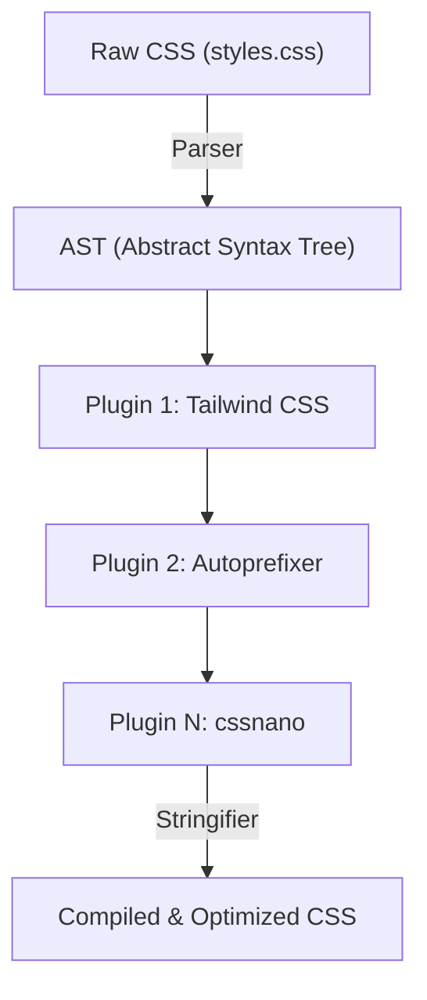
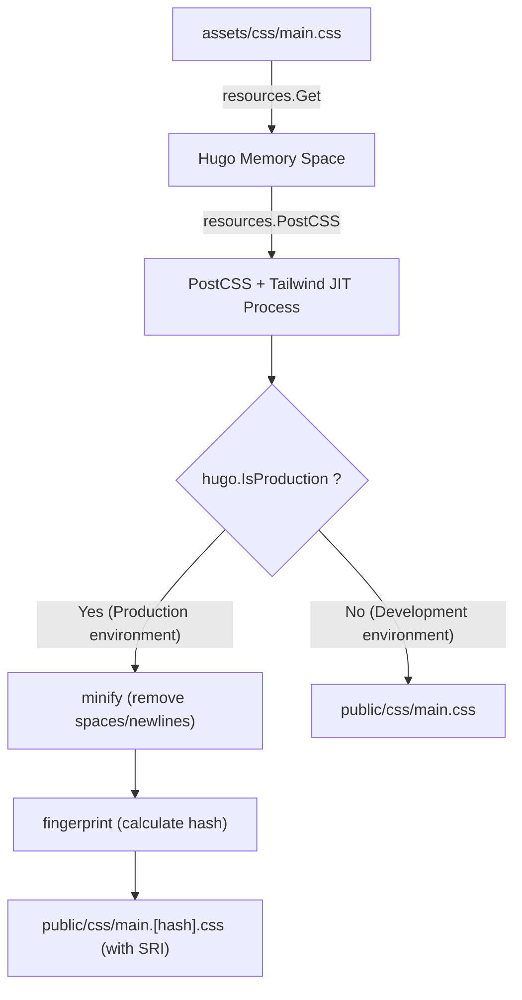

# Introduction: The Powerful Synergy of the Static Site Generator Hugo and Tailwind CSS

In modern web frontend development, balancing performance and Developer Experience (DX) is one of the most critical challenges in every project. Combining **Hugo**, which boasts some of the world's fastest build speeds among static site generators (SSGs), with **Tailwind CSS**, which introduced the innovative paradigm of utility-first CSS, can be considered an ultimate answer to this challenge.

Hugo is written in Go and has the astonishing performance to finish building thousands of pages in just a few seconds or even milliseconds. On the other hand, Tailwind CSS accelerates design iterations and eliminates the context switching of jumping back and forth between CSS and HTML files by allowing you to write countless predefined utility classes (such as `flex`, `text-center`, `mt-4`) directly into HTML.

In this article, we will thoroughly and comprehensively explain the steps to introduce Tailwind CSS into a Hugo theme and further build an advanced asset pipeline (Hugo Pipes) using PostCSS, covering everything from the foundation of the architecture to mathematical performance optimization perspectives.

---

## 1. The Transition of Utility-First CSS and Component-Oriented Design

Before diving into the Tailwind CSS installation steps, it is highly beneficial to deeply understand the history and evolution of the CSS design philosophy behind why we should use Tailwind CSS.

### The Limitations of Traditional CSS Design (BEM and OOCSS)
In past web development, giving semantic class names was considered a best practice. For example, when creating a card component, HTML and CSS were separated as follows:

```html
<div class="card">
  
  <div class="card__content">
    <h2 class="card__title">Title</h2>
    <p class="card__description">Description goes here.</p>
  </div>
</div>
```

```css
.card {
  border-radius: 8px;
  box-shadow: 0 4px 6px rgba(0,0,0,0.1);
  background-color: #ffffff;
  overflow: hidden;
}
.card__title {
  font-size: 1.5rem;
  font-weight: bold;
  color: #333333;
}
/* Detailed styles continue below */
```

While such BEM (Block Element Modifier) based design works when the project scale is small, it tends to cause the following problems:

1. **Naming exhaustion and fatigue**: You have to think of new class names every time you create a similar component (e.g., `card-news`, `card-featured`).
2. **CSS Bloat**: The number of CSS lines continues to increase every time a new feature is added, and once written, CSS is rarely deleted out of fear that "we don't know where it's used," leading to an accumulation of dead code.
3. **Context Switching**: Because HTML structure and CSS styles are managed in separate files, the number of times you switch tabs in your editor increases exponentially.

### Paradigm Shift by Tailwind CSS
Tailwind CSS solves these problems with the approach of "combining utility classes." Using Tailwind CSS, the above card component looks like this:

```html
<div class="rounded-lg shadow-md bg-white overflow-hidden">
  
  <div class="p-6">
    <h2 class="text-2xl font-bold text-gray-800">Title</h2>
    <p class="mt-2 text-gray-600">Description goes here.</p>
  </div>
</div>
```

Since the class names themselves represent the specific values of styles (e.g., `p-6` is `padding: 1.5rem;`), you can predict the final rendering result just by looking at the HTML. Furthermore, Tailwind's JIT (Just-In-Time) compiler extracts only the actually used classes into the production CSS file, reducing the CSS file size to the absolute minimum.

---

## 2. Hugo Pipes and PostCSS Architecture

To integrate Tailwind CSS into Hugo, you need to understand the asset processing pipeline called **Hugo Pipes**. Hugo Pipes is a powerful feature that completes all asset-related processing internally within Hugo, such as compiling Sass/SCSS, bundling and minifying JavaScript, and executing the **PostCSS** we will use this time.

PostCSS is a tool for transforming CSS using JavaScript plugins. Tailwind CSS itself actually operates as a PostCSS plugin.

### AST (Abstract Syntax Tree) Transformation Mechanism by PostCSS

Understanding how PostCSS processes CSS is highly useful for troubleshooting. The following Mermaid diagram shows the pipeline of how PostCSS reads a CSS file, transforms it through plugins, and outputs the final CSS.



1. **Parser**: Analyzes the inputted raw CSS string and converts it into an AST (Abstract Syntax Tree), a data structure that can be manipulated programmatically.
2. **Plugins**:
   - **Tailwind CSS**: Scans template files (HTML or Markdown) and adds the used utility classes as nodes to the AST. It also expands the `@tailwind` directive.
   - **Autoprefixer**: References the `Can I Use` database and adds vendor prefixes (such as `-webkit-`, `-moz-`) to the AST properties as needed.
3. **Stringifier**: Converts the transformed AST back into a browser-readable CSS string and outputs it.

---

## 3. Environment Setup and Prerequisites

Now, let's move on to the actual installation steps. First, we will check if the necessary software is installed.

### Prerequisites

1. **Hugo Extended Version**:
   You must have the **Extended version**, not the regular Hugo, as it includes Sass/SCSS processing capabilities and native PostCSS integration features. Run the following command in your terminal and verify that the version information contains the string `extended`.

   ```bash
   hugo version
   # Expected output example:
   # hugo v0.121.2-4146... windows/amd64 BuildDate=... VendorInfo=gohugoio +extended
   ```

2. **Node.js and npm**:
   Dependencies like Tailwind CSS and PostCSS run on Node.js. Make sure Node.js (LTS version recommended) is installed.

   ```bash
   node -v
   npm -v
   ```

### Installing npm Packages

Initialize npm in the project's root directory (where Hugo's configuration file `hugo.toml` is located) and install the required packages.

```bash
# Generate package.json
npm init -y

# Install Tailwind CSS, PostCSS, and Autoprefixer as development dependencies
npm install -D tailwindcss postcss postcss-cli autoprefixer
```

> [!IMPORTANT]
> If `postcss-cli` is not installed, errors may occur when invoking PostCSS from inside Hugo. Because Hugo Pipes internally uses `postcss-cli`, be absolutely sure to install it.

---

## 4. Building Configuration Files (PostCSS & Tailwind CSS)

Once the package installation is complete, create two important configuration files that control the project's behavior. Place them in the project root directory.

### Creating tailwind.config.js

Run the following command in your terminal to generate the default configuration file.

```bash
npx tailwindcss init
```

Open the generated `tailwind.config.js` in your editor and set the `content` property. This is extremely important. Tailwind analyzes the files at the paths specified here and extracts the classes being used. Precisely specify the layout files and content files according to your Hugo project structure.

```javascript
/** @type {import('tailwindcss').Config} */
module.exports = {
  // Specify targets to scan according to Hugo's directory structure
  content: [
    "./content/**/*.md",
    "./content/**/*.html",
    "./layouts/**/*.html",
    "./assets/**/*.js",
    // If you are using a theme, you also need to include the theme's directory
    // "./themes/my-theme/layouts/**/*.html",
  ],
  theme: {
    extend: {
      // Extend custom colors and fonts here
      colors: {
        'brand-primary': '#3490dc',
        'brand-secondary': '#ffed4a',
      },
      fontFamily: {
        'sans': ['Helvetica Neue', 'Arial', 'Hiragino Kaku Gothic ProN', 'Meiryo', 'sans-serif'],
      }
    },
  },
  plugins: [
    // Add official plugins as needed (e.g., Typography plugin)
    // require('@tailwindcss/typography'),
  ],
}
```

### Creating postcss.config.js

Next, create `postcss.config.js` in the project root, which defines which plugins PostCSS will run and in what order.

```javascript
module.exports = {
  plugins: {
    tailwindcss: {},
    autoprefixer: {},
  }
}
```

With this configuration, when Hugo calls PostCSS, it will first apply Tailwind CSS processing and then use Autoprefixer to add vendor prefixes.

---

## 5. Building the CSS Asset Pipeline in Hugo

Once the configuration is complete, it is finally time to integrate Tailwind CSS into the Hugo theme side.

### 5-1. Creating the Entry Point CSS File

Create the entry point CSS file in the `assets/css/` directory (create it if it doesn't exist). We will name it `main.css` here.

**File Path: `assets/css/main.css`**

```css
/* Load Tailwind's base styles (reset CSS, etc.) */
@tailwind base;

/* Load component classes */
@tailwind components;

/* Load utility classes */
@tailwind utilities;

/* If you need your own custom CSS, you can add it here,
   but it is recommended to handle it in tailwind.config.js's extend as much as possible */
@layer components {
  .btn-primary {
    @apply bg-blue-500 hover:bg-blue-700 text-white font-bold py-2 px-4 rounded transition-colors duration-300;
  }
}
```

### 5-2. Editing the Layout File (head.html)

Next, we will load the above CSS file from a Hugo template and write the pipeline to process it with PostCSS. Generally, you edit the partial template that defines the `<head>` tag (e.g., `layouts/partials/head.html`).

**File Path: `layouts/partials/head.html`**

```go-html-template
<head>
  <meta charset="utf-8">
  <meta name="viewport" content="width=device-width, initial-scale=1">
  <title>{{ .Title }} | {{ .Site.Title }}</title>

  <!-- Get assets/css/main.css -->
  {{ $css := resources.Get "css/main.css" }}

  <!-- Define PostCSS options -->
  {{ $options := dict "inlineImports" true }}
  {{ $css = $css | resources.PostCSS $options }}

  <!-- Asset optimization pipeline for the Production environment -->
  {{ if hugo.IsProduction }}
    <!-- 1. Minify -->
    {{ $css = $css | minify }}
    <!-- 2. Fingerprint (add hash for cache busting) -->
    {{ $css = $css | fingerprint "sha512" }}
    <!-- 3. Output the tag including SRI (Subresource Integrity) -->
    <link rel="stylesheet" href="{{ $css.RelPermalink }}" integrity="{{ $css.Data.Integrity }}" crossorigin="anonymous">
  {{ else }}
    <!-- In the Development environment, output as-is without minifying (prioritize build speed) -->
    <link rel="stylesheet" href="{{ $css.RelPermalink }}">
  {{ end }}
</head>
```

#### Pipeline Explanation and Mermaid Diagram Illustration

We will diagrammatically explain the sequence of pipeline processing for how the above Go template code handles the CSS file.



1. **`resources.Get`**: Looks for the specified file within the `assets` directory and loads it as a resource object in memory.
2. **`resources.PostCSS`**: Refers to `postcss.config.js` in the project root and applies Tailwind CSS and Autoprefixer processing to the CSS source code. In the development environment (`hugo server`), JIT mode kicks in and rapidly generates only the necessary classes when files are modified.
3. **`minify`**: During production builds (like `hugo --environment production`), it removes unnecessary whitespace and comments to minimize the file size.
4. **`fingerprint`**: Calculates a SHA hash based on the file's contents and appends it to the filename (e.g., `main.ab12cd...css`). This enables "cache busting," allowing you to utilize strong browser caching while ensuring a new file is reliably loaded when the CSS is updated.
5. **`integrity`**: Outputs an SRI attribute using the hash value calculated by Fingerprint to prevent tampering from CDNs and other sources.

---

## 6. Mathematical Performance Analysis in CSS Optimization

One of the greatest benefits of introducing Tailwind CSS is the minimization of the delivered CSS file size. Let's use a mathematical model to quantitatively analyze how this impacts web performance (especially First Contentful Paint: FCP).

### CSS File Size Reduction Model

With traditional CSS frameworks (like Bootstrap), the entire volume is loaded, including unused styles, so the file size $S_{original}$ tends to be large (around 150KB to 200KB).
Let $S_{purged}$ be the size after purging unused classes with the Tailwind CSS JIT compiler, and $R_{purge}$ be the reduction rate. This can be expressed as follows:

$$
S_{purged} = S_{original} \times (1 - R_{purge})
$$

In a typical project, $R_{purge}$ reaches close to $0.9$ (a 90% reduction), and $S_{purged}$ fits into just around 10KB to 20KB.

Furthermore, compression by Brotli or Gzip is performed on the server side upon delivery. Assuming a compression rate $R_{compress}$ (usually around 0.7 to 0.8), the final payload size $S_{final}$ flowing through the network is calculated with the following formula:

$$
S_{final} = S_{purged} \times (1 - R_{compress})
$$

### Critical Rendering Path and Network Latency

The time it takes for a browser to render the first piece of content on the screen (FCP) can be approximated as the sum of the HTML download time, CSS download time, and rendering time.

$$
T_{FCP} \approx RTT + \frac{S_{HTML}}{BW} + RTT + \frac{S_{final}}{BW} + T_{render}
$$

Where:
- $RTT$ : Round Trip Time (communication latency with the server)
- $BW$ : Network Bandwidth

In environments with narrow $BW$ and large $RTT$ (high latency) such as mobile networks, Tailwind CSS's approach, which can strip $S_{final}$ down to mere kilobytes, pushes the $\frac{S_{final}}{BW}$ term extremely close to zero, acting as the driving force to achieve phenomenal scores (e.g., Google PageSpeed Insights).

---

## 7. Starting the Development Server and Checking Hot Reloading

Once all configurations are complete, start the Hugo development server and check if Tailwind CSS is working properly.

```bash
hugo server -D
```

Access `http://localhost:1313/` in your browser and verify that the site is displayed.
Try opening a Markdown content file or a Hugo template (files under `layouts/`) and adding some classes.

```html
<!-- Example of applying Tailwind classes for testing -->
<div class="bg-gradient-to-r from-blue-500 to-purple-600 text-white p-8 rounded-xl shadow-2xl text-center transform transition duration-500 hover:scale-105">
  <h1 class="text-4xl font-extrabold tracking-tight">Tailwind CSS + Hugo is Awesome!</h1>
  <p class="mt-4 text-lg font-medium">Please verify that hot reloading is instantly reflected.</p>
</div>
```

The moment you save the file, Hugo's powerful file watcher and Tailwind's JIT compiler will work together to rebuild the CSS in milliseconds, allowing you to experience the thrill of the browser automatically reloading (hot reloading).

### Troubleshooting: When Styles Are Not Reflected

If your changes are not reflected, check the following points.

1. **The `content` path setting in `tailwind.config.js`**
   If the scanned file paths are incorrect, Tailwind cannot detect the classes used within those files and will not output them to the CSS. Especially if you are using a theme, make sure the theme directory path is not missing.
2. **PostCSS Errors**
   If an error like `Error: failed to transform resource: PostCSS not found` appears in the Hugo server logs in your terminal, `npm install` might not have executed correctly, or `postcss-cli` might be missing.
3. **Clearing the Hugo Cache**
   Rarely, old CSS remains due to Hugo's cache. Try stopping the server and starting it with `hugo server --ignoreCache`, or deleting the OS temporary directory (e.g., `/tmp/hugo_cache/`).

---

## 8. Production Builds and Further Advancements

When deploying your site to a production server (Netlify, Vercel, GitHub Pages, Cloudflare Pages, etc.), you need to set environment variables to run the production optimization pipeline.

```bash
# Example of a production build command
NODE_ENV=production hugo --minify --environment production
```

By adding the `--environment production` flag, the `{{ if hugo.IsProduction }}` block in `head.html` is executed, and CSS minification and fingerprinting will take place.

### Styling Markdown with the Typography Plugin

In blogs and documentation sites like those made with Hugo, you cannot directly add classes to pure HTML elements (`<h1>`, `<p>`, `<ul>`, etc.) generated from Markdown. The official Tailwind **Typography plugin** is extremely useful in such cases.

1. Install the plugin
   ```bash
   npm install -D @tailwindcss/typography
   ```

2. Add it to `tailwind.config.js`
   ```javascript
   module.exports = {
     // ...
     plugins: [
       require('@tailwindcss/typography'),
     ],
   }
   ```

3. Applying it in templates
   Simply adding the `prose` class (and your choice of color or size variants) to the container element that outputs the body of the article will apply beautiful default styles.

   ```go-html-template
   <article class="prose prose-lg prose-blue mx-auto mt-10">
     {{ .Content }}
   </article>
   ```

This completely eliminates the need to manually write complex CSS selectors (e.g., `.article-content h2 { ... }`) and perfectly preserves component modularity.

---

## 9. Conclusion: Completing a Highly Maintainable Frontend Ecosystem

Great job. You have now completed a perfect web development asset pipeline, combining Hugo's ultra-fast static site generation engine, Tailwind CSS's modern styling capabilities, and PostCSS's extensibility.

The brilliance of this architecture is that **"you only have to configure it once."** Once the pipeline is built, developers never have to open a CSS file; by simply writing intuitive utility classes into HTML or Markdown templates, they can build complex UIs at astonishing speeds.

Moreover, because the output CSS size is always minimized, it directly contributes to improving Core Web Vitals scores and works very advantageously from an SEO perspective.

The combination of Hugo and Tailwind CSS will remain one of the "best choices" for every project, from personal tech blogs to large corporate websites. Please take advantage of this powerful toolchain and enjoy a comfortable web development life!
