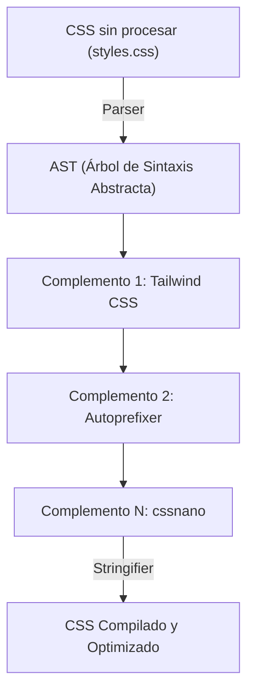
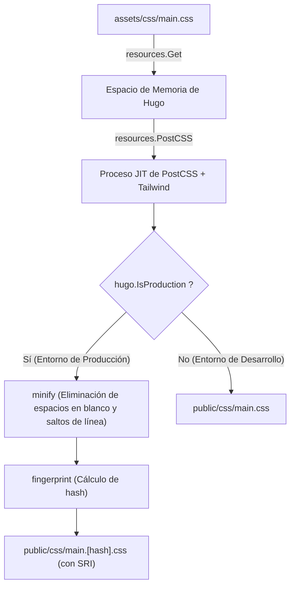

# Introducción: La poderosa sinergia entre el generador de sitios estáticos Hugo y Tailwind CSS

En el desarrollo frontend moderno, equilibrar el rendimiento y la experiencia del desarrollador (DX: Developer Experience) es una de las prioridades más importantes en cualquier proyecto. Combinar **Hugo**, que cuenta con una de las velocidades de compilación más rápidas del mundo entre los generadores de sitios estáticos (SSG), con **Tailwind CSS**, que introdujo el paradigma innovador de *utility-first* (utilidad primero), se puede considerar una de las soluciones definitivas a este desafío.

Hugo está escrito en el lenguaje Go y posee un rendimiento asombroso que completa la compilación en apenas unos segundos, o incluso milisegundos, incluso para sitios con miles de páginas. Por otro lado, Tailwind CSS elimina el cambio de contexto entre archivos CSS y HTML, acelerando la iteración del diseño al permitir escribir innumerables clases de utilidad predefinidas (como `flex`, `text-center`, `mt-4`, etc.) directamente en el HTML.

En este artículo, explicaremos de manera exhaustiva y detallada, desde los fundamentos de la arquitectura hasta la perspectiva de la optimización matemática del rendimiento, el proceso de introducir Tailwind CSS a un tema de Hugo y, además, la construcción de una canalización de activos (Hugo Pipes) avanzada usando PostCSS.

---

## 1. La evolución hacia el CSS utility-first y la orientación a componentes

Antes de sumergirnos en los pasos de instalación de Tailwind CSS, es sumamente útil comprender profundamente el contexto y la historia de la evolución de la filosofía de diseño CSS detrás de por qué deberíamos usar Tailwind CSS.

### Limitaciones de los diseños CSS tradicionales (BEM y OOCSS)
En el desarrollo web tradicional, asignar nombres de clases semánticas se consideraba una buena práctica. Por ejemplo, al crear un componente de tarjeta, se separaba el HTML y el CSS de la siguiente manera:

```html
<div class="card">
  
  <div class="card__content">
    <h2 class="card__title">Título</h2>
    <p class="card__description">La descripción va aquí.</p>
  </div>
</div>
```

```css
.card {
  border-radius: 8px;
  box-shadow: 0 4px 6px rgba(0,0,0,0.1);
  background-color: #ffffff;
  overflow: hidden;
}
.card__title {
  font-size: 1.5rem;
  font-weight: bold;
  color: #333333;
}
/* A partir de aquí continúan estilos detallados */
```

Este tipo de diseño basado en BEM (Block Element Modifier) funciona mientras la escala del proyecto es pequeña, pero tiende a causar los siguientes problemas:

1. **Agotamiento y fatiga por nombramiento**: Cada vez que se crea un componente similar, hay que pensar en un nuevo nombre de clase (por ejemplo: `card-news`, `card-featured`, etc.).
2. **Exceso (bloat) de CSS**: El número de líneas de CSS sigue aumentando cada vez que se agrega una nueva funcionalidad, y el CSS, una vez escrito, rara vez se elimina por temor a "no saber dónde se está utilizando", acumulando así código muerto.
3. **Cambios de contexto**: Al gestionar la estructura HTML y los estilos CSS en archivos separados, la cantidad de veces que se alterna entre pestañas en el editor aumenta exponencialmente.

### Cambio de paradigma con Tailwind CSS
Tailwind CSS resuelve estos problemas mediante un enfoque de "combinación de clases de utilidad". El componente de tarjeta mencionado anteriormente se vería así usando Tailwind CSS:

```html
<div class="rounded-lg shadow-md bg-white overflow-hidden">
  
  <div class="p-6">
    <h2 class="text-2xl font-bold text-gray-800">Título</h2>
    <p class="mt-2 text-gray-600">La descripción va aquí.</p>
  </div>
</div>
```

Dado que el nombre de la clase en sí representa el valor de estilo específico (`p-6` es `padding: 1.5rem;`, etc.), puedes predecir el resultado final de renderizado simplemente mirando el HTML. Además, gracias al compilador JIT (Just-In-Time) de Tailwind, solo las clases realmente utilizadas se extraen al archivo CSS de producción, por lo que el tamaño del archivo CSS se reduce al extremo.

---

## 2. Arquitectura de Hugo Pipes y PostCSS

Para integrar Tailwind CSS en Hugo, es necesario comprender la canalización de procesamiento de activos llamada **Hugo Pipes**. Hugo Pipes es una característica poderosa que completa todo el procesamiento relacionado con los activos, como la compilación de Sass/SCSS, el empaquetado y la minificación de JavaScript, y la ejecución de **PostCSS** que usaremos en esta ocasión, enteramente dentro de Hugo.

PostCSS es una herramienta para transformar CSS mediante el uso de complementos de JavaScript. Tailwind CSS en sí también funciona, de hecho, como un complemento de PostCSS.

### Mecanismo de transformación de AST (Árbol de Sintaxis Abstracta) por PostCSS

Comprender cómo PostCSS procesa el CSS es de gran ayuda para la resolución de problemas. El siguiente diagrama de Mermaid muestra la canalización desde que PostCSS lee el archivo CSS, lo transforma a través de los complementos y genera el CSS final.



1. **Analizador (Parser)**: Analiza la cadena CSS en bruto (cruda) de entrada y la convierte en una estructura de datos manejable mediante programación, el AST (Árbol de Sintaxis Abstracta).
2. **Complementos (Plugins)**:
   - **Tailwind CSS**: Escanea los archivos de plantilla (HTML o Markdown) y añade las clases de utilidad utilizadas como nodos en el AST. También expande la directiva `@tailwind`.
   - **Autoprefixer**: Consulta la base de datos de `Can I Use` y, si es necesario, añade prefijos de proveedor (`-webkit-`, `-moz-`, etc.) a las propiedades del AST.
3. **Generador de cadenas (Stringifier)**: Convierte el AST, una vez finalizada la transformación, nuevamente en una cadena CSS interpretable por el navegador para su salida.

---

## 3. Configuración del entorno y requisitos previos

Ahora, pasemos a los pasos de instalación reales. Primero, comprobaremos si está instalado el software necesario.

### Requisitos indispensables

1. **Hugo Extended Version**:
   No es el Hugo normal, sino la **versión Extended (Extendida)** que incluye funciones de procesamiento de Sass/SCSS y compatibilidad nativa con PostCSS. Ejecuta el siguiente comando en la terminal y asegúrate de que la cadena `extended` esté incluida en la información de la versión.

   ```bash
   hugo version
   # Ejemplo de salida esperada:
   # hugo v0.121.2-4146... windows/amd64 BuildDate=... VendorInfo=gohugoio +extended
   ```

2. **Node.js y npm**:
   Los paquetes de dependencia como Tailwind CSS y PostCSS se ejecutan sobre Node.js. Asegúrate de tener instalado Node.js (se recomienda la versión LTS).

   ```bash
   node -v
   npm -v
   ```

### Instalación de paquetes npm

Inicializa npm en el directorio raíz del proyecto (el nivel donde se encuentra el archivo de configuración de Hugo, `hugo.toml`) e instala los paquetes necesarios.

```bash
# Generación de package.json
npm init -y

# Instalación de Tailwind CSS, PostCSS y Autoprefixer como dependencias de desarrollo
npm install -D tailwindcss postcss postcss-cli autoprefixer
```

> [!IMPORTANT]
> Si no está instalado `postcss-cli`, puede que se produzca un error al invocar PostCSS desde dentro de Hugo. Dado que Hugo Pipes utiliza internamente `postcss-cli`, asegúrate de instalarlo sin falta.

---

## 4. Construcción de los archivos de configuración (PostCSS y Tailwind CSS)

Una vez completada la instalación de los paquetes, crearemos dos archivos de configuración importantes que controlan el comportamiento del proyecto. Colócalos en el directorio raíz del proyecto.

### Creación de tailwind.config.js

Al ejecutar el siguiente comando en la terminal, se generará el archivo de configuración predeterminado.

```bash
npx tailwindcss init
```

Abre el archivo `tailwind.config.js` generado en tu editor y configura la propiedad `content`. Esta parte es sumamente importante. Tailwind analizará los archivos de las rutas especificadas aquí y extraerá las clases utilizadas. Especifica las rutas de los archivos de diseño (layouts) y los archivos de contenido de forma precisa según la estructura de directorios del proyecto Hugo.

```javascript
/** @type {import('tailwindcss').Config} */
module.exports = {
  // Especifica el destino del análisis de acuerdo a la estructura de directorios de Hugo
  content: [
    "./content/**/*.md",
    "./content/**/*.html",
    "./layouts/**/*.html",
    "./assets/**/*.js",
    // Si estás utilizando un tema, también debes incluir el directorio del tema
    // "./themes/my-theme/layouts/**/*.html",
  ],
  theme: {
    extend: {
      // Extiende aquí colores personalizados, fuentes, etc.
      colors: {
        'brand-primary': '#3490dc',
        'brand-secondary': '#ffed4a',
      },
      fontFamily: {
        'sans': ['Helvetica Neue', 'Arial', 'Hiragino Kaku Gothic ProN', 'Meiryo', 'sans-serif'],
      }
    },
  },
  plugins: [
    // Añade complementos oficiales si es necesario (ej: complemento Typography)
    // require('@tailwindcss/typography'),
  ],
}
```

### Creación de postcss.config.js

A continuación, crea un archivo `postcss.config.js` en la raíz del proyecto para definir qué complementos ejecutará PostCSS y en qué orden.

```javascript
module.exports = {
  plugins: {
    tailwindcss: {},
    autoprefixer: {},
  }
}
```

Con esta configuración, cuando Hugo invoque a PostCSS, primero se ejecutará el procesamiento de Tailwind CSS y, luego, Autoprefixer aplicará los prefijos del proveedor.

---

## 5. Construcción de la canalización de activos CSS en Hugo

Una vez completada la configuración, por fin incorporaremos Tailwind CSS en el lado del tema de Hugo.

### 5-1. Creación del archivo CSS como punto de entrada

Crea el archivo CSS que servirá como punto de entrada en el directorio `assets/css/` (si no existe, créalo). Aquí lo llamaremos `main.css`.

**Ruta del archivo: `assets/css/main.css`**

```css
/* Carga de los estilos base de Tailwind (reseteo CSS, etc.) */
@tailwind base;

/* Carga de las clases de componentes */
@tailwind components;

/* Carga de las clases de utilidad */
@tailwind utilities;

/* Si necesitas CSS personalizado propio, puedes agregarlo aquí,
   pero se recomienda hacerlo mediante extend en tailwind.config.js siempre que sea posible */
@layer components {
  .btn-primary {
    @apply bg-blue-500 hover:bg-blue-700 text-white font-bold py-2 px-4 rounded transition-colors duration-300;
  }
}
```

### 5-2. Edición del archivo de diseño (head.html)

A continuación, describiremos la canalización para cargar el archivo CSS anterior desde la plantilla de Hugo y procesarlo con PostCSS. Generalmente, se edita la plantilla parcial que define el interior de la etiqueta `<head>` (por ejemplo, `layouts/partials/head.html`).

**Ruta del archivo: `layouts/partials/head.html`**

```go-html-template
<head>
  <meta charset="utf-8">
  <meta name="viewport" content="width=device-width, initial-scale=1">
  <title>{{ .Title }} | {{ .Site.Title }}</title>

  <!-- Obtener assets/css/main.css -->
  {{ $css := resources.Get "css/main.css" }}

  <!-- Definición de opciones para PostCSS -->
  {{ $options := dict "inlineImports" true }}
  {{ $css = $css | resources.PostCSS $options }}

  <!-- Canalización de optimización de activos para el entorno de producción (Production) -->
  {{ if hugo.IsProduction }}
    <!-- 1. Minify (Compresión) -->
    {{ $css = $css | minify }}
    <!-- 2. Fingerprint (Adición de hash para invalidar la caché) -->
    {{ $css = $css | fingerprint "sha512" }}
    <!-- 3. Salida de la etiqueta incluyendo SRI (Subresource Integrity) -->
    <link rel="stylesheet" href="{{ $css.RelPermalink }}" integrity="{{ $css.Data.Integrity }}" crossorigin="anonymous">
  {{ else }}
    <!-- En el entorno de desarrollo (Development), salida directa sin comprimir (prioriza la velocidad de compilación) -->
    <link rel="stylesheet" href="{{ $css.RelPermalink }}">
  {{ end }}
</head>
```

#### Explicación de la canalización y diagrama de Mermaid

Ilustraremos mediante un diagrama de Mermaid cómo el código de la plantilla Go anterior procesa el archivo CSS a través de una serie de procesos de canalización.



1. **`resources.Get`**: Busca el archivo especificado dentro del directorio `assets` y lo carga como un objeto de recurso en memoria.
2. **`resources.PostCSS`**: Hace referencia a `postcss.config.js` en la raíz del proyecto y aplica el procesamiento de Tailwind CSS y Autoprefixer al código fuente CSS. En el entorno de desarrollo (`hugo server`), el modo JIT se activa, generando rápidamente solo las clases necesarias cuando el archivo cambia.
3. **`minify`**: Durante la compilación en el entorno de producción (como con `hugo --environment production`), elimina espacios en blanco y comentarios innecesarios, minimizando el tamaño del archivo.
4. **`fingerprint`**: Calcula un hash SHA basado en el contenido del archivo y lo añade al nombre del archivo (por ejemplo, `main.ab12cd...css`). Esto permite la "invalidación de caché" (cache busting), que asegura que se lea de manera confiable un nuevo archivo cuando el CSS se actualiza, al mismo tiempo que aprovecha la poderosa caché del navegador.
5. **`integrity`**: Imprime el atributo SRI utilizando el valor hash calculado por Fingerprint para prevenir la manipulación desde CDNs, etc.

---

## 6. Análisis matemático del rendimiento en la optimización de CSS

Una de las mayores ventajas de introducir Tailwind CSS es la reducción drástica del tamaño del archivo CSS entregado. Utilizando un modelo matemático, analicemos cuantitativamente cómo afecta esto al rendimiento web (especialmente a First Contentful Paint: FCP).

### Modelo de reducción del tamaño del archivo CSS

En los frameworks CSS tradicionales (como Bootstrap), todo el volumen se carga incluyendo estilos no utilizados, por lo que el tamaño del archivo $S_{original}$ tiende a ser grande (alrededor de 150KB a 200KB).
Si denotamos como $S_{purged}$ el tamaño después de aplicar la purga de clases innecesarias por el compilador JIT de Tailwind CSS, usando la tasa de reducción $R_{purge}$, se puede expresar de la siguiente manera:

$$
S_{purged} = S_{original} \times (1 - R_{purge})
$$

En un proyecto típico, $R_{purge}$ alcanza cerca de $0.9$ (reducción del 90%) y $S_{purged}$ se mantiene en apenas unos 10KB a 20KB.

Además, en el momento de la entrega, se realiza una compresión mediante Brotli o Gzip en el lado del servidor. Si establecemos la tasa de compresión como $R_{compress}$ (generalmente alrededor de 0.7 a 0.8), el tamaño del payload final que fluye por la red, $S_{final}$, se calcula con la siguiente fórmula:

$$
S_{final} = S_{purged} \times (1 - R_{compress})
$$

### Ruta de renderizado crítica y latencia de red

El tiempo hasta que el navegador dibuja el primer contenido en la pantalla (FCP) se puede aproximar como la suma del tiempo de descarga de HTML, el tiempo de descarga de CSS y el tiempo de renderizado.

$$
T_{FCP} \approx RTT + \frac{S_{HTML}}{BW} + RTT + \frac{S_{final}}{BW} + T_{render}
$$

Aquí,
- $RTT$ : Round Trip Time (tiempo de retardo de ida y vuelta de comunicación con el servidor)
- $BW$ : Ancho de banda de la red (Bandwidth)

En entornos como redes móviles donde $BW$ es estrecho y $RTT$ es grande (latencia alta), el enfoque de Tailwind CSS de reducir $S_{final}$ a unidades de kilobytes hace que el término $\frac{S_{final}}{BW}$ se acerque al límite de cero, y se convierte en la fuerza motriz para obtener puntuaciones asombrosas (en herramientas como Google PageSpeed Insights).

---

## 7. Inicio del servidor de desarrollo y verificación de la recarga en caliente

Una vez completada toda la configuración, iniciaremos el servidor de desarrollo de Hugo y verificaremos que Tailwind CSS funciona correctamente.

```bash
hugo server -D
```

Accede a `http://localhost:1313/` en el navegador y verifica que se muestre el sitio.
Abre un archivo de contenido Markdown o una plantilla de Hugo (archivos bajo `layouts/`) e intenta agregar una clase.

```html
<!-- Ejemplo de aplicación de clases de Tailwind para pruebas -->
<div class="bg-gradient-to-r from-blue-500 to-purple-600 text-white p-8 rounded-xl shadow-2xl text-center transform transition duration-500 hover:scale-105">
  <h1 class="text-4xl font-extrabold tracking-tight">¡Tailwind CSS + Hugo es Increíble!</h1>
  <p class="mt-4 text-lg font-medium">Verifica que la recarga en caliente se refleje instantáneamente.</p>
</div>
```

En el mismo momento en que guardas el archivo, el potente observador de archivos de Hugo (file watcher) se coordina con el compilador JIT de Tailwind, el CSS se reconstruye en unidades de milisegundos y deberías poder saborear la emoción de ver cómo el navegador se recarga automáticamente (hot reload).

### Solución de problemas: Si los estilos no se reflejan

Si los cambios no se reflejan, verifica los siguientes puntos:

1. **Configuración de la ruta `content` en `tailwind.config.js`**
   Si la ruta del archivo a escanear es incorrecta, Tailwind no podrá detectar las clases utilizadas dentro de ese archivo y no las emitirá al CSS. Especialmente si usas un tema, verifica que la ruta al directorio del tema no haya sido omitida.
2. **Error de PostCSS**
   Si se muestra un error como `Error: failed to transform resource: PostCSS not found` en el registro del servidor de Hugo en la terminal, es posible que `npm install` no se haya ejecutado correctamente o que falte `postcss-cli`.
3. **Borrar la caché de Hugo**
   Rara vez, un CSS antiguo puede permanecer como causa de la caché de Hugo. Intenta detener el servidor e iniciarlo con `hugo server --ignoreCache`, o elimina el directorio temporal del sistema operativo (como `/tmp/hugo_cache/`).

---

## 8. Compilación para el entorno de producción y una mayor sofisticación

Al desplegar tu sitio en un servidor de producción (Netlify, Vercel, GitHub Pages, Cloudflare Pages, etc.), necesitas configurar variables de entorno para ejecutar la canalización de optimización de producción.

```bash
# Ejemplo de comando de compilación para producción
NODE_ENV=production hugo --minify --environment production
```

Al agregar la bandera `--environment production`, se ejecuta el bloque `{{ if hugo.IsProduction }}` dentro de `head.html`, y se realiza la minificación y la adición del Fingerprint al CSS.

### Estilizar Markdown usando el complemento Typography

En un blog o un sitio de documentación como Hugo, no puedes agregar clases directamente a los elementos HTML puros (`<h1>`, `<p>`, `<ul>`, etc.) generados a partir de Markdown. Lo que resulta extremadamente útil en tales casos es el **Complemento Typography (Typography plugin)** oficial de Tailwind.

1. Instalación del complemento
   ```bash
   npm install -D @tailwindcss/typography
   ```

2. Añadir a `tailwind.config.js`
   ```javascript
   module.exports = {
     // ...
     plugins: [
       require('@tailwindcss/typography'),
     ],
   }
   ```

3. Aplicación en la plantilla
   Simplemente asigna la clase `prose` (y, opcionalmente, las variantes de color o tamaño a tu gusto) al elemento contenedor que produce el texto del artículo para aplicar estilos predeterminados hermosos.

   ```go-html-template
   <article class="prose prose-lg prose-blue mx-auto mt-10">
     {{ .Content }}
   </article>
   ```

Con esto, se elimina por completo la necesidad de escribir manualmente selectores CSS complejos (como `.article-content h2 { ... }`), y la modularidad de los componentes se conserva perfectamente.

---

## 9. Conclusión: Finalización de un ecosistema frontend de alta mantenibilidad

¡Buen trabajo! Con esto, has completado una canalización de activos de desarrollo web perfecta equipada con el motor de generación de sitios estáticos ultrarrápido de Hugo, las características de estilo modernas de Tailwind CSS y la extensibilidad de PostCSS.

La ventaja sobresaliente de esta arquitectura es que **"la configuración requiere hacerse solo una vez al principio"**. Una vez que hayas construido la canalización, los desarrolladores pueden construir interfaces de usuario complejas a una velocidad asombrosa con solo describir clases de utilidad intuitivas en plantillas HTML o Markdown, sin tener que abrir ningún archivo CSS.

Además, dado que el tamaño del CSS de salida siempre se minimiza, esto conduce directamente a una mejora en la puntuación de los Core Web Vitals, y también funciona de manera muy favorable desde la perspectiva del SEO.

La combinación de Hugo y Tailwind CSS seguirá siendo una de las "mejores opciones" en cada proyecto, desde blogs tecnológicos personales hasta sitios corporativos a gran escala. ¡Por favor, asegúrate de utilizar esta poderosa cadena de herramientas para disfrutar de una cómoda vida de desarrollo web!
