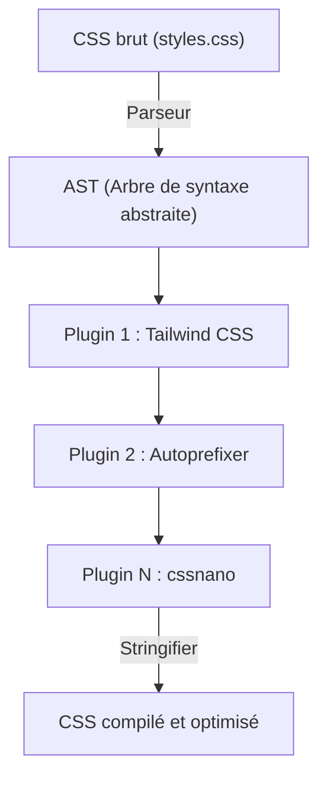
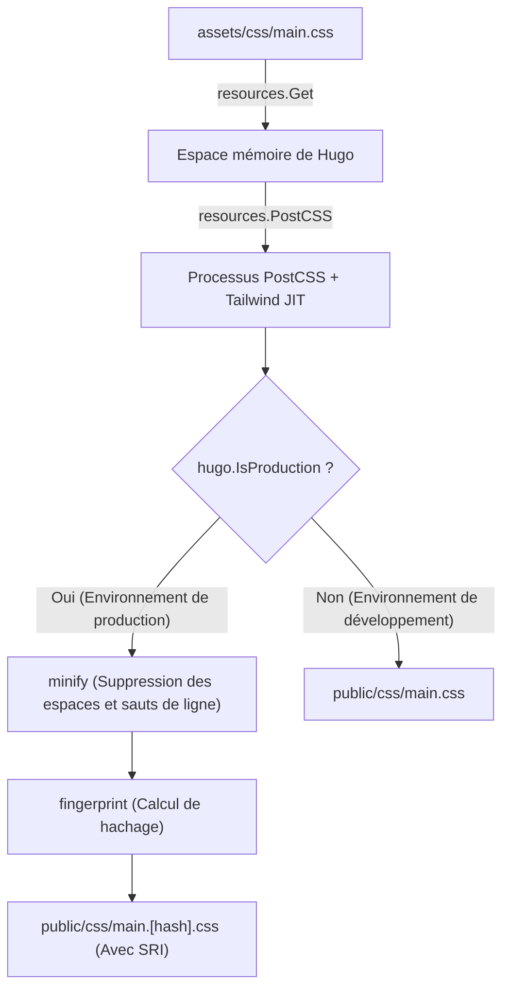

# Introduction : La puissante synergie entre le générateur de site statique Hugo et Tailwind CSS

Dans le développement Web front-end moderne, concilier les performances et l'expérience de développement (DX : Developer Experience) est l'une des priorités majeures de tout projet. L'association de **Hugo**, qui possède l'une des vitesses de compilation les plus rapides au monde parmi les générateurs de sites statiques (SSG), et de **Tailwind CSS**, qui a introduit le paradigme novateur du "utility-first" (utilitaire d'abord), constitue sans doute l'une des réponses ultimes à ce défi.

Hugo est écrit en Go et présente des performances exceptionnelles, permettant de compiler un site de plusieurs milliers de pages en quelques secondes, voire en millisecondes. D'autre part, Tailwind CSS permet d'accélérer l'itération du design en éliminant les allers-retours entre les fichiers CSS et HTML grâce à l'écriture directe d'innombrables classes utilitaires prédéfinies (`flex`, `text-center`, `mt-4`, etc.) dans le code HTML.

Cet article explique de manière approfondie et détaillée comment intégrer Tailwind CSS à un thème Hugo, et comment construire un pipeline d'assets avancé (Hugo Pipes) en utilisant PostCSS, depuis les bases de l'architecture jusqu'à l'optimisation mathématique des performances.

---

## 1. L'évolution du CSS "utility-first" et l'approche orientée composants

Avant de passer aux instructions d'intégration de Tailwind CSS, il est très utile de comprendre pourquoi nous devrions utiliser Tailwind CSS, ainsi que l'histoire et l'évolution de la philosophie de conception CSS qui se cache derrière.

### Les limites de la conception CSS traditionnelle (BEM et OOCSS)
Autrefois dans le développement Web, l'utilisation de noms de classes sémantiques était considérée comme la meilleure pratique. Par exemple, pour créer un composant de carte, le code HTML et le CSS étaient séparés comme suit :

```html
<div class="card">
  
  <div class="card__content">
    <h2 class="card__title">Titre</h2>
    <p class="card__description">La description va ici.</p>
  </div>
</div>
```

```css
.card {
  border-radius: 8px;
  box-shadow: 0 4px 6px rgba(0,0,0,0.1);
  background-color: #ffffff;
  overflow: hidden;
}
.card__title {
  font-size: 1.5rem;
  font-weight: bold;
  color: #333333;
}
/* La suite contient d'autres styles détaillés */
```

Une conception basée sur BEM (Block Element Modifier) comme celle-ci fonctionne bien lorsque le projet est de petite taille, mais a tendance à causer les problèmes suivants :

1. **Épuisement et fatigue liés au nommage** : À chaque fois que vous créez un composant similaire, vous devez penser à un nouveau nom de classe (ex. `card-news`, `card-featured`, etc.).
2. **Gonflement du CSS** : Le nombre de lignes de CSS augmente à chaque ajout de fonctionnalité. Le CSS existant est rarement supprimé par peur de ne pas savoir "où il est utilisé", ce qui conduit à l'accumulation de code mort.
3. **Changement de contexte** : Puisque la structure HTML et les styles CSS sont gérés dans des fichiers séparés, le nombre d'allers-retours entre les onglets dans l'éditeur augmente de manière exponentielle.

### Le changement de paradigme avec Tailwind CSS
Tailwind CSS résout ces problèmes en utilisant l'approche de la "combinaison de classes utilitaires". Le composant de carte ci-dessus ressemblerait à ceci si vous utilisiez Tailwind CSS :

```html
<div class="rounded-lg shadow-md bg-white overflow-hidden">
  
  <div class="p-6">
    <h2 class="text-2xl font-bold text-gray-800">Titre</h2>
    <p class="mt-2 text-gray-600">La description va ici.</p>
  </div>
</div>
```

Étant donné que les noms de classe eux-mêmes représentent des valeurs de style spécifiques (`p-6` équivaut à `padding: 1.5rem;`, etc.), vous pouvez prévoir le résultat final du rendu simplement en regardant le HTML. De plus, le compilateur JIT (Just-In-Time) de Tailwind extrait uniquement les classes réellement utilisées dans le fichier CSS de production, ce qui réduit considérablement la taille du fichier CSS.

---

## 2. L'architecture de Hugo Pipes et PostCSS

Pour intégrer Tailwind CSS dans Hugo, il est nécessaire de comprendre le pipeline de traitement des assets appelé **Hugo Pipes**. Hugo Pipes est une fonctionnalité puissante qui permet de gérer tous les traitements liés aux assets directement dans Hugo, comme la compilation de Sass/SCSS, le bundle et la minification JavaScript, et l'exécution de **PostCSS** que nous utiliserons ici.

PostCSS est un outil permettant de transformer le CSS à l'aide de plugins JavaScript. Tailwind CSS lui-même fonctionne en réalité comme un plugin PostCSS.

### Le mécanisme de transformation AST (Abstract Syntax Tree) avec PostCSS

Comprendre comment PostCSS traite le CSS est extrêmement utile lors de la résolution de problèmes. Le diagramme Mermaid ci-dessous montre le pipeline par lequel PostCSS lit un fichier CSS, le transforme via des plugins et produit le CSS final.



1. **Parseur** : Analyse la chaîne CSS brute en entrée et la convertit en AST (Arbre de syntaxe abstraite), une structure de données manipulable par le programme.
2. **Plugins** :
   - **Tailwind CSS** : Analyse les fichiers de modèle (HTML ou Markdown) et ajoute les classes utilitaires utilisées sous forme de nœuds à l'AST. Il développe également les directives `@tailwind`.
   - **Autoprefixer** : Consulte la base de données `Can I Use` et ajoute les préfixes vendeurs nécessaires (`-webkit-`, `-moz-`, etc.) aux propriétés de l'AST.
3. **Stringifier** : Convertit l'AST transformé en une chaîne CSS compréhensible par le navigateur pour sa sortie.

---

## 3. Configuration de l'environnement et prérequis

Passons maintenant aux étapes d'intégration concrètes. Tout d'abord, nous vérifierons si les logiciels nécessaires sont installés.

### Prérequis

1. **Hugo Extended Version** :
   Vous avez besoin de la **version Extended** de Hugo, et non de la version standard, car elle inclut des fonctionnalités de traitement Sass/SCSS et une intégration native de PostCSS. Exécutez la commande suivante dans le terminal et assurez-vous que la chaîne `extended` est présente dans les informations de version.

   ```bash
   hugo version
   # Sortie attendue :
   # hugo v0.121.2-4146... windows/amd64 BuildDate=... VendorInfo=gohugoio +extended
   ```

2. **Node.js et npm** :
   Les dépendances comme Tailwind CSS et PostCSS fonctionnent sur Node.js. Assurez-vous que Node.js (version LTS recommandée) est installé.

   ```bash
   node -v
   npm -v
   ```

### Installation des paquets npm

Initialisez npm dans le répertoire racine de votre projet (là où se trouve le fichier de configuration de Hugo `hugo.toml`) et installez les paquets nécessaires.

```bash
# Génération de package.json
npm init -y

# Installation de Tailwind CSS, PostCSS et Autoprefixer en tant que dépendances de développement
npm install -D tailwindcss postcss postcss-cli autoprefixer
```

> [!IMPORTANT]
> Si `postcss-cli` n'est pas installé, une erreur peut survenir lorsque Hugo appelle PostCSS en interne. Assurez-vous de l'installer car Hugo Pipes utilise `postcss-cli` en interne.

---

## 4. Création des fichiers de configuration (PostCSS & Tailwind CSS)

Une fois l'installation des paquets terminée, créez deux fichiers de configuration importants qui contrôlent le comportement du projet. Placez-les dans le répertoire racine du projet.

### Création de tailwind.config.js

Exécutez la commande suivante dans le terminal pour générer le fichier de configuration par défaut.

```bash
npx tailwindcss init
```

Ouvrez le fichier `tailwind.config.js` généré dans votre éditeur et configurez la propriété `content`. C'est une étape très importante. Tailwind analyse les fichiers aux chemins spécifiés ici et extrait les classes utilisées. Spécifiez précisément les fichiers de disposition (layouts) et de contenu en fonction de la structure du projet Hugo.

```javascript
/** @type {import('tailwindcss').Config} */
module.exports = {
  // Spécifie les cibles d'analyse en fonction de la structure du répertoire Hugo
  content: [
    "./content/**/*.md",
    "./content/**/*.html",
    "./layouts/**/*.html",
    "./assets/**/*.js",
    // Si vous utilisez un thème, vous devez également inclure le répertoire du thème
    // "./themes/mon-theme/layouts/**/*.html",
  ],
  theme: {
    extend: {
      // Les extensions de couleurs personnalisées ou de polices se font ici
      colors: {
        'brand-primary': '#3490dc',
        'brand-secondary': '#ffed4a',
      },
      fontFamily: {
        'sans': ['Helvetica Neue', 'Arial', 'Hiragino Kaku Gothic ProN', 'Meiryo', 'sans-serif'],
      }
    },
  },
  plugins: [
    // Ajoutez des plugins officiels si nécessaire (ex. plugin Typography)
    // require('@tailwindcss/typography'),
  ],
}
```

### Création de postcss.config.js

Ensuite, créez `postcss.config.js` à la racine du projet pour définir quels plugins PostCSS exécuter et dans quel ordre.

```javascript
module.exports = {
  plugins: {
    tailwindcss: {},
    autoprefixer: {},
  }
}
```

Avec cette configuration, lorsque Hugo appellera PostCSS, le traitement de Tailwind CSS sera effectué en premier, suivi de l'ajout des préfixes vendeurs par Autoprefixer.

---

## 5. Construction du pipeline d'assets CSS dans Hugo

Une fois la configuration terminée, nous allons enfin intégrer Tailwind CSS dans le thème Hugo.

### 5-1. Création du fichier CSS point d'entrée

Créez un fichier CSS qui servira de point d'entrée dans le répertoire `assets/css/` (créez-le s'il n'existe pas). Nous le nommerons `main.css`.

**Chemin du fichier : `assets/css/main.css`**

```css
/* Chargement des styles de base de Tailwind (CSS reset, etc.) */
@tailwind base;

/* Chargement des classes de composants */
@tailwind components;

/* Chargement des classes utilitaires */
@tailwind utilities;

/* Vous pouvez ajouter votre propre CSS personnalisé ici si nécessaire,
   mais il est recommandé d'utiliser extend de tailwind.config.js autant que possible */
@layer components {
  .btn-primary {
    @apply bg-blue-500 hover:bg-blue-700 text-white font-bold py-2 px-4 rounded transition-colors duration-300;
  }
}
```

### 5-2. Modification du fichier de disposition (head.html)

Ensuite, nous allons écrire le pipeline pour charger le fichier CSS ci-dessus depuis un modèle Hugo et le traiter avec PostCSS. Généralement, vous modifierez le modèle partiel qui définit la balise `<head>` (par exemple, `layouts/partials/head.html`).

**Chemin du fichier : `layouts/partials/head.html`**

```go-html-template
<head>
  <meta charset="utf-8">
  <meta name="viewport" content="width=device-width, initial-scale=1">
  <title>{{ .Title }} | {{ .Site.Title }}</title>

  <!-- Récupère assets/css/main.css -->
  {{ $css := resources.Get "css/main.css" }}

  <!-- Définition des options pour PostCSS -->
  {{ $options := dict "inlineImports" true }}
  {{ $css = $css | resources.PostCSS $options }}

  <!-- Pipeline d'optimisation des assets pour l'environnement de production -->
  {{ if hugo.IsProduction }}
    <!-- 1. Minification (compression) -->
    {{ $css = $css | minify }}
    <!-- 2. Fingerprint (ajout de hachage pour le contournement du cache) -->
    {{ $css = $css | fingerprint "sha512" }}
    <!-- 3. Sortie de la balise avec SRI (Subresource Integrity) -->
    <link rel="stylesheet" href="{{ $css.RelPermalink }}" integrity="{{ $css.Data.Integrity }}" crossorigin="anonymous">
  {{ else }}
    <!-- Dans l'environnement de développement, sortie sans compression (priorité à la vitesse de build) -->
    <link rel="stylesheet" href="{{ $css.RelPermalink }}">
  {{ end }}
</head>
```

#### Explication du pipeline et diagramme Mermaid

Illustrons la série d'étapes de traitement que le code modèle Go ci-dessus effectue sur le fichier CSS.



1. **`resources.Get`** : Recherche le fichier spécifié dans le répertoire `assets` et le charge en tant qu'objet ressource en mémoire.
2. **`resources.PostCSS`** : Applique le traitement de Tailwind CSS et Autoprefixer au code source CSS en se référant à `postcss.config.js` à la racine du projet. En environnement de développement (`hugo server`), le mode JIT est activé, générant rapidement uniquement les classes nécessaires lors de la modification des fichiers.
3. **`minify`** : Supprime les espaces blancs et les commentaires inutiles pour minimiser la taille du fichier lors de la compilation pour l'environnement de production (ex. `hugo --environment production`).
4. **`fingerprint`** : Calcule un hachage SHA basé sur le contenu du fichier et l'ajoute au nom du fichier (ex. `main.ab12cd...css`). Cela permet de réaliser un "cache busting" (contournement du cache), s'assurant que le nouveau fichier est chargé lors d'une mise à jour du CSS, tout en utilisant le puissant cache du navigateur.
5. **`integrity`** : Utilise la valeur de hachage calculée par le Fingerprint pour générer un attribut SRI afin de prévenir toute falsification depuis un CDN ou autre.

---

## 6. Analyse mathématique des performances dans l'optimisation CSS

L'un des plus grands avantages de l'adoption de Tailwind CSS est la minimisation extrême de la taille du fichier CSS distribué. Analysons quantitativement l'impact de cela sur les performances Web (en particulier le First Contentful Paint : FCP) à l'aide de modèles mathématiques.

### Modèle de réduction de la taille des fichiers CSS

Avec les frameworks CSS traditionnels (comme Bootstrap), tous les styles, même ceux qui ne sont pas utilisés, sont chargés, ce qui tend à augmenter la taille du fichier $S_{original}$ (environ 150 Ko à 200 Ko).
En supposant que $S_{purged}$ soit la taille après application du processus de purge (Purge) des classes inutilisées par le compilateur JIT de Tailwind CSS, et $R_{purge}$ le taux de réduction, on peut l'exprimer comme suit :

$$
S_{purged} = S_{original} \times (1 - R_{purge})
$$

Dans un projet typique, $R_{purge}$ atteint près de $0.9$ (réduction de 90%), et $S_{purged}$ se limite à seulement 10 Ko - 20 Ko environ.

De plus, lors de la distribution, le serveur compresse les fichiers avec Brotli ou Gzip. Si le taux de compression est $R_{compress}$ (généralement autour de 0.7 - 0.8), la taille finale de la charge utile transmise sur le réseau, $S_{final}$, est calculée par la formule suivante :

$$
S_{final} = S_{purged} \times (1 - R_{compress})
$$

### Chemin de rendu critique et latence du réseau

Le temps nécessaire au navigateur pour afficher le premier contenu à l'écran (FCP) peut être approximé par la somme du temps de téléchargement HTML, du temps de téléchargement CSS et du temps de rendu.

$$
T_{FCP} \approx RTT + \frac{S_{HTML}}{BW} + RTT + \frac{S_{final}}{BW} + T_{render}
$$

Ici,
- $RTT$ : Round Trip Time (Temps de latence aller-retour avec le serveur)
- $BW$ : Bande passante du réseau (Bandwidth)

Dans les environnements où $BW$ est faible et $RTT$ est important (latence élevée) comme les réseaux mobiles, l'approche de Tailwind CSS qui réduit $S_{final}$ à quelques kilo-octets permet de rapprocher le terme $\frac{S_{final}}{BW}$ au plus près de zéro, ce qui est le moteur des scores spectaculaires obtenus (Google PageSpeed Insights, etc.).

---

## 7. Démarrage du serveur de développement et vérification du Hot Reload

Une fois toute la configuration terminée, démarrez le serveur de développement Hugo pour vérifier que Tailwind CSS fonctionne correctement.

```bash
hugo server -D
```

Accédez à `http://localhost:1313/` dans votre navigateur et vérifiez que le site s'affiche.
Ouvrez un fichier de contenu Markdown ou un modèle Hugo (les fichiers sous `layouts/`) et essayez d'ajouter une classe.

```html
<!-- Exemple d'application de classes Tailwind pour un test -->
<div class="bg-gradient-to-r from-blue-500 to-purple-600 text-white p-8 rounded-xl shadow-2xl text-center transform transition duration-500 hover:scale-105">
  <h1 class="text-4xl font-extrabold tracking-tight">Tailwind CSS + Hugo est génial !</h1>
  <p class="mt-4 text-lg font-medium">Vérifiez que le rechargement à chaud (hot reload) s'applique instantanément.</p>
</div>
```

Au moment où vous sauvegardez le fichier, le puissant observateur de fichiers de Hugo coopère avec le compilateur JIT de Tailwind pour reconstruire le CSS en quelques millisecondes, et vous devriez ressentir le plaisir de voir votre navigateur se recharger automatiquement (hot reload).

### Dépannage : Si les styles ne s'appliquent pas

Si les modifications ne s'appliquent pas, vérifiez les points suivants :

1. **Paramétrage du chemin `content` dans `tailwind.config.js`**
   Si le chemin des fichiers à analyser est incorrect, Tailwind ne pourra pas détecter les classes utilisées dans ces fichiers et ne les inclura pas dans le CSS en sortie. Surtout si vous utilisez un thème, assurez-vous de ne pas avoir oublié d'inclure le chemin du répertoire du thème.
2. **Erreurs PostCSS**
   Si une erreur telle que `Error: failed to transform resource: PostCSS not found` s'affiche dans les journaux du serveur Hugo du terminal, il est probable que `npm install` ne se soit pas exécuté correctement ou que `postcss-cli` soit manquant.
3. **Effacer le cache Hugo**
   Dans de rares cas, l'ancien CSS peut persister à cause du cache de Hugo. Arrêtez le serveur, démarrez-le avec `hugo server --ignoreCache`, ou essayez de supprimer le répertoire temporaire du système d'exploitation (comme `/tmp/hugo_cache/`).

---

## 8. Build pour l'environnement de production et améliorations avancées

Lors du déploiement de votre site sur un serveur de production (Netlify, Vercel, GitHub Pages, Cloudflare Pages, etc.), vous devez définir les variables d'environnement et exécuter le pipeline d'optimisation pour la production.

```bash
# Exemple de commande de build pour la production
NODE_ENV=production hugo --minify --environment production
```

L'ajout de l'indicateur `--environment production` exécute le bloc `{{ if hugo.IsProduction }}` dans `head.html`, déclenchant la minification CSS et l'ajout du Fingerprint.

### Stylisation du Markdown avec le plugin Typography

Dans les sites de blogs et de documentation comme ceux créés avec Hugo, vous ne pouvez pas ajouter directement des classes aux éléments HTML purs (tels que `<h1>`, `<p>`, `<ul>`) générés à partir du Markdown. Le **plugin Typography** officiel de Tailwind est extrêmement utile dans de tels cas.

1. Installation du plugin
   ```bash
   npm install -D @tailwindcss/typography
   ```

2. Ajout à `tailwind.config.js`
   ```javascript
   module.exports = {
     // ...
     plugins: [
       require('@tailwindcss/typography'),
     ],
   }
   ```

3. Application dans le modèle
   Il suffit d'ajouter la classe `prose` (et des variantes de couleur et de taille selon vos préférences) à l'élément conteneur qui affiche le corps de l'article pour appliquer de magnifiques styles par défaut.

   ```go-html-template
   <article class="prose prose-lg prose-blue mx-auto mt-10">
     {{ .Content }}
   </article>
   ```

Grâce à cela, il n'est plus du tout nécessaire d'écrire des sélecteurs CSS complexes à la main (`.article-content h2 { ... }`), et la modularité des composants est parfaitement préservée.

---

## 9. Conclusion : La réalisation d'un écosystème front-end hautement maintenable

Félicitations. Vous disposez maintenant d'un pipeline d'assets de développement Web parfait, combinant le moteur de génération de site statique ultra-rapide de Hugo, les capacités de stylisation modernes de Tailwind CSS et l'extensibilité de PostCSS.

Le point fort de cette architecture est que **"la configuration ne se fait qu'une seule fois"**. Une fois le pipeline construit, les développeurs peuvent créer des interfaces utilisateur complexes à une vitesse fulgurante en ajoutant simplement des classes utilitaires intuitives aux modèles HTML ou Markdown, sans avoir à ouvrir le moindre fichier CSS.

De plus, étant donné que la taille du CSS généré est toujours minimisée, cela contribue directement à l'amélioration des scores Core Web Vitals, ce qui est extrêmement avantageux du point de vue du SEO.

La combinaison de Hugo et Tailwind CSS restera sans doute l'une des "meilleures options" pour tout projet, des blogs techniques personnels aux sites d'entreprise à grande échelle. N'hésitez pas à tirer parti de cette chaîne d'outils puissante pour profiter d'une expérience de développement Web confortable !
