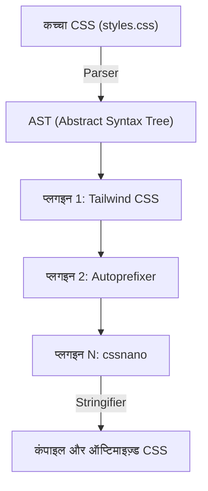
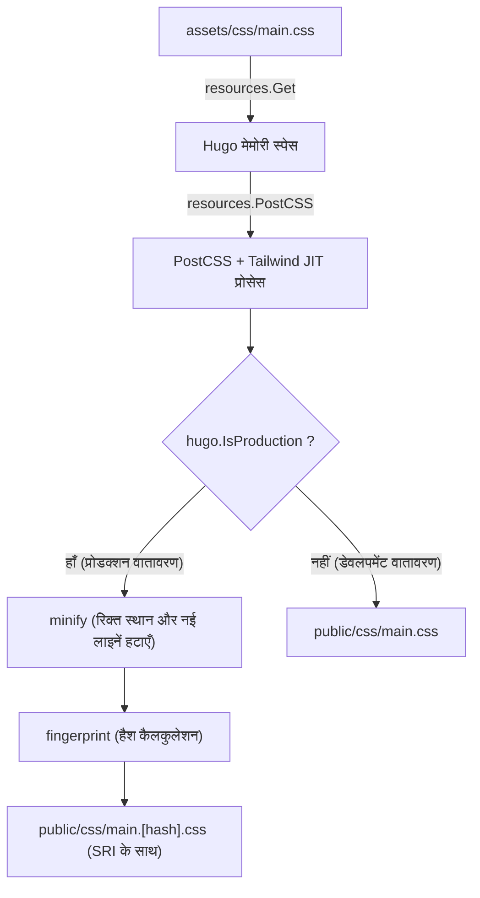

# परिचय: स्टैटिक साइट जनरेटर Hugo और Tailwind CSS की शक्तिशाली सिनर्जी

आधुनिक वेब फ्रंटएंड डेवलपमेंट में, प्रदर्शन और डेवलपमेंट अनुभव (DX: Developer Experience) के बीच संतुलन बनाए रखना हर प्रोजेक्ट की सबसे महत्वपूर्ण चुनौतियों में से एक है। स्टैटिक साइट जनरेटर्स (SSG) में दुनिया की सबसे तेज़ बिल्ड स्पीड वाले **Hugo** और यूटिलिटी-फर्स्ट (utility-first) के अभिनव प्रतिमान (paradigm) को लाने वाले **Tailwind CSS** का संयोजन, इस चुनौती का एक अंतिम समाधान कहा जा सकता है।

Hugo को Go भाषा में लिखा गया है, और यह हजारों पेजों वाली साइटों को भी कुछ ही सेकंड या मिलीसेकंड में बिल्ड करने का अद्भुत प्रदर्शन प्रदान करता है। दूसरी ओर, Tailwind CSS पहले से परिभाषित अनगिनत यूटिलिटी क्लासेस (`flex`, `text-center`, `mt-4` आदि) को सीधे HTML में लिखकर, CSS फाइल और HTML फाइल के बीच होने वाले कॉन्टेक्स्ट स्विच को खत्म करता है, और डिज़ाइन इटरेशन को तेज़ करता है।

इस लेख में, हम Hugo थीम में Tailwind CSS को लागू करने और PostCSS का उपयोग करके एक उन्नत एसेट पाइपलाइन (Hugo Pipes) बनाने की प्रक्रिया को, आर्किटेक्चर के मूल से लेकर गणितीय प्रदर्शन अनुकूलन के दृष्टिकोण तक, विस्तार और गहराई से समझाएंगे।

---

## 1. यूटिलिटी-फर्स्ट CSS और कंपोनेंट-ओरिएंटेड दृष्टिकोण का विकास

Tailwind CSS को लागू करने की प्रक्रिया में जाने से पहले, हमें Tailwind CSS का उपयोग क्यों करना चाहिए, और इसके पीछे CSS डिज़ाइन दर्शन के इतिहास और विकास को गहराई से समझना बहुत फायदेमंद है।

### पारंपरिक CSS डिज़ाइन (BEM और OOCSS) की सीमाएँ
अतीत के वेब विकास में, सिमेंटिक क्लास नाम देना एक सर्वोत्तम अभ्यास माना जाता था। उदाहरण के लिए, एक कार्ड कंपोनेंट बनाते समय, HTML और CSS को निम्न प्रकार से अलग किया जाता था।

```html
<div class="card">
  
  <div class="card__content">
    <h2 class="card__title">शीर्षक</h2>
    <p class="card__description">विवरण यहाँ आएगा।</p>
  </div>
</div>
```

```css
.card {
  border-radius: 8px;
  box-shadow: 0 4px 6px rgba(0,0,0,0.1);
  background-color: #ffffff;
  overflow: hidden;
}
.card__title {
  font-size: 1.5rem;
  font-weight: bold;
  color: #333333;
}
/* इसके बाद, विस्तृत स्टाइल्स आते हैं */
```

इस तरह का BEM (Block Element Modifier) आधारित डिज़ाइन तब तक काम करता है जब तक प्रोजेक्ट का आकार छोटा हो, लेकिन यह निम्नलिखित समस्याओं का कारण बन सकता है:

1. **नामकरण की थकावट और कमी**: हर बार जब आप एक समान कंपोनेंट बनाते हैं, तो आपको एक नया क्लास नाम सोचना पड़ता है (जैसे: `card-news`, `card-featured` आदि)।
2. **CSS का बढ़ना**: हर बार नई सुविधा जोड़ने पर CSS की लाइनें बढ़ती जाती हैं, और एक बार लिखी गई CSS को यह सोचकर डिलीट नहीं किया जाता कि "यह कहाँ उपयोग हो रही है पता नहीं", जिससे डेड कोड जमा होता रहता है।
3. **कॉन्टेक्स्ट स्विच**: HTML स्ट्रक्चर और CSS स्टाइल को अलग-अलग फाइलों में प्रबंधित करने के कारण, एडिटर में टैब के बीच स्विच करने की संख्या बहुत तेजी से बढ़ती है।

### Tailwind CSS द्वारा पैराडाइम शिफ्ट
Tailwind CSS इन समस्याओं को "यूटिलिटी क्लास के संयोजन" के दृष्टिकोण से हल करता है। यदि आप ऊपर दिए गए कार्ड कंपोनेंट के लिए Tailwind CSS का उपयोग करते हैं, तो यह कुछ इस तरह दिखेगा:

```html
<div class="rounded-lg shadow-md bg-white overflow-hidden">
  
  <div class="p-6">
    <h2 class="text-2xl font-bold text-gray-800">शीर्षक</h2>
    <p class="mt-2 text-gray-600">विवरण यहाँ आएगा。</p>
  </div>
</div>
```

चूंकि क्लास का नाम ही स्टाइल का विशिष्ट मान (`p-6` का अर्थ `padding: 1.5rem;` है आदि) दर्शाता है, इसलिए आप केवल HTML को देखकर अंतिम रेंडरिंग परिणाम की भविष्यवाणी कर सकते हैं। इसके अलावा, Tailwind के JIT (Just-In-Time) कंपाइलर के माध्यम से, केवल उपयोग की गई क्लासेस को ही प्रोडक्शन CSS फ़ाइल में निकाला जाता है, जिससे CSS का फ़ाइल आकार बहुत छोटा हो जाता है।

---

## 2. Hugo Pipes और PostCSS का आर्किटेक्चर

Hugo में Tailwind CSS को एकीकृत करने के लिए, आपको **Hugo Pipes** नामक एसेट प्रोसेसिंग पाइपलाइन को समझना होगा। Hugo Pipes एक शक्तिशाली विशेषता है जो Sass/SCSS के कंपाइलेशन, JavaScript की बंडलिंग और Minify, और इस बार उपयोग किए जाने वाले **PostCSS** के निष्पादन जैसी एसेट से संबंधित सभी प्रक्रियाओं को Hugo के भीतर ही पूरा करती है।

PostCSS, JavaScript प्लगइन्स का उपयोग करके CSS को ट्रांसफॉर्म करने का एक टूल है। वास्तव में, Tailwind CSS खुद भी PostCSS के प्लगइन के रूप में काम करता है।

### PostCSS द्वारा AST (Abstract Syntax Tree) ट्रांसफॉर्मेशन तंत्र

PostCSS किस तरह CSS को प्रोसेस करता है, यह समझना ट्रबलशूटिंग के समय बहुत मददगार होता है। नीचे दिया गया Mermaid आरेख दिखाता है कि PostCSS कैसे CSS फ़ाइल को पढ़ता है, प्लगइन्स के माध्यम से इसे ट्रांसफॉर्म करता है, और अंतिम CSS आउटपुट करता है।



1. **Parser (पार्सर)**: इनपुट किए गए कच्चे CSS स्ट्रिंग का विश्लेषण करता है और इसे AST (Abstract Syntax Tree) में बदलता है, जो एक डेटा स्ट्रक्चर है जिसे प्रोग्राम द्वारा प्रोसेस किया जा सकता है।
2. **Plugins (प्लगइन्स)**:
   - **Tailwind CSS**: टेम्पलेट फाइलों (HTML या Markdown) को स्कैन करता है और उपयोग किए गए यूटिलिटी क्लासेस को नोड्स के रूप में AST पर जोड़ता है। इसके अलावा, यह `@tailwind` डायरेक्टिव्स का विस्तार करता है।
   - **Autoprefixer**: `Can I Use` के डेटाबेस का संदर्भ लेता है और आवश्यकतानुसार वेंडर प्रीफिक्स (`-webkit-`, `-moz-` आदि) को AST की प्रॉपर्टीज में जोड़ता है।
3. **Stringifier (स्ट्रिंगिफायर)**: ट्रांसफॉर्मेशन पूरा होने के बाद, AST को फिर से ब्राउज़र द्वारा समझे जा सकने वाले CSS स्ट्रिंग में बदलकर आउटपुट देता है।

---

## 3. पर्यावरण सेटअप और पूर्वापेक्षाएँ

अब, आइए वास्तविक सेटअप प्रक्रिया शुरू ব্যায়াম करते हैं। सबसे पहले, यह जांच लें कि आवश्यक सॉफ़्टवेयर इंस्टॉल हैं या नहीं।

### अनिवार्य आवश्यकताएँ

1. **Hugo Extended Version**:
   सामान्य Hugo के बजाय, **Extended वर्ज़न** अनिवार्य है, जिसमें Sass/SCSS प्रोसेसिंग फीचर्स और नेटिव PostCSS इंटीग्रेशन फीचर्स शामिल हैं। अपने टर्मिनल में निम्नलिखित कमांड चलाएँ और सुनिश्चित करें कि वर्ज़न जानकारी में `extended` स्ट्रिंग शामिल है।

   ```bash
   hugo version
   # अपेक्षित आउटपुट उदाहरण:
   # hugo v0.121.2-4146... windows/amd64 BuildDate=... VendorInfo=gohugoio +extended
   ```

2. **Node.js और npm**:
   Tailwind CSS और PostCSS जैसे डिपेंडेंसी पैकेज Node.js पर चलते हैं। सुनिश्चित करें कि Node.js (LTS वर्ज़न अनुशंसित) इंस्टॉल है।

   ```bash
   node -v
   npm -v
   ```

### npm पैकेजेस का इंस्टॉलेशन

प्रोजेक्ट की रूट डायरेक्टरी (जहाँ Hugo की कॉन्फ़िगरेशन फ़ाइल `hugo.toml` स्थित है) में npm को इनिशियलाइज़ करें और आवश्यक पैकेजेस इंस्टॉल करें।

```bash
# package.json बनाना
npm init -y

# डेवलपमेंट डिपेंडेंसी के रूप में Tailwind CSS, PostCSS, Autoprefixer को इंस्टॉल करना
npm install -D tailwindcss postcss postcss-cli autoprefixer
```

> [!IMPORTANT]
> यदि `postcss-cli` इंस्टॉल नहीं है, तो Hugo के भीतर से PostCSS को कॉल करते समय एरर आ सकता है। Hugo Pipes आंतरिक रूप से `postcss-cli` का उपयोग करता है, इसलिए इसे अवश्य इंस्टॉल करें।

---

## 4. कॉन्फ़िगरेशन फ़ाइलें बनाना (PostCSS और Tailwind CSS)

पैकेज इंस्टॉलेशन पूरा होने के बाद, प्रोजेक्ट के व्यवहार को नियंत्रित करने वाली दो महत्वपूर्ण कॉन्फ़िगरेशन फ़ाइलें बनाएँ। इन्हें प्रोजेक्ट की रूट डायरेक्टरी में रखें।

### tailwind.config.js बनाना

टर्मिनल में निम्न कमांड चलाने पर एक डिफ़ॉल्ट कॉन्फ़िगरेशन फ़ाइल उत्पन्न हो जाएगी।

```bash
npx tailwindcss init
```

उत्पन्न की गई `tailwind.config.js` को एडिटर में खोलें और `content` प्रॉपर्टी सेट करें। यह बहुत महत्वपूर्ण है। Tailwind यहाँ निर्दिष्ट पाथ की फाइलों का विश्लेषण करेगा और उपयोग किए गए क्लासेस को निकालेगा। Hugo के प्रोजेक्ट स्ट्रक्चर के अनुसार, लेआउट फाइलों और कंटेंट फाइलों को सही ढंग से निर्दिष्ट करें।

```javascript
/** @type {import('tailwindcss').Config} */
module.exports = {
  // Hugo की डायरेक्टरी संरचना के अनुसार स्कैन टारगेट निर्दिष्ट करें
  content: [
    "./content/**/*.md",
    "./content/**/*.html",
    "./layouts/**/*.html",
    "./assets/**/*.js",
    // यदि आप किसी थीम का उपयोग कर रहे हैं, तो थीम की डायरेक्टरी को भी शामिल करना होगा
    // "./themes/my-theme/layouts/**/*.html",
  ],
  theme: {
    extend: {
      // कस्टम कलर्स या फोंट्स का विस्तार यहाँ करें
      colors: {
        'brand-primary': '#3490dc',
        'brand-secondary': '#ffed4a',
      },
      fontFamily: {
        'sans': ['Helvetica Neue', 'Arial', 'Hiragino Kaku Gothic ProN', 'Meiryo', 'sans-serif'],
      }
    },
  },
  plugins: [
    // यदि आवश्यक हो तो आधिकारिक प्लगइन्स जोड़ें (उदा: Typography प्लगइन)
    // require('@tailwindcss/typography'),
  ],
}
```

### postcss.config.js बनाना

इसके बाद, प्रोजेक्ट रूट में `postcss.config.js` बनाएँ, जो परिभाषित करता है कि PostCSS किन प्लगइन्स को किस क्रम में चलाएगा।

```javascript
module.exports = {
  plugins: {
    tailwindcss: {},
    autoprefixer: {},
  }
}
```

इस सेटिंग के साथ, जब Hugo PostCSS को कॉल करता है, तो पहले Tailwind CSS प्रोसेसिंग की जाएगी, और उसके बाद Autoprefixer द्वारा वेंडर प्रीफिक्स जोड़ा जाएगा।

---

## 5. Hugo में CSS एसेट पाइपलाइन का निर्माण

कॉन्फ़िगरेशन पूरा होने के बाद, अंततः हम Hugo की थीम में Tailwind CSS को जोड़ेंगे।

### 5-1. एंट्री पॉइंट के रूप में CSS फ़ाइल बनाना

`assets/css/` डायरेक्टरी में (यदि यह मौजूद नहीं है तो इसे बनाएँ), एंट्री पॉइंट के रूप में काम करने वाली एक CSS फ़ाइल बनाएँ। यहाँ हम इसे `main.css` कहेंगे।

**फ़ाइल पाथ: `assets/css/main.css`**

```css
/* Tailwind की बेस स्टाइल्स (जैसे रिसेट CSS) को लोड करना */
@tailwind base;

/* कंपोनेंट क्लासेस को लोड करना */
@tailwind components;

/* यूटिलिटी क्लासेस को लोड करना */
@tailwind utilities;

/* यदि आपको कस्टम CSS की आवश्यकता है तो आप यहाँ लिख सकते हैं,
   लेकिन जितना हो सके tailwind.config.js के extend में जोड़ने की सलाह दी जाती है */
@layer components {
  .btn-primary {
    @apply bg-blue-500 hover:bg-blue-700 text-white font-bold py-2 px-4 rounded transition-colors duration-300;
  }
}
```

### 5-2. लेआउट फ़ाइल (head.html) को एडिट करना

इसके बाद, हम Hugo के टेम्पलेट से उपरोक्त CSS फ़ाइल को लोड करेंगे और PostCSS द्वारा प्रोसेस करने के लिए पाइपलाइन लिखेंगे। आम तौर पर, हम पार्शियल टेम्पलेट को एडिट करते हैं जो `<head>` टैग को परिभाषित करता है (उदा: `layouts/partials/head.html`)।

**फ़ाइल पाथ: `layouts/partials/head.html`**

```go-html-template
<head>
  <meta charset="utf-8">
  <meta name="viewport" content="width=device-width, initial-scale=1">
  <title>{{ .Title }} | {{ .Site.Title }}</title>

  <!-- assets/css/main.css प्राप्त करें -->
  {{ $css := resources.Get "css/main.css" }}

  <!-- PostCSS विकल्प परिभाषा -->
  {{ $options := dict "inlineImports" true }}
  {{ $css = $css | resources.PostCSS $options }}

  <!-- प्रोडक्शन (Production) के लिए एसेट ऑप्टिमाइज़ेशन पाइपलाइन -->
  {{ if hugo.IsProduction }}
    <!-- 1. Minify (कंप्रेस) -->
    {{ $css = $css | minify }}
    <!-- 2. Fingerprint (कैश बस्टिंग के लिए हैश जोड़ना) -->
    {{ $css = $css | fingerprint "sha512" }}
    <!-- 3. SRI (Subresource Integrity) के साथ टैग आउटपुट करें -->
    <link rel="stylesheet" href="{{ $css.RelPermalink }}" integrity="{{ $css.Data.Integrity }}" crossorigin="anonymous">
  {{ else }}
    <!-- डेवलपमेंट (Development) वातावरण में कंप्रेस किए बिना आउटपुट करें (बिल्ड स्पीड को प्राथमिकता) -->
    <link rel="stylesheet" href="{{ $css.RelPermalink }}">
  {{ end }}
</head>
```

#### पाइपलाइन स्पष्टीकरण और Mermaid आरेख

ऊपर दिया गया Go टेम्पलेट कोड CSS फ़ाइल को कैसे प्रोसेस करता है, इसके पाइपलाइन प्रोसेसिंग को आरेख के माध्यम से स्पष्ट किया गया है।



1. **`resources.Get`**: `assets` डायरेक्टरी के भीतर निर्दिष्ट फ़ाइल को ढूँढता है और इसे मेमोरी में रिसोर्स ऑब्जेक्ट के रूप में लोड करता है।
2. **`resources.PostCSS`**: प्रोजेक्ट रूट में `postcss.config.js` का संदर्भ लेता है और CSS सोर्स कोड पर Tailwind CSS और Autoprefixer प्रोसेसिंग लागू करता है। डेवलपमेंट वातावरण (`hugo server`) में, JIT मोड काम करता है, और फ़ाइल बदलने पर यह तेज़ी से केवल आवश्यक क्लासेस उत्पन्न करता है।
3. **`minify`**: प्रोडक्शन बिल्ड के दौरान (उदा: `hugo --environment production`), यह अनावश्यक स्पेस और कमेंट्स को हटाकर फ़ाइल साइज़ को कम कर देता है।
4. **`fingerprint`**: फ़ाइल सामग्री के आधार पर SHA हैश की गणना करता है और इसे फ़ाइल नाम में जोड़ता है (उदा: `main.ab12cd...css`)। इससे ब्राउज़र के शक्तिशाली कैश का उपयोग करते हुए, CSS अपडेट होने पर नई फ़ाइल लोड होने की गारंटी मिलती है, जिसे "कैश बस्टिंग" कहा जाता है।
5. **`integrity`**: Fingerprint द्वारा गणना किए गए हैश मान का उपयोग करके SRI (Subresource Integrity) विशेषता आउटपुट करता है, जो CDN आदि से डेटा में छेड़छाड़ को रोकता है।

---

## 6. CSS ऑप्टिमाइज़ेशन में गणितीय प्रदर्शन विश्लेषण

Tailwind CSS को लागू करने का सबसे बड़ा लाभ यह है कि डिलीवर की गई CSS फ़ाइल का आकार बहुत कम हो जाता है। इसका वेब परफॉरमेंस (विशेष रूप से First Contentful Paint: FCP) पर क्या प्रभाव पड़ता है, आइए गणितीय मॉडल का उपयोग करके इसका मात्रात्मक विश्लेषण करें।

### CSS फ़ाइल आकार में कमी का मॉडल

पारंपरिक CSS फ्रेमवर्क (जैसे Bootstrap) में, उन स्टाइल्स को भी लोड किया जाता है जिनका उपयोग नहीं किया जा रहा है, जिससे फ़ाइल का आकार $S_{original}$ बड़ा हो जाता है (लगभग 150KB - 200KB)।
Tailwind CSS के JIT कंपाइलर द्वारा अनावश्यक क्लासेस को हटाने (Purge) के बाद का आकार $S_{purged}$ मानते हुए, कमी दर $R_{purge}$ का उपयोग करके इसे इस प्रकार व्यक्त किया जा सकता है:

$$
S_{purged} = S_{original} \times (1 - R_{purge})
$$

एक सामान्य प्रोजेक्ट में, $R_{purge}$ लगभग $0.9$ (90% की कमी) तक पहुँच जाता है, और $S_{purged}$ मात्र 10KB से 20KB तक रह जाता है।

इसके अलावा, डिलीवरी के समय सर्वर साइड पर Brotli या Gzip द्वारा संपीड़न किया जाता है। यदि संपीड़न दर को $R_{compress}$ (आमतौर पर लगभग 0.7 - 0.8) माना जाए, तो नेटवर्क से गुज़रने वाला अंतिम पेलोड आकार $S_{final}$ की गणना इस सूत्र से की जाती है:

$$
S_{final} = S_{purged} \times (1 - R_{compress})
$$

### क्रिटिकल रेंडरिंग पाथ और नेटवर्क विलंबता

ब्राउज़र द्वारा स्क्रीन पर पहला कंटेंट रेंडर करने में लगने वाले समय (FCP) का अनुमान HTML डाउनलोड समय, CSS डाउनलोड समय और रेंडरिंग समय के योग से लगाया जा सकता है।

$$
T_{FCP} \approx RTT + \frac{S_{HTML}}{BW} + RTT + \frac{S_{final}}{BW} + T_{render}
$$

यहाँ,
- $RTT$ : Round Trip Time (सर्वर के साथ राउंड-ट्रिप संचार में देरी का समय)
- $BW$ : नेटवर्क बैंडविड्थ (Bandwidth)

मोबाइल नेटवर्क जैसे वातावरण में जहाँ $BW$ कम है और $RTT$ बड़ा है (देरी अधिक है), Tailwind CSS का दृष्टिकोण जो $S_{final}$ को कुछ किलोबाइट्स तक कम कर सकता है, $\frac{S_{final}}{BW}$ को शून्य के करीब ले आता है, जिससे Google PageSpeed Insights आदि में शानदार स्कोर प्राप्त होता है।

---

## 7. डेवलपमेंट सर्वर को शुरू करना और हॉट रिलोड की पुष्टि करना

सभी सेटिंग्स पूरी होने के बाद, Hugo का डेवलपमेंट सर्वर शुरू करें और जांचें कि क्या Tailwind CSS सही ढंग से काम कर रहा है।

```bash
hugo server -D
```

ब्राउज़र में `http://localhost:1313/` पर जाएं और जांचें कि क्या साइट दिखाई दे रही है।
Markdown के कंटेंट फाइलों या Hugo के टेम्पलेट्स (`layouts/` के अंतर्गत फ़ाइलें) को खोलें और क्लासेस जोड़ने का प्रयास करें।

```html
<!-- परीक्षण के लिए Tailwind क्लासेस लागू करने का उदाहरण -->
<div class="bg-gradient-to-r from-blue-500 to-purple-600 text-white p-8 rounded-xl shadow-2xl text-center transform transition duration-500 hover:scale-105">
  <h1 class="text-4xl font-extrabold tracking-tight">Tailwind CSS + Hugo is Awesome!</h1>
  <p class="mt-4 text-lg font-medium">पुष्टि करें कि हॉट रिलोड तुरंत लागू हो गया है।</p>
</div>
```

फ़ाइल को सहेजते ही, आपको तुरंत हॉट रिलोड का अनुभव होगा: Hugo का शक्तिशाली फ़ाइल वॉचर और Tailwind का JIT कंपाइलर मिलकर काम करते हैं, और मिलीसेकंड में CSS फिर से बन जाता है, और ब्राउज़र अपने आप रीलोड हो जाता है।

### ट्रबलशूटिंग: यदि स्टाइल लागू नहीं हो रहे हैं

यदि परिवर्तन लागू नहीं हो रहे हैं, तो कृपया निम्नलिखित बिंदुओं की जाँच करें:

1. **`tailwind.config.js` में `content` पाथ सेटिंग**
   यदि स्कैन करने के लिए फ़ाइल पाथ गलत हैं, तो Tailwind फ़ाइल में उपयोग किए गए क्लासेस का पता नहीं लगा पाएगा और उन्हें CSS में आउटपुट नहीं करेगा। विशेष रूप से यदि आप किसी थीम का उपयोग कर रहे हैं, तो जांचें कि थीम डायरेक्टरी का पाथ छूटा तो नहीं है।
2. **PostCSS एरर**
   यदि टर्मिनल के Hugo सर्वर लॉग में `Error: failed to transform resource: PostCSS not found` जैसा एरर आ रहा है, तो हो सकता है कि `npm install` सही तरीके से नहीं चला हो, या `postcss-cli` गायब हो।
3. **Hugo का कैश साफ़ करना**
   कभी-कभी Hugo के कैश के कारण पुरानी CSS रह सकती है। सर्वर को रोकें और `hugo server --ignoreCache` से शुरू करें, या OS की अस्थायी डायरेक्टरी (जैसे `/tmp/hugo_cache/`) को हटा दें।

---

## 8. प्रोडक्शन के लिए बिल्ड और अधिक उन्नत बनाना

अपनी साइट को प्रोडक्शन सर्वर (Netlify, Vercel, GitHub Pages, Cloudflare Pages आदि) पर डिप्लॉय करते समय, आपको पर्यावरण वेरिएबल सेट करके प्रोडक्शन ऑप्टिमाइज़ेशन पाइपलाइन को चलाना होगा।

```bash
# प्रोडक्शन बिल्ड कमांड का उदाहरण
NODE_ENV=production hugo --minify --environment production
```

`--environment production` फ्लैग जोड़ने से, `head.html` के अंदर का `{{ if hugo.IsProduction }}` ब्लॉक निष्पादित होता है, जो CSS को Minify करता है और Fingerprint जोड़ता है।

### Typography प्लगइन का उपयोग करके Markdown की स्टाइलिंग

Hugo जैसी ब्लॉग या डॉक्यूमेंट साइटों में, आप Markdown से उत्पन्न शुद्ध HTML तत्वों (`<h1>`, `<p>`, `<ul>` आदि) पर सीधे क्लास नहीं जोड़ सकते। इस स्थिति में, Tailwind का आधिकारिक **Typography प्लगइन** बहुत उपयोगी होता है।

1. प्लगइन इंस्टॉल करना
   ```bash
   npm install -D @tailwindcss/typography
   ```

2. इसे `tailwind.config.js` में जोड़ना
   ```javascript
   module.exports = {
     // ...
     plugins: [
       require('@tailwindcss/typography'),
     ],
   }
   ```

3. टेम्पलेट में लागू करना
   लेख के टेक्स्ट को आउटपुट करने वाले कंटेनर एलिमेंट में केवल `prose` क्लास (और आपके इच्छित रंग या आकार का वैरिएंट) जोड़ने से, एक सुंदर डिफ़ॉल्ट स्टाइल लागू हो जाएगी।

   ```go-html-template
   <article class="prose prose-lg prose-blue mx-auto mt-10">
     {{ .Content }}
   </article>
   ```

इससे हाथ से जटिल CSS सिलेक्टर (`.article-content h2 { ... }`) लिखने की आवश्यकता पूरी तरह खत्म हो जाती है, और कंपोनेंट की मोड्युलैरिटी पूरी तरह से बनी रहती है।

---

## 9. निष्कर्ष: उच्च रख-रखाव वाले फ्रंटएंड इकोसिस्टम का निर्माण

बहुत बढ़िया! अब आपके पास एक उत्तम वेब डेवलपमेंट एसेट पाइपलाइन है, जिसमें Hugo का सुपर-फ़ास्ट स्टैटिक साइट जनरेशन इंजन, Tailwind CSS की आधुनिक स्टाइलिंग क्षमताएँ, और PostCSS की एक्सटेंसिबिलिटी शामिल है।

इस आर्किटेक्चर की सबसे बड़ी खूबी यह है कि **"कॉन्फ़िगरेशन केवल एक बार करना होता है"**। एक बार पाइपलाइन बन जाने के बाद, डेवलपर्स को CSS फ़ाइल खोलने की आवश्यकता नहीं होती; वे केवल HTML या Markdown टेम्पलेट्स में सहज यूटिलिटी क्लासेस को लिखकर शानदार गति से जटिल UI बना सकते हैं।

इसके अलावा, आउटपुट की गई CSS का आकार हमेशा न्यूनतम रखा जाता है, जो सीधे Core Web Vitals स्कोर को बेहतर बनाने में मदद करता है, और SEO के दृष्टिकोण से भी यह बहुत फायदेमंद है।

Hugo और Tailwind CSS का संयोजन, व्यक्तिगत टेक ब्लॉग्स से लेकर बड़े कॉर्पोरेट वेबसाइट्स तक, सभी प्रोजेक्ट्स के लिए हमेशा "सर्वोत्तम विकल्पों" में से एक रहेगा। अपने आरामदायक वेब डेवलपमेंट अनुभव का आनंद लेने के लिए इस शक्तिशाली टूलचेन का लाभ ज़रूर उठाएँ!
