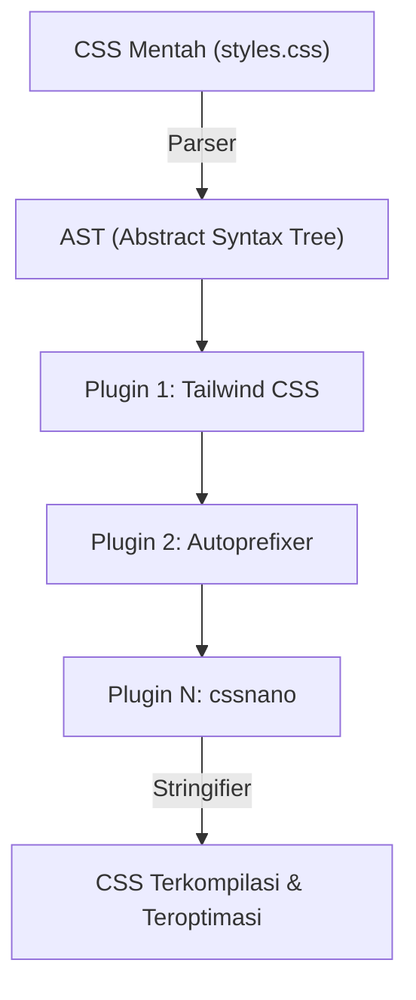
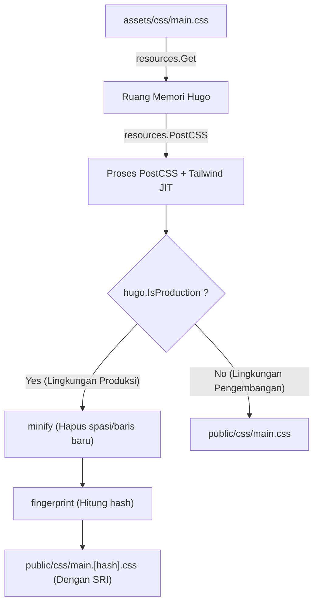

# Pengantar: Sinergi Kuat antara Hugo Static Site Generator dan Tailwind CSS

Dalam pengembangan frontend web modern, menyeimbangkan kinerja dan pengalaman pengembangan (DX: Developer Experience) adalah salah satu masalah paling penting dalam setiap proyek. Menggabungkan **Hugo**, yang membanggakan kecepatan build tercepat di dunia di antara Static Site Generators (SSG), dengan **Tailwind CSS**, yang membawa paradigma inovatif berupa utility-first, bisa dikatakan sebagai salah satu solusi utama untuk tantangan ini.

Hugo ditulis dalam bahasa Go dan memiliki performa luar biasa yang menyelesaikan proses build hanya dalam beberapa detik atau bahkan milidetik, bahkan untuk situs dengan ribuan halaman. Di sisi lain, Tailwind CSS memungkinkan Anda menulis kelas utilitas yang sudah ditentukan sebelumnya (seperti `flex`, `text-center`, `mt-4`) secara langsung di HTML, menghilangkan konteks switching antara file CSS dan HTML, serta mempercepat iterasi desain.

Dalam artikel ini, kami akan menjelaskan langkah-langkah untuk mengimplementasikan Tailwind CSS pada tema Hugo, dan selanjutnya membangun asset pipeline tingkat lanjut (Hugo Pipes) menggunakan PostCSS. Kami akan membahas ini secara detail, mulai dari fondasi arsitektur hingga optimasi performa matematis.

---

## 1. Evolusi CSS Utility-First dan Pendekatan Berorientasi Komponen

Sebelum masuk ke langkah-langkah implementasi Tailwind CSS, sangat bermanfaat untuk memahami secara mendalam sejarah dan evolusi filosofi desain CSS di balik mengapa kita harus menggunakan Tailwind CSS.

### Keterbatasan Desain CSS Tradisional (BEM dan OOCSS)
Dalam pengembangan web di masa lalu, memberikan penamaan kelas semantik dianggap sebagai praktik terbaik. Misalnya, saat membuat komponen kartu, kita memisahkan HTML dan CSS seperti ini.

```html
<div class="card">
  
  <div class="card__content">
    <h2 class="card__title">Judul</h2>
    <p class="card__description">Teks deskripsi ada di sini.</p>
  </div>
</div>
```

```css
.card {
  border-radius: 8px;
  box-shadow: 0 4px 6px rgba(0,0,0,0.1);
  background-color: #ffffff;
  overflow: hidden;
}
.card__title {
  font-size: 1.5rem;
  font-weight: bold;
  color: #333333;
}
/* Kode gaya (style) lebih lanjut berikutnya */
```

Desain berbasis BEM (Block Element Modifier) seperti ini berfungsi baik saat ukuran proyek masih kecil, tetapi cenderung menimbulkan masalah berikut:

1. **Penamaan yang Melelahkan dan Habis**: Setiap kali kita membuat komponen serupa, kita harus memikirkan nama kelas baru (misalnya, `card-news`, `card-featured`).
2. **Pembengkakan CSS**: Setiap kali fitur baru ditambahkan, baris CSS terus bertambah. Karena rasa takut "tidak tahu di mana CSS tersebut digunakan", kode jarang dihapus, dan dead code menumpuk.
3. **Konteks Switching**: Karena struktur HTML dan gaya CSS dikelola dalam file yang berbeda, jumlah pergantian tab di editor meningkat secara eksponensial.

### Pergeseran Paradigma oleh Tailwind CSS
Tailwind CSS memecahkan masalah ini dengan pendekatan "kombinasi kelas utilitas". Komponen kartu di atas akan terlihat seperti ini jika menggunakan Tailwind CSS.

```html
<div class="rounded-lg shadow-md bg-white overflow-hidden">
  
  <div class="p-6">
    <h2 class="text-2xl font-bold text-gray-800">Judul</h2>
    <p class="mt-2 text-gray-600">Teks deskripsi ada di sini.</p>
  </div>
</div>
```

Karena nama kelas itu sendiri mewakili nilai gaya spesifik (seperti `p-6` berarti `padding: 1.5rem;`), Anda dapat memprediksi hasil akhir render hanya dengan melihat HTML-nya. Selain itu, kompiler JIT (Just-In-Time) Tailwind mengekstrak hanya kelas yang benar-benar digunakan ke dalam file CSS untuk production, yang membuat ukuran file CSS menjadi sangat kecil.

---

## 2. Arsitektur Hugo Pipes dan PostCSS

Untuk mengintegrasikan Tailwind CSS dengan Hugo, Anda perlu memahami asset processing pipeline yang disebut **Hugo Pipes**. Hugo Pipes adalah fitur yang kuat yang menangani seluruh proses yang berkaitan dengan aset di dalam Hugo, seperti mengkompilasi Sass/SCSS, mem-bundle dan mengecilkan (Minify) JavaScript, dan mengeksekusi **PostCSS** yang akan kita gunakan di sini.

PostCSS adalah alat untuk mengubah CSS menggunakan plugin JavaScript. Tailwind CSS itu sendiri juga beroperasi sebagai plugin untuk PostCSS.

### Mekanisme Transformasi AST (Abstract Syntax Tree) dengan PostCSS

Memahami bagaimana PostCSS memproses CSS sangat membantu saat melakukan pemecahan masalah (troubleshooting). Diagram Mermaid berikut menunjukkan pipeline dari PostCSS membaca file CSS, mengubahnya melalui plugin, hingga output CSS final.



1. **Parser**: Mengurai (parsing) string CSS mentah yang dimasukkan dan mengubahnya menjadi AST (Abstract Syntax Tree), struktur data yang dapat dimanipulasi oleh program.
2. **Plugins (Kumpulan plugin)**:
   - **Tailwind CSS**: Memindai file template (HTML atau Markdown) dan menambahkan kelas utilitas yang digunakan sebagai node pada AST. Ini juga mengekspansi arahan (directive) `@tailwind`.
   - **Autoprefixer**: Merujuk ke database `Can I Use` dan menambahkan prefiks vendor (seperti `-webkit-`, `-moz-`) pada properti di AST jika diperlukan.
3. **Stringifier**: Mengubah kembali AST yang sudah diproses menjadi string CSS yang dapat dipahami oleh browser sebagai output.

---

## 3. Pengaturan Lingkungan dan Prasyarat

Sekarang, mari kita masuk ke langkah-langkah implementasi yang sebenarnya. Pertama, pastikan perangkat lunak yang diperlukan sudah terinstal.

### Persyaratan Utama

1. **Hugo Extended Version**:
   Alih-alih versi Hugo biasa, **versi Extended** mutlak diperlukan karena mencakup pemrosesan Sass/SCSS dan dukungan PostCSS asli. Jalankan perintah berikut di terminal dan pastikan ada teks `extended` pada informasi versinya.

   ```bash
   hugo version
   # Contoh output yang diharapkan:
   # hugo v0.121.2-4146... windows/amd64 BuildDate=... VendorInfo=gohugoio +extended
   ```

2. **Node.js dan npm**:
   Paket dependensi seperti Tailwind CSS dan PostCSS berjalan di Node.js. Pastikan Node.js (direkomendasikan versi LTS) sudah terinstal.

   ```bash
   node -v
   npm -v
   ```

### Instalasi Paket npm

Inisialisasi npm di direktori root proyek (di mana file konfigurasi Hugo `hugo.toml` berada) dan instal paket yang diperlukan.

```bash
# Menghasilkan package.json
npm init -y

# Menginstal Tailwind CSS, PostCSS, dan Autoprefixer sebagai dependensi pengembangan
npm install -D tailwindcss postcss postcss-cli autoprefixer
```

> [!IMPORTANT]
> Jika `postcss-cli` tidak diinstal, error dapat terjadi saat memanggil PostCSS dari dalam Hugo. Karena Hugo Pipes menggunakan `postcss-cli` secara internal, pastikan Anda menginstalnya.

---

## 4. Pembuatan File Konfigurasi (PostCSS & Tailwind CSS)

Setelah paket diinstal, kita akan membuat dua file konfigurasi penting yang mengontrol perilaku proyek. Tempatkan di direktori root proyek.

### Membuat tailwind.config.js

Jalankan perintah berikut di terminal untuk menghasilkan file konfigurasi default.

```bash
npx tailwindcss init
```

Buka `tailwind.config.js` yang dihasilkan di editor Anda dan atur properti `content`. Ini sangat penting. Tailwind akan mengurai file pada path yang ditentukan di sini dan mengekstrak kelas yang digunakan. Sesuaikan dengan struktur proyek Hugo Anda dan spesifikasikan file tata letak (layout) dan konten secara akurat.

```javascript
/** @type {import('tailwindcss').Config} */
module.exports = {
  // Tentukan target yang akan dipindai berdasarkan struktur direktori Hugo
  content: [
    "./content/**/*.md",
    "./content/**/*.html",
    "./layouts/**/*.html",
    "./assets/**/*.js",
    // Jika Anda menggunakan tema, sertakan juga direktori temanya
    // "./themes/my-theme/layouts/**/*.html",
  ],
  theme: {
    extend: {
      // Perluas custom color atau font di sini
      colors: {
        'brand-primary': '#3490dc',
        'brand-secondary': '#ffed4a',
      },
      fontFamily: {
        'sans': ['Helvetica Neue', 'Arial', 'Hiragino Kaku Gothic ProN', 'Meiryo', 'sans-serif'],
      }
    },
  },
  plugins: [
    // Tambahkan plugin resmi jika diperlukan (contoh: plugin Typography)
    // require('@tailwindcss/typography'),
  ],
}
```

### Membuat postcss.config.js

Selanjutnya, buat `postcss.config.js` di root proyek, yang menentukan plugin mana yang akan dieksekusi PostCSS dan dalam urutan apa.

```javascript
module.exports = {
  plugins: {
    tailwindcss: {},
    autoprefixer: {},
  }
}
```

Dengan konfigurasi ini, ketika Hugo memanggil PostCSS, proses Tailwind CSS akan dilakukan terlebih dahulu, dan kemudian penambahan prefiks vendor oleh Autoprefixer akan diterapkan.

---

## 5. Membangun Asset Pipeline CSS di Hugo

Setelah konfigurasi selesai, mari integrasikan Tailwind CSS ke sisi tema Hugo.

### 5-1. Membuat file CSS sebagai Entry Point

Buat file CSS sebagai entry point di direktori `assets/css/` (buat direktorinya jika belum ada). Kita akan menyebutnya `main.css`.

**Path file: `assets/css/main.css`**

```css
/* Memuat gaya dasar Tailwind (reset CSS, dll.) */
@tailwind base;

/* Memuat kelas komponen */
@tailwind components;

/* Memuat kelas utilitas */
@tailwind utilities;

/* Jika Anda membutuhkan CSS kustom Anda sendiri, Anda dapat menambahkannya di sini,
   tetapi sangat disarankan untuk menggunakan extend di tailwind.config.js */
@layer components {
  .btn-primary {
    @apply bg-blue-500 hover:bg-blue-700 text-white font-bold py-2 px-4 rounded transition-colors duration-300;
  }
}
```

### 5-2. Mengedit File Layout (head.html)

Selanjutnya, ambil file CSS di atas dari template Hugo dan tulis pipeline untuk memprosesnya menggunakan PostCSS. Umumnya, Anda mengedit sebagian template (partial template) yang mendefinisikan tag `<head>` (contoh: `layouts/partials/head.html`).

**Path file: `layouts/partials/head.html`**

```go-html-template
<head>
  <meta charset="utf-8">
  <meta name="viewport" content="width=device-width, initial-scale=1">
  <title>{{ .Title }} | {{ .Site.Title }}</title>

  <!-- Mengambil assets/css/main.css -->
  {{ $css := resources.Get "css/main.css" }}

  <!-- Mendefinisikan opsi PostCSS -->
  {{ $options := dict "inlineImports" true }}
  {{ $css = $css | resources.PostCSS $options }}

  <!-- Pipeline optimasi aset untuk Production -->
  {{ if hugo.IsProduction }}
    <!-- 1. Minify (Kompresi) -->
    {{ $css = $css | minify }}
    <!-- 2. Fingerprint (Penambahan hash untuk cache busting) -->
    {{ $css = $css | fingerprint "sha512" }}
    <!-- 3. Mencetak tag termasuk SRI (Subresource Integrity) -->
    <link rel="stylesheet" href="{{ $css.RelPermalink }}" integrity="{{ $css.Data.Integrity }}" crossorigin="anonymous">
  {{ else }}
    <!-- Tanpa kompresi di lingkungan Development, output langsung (memprioritaskan kecepatan build) -->
    <link rel="stylesheet" href="{{ $css.RelPermalink }}">
  {{ end }}
</head>
```

#### Penjelasan Pipeline dan Diagram Mermaid

Kami akan menggambarkan bagaimana kode template Go di atas memproses file CSS secara terstruktur melalui pipeline.



1. **`resources.Get`**: Mencari file yang ditentukan dalam direktori `assets` dan memuatnya sebagai objek sumber daya di memori.
2. **`resources.PostCSS`**: Merujuk ke `postcss.config.js` pada root proyek, dan menerapkan proses Tailwind CSS dan Autoprefixer ke source code CSS. Dalam mode pengembangan (`hugo server`), mode JIT diaktifkan dan secara cepat menghasilkan hanya kelas-kelas yang diperlukan saat file berubah.
3. **`minify`**: Selama build produksi (seperti `hugo --environment production`), menghapus spasi atau komentar yang tidak diperlukan untuk mengecilkan ukuran file.
4. **`fingerprint`**: Menghitung hash SHA berdasarkan konten file dan menambahkannya ke nama file (contoh: `main.ab12cd...css`). Hal ini mewujudkan "cache busting" yang memaksa browser untuk memuat ulang file baru ketika CSS diperbarui, meskipun tetap memanfaatkan caching yang kuat.
5. **`integrity`**: Menghasilkan atribut SRI untuk mencegah peretasan melalui CDN atau hal lainnya menggunakan nilai hash yang dihitung oleh Fingerprint.

---

## 6. Analisis Kinerja Matematis dalam Optimasi CSS

Salah satu manfaat terbesar menerapkan Tailwind CSS adalah meminimalkan ukuran file CSS yang dikirim. Mari kita analisis secara matematis menggunakan model tentang bagaimana hal ini memengaruhi kinerja web (terutama First Contentful Paint: FCP).

### Model Pengurangan Ukuran File CSS

Dalam kerangka CSS tradisional (seperti Bootstrap), seluruh kode dimuat, termasuk style yang tidak digunakan, sehingga ukuran file $S_{original}$ cenderung besar (sekitar 150KB hingga 200KB).
Misalkan ukuran setelah pembersihan (Purge) oleh kompiler JIT Tailwind CSS adalah $S_{purged}$, dengan menggunakan rasio pengurangan $R_{purge}$, kita dapat merumuskannya sebagai berikut:

$$
S_{purged} = S_{original} \times (1 - R_{purge})
$$

Dalam proyek biasa, $R_{purge}$ dapat mencapai hampir $0.9$ (pengurangan 90%), membuat $S_{purged}$ hanya tersisa sekitar 10KB hingga 20KB.

Selain itu, ketika dilayani (served), server menggunakan kompresi Brotli atau Gzip. Jika rasio kompresi adalah $R_{compress}$ (biasanya sekitar 0.7 hingga 0.8), ukuran payload akhir $S_{final}$ yang berjalan di jaringan dihitung dengan rumus berikut:

$$
S_{final} = S_{purged} \times (1 - R_{compress})
$$

### Critical Rendering Path dan Keterlambatan Jaringan (Network Latency)

Waktu yang diperlukan peramban untuk menggambar konten pertama (FCP) dapat diperkirakan dari jumlah waktu pengunduhan HTML, waktu pengunduhan CSS, dan waktu perenderan (rendering).

$$
T_{FCP} \approx RTT + \frac{S_{HTML}}{BW} + RTT + \frac{S_{final}}{BW} + T_{render}
$$

Di mana:
- $RTT$ : Round Trip Time (Waktu keterlambatan komunikasi bolak-balik dengan server)
- $BW$ : Bandwidth jaringan

Dalam lingkungan dengan $BW$ sempit dan $RTT$ tinggi (seperti jaringan seluler), pendekatan Tailwind CSS yang dapat memangkas $S_{final}$ hingga tinggal beberapa kilobyte akan membuat nilai variabel $\frac{S_{final}}{BW}$ mendekati nol. Hal ini adalah kekuatan pendorong yang dapat menghasilkan skor mengagumkan (di Google PageSpeed Insights, dll.).

---

## 7. Menjalankan Server Pengembangan dan Memeriksa Hot Reload

Setelah semua pengaturan selesai, jalankan server pengembangan Hugo dan pastikan Tailwind CSS berfungsi dengan baik.

```bash
hugo server -D
```

Akses `http://localhost:1313/` pada browser dan pastikan situs ditampilkan.
Buka file konten Markdown atau template Hugo (file di bawah `layouts/`), dan cobalah menambahkan beberapa kelas.

```html
<!-- Contoh penerapan kelas Tailwind untuk pengujian -->
<div class="bg-gradient-to-r from-blue-500 to-purple-600 text-white p-8 rounded-xl shadow-2xl text-center transform transition duration-500 hover:scale-105">
  <h1 class="text-4xl font-extrabold tracking-tight">Tailwind CSS + Hugo is Awesome!</h1>
  <p class="mt-4 text-lg font-medium">Pastikan hot reload langsung terefleksi dalam hitungan detik.</p>
</div>
```

Setelah Anda menyimpan file, watcher file dari Hugo dan kompiler JIT Tailwind akan berkolaborasi secara real-time. Anda akan merasakan pengalaman dari CSS yang dibuat ulang dalam hitungan milidetik dan browser dimuat ulang secara otomatis (hot reload).

### Pemecahan Masalah (Troubleshooting): Jika Style Tidak Terefleksikan

Jika perubahan tidak terefleksikan, harap periksa poin-poin berikut:

1. **Pengaturan path `content` di `tailwind.config.js`**
   Jika path file target yang dipindai salah, Tailwind tidak dapat mendeteksi kelas yang digunakan di dalamnya dan tidak akan menampilkannya di CSS. Terutama jika Anda menggunakan tema, periksa apakah path direktori temanya terlewat.
2. **Error PostCSS**
   Jika log server Hugo di terminal menunjukkan error seperti `Error: failed to transform resource: PostCSS not found`, kemungkinan `npm install` tidak dijalankan dengan benar, atau `postcss-cli` mungkin kurang.
3. **Membersihkan Cache Hugo**
   Dalam kasus yang jarang terjadi, cache Hugo dapat menyisakan file CSS lama. Hentikan server, dan jalankan lagi dengan `hugo server --ignoreCache`, atau hapus direktori sementara OS (seperti `/tmp/hugo_cache/`).

---

## 8. Build Lingkungan Produksi dan Peningkatan Lebih Lanjut

Saat mendeploy situs web Anda ke server produksi (Netlify, Vercel, GitHub Pages, Cloudflare Pages, dll.), Anda harus mengatur variabel environment dan menjalankan pipeline optimasi produksi.

```bash
# Contoh perintah build untuk produksi
NODE_ENV=production hugo --minify --environment production
```

Dengan menyertakan flag `--environment production`, blok `{{ if hugo.IsProduction }}` pada `head.html` akan dieksekusi, lalu CSS Minify dan penambahan Fingerprint akan diterapkan.

### Styling Markdown menggunakan Plugin Typography

Di blog atau situs dokumentasi seperti Hugo, Anda tidak dapat menambahkan kelas secara langsung ke elemen HTML murni (`<h1>`, `<p>`, `<ul>`, dll.) yang dihasilkan dari Markdown. Dalam kasus ini, **Typography Plugin** resmi dari Tailwind akan sangat membantu.

1. Menginstal Plugin
   ```bash
   npm install -D @tailwindcss/typography
   ```

2. Menambahkannya ke `tailwind.config.js`
   ```javascript
   module.exports = {
     // ...
     plugins: [
       require('@tailwindcss/typography'),
     ],
   }
   ```

3. Menerapkannya di template
   Cukup dengan memberikan kelas `prose` (serta varian warna dan ukuran jika mau) ke elemen pembungkus (container) yang memuat konten tulisan, default styling yang indah akan diterapkan.

   ```go-html-template
   <article class="prose prose-lg prose-blue mx-auto mt-10">
     {{ .Content }}
   </article>
   ```

Ini sepenuhnya menghilangkan keharusan menulis selector CSS kompleks secara manual (`.article-content h2 { ... }`), dan modularitas komponen akan dipertahankan dengan sempurna.

---

## 9. Kesimpulan: Ekosistem Frontend yang Sangat Maintenable (Dapat Dipelihara)

Selamat! Anda kini telah menyelesaikan proses membangun pipeline aset pengembangan Web sempurna yang menggabungkan engine static-site generator Hugo yang sangat cepat dengan fitur styling modern Tailwind CSS serta ekstensibilitas PostCSS.

Kelebihan utama dari arsitektur ini adalah bahwa **"pengaturan cukup dilakukan satu kali saja"**. Setelah pipeline dibangun, developer dapat membangun UI kompleks dengan kecepatan fantastis hanya dengan menulis kelas-kelas utilitas intuitif dalam template HTML dan Markdown, tanpa harus membuka file CSS.

Selain itu, karena ukuran CSS akhir yang dihasilkan selalu minimal, hal ini secara langsung berdampak pada peningkatan skor Core Web Vitals dan sangat menguntungkan dari perspektif SEO.

Kombinasi Hugo dan Tailwind CSS akan selalu menjadi salah satu "pilihan terbaik" untuk proyek mana pun, dari blog teknologi perorangan hingga situs berskala korporat (enterprise). Gunakan kumpulan (toolchain) alat ini yang luar biasa untuk menikmati kehidupan pengembangan web (web development) yang nyaman!
