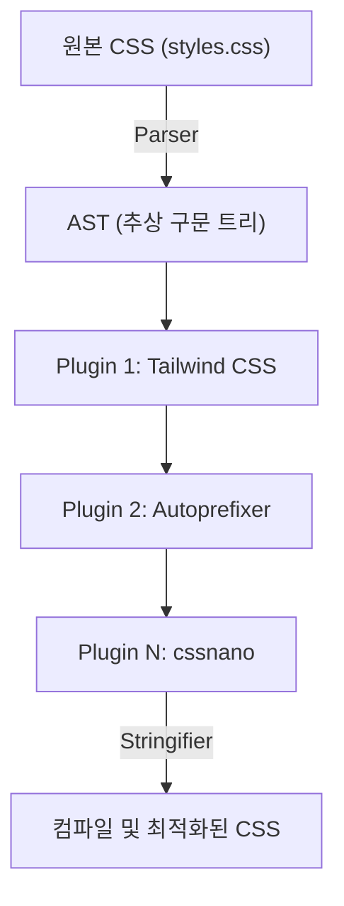
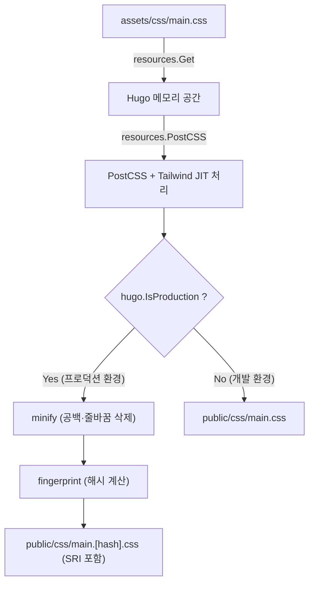

# 들어가며: 정적 사이트 생성기 Hugo와 Tailwind CSS의 강력한 시너지

현대 웹 프론트엔드 개발에서 성능과 개발자 경험(DX: Developer Experience)의 양립은 모든 프로젝트에서 가장 중요한 과제 중 하나입니다. 정적 사이트 생성기(SSG) 중에서도 세계 최고 수준의 빌드 속도를 자랑하는 **Hugo**와, 유틸리티 퍼스트라는 혁신적인 패러다임을 도입한 **Tailwind CSS**를 결합하는 것은 이 과제에 대한 하나의 궁극적인 해답이라고 할 수 있습니다.

Hugo는 Go 언어로 작성되어 있어, 수천 페이지의 사이트라도 단 몇 초 혹은 밀리초 단위로 빌드를 완료하는 경이로운 성능을 가지고 있습니다. 한편, Tailwind CSS는 사전에 정의된 무수히 많은 유틸리티 클래스(`flex`, `text-center`, `mt-4` 등)를 HTML에 직접 작성함으로써, CSS 파일과 HTML 파일 사이를 오가는 컨텍스트 스위칭을 없애고 디자인 이터레이션을 가속화합니다.

본 기사에서는 Hugo 테마에 Tailwind CSS를 도입하고, 나아가 PostCSS를 이용한 고도화된 에셋 파이프라인(Hugo Pipes)을 구축하는 절차를 아키텍처의 근간부터 수학적인 성능 최적화 관점에 이르기까지 철저하고 상세하게 해설합니다.

---

## 1. 유틸리티 퍼스트 CSS와 컴포넌트 지향의 변천

Tailwind CSS의 도입 절차에 들어가기 전에, 왜 우리가 Tailwind CSS를 사용해야 하는지, 그 배경에 있는 CSS 설계 사상의 역사와 진화에 대해 깊이 이해해 두는 것은 매우 유익합니다.

### 기존 CSS 설계(BEM이나 OOCSS)의 한계
과거의 웹 개발에서는 시맨틱한 클래스명을 부여하는 것이 베스트 프랙티스로 여겨졌습니다. 예를 들어, 카드 컴포넌트를 작성할 경우 다음과 같이 HTML과 CSS를 분리했습니다.

```html
<div class="card">
  
  <div class="card__content">
    <h2 class="card__title">제목</h2>
    <p class="card__description">설명문이 이곳에 들어갑니다.</p>
  </div>
</div>
```

```css
.card {
  border-radius: 8px;
  box-shadow: 0 4px 6px rgba(0,0,0,0.1);
  background-color: #ffffff;
  overflow: hidden;
}
.card__title {
  font-size: 1.5rem;
  font-weight: bold;
  color: #333333;
}
/* 이후 상세한 스타일이 계속됨 */
```

이러한 BEM(Block Element Modifier) 기반 설계는 프로젝트 규모가 작을 때는 기능하지만, 다음과 같은 문제를 일으키기 쉽습니다.

1. **이름 짓기의 고갈과 피로**: 비슷한 컴포넌트를 만들 때마다 새로운 클래스명을 고민해야 합니다(예: `card-news`, `card-featured` 등).
2. **CSS의 비대화**: 새로운 기능을 추가할 때마다 CSS의 줄 수가 계속 늘어나고, 한 번 작성된 CSS는 "어디서 사용되는지 모른다"는 두려움 때문에 삭제되는 일이 적어 데드 코드가 축적됩니다.
3. **컨텍스트 스위칭**: HTML의 구조와 CSS의 스타일을 별도의 파일로 관리하기 때문에 에디터 상에서 탭을 오가는 횟수가 기하급수적으로 증가합니다.

### Tailwind CSS에 의한 패러다임 시프트
Tailwind CSS는 이러한 문제들을 '유틸리티 클래스의 조합'이라는 접근법으로 해결합니다. 위의 카드 컴포넌트는 Tailwind CSS를 사용하면 다음과 같이 됩니다.

```html
<div class="rounded-lg shadow-md bg-white overflow-hidden">
  
  <div class="p-6">
    <h2 class="text-2xl font-bold text-gray-800">제목</h2>
    <p class="mt-2 text-gray-600">설명문이 이곳에 들어갑니다.</p>
  </div>
</div>
```

클래스명 자체가 스타일의 구체적인 값(`p-6`는 `padding: 1.5rem;` 등)을 나타내고 있기 때문에, HTML을 보는 것만으로도 최종적인 렌더링 결과를 예측할 수 있습니다. 게다가 Tailwind의 JIT(Just-In-Time) 컴파일러에 의해 실제로 사용된 클래스만이 프로덕션용 CSS 파일로 추출되기 때문에 CSS의 파일 크기는 극한까지 작아집니다.

---

## 2. Hugo Pipes와 PostCSS의 아키텍처

Hugo에 Tailwind CSS를 통합하기 위해서는 **Hugo Pipes**라고 불리는 에셋 처리 파이프라인을 이해할 필요가 있습니다. Hugo Pipes는 Sass/SCSS 컴파일, JavaScript 번들링 및 Minify, 그리고 이번에 사용하는 **PostCSS** 실행 등 에셋과 관련된 모든 처리를 Hugo 내부에서 완결시키는 강력한 기능입니다.

PostCSS는 JavaScript 플러그인을 사용하여 CSS를 변환하기 위한 도구입니다. Tailwind CSS 자체도 실은 PostCSS의 플러그인으로서 동작하고 있습니다.

### PostCSS에 의한 AST(추상 구문 트리) 변환 메커니즘

PostCSS가 어떻게 CSS를 처리하고 있는지를 이해하는 것은 트러블슈팅을 할 때 크게 도움이 됩니다. 다음의 Mermaid 다이어그램은 PostCSS가 CSS 파일을 읽어 들이고, 플러그인을 통해 변환하여 최종적인 CSS를 출력하기까지의 파이프라인을 보여줍니다.



1. **Parser (파서)**: 입력된 원본 CSS 문자열을 분석하여, 프로그램으로 조작 가능한 데이터 구조인 AST(추상 구문 트리)로 변환합니다.
2. **Plugins (플러그인들)**:
   - **Tailwind CSS**: 템플릿 파일(HTML이나 Markdown)을 스캔하여, 사용되고 있는 유틸리티 클래스를 AST 상에 노드로 추가합니다. 또한 `@tailwind` 지시어를 전개합니다.
   - **Autoprefixer**: `Can I Use` 데이터베이스를 참조하여, 필요에 따라 벤더 프리픽스(`-webkit-`, `-moz-` 등)를 AST의 속성에 추가합니다.
3. **Stringifier (스트링기파이어)**: 변환이 완료된 AST를 다시 브라우저가 해석 가능한 CSS 문자열로 변환하여 출력합니다.

---

## 3. 환경 구축과 전제 조건

그러면 실제 도입 절차로 들어가 보겠습니다. 먼저 필요한 소프트웨어가 설치되어 있는지 확인합니다.

### 필수 요건

1. **Hugo Extended Version**:
   일반적인 Hugo가 아닌, Sass/SCSS 처리 기능이나 네이티브 PostCSS 연동 기능이 포함된 **Extended 버전**이 필수입니다. 터미널에서 다음 명령어를 실행하여 버전 정보에 `extended`라는 문자열이 포함되어 있는지 확인해 주세요.

   ```bash
   hugo version
   # 예상되는 출력 예시:
   # hugo v0.121.2-4146... windows/amd64 BuildDate=... VendorInfo=gohugoio +extended
   ```

2. **Node.js와 npm**:
   Tailwind CSS나 PostCSS 등의 의존성 패키지는 Node.js 상에서 동작합니다. Node.js(LTS 버전 권장)가 설치되어 있는지 확인합니다.

   ```bash
   node -v
   npm -v
   ```

### npm 패키지 설치

프로젝트 루트 디렉토리(Hugo 설정 파일 `hugo.toml`이 있는 위치)에서 npm을 초기화하고, 필요한 패키지를 설치합니다.

```bash
# package.json 생성
npm init -y

# 개발 의존성 패키지로 Tailwind CSS, PostCSS, Autoprefixer 설치
npm install -D tailwindcss postcss postcss-cli autoprefixer
```

> [!IMPORTANT]
> `postcss-cli`가 설치되어 있지 않으면, Hugo 내부에서 PostCSS를 호출할 때 에러가 발생할 수 있습니다. Hugo Pipes는 내부적으로 `postcss-cli`를 사용하므로 반드시 설치해 두어야 합니다.

---

## 4. 설정 파일 구축 (PostCSS & Tailwind CSS)

패키지 설치가 완료되면, 프로젝트의 동작을 제어할 2개의 중요한 설정 파일을 작성합니다. 프로젝트 루트 디렉토리에 배치해 주세요.

### tailwind.config.js 작성

터미널에서 다음 명령어를 실행하면 기본 설정 파일이 생성됩니다.

```bash
npx tailwindcss init
```

생성된 `tailwind.config.js`를 에디터로 열고, `content` 속성을 설정합니다. 이 부분은 매우 중요합니다. Tailwind는 여기서 지정된 경로의 파일을 분석하여 사용되고 있는 클래스를 추출합니다. Hugo의 프로젝트 구조에 맞춰 레이아웃 파일이나 콘텐츠 파일을 정확하게 지정합니다.

```javascript
/** @type {import('tailwindcss').Config} */
module.exports = {
  // Hugo의 디렉토리 구조에 맞춰 스캔 대상을 지정
  content: [
    "./content/**/*.md",
    "./content/**/*.html",
    "./layouts/**/*.html",
    "./assets/**/*.js",
    // 테마를 사용하는 경우에는 테마의 디렉토리도 포함해야 합니다
    // "./themes/my-theme/layouts/**/*.html",
  ],
  theme: {
    extend: {
      // 커스텀 색상이나 폰트 확장을 이곳에서 진행합니다
      colors: {
        'brand-primary': '#3490dc',
        'brand-secondary': '#ffed4a',
      },
      fontFamily: {
        'sans': ['Helvetica Neue', 'Arial', 'Hiragino Kaku Gothic ProN', 'Meiryo', 'sans-serif'],
      }
    },
  },
  plugins: [
    // 필요에 따라 공식 플러그인 추가 (예: Typography 플러그인)
    // require('@tailwindcss/typography'),
  ],
}
```

### postcss.config.js 작성

다음으로, PostCSS가 어떤 플러그인을 어떤 순서로 실행할지를 정의하는 `postcss.config.js`를 프로젝트 루트에 작성합니다.

```javascript
module.exports = {
  plugins: {
    tailwindcss: {},
    autoprefixer: {},
  }
}
```

이 설정을 통해 Hugo가 PostCSS를 호출할 때, 먼저 Tailwind CSS 처리가 수행되고 그 다음에 Autoprefixer에 의한 벤더 프리픽스 부여가 진행됩니다.

---

## 5. Hugo에서의 CSS 에셋 파이프라인 구축

설정이 완료되면 드디어 Hugo 테마 측에 Tailwind CSS를 통합합니다.

### 5-1. 엔트리 포인트가 되는 CSS 파일 작성

`assets/css/` 디렉토리(존재하지 않는다면 만들어주세요)에 엔트리 포인트가 될 CSS 파일을 작성합니다. 여기서는 `main.css`로 하겠습니다.

**파일 경로: `assets/css/main.css`**

```css
/* Tailwind의 기본 스타일(리셋 CSS 등) 불러오기 */
@tailwind base;

/* 컴포넌트 클래스 불러오기 */
@tailwind components;

/* 유틸리티 클래스 불러오기 */
@tailwind utilities;

/* 독자적인 커스텀 CSS가 필요한 경우 여기에 추가할 수 있지만,
   가능한 한 tailwind.config.js의 extend로 대응하는 것을 권장합니다 */
@layer components {
  .btn-primary {
    @apply bg-blue-500 hover:bg-blue-700 text-white font-bold py-2 px-4 rounded transition-colors duration-300;
  }
}
```

### 5-2. 레이아웃 파일(head.html) 편집

다음으로, Hugo의 템플릿에서 위에서 만든 CSS 파일을 불러와 PostCSS로 처리하는 파이프라인을 작성합니다. 일반적으로 `<head>` 태그 내부를 정의하고 있는 부분 템플릿(예: `layouts/partials/head.html`)을 편집합니다.

**파일 경로: `layouts/partials/head.html`**

```go-html-template
<head>
  <meta charset="utf-8">
  <meta name="viewport" content="width=device-width, initial-scale=1">
  <title>{{ .Title }} | {{ .Site.Title }}</title>

  <!-- assets/css/main.css 가져오기 -->
  {{ $css := resources.Get "css/main.css" }}

  <!-- PostCSS의 옵션 정의 -->
  {{ $options := dict "inlineImports" true }}
  {{ $css = $css | resources.PostCSS $options }}

  <!-- 프로덕션 환경(Production)을 위한 에셋 최적화 파이프라인 -->
  {{ if hugo.IsProduction }}
    <!-- 1. Minify (압축) -->
    {{ $css = $css | minify }}
    <!-- 2. Fingerprint (캐시 버스팅을 위한 해시 부여) -->
    {{ $css = $css | fingerprint "sha512" }}
    <!-- 3. SRI(Subresource Integrity)를 포함하여 태그 출력 -->
    <link rel="stylesheet" href="{{ $css.RelPermalink }}" integrity="{{ $css.Data.Integrity }}" crossorigin="anonymous">
  {{ else }}
    <!-- 개발 환경(Development)에서는 압축하지 않고 그대로 출력 (빌드 속도 우선) -->
    <link rel="stylesheet" href="{{ $css.RelPermalink }}">
  {{ end }}
</head>
```

#### 파이프라인 해설 및 Mermaid 다이어그램

위의 Go 템플릿 코드가 어떻게 CSS 파일을 처리해 나가는지, 일련의 파이프라인 처리를 다이어그램으로 설명합니다.



1. **`resources.Get`**: `assets` 디렉토리 내의 지정된 파일을 찾아 메모리 상의 리소스 객체로 로드합니다.
2. **`resources.PostCSS`**: 프로젝트 루트의 `postcss.config.js`를 참조하여, CSS 소스 코드에 Tailwind CSS와 Autoprefixer 처리를 적용합니다. 개발 환경(`hugo server`)에서는 JIT 모드가 작동하여, 파일 변경 시 필요한 클래스만을 빠르게 생성합니다.
3. **`minify`**: 프로덕션 환경 빌드 시(`hugo --environment production` 등)에 불필요한 공백이나 주석을 삭제하여 파일 크기를 최소화합니다.
4. **`fingerprint`**: 파일의 내용에 기반하여 SHA 해시를 계산하고 파일명에 부여합니다(예: `main.ab12cd...css`). 이를 통해 브라우저의 강력한 캐시를 활용하면서 CSS 업데이트 시에는 확실하게 새로운 파일을 불러오게 하는 '캐시 버스팅'을 실현합니다.
5. **`integrity`**: Fingerprint로 계산된 해시값을 사용하여 CDN 등에서의 위변조를 방지하는 SRI 속성을 출력합니다.

---

## 6. CSS 최적화에서의 수학적 성능 분석

Tailwind CSS를 도입하는 가장 큰 장점 중 하나는 전송되는 CSS 파일 크기의 극소화입니다. 이것이 웹 성능(특히 First Contentful Paint: FCP)에 어떤 영향을 미치는지 수학적인 모델을 사용하여 정량적으로 분석해 보겠습니다.

### CSS 파일 크기 감소 모델

기존 CSS 프레임워크(Bootstrap 등)에서는 사용하지 않는 스타일까지 포함하여 전체가 로드되기 때문에 파일 크기 $S_{original}$이 커지기 쉽습니다(약 150KB〜200KB).
Tailwind CSS의 JIT 컴파일러에 의한 불필요한 클래스 제거(Purge) 적용 후의 크기를 $S_{purged}$라고 하면, 감소율 $R_{purge}$를 사용하여 다음과 같이 나타낼 수 있습니다.

$$
S_{purged} = S_{original} \times (1 - R_{purge})
$$

일반적인 프로젝트에서 $R_{purge}$는 $0.9$(90% 감소) 가까이에 도달하며, $S_{purged}$는 불과 10KB〜20KB 정도 내에 머뭅니다.

게다가 전송 시에는 서버 측에서 Brotli나 Gzip에 의한 압축이 이루어집니다. 압축률을 $R_{compress}$(통상적으로 약 0.7〜0.8)라고 하면 네트워크를 흐르는 최종 페이로드 크기 $S_{final}$은 다음 공식으로 계산됩니다.

$$
S_{final} = S_{purged} \times (1 - R_{compress})
$$

### 중요 렌더링 경로(Critical Rendering Path)와 네트워크 지연

브라우저가 화면에 첫 콘텐츠를 그릴 때까지의 시간(FCP)은 HTML 다운로드 시간, CSS 다운로드 시간, 그리고 렌더링 시간의 합계로 근사할 수 있습니다.

$$
T_{FCP} \approx RTT + \frac{S_{HTML}}{BW} + RTT + \frac{S_{final}}{BW} + T_{render}
$$

여기서,
- $RTT$: Round Trip Time (서버와의 왕복 통신 지연 시간)
- $BW$: 네트워크 대역폭 (Bandwidth)

모바일 환경 등 $BW$가 좁고 $RTT$가 큰(지연이 긴) 환경에서, $S_{final}$을 수 킬로바이트 단위까지 깎아낼 수 있는 Tailwind CSS의 접근 방식은 $\frac{S_{final}}{BW}$ 항을 극한까지 0에 가깝게 만들어, 경이로운 점수(Google PageSpeed Insights 등)를 내는 원동력이 됩니다.

---

## 7. 개발 서버 실행과 핫 리로드 확인

모든 설정이 완료되었다면 Hugo 개발 서버를 실행하고, Tailwind CSS가 올바르게 작동하는지 확인합니다.

```bash
hugo server -D
```

브라우저에서 `http://localhost:1313/`에 접속하여 사이트가 표시되는지 확인합니다.
Markdown 콘텐츠 파일이나 Hugo 템플릿(`layouts/` 이하 파일)을 열어 클래스를 추가해 보세요.

```html
<!-- 테스트용 Tailwind 클래스 적용 예시 -->
<div class="bg-gradient-to-r from-blue-500 to-purple-600 text-white p-8 rounded-xl shadow-2xl text-center transform transition duration-500 hover:scale-105">
  <h1 class="text-4xl font-extrabold tracking-tight">Tailwind CSS + Hugo is Awesome!</h1>
  <p class="mt-4 text-lg font-medium">핫 리로드가 즉각적으로 반영되는 것을 확인해 보세요.</p>
</div>
```

파일을 저장하는 순간, Hugo의 강력한 파일 감시자와 Tailwind의 JIT 컴파일러가 연동하여 밀리초 단위로 CSS가 재구축되고, 브라우저가 자동으로 새로고침되는(핫 리로드) 쾌감을 맛볼 수 있을 것입니다.

### 트러블슈팅: 스타일이 반영되지 않을 경우

만약 변경 사항이 반영되지 않는다면 다음 사항들을 체크해 보세요.

1. **`tailwind.config.js`의 `content` 경로 설정**
   스캔 대상 파일 경로가 잘못되어 있으면 Tailwind는 해당 파일 내에서 사용 중인 클래스를 감지하지 못하여 CSS에 출력하지 않습니다. 특히 테마를 사용하는 경우 테마 디렉토리의 경로가 누락되지 않았는지 확인하세요.
2. **PostCSS 에러**
   터미널의 Hugo 서버 로그에 `Error: failed to transform resource: PostCSS not found` 같은 에러가 출력된다면, `npm install`이 제대로 실행되지 않았거나 `postcss-cli`가 부족할 가능성이 있습니다.
3. **Hugo 캐시 삭제**
   드물게 Hugo의 캐시 문제로 오래된 CSS가 남는 경우가 있습니다. 서버를 끄고 `hugo server --ignoreCache`로 다시 실행하거나, OS의 임시 디렉토리(`/tmp/hugo_cache/` 등)를 삭제해 보세요.

---

## 8. 프로덕션 환경용 빌드와 더욱 고도화된 설정

사이트를 프로덕션 서버(Netlify, Vercel, GitHub Pages, Cloudflare Pages 등)에 배포할 때는, 환경 변수를 설정하여 프로덕션용 최적화 파이프라인을 실행해야 합니다.

```bash
# 프로덕션 빌드 명령어 예시
NODE_ENV=production hugo --minify --environment production
```

`--environment production` 플래그를 붙임으로써 `head.html` 안의 `{{ if hugo.IsProduction }}` 블록이 실행되며, CSS의 Minify화와 Fingerprint 부여가 수행됩니다.

### Typography 플러그인을 활용한 Markdown 스타일링

Hugo 같은 블로그나 문서 사이트에서는 Markdown에서 생성된 순수 HTML 요소(`<h1>`, `<p>`, `<ul>` 등)에 직접 클래스를 추가할 수 없습니다. 이러한 경우에 매우 유용한 것이 Tailwind 공식 **Typography 플러그인**입니다.

1. 플러그인 설치
   ```bash
   npm install -D @tailwindcss/typography
   ```

2. `tailwind.config.js`에 추가
   ```javascript
   module.exports = {
     // ...
     plugins: [
       require('@tailwindcss/typography'),
     ],
   }
   ```

3. 템플릿에 적용
   글 본문을 출력하는 컨테이너 요소에 `prose` 클래스(및 취향에 맞게 색상이나 크기의 변형)를 부여하는 것만으로 아름다운 기본 스타일이 적용됩니다.

   ```go-html-template
   <article class="prose prose-lg prose-blue mx-auto mt-10">
     {{ .Content }}
   </article>
   ```

이것으로 손수 복잡한 CSS 선택자(`.article-content h2 { ... }`)를 작성할 필요가 전혀 없어지며, 컴포넌트의 모듈성이 완벽하게 유지됩니다.

---

## 9. 요약: 유지 보수성이 뛰어난 프론트엔드 생태계 완성

수고하셨습니다. 이것으로 Hugo의 초고속 정적 사이트 생성 엔진과 Tailwind CSS의 모던한 스타일링 기능, 그리고 PostCSS의 확장성을 갖춘 완벽한 웹 개발 에셋 파이프라인이 완성되었습니다.

이 아키텍처의 뛰어난 점은 **"설정은 처음 한 번으로 끝난다"**는 것입니다. 한 번 파이프라인을 구축해 두면, 개발자는 CSS 파일을 열 필요 없이 직관적인 유틸리티 클래스를 HTML이나 Markdown 템플릿에 작성하는 것만으로 복잡한 UI를 놀라운 속도로 조립해 나갈 수 있습니다.

또한 출력되는 CSS 크기가 항상 최소화되기 때문에 Core Web Vitals 점수 향상으로도 직결되며 SEO 관점에서도 매우 유리하게 작용합니다.

Hugo와 Tailwind CSS의 조합은 개인 기술 블로그부터 대규모 기업 사이트까지 모든 프로젝트에서 '최고의 선택지' 중 하나로 계속 남을 것입니다. 부디 이 강력한 툴체인을 활용하여 쾌적한 웹 개발 라이프를 즐기시길 바랍니다!
