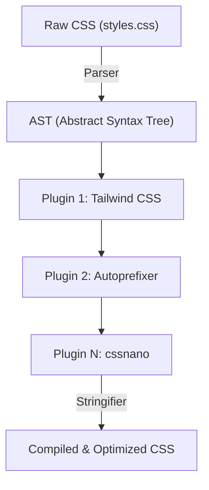
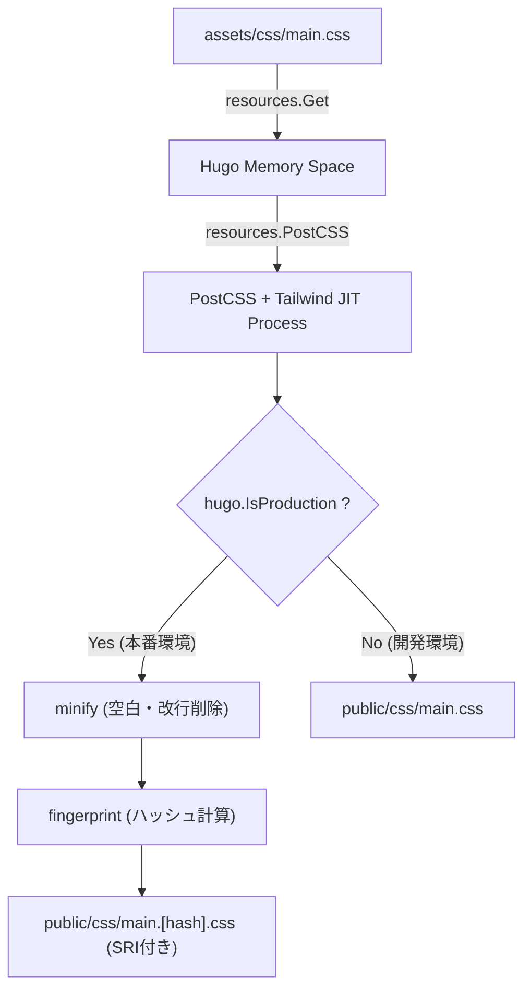

# はじめに：静的サイトジェネレーターHugoとTailwind CSSの強力なシナジー

現代のWebフロントエンド開発において、パフォーマンスと開発体験（DX：Developer Experience）の両立は、あらゆるプロジェクトにおいて最重要課題の一つです。静的サイトジェネレーター（SSG）の中で世界最速クラスのビルドスピードを誇る**Hugo**と、ユーティリティファーストという革新的なパラダイムを持ち込んだ**Tailwind CSS**を組み合わせることは、この課題に対する一つの究極の解答と言えます。

HugoはGo言語で記述されており、数千ページのサイトであってもわずか数秒、あるいはミリ秒単位でビルドを完了させる驚異的なパフォーマンスを持っています。一方、Tailwind CSSは事前に定義された無数のユーティリティクラス（`flex`, `text-center`, `mt-4`など）をHTMLに直接記述していくことで、CSSファイルとHTMLファイルの間を往復するコンテキストスイッチを無くし、デザインのイテレーションを高速化します。

本記事では、HugoのテーマにTailwind CSSを導入し、さらにPostCSSを用いた高度なアセットパイプライン（Hugo Pipes）を構築する手順を、アーキテクチャの根幹から数学的なパフォーマンス最適化の観点に至るまで、徹底的にかつ詳細に解説します。

---

## 1. ユーティリティファーストCSSとコンポーネント指向の変遷

Tailwind CSSの導入手順に入る前に、なぜ私たちがTailwind CSSを使うべきなのか、その背景にあるCSS設計思想の歴史と進化について深く理解しておくことは非常に有益です。

### 従来のCSS設計（BEMやOOCSS）の限界
かつてのWeb開発では、セマンティックなクラス名を付けることがベストプラクティスとされていました。例えば、カードコンポーネントを作成する場合、以下のようにHTMLとCSSを分離していました。

```html
<div class="card">
  
  <div class="card__content">
    <h2 class="card__title">タイトル</h2>
    <p class="card__description">説明文がここに入ります。</p>
  </div>
</div>
```

```css
.card {
  border-radius: 8px;
  box-shadow: 0 4px 6px rgba(0,0,0,0.1);
  background-color: #ffffff;
  overflow: hidden;
}
.card__title {
  font-size: 1.5rem;
  font-weight: bold;
  color: #333333;
}
/* 以降、詳細なスタイルが続く */
```

このようなBEM（Block Element Modifier）ベースの設計は、プロジェクトの規模が小さいうちは機能しますが、以下のような問題を引き起こしがちです。

1. **名前付けの枯渇と疲労**: 似たようなコンポーネントを作るたびに、新しいクラス名を考えなければなりません（例：`card-news`, `card-featured`など）。
2. **CSSの肥大化**: 新しい機能を追加するたびにCSSの行数が増え続け、一度書かれたCSSは「どこで使われているか分からない」という恐怖から削除されることが少なくなり、デッドコードが蓄積していきます。
3. **コンテキストスイッチ**: HTMLの構造とCSSのスタイルを別々のファイルで管理するため、エディタ上でタブを行き来する回数が指数関数的に増加します。

### Tailwind CSSによるパラダイムシフト
Tailwind CSSは、これらの問題を「ユーティリティクラスの組み合わせ」というアプローチで解決します。上記のカードコンポーネントは、Tailwind CSSを使用すると以下のようになります。

```html
<div class="rounded-lg shadow-md bg-white overflow-hidden">
  
  <div class="p-6">
    <h2 class="text-2xl font-bold text-gray-800">タイトル</h2>
    <p class="mt-2 text-gray-600">説明文がここに入ります。</p>
  </div>
</div>
```

クラス名自体がスタイルの具体的な値（`p-6`は`padding: 1.5rem;`など）を表しているため、HTMLを見るだけで最終的なレンダリング結果を予測できます。さらに、TailwindのJIT（Just-In-Time）コンパイラによって、実際に使用されたクラスのみが本番用のCSSファイルに抽出されるため、CSSのファイルサイズは極限まで小さくなります。

---

## 2. Hugo PipesとPostCSSのアーキテクチャ

HugoにTailwind CSSを統合するためには、**Hugo Pipes**と呼ばれるアセット処理パイプラインを理解する必要があります。Hugo Pipesは、Sass/SCSSのコンパイル、JavaScriptのバンドルとMinify、そして今回使用する**PostCSS**の実行など、アセットに関するあらゆる処理をHugo内部で完結させる強力な機能です。

PostCSSは、JavaScriptプラグインを使用してCSSを変換するためのツールです。Tailwind CSS自体も、実はPostCSSのプラグインとして動作しています。

### PostCSSによるAST（抽象構文木）変換メカニズム

PostCSSがどのようにCSSを処理しているのかを理解することは、トラブルシューティングの際に大いに役立ちます。以下のMermaid図は、PostCSSがCSSファイルを読み込み、プラグインを通じて変換し、最終的なCSSを出力するまでのパイプラインを示しています。



1. **Parser（パーサー）**: 入力された生のCSS文字列を解析し、プログラムで操作可能なデータ構造であるAST（抽象構文木）に変換します。
2. **Plugins（プラグイン群）**:
   - **Tailwind CSS**: テンプレートファイル（HTMLやMarkdown）をスキャンし、使用されているユーティリティクラスをAST上にノードとして追加します。また、`@tailwind`ディレクティブを展開します。
   - **Autoprefixer**: `Can I Use`のデータベースを参照し、必要に応じてベンダープレフィックス（`-webkit-`, `-moz-`など）をASTのプロパティに追加します。
3. **Stringifier（ストリンギファイア）**: 変換が完了したASTを、再びブラウザが解釈可能なCSS文字列に変換して出力します。

---

## 3. 環境構築と前提条件

それでは、実際の導入手順に入っていきましょう。まずは必要なソフトウェアがインストールされているか確認します。

### 必須要件

1. **Hugo Extended Version**:
   通常のHugoではなく、Sass/SCSS処理機能やネイティブでのPostCSS連携機能が含まれた**Extended版**が必須です。ターミナルで以下のコマンドを実行し、バージョン情報に`extended`という文字列が含まれていることを確認してください。

   ```bash
   hugo version
   # 期待される出力例:
   # hugo v0.121.2-4146... windows/amd64 BuildDate=... VendorInfo=gohugoio +extended
   ```

2. **Node.jsとnpm**:
   Tailwind CSSやPostCSSなどの依存パッケージはNode.js上で動作します。Node.js（LTS版推奨）がインストールされていることを確認します。

   ```bash
   node -v
   npm -v
   ```

### npmパッケージのインストール

プロジェクトのルートディレクトリ（Hugoの設定ファイル`hugo.toml`がある階層）でnpmを初期化し、必要なパッケージをインストールします。

```bash
# package.jsonの生成
npm init -y

# 開発依存パッケージとしてTailwind CSS, PostCSS, Autoprefixerをインストール
npm install -D tailwindcss postcss postcss-cli autoprefixer
```

> [!IMPORTANT]
> `postcss-cli`がインストールされていないと、Hugo内部からPostCSSを呼び出す際にエラーが発生する場合があります。Hugo Pipesは内部的に`postcss-cli`を使用するため、必ずインストールしておきましょう。

---

## 4. 設定ファイルの構築（PostCSS & Tailwind CSS）

パッケージのインストールが完了したら、プロジェクトの挙動を制御する2つの重要な設定ファイルを作成します。プロジェクトのルートディレクトリに配置してください。

### tailwind.config.js の作成

ターミナルで以下のコマンドを実行すると、デフォルトの設定ファイルが生成されます。

```bash
npx tailwindcss init
```

生成された `tailwind.config.js` をエディタで開き、`content` プロパティを設定します。ここは非常に重要です。Tailwindはここで指定されたパスのファイルを解析し、使用されているクラスを抽出します。Hugoのプロジェクト構造に合わせて、レイアウトファイルやコンテンツファイルを正確に指定します。

```javascript
/** @type {import('tailwindcss').Config} */
module.exports = {
  // Hugoのディレクトリ構造に合わせてスキャン対象を指定
  content: [
    "./content/**/*.md",
    "./content/**/*.html",
    "./layouts/**/*.html",
    "./assets/**/*.js",
    // もしテーマを使用している場合は、テーマのディレクトリも含める必要があります
    // "./themes/my-theme/layouts/**/*.html",
  ],
  theme: {
    extend: {
      // カスタムカラーやフォントの拡張をここで行います
      colors: {
        'brand-primary': '#3490dc',
        'brand-secondary': '#ffed4a',
      },
      fontFamily: {
        'sans': ['Helvetica Neue', 'Arial', 'Hiragino Kaku Gothic ProN', 'Meiryo', 'sans-serif'],
      }
    },
  },
  plugins: [
    // 必要に応じて公式プラグインを追加（例：Typographyプラグイン）
    // require('@tailwindcss/typography'),
  ],
}
```

### postcss.config.js の作成

次に、PostCSSがどのプラグインをどの順番で実行するかを定義する `postcss.config.js` をプロジェクトルートに作成します。

```javascript
module.exports = {
  plugins: {
    tailwindcss: {},
    autoprefixer: {},
  }
}
```

この設定により、HugoがPostCSSを呼び出した際、まずTailwind CSSの処理が行われ、その後にAutoprefixerによるベンダープレフィックスの付与が行われるようになります。

---

## 5. HugoでのCSSアセットパイプラインの構築

設定が完了したら、いよいよHugoのテーマ側にTailwind CSSを組み込みます。

### 5-1. エントリーポイントとなるCSSファイルの作成

`assets/css/` ディレクトリ（存在しない場合は作成してください）に、エントリーポイントとなるCSSファイルを作成します。ここでは `main.css` とします。

**ファイルパス: `assets/css/main.css`**

```css
/* Tailwindのベーススタイル（リセットCSS等）の読み込み */
@tailwind base;

/* コンポーネントクラスの読み込み */
@tailwind components;

/* ユーティリティクラスの読み込み */
@tailwind utilities;

/* 独自のカスタムCSSが必要な場合はここに追記可能ですが、
   可能な限りtailwind.config.jsのextendで対応することを推奨します */
@layer components {
  .btn-primary {
    @apply bg-blue-500 hover:bg-blue-700 text-white font-bold py-2 px-4 rounded transition-colors duration-300;
  }
}
```

### 5-2. レイアウトファイル（head.html）の編集

次に、Hugoのテンプレートから上記のCSSファイルを読み込み、PostCSSで処理するパイプラインを記述します。一般的には `<head>` タグ内を定義しているパーシャルテンプレート（例：`layouts/partials/head.html`）を編集します。

**ファイルパス: `layouts/partials/head.html`**

```go-html-template
<head>
  <meta charset="utf-8">
  <meta name="viewport" content="width=device-width, initial-scale=1">
  <title>{{ .Title }} | {{ .Site.Title }}</title>

  <!-- assets/css/main.css を取得 -->
  {{ $css := resources.Get "css/main.css" }}

  <!-- PostCSSのオプション定義 -->
  {{ $options := dict "inlineImports" true }}
  {{ $css = $css | resources.PostCSS $options }}

  <!-- 本番環境（Production）向けのアセット最適化パイプライン -->
  {{ if hugo.IsProduction }}
    <!-- 1. Minify（圧縮） -->
    {{ $css = $css | minify }}
    <!-- 2. Fingerprint（キャッシュバスティングのためのハッシュ付与） -->
    {{ $css = $css | fingerprint "sha512" }}
    <!-- 3. SRI（Subresource Integrity）を含めてタグを出力 -->
    <link rel="stylesheet" href="{{ $css.RelPermalink }}" integrity="{{ $css.Data.Integrity }}" crossorigin="anonymous">
  {{ else }}
    <!-- 開発環境（Development）では圧縮せず、そのまま出力（ビルド速度優先） -->
    <link rel="stylesheet" href="{{ $css.RelPermalink }}">
  {{ end }}
</head>
```

#### パイプラインの解説とMermaid図解

上記のGoテンプレートコードがどのようにCSSファイルを処理していくのか、一連のパイプライン処理を図解します。



1. **`resources.Get`**: `assets`ディレクトリ内の指定されたファイルを探し、メモリ上のリソースオブジェクトとしてロードします。
2. **`resources.PostCSS`**: プロジェクトルートの`postcss.config.js`を参照し、CSSソースコードに対してTailwind CSSとAutoprefixerの処理を適用します。開発環境（`hugo server`）ではJITモードが働き、ファイル変更時に必要なクラスだけを高速に生成します。
3. **`minify`**: 本番環境のビルド時（`hugo --environment production`など）に、不要な空白やコメントを削除し、ファイルサイズを最小化します。
4. **`fingerprint`**: ファイルのコンテンツに基づいてSHAハッシュを計算し、ファイル名に付与します（例：`main.ab12cd...css`）。これにより、ブラウザの強力なキャッシュを利用しつつ、CSS更新時には確実に新しいファイルを読み込ませる「キャッシュバスティング」が実現します。
5. **`integrity`**: Fingerprintによって計算されたハッシュ値を用いて、CDN等からの改ざんを防ぐSRI属性を出力します。

---

## 6. CSS最適化における数学的パフォーマンス分析

Tailwind CSSを導入する最大のメリットの一つは、配信されるCSSファイルサイズの極小化です。これがウェブパフォーマンス（特にFirst Contentful Paint: FCP）にどのような影響を与えるのか、数学的なモデルを用いて定量的に分析してみましょう。

### CSSファイルサイズの削減モデル

従来のCSSフレームワーク（Bootstrapなど）では、使用していないスタイルも含めて全量がロードされるため、ファイルサイズ $S_{original}$ は大きくなりがちです（約150KB〜200KB）。
Tailwind CSSのJITコンパイラによる不要クラスのパージ（Purge）適用後のサイズを $S_{purged}$ とすると、削減率 $R_{purge}$ を用いて次のように表せます。

$$
S_{purged} = S_{original} \times (1 - R_{purge})
$$

典型的なプロジェクトでは、$R_{purge}$ は $0.9$ (90%削減) 近くに達し、$S_{purged}$ はわずか10KB〜20KB程度に収まります。

さらに、配信時にはサーバー側でBrotliやGzipによる圧縮が行われます。圧縮率を $R_{compress}$（通常0.7〜0.8程度）とすると、ネットワークを流れる最終的なペイロードサイズ $S_{final}$ は以下の式で計算されます。

$$
S_{final} = S_{purged} \times (1 - R_{compress})
$$

### クリティカルレンダリングパスとネットワーク遅延

ブラウザが画面に最初のコンテンツを描画するまでの時間（FCP）は、HTMLのダウンロード時間、CSSのダウンロード時間、そしてレンダリング時間の合計で近似できます。

$$
T_{FCP} \approx RTT + \frac{S_{HTML}}{BW} + RTT + \frac{S_{final}}{BW} + T_{render}
$$

ここで、
- $RTT$ : Round Trip Time（サーバーとの往復通信遅延時間）
- $BW$ : ネットワーク帯域幅（Bandwidth）

モバイル回線など $BW$ が狭く、$RTT$ が大きい（遅延が大きい）環境において、$S_{final}$ を数キロバイト単位まで削ぎ落とすことができるTailwind CSSのアプローチは、$\frac{S_{final}}{BW}$ の項を極限までゼロに近づけ、驚異的なスコア（Google PageSpeed Insights等）を叩き出す原動力となります。

---

## 7. 開発サーバーの起動とホットリロードの確認

全ての設定が完了したら、Hugoの開発サーバーを起動し、Tailwind CSSが正しく動作しているか確認します。

```bash
hugo server -D
```

ブラウザで `http://localhost:1313/` にアクセスし、サイトが表示されることを確認します。
Markdownのコンテンツファイルや、Hugoのテンプレート（`layouts/` 以下のファイル）を開き、クラスを追加してみてください。

```html
<!-- テスト用のTailwindクラス適用例 -->
<div class="bg-gradient-to-r from-blue-500 to-purple-600 text-white p-8 rounded-xl shadow-2xl text-center transform transition duration-500 hover:scale-105">
  <h1 class="text-4xl font-extrabold tracking-tight">Tailwind CSS + Hugo is Awesome!</h1>
  <p class="mt-4 text-lg font-medium">ホットリロードが瞬時に反映されることを確認してください。</p>
</div>
```

ファイルを保存した瞬間、Hugoの強力なファイルウォッチャーとTailwindのJITコンパイラが連携し、ミリ秒単位でCSSが再構築され、ブラウザが自動的にリロードされる（ホットリロード）快感を味わうことができるはずです。

### トラブルシューティング：スタイルが反映されない場合

もし変更が反映されない場合は、以下のポイントをチェックしてください。

1. **`tailwind.config.js` の `content` パス設定**
   スキャン対象のファイルパスが間違っていると、Tailwindはそのファイル内で使われているクラスを検知できず、CSSに出力しません。特にテーマを使用している場合、テーマディレクトリのパスが漏れていないか確認してください。
2. **PostCSSエラー**
   ターミナルのHugoサーバーのログに `Error: failed to transform resource: PostCSS not found` といったエラーが出ている場合、`npm install` が正しく実行されていないか、`postcss-cli` が不足している可能性があります。
3. **Hugoのキャッシュクリア**
   まれにHugoのキャッシュが原因で古いCSSが残ることがあります。サーバーを停止し、`hugo server --ignoreCache` で起動するか、OSの一時ディレクトリ（`/tmp/hugo_cache/` など）を削除してみてください。

---

## 8. 本番環境向けビルドとさらなる高度化

サイトを本番サーバー（Netlify, Vercel, GitHub Pages, Cloudflare Pagesなど）にデプロイする際は、環境変数を設定して本番用の最適化パイプラインを走らせる必要があります。

```bash
# 本番ビルドコマンドの例
NODE_ENV=production hugo --minify --environment production
```

`--environment production` フラグを付けることで、`head.html` 内の `{{ if hugo.IsProduction }}` ブロックが実行され、CSSのMinify化とFingerprint付与が行われます。

### Typographyプラグインを用いたMarkdownのスタイリング

Hugoのようなブログやドキュメントサイトでは、Markdownから生成された純粋なHTML要素（`<h1>`, `<p>`, `<ul>`など）に直接クラスを付けることができません。このような場合に非常に役立つのが、Tailwind公式の **Typography プラグイン** です。

1. プラグインのインストール
   ```bash
   npm install -D @tailwindcss/typography
   ```

2. `tailwind.config.js` に追加
   ```javascript
   module.exports = {
     // ...
     plugins: [
       require('@tailwindcss/typography'),
     ],
   }
   ```

3. テンプレートでの適用
   記事の本文を出力するコンテナ要素に `prose` クラス（およびお好みで色やサイズのバリアント）を付与するだけで、美しいデフォルトスタイルが適用されます。

   ```go-html-template
   <article class="prose prose-lg prose-blue mx-auto mt-10">
     {{ .Content }}
   </article>
   ```

これにより、手書きで複雑なCSSセレクタ（`.article-content h2 { ... }`）を書く必要は一切なくなり、コンポーネントのモジュール性が完全に保たれます。

---

## 9. まとめ：保守性の高いフロントエンドエコシステムの完成

お疲れ様でした。これで、Hugoの超高速な静的サイト生成エンジンと、Tailwind CSSのモダンなスタイリング機能、そしてPostCSSの拡張性を備えた、完璧なWeb開発アセットパイプラインが完成しました。

このアーキテクチャの優れた点は、**「設定は最初の一回だけで済む」** ということです。一度パイプラインを構築してしまえば、開発者はCSSファイルを開くことなく、直感的なユーティリティクラスをHTMLやMarkdownテンプレートに記述するだけで、複雑なUIを驚異的なスピードで組み上げていくことができます。

また、出力されるCSSサイズが常に最小化されるため、Core Web Vitalsのスコア向上にも直結し、SEOの観点からも非常に有利に働きます。

HugoとTailwind CSSの組み合わせは、個人の技術ブログから大規模な企業サイトまで、あらゆるプロジェクトにおいて「最良の選択肢」の一つであり続けるでしょう。ぜひ、この強力なツールチェーンを活用して、快適なWeb開発ライフを楽しんでください！
