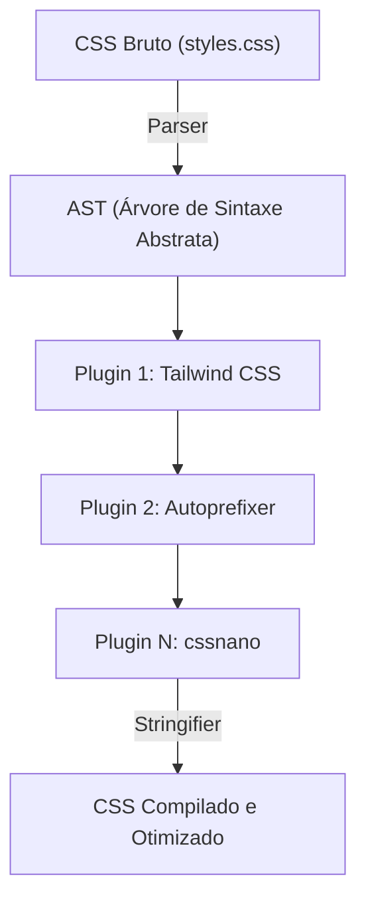
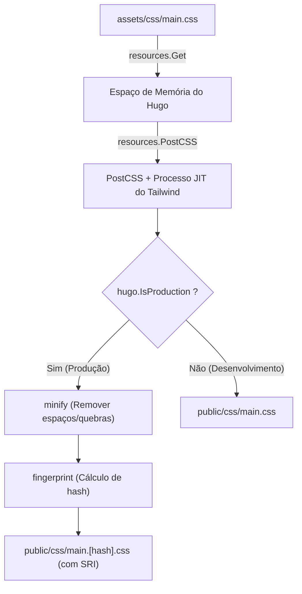

# Introdução: A Poderosa Sinergia entre o Gerador de Sites Estáticos Hugo e o Tailwind CSS

No desenvolvimento moderno de front-end web, equilibrar desempenho e experiência de desenvolvimento (DX: Developer Experience) é uma das prioridades mais importantes em qualquer projeto. A combinação do **Hugo**, que possui a velocidade de construção mais rápida do mundo entre os geradores de sites estáticos (SSG), com o **Tailwind CSS**, que trouxe o paradigma inovador de utility-first (utilitário em primeiro lugar), pode ser considerada uma das soluções definitivas para este desafio.

O Hugo é escrito em Go e possui um desempenho impressionante, capaz de concluir a construção de milhares de páginas em apenas short segundos ou até milissegundos. Por outro lado, o Tailwind CSS elimina a troca de contexto entre arquivos CSS e HTML, escrevendo diretamente no HTML inúmeras classes utilitárias predefinidas (como `flex`, `text-center`, `mt-4`), o que acelera a iteração do design.

Neste artigo, explicaremos de forma completa e detalhada o processo de introdução do Tailwind CSS em um tema do Hugo, bem como a construção de um pipeline de assets avançado (Hugo Pipes) usando PostCSS, desde a base da arquitetura até a perspectiva da otimização matemática de desempenho.

---

## 1. A Evolução do CSS Utility-First e Orientado a Componentes

Antes de entrar no passo a passo para a introdução do Tailwind CSS, é muito útil entender profundamente a história e a evolução da filosofia de design de CSS, para compreendermos por que devemos usar o Tailwind CSS.

### As Limitações do Design CSS Tradicional (BEM e OOCSS)
Antigamente, a melhor prática no desenvolvimento web era dar nomes semânticos às classes. Por exemplo, ao criar um componente de cartão, separávamos o HTML do CSS da seguinte forma:

```html
<div class="card">
  
  <div class="card__content">
    <h2 class="card__title">Título</h2>
    <p class="card__description">A descrição vai aqui.</p>
  </div>
</div>
```

```css
.card {
  border-radius: 8px;
  box-shadow: 0 4px 6px rgba(0,0,0,0.1);
  background-color: #ffffff;
  overflow: hidden;
}
.card__title {
  font-size: 1.5rem;
  font-weight: bold;
  color: #333333;
}
/* A partir daqui, estilos mais detalhados continuam */
```

Esse tipo de design baseado em BEM (Block Element Modifier) funciona bem quando a escala do projeto é pequena, mas geralmente causa os seguintes problemas:

1. **Exaustão e falta de nomes**: Toda vez que você cria um componente semelhante, precisa pensar em novos nomes de classes (ex: `card-news`, `card-featured`, etc.).
2. **Inchaço do CSS**: Toda vez que um novo recurso é adicionado, as linhas de CSS aumentam. Devido ao medo de não saber "onde o CSS está sendo usado", o código raramente é excluído, acumulando código morto (dead code).
3. **Troca de contexto**: Como a estrutura HTML e o estilo CSS são gerenciados em arquivos separados, o número de vezes que você alterna entre as abas no editor aumenta exponencialmente.

### A Mudança de Paradigma pelo Tailwind CSS
O Tailwind CSS resolve esses problemas com a abordagem de "combinação de classes utilitárias". O componente de cartão acima ficaria assim usando o Tailwind CSS:

```html
<div class="rounded-lg shadow-md bg-white overflow-hidden">
  
  <div class="p-6">
    <h2 class="text-2xl font-bold text-gray-800">Título</h2>
    <p class="mt-2 text-gray-600">A descrição vai aqui.</p>
  </div>
</div>
```

Como o próprio nome da classe representa o valor específico do estilo (por exemplo, `p-6` significa `padding: 1.5rem;`), é possível prever o resultado final da renderização apenas olhando o HTML. Além disso, devido ao compilador JIT (Just-In-Time) do Tailwind, apenas as classes realmente utilizadas são extraídas para o arquivo CSS de produção, minimizando o tamanho do arquivo CSS ao extremo.

---

## 2. A Arquitetura do Hugo Pipes e PostCSS

Para integrar o Tailwind CSS ao Hugo, é necessário entender o pipeline de processamento de assets chamado **Hugo Pipes**. O Hugo Pipes é um recurso poderoso que conclui todo o processamento de assets dentro do Hugo, como a compilação de Sass/SCSS, o empacotamento (bundle) e minificação (minify) de JavaScript e a execução do **PostCSS**, que usaremos nesta ocasião.

O PostCSS é uma ferramenta para transformar CSS usando plugins JavaScript. Na verdade, o próprio Tailwind CSS funciona como um plugin do PostCSS.

### Mecanismo de Transformação de AST (Abstract Syntax Tree) pelo PostCSS

Entender como o PostCSS processa o CSS é de grande ajuda ao solucionar problemas. O diagrama Mermaid abaixo ilustra o pipeline desde a leitura do arquivo CSS pelo PostCSS, sua transformação através de plugins, até a saída final do CSS.



1. **Parser (Analisador)**: Analisa a string CSS bruta fornecida e a converte em uma AST (Árvore de Sintaxe Abstrata), que é uma estrutura de dados manipulável programaticamente.
2. **Plugins (Conjunto de Plugins)**:
   - **Tailwind CSS**: Verifica os arquivos de modelo (HTML ou Markdown) e adiciona as classes utilitárias usadas como nós na AST. Também expande as diretivas `@tailwind`.
   - **Autoprefixer**: Consulta o banco de dados do `Can I Use` e, se necessário, adiciona prefixos de fornecedores (`-webkit-`, `-moz-`, etc.) às propriedades da AST.
3. **Stringifier (Conversor para String)**: Converte a AST, cuja transformação foi concluída, de volta em uma string CSS que o navegador pode interpretar.

---

## 3. Configuração do Ambiente e Pré-requisitos

Agora, vamos aos passos reais de introdução. Primeiro, verifique se os softwares necessários estão instalados.

### Requisitos Essenciais

1. **Hugo Extended Version**:
   É obrigatório o uso da **versão Extended**, que, ao contrário do Hugo padrão, inclui a capacidade de processar Sass/SCSS e a integração nativa com o PostCSS. Execute o comando abaixo no terminal e confirme se a string `extended` está contida nas informações da versão.

   ```bash
   hugo version
   # Exemplo de saída esperada:
   # hugo v0.121.2-4146... windows/amd64 BuildDate=... VendorInfo=gohugoio +extended
   ```

2. **Node.js e npm**:
   Dependências como Tailwind CSS e PostCSS rodam no Node.js. Certifique-se de que o Node.js (versão LTS recomendada) esteja instalado.

   ```bash
   node -v
   npm -v
   ```

### Instalação de Pacotes npm

Inicialize o npm no diretório raiz do projeto (o mesmo nível do arquivo de configuração do Hugo, `hugo.toml`) e instale os pacotes necessários.

```bash
# Geração do package.json
npm init -y

# Instalação do Tailwind CSS, PostCSS e Autoprefixer como dependências de desenvolvimento
npm install -D tailwindcss postcss postcss-cli autoprefixer
```

> [!IMPORTANT]
> Se o `postcss-cli` não estiver instalado, pode ocorrer um erro quando o Hugo tentar invocar o PostCSS internamente. Como o Hugo Pipes utiliza o `postcss-cli` internamente, não se esqueça de instalá-lo.

---

## 4. Construção dos Arquivos de Configuração (PostCSS e Tailwind CSS)

Após a instalação dos pacotes, criaremos dois arquivos de configuração importantes que controlam o comportamento do projeto. Coloque-os no diretório raiz do projeto.

### Criação do tailwind.config.js

Ao executar o comando abaixo no terminal, o arquivo de configuração padrão será gerado.

```bash
npx tailwindcss init
```

Abra o arquivo gerado `tailwind.config.js` no editor e configure a propriedade `content`. Isso é extremamente importante. O Tailwind vai analisar os arquivos dos caminhos especificados aqui e extrair as classes usadas. Certifique-se de especificar corretamente os arquivos de layout e conteúdo para corresponder à estrutura do projeto do Hugo.

```javascript
/** @type {import('tailwindcss').Config} */
module.exports = {
  // Especifica os alvos de verificação de acordo com a estrutura de diretórios do Hugo
  content: [
    "./content/**/*.md",
    "./content/**/*.html",
    "./layouts/**/*.html",
    "./assets/**/*.js",
    // Se você estiver usando um tema, também precisa incluir o diretório do tema
    // "./themes/my-theme/layouts/**/*.html",
  ],
  theme: {
    extend: {
      // Extensões de cores personalizadas e fontes são feitas aqui
      colors: {
        'brand-primary': '#3490dc',
        'brand-secondary': '#ffed4a',
      },
      fontFamily: {
        'sans': ['Helvetica Neue', 'Arial', 'Hiragino Kaku Gothic ProN', 'Meiryo', 'sans-serif'],
      }
    },
  },
  plugins: [
    // Adicione plugins oficiais se necessário (ex: plugin Typography)
    // require('@tailwindcss/typography'),
  ],
}
```

### Criação do postcss.config.js

Em seguida, crie o arquivo `postcss.config.js` na raiz do projeto, que define quais plugins o PostCSS deve executar e em qual ordem.

```javascript
module.exports = {
  plugins: {
    tailwindcss: {},
    autoprefixer: {},
  }
}
```

Com esta configuração, quando o Hugo chamar o PostCSS, primeiro será processado o Tailwind CSS, e depois o Autoprefixer aplicará os prefixos de fornecedores.

---

## 5. Construção do Pipeline de Assets CSS no Hugo

Com a configuração concluída, finalmente integraremos o Tailwind CSS no lado do tema do Hugo.

### 5-1. Criação do Arquivo CSS de Ponto de Entrada

No diretório `assets/css/` (crie-o se não existir), crie o arquivo CSS que servirá como ponto de entrada. Aqui vamos chamá-lo de `main.css`.

**Caminho do arquivo: `assets/css/main.css`**

```css
/* Carregamento do estilo base do Tailwind (como CSS reset) */
@tailwind base;

/* Carregamento das classes de componentes */
@tailwind components;

/* Carregamento das classes utilitárias */
@tailwind utilities;

/* Se precisar de CSS personalizado, você pode adicionar aqui,
   mas é recomendável usar o 'extend' no tailwind.config.js sempre que possível */
@layer components {
  .btn-primary {
    @apply bg-blue-500 hover:bg-blue-700 text-white font-bold py-2 px-4 rounded transition-colors duration-300;
  }
}
```

### 5-2. Edição do Arquivo de Layout (head.html)

A seguir, a partir dos templates do Hugo, leremos o arquivo CSS acima e descreveremos o pipeline para processá-lo com o PostCSS. Normalmente, você edita o partial template que define o interior da tag `<head>` (ex: `layouts/partials/head.html`).

**Caminho do arquivo: `layouts/partials/head.html`**

```go-html-template
<head>
  <meta charset="utf-8">
  <meta name="viewport" content="width=device-width, initial-scale=1">
  <title>{{ .Title }} | {{ .Site.Title }}</title>

  <!-- Obtém o assets/css/main.css -->
  {{ $css := resources.Get "css/main.css" }}

  <!-- Definição de opções do PostCSS -->
  {{ $options := dict "inlineImports" true }}
  {{ $css = $css | resources.PostCSS $options }}

  <!-- Pipeline de otimização de assets para ambiente de produção (Production) -->
  {{ if hugo.IsProduction }}
    <!-- 1. Minify (Compressão) -->
    {{ $css = $css | minify }}
    <!-- 2. Fingerprint (Adição de hash para cache busting) -->
    {{ $css = $css | fingerprint "sha512" }}
    <!-- 3. Geração da tag incluindo SRI (Subresource Integrity) -->
    <link rel="stylesheet" href="{{ $css.RelPermalink }}" integrity="{{ $css.Data.Integrity }}" crossorigin="anonymous">
  {{ else }}
    <!-- No ambiente de desenvolvimento (Development), o arquivo não é comprimido (prioridade na velocidade de build) -->
    <link rel="stylesheet" href="{{ $css.RelPermalink }}">
  {{ end }}
</head>
```

#### Explicação do Pipeline e Diagrama Mermaid

Para entender como o código do template Go processa o arquivo CSS, ilustramos abaixo o processo do pipeline.



1. **`resources.Get`**: Procura o arquivo especificado no diretório `assets` e o carrega como um objeto de recurso na memória.
2. **`resources.PostCSS`**: Referencia o `postcss.config.js` na raiz do projeto e aplica o processamento do Tailwind CSS e Autoprefixer no código fonte CSS. No ambiente de desenvolvimento (`hugo server`), o modo JIT é ativado, gerando rapidamente apenas as classes necessárias ao modificar arquivos.
3. **`minify`**: Durante a compilação para produção (ex: `hugo --environment production`), remove espaços em branco e comentários desnecessários, minimizando o tamanho do arquivo.
4. **`fingerprint`**: Calcula o hash SHA com base no conteúdo do arquivo e o adiciona ao nome do arquivo (ex: `main.ab12cd...css`). Isso permite o uso robusto do cache do navegador, além de implementar o "cache busting", garantindo que os usuários baixem o novo arquivo CSS após uma atualização.
5. **`integrity`**: Usando o valor hash calculado pelo Fingerprint, gera um atributo SRI para prevenir adulterações vindas de CDNs, etc.

---

## 6. Análise de Desempenho Matemático na Otimização do CSS

Um dos maiores benefícios de introduzir o Tailwind CSS é a minimização extrema do tamanho do arquivo CSS distribuído. Vamos analisar quantitativamente como isso afeta a performance web (especialmente o First Contentful Paint: FCP) através de um modelo matemático.

### Modelo de Redução do Tamanho do Arquivo CSS

Com frameworks CSS convencionais (como Bootstrap), o tamanho do arquivo $S_{original}$ tende a ser grande, pois ele carrega todos os estilos, mesmo os não utilizados (cerca de 150KB a 200KB).
Se definirmos $S_{purged}$ como o tamanho após o expurgo (Purge) de classes desnecessárias pelo compilador JIT do Tailwind CSS, podemos usar a taxa de redução $R_{purge}$ para expressá-lo da seguinte forma:

$$
S_{purged} = S_{original} \times (1 - R_{purge})
$$

Em projetos típicos, o $R_{purge}$ atinge quase $0.9$ (redução de 90%), e o $S_{purged}$ cai para algo em torno de 10KB a 20KB.

Além disso, ao distribuir os arquivos, o servidor aplica a compressão (Brotli ou Gzip). Definindo a taxa de compressão como $R_{compress}$ (geralmente entre 0.7 e 0.8), o tamanho final da carga útil (payload) enviada pela rede, $S_{final}$, é calculado da seguinte forma:

$$
S_{final} = S_{purged} \times (1 - R_{compress})
$$

### Caminho Crítico de Renderização e Atraso de Rede

O tempo para o navegador pintar o primeiro conteúdo na tela (FCP) pode ser aproximado pela soma do tempo de download do HTML, o tempo de download do CSS e o tempo de renderização.

$$
T_{FCP} \approx RTT + \frac{S_{HTML}}{BW} + RTT + \frac{S_{final}}{BW} + T_{render}
$$

Onde:
- $RTT$ : Round Trip Time (tempo de latência de ida e volta ao servidor)
- $BW$ : Largura de banda da rede (Bandwidth)

Em ambientes com um $BW$ estreito e um grande $RTT$ (como redes móveis com alta latência), a abordagem do Tailwind CSS, que consegue reduzir $S_{final}$ a meros kilobytes, aproxima o valor do termo $\frac{S_{final}}{BW}$ ao extremo de zero, sendo a força motriz por trás de pontuações excepcionais (no Google PageSpeed Insights e afins).

---

## 7. Iniciar o Servidor de Desenvolvimento e Verificar o Hot Reload

Quando toda a configuração estiver pronta, inicie o servidor de desenvolvimento do Hugo e certifique-se de que o Tailwind CSS está funcionando corretamente.

```bash
hugo server -D
```

Acesse `http://localhost:1313/` no seu navegador e confirme que o site é exibido.
Tente abrir arquivos de conteúdo em Markdown ou templates do Hugo (arquivos em `layouts/`) e adicionar algumas classes.

```html
<!-- Exemplo de aplicação de classes Tailwind para testes -->
<div class="bg-gradient-to-r from-blue-500 to-purple-600 text-white p-8 rounded-xl shadow-2xl text-center transform transition duration-500 hover:scale-105">
  <h1 class="text-4xl font-extrabold tracking-tight">Tailwind CSS + Hugo is Awesome!</h1>
  <p class="mt-4 text-lg font-medium">Confira o hot reload sendo refletido instantaneamente.</p>
</div>
```

No exato momento em que você salvar o arquivo, poderá desfrutar do "hot reload", em que o poderoso observador de arquivos do Hugo e o compilador JIT do Tailwind se unem, reconstruindo o CSS em milissegundos e recarregando automaticamente o navegador.

### Solução de Problemas: Quando os Estilos Não São Refletidos

Se as alterações não forem aplicadas, verifique os seguintes pontos:

1. **A configuração de caminho em `content` no `tailwind.config.js`**
   Se o caminho do arquivo para a varredura estiver incorreto, o Tailwind não conseguirá detectar as classes usadas nesse arquivo e não as colocará no CSS. Especialmente se estiver usando um tema, certifique-se de que o caminho do diretório do tema não foi esquecido.
2. **Erro do PostCSS**
   Se houver um erro nos logs do servidor do Hugo no terminal dizendo `Error: failed to transform resource: PostCSS not found`, pode significar que o `npm install` não foi executado corretamente, ou o pacote `postcss-cli` está ausente.
3. **Limpeza do Cache do Hugo**
   Raramente, o cache do Hugo pode causar problemas mantendo CSS antigo. Pare o servidor e reinicie com `hugo server --ignoreCache`, ou tente excluir o diretório temporário do SO (como `/tmp/hugo_cache/`).

---

## 8. Build para Produção e Aprimoramentos Avançados

Ao fazer o deploy do site para um servidor de produção (Netlify, Vercel, GitHub Pages, Cloudflare Pages, etc.), é preciso configurar as variáveis de ambiente para executar o pipeline de otimização focado na produção.

```bash
# Exemplo de comando de compilação de produção
NODE_ENV=production hugo --minify --environment production
```

Ao adicionar a flag `--environment production`, o bloco `{{ if hugo.IsProduction }}` no arquivo `head.html` será executado, e o processo de minificação e fingerprinting será aplicado.

### Estilização do Markdown com o Plugin Typography

Em sites de blogs e de documentações como o Hugo, você não pode adicionar classes diretamente aos elementos HTML puros gerados a partir do Markdown (como `<h1>`, `<p>`, `<ul>`, etc.). Para esses casos, o **Plugin Typography** oficial do Tailwind se mostra incrivelmente útil.

1. Instalação do plugin
   ```bash
   npm install -D @tailwindcss/typography
   ```

2. Adição no `tailwind.config.js`
   ```javascript
   module.exports = {
     // ...
     plugins: [
       require('@tailwindcss/typography'),
     ],
   }
   ```

3. Aplicação no template
   Apenas adicionando a classe `prose` (e preferencialmente variantes de tamanho e cor) ao contêiner onde o texto do artigo será impresso, um estilo padrão bonito será aplicado.

   ```go-html-template
   <article class="prose prose-lg prose-blue mx-auto mt-10">
     {{ .Content }}
   </article>
   ```

Assim, não há mais a necessidade de escrever à mão seletores CSS complexos (`.article-content h2 { ... }`), e a modularidade do componente é mantida perfeitamente.

---

## 9. Conclusão: Construção de um Ecossistema de Front-End Altamente Sustentável

Parabéns! Com isso, o pipeline de assets de desenvolvimento web perfeito — que combina o motor de geração de site estático ultrarrápido do Hugo, os recursos modernos de estilo do Tailwind CSS e a extensibilidade do PostCSS — foi concluído.

A grande vantagem desta arquitetura é que **"a configuração só precisa ser feita uma vez"**. Uma vez construído o pipeline, os desenvolvedores não precisarão abrir nenhum arquivo CSS, bastando escrever as classes utilitárias de forma intuitiva nos templates HTML ou Markdown para construir interfaces de usuário complexas em uma velocidade fantástica.

Além disso, como o tamanho do arquivo CSS gerado é sempre minimizado, isso também afeta de forma direta e favorável as métricas de Core Web Vitals, trazendo enormes vantagens do ponto de vista de SEO.

A combinação de Hugo e Tailwind CSS continuará sendo uma das "melhores escolhas" em todos os projetos, desde blogs técnicos pessoais até grandes sites corporativos. Aproveite ao máximo esta poderosa cadeia de ferramentas e tenha uma ótima experiência no desenvolvimento web!
