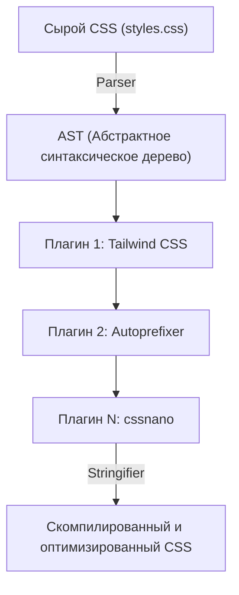
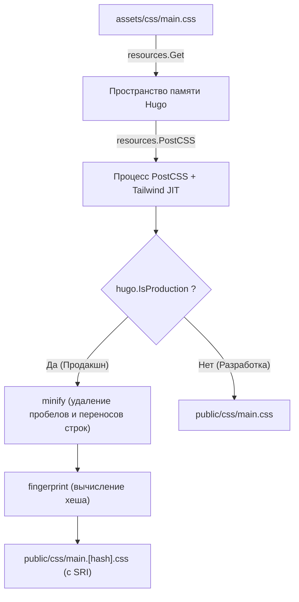

# Введение: Мощная синергия генератора статических сайтов Hugo и Tailwind CSS

В современной веб-разработке фронтенда баланс между производительностью и удобством разработки (DX: Developer Experience) является одной из важнейших задач в любом проекте. Комбинация **Hugo**, который может похвастаться самой высокой скоростью сборки в мире среди генераторов статических сайтов (SSG), и **Tailwind CSS**, принесшего инновационную парадигму utility-first, является одним из идеальных решений этой проблемы.

Hugo написан на языке Go и обладает потрясающей производительностью, позволяющей завершить сборку даже для сайтов с тысячами страниц всего за несколько секунд или миллисекунд. С другой стороны, Tailwind CSS ускоряет процесс дизайна за счет прямого использования в HTML огромного количества предопределенных утилитарных классов (таких как `flex`, `text-center`, `mt-4`), что устраняет необходимость постоянно переключаться между CSS и HTML файлами.

В этой статье мы подробно и досконально рассмотрим процесс интеграции Tailwind CSS в тему Hugo, а также создание продвинутого конвейера ресурсов (Hugo Pipes) с использованием PostCSS — от основ архитектуры до математической оптимизации производительности.

---

## 1. Эволюция utility-first CSS и компонентно-ориентированного подхода

Прежде чем перейти к шагам по интеграции Tailwind CSS, очень полезно глубоко понять историю и эволюцию философии дизайна CSS, стоящей за тем, почему мы должны использовать Tailwind CSS.

### Ограничения традиционного дизайна CSS (BEM и OOCSS)
В прошлом в веб-разработке лучшей практикой считалось использование семантических имен классов. Например, при создании компонента карточки HTML и CSS разделялись следующим образом:

```html
<div class="card">
  
  <div class="card__content">
    <h2 class="card__title">Заголовок</h2>
    <p class="card__description">Здесь будет описание.</p>
  </div>
</div>
```

```css
.card {
  border-radius: 8px;
  box-shadow: 0 4px 6px rgba(0,0,0,0.1);
  background-color: #ffffff;
  overflow: hidden;
}
.card__title {
  font-size: 1.5rem;
  font-weight: bold;
  color: #333333;
}
/* Далее идут детальные стили */
```

Хотя такой подход на основе BEM (Block Element Modifier) работает на ранних стадиях небольших проектов, он часто приводит к следующим проблемам:

1. **Истощение и усталость от именования**: Каждый раз при создании похожего компонента приходится придумывать новые имена классов (например: `card-news`, `card-featured`).
2. **Раздувание CSS**: С каждой новой функцией количество строк CSS продолжает расти. Однажды написанный CSS редко удаляется из страха, что «непонятно, где он используется», что приводит к накоплению мертвого кода.
3. **Переключение контекста**: Поскольку структура HTML и стили CSS управляются в разных файлах, количество переключений между вкладками в редакторе растет в геометрической прогрессии.

### Сдвиг парадигмы с Tailwind CSS
Tailwind CSS решает эти проблемы с помощью подхода «комбинирования утилитарных классов». Приведенный выше компонент карточки с использованием Tailwind CSS будет выглядеть так:

```html
<div class="rounded-lg shadow-md bg-white overflow-hidden">
  
  <div class="p-6">
    <h2 class="text-2xl font-bold text-gray-800">Заголовок</h2>
    <p class="mt-2 text-gray-600">Здесь будет описание.</p>
  </div>
</div>
```

Поскольку сами имена классов представляют конкретные значения стилей (например, `p-6` означает `padding: 1.5rem;`), вы можете предсказать конечный результат рендеринга, просто посмотрев на HTML. Кроме того, благодаря компилятору JIT (Just-In-Time) Tailwind в продакшн CSS файл извлекаются только те классы, которые фактически используются, что сводит размер файла CSS к минимуму.

---

## 2. Архитектура Hugo Pipes и PostCSS

Чтобы интегрировать Tailwind CSS в Hugo, необходимо понять конвейер обработки ресурсов, называемый **Hugo Pipes**. Hugo Pipes — это мощная функция, которая позволяет Hugo выполнять всю обработку ресурсов внутри себя, включая компиляцию Sass/SCSS, сборку и минификацию JavaScript, а также выполнение **PostCSS**, который мы будем использовать.

PostCSS — это инструмент для преобразования CSS с помощью плагинов JavaScript. Сам Tailwind CSS фактически работает как плагин для PostCSS.

### Механизм преобразования AST (Абстрактного синтаксического дерева) с помощью PostCSS

Понимание того, как PostCSS обрабатывает CSS, очень полезно при устранении неполадок. Следующая диаграмма Mermaid показывает конвейер, в котором PostCSS читает CSS-файл, преобразует его через плагины и выводит финальный CSS.



1. **Parser (Парсер)**: Анализирует входящую необработанную строку CSS и преобразует ее в AST (абстрактное синтаксическое дерево), структуру данных, которой можно управлять программно.
2. **Plugins (Плагины)**:
   - **Tailwind CSS**: Сканирует файлы шаблонов (HTML или Markdown) и добавляет используемые утилитарные классы в качестве узлов в AST. Он также разворачивает директивы `@tailwind`.
   - **Autoprefixer**: Обращается к базе данных `Can I Use` и при необходимости добавляет вендорные префиксы (например, `-webkit-`, `-moz-`) к свойствам AST.
3. **Stringifier (Генератор строк)**: Преобразует готовое AST обратно в строку CSS, понятную браузеру, и выводит ее.

---

## 3. Настройка среды и предварительные условия

Давайте перейдем к фактическим шагам по установке. Сначала убедитесь, что у вас установлено необходимое программное обеспечение.

### Обязательные требования

1. **Hugo Extended Version**:
   Обязательно нужна **Extended версия**, которая включает в себя возможности обработки Sass/SCSS и встроенную интеграцию PostCSS, а не обычный Hugo. Выполните следующую команду в терминале и убедитесь, что строка `extended` присутствует в информации о версии.

   ```bash
   hugo version
   # Ожидаемый вывод:
   # hugo v0.121.2-4146... windows/amd64 BuildDate=... VendorInfo=gohugoio +extended
   ```

2. **Node.js и npm**:
   Зависимости, такие как Tailwind CSS и PostCSS, работают на Node.js. Убедитесь, что установлен Node.js (рекомендуется версия LTS).

   ```bash
   node -v
   npm -v
   ```

### Установка пакетов npm

Инициализируйте npm в корневом каталоге проекта (там, где находится файл конфигурации Hugo `hugo.toml`) и установите необходимые пакеты.

```bash
# Создание package.json
npm init -y

# Установка Tailwind CSS, PostCSS и Autoprefixer в качестве зависимостей для разработки
npm install -D tailwindcss postcss postcss-cli autoprefixer
```

> [!IMPORTANT]
> Если `postcss-cli` не установлен, могут возникнуть ошибки при вызове PostCSS из Hugo. Обязательно установите его, так как Hugo Pipes внутренне использует `postcss-cli`.

---

## 4. Создание конфигурационных файлов (PostCSS и Tailwind CSS)

После завершения установки пакетов создайте два важных конфигурационных файла, которые будут управлять поведением проекта. Разместите их в корневом каталоге проекта.

### Создание tailwind.config.js

Выполните следующую команду в терминале, чтобы сгенерировать конфигурационный файл по умолчанию.

```bash
npx tailwindcss init
```

Откройте созданный `tailwind.config.js` в редакторе и настройте свойство `content`. Это очень важно. Tailwind анализирует файлы по указанным здесь путям и извлекает используемые классы. Точно укажите файлы макетов и контента в соответствии со структурой вашего проекта Hugo.

```javascript
/** @type {import('tailwindcss').Config} */
module.exports = {
  // Указание файлов для сканирования в соответствии со структурой каталогов Hugo
  content: [
    "./content/**/*.md",
    "./content/**/*.html",
    "./layouts/**/*.html",
    "./assets/**/*.js",
    // Если вы используете тему, необходимо включить и её каталоги
    // "./themes/my-theme/layouts/**/*.html",
  ],
  theme: {
    extend: {
      // Здесь можно расширить пользовательские цвета и шрифты
      colors: {
        'brand-primary': '#3490dc',
        'brand-secondary': '#ffed4a',
      },
      fontFamily: {
        'sans': ['Helvetica Neue', 'Arial', 'Hiragino Kaku Gothic ProN', 'Meiryo', 'sans-serif'],
      }
    },
  },
  plugins: [
    // При необходимости добавьте официальные плагины (например, плагин Typography)
    // require('@tailwindcss/typography'),
  ],
}
```

### Создание postcss.config.js

Далее создайте в корне проекта файл `postcss.config.js`, который определяет, какие плагины и в каком порядке будет выполнять PostCSS.

```javascript
module.exports = {
  plugins: {
    tailwindcss: {},
    autoprefixer: {},
  }
}
```

Благодаря этой настройке, когда Hugo вызывает PostCSS, сначала применяется Tailwind CSS, а затем Autoprefixer добавляет вендорные префиксы.

---

## 5. Создание конвейера ресурсов CSS в Hugo

После завершения настроек пришло время интегрировать Tailwind CSS в тему Hugo.

### 5-1. Создание CSS файла точки входа

Создайте CSS-файл, который послужит точкой входа, в каталоге `assets/css/` (если его нет, создайте его). Назовем его `main.css`.

**Путь к файлу: `assets/css/main.css`**

```css
/* Импорт базовых стилей Tailwind (сброс CSS и т.д.) */
@tailwind base;

/* Импорт классов компонентов */
@tailwind components;

/* Импорт утилитарных классов */
@tailwind utilities;

/* Пользовательский CSS можно добавить здесь, но
   рекомендуется использовать extend в tailwind.config.js по мере возможности */
@layer components {
  .btn-primary {
    @apply bg-blue-500 hover:bg-blue-700 text-white font-bold py-2 px-4 rounded transition-colors duration-300;
  }
}
```

### 5-2. Редактирование файла макета (head.html)

Далее загрузите вышеуказанный CSS-файл из шаблона Hugo и напишите конвейер для его обработки с помощью PostCSS. Обычно редактируется частичный шаблон (например, `layouts/partials/head.html`), который определяет содержимое тега `<head>`.

**Путь к файлу: `layouts/partials/head.html`**

```go-html-template
<head>
  <meta charset="utf-8">
  <meta name="viewport" content="width=device-width, initial-scale=1">
  <title>{{ .Title }} | {{ .Site.Title }}</title>

  <!-- Получение assets/css/main.css -->
  {{ $css := resources.Get "css/main.css" }}

  <!-- Определение опций PostCSS -->
  {{ $options := dict "inlineImports" true }}
  {{ $css = $css | resources.PostCSS $options }}

  <!-- Конвейер оптимизации ресурсов для продакшн-окружения (Production) -->
  {{ if hugo.IsProduction }}
    <!-- 1. Minify (сжатие) -->
    {{ $css = $css | minify }}
    <!-- 2. Fingerprint (добавление хеша для сброса кэша) -->
    {{ $css = $css | fingerprint "sha512" }}
    <!-- 3. Вывод тега с атрибутом SRI (Subresource Integrity) -->
    <link rel="stylesheet" href="{{ $css.RelPermalink }}" integrity="{{ $css.Data.Integrity }}" crossorigin="anonymous">
  {{ else }}
    <!-- В среде разработки (Development) выводится без сжатия (приоритет на скорость сборки) -->
    <link rel="stylesheet" href="{{ $css.RelPermalink }}">
  {{ end }}
</head>
```

#### Объяснение конвейера и диаграмма Mermaid

Ниже представлена диаграмма, иллюстрирующая, как код шаблона Go обрабатывает CSS-файл через серию операций конвейера.



1. **`resources.Get`**: Ищет указанный файл в каталоге `assets` и загружает его как объект ресурса в память.
2. **`resources.PostCSS`**: Применяет обработку Tailwind CSS и Autoprefixer к исходному коду CSS, ссылаясь на `postcss.config.js` в корне проекта. В среде разработки (`hugo server`) работает режим JIT, быстро генерирующий только необходимые классы при изменении файлов.
3. **`minify`**: При сборке для продакшна (например, `hugo --environment production`) удаляет ненужные пробелы и комментарии, сводя к минимуму размер файла.
4. **`fingerprint`**: Вычисляет SHA-хеш на основе содержимого файла и добавляет его к имени файла (например, `main.ab12cd...css`). Это позволяет использовать мощное кэширование браузера и одновременно обеспечивает «сброс кэша» — надежную загрузку нового файла при обновлении CSS.
5. **`integrity`**: Выводит атрибут SRI с использованием хеш-значения, вычисленного Fingerprint, для предотвращения подделки данных при доставке через CDN и т. д.

---

## 6. Математический анализ производительности при оптимизации CSS

Одним из самых больших преимуществ внедрения Tailwind CSS является минимизация размера доставляемого CSS-файла. Давайте с помощью математической модели количественно проанализируем, как это влияет на производительность веб-сайта (особенно на First Contentful Paint: FCP).

### Модель уменьшения размера CSS файла

В традиционных CSS-фреймворках (например, Bootstrap) размер файла $S_{original}$ обычно велик (около 150-200 КБ), поскольку загружаются все стили, включая неиспользуемые.
Если обозначить размер файла после удаления неиспользуемых классов (Purge) компилятором JIT Tailwind CSS как $S_{purged}$, и коэффициент уменьшения как $R_{purge}$, то это можно выразить следующей формулой:

$$
S_{purged} = S_{original} \times (1 - R_{purge})
$$

В типичном проекте $R_{purge}$ достигает почти $0.9$ (уменьшение на 90%), а $S_{purged}$ составляет всего лишь 10-20 КБ.

Кроме того, при доставке файлы сжимаются на стороне сервера с помощью Brotli или Gzip. Если коэффициент сжатия равен $R_{compress}$ (обычно около 0.7-0.8), конечный размер полезной нагрузки $S_{final}$, передаваемой по сети, вычисляется по следующей формуле:

$$
S_{final} = S_{purged} \times (1 - R_{compress})
$$

### Критический путь рендеринга и сетевая задержка

Время до того момента, когда браузер отрисует первый контент на экране (FCP), можно приблизительно оценить как сумму времени загрузки HTML, времени загрузки CSS и времени рендеринга.

$$
T_{FCP} \approx RTT + \frac{S_{HTML}}{BW} + RTT + \frac{S_{final}}{BW} + T_{render}
$$

Где:
- $RTT$ : Round Trip Time (время круговой задержки связи с сервером)
- $BW$ : Пропускная способность сети (Bandwidth)

В средах, таких как мобильные сети, где $BW$ ограничена, а $RTT$ велико (высокая задержка), подход Tailwind CSS, позволяющий сократить $S_{final}$ до нескольких килобайт, сводит член $\frac{S_{final}}{BW}$ практически к нулю. Это является движущей силой для достижения потрясающих оценок (в Google PageSpeed Insights и т. д.).

---

## 7. Запуск сервера разработки и проверка горячей перезагрузки

После завершения всех настроек запустите сервер разработки Hugo и убедитесь, что Tailwind CSS работает корректно.

```bash
hugo server -D
```

Откройте браузер по адресу `http://localhost:1313/` и проверьте, отображается ли сайт.
Откройте файл контента Markdown или шаблон Hugo (файлы в каталоге `layouts/`) и попробуйте добавить класс.

```html
<!-- Пример применения классов Tailwind для тестирования -->
<div class="bg-gradient-to-r from-blue-500 to-purple-600 text-white p-8 rounded-xl shadow-2xl text-center transform transition duration-500 hover:scale-105">
  <h1 class="text-4xl font-extrabold tracking-tight">Tailwind CSS + Hugo — это потрясающе!</h1>
  <p class="mt-4 text-lg font-medium">Убедитесь, что горячая перезагрузка применяется мгновенно.</p>
</div>
```

Как только вы сохраните файл, мощный наблюдатель файлов Hugo и компилятор JIT Tailwind будут работать вместе, чтобы за миллисекунды перестроить CSS. Вы должны ощутить удовольствие от автоматической перезагрузки браузера (горячей перезагрузки).

### Устранение неполадок: если стили не применяются

Если изменения не отображаются, проверьте следующие пункты:

1. **Настройка путей `content` в `tailwind.config.js`**
   Если пути к сканируемым файлам указаны неверно, Tailwind не сможет обнаружить используемые в них классы и не выведет их в CSS. Особенно если вы используете тему, убедитесь, что пути к каталогу темы не пропущены.
2. **Ошибки PostCSS**
   Если в журнале сервера Hugo в терминале появляется ошибка типа `Error: failed to transform resource: PostCSS not found`, возможно, `npm install` не был выполнен корректно или отсутствует `postcss-cli`.
3. **Очистка кэша Hugo**
   В редких случаях кэш Hugo может стать причиной того, что останется старый CSS. Остановите сервер и запустите его с помощью `hugo server --ignoreCache` или попробуйте удалить временный каталог ОС (например, `/tmp/hugo_cache/`).

---

## 8. Сборка для продакшна и дальнейшие улучшения

При развертывании сайта на рабочем сервере (Netlify, Vercel, GitHub Pages, Cloudflare Pages и т. д.) необходимо настроить переменные окружения и запустить конвейер оптимизации для продакшна.

```bash
# Пример команды для продакшн сборки
NODE_ENV=production hugo --minify --environment production
```

Добавление флага `--environment production` приведет к выполнению блока `{{ if hugo.IsProduction }}` в `head.html`, где будет выполнена минификация CSS и добавление Fingerprint.

### Стилизация Markdown с помощью плагина Typography

На сайтах блогов или документации, таких как Hugo, вы не можете напрямую добавлять классы к чистым HTML-элементам (таким как `<h1>`, `<p>`, `<ul>`), сгенерированным из Markdown. В таких случаях очень полезен официальный **плагин Typography** от Tailwind.

1. Установка плагина
   ```bash
   npm install -D @tailwindcss/typography
   ```

2. Добавление в `tailwind.config.js`
   ```javascript
   module.exports = {
     // ...
     plugins: [
       require('@tailwindcss/typography'),
     ],
   }
   ```

3. Применение в шаблонах
   Просто добавьте класс `prose` (и, по желанию, варианты цвета и размера) к элементу-контейнеру, который выводит текст статьи, и к нему будут применены красивые стили по умолчанию.

   ```go-html-template
   <article class="prose prose-lg prose-blue mx-auto mt-10">
     {{ .Content }}
   </article>
   ```

Это избавляет от необходимости писать сложные CSS-селекторы (например, `.article-content h2 { ... }`) вручную, полностью сохраняя модульность компонентов.

---

## 9. Заключение: Создание высокоподдерживаемой экосистемы фронтенда

Отличная работа. Теперь у вас есть идеальный конвейер веб-ресурсов, сочетающий сверхбыстрый движок генерации статических сайтов Hugo, современные возможности стилизации Tailwind CSS и расширяемость PostCSS.

Преимущество этой архитектуры в том, что **«настраивать нужно только один раз»**. Как только конвейер будет создан, разработчики смогут создавать сложные пользовательские интерфейсы с невероятной скоростью, просто прописывая интуитивно понятные утилитарные классы в шаблонах HTML или Markdown, даже не открывая CSS-файл.

Кроме того, поскольку размер выходного CSS всегда минимизирован, это напрямую улучшает оценки Core Web Vitals и очень выгодно с точки зрения SEO.

Комбинация Hugo и Tailwind CSS, несомненно, останется одним из «лучших выборов» для любого проекта, от личного технического блога до крупного корпоративного сайта. Обязательно воспользуйтесь этим мощным набором инструментов и наслаждайтесь комфортной веб-разработкой!
