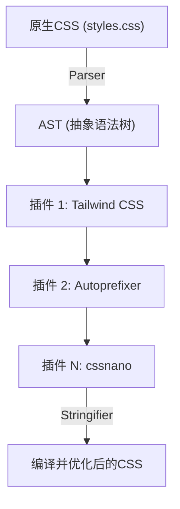
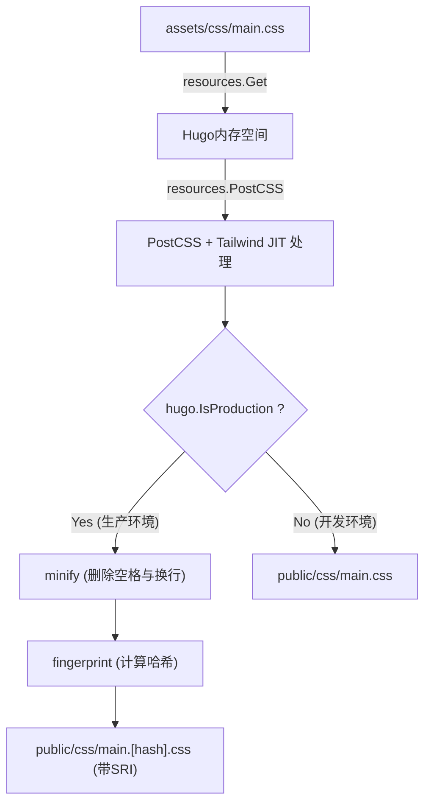

# 前言：静态网站生成器Hugo与Tailwind CSS的强大协同效应

在现代Web前端开发中，兼顾性能与开发体验（DX：Developer Experience）是所有项目中最重要的课题之一。在静态网站生成器（SSG）中拥有世界最快级别构建速度的**Hugo**，与引入了效用优先（Utility-First）这一创新范式的**Tailwind CSS**相结合，可以说是对这个课题的终极解答之一。

Hugo使用Go语言编写，即使是数千页的网站，也能在短短几秒或毫秒级的时间内完成构建，拥有惊人的性能。另一方面，Tailwind CSS通过将预先定义好的无数效用类（如`flex`, `text-center`, `mt-4`等）直接写在HTML中，消除了在CSS文件和HTML文件之间来回切换的上下文切换，加速了设计的迭代。

本文将从架构基础到数学层面性能优化的视角，彻底且详细地讲解如何在Hugo主题中导入Tailwind CSS，以及进一步构建使用PostCSS的高级资产管道（Hugo Pipes）的步骤。

---

## 1. 效用优先CSS与组件化的演进

在进入Tailwind CSS的导入步骤之前，深入理解为什么我们应该使用Tailwind CSS，以及其背后的CSS设计思想的历史和演进，是非常有益的。

### 传统CSS设计（BEM或OOCSS）的局限性
在过去的Web开发中，赋予语义化的类名被认为是最佳实践。例如，在创建一个卡片组件时，HTML和CSS通常像这样分离：

```html
<div class="card">
  
  <div class="card__content">
    <h2 class="card__title">标题</h2>
    <p class="card__description">说明文本将放在这里。</p>
  </div>
</div>
```

```css
.card {
  border-radius: 8px;
  box-shadow: 0 4px 6px rgba(0,0,0,0.1);
  background-color: #ffffff;
  overflow: hidden;
}
.card__title {
  font-size: 1.5rem;
  font-weight: bold;
  color: #333333;
}
/* 之后会有更详细的样式 */
```

这种基于BEM（Block Element Modifier）的设计在项目规模较小的时候还能起作用，但往往会引发以下问题：

1. **命名枯竭与疲劳**：每次制作类似的组件时，都必须想出新的类名（例如：`card-news`, `card-featured`等）。
2. **CSS体积膨胀**：每次添加新功能，CSS的代码行数就会不断增加，而且一旦写好的CSS往往因为害怕“不知道在哪里被使用了”而不敢删除，导致死代码（Dead Code）不断积累。
3. **上下文切换**：因为HTML的结构和CSS的样式是在不同的文件中管理的，所以在编辑器中切换标签的次数会呈指数级增长。

### Tailwind CSS带来的范式转变
Tailwind CSS通过“效用类的组合”这种方法来解决这些问题。上述的卡片组件如果使用Tailwind CSS，会变成如下形式：

```html
<div class="rounded-lg shadow-md bg-white overflow-hidden">
  
  <div class="p-6">
    <h2 class="text-2xl font-bold text-gray-800">标题</h2>
    <p class="mt-2 text-gray-600">说明文本将放在这里。</p>
  </div>
</div>
```

由于类名本身就代表了样式的具体值（如`p-6`代表`padding: 1.5rem;`等），只需看HTML就能预测出最终的渲染结果。此外，通过Tailwind的JIT（Just-In-Time）编译器，只有实际使用到的类才会被提取到生产环境的CSS文件中，因此CSS的文件大小会被极限压缩。

---

## 2. Hugo Pipes与PostCSS的架构

为了将Tailwind CSS集成到Hugo中，必须了解名为**Hugo Pipes**的资产处理管道。Hugo Pipes是一项强大的功能，它能够在Hugo内部完成诸如Sass/SCSS编译、JavaScript打包和压缩，以及这次我们要使用的**PostCSS**的执行等所有关于资产的处理。

PostCSS是一个使用JavaScript插件来转换CSS的工具。Tailwind CSS本身实际上也是作为PostCSS的一个插件来运行的。

### PostCSS的AST（抽象语法树）转换机制

了解PostCSS是如何处理CSS的，对于进行故障排查非常有帮助。下面的Mermaid图展示了PostCSS读取CSS文件，通过插件进行转换，直到输出最终CSS的管道流程。



1. **Parser（解析器）**：解析输入的原始CSS字符串，将其转换为程序可以操作的数据结构，即AST（抽象语法树）。
2. **Plugins（插件群）**：
   - **Tailwind CSS**：扫描模板文件（HTML或Markdown），将在其中使用的效用类作为节点添加到AST上。同时，它还会展开`@tailwind`指令。
   - **Autoprefixer**：参考`Can I Use`的数据库，根据需要将浏览器引擎前缀（如`-webkit-`, `-moz-`等）添加到AST的属性中。
3. **Stringifier（字符串化器）**：将转换完成的AST再次转换为浏览器可以解析的CSS字符串并输出。

---

## 3. 环境搭建与前提条件

那么，让我们进入实际的导入步骤。首先确认是否已安装所需的软件。

### 必备要求

1. **Hugo Extended Version**：
   不是普通的Hugo，而是必须包含Sass/SCSS处理功能以及原生支持PostCSS集成功能的**Extended版**。在终端中执行以下命令，确认版本信息中包含`extended`字符串。

   ```bash
   hugo version
   # 预期的输出示例:
   # hugo v0.121.2-4146... windows/amd64 BuildDate=... VendorInfo=gohugoio +extended
   ```

2. **Node.js与npm**：
   Tailwind CSS和PostCSS等依赖包需要在Node.js上运行。请确认已安装Node.js（推荐LTS版）。

   ```bash
   node -v
   npm -v
   ```

### 安装npm包

在项目的根目录（即Hugo的配置文件`hugo.toml`所在的层级）初始化npm，并安装所需的包。

```bash
# 生成package.json
npm init -y

# 安装Tailwind CSS, PostCSS, Autoprefixer作为开发依赖
npm install -D tailwindcss postcss postcss-cli autoprefixer
```

> [!IMPORTANT]
> 如果没有安装`postcss-cli`，当Hugo内部调用PostCSS时可能会发生错误。因为Hugo Pipes内部使用`postcss-cli`，所以请务必安装它。

---

## 4. 构建配置文件（PostCSS & Tailwind CSS）

包安装完成后，创建两个控制项目行为的重要配置文件。请将它们放在项目根目录下。

### 创建 tailwind.config.js

在终端中执行以下命令，将会生成默认的配置文件。

```bash
npx tailwindcss init
```

使用编辑器打开生成的 `tailwind.config.js`，设置 `content` 属性。这里非常重要。Tailwind会解析这里指定路径的文件，并提取其中使用的类。请根据Hugo的项目结构，准确地指定布局文件和内容文件。

```javascript
/** @type {import('tailwindcss').Config} */
module.exports = {
  // 根据Hugo的目录结构指定扫描目标
  content: [
    "./content/**/*.md",
    "./content/**/*.html",
    "./layouts/**/*.html",
    "./assets/**/*.js",
    // 如果使用了主题，也必须包含主题的目录
    // "./themes/my-theme/layouts/**/*.html",
  ],
  theme: {
    extend: {
      // 在这里进行自定义颜色和字体的扩展
      colors: {
        'brand-primary': '#3490dc',
        'brand-secondary': '#ffed4a',
      },
      fontFamily: {
        'sans': ['Helvetica Neue', 'Arial', 'Hiragino Kaku Gothic ProN', 'Meiryo', 'sans-serif'],
      }
    },
  },
  plugins: [
    // 根据需要添加官方插件（例如：Typography插件）
    // require('@tailwindcss/typography'),
  ],
}
```

### 创建 postcss.config.js

接下来，在项目根目录创建 `postcss.config.js`，用来定义PostCSS执行哪些插件以及执行的顺序。

```javascript
module.exports = {
  plugins: {
    tailwindcss: {},
    autoprefixer: {},
  }
}
```

通过这个配置，当Hugo调用PostCSS时，会首先进行Tailwind CSS的处理，然后再由Autoprefixer进行添加浏览器前缀的处理。

---

## 5. 在Hugo中构建CSS资产管道

配置完成后，终于可以将Tailwind CSS集成到Hugo主题端了。

### 5-1. 创建作为入口点的CSS文件

在 `assets/css/` 目录（如果不存在请创建它）中，创建一个作为入口点的CSS文件。在这里我们命名为 `main.css`。

**文件路径: `assets/css/main.css`**

```css
/* 导入Tailwind的基础样式（如重置CSS等） */
@tailwind base;

/* 导入组件类 */
@tailwind components;

/* 导入效用类 */
@tailwind utilities;

/* 如果需要自定义CSS，可以写在这里，
   但建议尽可能在tailwind.config.js的extend中进行处理 */
@layer components {
  .btn-primary {
    @apply bg-blue-500 hover:bg-blue-700 text-white font-bold py-2 px-4 rounded transition-colors duration-300;
  }
}
```

### 5-2. 编辑布局文件（head.html）

接下来，在Hugo的模板中读取上述的CSS文件，并编写使用PostCSS处理的管道。通常需要编辑定义了 `<head>` 标签内的局部模板（例如：`layouts/partials/head.html`）。

**文件路径: `layouts/partials/head.html`**

```go-html-template
<head>
  <meta charset="utf-8">
  <meta name="viewport" content="width=device-width, initial-scale=1">
  <title>{{ .Title }} | {{ .Site.Title }}</title>

  <!-- 获取 assets/css/main.css -->
  {{ $css := resources.Get "css/main.css" }}

  <!-- 定义PostCSS选项 -->
  {{ $options := dict "inlineImports" true }}
  {{ $css = $css | resources.PostCSS $options }}

  <!-- 面向生产环境（Production）的资产优化管道 -->
  {{ if hugo.IsProduction }}
    <!-- 1. Minify（压缩） -->
    {{ $css = $css | minify }}
    <!-- 2. Fingerprint（用于缓存破坏的哈希计算） -->
    {{ $css = $css | fingerprint "sha512" }}
    <!-- 3. 输出带有SRI（子资源完整性）的标签 -->
    <link rel="stylesheet" href="{{ $css.RelPermalink }}" integrity="{{ $css.Data.Integrity }}" crossorigin="anonymous">
  {{ else }}
    <!-- 在开发环境（Development）中不压缩，直接输出（优先考虑构建速度） -->
    <link rel="stylesheet" href="{{ $css.RelPermalink }}">
  {{ end }}
</head>
```

#### 管道说明与Mermaid图解

下面通过图解说明上述的Go模板代码是如何处理CSS文件的一系列管道流程。



1. **`resources.Get`**：在`assets`目录中查找指定的文件，并将其作为内存中的资源对象加载。
2. **`resources.PostCSS`**：参考项目根目录的`postcss.config.js`，将Tailwind CSS和Autoprefixer的处理应用到CSS源代码中。在开发环境（`hugo server`）下，JIT模式会启动，在文件变更时能高速生成所需的类。
3. **`minify`**：在生产环境构建时（例如`hugo --environment production`），删除不需要的空格和注释，最小化文件大小。
4. **`fingerprint`**：根据文件内容计算SHA哈希值，并附加在文件名上（例如：`main.ab12cd...css`）。这使得可以在利用浏览器强大的缓存机制的同时，在CSS更新时可靠地加载新文件，实现了“缓存破坏”。
5. **`integrity`**：利用Fingerprint计算出的哈希值，输出SRI属性以防止来自CDN等的篡改。

---

## 6. CSS优化中的数学性能分析

引入Tailwind CSS最大的优点之一，就是将分发的CSS文件大小减小到极致。让我们使用数学模型来定量分析这会对Web性能（特别是首次内容绘制：FCP）产生怎样的影响。

### CSS文件大小缩减模型

在传统的CSS框架（如Bootstrap等）中，因为包括未使用的样式在内的全部代码都会被加载，所以文件大小 $S_{original}$ 往往会很大（约150KB～200KB）。
假设Tailwind CSS的JIT编译器清除了（Purge）未使用的类后的大小为 $S_{purged}$，使用缩减率 $R_{purge}$ 可以表示为：

$$
S_{purged} = S_{original} \times (1 - R_{purge})
$$

在典型的项目中，$R_{purge}$ 会接近 $0.9$（减少90%），$S_{purged}$ 将缩小到仅有10KB～20KB左右。

此外，在分发时服务器端会进行Brotli或Gzip压缩。如果压缩率为 $R_{compress}$（通常在0.7～0.8左右），在网络中流动的最终负载大小 $S_{final}$ 将通过以下公式计算：

$$
S_{final} = S_{purged} \times (1 - R_{compress})
$$

### 关键渲染路径与网络延迟

浏览器在屏幕上绘制出第一个内容的时间（FCP），可以近似为HTML下载时间、CSS下载时间与渲染时间之和。

$$
T_{FCP} \approx RTT + \frac{S_{HTML}}{BW} + RTT + \frac{S_{final}}{BW} + T_{render}
$$

这里：
- $RTT$ : 往返时间（与服务器之间的往返通信延迟时间）
- $BW$ : 网络带宽（Bandwidth）

在移动网络等 $BW$ 较窄、$RTT$ 较大（延迟大）的环境中，Tailwind CSS将 $S_{final}$ 削减到几千字节级别的方法，能将 $\frac{S_{final}}{BW}$ 这一项极度趋近于零，成为在Google PageSpeed Insights等工具中获得惊人高分的驱动力。

---

## 7. 启动开发服务器并验证热重载

所有配置完成后，启动Hugo的开发服务器，确认Tailwind CSS是否正常工作。

```bash
hugo server -D
```

在浏览器中访问 `http://localhost:1313/`，确认网站已显示。
尝试打开Markdown内容文件或Hugo的模板（`layouts/` 下的文件），并添加一些类。

```html
<!-- 用于测试的Tailwind类应用示例 -->
<div class="bg-gradient-to-r from-blue-500 to-purple-600 text-white p-8 rounded-xl shadow-2xl text-center transform transition duration-500 hover:scale-105">
  <h1 class="text-4xl font-extrabold tracking-tight">Tailwind CSS + Hugo is Awesome!</h1>
  <p class="mt-4 text-lg font-medium">请确认热重载是否能够瞬间生效。</p>
</div>
```

保存文件的瞬间，Hugo强大的文件监听器和Tailwind的JIT编译器将协同工作，让你体验到在几毫秒内重新构建CSS并自动刷新浏览器（热重载）的快感。

### 故障排查：样式未生效的情况

如果更改未生效，请检查以下几点：

1. **`tailwind.config.js` 中的 `content` 路径设置**
   如果扫描目标的文件路径错误，Tailwind将无法检测到该文件中使用的类，也不会将其输出到CSS中。特别是在使用主题的情况下，请确认是否遗漏了主题目录的路径。
2. **PostCSS错误**
   如果终端中Hugo服务器的日志输出了类似 `Error: failed to transform resource: PostCSS not found` 的错误，可能是 `npm install` 未正确执行，或者缺少 `postcss-cli`。
3. **清除Hugo缓存**
   在极少数情况下，因为Hugo的缓存问题可能会残留旧的CSS。请尝试停止服务器，然后使用 `hugo server --ignoreCache` 启动，或者删除OS的临时目录（如 `/tmp/hugo_cache/` 等）。

---

## 8. 面向生产环境的构建与进一步进阶

在将网站部署到生产服务器（如Netlify, Vercel, GitHub Pages, Cloudflare Pages等）时，需要设置环境变量来运行生产用的优化管道。

```bash
# 生产构建命令示例
NODE_ENV=production hugo --minify --environment production
```

加上 `--environment production` 标志后，`head.html` 中的 `{{ if hugo.IsProduction }}` 代码块会被执行，从而进行CSS的Minify压缩和添加Fingerprint哈希。

### 使用Typography插件为Markdown添加样式

在像Hugo这样的博客或文档网站中，我们无法直接向由Markdown生成的纯HTML元素（如 `<h1>`, `<p>`, `<ul>` 等）添加类名。在这种情况下，非常有用的是Tailwind官方的 **Typography插件**。

1. 安装插件
   ```bash
   npm install -D @tailwindcss/typography
   ```

2. 添加到 `tailwind.config.js`
   ```javascript
   module.exports = {
     // ...
     plugins: [
       require('@tailwindcss/typography'),
     ],
   }
   ```

3. 在模板中应用
   只要在输出文章正文的容器元素上添加 `prose` 类（以及你喜欢的颜色或尺寸的变体），就能应用优美的默认样式。

   ```go-html-template
   <article class="prose prose-lg prose-blue mx-auto mt-10">
     {{ .Content }}
   </article>
   ```

通过这种方式，就完全不需要手写复杂的CSS选择器（如 `.article-content h2 { ... }`）了，从而完美地保持了组件的模块化。

---

## 9. 总结：高可维护性前端生态系统的完成

辛苦了。至此，一个兼备Hugo超高速静态站点生成引擎、Tailwind CSS现代样式功能以及PostCSS可扩展性的完美的Web开发资产管道就完成了。

这种架构的优点在于**“配置只需进行一次即可”**。一旦搭建好管道，开发者就无需打开CSS文件，只需直观地将效用类写在HTML或Markdown模板中，便能以惊人的速度搭建出复杂的UI。

此外，由于输出的CSS大小总是被最小化的，这直接提升了Core Web Vitals的分数，从SEO的角度来看也非常有利。

Hugo与Tailwind CSS的组合，无论是对于个人的技术博客还是大型的企业网站，在所有项目中都将继续是“最佳选择”之一。请务必活用这条强大的工具链，享受舒适的Web开发生活吧！
