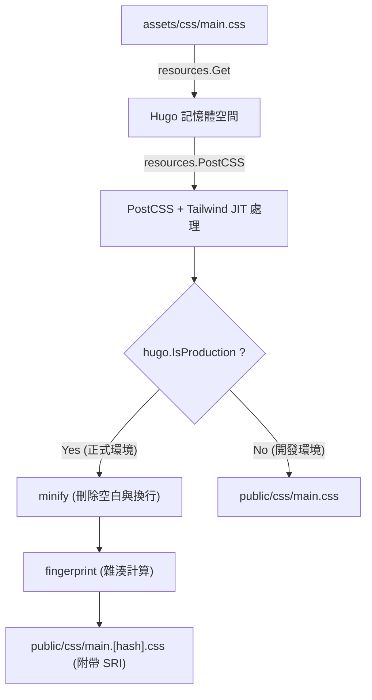

# 前言：靜態網站生成器Hugo與Tailwind CSS的強大協同效應

在現代的Web前端開發中，兼顧效能與開發體驗（DX：Developer Experience）是所有專案中最重要的課題之一。將在靜態網站生成器（SSG）中擁有世界最快建置速度的**Hugo**，與引入了實用優先（Utility-First）這一革新典範的**Tailwind CSS**相結合，可以說是由此課題得出的一個終極解答。

Hugo是使用Go語言編寫的，即使是擁有數千個頁面的網站，也具備在短短幾秒，甚至毫秒級別內完成建置的驚人效能。另一方面，Tailwind CSS透過在HTML中直接寫入預先定義的無數個實用類別（例如：`flex`、`text-center`、`mt-4`等），消除了在CSS檔案與HTML檔案之間來回切換的上下文切換（Context Switch），從而加速了設計的迭代。

本文將徹底且詳細地解說在Hugo主題中導入Tailwind CSS，並進一步使用PostCSS建立進階資源管道（Hugo Pipes）的步驟，內容涵蓋從架構的基礎到數學的效能最佳化觀點。

---

## 1. 實用優先CSS與元件導向的演變

在進入Tailwind CSS的導入步驟之前，深入理解為什麼我們應該使用Tailwind CSS，以及其背景中的CSS設計思想歷史與演變，是非常有幫助的。

### 傳統CSS設計（BEM與OOCSS）的極限
在過去的Web開發中，賦予語意化的類別名稱被認為是最佳實踐。例如，當建立卡片元件時，會像以下這樣將HTML與CSS分離。

```html
<div class="card">
  
  <div class="card__content">
    <h2 class="card__title">標題</h2>
    <p class="card__description">說明文字會放在這裡。</p>
  </div>
</div>
```

```css
.card {
  border-radius: 8px;
  box-shadow: 0 4px 6px rgba(0,0,0,0.1);
  background-color: #ffffff;
  overflow: hidden;
}
.card__title {
  font-size: 1.5rem;
  font-weight: bold;
  color: #333333;
}
/* 之後會接著詳細的樣式 */
```

像這樣基於BEM（Block Element Modifier）的設計，在專案規模較小時還能運作良好，但往往會引發以下問題：

1. **命名枯竭與疲勞**：每當製作類似的元件時，就必須思考新的類別名稱（例：`card-news`、`card-featured`等）。
2. **CSS的肥大化**：每當新增新功能時，CSS的行數就會持續增加，而一旦寫好的CSS因為害怕「不知道在哪裡被使用」，所以很少會被刪除，導致無效程式碼（Dead Code）不斷累積。
3. **上下文切換**：因為將HTML的結構與CSS的樣式分開在不同的檔案中管理，在編輯器上來回切換分頁的次數會呈指數級增加。

### Tailwind CSS帶來的典範轉移
Tailwind CSS透過「實用類別的組合」這種方法來解決這些問題。如果使用Tailwind CSS，上述的卡片元件將會變成如下所示：

```html
<div class="rounded-lg shadow-md bg-white overflow-hidden">
  
  <div class="p-6">
    <h2 class="text-2xl font-bold text-gray-800">標題</h2>
    <p class="mt-2 text-gray-600">說明文字會放在這裡。</p>
  </div>
</div>
```

由於類別名稱本身就代表了樣式的具體數值（例如 `p-6` 是 `padding: 1.5rem;`），因此只需看HTML就能預測最終的渲染結果。此外，透過Tailwind的JIT（Just-In-Time）編譯器，只有實際被使用的類別才會被提取到正式環境用的CSS檔案中，所以CSS的檔案大小會被縮減到極致。

---

## 2. Hugo Pipes與PostCSS的架構

為了將Tailwind CSS整合到Hugo中，必須理解被稱為**Hugo Pipes**的資源處理管道。Hugo Pipes是一個強大的功能，它能讓與資源相關的任何處理（如Sass/SCSS的編譯、JavaScript的打包與壓縮（Minify），以及本次將使用的**PostCSS**的執行等）都在Hugo內部完成。

PostCSS是一個使用JavaScript外掛來轉換CSS的工具。事實上，Tailwind CSS本身也是作為PostCSS的外掛在運作。

### 透過PostCSS進行的AST（抽象語法樹）轉換機制

理解PostCSS是如何處理CSS的，對於進行疑難排解時會有很大的幫助。以下的Mermaid圖表顯示了PostCSS讀取CSS檔案、透過外掛進行轉換，直到輸出最終CSS的管道處理過程。

```mermaid
flowchart TD
    A["原始 CSS (styles.css)"] -->|解析器 (Parser)| B["AST (抽象語法樹)"]
    B --> C["外掛 1: Tailwind CSS"]
    C --> D["外掛 2: Autoprefixer"]
    D --> E["外掛 N: cssnano"]
    E -->|字串化器 (Stringifier)| F["編譯與最佳化後的 CSS"]
```

1. **Parser（解析器）**：解析輸入的原始CSS字串，並將其轉換為可供程式操作的資料結構——AST（抽象語法樹）。
2. **Plugins（外掛群）**：
   - **Tailwind CSS**：掃描樣板檔案（HTML或Markdown），並將使用到的實用類別作為節點新增到AST上。此外，它也會展開 `@tailwind` 指令。
   - **Autoprefixer**：參考 `Can I Use` 的資料庫，並在必要時將供應商前綴（Vendor Prefix，如 `-webkit-`、`-moz-` 等）新增到AST的屬性中。
3. **Stringifier（字串化器）**：將轉換完成的AST重新轉換為瀏覽器可解析的CSS字串並輸出。

---

## 3. 環境建置與先決條件

那麼，我們就進入實際的導入步驟吧。首先要確認是否已安裝必要的軟體。

### 必備條件

1. **Hugo Extended Version**：
   必須是包含Sass/SCSS處理功能與原生PostCSS整合功能的**Extended版**，而不是普通的Hugo版本。請在終端機中執行以下指令，並確認版本資訊中是否包含 `extended` 字串。

   ```bash
   hugo version
   # 預期的輸出範例:
   # hugo v0.121.2-4146... windows/amd64 BuildDate=... VendorInfo=gohugoio +extended
   ```

2. **Node.js與npm**：
   Tailwind CSS與PostCSS等依賴套件是在Node.js上運作的。請確認是否已安裝Node.js（建議使用LTS版）。

   ```bash
   node -v
   npm -v
   ```

### 安裝npm套件

在專案的根目錄（即Hugo設定檔 `hugo.toml` 所在的層級）初始化npm，並安裝必要的套件。

```bash
# 產生 package.json
npm init -y

# 安裝 Tailwind CSS、PostCSS、Autoprefixer 作為開發依賴套件
npm install -D tailwindcss postcss postcss-cli autoprefixer
```

> [!IMPORTANT]
> 如果沒有安裝 `postcss-cli`，在從Hugo內部呼叫PostCSS時可能會發生錯誤。因為Hugo Pipes在內部會使用 `postcss-cli`，所以請務必將其安裝。

---

## 4. 建立設定檔（PostCSS & Tailwind CSS）

套件安裝完成後，接著要建立兩個控制專案行為的重要設定檔。請將它們放置在專案的根目錄。

### 建立 tailwind.config.js

在終端機中執行以下指令，將會產生預設的設定檔。

```bash
npx tailwindcss init
```

使用編輯器打開生成的 `tailwind.config.js`，並設定 `content` 屬性。這部分非常重要。Tailwind會解析這裡指定路徑的檔案，並提取被使用的類別。請配合Hugo的專案結構，準確地指定版面配置檔（Layout）和內容檔（Content）。

```javascript
/** @type {import('tailwindcss').Config} */
module.exports = {
  // 配合Hugo的目錄結構指定掃描對象
  content: [
    "./content/**/*.md",
    "./content/**/*.html",
    "./layouts/**/*.html",
    "./assets/**/*.js",
    // 如果有使用主題，也必須包含主題的目錄
    // "./themes/my-theme/layouts/**/*.html",
  ],
  theme: {
    extend: {
      // 在此擴充自訂顏色或字型
      colors: {
        'brand-primary': '#3490dc',
        'brand-secondary': '#ffed4a',
      },
      fontFamily: {
        'sans': ['Helvetica Neue', 'Arial', 'Hiragino Kaku Gothic ProN', 'Meiryo', 'sans-serif'],
      }
    },
  },
  plugins: [
    // 視需要加入官方外掛（例如：Typography 外掛）
    // require('@tailwindcss/typography'),
  ],
}
```

### 建立 postcss.config.js

接著，在專案根目錄建立 `postcss.config.js`，用來定義PostCSS要以什麼順序執行哪些外掛。

```javascript
module.exports = {
  plugins: {
    tailwindcss: {},
    autoprefixer: {},
  }
}
```

透過這個設定，當Hugo呼叫PostCSS時，會先進行Tailwind CSS的處理，然後再由Autoprefixer賦予供應商前綴。

---

## 5. 在Hugo中建立CSS資源管道

設定完成後，終於要在Hugo的主題端整合Tailwind CSS了。

### 5-1. 建立作為進入點的CSS檔案

在 `assets/css/` 目錄（如果不存在請建立它）中，建立作為進入點的CSS檔案。這裡我們將其命名為 `main.css`。

**檔案路徑：`assets/css/main.css`**

```css
/* 載入Tailwind的基礎樣式（Reset CSS等） */
@tailwind base;

/* 載入元件類別 */
@tailwind components;

/* 載入實用類別 */
@tailwind utilities;

/* 如果需要自有的客製化CSS，可以寫在這裡，
   但建議盡可能透過 tailwind.config.js 的 extend 來處理 */
@layer components {
  .btn-primary {
    @apply bg-blue-500 hover:bg-blue-700 text-white font-bold py-2 px-4 rounded transition-colors duration-300;
  }
}
```

### 5-2. 編輯版面配置檔（head.html）

接著，要撰寫從Hugo的樣板載入上述CSS檔案，並透過PostCSS處理的管道。一般來說，會編輯定義 `<head>` 標籤內的局部樣板（Partial Template）（例如：`layouts/partials/head.html`）。

**檔案路徑：`layouts/partials/head.html`**

```go-html-template
<head>
  <meta charset="utf-8">
  <meta name="viewport" content="width=device-width, initial-scale=1">
  <title>{{ .Title }} | {{ .Site.Title }}</title>

  <!-- 取得 assets/css/main.css -->
  {{ $css := resources.Get "css/main.css" }}

  <!-- 定義PostCSS的選項 -->
  {{ $options := dict "inlineImports" true }}
  {{ $css = $css | resources.PostCSS $options }}

  <!-- 針對正式環境（Production）的資源最佳化管道 -->
  {{ if hugo.IsProduction }}
    <!-- 1. 壓縮（Minify） -->
    {{ $css = $css | minify }}
    <!-- 2. Fingerprint（為了快取破壞（Cache Busting）的雜湊賦予） -->
    {{ $css = $css | fingerprint "sha512" }}
    <!-- 3. 輸出包含SRI（Subresource Integrity）的標籤 -->
    <link rel="stylesheet" href="{{ $css.RelPermalink }}" integrity="{{ $css.Data.Integrity }}" crossorigin="anonymous">
  {{ else }}
    <!-- 在開發環境（Development）不進行壓縮，直接輸出（優先考量建置速度） -->
    <link rel="stylesheet" href="{{ $css.RelPermalink }}">
  {{ end }}
</head>
```

#### 管道解說與Mermaid圖解

上述的Go樣板程式碼是如何處理CSS檔案的，這裡將一連串的管道處理進行圖解。



1. **`resources.Get`**：尋找 `assets` 目錄內指定的檔案，並將其作為資源物件載入到記憶體中。
2. **`resources.PostCSS`**：參考專案根目錄的 `postcss.config.js`，對CSS原始碼套用Tailwind CSS與Autoprefixer的處理。在開發環境（`hugo server`）中，JIT模式會啟動，在修改檔案時，能高速生成僅需的類別。
3. **`minify`**：在正式環境建置時（如 `hugo --environment production`），刪除不需要的空白與註解，將檔案大小最小化。
4. **`fingerprint`**：根據檔案的內容計算SHA雜湊值，並附加到檔案名稱上（例：`main.ab12cd...css`）。藉此，在利用瀏覽器強大快取的同時，也能實現在CSS更新時確保讀取新檔案的「快取破壞（Cache Busting）」。
5. **`integrity`**：使用Fingerprint計算出的雜湊值，輸出SRI屬性，以防止來自CDN等的竄改。

---

## 6. CSS最佳化中的數學效能分析

導入Tailwind CSS最大的好處之一，就是能將傳輸的CSS檔案大小極小化。這會對網頁效能（特別是首次內容繪製：FCP）帶來什麼樣的影響呢？讓我們使用數學模型來進行量化分析。

### CSS檔案大小的縮減模型

在傳統的CSS框架（如Bootstrap等）中，因為包含未使用的樣式也會全部載入，檔案大小 $S_{original}$ 通常會很大（約150KB～200KB）。
若將Tailwind CSS的JIT編譯器套用清除（Purge）不需要類別後的檔案大小設為 $S_{purged}$，使用縮減率 $R_{purge}$ 則可以表示如下：

$$
S_{purged} = S_{original} \times (1 - R_{purge})
$$

在典型的專案中，$R_{purge}$ 可接近 $0.9$（減少90%），而 $S_{purged}$ 僅有約10KB～20KB左右。

此外，傳輸時伺服器端還會透過Brotli或Gzip進行壓縮。若將壓縮率設為 $R_{compress}$（通常在0.7～0.8左右），則網路上傳輸的最終負載大小 $S_{final}$ 透過以下公式計算：

$$
S_{final} = S_{purged} \times (1 - R_{compress})
$$

### 關鍵渲染路徑與網路延遲

瀏覽器直到在畫面上繪製出最初內容為止的時間（FCP），可以由HTML的下載時間、CSS的下載時間，以及渲染時間的總和來近似計算。

$$
T_{FCP} \approx RTT + \frac{S_{HTML}}{BW} + RTT + \frac{S_{final}}{BW} + T_{render}
$$

這裡的：
- $RTT$：Round Trip Time（與伺服器來回通訊的延遲時間）
- $BW$：網路頻寬（Bandwidth）

在如行動網路等 $BW$ 較窄且 $RTT$ 較大（延遲較高）的環境中，Tailwind CSS能將 $S_{final}$ 削減到數KB單位的方法，可以使 $\frac{S_{final}}{BW}$ 這一項極度逼近零，這正是能夠在Google PageSpeed Insights等工具中獲得驚人高分的動力來源。

---

## 7. 啟動開發伺服器與確認熱重載（Hot Reload）

當所有設定都完成後，啟動Hugo的開發伺服器，並確認Tailwind CSS是否能正常運作。

```bash
hugo server -D
```

使用瀏覽器造訪 `http://localhost:1313/`，並確認網站是否正常顯示。
請打開Markdown的內容檔或是Hugo的樣板（`layouts/` 以下的檔案），試著加入類別看看。

```html
<!-- 測試用的Tailwind類別套用範例 -->
<div class="bg-gradient-to-r from-blue-500 to-purple-600 text-white p-8 rounded-xl shadow-2xl text-center transform transition duration-500 hover:scale-105">
  <h1 class="text-4xl font-extrabold tracking-tight">Tailwind CSS + Hugo is Awesome!</h1>
  <p class="mt-4 text-lg font-medium">請確認熱重載（Hot Reload）是否瞬間反映。</p>
</div>
```

在儲存檔案的瞬間，Hugo強大的檔案監視器與Tailwind的JIT編譯器會互相配合，在毫秒級別內重新建置CSS，你應該能體驗到瀏覽器自動重新載入（熱重載）的快感。

### 疑難排解：如果樣式沒有反映的情況

如果變更沒有反映，請檢查以下幾點：

1. **`tailwind.config.js` 的 `content` 路徑設定**
   如果掃描對象的檔案路徑有誤，Tailwind就無法偵測到該檔案內使用的類別，也不會輸出到CSS中。特別是當有使用主題時，請確認是否遺漏了主題目錄的路徑。
2. **PostCSS錯誤**
   如果在終端機的Hugo伺服器日誌中出現如 `Error: failed to transform resource: PostCSS not found` 這樣的錯誤，可能是 `npm install` 沒有正確執行，或者是缺少了 `postcss-cli`。
3. **清除Hugo的快取**
   有時候會因為Hugo快取的原因而殘留舊的CSS。請停止伺服器，然後使用 `hugo server --ignoreCache` 來啟動，或是試著刪除OS的暫存目錄（例如 `/tmp/hugo_cache/`）。

---

## 8. 針對正式環境的建置與進一步的進階設定

將網站部署到正式伺服器（如Netlify、Vercel、GitHub Pages、Cloudflare Pages等）時，必須設定環境變數並執行正式環境用的最佳化管道。

```bash
# 正式環境建置指令的範例
NODE_ENV=production hugo --minify --environment production
```

透過加上 `--environment production` 標籤，會執行 `head.html` 內的 `{{ if hugo.IsProduction }}` 區塊，進行CSS的壓縮（Minify）並賦予Fingerprint。

### 使用Typography外掛進行Markdown的樣式設定

在像Hugo這類的部落格或文件網站中，無法直接對由Markdown生成的純HTML元素（如 `<h1>`、`<p>`、`<ul>` 等）加上類別。在這種情況下，非常有用的就是Tailwind官方的 **Typography 外掛**。

1. 安裝外掛
   ```bash
   npm install -D @tailwindcss/typography
   ```

2. 新增到 `tailwind.config.js`
   ```javascript
   module.exports = {
     // ...
     plugins: [
       require('@tailwindcss/typography'),
     ],
   }
   ```

3. 在樣板中套用
   只要在輸出文章本文的容器元素上加上 `prose` 類別（以及個人喜好的顏色或尺寸變體），就能套用美麗的預設樣式。

   ```go-html-template
   <article class="prose prose-lg prose-blue mx-auto mt-10">
     {{ .Content }}
   </article>
   ```

這樣一來，就完全不需要手寫複雜的CSS選擇器（如 `.article-content h2 { ... }`），能完全保持元件的模組性。

---

## 9. 總結：完成具高維護性的前端生態系統

辛苦了。到這裡，具備Hugo超高速靜態網站生成引擎、Tailwind CSS現代化樣式設定功能，以及PostCSS擴充性的完美Web開發資源管道就完成了。

這個架構的優點在於，**「設定只需在最初進行一次即可」**。只要建立好管道，開發者就不需要打開CSS檔案，只需在HTML或Markdown樣板中寫入直觀的實用類別，就能以驚人的速度構建出複雜的UI。

此外，由於輸出的CSS大小始終會被最小化，這將直接提升Core Web Vitals的分數，從SEO的角度來看也非常有利。

Hugo與Tailwind CSS的組合，從個人技術部落格到大型企業網站，在所有專案中都將會是「最佳選擇」之一。請務必活用這個強大的工具鏈，享受舒適的Web開發生活！
