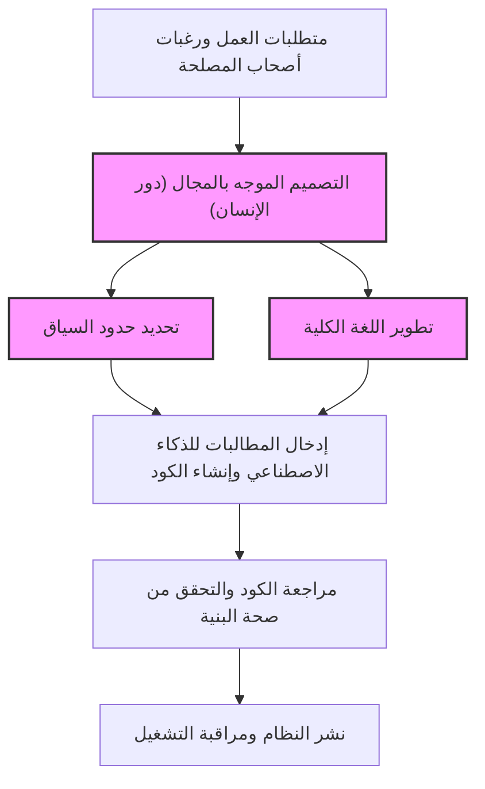
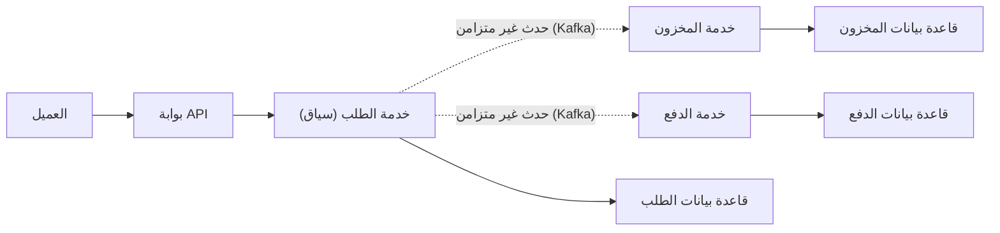
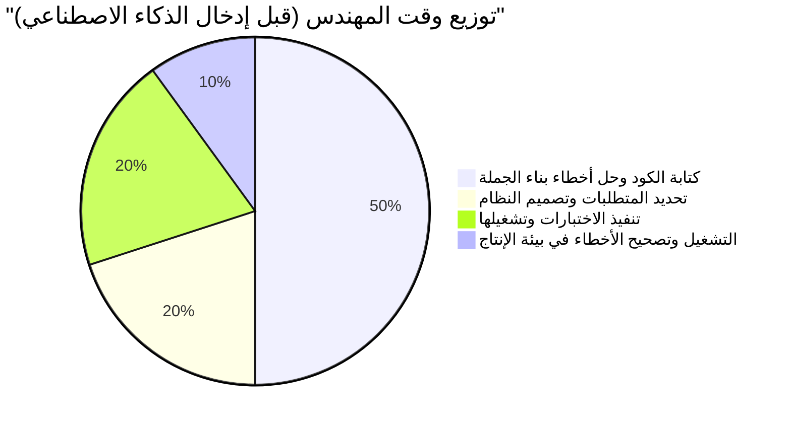
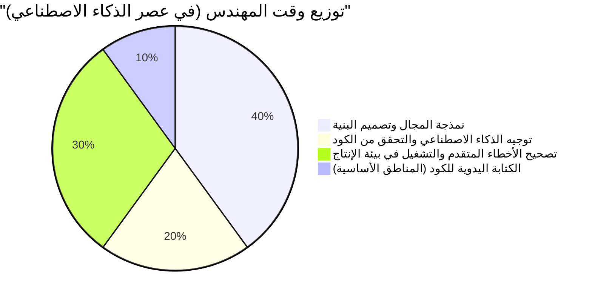

# المهارات الهندسية "الخاصة بالبشر" المطلوبة في عصر كتابة الذكاء الاصطناعي للكود

في السنوات الأخيرة، تغير مشهد هندسة البرمجيات بشكل جذري بسبب التطور السريع للذكاء الاصطناعي التوليدي (Generative AI) والنماذج اللغوية الكبيرة (LLM). أصبح استخدام مساعدي البرمجة بالذكاء الاصطناعي مثل GitHub Copilot وغيره أمرًا يوميًا، ولم تعد ظاهرة "إصدار تعليمات بلغة طبيعية ليقوم الذكاء الاصطناعي بإنشاء الكود في لحظة" خيالًا علميًا مستقبليًا بل واقعًا نعيشه اليوم.

في مثل هذا العصر، من الطبيعي أن يشعر العديد من المهندسين بالقلق من أن "يستولي الذكاء الاصطناعي على وظائفهم". وبالتأكيد، فإن "مجرد كتابة الكود" (Typing Code) مثل إنشاء القوالب النمطية لتطبيقات CRUD الروتينية، وتنفيذ الخوارزميات البسيطة، أو استدعاء واجهات برمجة التطبيقات للمكتبات المعروفة، أصبحت سلعًا شائعة بسرعة.

ومع ذلك، فإن جوهر هندسة البرمجيات ليس "كتابة الكود". بل هو حل مشاكل الأعمال من خلال التكنولوجيا، وبناء أنظمة قابلة للتوسع والصيانة. في هذه المقالة، سنتعمق بشكل تقني ومفصل للغاية في "المهارات الهندسية الخاصة بالبشر" التي تزداد قيمتها في عصر يكتب فيه الذكاء الاصطناعي الكود، من وجهة نظر القيود الفنية لنماذج LLM، والتصميم الموجه بالمجال (DDD)، وبنية النظام، وتصحيح أخطاء الأنظمة الموزعة.

---

## 1. فهم القيود الهيكلية للنماذج اللغوية الكبيرة (LLM)

من أجل التقييم الصحيح لقدرات الذكاء الاصطناعي وتحديد المجالات التي يجب على البشر فيها إظهار قيمتهم، يجب أولاً فهم القيود الهيكلية للذكاء الاصطناعي (وخاصة نماذج LLM) من منظور رياضي وهيكلي.

### 1.1 حدود التعقيد الحسابي والسياق في بنية المحول (Transformer)

تعتمد معظم نماذج LLM الحالية على بنية "المحول" (Transformer) التي أعلنت عنها جوجل عام 2017. يكمن جوهر المحول في "آلية الانتباه الذاتي" (Self-Attention Mechanism). تحسب هذه الآلية مدى ارتباط كل رمز (Token) في التسلسل المدخل بجميع الرموز الأخرى.

يتم التعبير عن معادلة حساب الانتباه هذا على النحو التالي:

$$ \text{Attention}(Q, K, V) = \text{softmax}\left(\frac{QK^T}{\sqrt{d_k}}\right)V $$

حيث $Q$ (الاستعلام/Query)، و $K$ (المفتاح/Key)، و $V$ (القيمة/Value) هي تحويلات خطية للتسلسل المدخل، و $d_k$ هو عدد أبعاد المفتاح.
أهم قيد في هذا الحساب هو التعقيد الحسابي المرتبط بضرب المصفوفات $QK^T$. إذا كان التسلسل المدخل (عدد الرموز) هو $N$، فإن هذا التعقيد الحسابي يزداد بترتيب $O(N^2)$ زمانيًا ومكانيًا (الذاكرة).

$$ \text{Complexity} = O(N^2 \cdot d) $$

في السنوات الأخيرة، تقدمت الأبحاث حول تحسينات على مستوى الأجهزة مثل FlashAttention، والبنى البديلة مثل Sparse Attention و Mamba (نماذج مساحة الحالة) التي يمكنها المعالجة في وقت خطي $O(N)$، ولكن لا يزال من الصعب جدًا "الفهم الكامل لسياق لانهائي وإنشاء مخرجات محسنة بالكامل".

علاوة على ذلك، حتى إذا تم توسيع نافذة السياق ماديًا، تحدث ظاهرة تسمى "الضياع في المنتصف" (Lost in the Middle). تميل نماذج LLM إلى التأثر بشدة بالمعلومات الموجودة في بداية ونهاية الموجه (Prompt)، وتتجاهل المتطلبات والقيود المهمة الموضوعة في المنتصف. لهذا السبب، إذا قمت بإدخال الكود المصدري بالكامل لنظام مؤسسي يضم عشرات الآلاف من الأسطر في LLM وطلبت منه "إجراء إعادة هيكلة مثالية"، فسيتم إنشاء كود قد يكون صحيحًا محليًا ولكنه معطل ككل.

### 1.2 خصائص النماذج التوليدية الاحتمالية و "الهلوسة"

جوهر نماذج LLM هو "النموذج التوليدي الاحتمالي" الذي يتنبأ بالرمز التالي الأكثر احتمالاً للظهور بناءً على السياق المدخل (الموجه) والنتائج المولدة حتى الآن.

$$ P(w_t | w_{1:t-1}) = \text{softmax}(W \cdot h_t) $$

النموذج يتعلم فقط "علاقات التواجد الإحصائي المشترك للكلمات" من كميات هائلة من بيانات التدريب، ولا يفهم "المعنى" (Semantics) للكود المولد أو "التأثير في العالم الحقيقي لنتيجة التنفيذ". ما ينتج عن ذلك هو "الهلوسة" (Hallucination).
فالأخطاء المتمثلة في استدعاء دوال مكتبة وهمية غير موجودة، أو تمرير متغيرات لا تتطابق أنواعها تمامًا، هي مجرد نتيجة لإنشاء نموذج LLM "تسلسل رموز يبدو صحيحًا نحويًا (ذو احتمالية عالية)".

### 1.3 الافتقار إلى التأريض في العالم الحقيقي (Grounding)

يفتقر الذكاء الاصطناعي إلى القدرة على الفهم الفطري لـ "القيود المادية" و "قيود الأعمال الحقيقية" (Grounding). على سبيل المثال، الواقع التجاري المتمثل في "تأخير معالجة الدفع بمقدار 100 مللي ثانية يقلل من معدل التحويل بنسبة 5%"، أو المعرفة الضمنية الخاصة بالبيئة مثل "تعمل المعالجة الدفعية لقاعدة البيانات القديمة هذه في الساعة 2 صباحًا، لذلك غالبًا ما تنتهي مهلة المعاملات في ذلك الوقت"، لا يمكن للذكاء الاصطناعي أخذها في الاعتبار ما لم يتم إعطاؤها كنص صريح.

بناءً على هذه القيود التقنية والهيكلية، فإن الذكاء الاصطناعي رائع كـ "أداة لإنشاء كود سريع لنطاقات ضيقة ومحددة بوضوح (دوال، فئات، وحدات)"، ولكن "تصميم نظام كامل من متطلبات غامضة ومواءمته مع قيود العالم الحقيقي" هو مجال لا يمكن إلا للبشر القيام به.

---

## 2. مهارة بشرية بحتة ①: استخراج "المشكلة الحقيقية" من المتطلبات الغامضة

أكبر عقبة في تطوير البرمجيات ليست كتابة الكود بحد ذاتها.
يقول فريدريك بروكس، مؤلف كتاب هندسة البرمجيات الكلاسيكي "The Mythical Man-Month":

> "The hardest single part of building a software system is deciding precisely what to build."
> (أصعب جزء في بناء نظام برمجي هو التحديد الدقيق لما سيتم بناؤه.)

غالبًا ما يفشل أصحاب المصلحة غير التقنيين (الإدارة العليا، المبيعات، العملاء) في صياغة ما يريدونه حقًا بكلمات. وتتطاير الطلبات الغامضة والمتناقضة بشكل يومي، مثل "أريد منك إنشاء نظام يزيد المبيعات باستخدام الذكاء الاصطناعي" أو "أريد شاشة تُشغل كل شيء تلقائيًا بضغطة زر واحدة".

حتى لو قمت بكتابة مطالبة للذكاء الاصطناعي "اكتب كودًا لنظام يزيد المبيعات"، فلن تحصل على نظام قابل للاستخدام. ما يُطلب من المهندس هو العملية التالية:

1. **التعمق في المجال**: استخلاص "مشكلة العمل الحقيقية" المخفية وراء كلمات أصحاب المصلحة من خلال الحوار.
2. **تحديد نطاق المتطلبات**: الموازنة بين الجدوى الفنية والتكلفة (ROI)، وتحديد "ما لن يتم القيام به".
3. **إضفاء الطابع الرسمي على المواصفات**: تحويل المتطلبات الغامضة إلى قيود منطقية واضحة (مخططات معمارية أو مطالبات) يفهمها الذكاء الاصطناعي.

هذا "التواصل والتفاوض عالي المستوى بين البشر" هو مهارة ذات قيمة عالية تعتمد على الشخص ولا يمكن للذكاء الاصطناعي أبدًا أن يحل محلها.

---

## 3. مهارة بشرية بحتة ②: التصميم الموجه بالمجال (DDD) والنمذجة

بعد استخلاص المتطلبات، فإن أقوى سلاح لتحويلها إلى هيكل برمجي هو "التصميم الموجه بالمجال" (Domain-Driven Design: DDD). كلما زاد قيام الذكاء الاصطناعي بإنشاء كود محلي تلقائيًا، أصبح مفهوم DDD المتمثل في تحديد "حدود" النظام بأكمله ذا أهمية قصوى.

### 3.1 تطوير اللغة الكلية (Ubiquitous Language)

في تطوير الأنظمة، إذا كان هناك اختلاف في "معنى الكلمات" بين جانب الأعمال وجانب التطوير، فسيقوم الذكاء الاصطناعي بإنشاء كود في سياق خاطئ. على سبيل المثال، قد تشير كلمة "مستخدم" إلى "عميل محتمل" بالنسبة لقسم التسويق، و "حساب متعاقد" بالنسبة لدعم العملاء.
يجب على المهندس البشري صياغة "لغة كلية" موحدة عبر المشروع بأكمله والتأكد من استخدامها في كل شيء من أسماء الفئات والدوال في الكود إلى المطالبات المقدمة للذكاء الاصطناعي.

### 3.2 تصميم السياق المقيد (Bounded Context)

محاولة تمثيل نظام ضخم بنموذج واحد ستفشل دائمًا. في DDD، يتم تقسيم النظام إلى حدود ذات معنى (Bounded Context).
على سبيل المثال، في موقع التجارة الإلكترونية، يختلف مفهوم "المنتج" (Product) اختلافًا جوهريًا في الخصائص والسلوكيات التي يجب أن يمتلكها في سياق الكتالوج (العرض) مقارنة بسياق المخزون (الإدارة).

من خلال قيام المهندس المعماري البشري برسم حدود السياق الصحيحة وتزويد الذكاء الاصطناعي بمطالبات ومواصفات مستقلة لكل سياق، يمكن للذكاء الاصطناعي فقط إنشاء "كود بناءً على معرفة المجال الصحيحة".

يوضح الشكل أدناه نهج DDD وتقسيم الأدوار في عصر الذكاء الاصطناعي.

بدلاً من توجيه الذكاء الاصطناعي لـ "إنشاء النظام بأكمله"، يتم تفويض التنفيذ للذكاء الاصطناعي فقط داخل "حدود السياق" التي يحددها الإنسان. سيكون هذا هو النموذج الأساسي لتطوير البرمجيات في المستقبل.

---

## 4. مهارة بشرية بحتة ③: تصميم البنية وقابلية التوسع للأنظمة الموزعة

تطورت البرامج الحديثة من النظم المتجانسة (Monolith) التي تعمل على خادم واحد، إلى بنية الخدمات المصغرة (Microservices) السحابية الأصلية، إلى البنية الموجهة بالأحداث (Event-Driven Architecture). تصميم مثل هذه الأنظمة الموزعة هو مجال صعب للغاية بالنسبة للذكاء الاصطناعي، الذي يمكنه فقط تحسين المنطق المحلي.

### 4.1 نظرية CAP والحكم على المفاضلات (Trade-offs)

عند تصميم نظام موزع، يواجه المهندسون دائمًا "نظرية CAP". تنص نظرية CAP على أن النظام الموزع يمكنه تلبية اثنتين فقط من الخصائص الثلاث التالية في وقت واحد.

- **الاتساق (Consistency)**: هل ترى جميع العقد نفس البيانات في نفس الوقت؟
- **التوافر (Availability)**: هل يستمر النظام في الاستجابة حتى لو فشلت بعض العقد؟
- **تحمل الانقسام (Partition Tolerance)**: هل يستمر النظام في العمل حتى لو حدث انقسام في الشبكة؟

$$ P(\text{Availability} \cup \text{Consistency}) | \text{PartitionTolerance} $$

نظرًا لأنه لا يمكن تجنب انقسام الشبكة (Partition) في الشبكات الحقيقية، يجب على المهندسين اتخاذ قرارات مقايضة قاسية ترتبط ارتباطًا مباشرًا بمتطلبات العمل، مثل "سيعطي نظام الدفع هذا الأولوية للاتساق ويتوقف عن العمل عند حدوث عطل (CP)" أو "سيعطي الخط الزمني لشبكة التواصل الاجتماعي هذه الأولوية للتوافر ويسمح بعدم تناسق البيانات المؤقت (AP)".

يمكن للذكاء الاصطناعي أن يكتب "كودًا يعطي الأولوية لـ C" أو "كودًا يعطي الأولوية لـ A"، لكنه لا يمكنه اتخاذ قرار ذاتي يتضمن مخاطر العمل حول "أيهما يجب أن يُعطى الأولوية".

### 4.2 الاتصالات غير المتزامنة والاتساق النهائي (Eventual Consistency)

كلما زاد حجم النظام، ينتقل الاتصال بين الخدمات من الاتصال المتزامن عبر REST API إلى الاتصال غير المتزامن باستخدام طوابير الرسائل (مثل Kafka، RabbitMQ). يتغير تناسق البيانات هنا من الاتساق الفوري إلى "الاتساق النهائي" (Eventual Consistency).
متى يجب إدخال أنماط معمارية متقدمة مثل نمط Saga أو فصل مسؤولية أمر الاستعلام (CQRS)؟ إن اتخاذ هذه القرارات المعقدة ورسم مخطط النظام بأكمله هو بالفعل القيمة الحقيقية للمهندس الأول (Senior Engineer).

---

## 5. مهارة بشرية بحتة ④: تصحيح الأخطاء واستكشاف الأخطاء وإصلاحها في الأنظمة المعقدة

كلما زاد الكود الذي يُنشئه الذكاء الاصطناعي، زادت مخاطر تشغيل "كود لا يفهمه أحد بالكامل" في بيئة الإنتاج. حتى لو كان يعمل بشكل جيد في الأوقات العادية، فإن القيمة الحقيقية للمهندسين البشريين تُختبر في استكشاف الأخطاء وإصلاحها عند حدوث الأعطال.

### 5.1 تصميم قابلية المراقبة (Observability)

من أجل حل أعطال النظام بسرعة، لا يكفي لصق سجلات الأخطاء (Error Logs) للذكاء الاصطناعي. في بيئة الخدمات المصغرة، يمر طلب واحد عبر العشرات من الخدمات.
يحتاج المهندسون إلى دمج "الركائز الثلاث لقابلية المراقبة": السجلات (Logs)، المقاييس (Metrics)، والتتبعات (Traces) في النظام بشكل مناسب. من دور الإنسان إنشاء أساس يمكنه تحديد "في أي استعلام قاعدة بيانات لأي خدمة يحدث التأخير" من خلال التتبع الموزع باستخدام أدوات مثل OpenTelemetry.

### 5.2 الأخطاء المعتمدة على البيئة وهندسة الفوضى (Chaos Engineering)

"الأخطاء التي لا تتكرر في البيئة المحلية أو بيئة الاختبار، ولكنها تحدث فقط في أوقات الذروة في بيئة الإنتاج" - على سبيل المثال، تسرب الذاكرة (Memory Leak)، وجمود قاعدة البيانات (Deadlock)، واستنفاد تجمع الاتصالات (Connection Pool Exhaustion)، وفقدان الحزم في الشبكة - لن يتم العثور عليها أبدًا من خلال التحليل الثابت للكود المصدري وحده.

يقوم المهندسون البشريون ببناء الفرضيات أثناء النظر إلى مقاييس بيئة الإنتاج، وتحليل تفريغ مؤشرات الترابط (Thread Dump) وتفريغ الذاكرة (Heap Dump)، وتحديد الاختناقات (Bottlenecks). لا يمكن للذكاء الاصطناعي فتح الجهاز الطرفي (Terminal) وتحليل عمليات خادم الإنتاج بشكل مباشر (ولا ينبغي السماح له بذلك كمتطلب أمني).
كلما أصبح النظام أكثر تعقيدًا، زادت قيمة المهندسين ذوي "المعرفة بالطبقة الدنيا" مثل البنية التحتية المادية، وبروتوكولات الشبكة، وضبط نواة نظام التشغيل، و "قدرة الاستدلال الفرضي البديهي" بشكل كبير.

---

## 6. دالة القيمة وتخصيص الوقت للمهندس في عصر الذكاء الاصطناعي

كما ذكرنا حتى الآن، تمر مجموعة المهارات المطلوبة للمهندسين في عصر الذكاء الاصطناعي بتحول نموذجي كبير. إذا قمنا بنمذجة هذا بصيغة رياضية، فيمكن التعبير عن القيمة ($V$) التي ينشئها المهندس على النحو التالي:

$$ V = \left( \sum_{i=1}^{n} \text{DomainKnowledge}_i + \text{ArchitectureSkill} + \text{ProblemSolving} \right) \times \text{AI\_Leverage}^{\alpha} $$

تُستبعد "سرعة الترميز" التقليدية و "الذاكرة لبناء الجملة" من هذه المعادلة. بدلاً من ذلك، يتضاعف المجموع الكلي للمعرفة العميقة بالمجال، والقدرة على تصميم البنية، والقدرة على حل المشكلات المعقدة من خلال الرافعة المالية لإتقان الذكاء الاصطناعي ($\text{AI\_Leverage}^{\alpha}$)، مما يخلق بنية تولد قيمة أسية.

ينعكس هذا التحول النموذجي بوضوح أيضًا في كيفية قضاء المهندسين لوقتهم اليومي (تخصيص الوقت).

في عصر الذكاء الاصطناعي، يرتقي المهندس من كونه "طابع كود" إلى "قائد أوركسترا ينسق النظام بأكمله". تحديدًا لأن الذكاء الاصطناعي يكتب كميات هائلة من التعليمات البرمجية، سيُطلب من جميع المهندسين، من المبتدئين إلى كبار المطورين، القيام بدور "المراجع" و "المهندس المعماري" الذي يراقب ويتحكم فيما إذا كان هذا الكود يتجه في الاتجاه الصحيح، ويلبي متطلبات الأمان، ويتوافق مع البنية العامة للنظام.

---

## 7. الخاتمة: عدم مقاومة التطور، بل ركوب الموجة

"عصر الذكاء الاصطناعي الذي يكتب الكود" ليس تهديدًا للمهندسين، بل هو أكبر فرصة في التاريخ. تمامًا كما حدث الانتقال من لغة التجميع إلى لغة C، والتطور من إدارة مؤشرات الذاكرة إلى تجميع القمامة (Garbage Collection) في Java، فإن إنشاء التعليمات البرمجية بواسطة الذكاء الاصطناعي هو مجرد "ارتفاع مستوى التجريد خطوة واحدة".

بدلاً من القلق بشأن المواصفات الدقيقة للغة برمجة معينة أو تحديثات إطار العمل، سيتمكن مهندسو المستقبل من تركيز مواردهم على حلول أكثر أهمية وتطورًا لحل المشكلات بطريقة بشرية، مثل: **"ما هو تحدي الأعمال؟" و "كيف نقسم البيانات ونربطها؟" و "كيف يمكننا استعادة النظام بسرعة في حالة تعطله؟"**

المهندس الحقيقي ليس الشخص الذي يكتب الكود، بل هو الشخص الذي يحل المشاكل.
بالنسبة لأولئك الذين يستمرون في صقل "المهارات الهندسية الخاصة بالبشر" - نمذجة المجال، وتصميم بنية قابلة للتوسع، والتواصل مع أصحاب المصلحة، وتصحيح أخطاء الأنظمة المعقدة - لن يكون الذكاء الاصطناعي عدوًا يسرق وظائفهم، بل سيصبح أقوى شريك يضاعف إبداعهم وإنتاجيتهم عشرات المرات.
