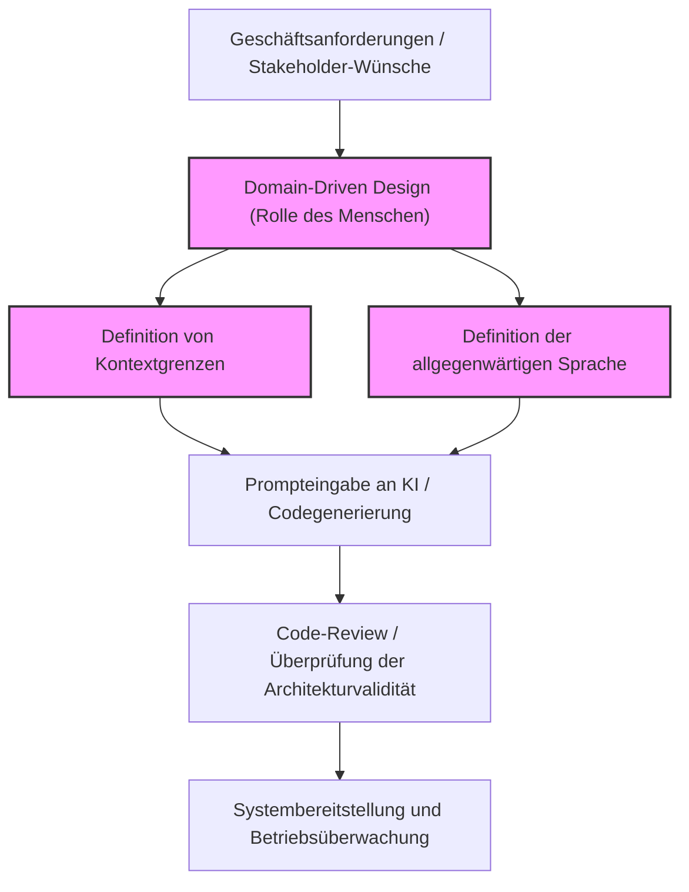
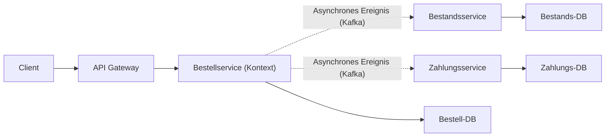
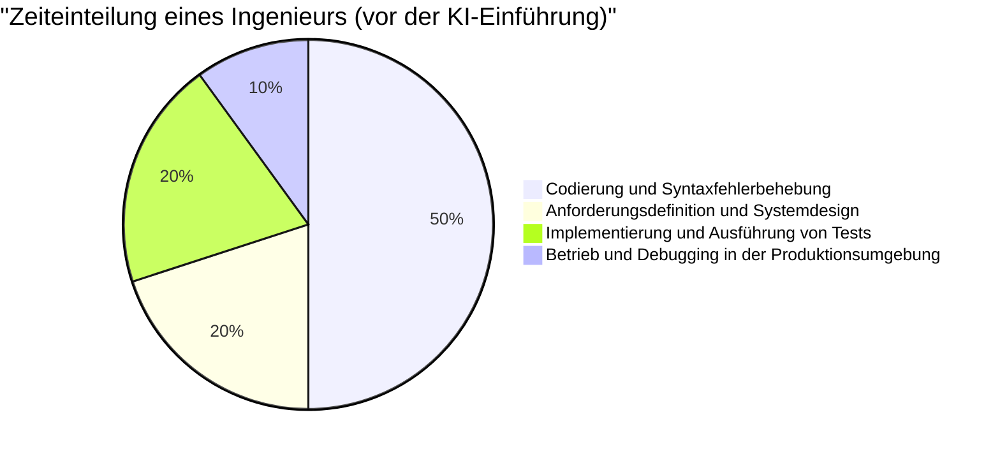
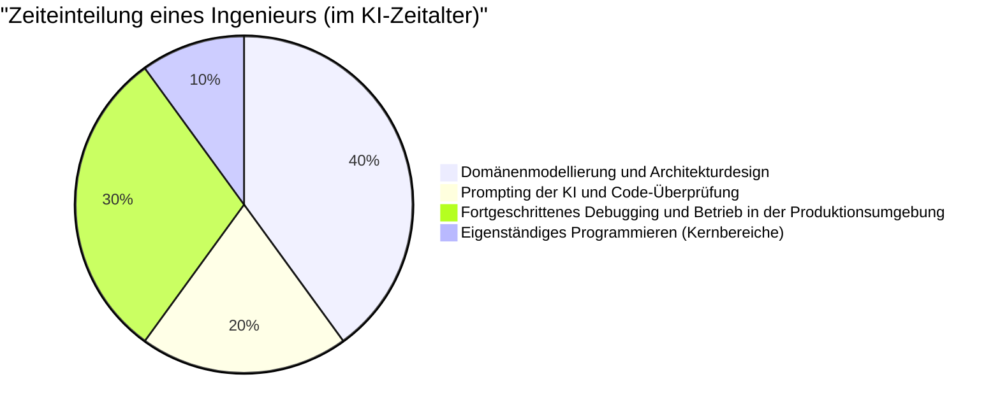

# Die 'menschlichen Ingenieurfähigkeiten', die im Zeitalter der KI-Codegenerierung gefragt sind

In den letzten Jahren hat sich die Landschaft der Softwareentwicklung durch die rasante Entwicklung generativer KI (Generative AI) und großer Sprachmodelle (LLM) dramatisch verändert. Die tägliche Nutzung von GitHub Copilot und verschiedenen KI-Programmierassistenten ist zur Normalität geworden. Das Phänomen, dass „KI sofort Code generiert, wenn man Anweisungen in natürlicher Sprache gibt“, ist nicht länger Zukunftsmusik aus Science-Fiction, sondern heutige Realität.

In einer solchen Zeit ist es nur natürlich, dass viele Ingenieure die Sorge hegen, „ihre Arbeit könnte von KI übernommen werden“. Tatsächlich werden „bloße Programmierarbeiten (Typing Code)“ wie die Erstellung von Boilerplates für routinemäßige CRUD-Anwendungen, die Implementierung einfacher Algorithmen oder das Aufrufen von APIs bekannter Bibliotheken schnell zur Standardware (Commodity).

Die Essenz der Softwareentwicklung besteht jedoch nicht darin, „Code einzutippen“. Es geht darum, geschäftliche Herausforderungen durch Technologie zu lösen und skalierbare, wartbare Systeme zu entwickeln. In diesem Artikel werden die „menschlichen Ingenieurfähigkeiten“, deren Wert im Zeitalter der KI-Codegenerierung noch steigt, aus den Perspektiven der technischen Grenzen von LLMs, des Domain-Driven Design (DDD), der Systemarchitektur und des Debuggings verteilter Systeme äußerst detailliert und technisch tiefgehend untersucht.

---

## 1. Die strukturellen Grenzen von Large Language Models (LLM) verstehen

Um die Fähigkeiten von KI richtig bewerten zu können und herauszufinden, in welchen Bereichen Menschen einen Mehrwert bieten sollten, müssen wir zunächst die strukturellen Grenzen von KI (insbesondere LLMs) aus einer mathematischen und architektonischen Perspektive verstehen.

### 1.1 Die Grenzen von Rechenaufwand und Kontext in der Transformer-Architektur

Die meisten heutigen LLMs basieren auf der „Transformer“-Architektur, die 2017 von Google vorgestellt wurde. Der Kern des Transformers liegt im „Self-Attention-Mechanismus“. Dieser Mechanismus berechnet, wie stark jedes Token in einer Eingabesequenz mit allen anderen Token in Beziehung steht.

Die Formel für diese Attention-Berechnung lautet wie folgt:

$$ \text{Attention}(Q, K, V) = \text{softmax}\left(\frac{QK^T}{\sqrt{d_k}}\right)V $$

Hierbei sind $Q$ (Query), $K$ (Key) und $V$ (Value) lineare Transformationen der Eingabesequenz, und $d_k$ ist die Dimension der Keys.
Die größte Einschränkung bei dieser Berechnung ist der Rechenaufwand, der mit der Matrixmultiplikation $QK^T$ einhergeht. Wenn die Eingabesequenz (Anzahl der Token) $N$ ist, steigt dieser Rechenaufwand sowohl zeitlich als auch räumlich (Speicher) in der Größenordnung von $O(N^2)$.

$$ \text{Complexity} = O(N^2 \cdot d) $$

In den letzten Jahren wurden Fortschritte bei Hardware-Optimierungen wie FlashAttention, Sparse Attention und sogar alternativen Architekturen wie Mamba (State Space Models) erzielt, die in linearer Zeit $O(N)$ verarbeitet werden können. Dennoch bleibt es extrem schwierig, „einen unendlichen Kontext vollständig zu verstehen und eine global optimierte Ausgabe zu generieren“.

Selbst wenn das Kontextfenster physisch vergrößert werden könnte, tritt das Phänomen „Lost in the Middle“ (Verlust mittlerer Informationen) auf. LLMs lassen sich stark von den Informationen am Anfang und Ende eines Prompts beeinflussen und neigen dazu, in der Mitte platzierte wichtige Anforderungen oder Einschränkungen zu ignorieren. Dies ist der Grund, warum eine KI, der man den gesamten Quellcode eines Unternehmenssystems mit Zehntausenden von Zeilen übergibt und die angewiesen wird, „ein optimales Refactoring durchzuführen“, lokal korrekten, aber im Gesamtsystem fehlerhaften Code generiert.

### 1.2 Eigenschaften von probabilistischen generativen Modellen und „Halluzinationen“

Das Wesen eines LLM ist ein „probabilistisches generatives Modell“, das basierend auf dem eingegebenen Kontext (Prompt) und den bisherigen Generierungsergebnissen das Token vorhersagt, das mit der höchsten Wahrscheinlichkeit als Nächstes erscheint.

$$ P(w_t | w_{1:t-1}) = \text{softmax}(W \cdot h_t) $$

Das Modell hat aus riesigen Trainingsdaten lediglich die „statistischen Ko-Okkurrenz-Beziehungen von Wörtern“ gelernt und versteht weder die „Bedeutung (Semantics)“ des generierten Codes noch die „Auswirkungen der Ausführungsergebnisse in der realen Welt“. Dadurch entstehen „Halluzinationen“.
Bugs, bei denen nicht existierende, fiktive Bibliotheksfunktionen aufgerufen werden oder Variablen übergeben werden, deren Typen nicht ganz übereinstimmen, sind lediglich das Ergebnis davon, dass das LLM eine „grammatikalisch plausibel wirkende (hochwahrscheinliche) Token-Sequenz“ generiert hat.

### 1.3 Fehlen von Real-World Grounding

KI besitzt nicht die Fähigkeit, „physische Einschränkungen“ oder „reale Geschäftsbeschränkungen“ instinktiv zu verstehen (Grounding). Beispielsweise kann sie die geschäftliche Realität „Wenn die Latenz der Zahlungsabwicklung um 100 ms steigt, sinkt die Conversion-Rate um 5 %“ oder das umgebungsspezifische implizite Wissen „Diese Legacy-Datenbank führt um 2 Uhr morgens eine Stapelverarbeitung durch, weshalb Transaktionen in diesem Zeitraum zu Timeouts neigen“ nicht berücksichtigen, es sei denn, dies wird ihr explizit als Text mitgeteilt.

Angesichts dieser technischen und strukturellen Grenzen erweist sich KI als ein hervorragendes Werkzeug zur „schnellen Generierung von Code für klar definierte, enge Bereiche (Funktionen, Klassen, Module)“. Die Fähigkeit jedoch, „aus vagen Anforderungen ein komplettes System zu entwerfen und dieses mit den Gegebenheiten der realen Welt abzugleichen“, bleibt ein Bereich, den nur Menschen beherrschen.

---

## 2. Menschliche Fähigkeit ①: Extrahieren des „wahren Problems“ aus vagen Anforderungen

Die größte Herausforderung in der Softwareentwicklung besteht nicht im Schreiben von Code selbst.
Frederick Brooks, Autor des Software-Engineering-Klassikers „The Mythical Man-Month“, stellte fest:

> "The hardest single part of building a software system is deciding precisely what to build."
> (Der schwierigste einzelne Teil bei der Konstruktion eines Softwaresystems besteht darin, genau zu entscheiden, was gebaut werden soll.)

Nicht-technische Stakeholder (Management, Vertriebsabteilungen, Kunden) sind oft nicht in der Lage zu artikulieren, was sie wirklich wollen. Äußerst vage und widersprüchliche Anforderungen wie „Ich möchte, dass Sie KI einsetzen, um ein System zu entwickeln, das den Umsatz steigert“ oder „Ich möchte einen Bildschirm, bei dem mit einem Knopfdruck alles automatisch erledigt wird“ gehören zum Alltag.

Wenn man einer KI den Prompt „Schreibe Code für ein System, das den Umsatz steigert“ gibt, wird kein brauchbares System dabei herauskommen. Von Ingenieuren wird folgender Prozess erwartet:

1. **Tiefe Analyse der Domäne**: Durch Dialog das „wahre Geschäftsproblem“ hinter den Worten der Stakeholder herausfinden.
2. **Definition des Anforderungsbereichs (Scope)**: Technische Machbarkeit und Kosten (ROI) abwägen und entscheiden, „was nicht getan wird“.
3. **Formalisierung von Spezifikationen**: Vage Anforderungen in klare, logische Einschränkungen (Prompts oder Architekturdiagramme) umwandeln, die von der KI verstanden werden können.

Diese „fortgeschrittene Kommunikation und Verhandlung zwischen Menschen“ ist eine hochgradig personengebundene und wertvolle Fähigkeit, die KI niemals ersetzen kann.

---

## 3. Menschliche Fähigkeit ②: Domain-Driven Design (DDD) und Modellierung

Sobald die Anforderungen geklärt sind, ist das mächtigste Werkzeug, um sie in eine Softwarestruktur zu überführen, das „Domain-Driven Design (DDD)“. Je mehr KI lokalen Code automatisch generiert, desto wichtiger wird das DDD-Konzept, wo die „Grenzen“ des gesamten Systems gezogen werden.

### 3.1 Definition der allgegenwärtigen Sprache (Ubiquitous Language)

Wenn bei der Systementwicklung die „Bedeutung von Wörtern“ zwischen der Geschäfts- und der Entwicklungsseite abweicht, generiert die KI Code in einem falschen Kontext. Beispielsweise kann das Wort „Nutzer“ für die Marketingabteilung „Lead (Interessent)“ und für den Kundensupport „Konto mit Vertrag“ bedeuten.
Menschliche Ingenieure müssen eine „allgegenwärtige Sprache“ definieren, die im gesamten Projekt einheitlich ist, und sicherstellen, dass diese Sprache bis in die Klassennamen, Methodennamen und die Prompts an die KI konsequent angewendet wird.

### 3.2 Entwurf von Kontextgrenzen (Bounded Context)

Der Versuch, ein riesiges System durch ein einziges Modell darzustellen, wird unweigerlich scheitern. In DDD wird das System in sinnvolle Grenzen (Bounded Contexts) unterteilt.
In einer E-Commerce-Website beispielsweise erfordert das Konzept des „Produkts“ im Katalogkontext (Anzeige) völlig andere Attribute und Verhaltensweisen als im Bestandskontext (Verwaltung).

Nur wenn ein menschlicher Architekt die richtigen Kontextgrenzen zieht und der KI für jeden Kontext unabhängige Prompts und Spezifikationen gibt, kann die KI „Code basierend auf korrektem Domänenwissen“ generieren.

Das folgende Diagramm zeigt den DDD-Ansatz und die Aufgabenverteilung im KI-Zeitalter.

Anstatt die KI anzuweisen, „das gesamte System zu erstellen“, delegiert der Mensch die Implementierung an die KI, jedoch ausschließlich innerhalb der von ihm definierten „Kontextgrenzen“. Dies wird das grundlegende Paradigma der zukünftigen Softwareentwicklung sein.

---

## 4. Menschliche Fähigkeit ③: Architekturdesign und Skalierung verteilter Systeme

Moderne Software hat sich von Monolithen, die auf einem einzigen Server laufen, zu Cloud-nativen Microservices-Architekturen und ereignisgesteuerten Architekturen (Event-Driven Architecture) entwickelt. Der Entwurf solcher verteilten Systeme ist für eine KI, die nur lokale Logik optimieren kann, ein äußerst schwieriges Terrain.

### 4.1 CAP-Theorem und Kompromissentscheidungen

Beim Entwurf verteilter Systeme werden Ingenieure immer mit dem „CAP-Theorem“ konfrontiert. Das CAP-Theorem ist das Prinzip, dass ein verteiltes System nur zwei der folgenden drei Eigenschaften gleichzeitig erfüllen kann:

- **Consistency (Konsistenz)**: Sehen alle Knoten gleichzeitig dieselben Daten?
- **Availability (Verfügbarkeit)**: Antwortet das System weiterhin, auch wenn ein Teil der Knoten ausfällt?
- **Partition Tolerance (Ausfalltoleranz/Netzwerkpartitionierung)**: Funktioniert das System auch bei Netzwerkunterbrechungen weiter?

$$ P(\text{Availability} \cup \text{Consistency}) | \text{PartitionTolerance} $$

Da Partitionen in realen Netzwerken unvermeidlich sind, müssen Ingenieure strenge Kompromissentscheidungen treffen, die direkt mit den Geschäftsanforderungen verknüpft sind, wie z.B. „Dieses Zahlungssystem priorisiert Konsistenz und stoppt den Dienst im Fehlerfall (CP)“ oder „Die Timeline dieses sozialen Netzwerks priorisiert Verfügbarkeit und toleriert vorübergehende Dateninkonsistenzen (AP)“.

Eine KI kann zwar „Code schreiben, der C priorisiert“ oder „Code, der A priorisiert“, aber sie kann nicht autonom die mit Geschäftsrisiken verbundene Entscheidung treffen, „welches von beiden priorisiert werden sollte“.

### 4.2 Asynchrone Kommunikation und Eventual Consistency

Wenn Systeme größer werden, verlagert sich die Kommunikation zwischen Diensten von der synchronen Kommunikation über REST-APIs zur asynchronen Kommunikation über Message Queues (Kafka, RabbitMQ usw.). Die Datenkonsistenz ändert sich hier von sofortiger Konsistenz zu „Eventual Consistency“ (letztendlicher Konsistenz).
Wann sollten fortschrittliche Architekturmuster wie das Saga-Muster oder CQRS (Command Query Responsibility Segregation) eingeführt werden? Solche komplexen Entscheidungen zu treffen und die Blaupause für das gesamte System zu entwerfen, ist die wahre Meisterleistung eines Senior-Engineers.

---

## 5. Menschliche Fähigkeit ④: Debugging komplexer Systeme und Fehlerbehebung

Je mehr von KI generierter Code vorhanden ist, desto höher ist das Risiko, dass Code in der Produktionsumgebung läuft, den „niemand vollständig versteht“. Auch wenn das System im Normalbetrieb reibungslos funktioniert, zeigt sich der wahre Wert eines menschlichen Ingenieurs bei der Fehlerbehebung im Falle eines Ausfalls.

### 5.1 Design der Observability (Beobachtbarkeit)

Um Systemausfälle schnell beheben zu können, reicht es nicht aus, Fehlermeldungen in eine KI einzufügen. In einer Microservices-Umgebung durchläuft eine einzige Anfrage Dutzende von Diensten.
Ingenieure müssen die „drei Säulen der Observability“ – Logs, Metriken und Traces – angemessen in das System integrieren. Es ist die Aufgabe des Menschen, eine Infrastruktur aufzubauen, die Tools wie OpenTelemetry nutzt, um durch Distributed Tracing zu identifizieren, „in welcher Datenbankabfrage welchen Dienstes die Verzögerung auftritt“.

### 5.2 Umgebungsabhängige Bugs und Chaos Engineering

„Bugs, die in der lokalen oder Testumgebung nicht reproduzierbar sind, sondern nur zu Spitzenzeiten in der Produktionsumgebung auftreten“ – wie Speicherlecks, Datenbank-Deadlocks, Erschöpfung von Verbindungspools oder Netzwerk-Paketverluste – werden durch statische Analyse des Quellcodes niemals gefunden.

Menschliche Ingenieure beobachten die Metriken der Produktionsumgebung, stellen Hypothesen auf, analysieren Thread-Dumps oder Heap-Dumps und identifizieren Engpässe. Eine KI kann kein Terminal öffnen, um die Prozesse eines Produktionsservers direkt zu profilieren (was aus Sicherheitsgründen auch nicht erlaubt sein sollte).
Je komplexer Systeme werden, desto schneller steigt der Wert von Ingenieuren, die über „Low-Level-Wissen“ (physische Infrastruktur, Netzwerkprotokolle, OS-Kernel-Tuning) und die Fähigkeit zu „intuitiver Hypothesenbildung“ verfügen.

---

## 6. Die Wertfunktion von Ingenieuren und Zeiteinteilung im KI-Zeitalter

Wie bisher dargelegt, haben sich die von Ingenieuren im KI-Zeitalter geforderten Fähigkeiten durch einen Paradigmenwechsel grundlegend gewandelt. Wenn man dies mathematisch modelliert, ließe sich der von einem Ingenieur geschaffene Wert ($V$) wie folgt ausdrücken:

$$ V = \left( \sum_{i=1}^{n} \text{DomainKnowledge}_i + \text{ArchitectureSkill} + \text{ProblemSolving} \right) \times \text{AI\_Leverage}^{\alpha} $$

Die traditionelle „Programmiergeschwindigkeit“ oder „Erinnerung an die Syntax“ wurden aus dieser Formel entfernt. Stattdessen entsteht eine Struktur, die exponentiellen Wert generiert, indem die Hebelwirkung der effektiven KI-Nutzung ($\text{AI\_Leverage}^{\alpha}$) mit der „Summe“ aus tiefem Domänenwissen, Architekturdesign-Fähigkeiten und komplexer Problemlösungskapazität multipliziert wird.

Dieser Paradigmenwechsel zeigt sich auch deutlich in der täglichen Zeiteinteilung (Time Allocation) von Ingenieuren.

Im KI-Zeitalter entwickelt sich der Ingenieur vom „Code-Schreibkraft (Typist)“ zum „Dirigenten, der das gesamte System orchestriert“. Gerade weil die KI große Mengen an Code schreibt, wird die Rolle als „Reviewer“ und „Architekt“, der überwacht und kontrolliert, ob der Code in die richtige Richtung weist, Sicherheitsanforderungen erfüllt und mit der gesamten Systemarchitektur übereinstimmt, für alle Ingenieure vom Junior bis zum Senior unverzichtbar.

---

## 7. Fazit: Die Welle reiten, anstatt die Evolution abzulehnen

Das „Zeitalter der KI-Codegenerierung“ ist keine Bedrohung für Ingenieure, sondern die größte Chance der Geschichte. So wie der Übergang von Assemblersprache zu C und die Entwicklung von der Speicherverwaltung mit Zeigern zur Garbage Collection in Java stattfanden, ist die Codegenerierung durch KI lediglich ein weiterer Schritt, bei dem „das Abstraktionsniveau um eine Stufe gestiegen ist“.

Zukünftige Ingenieure sollten sich nicht über kleinere Spezifikationen einer bestimmten Programmiersprache oder Framework-Updates den Kopf zerbrechen, sondern ihre Ressourcen auf wichtigere, menschlichere Problemlösungen konzentrieren, wie: **„Was ist das Geschäftsproblem?“**, **„Wie sollten Daten aufgeteilt und verknüpft werden?“** und **„Wie kann das System bei einem Ausfall schnell wiederhergestellt werden?“**

Ein wahrer Ingenieur ist keine Person, die Code schreibt, sondern jemand, der Probleme löst.
Für diejenigen, die weiterhin ihre „menschlichen Ingenieurfähigkeiten“ – Domänenmodellierung, skalierbares Architekturdesign, Kommunikation mit Stakeholdern und Debugging komplexer Systeme – verfeinern, wird die KI kein Feind sein, der Arbeitsplätze stiehlt, sondern der stärkste Partner, der ihre eigene Kreativität und Produktivität um ein Vielfaches steigert.
