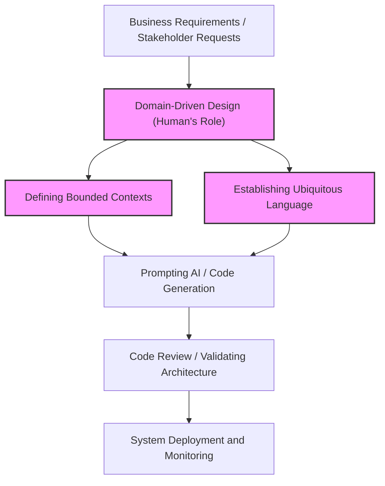
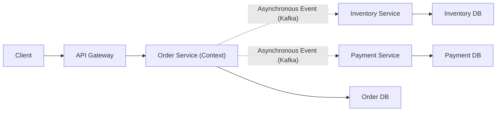
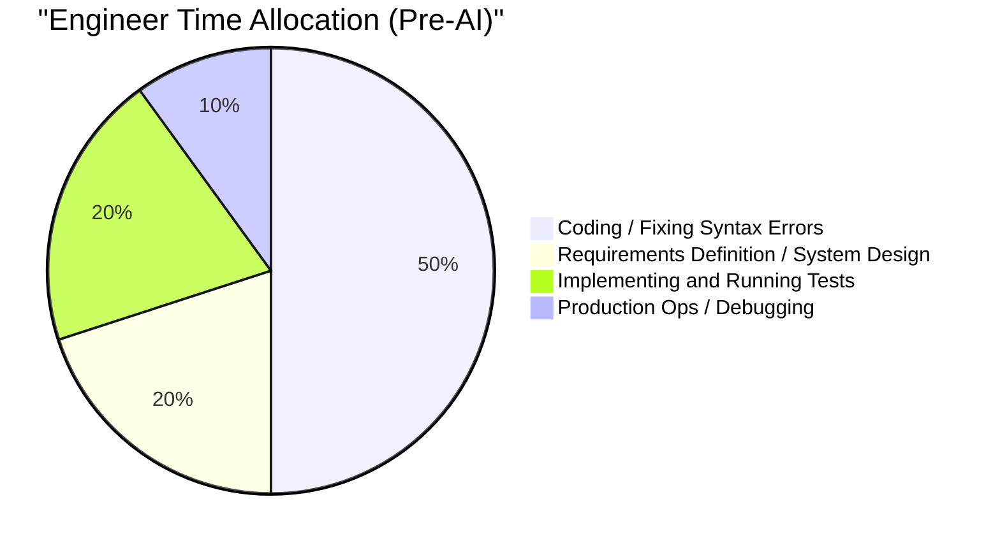
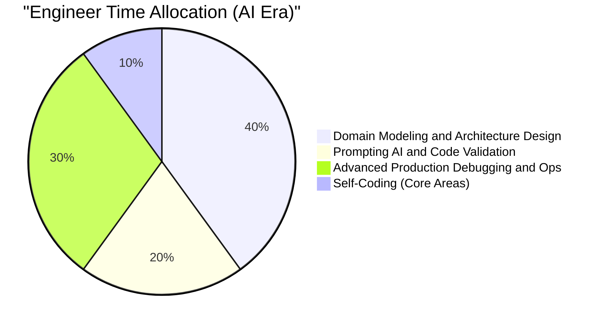

# The 'Human-Specific Engineering Skills' Required in the Era of AI Writing Code

In recent years, the landscape of software engineering has changed dramatically with the rapid evolution of Generative AI and Large Language Models (LLMs). GitHub Copilot and various AI coding assistants are now used on a daily basis, and the phenomenon where "AI instantly generates code if you give instructions in natural language" is no longer science fiction from the future, but today's reality.

In such an era, it is natural for many engineers to harbor anxiety that "my job might be taken away by AI." Indeed, "mere coding work (Typing Code)" such as creating boilerplate for routine CRUD applications, implementing simple algorithms, or calling APIs of well-known libraries is rapidly becoming commoditized.

However, the essence of software engineering is not about "typing code." It is about solving business challenges through technology and building scalable, maintainable systems. In this article, we will explore in profound and technical depth the "human-specific engineering skills" that become even more valuable in the era of AI writing code, looking at it from perspectives such as the technical limitations of LLMs, Domain-Driven Design (DDD), system architecture, and debugging distributed systems.

---

## 1. Understanding the Structural Limitations of Large Language Models (LLMs)

To properly evaluate AI's capabilities and discern the areas where humans should demonstrate value, we must first understand the structural limitations of AI (especially LLMs) from mathematical and architectural standpoints.

### 1.1 Limits of Computational Complexity and Context in the Transformer Architecture

The majority of current LLMs are based on the "Transformer" architecture introduced by Google in 2017. The core of the Transformer lies in its "Self-Attention Mechanism." The self-attention mechanism computes how closely each token in an input sequence is related to all other tokens.

This attention calculation formula is expressed as follows:

$$ \text{Attention}(Q, K, V) = \text{softmax}\left(\frac{QK^T}{\sqrt{d_k}}\right)V $$

Here, $Q$ (Query), $K$ (Key), and $V$ (Value) are linear transformations of the input sequence, and $d_k$ is the dimensionality of the keys.
The most critical constraint in this calculation is the computational complexity associated with the matrix multiplication $QK^T$. If the input sequence (number of tokens) is $N$, this computational complexity grows on the order of $O(N^2)$ both in terms of time and space (memory).

$$ \text{Complexity} = O(N^2 \cdot d) $$

In recent years, research on hardware-level optimizations like FlashAttention, Sparse Attention, and even alternative architectures capable of linear time $O(N)$ processing such as Mamba (State Space Models) has been advancing. Still, "perfectly comprehending an infinite context and generating globally optimized outputs" remains extremely difficult.

Furthermore, even if the context window can be physically expanded, a phenomenon called "Lost in the Middle" occurs. LLMs are highly susceptible to information at the beginning and end of a prompt, and tend to ignore important requirements and constraints placed in the middle. This is why, if you load the entire source code of a tens-of-thousands-of-lines enterprise system into an LLM and instruct it to "perform optimal refactoring", it generates code that is locally correct but globally broken.

### 1.2 Characteristics of Probabilistic Generative Models and "Hallucinations"

The true nature of an LLM is a "probabilistic generative model" that predicts the token with the highest probability of appearing next, based on the input context (prompt) and the generation results so far.

$$ P(w_t | w_{1:t-1}) = \text{softmax}(W \cdot h_t) $$

The model merely learns "statistical co-occurrence relationships of words" from vast amounts of training data, and does not understand the "Semantics" of the generated code or the "real-world implications of the execution results." This is what causes "hallucinations."
Bugs such as calling imaginary library functions that do not exist, or passing variables with subtly mismatched types, are simply the result of the LLM generating a "grammatically plausible (high probability) sequence of tokens."

### 1.3 Lack of Real-World Grounding

AI lacks the ability to intuitively understand "physical constraints" or "real business constraints" (Grounding). For instance, it cannot consider the business reality that "a 100ms delay in payment processing latency reduces the conversion rate by 5%", or environment-specific tacit knowledge like "transactions are prone to time out during this time period because batch processing runs on this legacy DB at 2:00 AM", unless explicitly provided as text.

Given these technical and structural limitations, we can see that while AI is an extremely excellent tool for "rapidly generating code within a clearly defined, narrow scope (functions, classes, modules)", the act of "designing a whole system from ambiguous requirements and aligning it with real-world constraints" remains a uniquely human domain.

---

## 2. Human-Specific Skill 1: Extracting "True Challenges" from Ambiguous Requirements

The greatest hurdle in software development is not writing the code itself.
Frederick Brooks, author of the software engineering classic "The Mythical Man-Month", stated:

> "The hardest single part of building a software system is deciding precisely what to build."

Non-technical stakeholders (management, sales departments, customers) are mostly unable to verbalize what they truly want. Every day, engineers receive extremely ambiguous and contradictory requests such as "I want you to make a system that increases sales using AI" or "I want a screen where everything is automated with just the push of a single button."

Even if you feed a prompt into an AI saying, "Write code for a system that increases sales", no usable system will come out. What is required of engineers is the following process:

1. **Deep diving into the domain**: Drawing out the "real business challenges" hidden behind the stakeholders' words through dialogue.
2. **Scoping requirements**: Weighing technical feasibility against cost (ROI) and deciding "what not to do."
3. **Formalizing specifications**: Translating ambiguous requirements into clear logical constraints (prompts or architecture blueprints) that AI can understand.

This "high-level human-to-human communication and negotiation" is a highly personalized and valuable skill that AI can never replace.

---

## 3. Human-Specific Skill 2: Domain-Driven Design (DDD) and Modeling

After eliciting requirements, the most powerful weapon for translating them into software structure is "Domain-Driven Design" (DDD). As AI increasingly generates local code automatically, the DDD concept of where to draw the "boundaries" of the overall system becomes vitally important.

### 3.1 Establishing a Ubiquitous Language

In system development, if the "meaning of words" differs between the business side and the development side, AI will generate code in the wrong context. For example, the word "user" might refer to a "lead (prospective customer)" for the marketing department, but to an "already-contracted account" for customer support.
Human engineers must establish a unified "Ubiquitous Language" across the entire project, and enforce this language all the way down to class names, method names in code, and prompts to the AI.

### 3.2 Designing Bounded Contexts

Attempting to represent a massive system with a single model will invariably fail. In DDD, a system is divided into meaningful boundaries (Bounded Contexts).
For example, in an e-commerce site, the concept of a "Product" has completely different attributes and behaviors it should possess in the catalog (display) context versus the inventory (management) context.

Only when a human architect draws the correct context boundaries and assigns implementations to AI with independent prompts and specifications for each context, can the AI generate "code based on correct domain knowledge."

The following diagram illustrates the DDD approach and the division of roles in the AI era.

Rather than instructing AI to "build the entire system", humans will delegate implementation to AI strictly within the "context boundaries" they have defined. This will become the fundamental paradigm of software development going forward.

---

## 4. Human-Specific Skill 3: Distributed System Architecture Design and Scaling

Modern software is evolving from monoliths running on a single server to cloud-native microservices architectures and event-driven architectures. Designing such distributed systems is a profoundly difficult area for AI, which can only perform localized logic optimization.

### 4.1 The CAP Theorem and Judging Trade-offs

When designing a distributed system, engineers constantly confront the "CAP Theorem." The CAP Theorem is the principle that a distributed system can only satisfy two out of the following three properties simultaneously:

- **Consistency**: Does every node see the same data at the same time?
- **Availability**: Does the system continue to respond even if some nodes fail?
- **Partition Tolerance**: Does the system continue to operate even if a network partition occurs?

$$ P(\text{Availability} \cup \text{Consistency}) | \text{PartitionTolerance} $$

Since partitions are unavoidable in real-world networks, engineers must make severe trade-off decisions directly tied to business requirements, such as "This payment system prioritizes Consistency, so we stop the service during a failure (CP)" or "This SNS timeline prioritizes Availability, so we tolerate temporary data inconsistency (AP)."

While AI can write "code that prioritizes C" or "code that prioritizes A", it cannot autonomously make the decision of "which should be prioritized," a decision that involves business risks.

### 4.2 Asynchronous Communication and Eventual Consistency

As systems scale up, inter-service coordination transitions from synchronous communication via REST APIs to asynchronous communication using message queues (such as Kafka or RabbitMQ). Here, data consistency shifts from immediate consistency to "Eventual Consistency."
At what point should advanced architectural patterns like the Saga pattern or CQRS (Command Query Responsibility Segregation) be introduced? Making these complex decisions and drawing the blueprint for the entire system is exactly where the true worth of a senior engineer shines.

---

## 5. Human-Specific Skill 4: Debugging and Troubleshooting Complex Systems

The more AI-generated code there is, the higher the risk that "code nobody fully understands" runs in the production environment. While it may run smoothly in normal times, the true value of human engineers is tested during troubleshooting when an outage occurs.

### 5.1 Designing Observability

To rapidly resolve system outages, simply pasting error logs into an AI is insufficient. In a microservices environment, a single request traverses dozens of services.
Engineers must appropriately build the "three pillars of observability"—Logs, Metrics, and Traces—into the system. It is a human's role to utilize tools like OpenTelemetry to build a foundation that can pinpoint "which database query in which service is experiencing latency" through distributed tracing.

### 5.2 Environment-Dependent Bugs and Chaos Engineering

"Bugs that don't reproduce in local or test environments, but only occur during peak times in the production environment"—for instance, memory leaks, database deadlocks, connection pool exhaustion, or network packet loss—can never be found simply by static analysis of the source code.

Human engineers form hypotheses while glaring at production environment metrics, analyze thread dumps and heap dumps, and identify bottlenecks. AI cannot tap away at a terminal to directly profile a production server process (nor should it be permitted to do so, as a security requirement).
As systems become more complex, the value of engineers possessing "low-level knowledge" of physical infrastructure, network protocols, and OS kernel tuning, along with "intuitive hypothesis-driven reasoning skills", will skyrocket.

---

## 6. The Value Function and Time Allocation of Engineers in the AI Era

As discussed thus far, the skill set required of engineers in the AI era is undergoing a massive paradigm shift. If we model this mathematically, the value created by an engineer ($V$) could be expressed as follows:

$$ V = \left( \sum_{i=1}^{n} \text{DomainKnowledge}_i + \text{ArchitectureSkill} + \text{ProblemSolving} \right) \times \text{AI\_Leverage}^{\alpha} $$

Traditional "coding speed" and "syntax memory" have been eliminated from this formula. Instead, it is structured to generate exponential value by multiplying the "sum" of deep domain knowledge, architecture design skills, and complex problem-solving abilities by the leverage of mastering AI ($\text{AI\_Leverage}^{\alpha}$).

This paradigm shift will also be clearly evident in how engineers use their time on a daily basis (time allocation).

In the AI era, engineers will be elevated from "code typists" to "conductors orchestrating the entire system." Precisely because AI will write massive amounts of code, the role of "reviewer" and "architect"—who monitors and governs whether the code is pointing in the right direction, satisfies security requirements, and aligns with the overall system architecture—will be demanded of all engineers, from junior to senior levels.

---

## 7. Conclusion: Don't Resist Evolution, Ride the Wave

The "era of AI writing code" is not a threat to engineers, but the greatest opportunity in history. Just as the transition from assembly language to C occurred in the past, and just as the evolution from manual memory pointer management to Java's garbage collection took place, code generation by AI is simply "moving up one level of abstraction."

Engineers of the future will not be swayed by the trivial specifications of a particular programming language or framework upgrades, but will be able to concentrate their resources on more essential, higher-order human problem solving, such as: **"What is the business challenge?", "How should data be partitioned and integrated?", and "How do we rapidly recover when the system goes down?"**

A true engineer is not someone who writes code, but someone who solves problems.
Domain modeling, scalable architecture design, communication with stakeholders, and debugging complex systems. For those who continue to polish these "human-specific engineering skills," AI will not be an enemy that takes away jobs, but the ultimate partner that expands their own creativity and productivity tens of times over.
