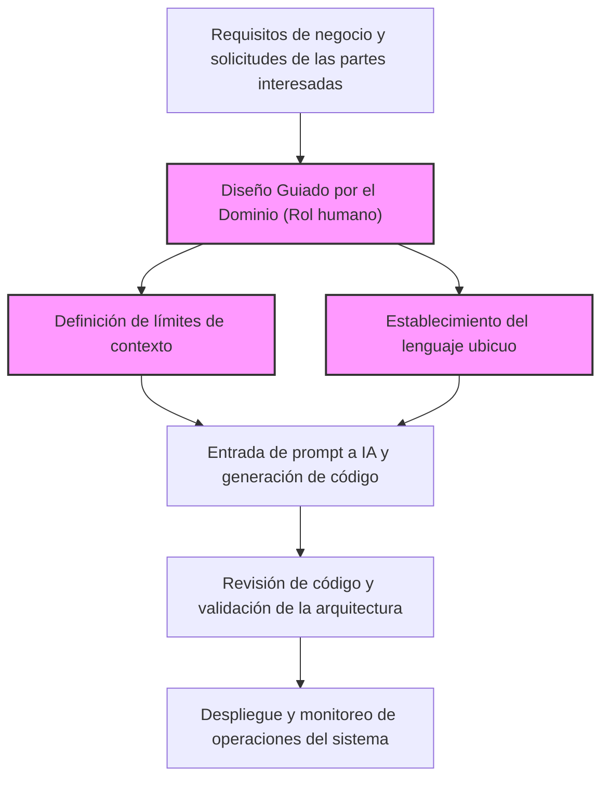
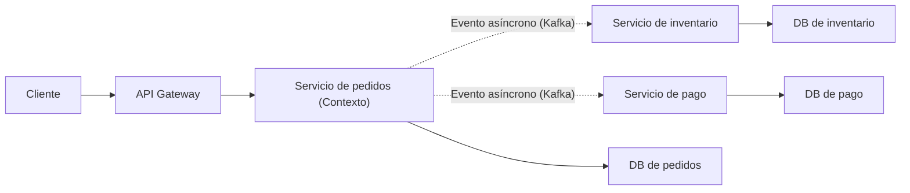
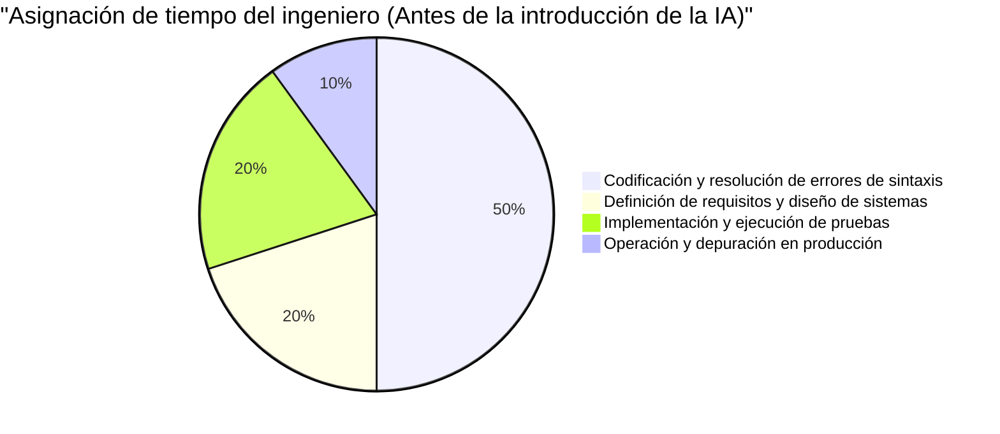
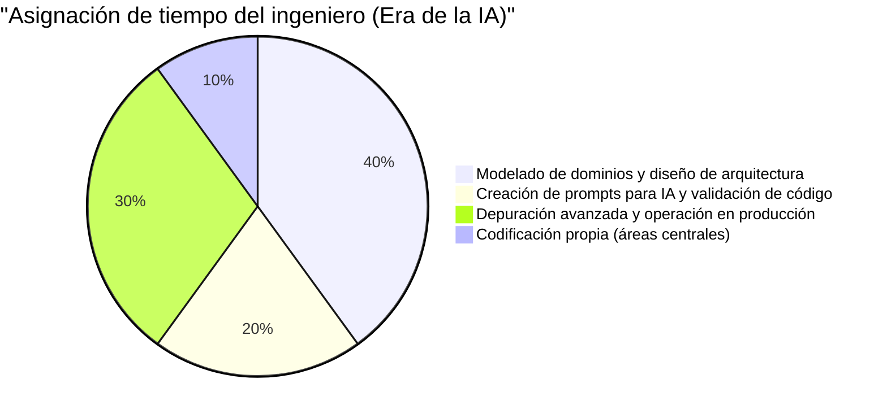

# Habilidades de ingeniería 'exclusivas de los humanos' requeridas en la era en que la IA escribe código

En los últimos años, la rápida evolución de la IA Generativa y los Grandes Modelos de Lenguaje (LLM) ha cambiado drásticamente el panorama de la ingeniería de software. GitHub Copilot y varios asistentes de codificación de IA se utilizan a diario, y el fenómeno de "dar instrucciones en lenguaje natural y hacer que la IA genere código al instante" ya no es ciencia ficción del futuro, sino una realidad de hoy.

En esta era, es natural que muchos ingenieros alojen la preocupación de que "sus trabajos puedan ser arrebatados por la IA". De hecho, la "simple tarea de codificar (Typing Code)" - como crear el código repetitivo para aplicaciones CRUD típicas, implementar algoritmos simples o llamar a APIs de bibliotecas conocidas - se está comoditizando rápidamente.

Sin embargo, la esencia de la ingeniería de software no es "teclear código". Es resolver problemas de negocio a través de la tecnología y construir sistemas escalables y mantenibles. En este artículo, exploraremos profundamente y desde un punto de vista técnico las "habilidades de ingeniería exclusivas de los humanos" cuyo valor aumenta precisamente en la era en que la IA escribe código, desde la perspectiva de las limitaciones técnicas de los LLM, el Diseño Guiado por el Dominio (DDD), la arquitectura de sistemas y la depuración de sistemas distribuidos.

---

## 1. Comprender las limitaciones estructurales de los Grandes Modelos de Lenguaje (LLM)

Para evaluar correctamente las capacidades de la IA y determinar en qué áreas los humanos deben aportar valor, primero debemos comprender las limitaciones estructurales de la IA (especialmente los LLM) desde un punto de vista matemático y arquitectónico.

### 1.1 Complejidad computacional y límites de contexto en la arquitectura Transformer

La gran mayoría de los LLM actuales se basan en la arquitectura "Transformer" anunciada por Google en 2017. El núcleo del Transformer radica en el "Mecanismo de Autoatención (Self-Attention Mechanism)". El mecanismo de autoatención calcula qué tan relacionado está cada token en la secuencia de entrada con todos los demás tokens.

La fórmula para calcular esta atención se expresa de la siguiente manera:

$$ \text{Attention}(Q, K, V) = \text{softmax}\left(\frac{QK^T}{\sqrt{d_k}}\right)V $$

Aquí, $Q$ (Consulta), $K$ (Clave) y $V$ (Valor) son transformaciones lineales de la secuencia de entrada, y $d_k$ es la dimensión de la clave.
La limitación más significativa en este cálculo es el costo computacional asociado con la multiplicación de matrices $QK^T$. Si $N$ es la secuencia de entrada (número de tokens), esta complejidad computacional aumenta en el orden de $O(N^2)$ tanto temporal como espacialmente (memoria).

$$ \text{Complexity} = O(N^2 \cdot d) $$

En años recientes, aunque avanzan investigaciones en optimizaciones a nivel de hardware como FlashAttention, Sparse Attention e incluso arquitecturas alternativas capaces de procesar en tiempo lineal $O(N)$ como Mamba (State Space Models), sigue siendo extremadamente difícil "comprender perfectamente un contexto infinito y generar una salida optimizada globalmente".

Además, incluso si la ventana de contexto pudiera expandirse físicamente, ocurre un fenómeno conocido como "Lost in the Middle" (Pérdida en el medio). Los LLM están fuertemente influenciados por la información al principio y al final del prompt, y tienden a ignorar requisitos importantes o restricciones ubicadas en el medio. Esta es la razón por la que, si le pides a un LLM que lea todo el código fuente de un sistema empresarial de decenas de miles de líneas y le indicas "realiza la refactorización óptima", se generará un código que es localmente correcto pero que falla como un todo.

### 1.2 Características de los modelos generativos probabilísticos y "Alucinaciones"

La esencia de un LLM es ser un "modelo generativo probabilístico" que predice el token con la mayor probabilidad de aparecer a continuación, basado en el contexto de entrada (prompt) y los resultados generados previamente.

$$ P(w_t | w_{1:t-1}) = \text{softmax}(W \cdot h_t) $$

El modelo simplemente está aprendiendo la "co-ocurrencia estadística de las palabras" a partir de cantidades masivas de datos de entrenamiento, y no entiende la "Semántica" (Semantics) del código generado ni "el impacto en el mundo real de los resultados de ejecución". Esto es lo que causa las "alucinaciones" (Hallucinations).
Los errores como llamar a funciones de bibliotecas ficticias que no existen o pasar variables que no coinciden sutilmente en tipo, son simplemente el resultado de que el LLM genera "una secuencia de tokens que parece gramaticalmente correcta (tiene alta probabilidad)".

### 1.3 Falta de anclaje en el mundo real (Grounding)

La IA carece de la capacidad (Grounding) de entender intuitivamente "restricciones físicas" o "restricciones de negocios reales". Por ejemplo, no puede considerar realidades de negocio como "si la latencia del procesamiento de pago se retrasa 100ms, la tasa de conversión cae un 5%", o conocimientos tácitos específicos del entorno como "esta base de datos heredada ejecuta procesamiento por lotes a las 2 a.m., por lo que las transacciones en ese momento son propensas a tiempos de espera", a menos que se le proporcione explícitamente como texto.

Teniendo en cuenta estas limitaciones técnicas y estructurales, es evidente que la IA es una herramienta extremadamente excelente para "generar código rápidamente para ámbitos estrechos y claramente definidos (funciones, clases, módulos)", pero "diseñar todo un sistema a partir de requisitos ambiguos y alinearlo con las restricciones del mundo real" es un dominio exclusivo de los humanos.

---

## 2. Habilidad humana ①: Extraer los "verdaderos problemas" a partir de requisitos ambiguos

El mayor obstáculo en el desarrollo de software no es escribir el código en sí.
Frederick Brooks, autor del clásico de la ingeniería de software "El Mítico Hombre-Mes", afirma lo siguiente:

> "The hardest single part of building a software system is deciding precisely what to build."
> (La parte individual más difícil de construir un sistema de software es decidir con precisión qué construir.)

En la mayoría de los casos, los actores no técnicos (dirección, ventas, clientes) no pueden articular verbalmente lo que realmente quieren. Peticiones extremadamente ambiguas y contradictorias como "Quiero que construyan un sistema que aumente las ventas usando IA" o "Quiero una pantalla donde todo se automatice con solo presionar un botón" ocurren a diario.

Incluso si introduces en un prompt de IA "Escribe el código para un sistema que aumente las ventas", no saldrá un sistema útil. Lo que se requiere de un ingeniero es el siguiente proceso:

1. **Profundización en el dominio**: Extraer el "verdadero problema de negocio" detrás de las palabras de las partes interesadas a través del diálogo.
2. **Definición del alcance de los requisitos**: Sopesar la viabilidad técnica frente al costo (ROI) y decidir "qué no hacer".
3. **Formalización de especificaciones**: Convertir solicitudes ambiguas en restricciones lógicas claras (prompts o diagramas de arquitectura) que la IA pueda entender.

Esta "comunicación y negociación avanzada de humano a humano" es una habilidad valiosa e inherente a las personas que la IA nunca podrá reemplazar.

---

## 3. Habilidad humana ②: Diseño Guiado por el Dominio (DDD) y modelado

Una vez extraídos los requisitos, el arma más poderosa para traducirlos a la estructura del software es el "Diseño Guiado por el Dominio (Domain-Driven Design: DDD)". A medida que la IA genera automáticamente más código localizado, el concepto de DDD de dónde trazar los "límites" de todo el sistema se vuelve extremadamente importante.

### 3.1 Establecimiento del Lenguaje Ubicuo (Ubiquitous Language)

En el desarrollo de sistemas, si el "significado de las palabras" difiere entre el lado del negocio y el lado del desarrollo, la IA generará código en el contexto equivocado. Por ejemplo, la palabra "usuario" podría referirse a un "cliente potencial (lead)" para el departamento de marketing, mientras que para atención al cliente podría referirse a una "cuenta contratada".
Los ingenieros humanos deben establecer un "lenguaje ubicuo" unificado en todo el proyecto e imponer ese lenguaje en los nombres de clases del código, nombres de métodos, e incluso en los prompts para la IA.

### 3.2 Diseño del Contexto Delimitado (Bounded Context)

Intentar representar un sistema gigantesco con un solo modelo inevitablemente fracasará. En DDD, un sistema se divide en límites significativos (Bounded Context).
Por ejemplo, en un sitio de comercio electrónico, el concepto de "Producto (Product)" tiene atributos y comportamientos completamente diferentes en el contexto del catálogo (visualización) frente al contexto del inventario (gestión).

Solo cuando un arquitecto humano traza los límites de contexto correctos y proporciona a la IA prompts y especificaciones independientes para cada contexto, la IA puede generar "código basado en el conocimiento de dominio correcto".

La siguiente figura muestra el enfoque y la división de roles en DDD en la era de la IA.

En lugar de instruir a la IA para que "construya todo el sistema", se delega la implementación a la IA estrictamente dentro de los "límites de contexto" definidos por humanos. Este será el paradigma fundamental para el desarrollo de software en el futuro.

---

## 4. Habilidad humana ③: Diseño de arquitectura de sistemas distribuidos y escalamiento

El software moderno ha evolucionado desde monolitos que se ejecutan en un solo servidor hasta arquitecturas de microservicios nativas de la nube y arquitecturas orientadas a eventos. Diseñar tales sistemas distribuidos es un dominio muy difícil para la IA, que solo puede optimizar lógica localizada.

### 4.1 Teorema CAP y juicio de compensaciones (trade-offs)

Al diseñar sistemas distribuidos, los ingenieros siempre enfrentan el "Teorema CAP". El teorema CAP es el principio de que un sistema distribuido solo puede satisfacer simultáneamente dos de las tres propiedades siguientes:

- **Consistency (Consistencia)**: ¿Se ven los mismos datos al mismo tiempo en todos los nodos?
- **Availability (Disponibilidad)**: ¿Sigue respondiendo el sistema incluso si fallan algunos de los nodos?
- **Partition Tolerance (Tolerancia a particiones)**: ¿Continúa funcionando el sistema incluso si ocurre una división en la red?

$$ P(\text{Availability} \cup \text{Consistency}) | \text{PartitionTolerance} $$

Dado que las particiones (Partition) de red son inevitables en redes reales, los ingenieros deben tomar decisiones de compensación severas que están directamente vinculadas a los requisitos del negocio, como "Este sistema de pago prioriza la Consistencia y en caso de fallo detiene el servicio (CP)" o "La línea de tiempo de esta red social prioriza la Disponibilidad y tolera inconsistencias temporales en los datos (AP)".

La IA puede escribir "código que prioriza C" o "código que prioriza A", pero no puede tomar de manera autónoma la decisión de "cuál priorizar" que incluye el riesgo empresarial.

### 4.2 Comunicación asíncrona y Consistencia Eventual (Eventual Consistency)

A medida que los sistemas crecen, la coordinación entre servicios pasa de la comunicación síncrona a través de REST API a la comunicación asíncrona utilizando colas de mensajes (Kafka, RabbitMQ, etc.). La consistencia de datos aquí cambia de consistencia inmediata a "consistencia eventual (Eventual Consistency)".
¿En qué momento se deben introducir patrones arquitectónicos avanzados como el patrón Saga o CQRS (Command Query Responsibility Segregation)? Tomar estas decisiones complejas y dibujar el plano arquitectónico general del sistema es la verdadera esencia de un ingeniero senior.

---

## 5. Habilidad humana ④: Depuración y resolución de problemas de sistemas complejos

A medida que aumenta el código generado por IA, también lo hace el riesgo de que se ejecute en el entorno de producción "código que nadie entiende completamente". Incluso si funciona sin problemas en tiempos normales, el verdadero valor de los ingenieros humanos se pone a prueba al solucionar problemas durante un incidente.

### 5.1 Diseño de Observabilidad (Observability)

Para resolver incidentes de sistemas rápidamente, no es suficiente simplemente pegar registros de errores en la IA. En un entorno de microservicios, una sola solicitud atraviesa decenas de servicios.
Los ingenieros deben incorporar adecuadamente los "tres pilares de la observabilidad" - registros (Logs), métricas (Metrics) y trazas (Traces) - en el sistema. Utilizar herramientas como OpenTelemetry para crear una base donde se pueda identificar "qué consulta de base de datos en qué servicio está causando latencia" a través del rastreo distribuido es un rol para humanos.

### 5.2 Errores dependientes del entorno e Ingeniería del Caos

"Un error que no se reproduce en los entornos locales o de prueba, pero solo ocurre durante las horas pico en el entorno de producción" — por ejemplo, fugas de memoria, interbloqueos de bases de datos, agotamiento de grupos de conexiones o pérdida de paquetes de red — son problemas que nunca se encontrarán solo mediante análisis estático del código fuente.

Los ingenieros humanos formulan hipótesis observando de cerca las métricas de producción, analizan los volcados de subprocesos y de memoria, e identifican los cuellos de botella. La IA no puede golpear la terminal para perfilar directamente los procesos del servidor de producción (ni se le debería permitir como requisito de seguridad).
A medida que los sistemas se vuelven más complejos, el valor de los ingenieros que poseen "conocimiento de bajo nivel" — como infraestructura física, protocolos de red y ajuste del kernel del sistema operativo — así como "capacidad intuitiva de razonamiento deductivo", se dispara rápidamente.

---

## 6. La función de valor y la asignación de tiempo del ingeniero en la era de la IA

Como se discutió hasta ahora, las habilidades requeridas para un ingeniero en la era de la IA están experimentando un cambio de paradigma masivo. Si modelamos esto con una fórmula matemática, el valor creado por un ingeniero ($V$) se puede expresar de la siguiente manera:

$$ V = \left( \sum_{i=1}^{n} \text{DomainKnowledge}_i + \text{ArchitectureSkill} + \text{ProblemSolving} \right) \times \text{AI\_Leverage}^{\alpha} $$

La "velocidad de codificación" tradicional o "la memorización de sintaxis" están excluidas de esta ecuación. En su lugar, el apalancamiento de dominar la IA ($\text{AI\_Leverage}^{\alpha}$) se multiplica por la "suma" de conocimiento profundo del dominio, capacidad de diseño de arquitectura y capacidad de resolución de problemas complejos, creando una estructura que genera un valor exponencial.

Este cambio de paradigma también es claramente evidente en cómo los ingenieros asignan su tiempo diario.

En la era de la IA, los ingenieros ascienden de ser "mecanógrafos de código" a "directores de orquesta que coordinan todo el sistema". Precisamente porque la IA escribe cantidades masivas de código, el rol de "revisor" y "arquitecto" — que monitorea y gobierna si ese código apunta en la dirección correcta, cumple con los requisitos de seguridad y se alinea con la arquitectura general del sistema — será requerido de todos los ingenieros, desde el nivel junior hasta el senior.

---

## 7. Conclusión: No rechaces la evolución, surfea la ola

La "era en que la IA escribe código" no es una amenaza para los ingenieros, sino la mayor oportunidad de la historia. Al igual que ocurrió la transición del lenguaje ensamblador a C, o la evolución de la gestión de punteros de memoria a la recolección de basura de Java, la generación de código por IA es simplemente "una subida en el nivel de abstracción".

Los ingenieros del futuro ya no se preocuparán por cada detalle en las especificaciones de un lenguaje de programación específico o actualizaciones de marcos de trabajo, sino que podrán concentrar sus recursos en resoluciones de problemas de orden superior, más esenciales y más humanos: **"¿Cuáles son los problemas del negocio?", "¿Cómo se deben dividir e integrar los datos?" y "¿Cómo nos recuperamos rápidamente si el sistema se detiene?"**.

Un verdadero ingeniero no es alguien que escribe código, sino alguien que resuelve problemas.
Para aquellos que continúan refinando estas "habilidades de ingeniería exclusivas de los humanos" — modelado de dominios, diseño de arquitecturas escalables, comunicación con las partes interesadas y depuración de sistemas complejos — la IA no será un enemigo que roba trabajos, sino el socio más fuerte que expandirá exponencialmente su propia creatividad y productividad.
