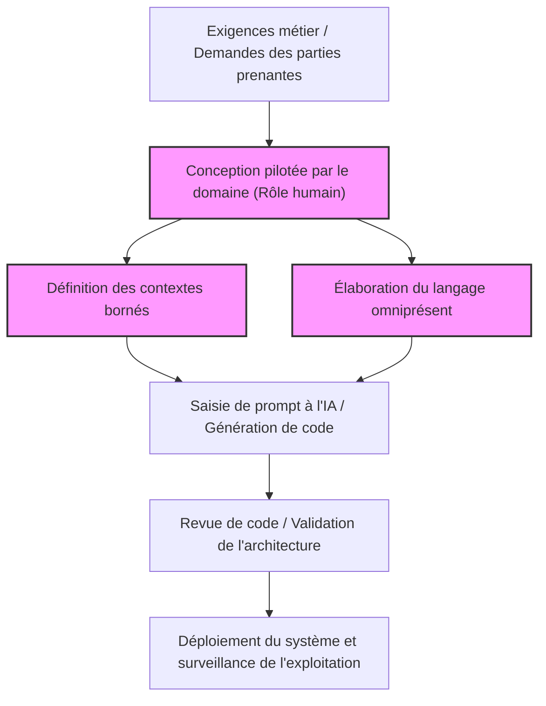
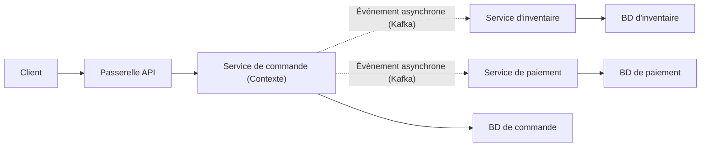
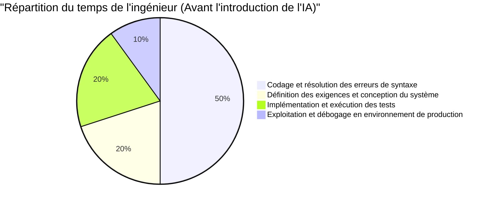
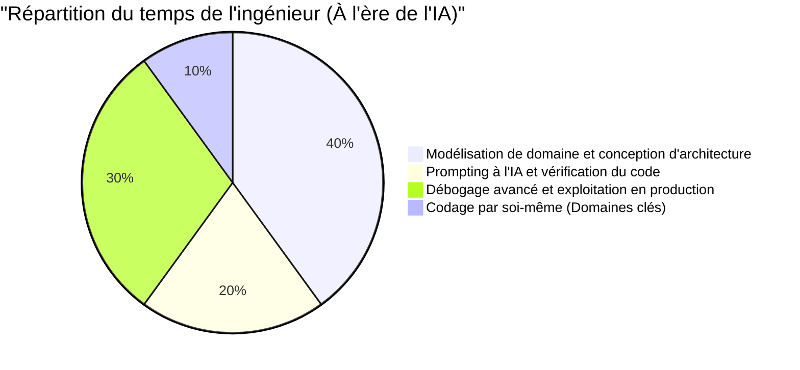

# Les "compétences d'ingénieur spécifiques aux humains" requises à l'ère de la programmation par l'IA

Ces dernières années, avec l'évolution fulgurante de l'IA générative (Generative AI) et des grands modèles de langage (LLM), le paysage de l'ingénierie logicielle a radicalement changé. GitHub Copilot et divers assistants de codage IA sont désormais utilisés au quotidien, et le phénomène selon lequel "l'IA génère instantanément du code si on lui donne des instructions en langage naturel" n'est plus de la science-fiction, mais la réalité d'aujourd'hui.

À une telle époque, il est naturel pour de nombreux ingénieurs de s'inquiéter que "leur travail soit volé par l'IA". Il est vrai que le "simple travail de codage (Typing Code)", comme la création de code boilerplate pour des applications CRUD typiques, l'implémentation d'algorithmes simples, ou l'appel d'API de bibliothèques bien connues, se transforme rapidement en commodité.

Cependant, l'essence de l'ingénierie logicielle n'est pas de "taper du code". Elle consiste à résoudre des problèmes métier grâce à la technologie et à construire des systèmes évolutifs et maintenables. Dans cet article, nous explorerons de manière extrêmement détaillée et technique les "compétences d'ingénieur spécifiques aux humains" dont la valeur augmente précisément à l'ère où l'IA écrit du code, du point de vue des limites techniques des LLM, de la conception pilotée par le domaine (DDD), de l'architecture système et du débogage de systèmes distribués.

---

## 1. Comprendre les limites structurelles des grands modèles de langage (LLM)

Pour évaluer correctement les capacités de l'IA et déterminer dans quels domaines les humains devraient apporter de la valeur, il faut d'abord comprendre les limites structurelles de l'IA (en particulier des LLM) d'un point de vue mathématique et architectural.

### 1.1 Limites de complexité de calcul et de contexte dans l'architecture Transformer

La plupart des LLM actuels sont basés sur l'architecture "Transformer" annoncée par Google en 2017. Le cœur du Transformer réside dans le "mécanisme d'auto-attention (Self-Attention Mechanism)". Ce mécanisme calcule dans quelle mesure chaque jeton (token) d'une séquence d'entrée est lié à tous les autres jetons.

La formule de calcul de cette attention est exprimée comme suit :

$$ \text{Attention}(Q, K, V) = \text{softmax}\left(\frac{QK^T}{\sqrt{d_k}}\right)V $$

Ici, $Q$ (Query), $K$ (Key), $V$ (Value) sont des transformations linéaires de la séquence d'entrée, et $d_k$ est la dimension des clés.
La contrainte la plus importante dans ce calcul est la complexité de calcul associée à la multiplication matricielle $QK^T$. Si la séquence d'entrée (nombre de jetons) est $N$, cette complexité augmente dans l'ordre de $O(N^2)$ tant sur le plan temporel que spatial (mémoire).

$$ \text{Complexity} = O(N^2 \cdot d) $$

Récemment, des recherches ont progressé sur des optimisations au niveau matériel telles que FlashAttention, ainsi que sur Sparse Attention et des architectures alternatives capables de traiter en temps linéaire $O(N)$ comme Mamba (State Space Models). Néanmoins, "comprendre parfaitement un contexte infini et générer une sortie globalement optimisée" reste extrêmement difficile.

De plus, même si la fenêtre de contexte pouvait être physiquement agrandie, un phénomène appelé "Lost in the Middle (perte d'informations au milieu)" se produit. Les LLM sont fortement influencés par les informations au début et à la fin du prompt, et ont tendance à ignorer les exigences et contraintes importantes placées au milieu. C'est pourquoi, même si vous demandez à un LLM de lire l'intégralité du code source d'un système d'entreprise de plusieurs dizaines de milliers de lignes et de "faire un refactoring optimal", le code généré sera correct localement, mais s'effondrera dans son ensemble.

### 1.2 Caractéristiques des modèles génératifs probabilistes et "Hallucinations"

L'essence d'un LLM est un "modèle génératif probabiliste" qui prédit le jeton avec la plus grande probabilité d'apparaître ensuite, en fonction du contexte entré (prompt) et des résultats générés jusqu'à présent.

$$ P(w_t | w_{1:t-1}) = \text{softmax}(W \cdot h_t) $$

Le modèle n'a appris que les "relations de cooccurrence statistiques des mots" à partir d'une quantité massive de données d'entraînement, et ne comprend pas le "sens (Semantics)" ou "l'impact des résultats d'exécution dans le monde réel" du code généré. C'est ce qui provoque des "hallucinations".
Les bugs tels que l'appel d'une fonction de bibliothèque inexistante ou la transmission de variables dont les types ne correspondent pas tout à fait, ne sont que le résultat d'un LLM générant une "séquence de jetons grammaticalement plausible (avec une forte probabilité)".

### 1.3 Absence d'ancrage dans le monde réel (Grounding)

L'IA n'a pas la capacité de comprendre intuitivement les "contraintes physiques" ou les "contraintes métier réelles" (Grounding). Par exemple, la réalité métier selon laquelle "si la latence du processus de paiement est retardée de 100 ms, le taux de conversion chute de 5 %", ou les connaissances tacites spécifiques à l'environnement telles que "cette base de données existante exécute un traitement par lots à 2 heures du matin, de sorte que les transactions à cette heure-là ont tendance à expirer", ne peuvent être prises en compte à moins d'être explicitement fournies sous forme de texte.

Compte tenu de ces limites techniques et structurelles, il est clair que l'IA est un outil extrêmement excellent pour "générer rapidement du code pour un périmètre restreint et clairement défini (fonctions, classes, modules)", mais que "concevoir un système entier à partir d'exigences ambiguës et l'aligner sur les contraintes du monde réel" est un domaine que seuls les humains peuvent accomplir.

---

## 2. Compétence humaine n°1 : Extraction du "vrai problème" à partir d'exigences ambiguës

Le plus grand défi dans le développement de logiciels n'est pas d'écrire le code lui-même.
Frederick Brooks, l'auteur du classique de l'ingénierie logicielle "Le Mythe du mois-homme", déclare :

> "The hardest single part of building a software system is deciding precisely what to build."
> (La partie la plus difficile dans la construction d'un système logiciel est de décider précisément quoi construire.)

Les parties prenantes non techniques (direction, département des ventes, clients) sont la plupart du temps incapables de verbaliser ce qu'elles veulent vraiment. Des demandes extrêmement ambiguës et contradictoires telles que "je veux que vous créiez un système utilisant l'IA pour augmenter les ventes" ou "je veux un écran où tout est automatisé en appuyant sur un seul bouton" fusent quotidiennement.

Même si vous entrez un prompt à l'IA lui demandant d' "écrire le code d'un système qui augmente les ventes", aucun système utilisable n'en ressortira. Ce qui est attendu d'un ingénieur, c'est le processus suivant :

1. **Exploration approfondie du domaine** : Extraire par le dialogue le "vrai problème métier" qui se cache derrière les mots des parties prenantes.
2. **Définition du périmètre des exigences** : Peser la faisabilité technique et le coût (ROI), et décider de "ce qu'il ne faut pas faire".
3. **Formalisation des spécifications** : Convertir les exigences ambiguës en contraintes logiques claires (prompts ou diagrammes d'architecture) que l'IA peut comprendre.

Cette "communication et négociation de haut niveau d'humain à humain" est une compétence inhérente et très précieuse que l'IA ne pourra jamais remplacer.

---

## 3. Compétence humaine n°2 : Conception pilotée par le domaine (DDD) et Modélisation

Une fois les exigences extraites, l'arme la plus puissante pour les intégrer dans la structure du logiciel est la "Conception pilotée par le domaine (Domain-Driven Design : DDD)". Plus l'IA générera automatiquement du code local, plus le concept de DDD, qui consiste à décider où tracer les "frontières" de l'ensemble du système, deviendra crucial.

### 3.1 Élaboration d'un langage omniprésent (Ubiquitous Language)

Dans le développement de systèmes, si le "sens des mots" diffère entre le côté métier et le côté développement, l'IA générera du code dans le mauvais contexte. Par exemple, le mot "utilisateur" peut faire référence à un "prospect (lead)" pour le service marketing, et à un "compte sous contrat" pour le support client.
Les ingénieurs humains doivent élaborer un "langage omniprésent" unifié à l'échelle du projet et s'assurer que ce langage est appliqué partout, des noms de classes et de méthodes dans le code jusqu'aux prompts destinés à l'IA.

### 3.2 Conception des contextes bornés (Bounded Context)

Essayer de représenter un système énorme avec un seul modèle est voué à l'échec. En DDD, le système est divisé en frontières significatives (Bounded Context).
Par exemple, sur un site e-commerce, le concept de "Produit (Product)" a des attributs et des comportements complètement différents dans le contexte du catalogue (affichage) et dans le contexte de l'inventaire (gestion).

Ce n'est que lorsque l'architecte humain trace les limites de contexte appropriées et fournit à l'IA des prompts et des spécifications indépendantes pour chaque contexte, que l'IA peut générer du "code basé sur une connaissance de domaine correcte".

Le schéma ci-dessous montre l'approche DDD et la répartition des rôles à l'ère de l'IA.

Au lieu d'ordonner à l'IA de "créer le système entier", déléguer l'implémentation à l'IA en la limitant à l'intérieur des "contextes bornés" définis par des humains. Ceci deviendra le paradigme fondamental du développement logiciel à l'avenir.

---

## 4. Compétence humaine n°3 : Conception de l'architecture des systèmes distribués et mise à l'échelle

Les logiciels modernes ont évolué de monolithes fonctionnant sur un seul serveur à des architectures de microservices cloud natives et des architectures pilotées par les événements. La conception de tels systèmes distribués est un domaine très difficile pour l'IA, qui ne peut optimiser que la logique locale.

### 4.1 Théorème CAP et décisions de compromis

Lors de la conception de systèmes distribués, les ingénieurs sont constamment confrontés au "théorème CAP". Le théorème CAP est un principe stipulant qu'un système distribué ne peut satisfaire simultanément que deux des trois propriétés suivantes :

- **Consistency (Cohérence)** : Tous les nœuds voient-ils les mêmes données au même moment ?
- **Availability (Disponibilité)** : Le système continue-t-il de répondre même si certains nœuds tombent en panne ?
- **Partition Tolerance (Tolérance au partitionnement)** : Le système continue-t-il de fonctionner même s'il y a une rupture du réseau ?

$$ P(\text{Availability} \cup \text{Consistency}) | \text{PartitionTolerance} $$

Dans les réseaux réels, le partitionnement (Partition) est inévitable, de sorte que les ingénieurs doivent prendre des décisions de compromis strictes directement liées aux exigences métier, telles que "Ce système de paiement donne la priorité à la cohérence et arrêtera le service en cas de panne (CP)" ou "La timeline de ce réseau social donne la priorité à la disponibilité et tolère des incohérences de données temporaires (AP)".

L'IA peut écrire "du code qui privilégie C" ou "du code qui privilégie A", mais elle ne peut pas prendre de manière autonome la décision de "lequel privilégier", décision qui implique des risques métier.

### 4.2 Communication asynchrone et cohérence à terme (Eventual Consistency)

À mesure que les systèmes se développent, la communication entre les services passe d'une communication synchrone via des API REST à une communication asynchrone à l'aide de files d'attente de messages (Kafka, RabbitMQ, etc.). Ici, la cohérence des données passe d'une cohérence immédiate à une "cohérence à terme (Eventual Consistency)".
À quel moment faut-il introduire des modèles d'architecture avancés tels que le modèle Saga ou CQRS (Command Query Responsibility Segregation) ? Prendre ces décisions complexes et dessiner le plan directeur de l'ensemble du système est précisément la véritable valeur d'un ingénieur senior.

---

## 5. Compétence humaine n°4 : Débogage de systèmes complexes et dépannage

Plus il y a de code généré par l'IA, plus le risque que "du code que personne ne comprend entièrement" s'exécute en environnement de production augmente. Même si tout fonctionne sans problème en temps normal, c'est lors du dépannage en cas de panne que la véritable valeur d'un ingénieur humain est mise à l'épreuve.

### 5.1 Conception de l'observabilité (Observability)

Pour résoudre rapidement les pannes du système, il ne suffit pas de coller des journaux d'erreurs (logs) dans une IA. Dans un environnement de microservices, une seule requête traverse des dizaines de services.
Les ingénieurs doivent intégrer de manière appropriée les "trois piliers de l'observabilité" que sont les journaux (Logs), les métriques (Metrics) et les traces (Traces) dans le système. C'est le rôle des humains de créer une infrastructure capable d'identifier "dans quelle requête de base de données de quel service la latence se produit", en utilisant le traçage distribué grâce à des outils comme OpenTelemetry.

### 5.2 Bugs dépendants de l'environnement et ingénierie du chaos (Chaos Engineering)

"Des bugs qui ne se reproduisent pas dans les environnements locaux ou de test, mais qui ne surviennent que pendant les heures de pointe dans l'environnement de production" - par exemple, des fuites de mémoire, des blocages de base de données (deadlocks), l'épuisement du pool de connexions ou la perte de paquets réseau, sont des problèmes qui ne peuvent jamais être trouvés par la seule analyse statique du code source.

Les ingénieurs humains formulent des hypothèses en scrutant les métriques de l'environnement de production, analysent les thread dumps et les heap dumps, et identifient les goulots d'étranglement. L'IA ne peut pas taper dans un terminal pour profiler directement les processus sur un serveur de production (et cela ne devrait pas être autorisé, même pour des raisons de sécurité).
Plus les systèmes deviennent complexes, plus la valeur des ingénieurs possédant des "connaissances de bas niveau" - telles que l'infrastructure physique, les protocoles réseau et le réglage du noyau (kernel tuning) du système d'exploitation - ainsi que d'une "capacité de déduction d'hypothèses intuitive" monte en flèche.

---

## 6. Fonction de valeur et allocation de temps de l'ingénieur à l'ère de l'IA

Comme mentionné jusqu'à présent, les compétences requises pour les ingénieurs à l'ère de l'IA subissent un changement de paradigme majeur. Si nous modélisons cela mathématiquement, la valeur créée par un ingénieur ($V$) peut être exprimée comme suit :

$$ V = \left( \sum_{i=1}^{n} \text{DomainKnowledge}_i + \text{ArchitectureSkill} + \text{ProblemSolving} \right) \times \text{AI\_Leverage}^{\alpha} $$

La "vitesse de codage" ou la "capacité de mémorisation de la syntaxe" traditionnelles sont exclues de cette formule. En revanche, le levier de la maîtrise de l'IA ($\text{AI\_Leverage}^{\alpha}$) est multiplié par la "somme" des connaissances approfondies du domaine, de la capacité de conception d'architecture et de la capacité de résolution de problèmes complexes, créant ainsi une structure qui génère une valeur exponentielle.

Ce changement de paradigme se reflète également clairement dans l'utilisation quotidienne du temps (allocation de temps) des ingénieurs.

À l'ère de l'IA, les ingénieurs passent de "dactylographes de code" à "chefs d'orchestre qui orchestrent l'ensemble du système". C'est précisément parce que l'IA écrit de grandes quantités de code que le rôle de "réviseur" et d'"architecte" — pour surveiller et contrôler si le code va dans la bonne direction, satisfait aux exigences de sécurité, et est cohérent avec l'architecture globale du système — est désormais exigé de tous les ingénieurs, du niveau junior au niveau senior.

---

## 7. Conclusion : Ne pas refuser l'évolution, mais surfer sur la vague

L'"ère où l'IA écrit du code" n'est pas une menace pour les ingénieurs, mais la plus grande opportunité de l'histoire. Tout comme le passage du langage d'assemblage au langage C a eu lieu autrefois, et l'évolution de la gestion des pointeurs de mémoire au garbage collection de Java s'est produite, la génération de code par l'IA n'est rien de plus qu'un "niveau d'abstraction supérieur".

Les ingénieurs de demain ne s'inquiéteront plus des spécifications détaillées d'un langage de programmation particulier ou des mises à jour des frameworks. Ils pourront concentrer leurs ressources sur une résolution de problèmes plus essentielle, de plus haut niveau et plus humaine, telle que **"Quel est le problème métier ?"**, **"Comment diviser et lier les données ?"**, ou **"Comment récupérer rapidement lorsque le système s'arrête ?"**.

Un véritable ingénieur n'est pas quelqu'un qui écrit du code, mais quelqu'un qui résout des problèmes.
La modélisation de domaine, la conception d'architectures évolutives, la communication avec les parties prenantes et le débogage de systèmes complexes. Pour ceux qui continuent à affiner ces "compétences d'ingénieur spécifiques aux humains", l'IA ne sera pas un ennemi qui vole leur travail, mais plutôt le partenaire le plus fort qui amplifiera leur créativité et leur productivité des dizaines de fois.
