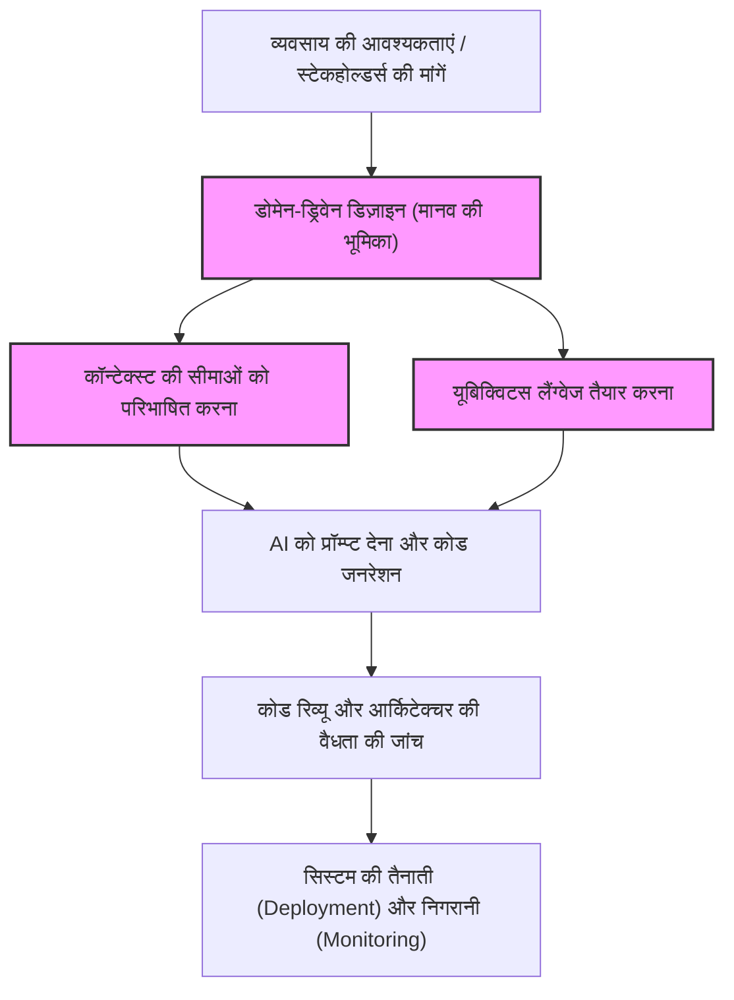
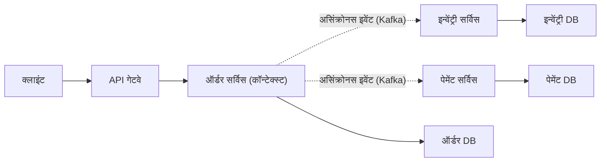
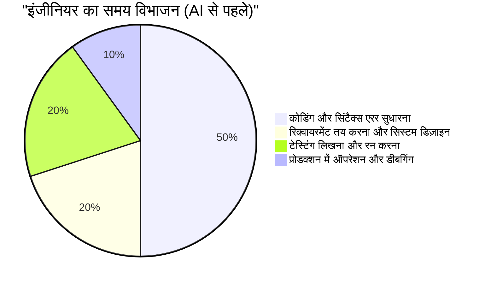
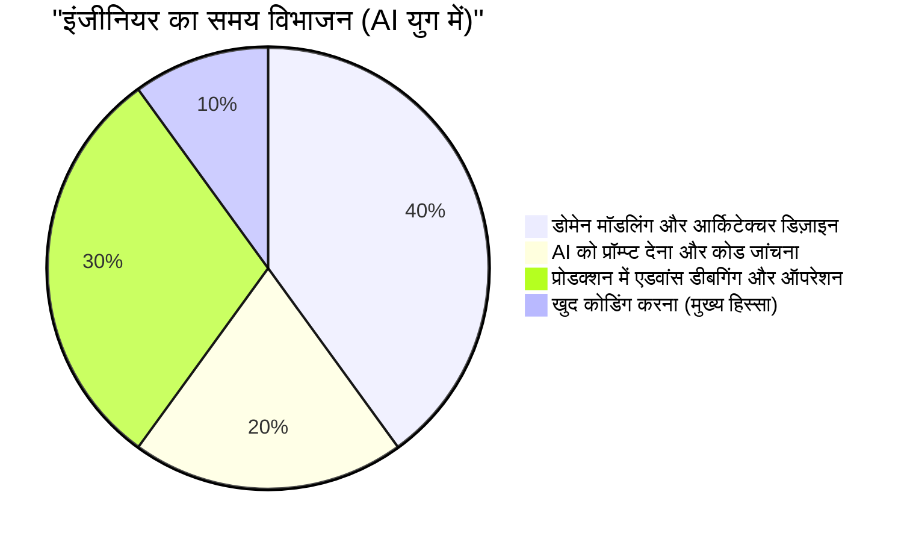

# AI के कोड लिखने के युग में आवश्यक "मानव-विशिष्ट इंजीनियर कौशल"

हाल के वर्षों में, Generative AI (जनरेटिव AI) और Large Language Models (LLM) के तेजी से विकास के कारण सॉफ्टवेयर इंजीनियरिंग का परिदृश्य काफी हद तक बदल गया है। GitHub Copilot और विभिन्न AI कोडिंग असिस्टेंट अब रोज़मर्रा के इस्तेमाल में आ गए हैं, और "अगर आप प्राकृतिक भाषा (natural language) में निर्देश देते हैं, तो AI तुरंत कोड जनरेट कर देगा" जैसी बातें अब भविष्य की कोई साइंस फिक्शन नहीं, बल्कि आज की हकीकत हैं।

ऐसे युग में, कई इंजीनियरों का यह डर स्वाभाविक है कि "क्या मेरी नौकरी AI छीन लेगा?"। निश्चित रूप से, रूटीन CRUD एप्लिकेशन के लिए बॉयलरप्लेट बनाना, सरल एल्गोरिदम लागू करना, या प्रसिद्ध लाइब्रेरी के API कॉल जैसी "केवल कोडिंग (Typing Code)" तेज़ी से कमोडिटी (commodity) बनती जा रही है।

लेकिन सॉफ्टवेयर इंजीनियरिंग का असल मतलब "सिर्फ कोड टाइप करना" नहीं है। इसका उद्देश्य तकनीक से बिजनेस की समस्याओं को हल करना और स्केलेबल (scalable) व मेंटेन करने योग्य (maintainable) सिस्टम बनाना है। इस लेख में, हम उन "मानव-विशिष्ट इंजीनियर कौशल (human-specific engineering skills)" पर गहराई से विचार करेंगे जिनकी अहमियत AI के कोड लिखने के युग में और भी बढ़ जाएगी। इसे हम LLM की तकनीकी सीमाओं, डोमेन-ड्रिवेन डिज़ाइन (DDD), सिस्टम आर्किटेक्चर और डिस्ट्रिब्यूटेड सिस्टम (distributed systems) की डीबगिंग के नज़रिए से समझेंगे।

---

## 1. लार्ज लैंग्वेज मॉडल्स (LLM) की संरचनात्मक सीमाओं को समझना

AI की क्षमताओं का सही आकलन करने और यह तय करने के लिए कि इंसानों को किस क्षेत्र में वैल्यू देनी चाहिए, सबसे पहले AI (खासकर LLM) की संरचनात्मक सीमाओं को गणितीय और आर्किटेक्चरल नजरिए से समझना जरूरी है।

### 1.1 ट्रांसफॉर्मर आर्किटेक्चर (Transformer Architecture) में कंप्यूटेशन और कॉन्टेक्स्ट की सीमाएँ

आज के अधिकांश LLM 2017 में Google द्वारा प्रस्तुत किए गए "Transformer" आर्किटेक्चर पर आधारित हैं। Transformer का मुख्य हिस्सा "सेल्फ-अटेंशन मैकेनिज्म (Self-Attention Mechanism)" है। सेल्फ-अटेंशन मैकेनिज्म यह गणना करता है कि इनपुट सीक्वेंस में प्रत्येक टोकन, अन्य सभी टोकनों से कितना संबंधित है।

इस अटेंशन की गणना का सूत्र इस प्रकार है:

$$ \text{Attention}(Q, K, V) = \text{softmax}\left(\frac{QK^T}{\sqrt{d_k}}\right)V $$

यहाँ, $Q$ (Query), $K$ (Key), $V$ (Value) इनपुट सीक्वेंस के लीनियर ट्रांसफॉर्मेशन (linear transformations) हैं, और $d_k$ Key का डाइमेंशन है।
इस गणना में सबसे बड़ी बाधा मैट्रिक्स गुणा $QK^T$ के साथ जुड़ी कंप्यूटेशनल जटिलता है। यदि इनपुट सीक्वेंस (टोकन की संख्या) $N$ है, तो यह जटिलता समय और स्पेस (मेमोरी) दोनों में $O(N^2)$ के क्रम में बढ़ती है।

$$ \text{Complexity} = O(N^2 \cdot d) $$

हाल के वर्षों में, FlashAttention जैसे हार्डवेयर स्तर के ऑप्टिमाइजेशन, Sparse Attention, और यहाँ तक कि Mamba (State Space Models) जैसे वैकल्पिक आर्किटेक्चर जो $O(N)$ समय में काम कर सकते हैं, पर शोध हो रहा है। इसके बावजूद, "अनंत कॉन्टेक्स्ट को पूरी तरह से समझना और पूरी तरह से ऑप्टिमाइज़्ड आउटपुट जनरेट करना" अभी भी बहुत मुश्किल है।

इसके अलावा, भले ही कॉन्टेक्स्ट विंडो को बढ़ा दिया जाए, फिर भी "Lost in the Middle (बीच की जानकारी का खो जाना)" नामक घटना होती है। LLM प्रॉम्प्ट की शुरुआत और अंत की जानकारी से बहुत अधिक प्रभावित होते हैं, और बीच में रखी गई महत्वपूर्ण आवश्यकताओं या बाधाओं (constraints) को नज़रअंदाज़ करने की प्रवृत्ति रखते हैं। यही कारण है कि अगर आप LLM को किसी एंटरप्राइज़ सिस्टम का हज़ारों लाइनों का सोर्स कोड देकर "इष्टतम रिफैक्टरिंग (optimal refactoring)" करने को कहते हैं, तो वह जो कोड देता है वह स्थानीय स्तर पर तो सही हो सकता है, लेकिन पूरे सिस्टम के लिहाज़ से टूट सकता है।

### 1.2 प्रोबेबिलिस्टिक जेनरेटिव मॉडल की विशेषताएँ और "हैलुसिनेशन (Hallucination)"

LLM असल में एक "प्रोबेबिलिस्टिक जेनरेटिव मॉडल (probabilistic generative model)" है, जो दिए गए कॉन्टेक्स्ट (प्रॉम्प्ट) और अब तक जनरेट किए गए नतीजों के आधार पर अगले सबसे संभावित टोकन (token) का अनुमान लगाता है।

$$ P(w_t | w_{1:t-1}) = \text{softmax}(W \cdot h_t) $$

यह मॉडल केवल बहुत बड़े ट्रेनिंग डेटा से "शब्दों के सांख्यिकीय सह-घटन (statistical co-occurrence)" को सीखता है, और यह जनरेट किए गए कोड के "अर्थ (Semantics)" या "वास्तविक दुनिया में निष्पादन (execution) के प्रभाव" को नहीं समझता है। इसी वजह से "हैलुसिनेशन (भ्रम या Hallucination)" की समस्या पैदा होती है।
ऐसे लाइब्रेरी फंक्शन को कॉल करना जो असल में है ही नहीं, या ऐसे वेरिएबल पास करना जिनका टाइप मेल नहीं खाता - ये सब बग सिर्फ इसलिए आते हैं क्योंकि LLM ने "व्याकरण की दृष्टि से सही लगने वाले (उच्च संभावना वाले) टोकन" जनरेट किए हैं।

### 1.3 रियल-वर्ल्ड ग्राउंडिंग (Grounding) का अभाव

AI में "भौतिक सीमाओं" या "वास्तविक व्यवसाय की सीमाओं (business constraints)" को व्यावहारिक रूप से समझने की क्षमता (Grounding) नहीं होती। उदाहरण के लिए, "पेमेंट प्रोसेस में 100ms की देरी से कन्वर्जन रेट (conversion rate) 5% गिर जाता है" जैसी व्यावसायिक सच्चाई, या "यह लेगेसी डेटाबेस रात 2 बजे बैच प्रोसेसिंग चलाता है, इसलिए उस दौरान ट्रांज़ैक्शन टाइमआउट (timeout) होने की संभावना अधिक होती है" जैसा किसी खास माहौल का ज्ञान। जब तक यह जानकारी स्पष्ट रूप से टेक्स्ट (text) के रूप में न दी जाए, AI इसे ध्यान में नहीं रख सकता।

इन तकनीकी और संरचनात्मक सीमाओं को देखते हुए, हम समझ सकते हैं कि AI "स्पष्ट रूप से परिभाषित छोटे स्कोप (फंक्शन, क्लास, मॉड्यूल) के कोड तेज़ी से जनरेट करने के टूल" के रूप में बहुत अच्छा है। लेकिन, "अस्पष्ट आवश्यकताओं से पूरे सिस्टम को डिज़ाइन करना और वास्तविक दुनिया की सीमाओं के साथ तालमेल बिठाना" - यह एक ऐसा काम है जो केवल इंसान ही कर सकते हैं।

---

## 2. मानव-विशिष्ट कौशल ①: अस्पष्ट आवश्यकताओं से "असली समस्या" को पहचानना

सॉफ्टवेयर डेवलपमेंट की सबसे बड़ी चुनौती कोड लिखना नहीं है।
सॉफ्टवेयर इंजीनियरिंग की क्लासिक किताब 'द मिथिकल मैन-मंथ' (The Mythical Man-Month) के लेखक फ्रेडरिक ब्रूक्स (Frederick Brooks) ने कहा है:

> "The hardest single part of building a software system is deciding precisely what to build."
> (सॉफ्टवेयर सिस्टम को बनाने का सबसे कठिन हिस्सा यह तय करना है कि वास्तव में क्या बनाना है।)

नॉन-टेक्निकल स्टेकहोल्डर्स (जैसे मैनेजमेंट, सेल्स टीम, ग्राहक) अक्सर यह बताने में सक्षम नहीं होते कि उन्हें असल में क्या चाहिए। "AI का उपयोग करके सेल्स बढ़ाने वाला सिस्टम बनाओ" या "मुझे एक ऐसी स्क्रीन चाहिए जहां एक बटन दबाने से सब कुछ अपने आप हो जाए" जैसी बेहद अस्पष्ट और विरोधाभासी माँगें आना रोज़मर्रा की बात है।

अगर आप AI को प्रॉम्प्ट देते हैं, "सेल्स बढ़ाने वाले सिस्टम का कोड लिखो", तो कोई काम का सिस्टम नहीं बनेगा। एक इंजीनियर को निम्नलिखित प्रक्रिया (process) अपनानी पड़ती है:

1. **डोमेन की गहराई को समझना**: स्टेकहोल्डर्स की बातों के पीछे छिपी "वास्तविक व्यावसायिक समस्या" को बातचीत के ज़रिए सामने लाना।
2. **रिक्वायरमेंट का स्कोप तय करना**: तकनीकी संभावनाओं और लागत (ROI) को तौलते हुए यह तय करना कि "क्या नहीं करना है"।
3. **स्पेसिफिकेशन (Specification) तैयार करना**: अस्पष्ट माँगों को स्पष्ट तार्किक नियमों (logical constraints, जैसे प्रॉम्प्ट या आर्किटेक्चरल डिज़ाइन) में बदलना, जिसे AI समझ सके।

"इंसान-से-इंसान का यह उच्च-स्तरीय संचार (communication) और बातचीत (negotiation)" एक ऐसा मूल्यवान कौशल है जिसे AI कभी रिप्लेस नहीं कर सकता।

---

## 3. मानव-विशिष्ट कौशल ②: डोमेन-ड्रिवेन डिज़ाइन (DDD) और मॉडलिंग

आवश्यकताओं (requirements) को समझने के बाद, उन्हें सॉफ्टवेयर के स्ट्रक्चर में ढालने का सबसे शक्तिशाली हथियार "डोमेन-ड्रिवेन डिज़ाइन (Domain-Driven Design: DDD)" है। AI जैसे-जैसे अधिक कोड अपने-आप जनरेट करने लगेगा, पूरे सिस्टम की "सीमाएँ (boundaries)" कहाँ तय करनी हैं - DDD का यह कॉन्सेप्ट (concept) और भी ज्यादा अहम हो जाएगा।

### 3.1 यूबिक्विटस लैंग्वेज (Ubiquitous Language) तैयार करना

सिस्टम डेवलपमेंट में, अगर बिजनेस साइड और डेवलपमेंट साइड के लिए "शब्दों के मतलब" अलग-अलग हैं, तो AI गलत संदर्भ में कोड जनरेट कर देगा। उदाहरण के लिए, "यूज़र (User)" शब्द का मतलब मार्केटिंग टीम के लिए "लीड (संभावित ग्राहक)" हो सकता है, जबकि कस्टमर सपोर्ट के लिए centralized "सब्सक्राइब किया हुआ अकाउंट" हो सकता है।
इंसानी इंजीनियरों को पूरे प्रोजेक्ट के लिए एक "यूबिक्विटस लैंग्वेज (सर्वव्यापी भाषा)" बनानी चाहिए और सुनिश्चित करना चाहिए कि क्लास (Class) के नाम, मेथड (Method) के नाम से लेकर AI को दिए जाने वाले प्रॉम्प्ट तक हर जगह इसी भाषा का इस्तेमाल हो।

### 3.2 बाउंडेड कॉन्टेक्स्ट (Bounded Context) का डिज़ाइन

अगर आप किसी बड़े सिस्टम को सिर्फ एक मॉडल में समेटने की कोशिश करेंगे, तो वह फेल हो जाएगा। DDD में, सिस्टम को अर्थपूर्ण सीमाओं (Bounded Contexts) में बाँटा जाता है।
उदाहरण के लिए, किसी ई-कॉमर्स साइट पर "उत्पाद (Product)" का कॉन्सेप्ट कैटलॉग (डिस्प्ले) कॉन्टेक्स्ट में और इन्वेंट्री (मैनेजमेंट) कॉन्टेक्स्ट में पूरी तरह से अलग विशेषताएँ (attributes) और व्यवहार (behaviors) रखता है।

जब इंसानी आर्किटेक्ट सही बाउंडेड कॉन्टेक्स्ट तय करते हैं और AI को हर कॉन्टेक्स्ट के लिए अलग-अलग प्रॉम्प्ट और स्पेसिफिकेशन देते हैं, तभी AI "सही डोमेन नॉलेज पर आधारित कोड" जनरेट कर पाता है।

नीचे दिया गया चित्र (diagram) AI युग में DDD के दृष्टिकोण और काम के बँटवारे को दर्शाता है।

AI से "पूरा सिस्टम बनाओ" कहने के बजाय, इंसानों द्वारा तय की गई "कॉन्टेक्स्ट सीमाओं" के भीतर ही AI को लागू करने (implementation) की जिम्मेदारी सौंपना—यही भविष्य के सॉफ्टवेयर डेवलपमेंट का मूल तरीका होगा।

---

## 4. मानव-विशिष्ट कौशल ③: डिस्ट्रिब्यूटेड सिस्टम (Distributed Systems) का आर्किटेक्चर और स्केलिंग

आज का सॉफ्टवेयर, एक ही सर्वर पर चलने वाले मोनोलिथ (Monolith) से लेकर क्लाउड-नेटिव माइक्रोसर्विसेज़ आर्किटेक्चर और इवेंट-ड्रिवेन आर्किटेक्चर तक विकसित हो गया है। ऐसे डिस्ट्रिब्यूटेड सिस्टम का डिज़ाइन तैयार करना AI के लिए बहुत मुश्किल है, क्योंकि AI केवल स्थानीय लॉजिक को ऑप्टिमाइज़ कर सकता है।

### 4.1 CAP थ्योरम और ट्रेड-ऑफ (Trade-off) तय करना

डिस्ट्रिब्यूटेड सिस्टम डिज़ाइन करते समय, इंजीनियरों का सामना हमेशा "CAP थ्योरम" से होता है। CAP थ्योरम यह सिद्धांत है कि एक डिस्ट्रिब्यूटेड सिस्टम निम्नलिखित 3 विशेषताओं में से एक साथ केवल 2 को ही पूरा कर सकता है:

- **Consistency (निरंतरता / एकरूपता)**: क्या सभी नोड्स पर एक ही समय में समान डेटा दिखाई देता है?
- **Availability (उपलब्धता)**: क्या सिस्टम का कुछ हिस्सा डाउन होने पर भी सिस्टम काम करता रहता है?
- **Partition Tolerance (विभाजन सहनशीलता)**: क्या नेटवर्क टूट जाने पर भी सिस्टम काम करता रहता है?

$$ P(\text{Availability} \cup \text{Consistency}) | \text{PartitionTolerance} $$

असल दुनिया के नेटवर्क में विभाजन (Partition) को टाला नहीं जा सकता, इसलिए इंजीनियरों को गंभीर ट्रेड-ऑफ फैसले लेने पड़ते हैं, जो सीधे व्यवसाय से जुड़े होते हैं। जैसे, "इस पेमेंट सिस्टम में हम Consistency (C) को प्राथमिकता देंगे, और दिक्कत आने पर सर्विस रोक देंगे (CP)", या "इस सोशल मीडिया (SNS) टाइमलाइन में हम Availability (A) को प्राथमिकता देंगे, और कुछ समय के लिए डेटा अलग-अलग दिखने (inconsistency) को सह लेंगे (AP)"।

AI "C को प्राथमिकता देने वाला कोड" या "A को प्राथमिकता देने वाला कोड" लिख सकता है, लेकिन वह अपने-आप यह तय नहीं कर सकता कि "किसे प्राथमिकता देनी चाहिए", क्योंकि इस फैसले में व्यावसायिक जोखिम (business risk) शामिल होता है।

### 4.2 असिंक्रोनस कम्युनिकेशन (Asynchronous Communication) और इवेंचुअल कंसिस्टेंसी (Eventual Consistency)

जब सिस्टम बड़े हो जाते हैं, तो सेवाओं के बीच संपर्क (communication) REST API के ज़रिए होने वाले सिंक्रोनस संचार से हटकर, मैसेज क्यू (जैसे Kafka, RabbitMQ) का उपयोग करने वाले असिंक्रोनस संचार (asynchronous communication) में बदल जाता है। ऐसे में, डेटा की एकरूपता तुरंत (immediate consistency) के बजाय "इवेंचुअल कंसिस्टेंसी (Eventual Consistency - अंततः एकरूपता)" में बदल जाती है।
सागा पैटर्न (Saga Pattern) या CQRS (Command Query Responsibility Segregation) जैसे उन्नत आर्किटेक्चर पैटर्न (architecture patterns) को कब लागू करना चाहिए? ऐसे जटिल फैसले लेना और पूरे सिस्टम का ब्लूप्रिंट तैयार करना, एक अनुभवी (senior) इंजीनियर की ही असली खूबी है।

---

## 5. मानव-विशिष्ट कौशल ④: जटिल सिस्टम को डीबग (Debug) और ट्रबलशूट (Troubleshoot) करना

जितना ज़्यादा कोड AI जनरेट करेगा, प्रोडक्शन वातावरण में ऐसे कोड के चलने का जोखिम उतना ही बढ़ जाएगा जिसे "कोई भी पूरी तरह नहीं समझता"। जब सब कुछ ठीक चल रहा हो तो कोई समस्या नहीं है, लेकिन सिस्टम डाउन होने पर समस्या का निवारण (troubleshooting) करते समय इंसान इंजीनियर की असली कीमत पता चलती है।

### 5.1 ऑबज़र्वेबिलिटी (Observability) डिज़ाइन करना

सिस्टम की खराबी को तेज़ी से ठीक करने के लिए केवल AI को एरर लॉग (error log) पेस्ट करना ही काफी नहीं है। माइक्रोसर्विसेज़ के वातावरण में, एक रिक्वेस्ट दर्जनों सेवाओं से होकर गुज़रती है।
इंजीनियरों को सिस्टम में ऑबज़र्वेबिलिटी के "3 मुख्य स्तंभों"—लॉग (Logs), मेट्रिक्स (Metrics), और ट्रेस (Traces)—को सही ढंग से जोड़ना होगा। OpenTelemetry जैसी चीज़ों का इस्तेमाल करके, डिस्ट्रिब्यूटेड ट्रेसिंग (distributed tracing) के ज़रिए यह पता लगाना कि "किस सर्विस के किस डेटाबेस क्वेरी में देरी हो रही है", इसके लिए बुनियादी ढांचा तैयार करना इंसान का ही काम है।

### 5.2 वातावरण पर निर्भर बग और कैओस इंजीनियरिंग (Chaos Engineering)

"ऐसे बग जो लोकल या टेस्ट एनवायरनमेंट में नहीं आते, बल्कि प्रोडक्शन में केवल पीक टाइम पर आते हैं"—उदाहरण के लिए, मेमोरी लीक, डेटाबेस डेडलॉक (deadlocks), कनेक्शन पूल का खत्म होना (connection pool exhaustion), नेटवर्क पैकेट लॉस। इस तरह की समस्याएं सिर्फ सोर्स कोड को पढ़ने (static analysis) से कभी नहीं मिल सकतीं।

एक इंसानी इंजीनियर प्रोडक्शन एनवायरनमेंट के मेट्रिक्स को देखकर परिकल्पनाएं (hypotheses) बनाता है, थ्रेड डंप (thread dumps) और हीप डंप (heap dumps) की जांच करता है, और असली समस्या (bottleneck) का पता लगाता है। AI सीधे टर्मिनल खोलकर प्रोडक्शन सर्वर की प्रॉसेस को प्रोफाइल नहीं कर सकता (और सुरक्षा कारणों से उसे इसकी अनुमति दी भी नहीं जानी चाहिए)।
सिस्टम जितना जटिल होता जाएगा, फिजिकल इंफ्रास्ट्रक्चर, नेटवर्क प्रोटोcul, और OS कर्नेल ट्यूनिंग जैसे "निचले स्तर के ज्ञान (low-level knowledge)" और "सहज अनुमान लगाने की क्षमता" रखने वाले इंजीनियरों की अहमियत उतनी ही तेज़ी से बढ़ेगी।

---

## 6. AI युग में इंजीनियर की वैल्यू का फंक्शन और टाइम एलोकेशन (Time Allocation)

जैसा कि हमने देखा, AI युग में इंजीनियरों के लिए ज़रूरी स्किल्स में बहुत बड़ा बदलाव (paradigm shift) आ रहा है। अगर हम इसे गणितीय सूत्र (formula) के रूप में लिखें, तो एक इंजीनियर द्वारा पैदा की जाने वाली वैल्यू ($V$) कुछ इस तरह होगी:

$$ V = \left( \sum_{i=1}^{n} \text{DomainKnowledge}_i + \text{ArchitectureSkill} + \text{ProblemSolving} \right) \times \text{AI\_Leverage}^{\alpha} $$

पहले के "कोडिंग स्पीड" या "सिंटैक्स याद रखने" जैसे गुण इस फॉर्मूले से बाहर कर दिए गए हैं। इसके बजाय, गहरा डोमेन ज्ञान, आर्किटेक्चर डिज़ाइन क्षमता, और जटिल समस्याओं को सुलझाने की क्षमता के "कुल योग (sum)" को, AI का इस्तेमाल करने की क्षमता (लेवरेज - $\text{AI\_Leverage}^{\alpha}$) से गुणा किया जाता है, जिससे वैल्यू तेज़ी से (exponentially) बढ़ती है।

यह बड़ा बदलाव इंजीनियरों द्वारा अपना समय बिताने के तरीके (time allocation) में भी साफ दिखाई देता है।

AI युग में, इंजीनियर एक "कोड टाइपिस्ट" से ऊपर उठकर, "पूरे सिस्टम को चलाने वाले ऑर्केस्ट्रा कंडक्टर" बन जाएंगे। क्योंकि AI बड़ी मात्रा में कोड लिखता है, यह सुनिश्चित करना कि वह कोड सही दिशा में जा रहा है, सुरक्षा नियमों (security requirements) को पूरा कर रहा है, और पूरे आर्किटेक्चर के अनुकूल है—इसकी देखरेख (monitoring and control) करने वाले "रिव्यूअर" और "आर्किटेक्ट" की भूमिका जूनियर से लेकर सीनियर तक सभी इंजीनियरों के लिए ज़रूरी हो जाएगी।

---

## 7. निष्कर्ष: बदलाव का विरोध न करें, बल्कि इसके साथ आगे बढ़ें

"AI के कोड लिखने का युग" इंजीनियरों के लिए कोई खतरा नहीं, बल्कि इतिहास का सबसे बड़ा अवसर है। जिस तरह असेंबली भाषा से C भाषा में बदलाव हुआ, और मेमोरी पॉइंटर मैनेजमेंट से जावा के गार्बेज कलेक्शन तक का सफर तय हुआ, उसी तरह AI द्वारा कोड जनरेशन बस "एब्स्ट्रैक्शन (abstraction) का एक स्तर ऊपर उठना" है।

भविष्य के इंजीनियरों को किसी खास प्रोग्रामिंग भाषा के बारीक नियमों या फ्रेमवर्क के वर्ज़न अपडेट को लेकर परेशान नहीं होना पड़ेगा, बल्कि वे **"व्यापार की समस्या क्या है?", "डेटा को कैसे बांटना है और कैसे जोड़ना है?", और "सिस्टम डाउन होने पर उसे तेज़ी से कैसे चालू करना है?"** जैसी ज़्यादा ज़रूरी और इंसानी सोच वाली समस्याओं को सुलझाने पर अपना ध्यान केंद्रित कर सकेंगे।

एक सच्चा इंजीनियर वह नहीं है जो सिर्फ कोड लिखता है, बल्कि वह है जो समस्याओं को सुलझाता है।
डोमेन मॉडलिंग, स्केलेबल आर्किटेक्चर डिज़ाइन, स्टेकहोल्डर्स के साथ बातचीत, और जटिल सिस्टम की डीबगिंग। जो भी व्यक्ति इन "मानव-विशिष्ट इंजीनियर कौशल" को निखारता रहेगा, उसके लिए AI कोई नौकरी छीनने वाला दुश्मन नहीं, बल्कि उसकी रचनात्मकता और उत्पादकता को कई गुना बढ़ाने वाला सबसे शानदार पार्टनर साबित होगा।
