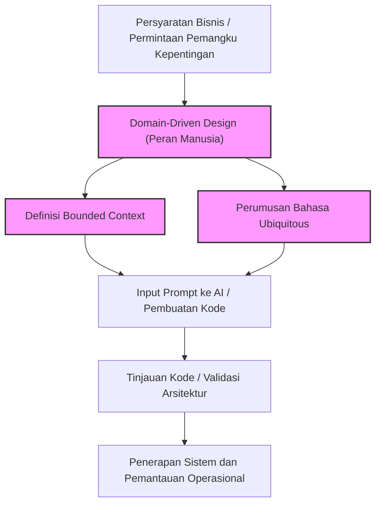
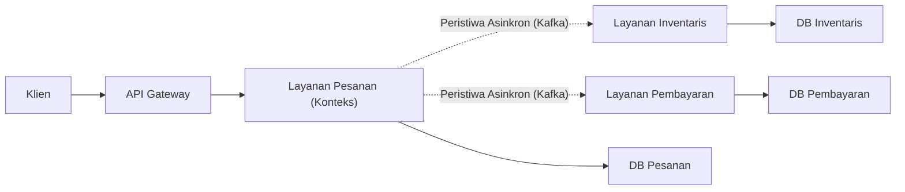
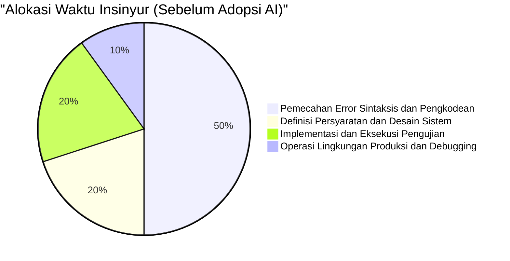
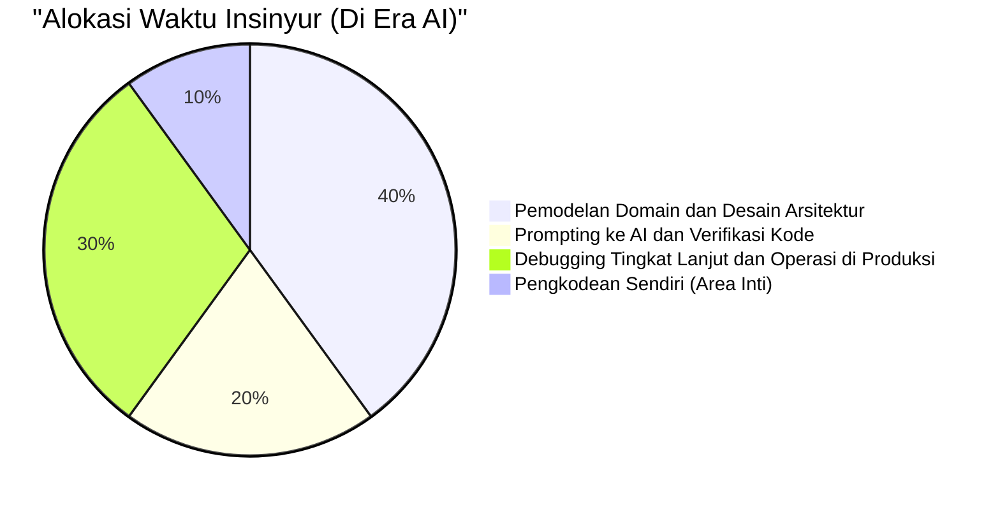

# Keterampilan Insinyur Khas Manusia yang Dibutuhkan di Era AI Menulis Kode

Dalam beberapa tahun terakhir, dengan evolusi dramatis AI Generatif (Generative AI) dan Large Language Models (LLM), lanskap rekayasa perangkat lunak telah berubah secara drastis. GitHub Copilot dan berbagai asisten pengkodean AI kini digunakan setiap hari, dan fenomena "memberikan instruksi dalam bahasa alami, dan AI akan secara instan menghasilkan kode" tidak lagi menjadi fiksi ilmiah masa depan melainkan realitas hari ini.

Di era seperti ini, wajar bagi banyak insinyur untuk merasa cemas bahwa "pekerjaan saya mungkin akan direbut oleh AI." Memang benar bahwa "sekadar pekerjaan pengkodean (Typing Code)" seperti membuat boilerplate untuk aplikasi CRUD standar, mengimplementasikan algoritma sederhana, atau memanggil API dari pustaka terkenal, dengan cepat menjadi komoditas.

Namun, esensi dari rekayasa perangkat lunak bukanlah "mengetik kode." Ini tentang menyelesaikan tantangan bisnis melalui teknologi dan membangun sistem yang skalabel dan dapat dipelihara. Dalam artikel ini, kita akan membahas "keterampilan insinyur khas manusia" yang nilainya semakin meningkat justru di era saat AI menulis kode. Kita akan menelaahnya secara sangat rinci dan teknis dari sudut pandang keterbatasan teknis LLM, Domain-Driven Design (DDD), arsitektur sistem, dan proses debug sistem terdistribusi.

---

## 1. Memahami Keterbatasan Struktural dari Large Language Models (LLM)

Untuk mengevaluasi kemampuan AI dengan benar dan menentukan di area mana manusia harus memberikan nilai, pertama-tama kita perlu memahami keterbatasan struktural AI (terutama LLM) dari perspektif matematis dan arsitektural.

### 1.1 Kompleksitas Komputasi dan Batas Konteks dalam Arsitektur Transformer

Sebagian besar LLM saat ini didasarkan pada arsitektur "Transformer" yang diumumkan oleh Google pada tahun 2017. Inti dari Transformer terletak pada "Mekanisme Self-Attention" (Self-Attention Mechanism). Mekanisme ini menghitung seberapa besar setiap token dalam urutan input terkait dengan semua token lainnya.

Rumus perhitungan attention ini dinyatakan sebagai berikut:

$$ \text{Attention}(Q, K, V) = \text{softmax}\left(\frac{QK^T}{\sqrt{d_k}}\right)V $$

Di sini, $Q$ (Query), $K$ (Key), dan $V$ (Value) adalah transformasi linear dari urutan input, dan $d_k$ adalah jumlah dimensi key.
Kendala paling signifikan dalam perhitungan ini adalah kompleksitas komputasi yang terkait dengan perkalian matriks $QK^T$. Jika urutan input (jumlah token) adalah $N$, kompleksitas ini meningkat pada orde $O(N^2)$ baik dalam waktu maupun ruang (memori).

$$ \text{Complexity} = O(N^2 \cdot d) $$

Dalam beberapa tahun terakhir, penelitian tentang pengoptimalan di tingkat perangkat keras seperti FlashAttention, Sparse Attention, dan bahkan arsitektur alternatif yang dapat memproses dalam waktu linier $O(N)$ seperti Mamba (State Space Models) sedang berkembang, tetapi masih sangat sulit untuk "sepenuhnya memahami konteks yang tak terbatas dan menghasilkan output yang dioptimalkan secara keseluruhan."

Selain itu, bahkan jika jendela konteks (context window) secara fisik dapat diperluas, fenomena yang disebut "Lost in the Middle" (Kehilangan Informasi di Tengah) akan terjadi. LLM cenderung sangat dipengaruhi oleh informasi di awal dan akhir prompt, dan cenderung mengabaikan persyaratan atau kendala penting yang ditempatkan di tengah. Inilah sebabnya mengapa jika Anda meminta LLM untuk membaca seluruh kode sumber sistem perusahaan yang berjumlah puluhan ribu baris dan menginstruksikannya untuk "melakukan refactoring yang optimal", ia akan menghasilkan kode yang secara lokal benar tetapi secara keseluruhan berantakan.

### 1.2 Karakteristik Model Generatif Probabilistik dan "Halusinasi"

Inti dari LLM adalah "model generatif probabilistik" yang memprediksi token dengan probabilitas kemunculan tertinggi berikutnya berdasarkan konteks (prompt) yang dimasukkan dan hasil yang dihasilkan sejauh ini.

$$ P(w_t | w_{1:t-1}) = \text{softmax}(W \cdot h_t) $$

Model hanya mempelajari "hubungan kemunculan bersama statistik dari kata-kata" dari data pelatihan yang sangat besar, dan tidak memahami "makna (Semantics)" dari kode yang dihasilkan atau "dampak dari hasil eksekusi di dunia nyata." Hal ini memicu terjadinya "Halusinasi" (Hallucination).
Bug seperti memanggil fungsi pustaka fiktif yang tidak ada atau meneruskan variabel dengan tipe yang sedikit tidak cocok tidak lain adalah hasil dari LLM yang menghasilkan "urutan token yang secara tata bahasa tampak masuk akal (probabilitas tinggi)."

### 1.3 Kurangnya Grounding di Dunia Nyata

AI tidak memiliki kemampuan (Grounding) untuk memahami "batasan fisik" atau "batasan bisnis nyata" secara intuitif. Misalnya, realitas bisnis bahwa "jika latensi pemrosesan pembayaran tertunda 100 ms, tingkat konversi akan turun 5%", atau pengetahuan tersirat spesifik lingkungan seperti "DB warisan ini menjalankan pemrosesan batch pada pukul 2 pagi, sehingga transaksi selama jam tersebut rentan mengalami time-out," tidak dapat dipertimbangkan kecuali diberikan secara eksplisit sebagai teks.

Berdasarkan batasan teknis dan struktural ini, terbukti bahwa AI sangat unggul sebagai "alat yang dengan cepat menghasilkan kode untuk cakupan yang sempit dan didefinisikan dengan jelas (fungsi, kelas, modul)", tetapi "merancang keseluruhan sistem dari persyaratan yang ambigu dan menyelaraskannya dengan batasan dunia nyata" adalah area yang hanya dapat dilakukan oleh manusia.

---

## 2. Keterampilan Khas Manusia ①: Mengekstraksi "Masalah Sejati" dari Persyaratan yang Ambigu

Tantangan terbesar dalam pengembangan perangkat lunak bukanlah menulis kode itu sendiri.
Frederick Brooks, penulis buku klasik rekayasa perangkat lunak "The Mythical Man-Month", menyatakan hal berikut:

> "The hardest single part of building a software system is deciding precisely what to build."
> (Bagian tersulit dari membangun sebuah sistem perangkat lunak adalah memutuskan dengan tepat apa yang harus dibangun.)

Pemangku kepentingan non-teknis (manajemen, departemen penjualan, pelanggan) seringkali tidak dapat mengartikulasikan apa yang sebenarnya mereka inginkan. Persyaratan yang sangat ambigu dan penuh kontradiksi seperti "Saya ingin Anda membuat sistem yang meningkatkan penjualan menggunakan AI" atau "Saya ingin layar di mana semuanya diotomatisasi hanya dengan menekan satu tombol" adalah hal yang biasa terjadi sehari-hari.

Bahkan jika Anda memasukkan prompt "Tuliskan kode untuk sistem yang akan meningkatkan penjualan" ke AI, sistem yang dapat digunakan tidak akan dihasilkan. Proses berikut inilah yang dituntut dari seorang insinyur:

1. **Eksplorasi Domain**: Menggali "masalah bisnis yang sebenarnya" di balik kata-kata pemangku kepentingan melalui dialog.
2. **Definisi Ruang Lingkup Persyaratan**: Menimbang kelayakan teknis dan biaya (ROI), dan memutuskan "apa yang tidak akan dilakukan."
3. **Formalisasi Spesifikasi**: Mengubah persyaratan yang ambigu menjadi batasan logis yang jelas (prompt atau diagram arsitektur) yang dapat dipahami oleh AI.

"Komunikasi dan negosiasi tingkat tinggi antara manusia dan manusia" ini adalah keterampilan yang bergantung pada individu dan bernilai tinggi yang tidak akan pernah bisa digantikan oleh AI.

---

## 3. Keterampilan Khas Manusia ②: Domain-Driven Design (DDD) dan Pemodelan

Setelah mengekstraksi persyaratan, senjata terkuat untuk menerjemahkannya ke dalam struktur perangkat lunak adalah "Domain-Driven Design (DDD)". Semakin banyak AI secara otomatis menghasilkan kode lokal, semakin penting konsep DDD tentang di mana harus menarik "batas" keseluruhan sistem.

### 3.1 Perumusan Bahasa Ubiquitous (Ubiquitous Language)

Dalam pengembangan sistem, jika ada perbedaan "makna kata" antara sisi bisnis dan sisi pengembangan, AI akan menghasilkan kode dalam konteks yang salah. Misalnya, kata "pengguna" mungkin merujuk pada "prospek" bagi departemen pemasaran, dan merujuk pada "akun yang sudah dikontrak" bagi dukungan pelanggan.
Insinyur manusia harus merumuskan "Bahasa Ubiquitous" yang disatukan di seluruh proyek, dan menegakkannya di mana-mana, mulai dari nama kelas dan nama metode dalam kode, hingga prompt untuk AI.

### 3.2 Desain Bounded Context (Konteks Terbatas)

Mencoba merepresentasikan sistem besar dengan satu model pasti akan gagal. Dalam DDD, sistem dibagi menjadi batas-batas yang bermakna (Bounded Context).
Misalnya, di situs e-commerce, konsep "Produk" (Product) memiliki atribut dan perilaku yang sama sekali berbeda antara konteks katalog (tampilan) dan konteks inventaris (manajemen).

Hanya ketika arsitek manusia menarik batas konteks yang benar dan memberikan AI spesifikasi serta prompt independen untuk setiap konteks, barulah AI dapat menghasilkan "kode berdasarkan pengetahuan domain yang benar."

Diagram berikut menunjukkan pendekatan DDD dan pembagian peran di era AI.

Paradigma dasar pengembangan perangkat lunak di masa depan bukanlah menginstruksikan AI untuk "membuat keseluruhan sistem", melainkan mendelegasikan implementasi ke AI terbatas pada batasan internal "Bounded Context" yang ditentukan oleh manusia.

---

## 4. Keterampilan Khas Manusia ③: Desain Arsitektur dan Penskalaan Sistem Terdistribusi

Perangkat lunak modern telah berevolusi dari monolit yang berjalan pada satu server ke arsitektur layanan mikro (microservices) cloud-native dan arsitektur event-driven (berbasis peristiwa). Merancang sistem terdistribusi seperti itu adalah area yang sangat sulit bagi AI, yang hanya mampu mengoptimalkan logika secara lokal.

### 4.1 Teorema CAP dan Penilaian Trade-off

Saat merancang sistem terdistribusi, insinyur selalu dihadapkan pada "Teorema CAP". Teorema CAP adalah prinsip yang menyatakan bahwa sebuah sistem terdistribusi hanya dapat memenuhi dua dari tiga karakteristik berikut secara bersamaan:

- **Consistency (Konsistensi)**: Apakah semua node melihat data yang sama pada waktu yang sama?
- **Availability (Ketersediaan)**: Apakah sistem terus merespons meskipun beberapa node mengalami kegagalan?
- **Partition Tolerance (Toleransi Partisi)**: Apakah sistem terus beroperasi meskipun terjadi pemisahan (partisi) jaringan?

$$ P(\text{Availability} \cup \text{Consistency}) | \text{PartitionTolerance} $$

Karena pemisahan (Partition) jaringan tidak dapat dihindari di jaringan nyata, insinyur harus membuat penilaian trade-off yang ketat dan berkaitan langsung dengan kebutuhan bisnis, seperti "Sistem pembayaran ini memprioritaskan Consistency (Konsistensi) dan akan menghentikan layanan jika terjadi kegagalan (CP)" atau "Timeline SNS ini memprioritaskan Availability (Ketersediaan) dan mentolerir inkonsistensi data sementara (AP)."

Meskipun AI dapat menulis "kode yang memprioritaskan C" atau "kode yang memprioritaskan A", ia tidak dapat secara otonom membuat keputusan yang melibatkan risiko bisnis tentang "mana yang harus diprioritaskan."

### 4.2 Komunikasi Asinkron dan Konsistensi Akhir (Eventual Consistency)

Ketika sistem menjadi berskala besar, koordinasi antar layanan beralih dari komunikasi sinkron melalui REST API ke komunikasi asinkron menggunakan message queue (seperti Kafka, RabbitMQ). Konsistensi data di sini berubah dari konsistensi instan menjadi "konsistensi akhir" (Eventual Consistency).
Kapan pola arsitektur tingkat lanjut seperti Saga Pattern atau CQRS (Command Query Responsibility Segregation) harus diperkenalkan? Membuat keputusan kompleks ini dan menggambar cetak biru keseluruhan sistem adalah kompetensi utama dari insinyur senior (senior engineer).

---

## 5. Keterampilan Khas Manusia ④: Debugging dan Troubleshooting Sistem Kompleks

Semakin banyak kode yang dihasilkan oleh AI, semakin tinggi risiko bahwa "kode yang tidak sepenuhnya dipahami oleh siapa pun" akan berjalan di lingkungan produksi. Bahkan jika sistem berjalan tanpa masalah pada waktu normal, nilai sebenarnya dari seorang insinyur manusia akan diuji dalam pemecahan masalah ketika terjadi kegagalan (troubleshooting).

### 5.1 Desain Observabilitas (Kejelasan Sistem)

Untuk mengatasi kegagalan sistem dengan cepat, sekadar menempelkan log kesalahan (error log) ke AI tidaklah cukup. Dalam lingkungan layanan mikro, satu permintaan melintasi puluhan layanan.
Insinyur harus memasukkan "tiga pilar observabilitas" dengan tepat ke dalam sistem: Log (Logs), Metrik (Metrics), dan Jejak (Traces). Memanfaatkan alat seperti OpenTelemetry untuk membangun fondasi yang dapat mengidentifikasi "kueri database mana di layanan mana yang mengalami keterlambatan" melalui pelacakan terdistribusi (distributed tracing) adalah peran manusia.

### 5.2 Bug Terkait Lingkungan dan Chaos Engineering

"Bug yang tidak dapat direproduksi di lingkungan lokal atau pengujian, tetapi hanya terjadi selama jam sibuk di lingkungan produksi"—misalnya kebocoran memori (memory leak), kebuntuan basis data (database deadlock), penipisan connection pool, atau packet loss di jaringan—masalah-masalah ini tidak akan pernah dapat ditemukan hanya melalui analisis statis kode sumber.

Insinyur manusia merumuskan hipotesis sambil menatap metrik lingkungan produksi, menganalisis thread dump dan heap dump, dan mengidentifikasi bottleneck. AI tidak dapat langsung membuka terminal dan memprofilkan proses di server produksi (dan juga tidak seharusnya diizinkan karena alasan keamanan).
Semakin kompleks sebuah sistem, semakin tinggi nilai dari seorang insinyur yang memiliki "pengetahuan tingkat rendah (low-layer)" seperti infrastruktur fisik, protokol jaringan, dan OS kernel tuning, serta "kemampuan penalaran hipotesis intuitif."

---

## 6. Fungsi Nilai Insinyur dan Alokasi Waktu di Era AI

Seperti yang telah dibahas sejauh ini, set keterampilan yang dibutuhkan oleh insinyur di era AI mengalami pergeseran paradigma (paradigm shift) yang besar. Jika kita memodelkannya dalam rumus matematika, nilai yang diciptakan oleh seorang insinyur ($V$) dapat dinyatakan sebagai berikut:

$$ V = \left( \sum_{i=1}^{n} \text{DomainKnowledge}_i + \text{ArchitectureSkill} + \text{ProblemSolving} \right) \times \text{AI\_Leverage}^{\alpha} $$

"Kecepatan coding" dan "Daya ingat sintaksis" tradisional telah dikecualikan dari rumus ini. Sebagai gantinya, "jumlah" dari pengetahuan domain yang mendalam, kemampuan desain arsitektur, dan kemampuan pemecahan masalah yang kompleks dikalikan dengan leverage dari penggunaan AI ($\text{AI\_Leverage}^{\alpha}$), menciptakan struktur yang menghasilkan nilai secara eksponensial.

Pergeseran paradigma ini juga dengan jelas tercermin dalam bagaimana insinyur menggunakan waktu sehari-hari mereka (alokasi waktu).

Di era AI, insinyur ditingkatkan dari "pengetik kode" menjadi "konduktor yang mengorkestrasi keseluruhan sistem." Justru karena AI menulis kode dalam jumlah besar, peran sebagai "reviewer" dan "arsitek" yang memantau dan mengontrol apakah kode tersebut mengarah ke arah yang benar, apakah memenuhi persyaratan keamanan, dan apakah konsisten dengan arsitektur sistem secara keseluruhan, menjadi persyaratan bagi semua insinyur mulai dari tingkat junior hingga senior.

---

## 7. Kesimpulan: Jangan Menolak Evolusi, Kendarailah Gelombangnya

"Era di mana AI menulis kode" bukanlah ancaman bagi insinyur, melainkan peluang terbesar dalam sejarah. Sama seperti transisi dari bahasa assembly ke bahasa C di masa lalu, atau evolusi dari manajemen pointer memori ke garbage collection di Java, pembuatan kode oleh AI hanyalah "satu tingkat abstraksi yang naik."

Insinyur masa depan tidak perlu khawatir tentang detail spesifikasi bahasa pemrograman tertentu atau pembaruan versi dari kerangka kerja (framework), tetapi dapat memusatkan sumber daya mereka pada penyelesaian masalah yang lebih esensial dan tingkat tinggi yang khas manusia, seperti **"Apa masalah bisnisnya?", "Bagaimana data harus dibagi dan dihubungkan?", dan "Bagaimana cara memulihkan dengan cepat saat sistem mati?"**

Insinyur sejati bukanlah seseorang yang menulis kode, melainkan seseorang yang memecahkan masalah.
Pemodelan domain, desain arsitektur yang dapat diskalakan, komunikasi dengan pemangku kepentingan, dan debugging sistem yang kompleks. Bagi mereka yang terus mengasah "keterampilan insinyur khas manusia" ini, AI bukan musuh yang mencuri pekerjaan, melainkan mitra terkuat yang akan melipatgandakan kreativitas dan produktivitas mereka puluhan kali lipat.
