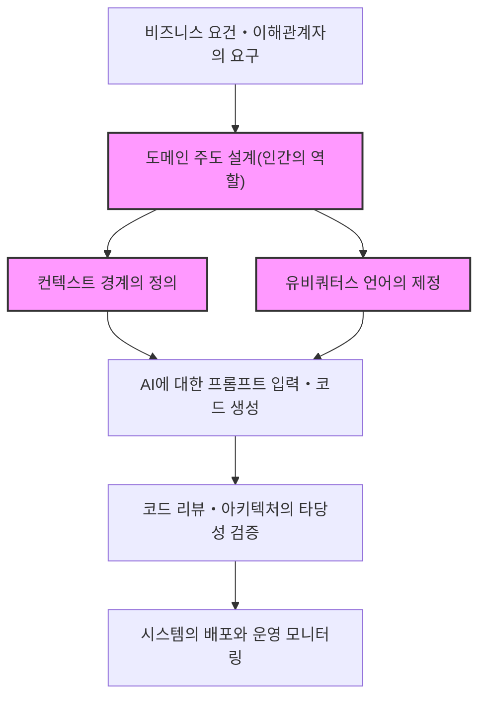
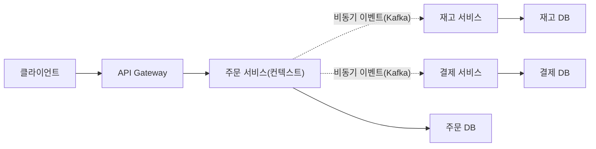
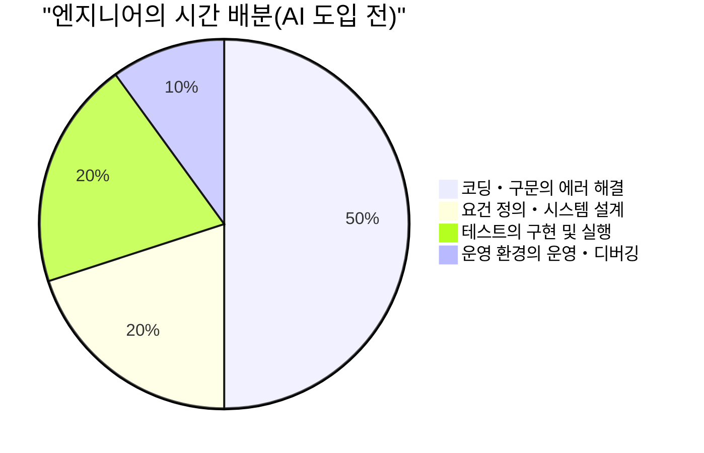
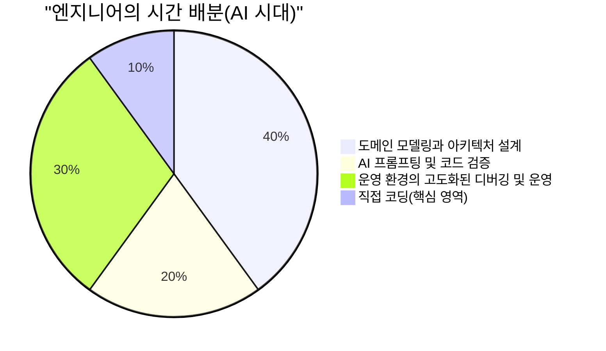

# AI가 코드를 작성하는 시대에 요구되는 '인간 고유의 엔지니어 스킬'

최근 Generative AI(생성형 AI)와 대규모 언어 모델(LLM)의 비약적인 발전으로, 소프트웨어 엔지니어링의 풍경은 극적으로 변화했습니다. GitHub Copilot이나 각종 AI 코딩 어시스턴트가 일상적으로 사용되면서, "자연어로 지시를 내리면 AI가 순식간에 코드를 생성한다"는 현상은 더 이상 미래의 SF가 아닌 오늘의 현실이 되었습니다.

이러한 시대에 많은 엔지니어들이 "내 일자리를 AI에게 빼앗기는 것은 아닐까" 하는 불안감을 갖는 것은 자연스러운 일입니다. 확실히 정형화된 CRUD 애플리케이션의 보일러플레이트 작성, 단순한 알고리즘의 구현, 혹은 잘 알려진 라이브러리의 API 호출과 같은 "단순한 코딩 작업(Typing Code)"은 급속도로 범용화되고 있습니다.

하지만 소프트웨어 엔지니어링의 본질은 "코드를 입력하는 것"이 아닙니다. 비즈니스의 과제를 기술을 통해 해결하고, 확장 가능하며 유지보수하기 쉬운 시스템을 구축하는 것입니다. 본 기사에서는 AI가 코드를 작성하는 시대일수록 그 가치가 더욱 높아지는 '인간 고유의 엔지니어 스킬'에 대해 LLM의 기술적인 한계, 도메인 주도 설계(DDD), 시스템 아키텍처, 분산 시스템의 디버깅 등 다양한 관점에서 매우 상세하고 기술적으로 깊이 있게 고찰해 봅니다.

---

## 1. 대규모 언어 모델(LLM)의 구조적인 한계를 이해하기

AI의 능력을 올바르게 평가하고, 인간이 어느 영역에서 가치를 발휘해야 할지 판별하기 위해서는, 먼저 AI(특히 LLM)의 구조적인 한계를 수리적・아키텍처적 관점에서 이해할 필요가 있습니다.

### 1.1 Transformer 아키텍처에서의 계산량과 컨텍스트의 한계

현재 LLM의 대부분은 Google이 2017년에 발표한 'Transformer' 아키텍처를 기반으로 하고 있습니다. Transformer의 핵심은 '자기 주의 메커니즘(Self-Attention Mechanism)'에 있습니다. 자기 주의 메커니즘은 입력된 시퀀스 내의 각 토큰이 다른 모든 토큰과 어느 정도 연관되어 있는지를 계산합니다.

이 어텐션의 계산식은 다음과 같이 표현됩니다.

$$ \text{Attention}(Q, K, V) = \text{softmax}\left(\frac{QK^T}{\sqrt{d_k}}\right)V $$

여기서 $Q$(Query), $K$(Key), $V$(Value)는 입력 시퀀스의 선형 변환이며, $d_k$는 키의 차원 수입니다.
이 계산에서 가장 중대한 제약이 되는 것이 행렬의 곱셈 $QK^T$에 수반되는 계산량입니다. 입력 시퀀스(토큰 수)를 $N$이라고 했을 때, 이 계산량은 시간적으로도 공간적(메모리)으로도 $O(N^2)$의 오더로 증가합니다.

$$ \text{Complexity} = O(N^2 \cdot d) $$

최근에는 FlashAttention과 같은 하드웨어 수준의 최적화나, Sparse Attention, 나아가 Mamba(State Space Models) 등의 선형 시간 $O(N)$으로 처리 가능한 대체 아키텍처 연구가 진행되고 있지만, 여전히 "무한한 컨텍스트를 완전히 이해하고 전체적으로 최적화된 출력을 생성하는 것"은 매우 어렵습니다.

더욱이 컨텍스트 윈도우를 물리적으로 확장할 수 있다고 해도, 'Lost in the Middle(중간 정보의 소실)'이라고 불리는 현상이 발생합니다. LLM은 프롬프트의 시작과 끝부분의 정보에 강하게 영향을 받기 쉬우며, 중간에 배치된 중요한 요건이나 제약을 무시해 버리는 경향이 있습니다. 수만 줄에 달하는 엔터프라이즈 시스템의 소스 코드 전체를 LLM에게 읽게 하고 "최적의 리팩터링을 해라"라고 지시해도, 국소적으로는 옳지만 전체적으로는 파탄 난 코드가 생성되는 이유가 바로 이 때문입니다.

### 1.2 확률론적 생성 모델의 특성과 '할루시네이션'

LLM의 본질은 입력된 컨텍스트(프롬프트)와 지금까지의 생성 결과를 바탕으로, 다음에 출현할 확률이 가장 높은 토큰을 예측하는 '확률론적 생성 모델'입니다.

$$ P(w_t | w_{1:t-1}) = \text{softmax}(W \cdot h_t) $$

모델은 방대한 훈련 데이터로부터 "단어의 통계적인 공기(Co-occurrence) 관계"를 학습하고 있을 뿐이며, 생성되는 코드의 "의미(Semantics)"나 "실행 결과가 현실 세계에 미치는 영향"을 이해하고 있는 것은 아닙니다. 이로 인해 발생하는 것이 '할루시네이션(환각)'입니다.
존재하지 않는 가상의 라이브러리 함수를 호출하거나, 타입이 미묘하게 일치하지 않는 변수를 전달하는 버그는, LLM이 "문법적으로 그럴듯한(확률이 높은) 토큰 열"을 생성한 결과에 불과합니다.

### 1.3 현실 세계 그라운딩(Grounding)의 부재

AI에게는 "물리적인 제약"이나 "실제 비즈니스의 제약"을 피부로 이해하는 능력(Grounding)이 없습니다. 예를 들어 "결제 처리의 레이턴시가 100ms 지연되면 전환율이 5% 하락한다"는 비즈니스의 현실이나, "이 레거시 DB는 심야 2시에 배치 처리가 실행되기 때문에 그 시간대의 트랜잭션은 타임아웃 되기 쉽다"는 등 환경 특유의 암묵지는 명시적으로 텍스트로 주어지지 않는 한 고려할 수 없습니다.

이러한 기술적・구조적 한계를 고려하면, AI는 "명확하게 정의된 좁은 스코프(함수, 클래스, 모듈)의 코드를 고속으로 생성하는 도구"로서는 매우 뛰어나지만, "모호한 요구사항으로부터 시스템 전체를 설계하고 현실 세계의 제약과 정합성을 맞추는 것"은 인간만이 할 수 있는 영역임을 알 수 있습니다.

---

## 2. 인간 고유의 스킬 ①: 모호한 요구사항에서 '진정한 과제' 추출

소프트웨어 개발에 있어서 가장 큰 난관은 코드를 작성하는 것 자체가 아닙니다.
소프트웨어 공학의 고전 『맨먼스 미신』의 저자인 프레더릭 브룩스는 다음과 같이 말했습니다.

> "The hardest single part of building a software system is deciding precisely what to build."
> (소프트웨어 시스템을 구축할 때 가장 어려운 단일 작업은, 무엇을 구축할지 정확하게 결정하는 것이다.)

비기술적인 이해관계자(경영진, 영업 부서, 고객)는 자신들이 진정으로 원하는 것을 언어화하지 못하는 경우가 대부분입니다. "AI를 활용하여 매출을 올리는 시스템을 만들어 달라", "버튼 하나만 누르면 모든 것이 자동화되는 화면을 원한다"와 같이, 지극히 모호하고 모순을 내포한 요구가 일상적으로 날아옵니다.

AI에게 프롬프트로 "매출을 올리는 시스템의 코드를 작성해 줘"라고 입력해도, 쓸모 있는 시스템은 나오지 않습니다. 엔지니어에게 요구되는 것은 다음과 같은 프로세스입니다.

1. **도메인 심층 탐구**: 이해관계자의 말 이면에 있는 '진정한 비즈니스 과제'를 대화를 통해 끌어낸다.
2. **요구사항 스코프 정의**: 기술적인 실현 가능성과 비용(ROI)을 저울질하여 '하지 않을 것'을 결정한다.
3. **사양의 형식화**: 모호한 요구를 AI가 이해할 수 있는 명확한 논리적 제약(프롬프트나 아키텍처 설계도)으로 변환한다.

이러한 '인간 대 인간의 고도화된 커뮤니케이션과 협상'은 AI가 결코 대체할 수 없는, 사람에 의존적이고 가치 높은 스킬입니다.

---

## 3. 인간 고유의 스킬 ②: 도메인 주도 설계(DDD)와 모델링

요구사항을 끌어낸 후, 이를 소프트웨어의 구조로 녹여내기 위한 가장 강력한 무기가 '도메인 주도 설계(Domain-Driven Design: DDD)'입니다. AI가 국소적인 코드를 자동 생성하게 되면 될수록, 시스템 전체의 '경계'를 어디에 그을 것인가 하는 DDD의 개념이 극히 중요해집니다.

### 3.1 유비쿼터스 언어(Ubiquitous Language)의 제정

시스템 개발에 있어서 비즈니스 측과 개발 측에서 '단어의 의미'가 어긋나 있으면, AI는 잘못된 문맥에서 코드를 생성합니다. 예를 들어 '사용자'라는 단어가 마케팅 부서에게는 '리드(잠재 고객)'를 가리키고, 고객 지원 부서에게는 '계약이 완료된 계정'을 가리키는 경우가 있습니다.
인간 엔지니어는 프로젝트 전체에서 통일된 '유비쿼터스 언어'를 제정하고, 코드의 클래스 이름, 메서드 이름, AI를 향한 프롬프트에 이르기까지 그 언어를 철저하게 적용해야 합니다.

### 3.2 컨텍스트 경계(Bounded Context)의 설계

거대한 시스템을 하나의 모델로 표현하려고 하면 반드시 파탄 납니다. DDD에서는 시스템을 의미 있는 경계(Bounded Context)로 분할합니다.
예를 들어 EC 사이트에서 '상품(Product)'이라는 개념은 카탈로그(표시) 컨텍스트와 재고(관리) 컨텍스트에서는 가져야 할 속성이나 행위가 완전히 다릅니다.

인간 아키텍트가 올바른 컨텍스트 경계를 긋고, 각 컨텍스트마다 독립된 프롬프트나 사양을 AI에게 부여함으로써 비로소 AI는 "올바른 도메인 지식에 기반한 코드"를 생성할 수 있습니다.

아래 그림은 AI 시대의 DDD 접근 방식과 역할 분담을 보여줍니다.

AI에게 "시스템 전체를 만들어 줘"라고 지시하는 것이 아니라, 인간이 정의한 '컨텍스트 경계'의 내부에 한정하여 AI에게 구현을 위임하는 것. 이것이 향후 소프트웨어 개발의 기본 패러다임이 됩니다.

---

## 4. 인간 고유의 스킬 ③: 분산 시스템의 아키텍처 설계와 스케일

현대의 소프트웨어는 단일 서버에서 동작하는 모놀리스에서, 클라우드 네이티브한 마이크로서비스 아키텍처, 이벤트 주도 아키텍처로 진화하고 있습니다. 이러한 분산 시스템의 설계는 국소적인 로직의 최적화밖에 할 수 없는 AI에게는 매우 어려운 영역입니다.

### 4.1 CAP 정리와 트레이드오프의 판단

분산 시스템을 설계할 때, 엔지니어는 항상 'CAP 정리'에 직면합니다. CAP 정리란 분산 시스템은 아래의 3가지 특성 중 동시에 2가지만을 만족시킬 수 있다는 원칙입니다.

- **Consistency(일관성)**: 모든 노드에서 동시에 같은 데이터가 보이는가
- **Availability(가용성)**: 노드의 일부에 장애가 발생해도 시스템이 계속해서 응답하는가
- **Partition Tolerance(분할 내성)**: 네트워크 분할이 발생해도 시스템이 계속해서 동작하는가

$$ P(\text{Availability} \cup \text{Consistency}) | \text{PartitionTolerance} $$

실제 네트워크에서는 분할(Partition)을 피할 수 없기 때문에, 엔지니어는 "이 결제 시스템은 Consistency를 우선하여 장애 발생 시 서비스를 중단한다(CP)", "이 SNS의 타임라인은 Availability를 우선하여 일시적인 데이터 불일치를 허용한다(AP)"와 같은, 비즈니스 요건과 직결되는 엄격한 트레이드오프 판단을 내려야 합니다.

AI는 "C를 우선하는 코드"나 "A를 우선하는 코드"를 작성할 수는 있어도, "어느 쪽을 우선해야 하는가"라는 비즈니스 리스크를 포함한 결정을 자율적으로 내릴 수는 없습니다.

### 4.2 비동기 통신과 결과적 일관성(Eventual Consistency)

시스템의 규모가 커지면 서비스 간의 연동은 REST API에 의한 동기 통신에서 메시지 큐(Kafka, RabbitMQ 등)를 활용한 비동기 통신으로 이행합니다. 여기서의 데이터 일관성은 즉각적 일관성에서 '결과적 일관성(Eventual Consistency)'으로 변화합니다.
Saga 패턴이나 CQRS(Command Query Responsibility Segregation)와 같은 고도화된 아키텍처 패턴을 어느 타이밍에 도입해야 할까. 이러한 복잡한 의사결정과 시스템 전체의 청사진을 그리는 것은 그야말로 시니어 엔지니어의 진면목입니다.

---

## 5. 인간 고유의 스킬 ④: 복잡한 시스템의 디버깅과 트러블슈팅

AI가 생성한 코드가 많아지면 많아질수록, "아무도 완전히 이해하지 못하는 코드"가 프로덕션 환경에서 동작할 위험이 높아집니다. 평상시에는 문제없이 동작하더라도, 장애 발생 시의 트러블슈팅에서 인간 엔지니어의 진가가 드러납니다.

### 5.1 옵저버빌리티(가관측성)의 설계

시스템 장애를 신속하게 해결하기 위해서는 AI에게 에러 로그를 붙여넣는 것만으로는 불충분합니다. 마이크로서비스 환경에서는 1개의 요청이 수십 개의 서비스를 가로지릅니다.
엔지니어는 로그(Logs), 메트릭(Metrics), 트레이스(Traces)라는 '옵저버빌리티의 3원칙'을 시스템에 적절하게 편입시켜야 합니다. OpenTelemetry 등을 활용하여 분산 트레이싱을 통해 "어떤 서비스의 어떤 데이터베이스 쿼리에서 지연이 발생하고 있는지"를 특정할 수 있는 기반을 만드는 것은 인간의 역할입니다.

### 5.2 환경 의존성 버그와 카오스 엔지니어링

"로컬 환경이나 테스트 환경에서는 재현되지 않지만, 운영 환경의 피크 타임에만 발생하는 버그"——예를 들어 메모리 누수, 데이터베이스의 교착 상태(Deadlock), 커넥션 풀의 고갈, 네트워크의 패킷 손실과 같은 문제는 소스 코드의 정적 분석만으로는 결코 찾을 수 없습니다.

인간 엔지니어는 운영 환경의 메트릭을 주시하며 가설을 세우고, 스레드 덤프나 힙 덤프를 분석하여 병목 현상을 특정합니다. AI는 터미널을 두드려 운영 서버의 프로세스를 직접 프로파일링할 수 없습니다(보안 요구사항 측면에서도 허용해서는 안 됩니다).
시스템이 복잡해질수록 물리적 인프라, 네트워크 프로토콜, OS의 커널 튜닝과 같은 "로우 레벨의 지식"과 "직관적인 가설 추론 능력"을 가진 엔지니어의 가치는 급상승합니다.

---

## 6. AI 시대 엔지니어의 가치 함수와 시간 배분(Time Allocation)

지금까지 살펴본 바와 같이, AI 시대에 엔지니어에게 요구되는 스킬 세트는 큰 패러다임 시프트를 겪고 있습니다. 이를 수식으로 모델화하면 엔지니어가 창출하는 가치($V$)는 다음과 같이 표현할 수 있을 것입니다.

$$ V = \left( \sum_{i=1}^{n} \text{DomainKnowledge}_i + \text{ArchitectureSkill} + \text{ProblemSolving} \right) \times \text{AI\_Leverage}^{\alpha} $$

기존의 "코딩 속도"나 "구문의 암기력"은 이 수식에서 배제되어 있습니다. 그 대신, 깊은 도메인 지식, 아키텍처 설계 능력, 그리고 복잡한 과제 해결 능력의 '총합'에 AI를 활용하는 레버리지($\text{AI\_Leverage}^{\alpha}$)가 곱해짐으로써 지수함수적인 가치를 만들어내는 구조로 되어 있습니다.

이러한 패러다임 시프트는 엔지니어의 일상적인 시간 사용(타임 얼로케이션)에도 명확하게 나타납니다.

AI 시대에 엔지니어는 "코드 타이피스트"에서 "시스템 전체를 오케스트레이션하는 지휘자"로 승화합니다. AI가 대량의 코드를 작성하기 때문에, 그 코드가 올바른 방향을 향하고 있는지, 보안 요구사항을 충족하고 있는지, 시스템 전체의 아키텍처와 정합성을 이루고 있는지를 감시하고 통제하는 "리뷰어" 및 "아키텍트"로서의 역할이 주니어층부터 시니어층까지 모든 엔지니어에게 요구될 것입니다.

---

## 7. 맺음말: 진화를 거부하는 대신 파도를 타고 넘기

"AI가 코드를 작성하는 시대"는 엔지니어에게 위협이 아니라 역사상 최대의 기회입니다. 과거 어셈블리 언어에서 C 언어로의 전환이 일어났고, 메모리 포인터 관리에서 Java의 가비지 컬렉션으로의 진화가 일어났듯이, AI에 의한 코드 생성은 "추상화의 레벨이 한 단계 올라간 것"에 불과합니다.

앞으로의 엔지니어는 특정 프로그래밍 언어의 세세한 사양이나 프레임워크의 버전업에 일희일비하는 것이 아니라, **"비즈니스 과제는 무엇인가", "데이터를 어떻게 분할하고 어떻게 연동시킬 것인가", "시스템이 다운되었을 때 어떻게 빠르게 복구할 정인가"**와 같은, 보다 본질적이고 인간다운 고차원적인 문제 해결에 리소스를 집중할 수 있습니다.

진정한 엔지니어란 코드를 작성하는 사람이 아니라 과제를 해결하는 사람입니다.
도메인 모델링, 확장 가능한 아키텍처 설계, 이해관계자와의 커뮤니케이션, 그리고 복잡한 시스템의 디버깅. 이러한 '인간 고유의 엔지니어 스킬'을 계속해서 갈고닦는 사람에게 AI는 일자리를 빼앗는 적이 아니라, 자신의 창조성과 생산성을 수십 배로 확장해 주는 최강의 파트너가 될 것입니다.
