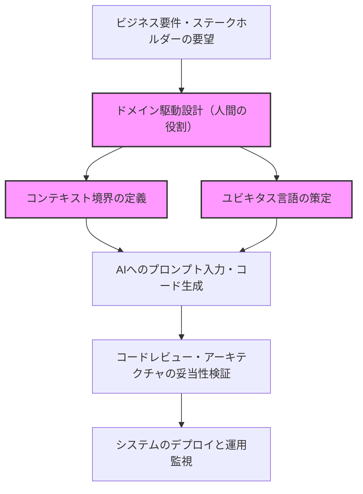
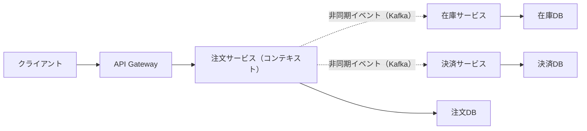
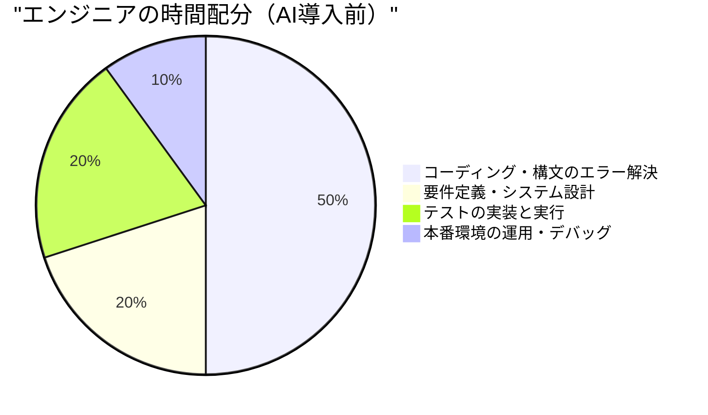
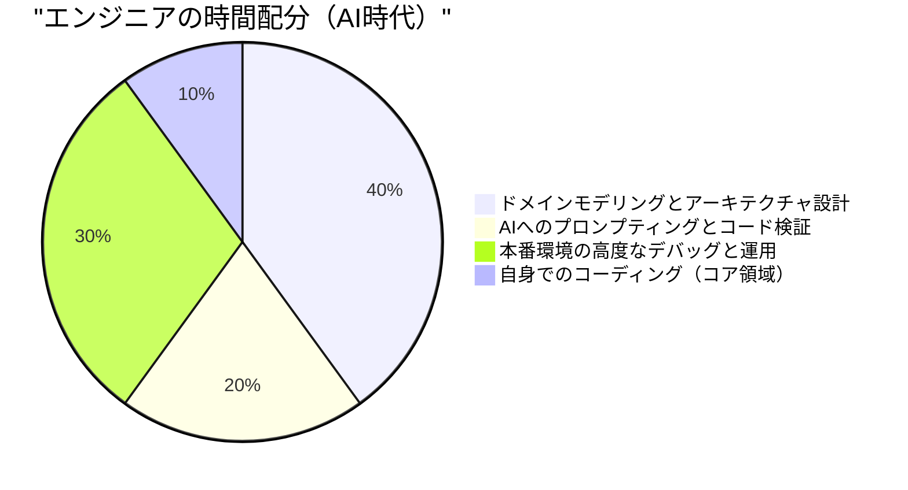

# AIがコードを書く時代に求められる「人間ならではのエンジニアスキル」

近年、Generative AI（生成AI）や大規模言語モデル（LLM）の飛躍的な進化により、ソフトウェアエンジニアリングの風景は劇的に変化しました。GitHub Copilotや各種AIコーディングアシスタントが日常的に利用されるようになり、「自然言語で指示を出せば、AIが瞬時にコードを生成する」という事象は、もはや未来のSFではなく今日の現実となっています。

このような時代において、多くのエンジニアが「自分の仕事はAIに奪われてしまうのではないか」という不安を抱くのは自然なことです。確かに、定型的なCRUDアプリケーションのボイラープレート作成、単純なアルゴリズムの実装、あるいはよく知られたライブラリのAPI呼び出しといった「単なるコーディング作業（Typing Code）」は急速にコモディティ化しています。

しかし、ソフトウェアエンジニアリングの本質は「コードを打ち込むこと」ではありません。ビジネスの課題を技術によって解決し、スケーラブルで保守可能なシステムを構築することです。本記事では、AIがコードを書く時代にこそ価値が高まる「人間ならではのエンジニアスキル」について、LLMの技術的な限界、ドメイン駆動設計（DDD）、システムアーキテクチャ、分散システムのデバッグといった観点から、極めて詳細かつ技術的に深掘りして考察します。

---

## 1. 大規模言語モデル（LLM）の構造的な限界を理解する

AIの能力を正しく評価し、人間がどの領域で価値を発揮すべきかを見極めるためには、まずAI（特にLLM）の構造的な限界を数理的・アーキテクチャ的な観点から理解する必要があります。

### 1.1 Transformerアーキテクチャにおける計算量とコンテキストの限界

現在のLLMの大部分は、Googleが2017年に発表した「Transformer」アーキテクチャに基づいています。Transformerの核心は「自己アテンション機構（Self-Attention Mechanism）」にあります。自己アテンション機構は、入力されたシーケンス内の各トークンが、他のすべてのトークンとどの程度関連しているかを計算します。

このアテンションの計算式は次のように表されます。

$$ \text{Attention}(Q, K, V) = \text{softmax}\left(\frac{QK^T}{\sqrt{d_k}}\right)V $$

ここで、$Q$（Query）、$K$（Key）、$V$（Value）は入力シーケンスの線形変換であり、$d_k$はキーの次元数です。
この計算において最も重大な制約となるのが、行列の乗算 $QK^T$ に伴う計算量です。入力シーケンス（トークン数）を $N$ とした場合、この計算量は時間的にも空間的（メモリ）にも $O(N^2)$ のオーダーで増大します。

$$ \text{Complexity} = O(N^2 \cdot d) $$

近年では、FlashAttentionのようなハードウェアレベルの最適化や、Sparse Attention、さらにはMamba（State Space Models）などの線形時間 $O(N)$ で処理可能な代替アーキテクチャの研究が進んでいますが、依然として「無限のコンテキストを完全に理解し、全体最適化された出力を生成する」ことは極めて困難です。

さらに、コンテキストウィンドウを物理的に拡大できたとしても、「Lost in the Middle（中間情報の喪失）」と呼ばれる現象が発生します。LLMはプロンプトの先頭と末尾の情報に強く影響を受けやすく、中間に配置された重要な要件や制約を無視してしまう傾向があります。数万行に及ぶエンタープライズシステムのソースコード全体をLLMに読み込ませて「最適なリファクタリングをせよ」と指示しても、局所的には正しいが全体としては破綻しているコードが生成されるのはこのためです。

### 1.2 確率論的生成モデルの特性と「ハルシネーション」

LLMの本質は、入力されたコンテキスト（プロンプト）とこれまでの生成結果に基づいて、次に出現する確率が最も高いトークンを予測する「確率論的生成モデル」です。

$$ P(w_t | w_{1:t-1}) = \text{softmax}(W \cdot h_t) $$

モデルは膨大な訓練データから「言葉の統計的な共起関係」を学習しているだけであり、生成されるコードの「意味（Semantics）」や「実行結果の実世界での影響」を理解しているわけではありません。これにより発生するのが「ハルシネーション（幻覚）」です。
存在しない架空のライブラリ関数を呼び出したり、型が微妙に一致しない変数を渡したりするバグは、LLMが「文法的にそれらしい（確率が高い）トークン列」を生成した結果に過ぎません。

### 1.3 実世界グラウンディング（Grounding）の欠如

AIには「物理的な制約」や「実ビジネスの制約」を肌感覚で理解する能力（Grounding）がありません。例えば、「決済処理のレイテンシが100ms遅れると、コンバージョン率が5%低下する」というビジネスの現実や、「このレガシーDBは深夜2時にバッチ処理が走るため、その時間帯のトランザクションはタイムアウトしやすい」といった環境特有の暗黙知を、明示的にテキストとして与えられない限り考慮できません。

これらの技術的・構造的な限界を踏まえると、AIは「明確に定義された狭いスコープ（関数、クラス、モジュール）のコードを高速に生成するツール」としては極めて優秀ですが、「曖昧な要件からシステム全体を設計し、現実世界の制約と整合させる」ことは人間にしかできない領域であることがわかります。

---

## 2. 人間ならではのスキル①：曖昧な要求からの「真の課題」抽出

ソフトウェア開発における最大の難関は、コードを書くこと自体ではありません。
ソフトウェア工学の古典『人月の神話』の著者であるフレデリック・ブルックスは、次のように述べています。

> "The hardest single part of building a software system is deciding precisely what to build."
> （ソフトウェアシステムを構築する上で最も困難な部分は、何を構築するかを正確に決定することである。）

非技術的なステークホルダー（経営陣、営業部門、顧客）は、自分たちが本当に欲しいものを言語化できていないことがほとんどです。「AIを使って売上を上げるシステムを作ってほしい」「ボタンを一つ押すだけで全部自動化される画面が欲しい」といった、極めて曖昧で矛盾を孕んだ要求が日常的に飛んできます。

AIにプロンプトとして「売上を上げるシステムのコードを書いて」と入力しても、使い物になるシステムは出てきません。エンジニアに求められるのは以下のプロセスです。

1. **ドメインの深掘り**：ステークホルダーの言葉の裏にある「本当のビジネス課題」を対話を通じて引き出す。
2. **要件のスコープ定義**：技術的な実現可能性とコスト（ROI）を天秤にかけ、「やらないこと」を決める。
3. **仕様の形式化**：曖昧な要求を、AIが理解可能な明確な論理的制約（プロンプトやアーキテクチャ設計図）に変換する。

この「人間対人間の高度なコミュニケーションとネゴシエーション」は、AIには決して代替できない属人的かつ価値の高いスキルです。

---

## 3. 人間ならではのスキル②：ドメイン駆動設計（DDD）とモデリング

要件を引き出した後、それをソフトウェアの構造に落とし込むための最も強力な武器が「ドメイン駆動設計（Domain-Driven Design: DDD）」です。AIが局所的なコードを自動生成するようになればなるほど、システム全体の「境界」をどこに引くかというDDDの概念が極めて重要になります。

### 3.1 ユビキタス言語（Ubiquitous Language）の策定

システム開発において、ビジネス側と開発側で「言葉の意味」がずれていると、AIは間違った文脈でコードを生成します。例えば「ユーザー」という単語が、マーケティング部門にとっては「リード（見込み客）」を指し、カスタマーサポートにとっては「契約済みのアカウント」を指す場合があります。
人間のエンジニアは、プロジェクト全体で統一された「ユビキタス言語」を策定し、コードのクラス名、メソッド名、AIへのプロンプトに至るまで、その言語を徹底させる必要があります。

### 3.2 コンテキスト境界（Bounded Context）の設計

巨大なシステムを一つのモデルで表現しようとすると必ず破綻します。DDDでは、システムを意味のある境界（Bounded Context）に分割します。
例えば、ECサイトにおいて「商品（Product）」という概念は、カタログ（表示）コンテキストと、在庫（管理）コンテキストでは、持つべき属性や振る舞いが全く異なります。

人間のアーキテクトが正しいコンテキスト境界を引き、各コンテキストごとに独立したプロンプトや仕様をAIに与えることで、初めてAIは「正しいドメイン知識に基づいたコード」を生成できます。

以下の図は、AI時代におけるDDDのアプローチと役割分担を示しています。

AIに「システム全体を作って」と指示するのではなく、人間が定義した「コンテキスト境界」の内部に限定してAIに実装を委譲する。これが、今後のソフトウェア開発の基本パラダイムとなります。

---

## 4. 人間ならではのスキル③：分散システムのアーキテクチャ設計とスケール

現代のソフトウェアは、単一のサーバーで動くモノリスから、クラウドネイティブなマイクロサービスアーキテクチャ、イベント駆動アーキテクチャへと進化しています。このような分散システムの設計は、局所的なロジックの最適化しかできないAIにとっては非常に困難な領域です。

### 4.1 CAP定理とトレードオフの判断

分散システムを設計する際、エンジニアは常に「CAP定理」に直面します。CAP定理とは、分散システムは以下の3つの特性のうち、同時に2つしか満たすことができないという原則です。

- **Consistency（一貫性）**: すべてのノードで同時に同じデータが見えるか
- **Availability（可用性）**: ノードの一部に障害が起きてもシステムが応答し続けるか
- **Partition Tolerance（分断耐性）**: ネットワークの分断が発生してもシステムが動作し続けるか

$$ P(\text{Availability} \cup \text{Consistency}) | \text{PartitionTolerance} $$

実際のネットワークでは分断（Partition）は避けられないため、エンジニアは「この決済システムはConsistencyを優先して、障害時はサービスを停止する（CP）」「このSNSのタイムラインはAvailabilityを優先して、一時的なデータの不整合を許容する（AP）」といった、ビジネス要件に直結するシビアなトレードオフ判断を下さなければなりません。

AIは「Cを優先するコード」や「Aを優先するコード」を書くことはできても、「どちらを優先すべきか」というビジネスリスクを含んだ決定を自律的に行うことはできません。

### 4.2 非同期通信と結果整合性（Eventual Consistency）

システムが大規模になると、サービス間の連携はREST APIによる同期通信から、メッセージキュー（Kafka, RabbitMQなど）を用いた非同期通信へと移行します。ここでのデータ整合性は、即時整合性から「結果整合性（Eventual Consistency）」へと変化します。
SagaパターンやCQRS（Command Query Responsibility Segregation）といった高度なアーキテクチャパターンをどのタイミングで導入するべきか。これらの複雑な意思決定とシステム全体の青写真を描くことは、まさにシニアエンジニアの真骨頂です。

---

## 5. 人間ならではのスキル④：複雑なシステムのデバッグとトラブルシューティング

AIが生成したコードが多くなればなるほど、「誰も完全に理解していないコード」がプロダクション環境で動くリスクが高まります。平時は問題なく動いていても、障害発生時のトラブルシューティングにおいて人間のエンジニアの真価が問われます。

### 5.1 オブザーバビリティ（可観測性）の設計

システム障害を迅速に解決するためには、AIにエラーログを貼り付けるだけでは不十分です。マイクロサービス環境では、1つのリクエストが数十のサービスを横断します。
エンジニアは、ログ（Logs）、メトリクス（Metrics）、トレース（Traces）の「オブザーバビリティの3本柱」をシステムに適切に組み込む必要があります。OpenTelemetryなどを活用し、分散トレーシングによって「どのサービスのどのデータベースクエリで遅延が発生しているのか」を特定できる基盤を作るのは人間の役割です。

### 5.2 環境依存のバグとカオスエンジニアリング

「ローカル環境やテスト環境では再現しないが、本番環境のピークタイムにのみ発生するバグ」——例えば、メモリリーク、データベースのデッドロック、コネクションプールの枯渇、ネットワークのパケットロスといった問題は、ソースコードの静的解析だけでは決して見つかりません。

人間のエンジニアは、本番環境のメトリクスを睨みながら仮説を立て、スレッドダンプやヒープダンプを解析し、ボトルネックを特定します。AIはターミナルを叩いて本番サーバーのプロセスを直接プロファイリングすることはできません（セキュリティ要件としても許可すべきではありません）。
システムが複雑化すればするほど、物理インフラ、ネットワークプロトコル、OSのカーネルチューニングといった「低レイヤーの知識」と「直感的な仮説推論能力」を持つエンジニアの価値は急上昇します。

---

## 6. AI時代のエンジニアの価値関数とタイムアロケーション

ここまで述べてきたように、AI時代においてエンジニアに求められるスキルセットは大きくパラダイムシフトを起こしています。これを数式でモデル化すると、エンジニアが創出する価値（$V$）は次のように表現できるでしょう。

$$ V = \left( \sum_{i=1}^{n} \text{DomainKnowledge}_i + \text{ArchitectureSkill} + \text{ProblemSolving} \right) \times \text{AI\_Leverage}^{\alpha} $$

従来の「コーディング速度」や「構文の記憶力」は、この数式からは排除されています。その代わり、深いドメイン知識、アーキテクチャ設計能力、そして複雑な課題解決能力の「総和」に対して、AIを使いこなすレバレッジ（$\text{AI\_Leverage}^{\alpha}$）が掛け合わされることで、指数関数的な価値を生み出す構造になっています。

このパラダイムシフトは、エンジニアの日常的な時間の使い方（タイムアロケーション）にも明確に表れます。

AI時代において、エンジニアは「コードのタイピスト」から、「システム全体をオーケストレーションする指揮者」へと昇華します。AIが大量のコードを記述するからこそ、そのコードが正しい方向を向いているか、セキュリティ要件を満たしているか、システム全体のアーキテクチャと整合しているかを監視・統制する「レビューア」および「アーキテクト」としての役割が、ジュニア層からシニア層まで全エンジニアに求められるようになります。

---

## 7. おわりに：進化を拒むのではなく、波を乗りこなす

「AIがコードを書く時代」は、エンジニアにとって脅威ではなく、歴史上最大のチャンスです。かつてアセンブリ言語からC言語への移行が起こり、メモリのポインタ管理からJavaのガベージコレクションへの進化が起こったように、AIによるコード生成は「抽象化のレベルが一つ上がった」に過ぎません。

これからのエンジニアは、特定のプログラミング言語の細かな仕様やフレームワークのバージョンアップに一喜一憂するのではなく、**「ビジネスの課題は何か」「データをどう分割し、どう連携させるか」「システムが停止した際にどう素早く復旧させるか」**といった、より本質的で、人間らしい高次な問題解決にリソースを集中させることができます。

真のエンジニアとは、コードを書く人ではなく、課題を解決する人です。
ドメインモデリング、スケーラブルなアーキテクチャ設計、ステークホルダーとのコミュニケーション、そして複雑なシステムのデバッグ。これら「人間ならではのエンジニアスキル」を磨き続ける者にとって、AIは仕事を奪う敵ではなく、自らの創造性と生産性を何十倍にも拡張してくれる最強のパートナーとなるはずです。
