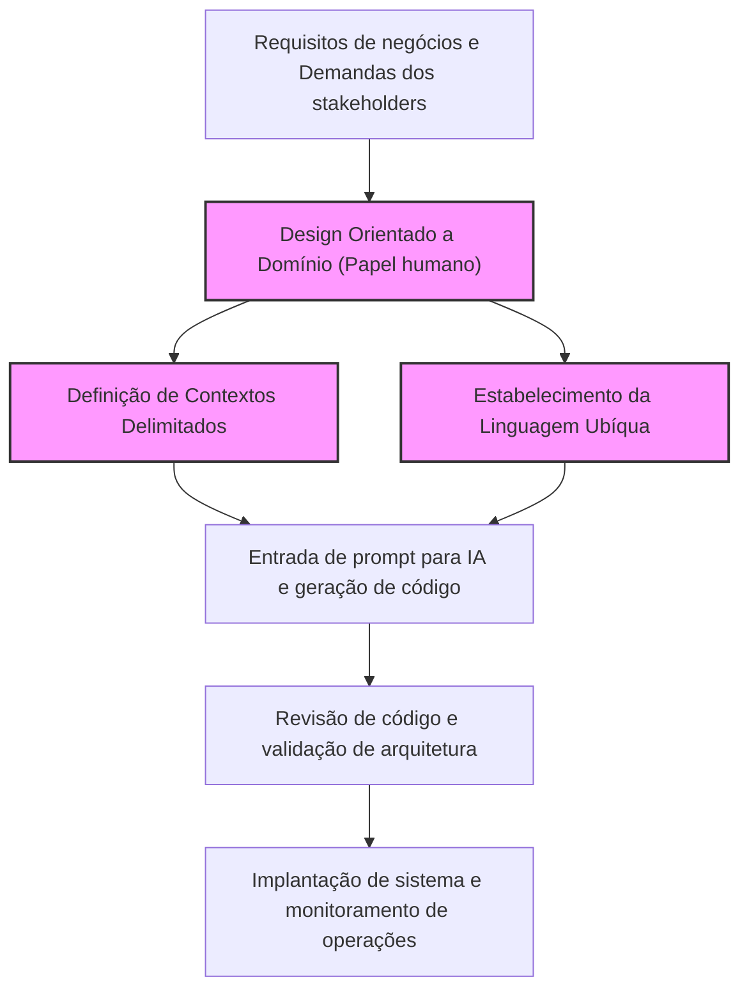
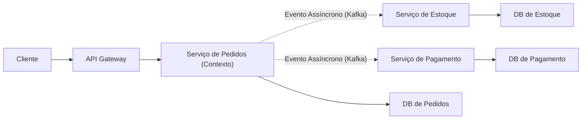
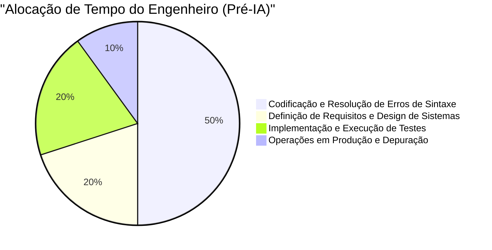
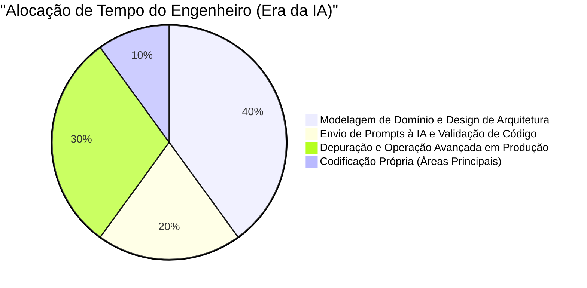

# Habilidades de engenheiro "exclusivas dos humanos" necessárias na era em que a IA escreve código

Nos últimos anos, com a rápida evolução da IA Generativa e dos Grandes Modelos de Linguagem (LLM), o cenário da engenharia de software mudou drasticamente. O GitHub Copilot e vários assistentes de codificação de IA passaram a ser usados diariamente, e o fenômeno de "se você der instruções em linguagem natural, a IA gerará código instantaneamente" não é mais uma ficção científica do futuro, mas a realidade de hoje.

Nessa era, é natural que muitos engenheiros se sintam ansiosos, pensando: "Meu trabalho será roubado pela IA?". Certamente, o "simples ato de codificar (Typing Code)", como criar boilerplate para aplicações CRUD de rotina, implementar algoritmos simples ou chamar APIs de bibliotecas conhecidas, está se tornando comoditizado rapidamente.

No entanto, a essência da engenharia de software não é "digitar código". É resolver problemas de negócios por meio da tecnologia e construir sistemas escaláveis e de fácil manutenção. Neste artigo, exploraremos as "habilidades de engenheiro exclusivas dos humanos" cujo valor aumenta justamente na era em que a IA escreve código, aprofundando de forma muito detalhada e técnica a partir de perspectivas como os limites dos LLMs, Design Orientado a Domínio (DDD), arquitetura de sistemas e depuração de sistemas distribuídos.

---

## 1. Compreendendo as limitações estruturais dos Grandes Modelos de Linguagem (LLM)

Para avaliar corretamente as capacidades da IA e determinar em quais áreas os humanos devem demonstrar seu valor, primeiro precisamos entender as limitações estruturais da IA (especialmente dos LLMs) sob uma perspectiva matemática e arquitetônica.

### 1.1 Limites de complexidade computacional e de contexto na arquitetura Transformer

A maior parte dos LLMs atuais baseia-se na arquitetura "Transformer" introduzida pelo Google em 2017. O núcleo do Transformer está no "Mecanismo de Autoatenção (Self-Attention Mechanism)". Esse mecanismo calcula o grau de relação entre cada token em uma sequência de entrada e todos os outros tokens.

A fórmula de cálculo para esta atenção é expressa da seguinte forma:

$$ \text{Attention}(Q, K, V) = \text{softmax}\left(\frac{QK^T}{\sqrt{d_k}}\right)V $$

Aqui, $Q$ (Query), $K$ (Key) e $V$ (Value) são transformações lineares da sequência de entrada, e $d_k$ é a dimensão da chave.
A restrição mais grave nesse cálculo é a complexidade computacional associada à multiplicação de matrizes $QK^T$. Se a sequência de entrada (número de tokens) for $N$, essa complexidade computacional aumenta na ordem de $O(N^2)$, tanto em tempo quanto em espaço (memória).

$$ \text{Complexity} = O(N^2 \cdot d) $$

Nos últimos anos, avanços têm sido feitos em otimizações no nível de hardware, como FlashAttention, e na pesquisa de arquiteturas alternativas capazes de processamento em tempo linear $O(N)$, como Sparse Attention e Mamba (State Space Models). No entanto, continua sendo extremamente difícil "compreender perfeitamente um contexto infinito e gerar uma saída otimizada globalmente".

Além disso, mesmo que a janela de contexto possa ser expandida fisicamente, ocorre um fenômeno chamado "Lost in the Middle (Perda de informação no meio)". Os LLMs são fortemente influenciados pelas informações no início e no final do prompt, e tendem a ignorar requisitos e restrições importantes localizados no meio. É por isso que, ao fornecer o código-fonte inteiro de um sistema corporativo de dezenas de milhares de linhas a um LLM e pedir "Faça a refatoração ideal", o resultado muitas vezes é um código localmente correto, mas quebrado no contexto geral.

### 1.2 Características dos modelos generativos probabilísticos e as "Alucinações"

A essência de um LLM é um "modelo generativo probabilístico" que prevê o token com a maior probabilidade de aparecer em seguida, com base no contexto de entrada (prompt) e nos resultados gerados até o momento.

$$ P(w_t | w_{1:t-1}) = \text{softmax}(W \cdot h_t) $$

O modelo apenas aprende "relações estatísticas de co-ocorrência de palavras" a partir de uma enorme quantidade de dados de treinamento; ele não entende a "semântica (Semantics)" do código gerado nem os "impactos da execução no mundo real". O resultado disso são as "Alucinações (Hallucinations)".
Bugs como chamar uma função de biblioteca fictícia que não existe ou passar uma variável com um tipo que não corresponde perfeitamente, são simplesmente o resultado do LLM gerando "uma sequência de tokens que parece gramaticalmente plausível (com alta probabilidade)".

### 1.3 A falta de ancoragem no mundo real (Grounding)

A IA não tem a capacidade de entender intuitivamente as "restrições físicas" ou "restrições reais de negócios" (Grounding). Por exemplo, ela não consegue levar em consideração realidades de negócios como "um atraso de 100ms no processamento de pagamentos reduz a taxa de conversão em 5%", ou o conhecimento tácito específico de um ambiente como "esse banco de dados legado executa processos em lote às 2 da manhã, então transações durante esse período têm maior chance de timeout", a menos que isso seja explicitamente fornecido como texto.

Considerando essas limitações técnicas e estruturais, fica claro que a IA é uma ferramenta excelente para "gerar código rapidamente para escopos estreitos e claramente definidos (funções, classes, módulos)", mas "projetar um sistema inteiro a partir de requisitos ambíguos e alinhá-lo com as restrições do mundo real" é uma tarefa que apenas humanos podem realizar.

---

## 2. Habilidade humana ①: Extrair o "verdadeiro problema" a partir de requisitos ambíguos

O maior desafio no desenvolvimento de software não é o ato de escrever o código em si.
Frederick Brooks, autor do clássico da engenharia de software "O Mítico Homem-Mês", afirma:

> "The hardest single part of building a software system is deciding precisely what to build."
> (A parte mais difícil na construção de um sistema de software é decidir precisamente o que construir.)

Na maioria das vezes, os stakeholders não técnicos (diretoria, vendas, clientes) não conseguem verbalizar o que realmente precisam. Exigências extremamente ambíguas e contraditórias como "Quero que você construa um sistema usando IA para aumentar as vendas" ou "Quero uma tela onde tudo é automatizado apertando um único botão" chegam todos os dias.

Mesmo se você colocar no prompt da IA "Escreva o código de um sistema que aumente as vendas", nenhum sistema útil será produzido. O processo exigido dos engenheiros é o seguinte:

1. **Aprofundamento no Domínio**: Extrair os "verdadeiros problemas de negócios" por trás das palavras dos stakeholders através do diálogo.
2. **Definição do escopo dos requisitos**: Ponderar a viabilidade técnica e o custo (ROI) para decidir o que "não fazer".
3. **Formalização das especificações**: Converter exigências ambíguas em restrições lógicas claras que a IA possa entender (prompts ou diagramas de arquitetura).

Esta "comunicação e negociação de alto nível entre humanos" é uma habilidade altamente valiosa e inerente às pessoas, que a IA nunca será capaz de substituir.

---

## 3. Habilidade humana ②: Design Orientado a Domínio (DDD) e Modelagem

Depois de extrair os requisitos, a arma mais poderosa para refleti-los na estrutura do software é o "Design Orientado a Domínio (Domain-Driven Design: DDD)". Quanto mais a IA gera código local automaticamente, mais crítico se torna o conceito do DDD de onde traçar as "fronteiras" do sistema como um todo.

### 3.1 Estabelecimento de uma Linguagem Ubíqua (Ubiquitous Language)

No desenvolvimento de sistemas, se os significados das palavras estiverem desalinhados entre os times de negócios e de desenvolvimento, a IA gerará código no contexto errado. Por exemplo, a palavra "usuário" pode referir-se a um "lead (cliente em potencial)" para o departamento de marketing, enquanto para o suporte ao cliente significa "conta com contrato ativo".
Os engenheiros humanos devem estabelecer uma "Linguagem Ubíqua" unificada em todo o projeto, e aplicá-la estritamente em tudo, desde nomes de classes e métodos até os prompts dados à IA.

### 3.2 Design de Contextos Delimitados (Bounded Context)

Tentar representar um sistema massivo em um único modelo inevitavelmente falhará. No DDD, o sistema é dividido em fronteiras que fazem sentido (Bounded Contexts).
Por exemplo, em um site de e-commerce, o conceito de "Produto (Product)" no contexto de catálogo (exibição) tem atributos e comportamentos completamente diferentes daqueles no contexto de estoque (gerenciamento).

Somente quando um arquiteto humano traça as fronteiras corretas de contexto e fornece especificações e prompts independentes à IA para cada um desses contextos, a IA consegue gerar "código baseado no conhecimento de domínio correto".

A figura abaixo mostra a abordagem do DDD e a divisão de papéis na era da IA.

O paradigma fundamental do desenvolvimento de software daqui para frente não é pedir à IA que "crie o sistema inteiro", mas delegar a implementação à IA limitando-a ao interior de "fronteiras de contexto" definidas por humanos.

---

## 4. Habilidade humana ③: Design de Arquitetura e Escalabilidade de Sistemas Distribuídos

O software moderno evoluiu de sistemas monolíticos rodando em um único servidor para arquiteturas nativas em nuvem baseadas em microsserviços e orientadas a eventos. Projetar tais sistemas distribuídos é uma área de imensa dificuldade para a IA, que consegue otimizar apenas lógicas locais.

### 4.1 O Teorema CAP e a avaliação de trade-offs

Ao projetar sistemas distribuídos, engenheiros enfrentam constantemente o "Teorema CAP". Este teorema afirma que um sistema distribuído só pode garantir simultaneamente duas das três propriedades a seguir:

- **Consistency (Consistência)**: Todos os nós visualizam os mesmos dados simultaneamente?
- **Availability (Disponibilidade)**: O sistema continua respondendo mesmo se alguns nós falharem?
- **Partition Tolerance (Tolerância a Partições)**: O sistema continua operando mesmo se ocorrerem falhas de rede (partições)?

$$ P(\text{Availability} \cup \text{Consistency}) | \text{PartitionTolerance} $$

Como as divisões de rede (Partition) são inevitáveis no mundo real, os engenheiros devem fazer avaliações severas de trade-off ligadas aos requisitos de negócios. Por exemplo: "Este sistema de pagamentos prioriza Consistência e suspenderá o serviço durante falhas (CP)", ou "A timeline desta rede social prioriza Disponibilidade e tolera inconsistência temporária de dados (AP)".

A IA pode até escrever "código que prioriza C" ou "código que prioriza A", mas não consegue tomar decisões autônomas, que incluem riscos de negócios, sobre "qual deve ser priorizado".

### 4.2 Comunicação Assíncrona e Consistência Eventual (Eventual Consistency)

Conforme os sistemas escalam, a interação entre serviços passa de comunicações síncronas via APIs REST para comunicações assíncronas usando filas de mensagens (Kafka, RabbitMQ, etc.). Nesses cenários, a consistência dos dados muda de imediata para "Consistência Eventual".
Em que momento introduzir padrões de arquitetura avançados como o padrão Saga ou CQRS (Command Query Responsibility Segregation)? Fazer essas escolhas difíceis e elaborar a planta de todo o sistema é a verdadeira demonstração de valor de um engenheiro sênior.

---

## 5. Habilidade humana ④: Depuração e Resolução de Problemas em Sistemas Complexos

Quanto mais código for gerado por IA, maior o risco de rodar em produção "código que ninguém entende totalmente". Em tempos normais, tudo pode rodar bem, mas na hora de resolver falhas é que o valor dos engenheiros humanos é realmente colocado à prova.

### 5.1 Design de Observabilidade (Observability)

Para resolver falhas no sistema rapidamente, apenas colar logs de erro para a IA não é o suficiente. Em um ambiente de microsserviços, uma única requisição passa por dezenas de serviços.
Os engenheiros precisam incorporar os "três pilares da observabilidade" - Logs, Métricas (Metrics) e Rastreamentos (Traces) - de forma apropriada no sistema. É papel humano construir uma base utilizando OpenTelemetry e afins para identificar via rastreamento distribuído "em qual serviço e em qual query de banco de dados está ocorrendo o atraso".

### 5.2 Bugs Dependentes de Ambiente e Engenharia do Caos

"Bugs que não ocorrem em ambientes locais ou de teste, mas só se reproduzem no ambiente de produção em horários de pico" — como memory leaks, deadlocks de banco de dados, esgotamento do pool de conexões e perda de pacotes na rede — não podem ser encontrados apenas pela análise estática do código-fonte.

Os engenheiros humanos elaboram hipóteses enquanto analisam as métricas do ambiente de produção, decifram thread dumps e heap dumps para identificar os gargalos. A IA não pode (nem deveria, por questões de segurança) abrir o terminal para perfilar diretamente o processo no servidor de produção.
À medida que os sistemas ficam mais complexos, o valor dos engenheiros que dominam "conhecimentos de baixo nível", como infraestrutura física, protocolos de rede e otimização de kernel do OS, aliados a uma "intuição forte para gerar hipóteses", aumenta vertiginosamente.

---

## 6. A Função de Valor e a Alocação de Tempo do Engenheiro na Era da IA

Como discutimos até aqui, o conjunto de habilidades exigidas de um engenheiro na era da IA sofreu uma grande mudança de paradigma. Modelando isso matematicamente, o valor criado pelos engenheiros ($V$) pode ser expresso da seguinte forma:

$$ V = \left( \sum_{i=1}^{n} \text{DomainKnowledge}_i + \text{ArchitectureSkill} + \text{ProblemSolving} \right) \times \text{AI\_Leverage}^{\alpha} $$

Na fórmula acima, "velocidade de codificação" ou "memorização de sintaxes", outrora métricas importantes, foram descartadas. No lugar delas, o modelo reflete que o "somatório" do profundo conhecimento de domínio, capacidade de desenhar arquiteturas e aptidão para solucionar problemas complexos, multiplicado pela alavancagem em saber usar a IA ($\text{AI\_Leverage}^{\alpha}$), produzirá resultados exponenciais.

Essa mudança de paradigma se refletirá claramente também no modo como o engenheiro gerencia o seu tempo diário (alocação de tempo).

Na era da IA, o engenheiro eleva-se de "digitador de código" para "maestro responsável por orquestrar todo o sistema". Exatamente porque a IA vai escrever uma imensidade de código, o papel de "revisor" e "arquiteto" — monitorar e orientar se esse código está no rumo certo, atende aos requisitos de segurança e condiz com a arquitetura do sistema inteiro — passará a ser exigido de todos os engenheiros, dos níveis juniores aos seniores.

---

## 7. Conclusão: Navegar pela onda em vez de rejeitar a evolução

A "era da IA que escreve código" não é uma ameaça para o engenheiro, mas sim a maior oportunidade da história. Assim como a passagem da linguagem Assembly para a linguagem C e a evolução do gerenciamento de ponteiros de memória para o Garbage Collection no Java, a geração de código por IA é apenas "mais uma elevação no nível de abstração".

O engenheiro do futuro não se preocupará excessivamente com especificações minuciosas de linguagens de programação ou atualizações de versões de frameworks. Pelo contrário, ele concentrará seus recursos na resolução de problemas de mais alto nível e mais humanos, como **"Quais são os problemas do negócio?", "Como devemos segmentar e integrar os dados?"** e **"Como restaurar o sistema rapidamente caso ele saia do ar?"**.

O verdadeiro engenheiro não é a pessoa que escreve o código, mas a pessoa que resolve o problema.
Modelagem de domínio, desenho de arquiteturas escaláveis, comunicação com as partes envolvidas e depuração de sistemas complexos. Para os que continuarem aperfeiçoando essas "habilidades de engenheiro exclusivas dos humanos", a IA nunca será um inimigo que roubará seus empregos, mas o parceiro supremo capaz de multiplicar sua criatividade e produtividade em dezenas de vezes.
