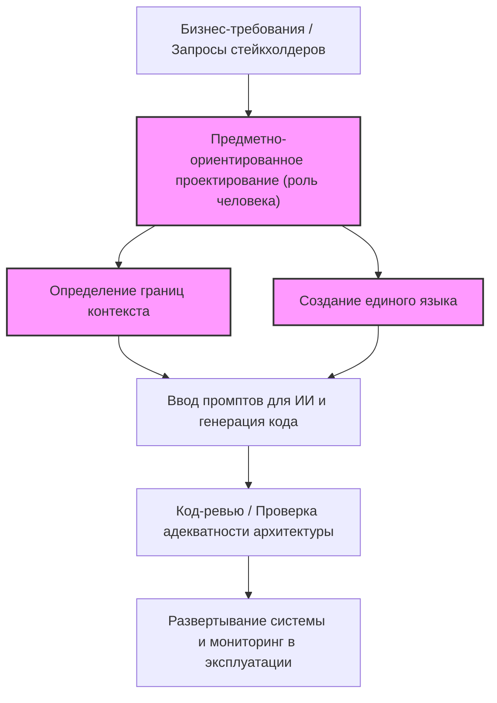
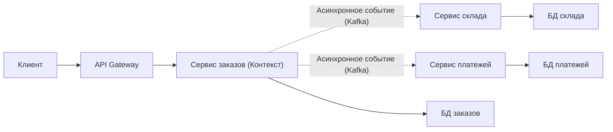
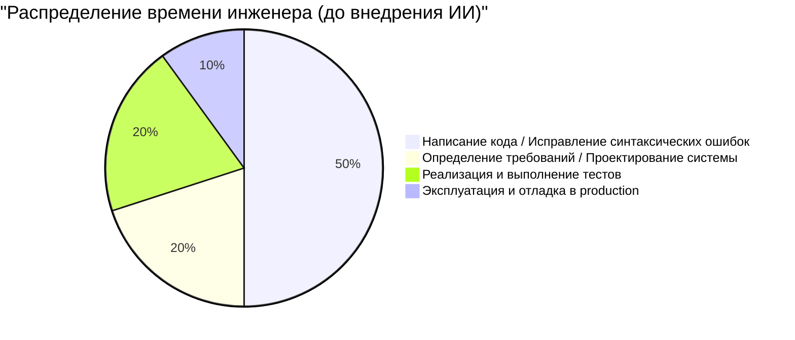
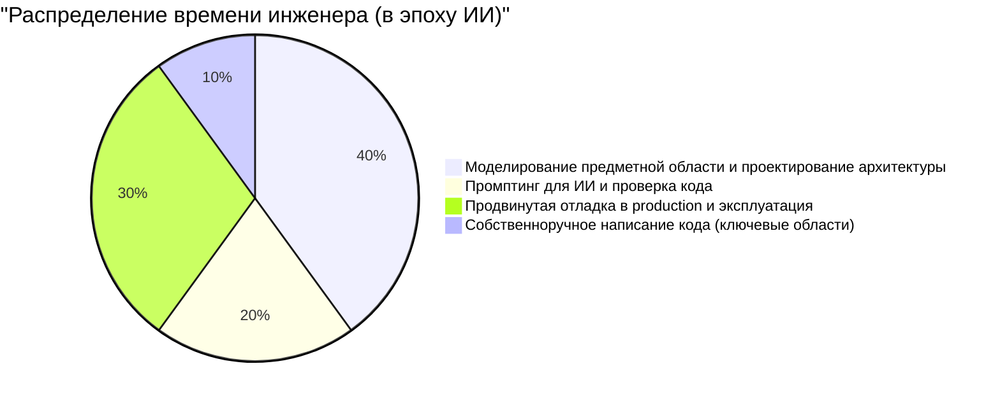

# Навыки инженера, 'присущие только человеку', востребованные в эпоху, когда ИИ пишет код

В последние годы благодаря стремительному развитию Generative AI (генеративного ИИ) и крупных языковых моделей (LLM) ландшафт программной инженерии кардинально изменился. GitHub Copilot и различные ИИ-ассистенты для написания кода стали использоваться повсеместно, а утверждение «ИИ мгновенно генерирует код по текстовому запросу на естественном языке» — это больше не научная фантастика из будущего, а наша сегодняшняя реальность.

В такую эпоху вполне естественно, что многие инженеры испытывают беспокойство по поводу того, что их работу может отобрать ИИ. Действительно, такие вещи, как создание шаблонного кода для типичных CRUD-приложений, реализация простых алгоритмов или вызовы API широко известных библиотек, то есть «простое написание кода» (Typing Code), стремительно коммодитизируются.

Однако суть программной инженерии заключается не в «наборе кода». Она заключается в решении бизнес-задач с помощью технологий и создании масштабируемых и поддерживаемых систем. В этой статье мы подробно и технически глубоко рассмотрим те «навыки инженера, присущие только человеку», ценность которых в эпоху ИИ только возрастает. Мы затронем такие аспекты, как технические ограничения LLM, предметно-ориентированное проектирование (DDD), системная архитектура и отладка распределенных систем.

---

## 1. Понимание структурных ограничений крупных языковых моделей (LLM)

Чтобы правильно оценить возможности ИИ и определить, в каких именно областях человек должен применять свои навыки, сначала необходимо понять структурные ограничения ИИ (и особенно LLM) с математической и архитектурной точек зрения.

### 1.1 Ограничения вычислительной сложности и контекста в архитектуре Transformer

Большинство современных LLM основаны на архитектуре Transformer, представленной Google в 2017 году. Ядром Transformer является «механизм внутреннего внимания» (Self-Attention Mechanism). Этот механизм вычисляет, насколько каждый токен во входной последовательности связан со всеми остальными токенами.

Формула вычисления внимания выглядит следующим образом:

$$ \text{Attention}(Q, K, V) = \text{softmax}\left(\frac{QK^T}{\sqrt{d_k}}\right)V $$

Где $Q$ (Query), $K$ (Key) и $V$ (Value) — это линейные преобразования входной последовательности, а $d_k$ — размерность ключей.
Самым значительным ограничением в этом вычислении является сложность, связанная с матричным умножением $QK^T$. Если длина входной последовательности (количество токенов) равна $N$, то вычислительная сложность, как по времени, так и по памяти (в пространстве), возрастает с порядком $O(N^2)$.

$$ \text{Complexity} = O(N^2 \cdot d) $$

В последние годы ведутся исследования по оптимизации на аппаратном уровне, такие как FlashAttention, а также над альтернативными архитектурами, способными обрабатывать данные за линейное время $O(N)$ (например, Sparse Attention и Mamba - State Space Models). Тем не менее, по-прежнему крайне сложно «полностью осознать бесконечный контекст и сгенерировать глобально оптимизированный результат».

Кроме того, даже если физически расширить окно контекста, возникает явление, известное как Lost in the Middle (потеря информации в середине). LLM склонны сильно реагировать на информацию в начале и конце промпта и игнорировать важные требования или ограничения, расположенные в его середине. Именно поэтому, если загрузить в LLM весь исходный код корпоративной системы из десятков тысяч строк и попросить «сделать оптимальный рефакторинг», сгенерированный код будет локально корректным, но глобально разрушенным.

### 1.2 Особенности вероятностных генеративных моделей и «галлюцинации»

По своей сути, LLM — это «вероятностная генеративная модель», которая предсказывает следующий наиболее вероятный токен на основе входного контекста (промпта) и ранее сгенерированных результатов.

$$ P(w_t | w_{1:t-1}) = \text{softmax}(W \cdot h_t) $$

Модель просто выучила «статистическую совместную встречаемость слов» из огромных объемов обучающих данных; она не понимает ни «смысла» (Semantics) генерируемого кода, ни «последствий его выполнения в реальном мире». В результате возникают «галлюцинации» (Hallucinations).
Баги, такие как вызовы несуществующих библиотечных функций или передача переменных со слегка несовпадающими типами, являются лишь результатом того, что LLM сгенерировала «грамматически правдоподобную (вероятную) последовательность токенов».

### 1.3 Отсутствие заземления (Grounding) в реальном мире

ИИ не обладает способностью интуитивно понимать физические ограничения или ограничения реального бизнеса (Grounding). Например, ИИ не может учитывать такие неявные знания, как «если задержка обработки платежа увеличится на 100 мс, конверсия упадет на 5%» или «в 2 часа ночи на этой устаревшей БД запускается пакетная обработка, поэтому транзакции в это время часто отваливаются по таймауту», пока они не будут явно заданы в виде текста.

Учитывая эти технические и структурные ограничения, становится ясно, что ИИ является отличным инструмент для «быстрой генерации кода в четко определенных и узких рамках (функция, класс, модуль)». Однако «проектирование всей системы на основе расплывчатых требований с учетом ограничений реального мира» — это область, доступная исключительно человеку.

---

## 2. Навыки, присущие человеку ①: Извлечение «истинной проблемы» из расплывчатых требований

Самым сложным этапом в разработке программного обеспечения является не само написание кода.
Фредерик Брукс, автор классического труда по программной инженерии «Мифический человеко-месяц», сказал следующее:

> "The hardest single part of building a software system is deciding precisely what to build."
> (Самая трудная часть при создании программной системы — это точно решить, что именно нужно построить.)

Нетехнические стейкхолдеры (руководство, отдел продаж, клиенты) в большинстве случаев не могут четко сформулировать, чего они на самом деле хотят. Повседневной реальностью являются крайне расплывчатые и противоречивые требования вроде «Сделайте мне систему с ИИ, чтобы увеличить продажи» или «Я хочу экран, на котором все автоматизируется одним нажатием кнопки».

Если вы введете в ИИ промпт «Напиши код для системы, которая увеличивает продажи», на выходе вы не получите полезную систему. От инженера требуется следующий процесс:

1. **Глубокое изучение предметной области**: В процессе диалога выявить «истинную бизнес-проблему», скрытую за словами стейкхолдеров.
2. **Определение рамок требований**: Взвесить техническую осуществимость и затраты (ROI), чтобы решить, чего «делать не следует».
3. **Формализация спецификаций**: Преобразовать расплывчатые требования в четкие логические ограничения (промпты или архитектурные схемы), понятные для ИИ.

Этот процесс высокоуровневой коммуникации и переговоров между людьми — ценный навык, зависящий от человеческого фактора, который ИИ никогда не сможет заменить.

---

## 3. Навыки, присущие человеку ②: Предметно-ориентированное проектирование (DDD) и моделирование

После выявления требований самым мощным инструментом для их интеграции в структуру программного обеспечения является «предметно-ориентированное проектирование» (Domain-Driven Design: DDD). По мере того, как ИИ всё больше берет на себя автоматическую генерацию локального кода, концепция DDD, определяющая, где проводить «границы» внутри всей системы, становится чрезвычайно важной.

### 3.1 Создание единого языка (Ubiquitous Language)

При разработке системы, если бизнес-сторона и разработчики по-разному понимают смысл слов, ИИ сгенерирует код в неправильном контексте. Например, слово «Пользователь» может означать «лида (потенциального клиента)» для отдела маркетинга и «аккаунт с заключенным договором» для службы поддержки.
Инженеры-люди должны определить «единый язык», который будет использоваться в рамках всего проекта, и обеспечить его строгое соблюдение повсюду: от имен классов и методов в коде до промптов для ИИ.

### 3.2 Проектирование ограниченных контекстов (Bounded Context)

Попытка описать огромную систему с помощью одной-единственной модели неизбежно приведет к провалу. В рамках DDD система разделяется на смысловые границы (Bounded Context).
Например, на сайте электронной коммерции концепция «Товара» (Product) в контексте каталога (отображения) и в контексте склада (управления) будет иметь совершенно разные атрибуты и поведение.

Только тогда, когда человек-архитектор проводит правильные границы контекстов и передает ИИ независимые промпты и спецификации для каждого контекста, ИИ способен генерировать код, основанный на правильных знаниях предметной области.

На диаграмме ниже показан подход к DDD и распределение ролей в эпоху ИИ.

Вместо того чтобы давать ИИ указание «создать всю систему», следует поручить ИИ реализацию строго в рамках «границ контекста», определенных человеком. Это станет базовой парадигмой разработки программного обеспечения в будущем.

---

## 4. Навыки, присущие человеку ③: Проектирование архитектуры и масштабирование распределенных систем

Современное программное обеспечение эволюционировало от монолитов, работающих на одном сервере, до облачных микросервисных архитектур и архитектур, управляемых событиями. Проектирование таких распределенных систем — это область, в которой ИИ, способный оптимизировать только локальную логику, сталкивается с огромными трудностями.

### 4.1 Теорема CAP и оценка компромиссов

При проектировании распределенной системы инженеры постоянно сталкиваются с «теоремой CAP». Теорема CAP — это принцип, согласно которому распределенная система может одновременно обеспечивать только два из следующих трех свойств:

- **Consistency (Согласованность)**: Видят ли все узлы одновременно одни и те же данные?
- **Availability (Доступность)**: Будет ли система продолжать отвечать на запросы, даже если часть узлов выйдет из строя?
- **Partition Tolerance (Устойчивость к разделению)**: Будет ли система продолжать работать в случае разделения сети?

$$ P(\text{Availability} \cup \text{Consistency}) | \text{PartitionTolerance} $$

Поскольку в реальных сетях разделения (Partition) неизбежны, инженеры должны принимать жесткие компромиссные решения, напрямую связанные с бизнес-требованиями. Например, «Эта платежная система отдает приоритет Consistency, поэтому в случае сбоя сервис будет остановлен (CP)» или «Эта лента социальной сети отдает приоритет Availability, поэтому допускается временная несогласованность данных (AP)».

Хотя ИИ может написать код, отдающий приоритет C, или код, отдающий приоритет A, он не может автономно принимать решения, сопряженные с бизнес-рисками, относительно того, «чему именно следует отдать приоритет».

### 4.2 Асинхронная коммуникация и итоговая согласованность (Eventual Consistency)

По мере роста масштабов системы взаимодействие между сервисами переходит от синхронной связи через REST API к асинхронной связи с использованием очередей сообщений (Kafka, RabbitMQ и т. д.). Согласованность данных в этом случае смещается от немедленной согласованности к «итоговой согласованности» (Eventual Consistency).
В какой момент следует внедрять сложные архитектурные шаблоны, такие как Saga или CQRS (Command Query Responsibility Segregation)? Принятие этих комплексных решений и создание чертежа всей системы — это истинное предназначение Senior-инженера.

---

## 5. Навыки, присущие человеку ④: Отладка сложных систем и устранение неполадок

Чем больше кода генерирует ИИ, тем выше риск того, что в производственной среде будет работать «код, который никто до конца не понимает». Даже если в обычное время всё работает без проблем, истинная ценность инженера-человека проявляется при устранении неполадок во время сбоев.

### 5.1 Проектирование наблюдаемости (Observability)

Чтобы быстро устранять системные сбои, недостаточно просто вставить лог ошибок в ИИ. В микросервисной среде один запрос может проходить через десятки сервисов.
Инженерам необходимо грамотно интегрировать в систему «три столпа наблюдаемости»: логи (Logs), метрики (Metrics) и трассировки (Traces). Использование таких инструментов, как OpenTelemetry, для создания инфраструктуры, позволяющей с помощью распределенной трассировки определить, «в каком сервисе и в каком запросе к базе данных возникла задержка», — это задача человека.

### 5.2 Зависящие от окружения баги и хаос-инженерия

«Баги, которые не воспроизводятся в локальной или тестовой среде, но появляются только в часы пик в производственной среде» — например, утечки памяти, взаимоблокировки баз данных (deadlocks), исчерпание пула соединений или потеря пакетов в сети — всё это невозможно обнаружить с помощью лишь статического анализа исходного кода.

Инженеры-люди выдвигают гипотезы, глядя на метрики в производственной среде, анализируют дампы потоков (thread dumps) и дампы кучи (heap dumps), и находят узкие места. ИИ не может напрямую профилировать процессы рабочего сервера через терминал (и это не должно разрешаться по соображениям безопасности).
Чем сложнее становится система, тем стремительнее растет ценность инженеров, обладающих низкоуровневыми знаниями о физической инфраструктуре, сетевых протоколах и настройке ядра ОС, а также интуитивной способностью строить гипотезы.

---

## 6. Функция ценности и распределение времени инженера в эпоху ИИ

Как обсуждалось выше, набор навыков, требуемых от инженеров в эпоху ИИ, претерпевает кардинальную смену парадигмы. Если смоделировать это с помощью формулы, то ценность ($V$), создаваемую инженером, можно выразить следующим образом:

$$ V = \left( \sum_{i=1}^{n} \text{DomainKnowledge}_i + \text{ArchitectureSkill} + \text{ProblemSolving} \right) \times \text{AI\_Leverage}^{\alpha} $$

Традиционные показатели, такие как скорость написания кода или запоминание синтаксиса, в этой формуле отсутствуют. Вместо этого сумма глубоких знаний предметной области, навыков архитектурного проектирования и способности решать сложные задачи, умноженная на плечо использования ИИ ($\text{AI\_Leverage}^{\alpha}$), создает экспоненциальную ценность.

Этот сдвиг парадигмы также четко отражается в распределении повседневного времени инженера (тайм-аллокации).

В эпоху ИИ инженер превращается из «машинистки по набору кода» в «дирижера, который управляет всей системой». Именно потому, что ИИ пишет огромные объемы кода, роль «рецензента» и «архитектора», который контролирует и отслеживает правильность направления кода, соответствие требованиям безопасности и согласованность с архитектурой всей системы, становится необходимой для всех инженеров, от junior до senior.

---

## 7. Заключение: не сопротивляйтесь эволюции, а оседлайте волну

«Эпоха, когда ИИ пишет код» — это не угроза для инженеров, а величайшая возможность в истории. Точно так же, как некогда произошел переход от ассемблера к языку C, или от ручного управления указателями памяти к сборке мусора (Garbage Collection) в Java, генерация кода с помощью ИИ — это всего лишь «переход на один уровень абстракции выше».

Инженерам будущего не нужно будет беспокоиться о мельчайших деталях спецификаций конкретного языка программирования или об обновлении версий фреймворков. Вместо этого они смогут сосредоточить свои ресурсы на решении более фундаментальных, присущих только человеку высокоуровневых задач: **«Какова бизнес-проблема?», «Как разделить и связать данные?», «Как быстро восстановиться в случае остановки системы?»**.

Настоящий инженер — это не тот, кто пишет код, а тот, кто решает проблемы.
Моделирование предметной области, проектирование масштабируемой архитектуры, коммуникация со стейкхолдерами и отладка сложных систем — для тех, кто продолжает оттачивать эти «навыки инженера, присущие только человеку», ИИ станет не врагом, отбирающим работу, а мощнейшим партнером, способным многократно расширить их креативность и продуктивность.
