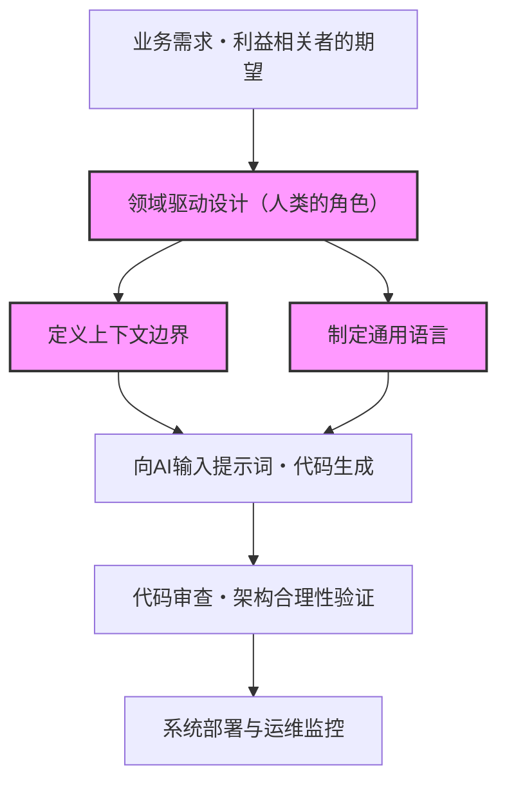
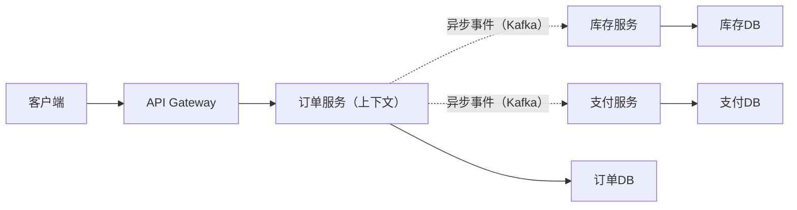
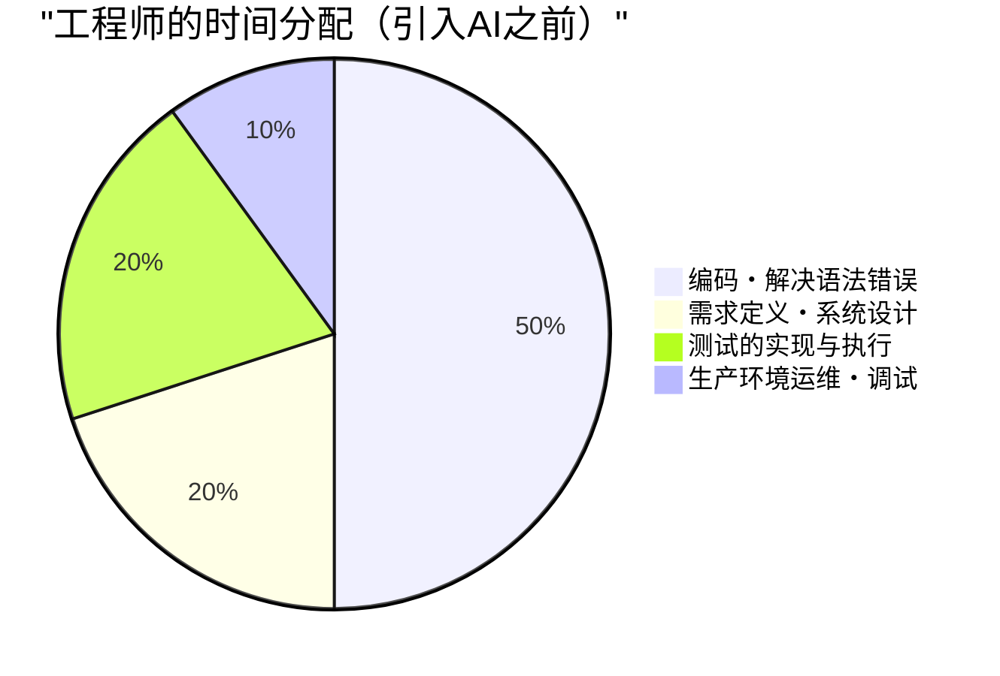
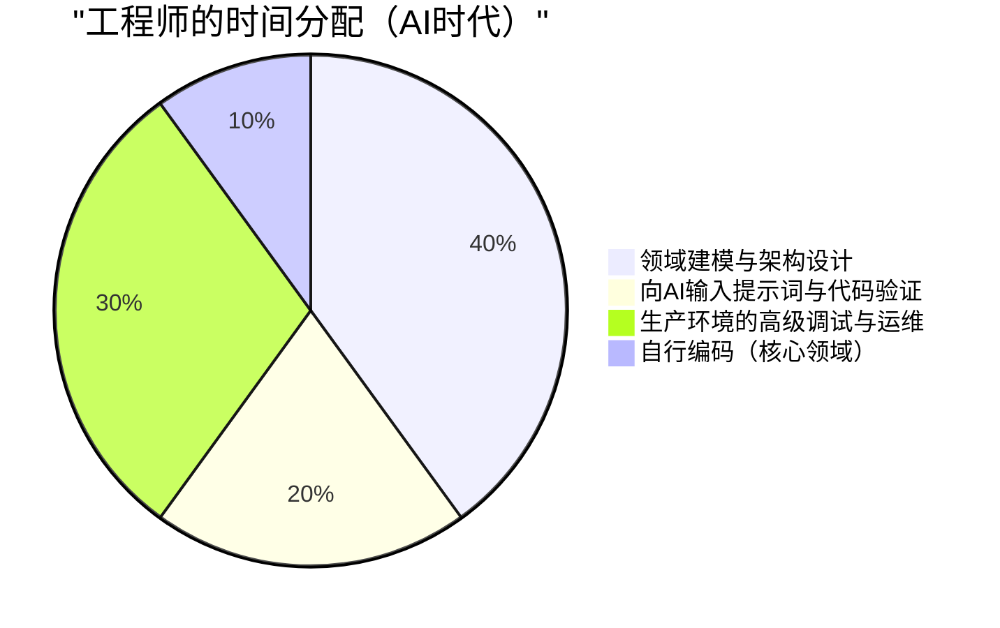

# AI编写代码时代所需的「人类特有的工程师技能」

近年来，随着生成式AI（Generative AI）和大型语言模型（LLM）的飞跃性进展，软件工程的格局发生了剧烈的变化。GitHub Copilot和各种AI编程助手已经成为日常工具，“用自然语言下达指令，AI瞬间生成代码”这种现象，早已不再是未来的科幻，而是今天的现实。

在这样的时代，许多工程师会自然而然地产生“我的工作会不会被AI夺走？”的焦虑。的确，编写常规的CRUD应用程序的样板代码、实现简单的算法，或是调用熟知的库API，这类“单纯的编码工作（Typing Code）”正在迅速商品化。

然而，软件工程的本质并不是“敲击代码”。它是通过技术来解决业务问题，并构建可扩展、可维护的系统。在本文中，我们将探讨在AI编写代码的时代价值反而会提升的“人类特有的工程师技能”，并从LLM的技术局限性、领域驱动设计（DDD）、系统架构、分布式系统的调试等角度，进行极为详细且具有技术深度的考察。

---

## 1. 理解大型语言模型（LLM）的结构性局限

为了正确评估AI的能力，并看清人类应该在哪些领域发挥价值，我们首先必须从数学和架构的角度理解AI（特别是LLM）的结构性局限。

### 1.1 Transformer架构中的计算量与上下文限制

目前大多数的LLM都基于Google在2017年发布的“Transformer”架构。Transformer的核心在于“自注意力机制（Self-Attention Mechanism）”。自注意力机制会计算输入序列中的每个Token与所有其他Token之间的相关程度。

这种注意力的计算公式可以表示如下：

$$ \text{Attention}(Q, K, V) = \text{softmax}\left(\frac{QK^T}{\sqrt{d_k}}\right)V $$

这里，$Q$（Query）、$K$（Key）、$V$（Value）是输入序列的线性变换，而$d_k$是键的维度数。
在这个计算中，最大的制约因素就是矩阵乘法 $QK^T$ 所带来的计算量。如果将输入序列（Token数）设为 $N$，这个计算量在时间上和空间（内存）上都会以 $O(N^2)$ 的复杂度增长。

$$ \text{Complexity} = O(N^2 \cdot d) $$

近年来，尽管出现了像FlashAttention这样的硬件级优化，以及Sparse Attention，甚至是Mamba（状态空间模型，State Space Models）等可以在线性时间 $O(N)$ 内处理的替代架构的研究，但要“完全理解无限的上下文并生成全局最优化的输出”仍然极其困难。

此外，即使能够物理上扩大上下文窗口，也会发生所谓的“迷失在中间（Lost in the Middle）”现象。LLM很容易受到提示词开头和结尾信息的强烈影响，而倾向于忽略放置在中间的重要需求或约束。如果让LLM读取数万行的企业级系统源代码并指示它“进行最佳重构”，生成的代码往往局部正确但在全局上却是崩溃的，这就是原因所在。

### 1.2 概率生成模型的特性与“幻觉”

LLM的本质是一个“概率生成模型”，它根据输入的上下文（提示词）和之前的生成结果，预测下一个出现概率最高的Token。

$$ P(w_t | w_{1:t-1}) = \text{softmax}(W \cdot h_t) $$

模型仅仅是从海量的训练数据中学习到了“词语的统计共现关系”，并不理解所生成代码的“语义（Semantics）”或“执行结果在现实世界中的影响”。由此产生的就是“幻觉（Hallucination）”。
调用不存在的虚构库函数，或者传递类型存在细微差异的变量，这些Bug只不过是LLM生成了“语法上看起来很像（概率很高）的Token序列”的结果而已。

### 1.3 缺乏现实世界的落地能力（Grounding）

AI缺乏凭直觉理解“物理限制”或“实际业务约束”的能力（Grounding）。例如，“如果支付处理的延迟增加100ms，转化率就会下降5%”这样的业务现实，或者“这个遗留数据库会在深夜2点运行批处理，因此这个时间段的事务很容易超时”这种特定环境的隐性知识，如果不明确地以文本形式提供给AI，它是无法考虑到的。

考虑到这些技术和结构上的局限性，我们可以看出，AI作为“快速生成具有明确定义的狭窄范围（函数、类、模块）代码的工具”是极其优秀的，但是“从模糊的需求中设计出整个系统，并与现实世界的限制相契合”依然是只有人类才能完成的领域。

---

## 2. 人类特有的技能①：从模糊的要求中提取“真正的问题”

软件开发中最大的难关并不是编写代码本身。
软件工程经典著作《人月神话》的作者Frederick Brooks曾这样说过：

> "The hardest single part of building a software system is deciding precisely what to build."
> （构建软件系统最困难的单一环节，就是准确决定要构建什么。）

非技术利益相关者（管理层、销售部门、客户）在大多数情况下无法用语言表达他们真正想要的东西。“希望能用AI做一个提高销售额的系统”、“想要一个只需按一个按钮就能自动完成所有的界面”，像这种极其模糊且充满矛盾的要求在日常工作中比比皆是。

即使你在提示词中向AI输入“写一个提高销售额的系统的代码”，它也给不出能用的系统。工程师需要完成以下流程：

1. **深度挖掘领域知识**：通过对话，从利益相关者的话语背后挖掘出“真正的业务问题”。
2. **定义需求范围**：权衡技术可行性和成本（ROI），决定“不做什么”。
3. **形式化规范**：将模糊的要求转化为AI能够理解的明确的逻辑约束（提示词或架构设计图）。

这种“人与人之间的高级沟通与谈判”，是AI绝对无法替代的、依赖于人的、具有高价值的技能。

---

## 3. 人类特有的技能②：领域驱动设计（DDD）与建模

在提取出需求之后，将其落实到软件结构中最强大的武器就是“领域驱动设计（Domain-Driven Design: DDD）”。AI越是能自动生成局部代码，如何划分系统整体的“边界”这一DDD概念就越显得至关重要。

### 3.1 制定通用语言（Ubiquitous Language）

在系统开发中，如果业务方和开发方对“词语含义”的理解存在偏差，AI就会在错误的上下文中生成代码。例如，“用户”这个词，对于市场营销部门可能指的是“线索（潜在客户）”，而对于客户支持部门可能指的是“已签约账号”。
人类工程师需要在整个项目中制定统一的“通用语言”，并确保在代码的类名、方法名，乃至给AI的提示词中贯彻这门语言。

### 3.2 设计上下文边界（Bounded Context）

如果试图用一个模型来表达巨大的系统，必然会走向崩溃。在DDD中，系统被划分为有意义的边界（Bounded Context）。
例如，在电商网站中，“商品（Product）”这个概念，在目录（展示）上下文和库存（管理）上下文中，所应该拥有的属性和行为是完全不同的。

只有人类架构师划定正确的上下文边界，并为每个上下文向AI提供独立的提示词和规范，AI才能够生成“基于正确领域知识的代码”。

下图展示了AI时代DDD的方法与角色分工。

不是指示AI“去构建整个系统”，而是限定在人类定义的“上下文边界”内部，将实现工作委托给AI。这将成为未来软件开发的基本范式。

---

## 4. 人类特有的技能③：分布式系统的架构设计与扩展

现代软件正在从运行在单一服务器上的单体架构，向云原生的微服务架构和事件驱动架构演进。对于只能进行局部逻辑优化的AI来说，设计这种分布式系统是一个非常困难的领域。

### 4.1 CAP定理与权衡判断

在设计分布式系统时，工程师始终要面临“CAP定理”。CAP定理指出，分布式系统在以下三个特性中，同时只能满足两个。

- **Consistency（一致性）**: 所有节点在同一时间是否能看到相同的数据
- **Availability（可用性）**: 即使部分节点发生故障，系统是否还能继续响应
- **Partition Tolerance（分区容错性）**: 在网络发生分区时，系统是否还能继续运行

$$ P(\text{Availability} \cup \text{Consistency}) | \text{PartitionTolerance} $$

在实际网络中，网络分区（Partition）是不可避免的，因此工程师必须做出直接关系到业务需求的严苛的权衡判断，例如“这个支付系统优先考虑一致性（Consistency），在发生故障时停止服务（CP）”，“这个社交网络的动态消息优先考虑可用性（Availability），容忍短暂的数据不一致（AP）”。

AI也许能写出“优先考虑C的代码”或“优先考虑A的代码”，但它无法自主决定“应该优先考虑哪一个”这种包含业务风险的决策。

### 4.2 异步通信与最终一致性（Eventual Consistency）

当系统规模变大时，服务间的协同将从通过REST API进行的同步通信，转变为使用消息队列（Kafka, RabbitMQ等）的异步通信。此时数据的一致性也从强一致性转变为“最终一致性（Eventual Consistency）”。
应该在什么时候引入Saga模式或CQRS（Command Query Responsibility Segregation，命令查询职责分离）等高级架构模式？做出这些复杂的决策并描绘系统整体的蓝图，正是高级工程师的真正价值所在。

---

## 5. 人类特有的技能④：复杂系统的调试与故障排查

AI生成的代码越多，生产环境中运行“没有人完全理解的代码”的风险就越高。平时也许运行得毫无问题，但在发生故障进行排查时，才真正考验人类工程师的价值。

### 5.1 可观测性（Observability）的设计

为了迅速解决系统故障，仅仅向AI粘贴错误日志是不够的。在微服务环境中，一个请求会跨越数十个服务。
工程师必须在系统中适当地内置“可观测性的三大支柱”：日志（Logs）、指标（Metrics）和追踪（Traces）。利用OpenTelemetry等工具，通过分布式追踪建立起能精确定位“在哪个服务的哪个数据库查询中发生了延迟”的基础设施，这是人类的角色。

### 5.2 环境依赖的Bug与混沌工程

“在本地环境或测试环境中无法重现，但仅在生产环境的流量高峰期发生的Bug”——例如内存泄漏、数据库死锁、连接池耗尽、网络丢包等问题，是绝对无法仅靠对源代码的静态分析发现的。

人类工程师需要一边紧盯生产环境的指标一边建立假设，通过分析线程转储或堆转储来定位瓶颈。AI不能直接敲击终端去分析生产服务器的进程（从安全要求来看也不应被允许）。
系统越是复杂，拥有物理基础设施、网络协议、OS内核调优等“底层知识”和“直觉性的假设推演能力”的工程师的价值就越会飙升。

---

## 6. AI时代工程师的价值函数与时间分配

正如上文所述，在AI时代，工程师所需的技能栈正在发生巨大的范式转移。如果用数学公式来建模，工程师所创造的价值（$V$）可以表示如下：

$$ V = \left( \sum_{i=1}^{n} \text{DomainKnowledge}_i + \text{ArchitectureSkill} + \text{ProblemSolving} \right) \times \text{AI\_Leverage}^{\alpha} $$

传统的“编码速度”和“对语法的记忆力”已经从这个公式中被排除了。取而代之的是，深厚的领域知识、架构设计能力以及解决复杂问题的能力的“总和”，乘上驾驭AI的杠杆率（$\text{AI\_Leverage}^{\alpha}$），形成了一种能够产生指数级价值的结构。

这种范式转移，也会清晰地体现在工程师日常的时间分配（Time Allocation）上。

在AI时代，工程师将从“代码打字员”升华为“编排整个系统的指挥家”。正因为AI会编写大量的代码，所以才更需要监督和控制这些代码是否方向正确、是否满足安全要求、是否与整体架构保持一致。作为“审查者”和“架构师”的角色，将成为从初级到高级的所有工程师都必须具备的素质。

---

## 7. 结语：与其拒绝进化，不如驾驭浪潮

“AI编写代码的时代”对工程师来说不是威胁，而是历史上最大的机遇。就像曾经发生过从汇编语言到C语言的过渡，以及从手动管理内存指针到Java的垃圾回收的进化一样，AI生成代码仅仅是“抽象的层级又提高了一层”而已。

未来的工程师，不再需要为特定编程语言的细节规范或框架的版本更新而患得患失，而是可以将资源集中在**“业务的问题是什么”、“数据该如何划分以及如何协同”、“系统宕机时如何快速恢复”**等更具本质性、更具人类高级属性的问题解决上。

真正的工程师，不是写代码的人，而是解决问题的人。
领域建模、可扩展架构设计、与利益相关者的沟通，以及对复杂系统的调试。对于不断磨练这些“人类特有的工程师技能”的人来说，AI绝不是夺走工作的敌人，而是能将自己的创造力和生产力扩展数十倍的最强伙伴。
